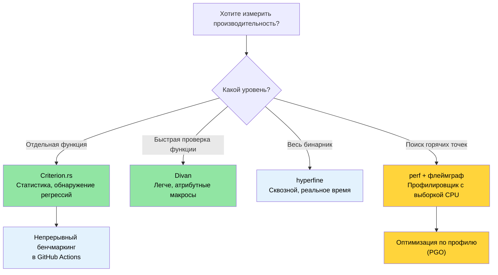

# Бенчмаркинг — измеряем то, что важно 🟡

> **Чему вы научитесь:**
> - Почему наивный замер через `Instant::now()` даёт ненадёжные результаты
> - Статистический бенчмаркинг с Criterion.rs и более лёгкой альтернативой — Divan
> - Профилирование горячих точек с помощью `perf`, флеймграфов и PGO
> - Настройка непрерывного бенчмаркинга в CI для автоматического обнаружения регрессий
>
> **Перекрёстные ссылки:** [Профили релиза](ch07-release-profiles-and-binary-size.md) — когда горячая точка найдена, оптимизируйте бинарник · [CI/CD-конвейер](ch11-putting-it-all-together-a-production-cic.md) — джоба с бенчмарками в конвейере · [Покрытие кода](ch04-code-coverage-seeing-what-tests-miss.md) — покрытие показывает, что протестировано, а бенчмарки — что работает быстро

«Мы должны забыть о мелкой эффективности примерно в 97% случаев: преждевременная
оптимизация — корень всех зол. Однако не стоит упускать возможности в тех критических
3%.» — Дональд Кнут

Самое трудное — не *написать* бенчмарки, а написать такие, которые дают **осмысленные,
воспроизводимые и пригодные для действий** числа. Эта глава описывает инструменты и приёмы,
которые переводят вас от фразы «кажется, быстро» к «у нас есть статистическое подтверждение,
что PR #347 снизил пропускную способность парсинга на 4,2%».

### Почему не `std::time::Instant`?

Соблазн:

```rust
// ❌ Наивный бенчмарк — ненадёжные результаты
use std::time::Instant;

fn main() {
    let start = Instant::now();
    let result = parse_device_query_output(&sample_data);
    let elapsed = start.elapsed();
    println!("Разбор занял {:?}", elapsed);
    // Проблема 1: компилятор может оптимизировать `result` (исключение мёртвого кода)
    // Проблема 2: одно измерение — нет статистической значимости
    // Проблема 3: масштабирование частоты CPU, тепловое ограничение, другие процессы
    // Проблема 4: холодный и горячий кеш не контролируются
}
```

Проблемы ручного замера:
1. **Исключение мёртвого кода** — компилятор может вообще пропустить вычисление, если
   результат не используется.
2. **Нет прогрева** — первый запуск включает промахи кеша, ошибки страниц ОС и ленивую
   инициализацию. (JIT-эффекты к Rust неприменимы, а вот ошибки страниц ОС — применимы.)
3. **Нет статистического анализа** — одно измерение ничего не говорит о разбросе,
   выбросах или доверительных интервалах.
4. **Нет обнаружения регрессий** — нельзя сравнить с предыдущими запусками.

### Criterion.rs — статистический бенчмаркинг

[Criterion.rs](https://bheisler.github.io/criterion.rs/book/) — де-факто стандарт
для микробенчмарков в Rust. Он использует статистические методы, чтобы получать надёжные
измерения, и автоматически обнаруживает регрессии производительности.

**Настройка:**

```toml
# Cargo.toml
[dev-dependencies]
criterion = { version = "0.5", features = ["html_reports", "cargo_bench_support"] }

[[bench]]
name = "parsing_bench"
harness = false  # Используем harness Criterion, а не встроенный тестовый harness
```

**Полный бенчмарк:**

```rust
// benches/parsing_bench.rs
use criterion::{black_box, criterion_group, criterion_main, Criterion, BenchmarkId};

/// Тип данных для разобранной информации о GPU
#[derive(Debug, Clone)]
struct GpuInfo {
    index: u32,
    name: String,
    temp_c: u32,
    power_w: f64,
}

/// Тестируемая функция — имитирует разбор CSV-вывода device-query
fn parse_gpu_csv(input: &str) -> Vec<GpuInfo> {
    input
        .lines()
        .filter(|line| !line.starts_with('#'))
        .filter_map(|line| {
            let fields: Vec<&str> = line.split(", ").collect();
            if fields.len() >= 4 {
                Some(GpuInfo {
                    index: fields[0].parse().ok()?,
                    name: fields[1].to_string(),
                    temp_c: fields[2].parse().ok()?,
                    power_w: fields[3].parse().ok()?,
                })
            } else {
                None
            }
        })
        .collect()
}

fn bench_parse_gpu_csv(c: &mut Criterion) {
    // Репрезентативные тестовые данные
    let small_input = "0, Acme Accel-V1-80GB, 32, 65.5\n\
                       1, Acme Accel-V1-80GB, 34, 67.2\n";

    let large_input = (0..64)
        .map(|i| format!("{i}, Acme Accel-X1-80GB, {}, {:.1}\n", 30 + i % 20, 60.0 + i as f64))
        .collect::<String>();

    c.bench_function("parse_2_gpus", |b| {
        b.iter(|| parse_gpu_csv(black_box(small_input)))
    });

    c.bench_function("parse_64_gpus", |b| {
        b.iter(|| parse_gpu_csv(black_box(&large_input)))
    });
}

criterion_group!(benches, bench_parse_gpu_csv);
criterion_main!(benches);
```

**Запуск и чтение результатов:**

```bash
# Запустить все бенчмарки
cargo bench

# Запустить конкретный бенчмарк по имени
cargo bench -- parse_64

# Вывод:
# parse_2_gpus        time:   [1.2345 µs  1.2456 µs  1.2578 µs]
#                      ▲            ▲           ▲
#                      │       доверительный интервал
#                   нижняя 95%   медиана   верхняя 95%
#
# parse_64_gpus       time:   [38.123 µs  38.456 µs  38.812 µs]
#                     change: [-1.2345% -0.5678% +0.1234%] (p = 0.12 > 0.05)
#                     No change in performance detected.
```

**Что делает `black_box()`**: это подсказка компилятору, которая не даёт исключить мёртвый
код и слишком агрессивно сворачивать константы. Компилятор не может «заглянуть» сквозь
`black_box`, поэтому ему приходится действительно вычислить результат.

### Параметризованные бенчмарки и группы бенчмарков

Сравнение нескольких реализаций или размеров входных данных:

```rust
// benches/comparison_bench.rs
use criterion::{criterion_group, criterion_main, Criterion, BenchmarkId, Throughput};

fn bench_parsing_strategies(c: &mut Criterion) {
    let mut group = c.benchmark_group("csv_parsing");

    // Тестируем на разных размерах входных данных
    for num_gpus in [1, 8, 32, 64, 128] {
        let input = generate_gpu_csv(num_gpus);

        // Задаём пропускную способность для отчёта в байтах в секунду
        group.throughput(Throughput::Bytes(input.len() as u64));

        group.bench_with_input(
            BenchmarkId::new("split_based", num_gpus),
            &input,
            |b, input| b.iter(|| parse_split(input)),
        );

        group.bench_with_input(
            BenchmarkId::new("regex_based", num_gpus),
            &input,
            |b, input| b.iter(|| parse_regex(input)),
        );

        group.bench_with_input(
            BenchmarkId::new("nom_based", num_gpus),
            &input,
            |b, input| b.iter(|| parse_nom(input)),
        );
    }
    group.finish();
}

criterion_group!(benches, bench_parsing_strategies);
criterion_main!(benches);
```

**Вывод**: Criterion создаёт HTML-отчёт `target/criterion/report/index.html` с violin-графиками,
сравнительными диаграммами и анализом регрессий — откройте его в браузере.

### Divan — более лёгкая альтернатива

[Divan](https://github.com/nvzqz/divan) — более новый фреймворк для бенчмаркинга, который
использует атрибутные макросы вместо DSL-макросов Criterion:

```toml
# Cargo.toml
[dev-dependencies]
divan = "0.1"

[[bench]]
name = "parsing_bench"
harness = false
```

```rust
// benches/parsing_bench.rs
use divan::black_box;

const SMALL_INPUT: &str = "0, Acme Accel-V1-80GB, 32, 65.5\n\
                          1, Acme Accel-V1-80GB, 34, 67.2\n";

fn generate_gpu_csv(n: usize) -> String {
    (0..n)
        .map(|i| format!("{i}, Acme Accel-X1-80GB, {}, {:.1}\n", 30 + i % 20, 60.0 + i as f64))
        .collect()
}

fn main() {
    divan::main();
}

#[divan::bench]
fn parse_2_gpus() -> Vec<GpuInfo> {
    parse_gpu_csv(black_box(SMALL_INPUT))
}

#[divan::bench(args = [1, 8, 32, 64, 128])]
fn parse_n_gpus(n: usize) -> Vec<GpuInfo> {
    let input = generate_gpu_csv(n);
    parse_gpu_csv(black_box(&input))
}

// Вывод Divan — аккуратная таблица:
// ╰─ parse_2_gpus   fastest  │ slowest  │ median   │ mean     │ samples │ iters
//                   1.234 µs │ 1.567 µs │ 1.345 µs │ 1.350 µs │ 100     │ 1600
```

**Когда выбирать Divan вместо Criterion:**
- Проще API (атрибутные макросы, меньше шаблонного кода)
- Быстрее компиляция (меньше зависимостей)
- Хорошо подходит для быстрых проверок производительности во время разработки

**Когда выбирать Criterion:**
- Статистическое обнаружение регрессий между запусками
- HTML-отчёты с графиками
- Устоявшаяся экосистема, больше интеграций с CI

### Профилирование с `perf` и флеймграфами

Бенчмарки показывают *насколько быстро*, а профилирование — *куда уходит время*.

```bash
# Шаг 1: сборка с отладочной информацией (скорость release, отладочные символы)
cargo build --release
# Убедитесь, что отладочная информация доступна:
# [profile.release]
# debug = true          # Добавьте временно для профилирования

# Шаг 2: запись с помощью perf
perf record --call-graph=dwarf ./target/release/diag_tool --run-diagnostics

# Шаг 3: построение флеймграфа
# Установка: cargo install flamegraph
# Установка: cargo install addr2line --features=bin (необязательно, ускоряет cargo-flamegraph)
cargo flamegraph --root -- --run-diagnostics
# Откроется интерактивный SVG-флеймграф

# Альтернатива: perf + inferno
perf script | inferno-collapse-perf | inferno-flamegraph > flamegraph.svg
```

**Как читать флеймграф:**
- **Ширина** = время, проведённое в функции (шире = медленнее)
- **Высота** = глубина стека вызовов (выше ≠ медленнее, просто глубже)
- **Низ** = точка входа, **верх** = листовые функции, которые выполняют реальную работу
- Ищите широкие «плато» наверху — это и есть ваши горячие точки

### Оптимизация по профилю (PGO)

Profile-Guided Optimization (PGO) — техника оптимизации компилятора, которая повышает
производительность приложений, интенсивно использующих процессор. Основная идея PGO — собрать
данные о типичном выполнении программы (например, какие ветвления она выбирает чаще всего),
а затем использовать эти данные для таких оптимизаций, как инлайнинг, размещение машинного
кода, распределение регистров и т. д.

Данные о выполнении программы можно собирать двумя способами. Первый — запустить программу
под профилировщиком (например, `perf`). Второй — собрать инструментированный бинарник, то есть
бинарник со встроенным сбором данных, и запустить его. Второй способ обычно даёт более точные
данные, и именно он поддерживается rustc.

Ниже приведён пример PGO на основе инструментирования:

```bash
# Шаг 1: сборка с инструментированием
RUSTFLAGS="-Cprofile-generate=/tmp/pgo-data" cargo build --release

# Шаг 2: запуск репрезентативных рабочих нагрузок
./target/release/diag_tool --run-full   # генерирует данные профилирования

# Шаг 3: объединение данных профилирования
# Используйте llvm-profdata, соответствующий версии LLVM в rustc:
# $(rustc --print sysroot)/lib/rustlib/x86_64-unknown-linux-gnu/bin/llvm-profdata
# Или если установлен llvm-tools: rustup component add llvm-tools
llvm-profdata merge -o /tmp/pgo-data/merged.profdata /tmp/pgo-data/

# Шаг 4: пересборка с обратной связью от профилирования
RUSTFLAGS="-Cprofile-use=/tmp/pgo-data/merged.profdata" cargo build --release
# Типичный прирост: 5–20% для вычислительно нагруженного кода (парсинг, криптография, кодогенерация).
# Код, ограниченный I/O или системными вызовами (как большой проект), получит гораздо
# меньший выигрыш, потому что процессор в основном ждёт, а не выполняет горячие циклы.
```

Вместо прямого использования компилятора для PGO можно воспользоваться
[cargo-pgo](https://github.com/kobzol/cargo-pgo) — у него интуитивный интерфейс командной
строки, и он избавляет от всей ручной работы.

С `cargo-pgo` процесс оптимизации из примера выше выглядит так:

```bash
# Шаг 1: сборка с инструментированием
cargo pgo build

# Шаг 2: запуск репрезентативных рабочих нагрузок
cargo pgo run -- --run-full

# Шаг 3: пересборка с обратной связью от профилирования
cargo pgo optimize
```

Sampling PGO (SPGO) — более сложный способ выполнить PGO, зато с меньшими накладными
расходами во время выполнения по сравнению с PGO на основе инструментирования. Пока лучшее
место, чтобы почитать о нём, — [руководство по PGO для Clang](https://clang.llvm.org/docs/UsersManual.html#using-sampling-profilers).

> **Совет**: прежде чем тратить время на PGO, убедитесь, что в вашем
> [профиле релиза](ch07-release-profiles-and-binary-size.md) уже включён LTO — обычно это
> даёт больший эффект при меньших усилиях.

Дополнительная литература:

* Официальное [руководство](https://doc.rust-lang.org/rustc/profile-guided-optimization.html) rustc по PGO.
* [Awesome PGO](https://github.com/zamazan4ik/awesome-pgo) — коллекция бенчмарков PGO для реальных приложений, включая руководства по PGO для разных компиляторов (в том числе Sampling PGO)
* [LLVM BOLT](https://github.com/llvm/llvm-project/blob/main/bolt/README.md) — оптимизация после линковки (Post-Link Optimization, PLO). PLO можно применять для дополнительных оптимизаций даже после PGO, чтобы получить ещё лучшую производительность. `cargo-pgo` также поддерживает `llvm-bolt`.

### `hyperfine` — быстрый сквозной замер

[`hyperfine`](https://github.com/sharkdp/hyperfine) замеряет целые команды, а не отдельные
функции. Он идеально подходит для измерения общей производительности бинарника:

```bash
# Установка
cargo install hyperfine
# Или: sudo apt install hyperfine  (Ubuntu 23.04+)

# Базовый бенчмарк
hyperfine './target/release/diag_tool --run-diagnostics'

# Сравнение двух реализаций
hyperfine './target/release/diag_tool_v1 --run-diagnostics' \
          './target/release/diag_tool_v2 --run-diagnostics'

# Прогревочные запуски + минимальное количество итераций
hyperfine --warmup 3 --min-runs 10 './target/release/diag_tool --run-all'

# Экспорт результатов в JSON для сравнения в CI
hyperfine --export-json bench.json './target/release/diag_tool --run-all'
```

**Когда использовать `hyperfine`, а когда Criterion:**
- `hyperfine`: замер всего бинарника, сравнение до и после рефакторинга, нагрузки, ограниченные I/O
- Criterion: микробенчмарки отдельных функций, статистическое обнаружение регрессий

### Непрерывный бенчмаркинг в CI

Обнаруживайте регрессии производительности до того, как они попадут в релиз:

```yaml
# .github/workflows/bench.yml
name: Бенчмарки

on:
  pull_request:
    paths: ['**/*.rs', 'Cargo.toml', 'Cargo.lock']

jobs:
  benchmark:
    runs-on: ubuntu-latest
    steps:
      - uses: actions/checkout@v4

      - uses: dtolnay/rust-toolchain@stable

      - name: Запуск бенчмарков
        # Требуется criterion = { features = ["cargo_bench_support"] } для --output-format
        run: cargo bench -- --output-format bencher | tee bench_output.txt

      - name: Сохранение результата бенчмарка
        uses: benchmark-action/github-action-benchmark@v1
        with:
          tool: 'cargo'
          output-file-path: bench_output.txt
          github-token: ${{ secrets.GITHUB_TOKEN }}
          auto-push: true
          alert-threshold: '120%'    # Оповещать, если на 20% медленнее
          comment-on-alert: true
          fail-on-alert: true        # Блокировать PR при обнаружении регрессии
```

**Ключевые моменты для CI:**
- Используйте **выделенные раннеры для бенчмарков** (а не общий CI), чтобы результаты были стабильными
- Закрепите раннер за конкретным типом машины, если используете облачный CI
- Храните исторические данные, чтобы обнаруживать постепенные регрессии
- Задавайте пороги исходя из допустимых отклонений вашей нагрузки (5% для горячих путей, 20% для холодных)

### Применение: производительность парсинга

В проекте есть несколько чувствительных к производительности путей парсинга, которым
пошли бы на пользу бенчмарки:

| Горячая точка парсинга | Крейт | Почему это важно |
|------------------------|-------|------------------|
| Вывод CSV/XML от accelerator-query | `device_diag` | Вызывается для каждого GPU, до 8× за запуск |
| Разбор событий сенсоров | `event_log` | Тысячи записей на загруженных серверах |
| JSON топологии PCIe | `topology_lib` | Сложные вложенные структуры, проверяются golden-файлами |
| Сериализация JSON-отчёта | `diag_framework` | Итоговый вывод отчёта, чувствителен к размеру |
| Загрузка JSON-конфигурации | `config_loader` | Задержка при запуске |

**Рекомендуемый первый бенчмарк** — парсер топологии, у которого уже есть тестовые
данные golden-файлов:

```rust
// topology_lib/benches/parse_bench.rs (предложено)
use criterion::{criterion_group, criterion_main, Criterion, Throughput};
use std::fs;

fn bench_topology_parse(c: &mut Criterion) {
    let mut group = c.benchmark_group("topology_parse");

    for golden_file in ["S2001", "S1015", "S1035", "S1080"] {
        let path = format!("tests/test_data/{golden_file}.json");
        let data = fs::read_to_string(&path).expect("golden-файл не найден");
        group.throughput(Throughput::Bytes(data.len() as u64));

        group.bench_function(golden_file, |b| {
            b.iter(|| {
                topology_lib::TopologyProfile::from_json_str(
                    criterion::black_box(&data)
                )
            });
        });
    }
    group.finish();
}

criterion_group!(benches, bench_topology_parse);
criterion_main!(benches);
```

### Попробуйте сами

1. **Напишите бенчмарк Criterion**: выберите любую функцию парсинга в своей кодовой базе.
   Создайте директорию `benches/`, настройте бенчмарк Criterion, который измеряет
   пропускную способность в байтах в секунду. Запустите `cargo bench` и изучите HTML-отчёт.

2. **Постройте флеймграф**: соберите проект с `debug = true` в `[profile.release]`, затем
   запустите `cargo flamegraph -- <ваши аргументы>`. Определите три самых широких стека
   наверху флеймграфа — это и есть ваши горячие точки.

3. **Сравните с `hyperfine`**: установите `hyperfine` и замерьте общее время выполнения
   бинарника с разными флагами. Сравните его с временами отдельных функций из Criterion.
   Какое время уходит там, что Criterion не видит? (Ответ: I/O, системные вызовы,
   запуск процесса.)

### Выбор инструмента для бенчмарков



### 🏋️ Упражнения

#### 🟢 Упражнение 1: первый бенчмарк Criterion

Создайте крейт с функцией, которая сортирует `Vec<u64>` из 10 000 случайных элементов.
Напишите для неё бенчмарк Criterion, затем переключитесь на `.sort_unstable()` и посмотрите
разницу в производительности в HTML-отчёте.

<details>
<summary>Решение</summary>

```toml
# Cargo.toml
[[bench]]
name = "sort_bench"
harness = false

[dev-dependencies]
criterion = { version = "0.5", features = ["html_reports"] }
rand = "0.8"
```

```rust
// benches/sort_bench.rs
use criterion::{black_box, criterion_group, criterion_main, Criterion};
use rand::Rng;

fn generate_data(n: usize) -> Vec<u64> {
    let mut rng = rand::thread_rng();
    (0..n).map(|_| rng.gen()).collect()
}

fn bench_sort(c: &mut Criterion) {
    let mut group = c.benchmark_group("sort-10k");

    group.bench_function("stable", |b| {
        b.iter_batched(
            || generate_data(10_000),
            |mut data| { data.sort(); black_box(&data); },
            criterion::BatchSize::SmallInput,
        )
    });

    group.bench_function("unstable", |b| {
        b.iter_batched(
            || generate_data(10_000),
            |mut data| { data.sort_unstable(); black_box(&data); },
            criterion::BatchSize::SmallInput,
        )
    });

    group.finish();
}

criterion_group!(benches, bench_sort);
criterion_main!(benches);
```

```bash
cargo bench
open target/criterion/sort-10k/report/index.html
```
</details>

#### 🟡 Упражнение 2: горячая точка на флеймграфе

Соберите проект с `debug = true` в `[profile.release]`, затем постройте флеймграф.
Определите три самых широких стека.

<details>
<summary>Решение</summary>

```toml
# Cargo.toml
[profile.release]
debug = true  # Сохраняем символы для флеймграфа
```

```bash
cargo install flamegraph
cargo flamegraph --release -- <ваши аргументы>
# Откроет flamegraph.svg в браузере
# Самые широкие стеки наверху — это и есть ваши горячие точки
```
</details>

### Ключевые выводы

- Никогда не замеряйте бенчмарки через `Instant::now()` — используйте Criterion.rs для
  статистической строгости и обнаружения регрессий
- `black_box()` не даёт компилятору оптимизировать цель бенчмарка «в ничто»
- `hyperfine` измеряет реальное время всего бинарника, а Criterion — отдельных функций:
  используйте оба инструмента
- Флеймграфы показывают, *где* тратится время; бенчмарки показывают, *сколько* времени
  тратится
- Непрерывный бенчмаркинг в CI ловит регрессии производительности до выпуска

---
