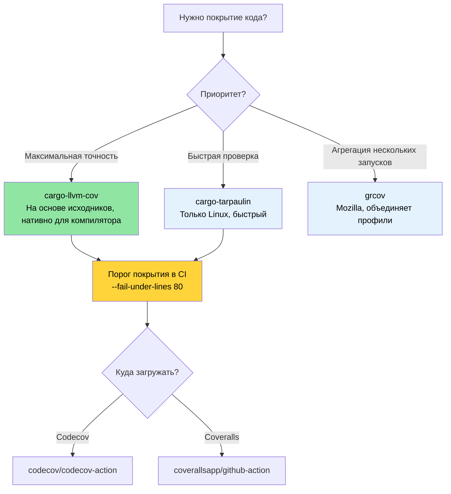

# Покрытие кода — видим то, что пропускают тесты 🟢

> **Чему вы научитесь:**
> - Покрытие на основе исходников с `cargo-llvm-cov` (самый точный инструмент покрытия для Rust)
> - Быстрые проверки покрытия с `cargo-tarpaulin` и `grcov` от Mozilla
> - Настройка порогов покрытия в CI с помощью Codecov и Coveralls
> - Стратегия тестирования, управляемая покрытием, которая в первую очередь закрывает опасные слепые зоны
>
> **Перекрёстные ссылки:** [Miri и санитайзеры](ch05-miri-valgrind-and-sanitizers-verifying-u.md) — покрытие находит непротестированный код, Miri находит UB в протестированном · [Бенчмаркинг](ch03-benchmarking-measuring-what-matters.md) — покрытие показывает *что протестировано*, бенчмарки — *что быстро* · [CI/CD-конвейер](ch11-putting-it-all-together-a-production-cic.md) — порог покрытия в конвейере

Покрытие кода показывает, какие строки, ветви или функции ваши тесты на самом деле
выполняют. Оно не доказывает корректность (покрытая строка всё равно может содержать
ошибку), но надёжно выявляет **слепые зоны** — пути в коде, которые не проверяет ни один тест.

В проекте 1 006 тестов в нескольких крейтах, то есть вложения в тестирование серьёзные.
Анализ покрытия отвечает на вопрос: «Доходят ли эти вложения до кода, который важен?»

### Покрытие на основе исходного кода с `llvm-cov`

Rust использует LLVM, который предоставляет инструментирование покрытия на основе
исходного кода — самый точный из доступных методов. Рекомендуемый инструмент —
[`cargo-llvm-cov`](https://github.com/taiki-e/cargo-llvm-cov):

```bash
# Установка
cargo install cargo-llvm-cov

# Или через компонент rustup (для «сырых» инструментов LLVM)
rustup component add llvm-tools-preview
```

**Базовое использование:**

```bash
# Запустить тесты и показать сводку покрытия по файлам
cargo llvm-cov

# Сгенерировать HTML-отчёт (просмотр с построчной подсветкой)
cargo llvm-cov --html
# Результат: target/llvm-cov/html/index.html

# Сгенерировать отчёт в формате LCOV (для интеграций с CI)
cargo llvm-cov --lcov --output-path lcov.info

# Покрытие всего воркспейса (все крейты)
cargo llvm-cov --workspace

# Включить только определённые пакеты
cargo llvm-cov --package accel_diag --package topology_lib

# Покрытие с учётом doc-тестов
cargo llvm-cov --doctests
```

**Чтение HTML-отчёта:**

```text
target/llvm-cov/html/index.html
├── Файл                  │ Функции │ Строки │ Ветви  │ Регионы
├─ accel_diag/src/lib.rs │  78.5%  │ 82.3% │ 61.2% │  74.1%
├─ sel_mgr/src/parse.rs│  95.2%  │ 96.8% │ 88.0% │  93.5%
├─ topology_lib/src/.. │  91.0%  │ 93.4% │ 79.5% │  89.2%
└─ ...

Зелёный = покрыто    Красный = не покрыто    Жёлтый = покрыто частично (ветвление)
```

**Типы покрытия:**

| Тип | Что измеряет | Значение |
|-----|--------------|----------|
| **Покрытие строк** | Какие строки исходника выполнялись | Базовый вопрос: «до этого кода вообще дошло?» |
| **Покрытие ветвлений** | Какие ветки `if`/`match` выполнялись | Выявляет непроверенные условия |
| **Покрытие функций** | Какие функции вызывались | Находит мёртвый код |
| **Покрытие регионов** | Какие регионы кода (подвыражения) выполнялись | Самый детальный уровень |

### cargo-tarpaulin — быстрый путь

[`cargo-tarpaulin`](https://github.com/xd009642/tarpaulin) — инструмент покрытия,
работающий только в Linux, который проще настроить (не нужны компоненты LLVM):

```bash
# Установка
cargo install cargo-tarpaulin

# Базовый отчёт о покрытии
cargo tarpaulin

# HTML-вывод
cargo tarpaulin --out Html

# С дополнительными опциями
cargo tarpaulin \
    --workspace \
    --timeout 120 \
    --out Xml Html \
    --output-dir coverage/ \
    --exclude-files "*/tests/*" "*/benches/*" \
    --ignore-panics

# Пропустить некоторые крейты
cargo tarpaulin --workspace --exclude diag_tool  # исключить крейт-бинарник
```

**Сравнение tarpaulin и llvm-cov:**

| Возможность | cargo-llvm-cov | cargo-tarpaulin |
|-------------|----------------|-----------------|
| Точность | На основе исходников (самый точный) | На основе ptrace (иногда завышает покрытие) |
| Платформа | Любая (на основе LLVM) | Только Linux |
| Покрытие ветвлений | Да | Ограниченно |
| Doc-тесты | Да | Нет |
| Настройка | Нужен `llvm-tools-preview` | Самодостаточный |
| Скорость | Быстрее (инструментирование на этапе компиляции) | Медленнее (накладные расходы ptrace) |
| Стабильность | Очень стабильный | Иногда ложные срабатывания |

**Рекомендация**: используйте `cargo-llvm-cov` ради точности. `cargo-tarpaulin` — когда
нужна быстрая проверка без установки инструментов LLVM.

### grcov — инструмент покрытия от Mozilla

[`grcov`](https://github.com/mozilla/grcov) — агрегатор покрытия от Mozilla.
Он обрабатывает сырые данные профилирования LLVM и формирует отчёты в нескольких форматах:

```bash
# Установка
cargo install grcov

# Шаг 1: сборка с инструментированием покрытия
export RUSTFLAGS="-Cinstrument-coverage"
export LLVM_PROFILE_FILE="target/coverage/%p-%m.profraw"
cargo build --tests

# Шаг 2: запуск тестов (генерирует файлы .profraw)
cargo test

# Шаг 3: агрегация с помощью grcov
grcov target/coverage/ \
    --binary-path target/debug/ \
    --source-dir . \
    --output-types html,lcov \
    --output-path target/coverage/report \
    --branch \
    --ignore-not-existing \
    --ignore "*/tests/*" \
    --ignore "*/.cargo/*"

# Шаг 4: просмотр отчёта
open target/coverage/report/html/index.html
```

**Когда использовать grcov**: он полезнее всего, когда нужно **объединить покрытие из
нескольких запусков тестов** (например, модульных, интеграционных и фаззинг-тестов)
в один отчёт.

### Покрытие в CI: Codecov и Coveralls

Загружайте данные о покрытии в сервис мониторинга, чтобы видеть исторические тренды
и аннотации в PR:

```yaml
# .github/workflows/coverage.yml
name: Покрытие кода

on: [push, pull_request]

jobs:
  coverage:
    runs-on: ubuntu-latest
    steps:
      - uses: actions/checkout@v4
      - uses: dtolnay/rust-toolchain@stable
        with:
          components: llvm-tools-preview

      - name: Установка cargo-llvm-cov
        uses: taiki-e/install-action@cargo-llvm-cov

      - name: Генерация покрытия
        run: cargo llvm-cov --workspace --lcov --output-path lcov.info

      - name: Загрузка в Codecov
        uses: codecov/codecov-action@v4
        with:
          files: lcov.info
          token: ${{ secrets.CODECOV_TOKEN }}
          fail_ci_if_error: true

      # Опционально: задать минимальный порог покрытия
      - name: Проверка порога покрытия
        run: |
          cargo llvm-cov --workspace --fail-under-lines 80
          # Сборка падает, если покрытие строк опускается ниже 80%
```

**Пороги покрытия** — задавайте минимумы для каждого крейта, читая JSON-вывод:

```bash
# Получить покрытие по крейтам в формате JSON
cargo llvm-cov --workspace --json | jq '.data[0].totals.lines.percent'

# Упасть, если покрытие ниже порога
cargo llvm-cov --workspace --fail-under-lines 80
cargo llvm-cov --workspace --fail-under-functions 70
cargo llvm-cov --workspace --fail-under-regions 60
```

### Стратегия тестирования, управляемая покрытием

Сами по себе цифры покрытия бессмысленны без стратегии. Вот как эффективно использовать
данные о покрытии:

**Шаг 1: сортировка по риску**

```text
Высокое покрытие, высокий риск     → ✅ Хорошо — поддерживайте
Высокое покрытие, низкий риск      → 🔄 Возможно, избыточно протестировано — пропускайте, если медленно
Низкое покрытие, высокий риск      → 🔴 Пишите тесты СЕЙЧАС — здесь прячутся баги
Низкое покрытие, низкий риск       → 🟡 Отслеживайте, но не паникуйте
```

**Шаг 2: ориентируйтесь на покрытие ветвлений, а не строк**

```rust
// 100% покрытие строк, 50% покрытие ветвлений — всё ещё рискованно!
pub fn classify_temperature(temp_c: i32) -> ThermalState {
    if temp_c > 105 {       // ← проверено при temp=110 → Critical
        ThermalState::Critical
    } else if temp_c > 85 { // ← проверено при temp=90 → Warning
        ThermalState::Warning
    } else if temp_c < -10 { // ← НИКОГДА НЕ ПРОВЕРЯЛОСЬ → случай ошибки датчика пропущен
        ThermalState::SensorError
    } else {
        ThermalState::Normal  // ← проверено при temp=25 → Normal
    }
}
```

**Шаг 3: отсекайте шум**

```bash
# Исключаем тестовый код из покрытия (он всегда «покрыт»)
cargo llvm-cov --workspace --ignore-filename-regex 'tests?\.rs$|benches/'

# Исключаем сгенерированный код
cargo llvm-cov --workspace --ignore-filename-regex 'target/'
```

В коде отмечайте участки, которые нельзя протестировать:

```rust
// Инструменты покрытия распознают этот паттерн
#[cfg(not(tarpaulin_include))]  // tarpaulin
fn unreachable_hardware_path() {
    // Этот путь требует реального GPU, чтобы сработать
}

// Для llvm-cov используйте более точный подход:
// просто примите, что некоторые пути нуждаются в интеграционных и аппаратных тестах,
// а не в модульных. Отслеживайте их в списке исключений покрытия.
```

### Дополнительные инструменты тестирования

**`proptest` — property-based тестирование** находит крайние случаи, которые пропускают
написанные вручную тесты:

```toml
[dev-dependencies]
proptest = "1"
```

```rust
use proptest::prelude::*;

proptest! {
    #[test]
    fn parse_never_panics(input in "\\PC*") {
        // proptest генерирует тысячи случайных строк
        // Если parse_gpu_csv паникует на каком-либо входе, тест падает,
        // и proptest минимизирует упавший пример за вас.
        let _ = parse_gpu_csv(&input);
    }

    #[test]
    fn temperature_roundtrip(raw in 0u16..4096) {
        let temp = Temperature::from_raw(raw);
        let md = temp.millidegrees_c();
        // Свойство: значение в тысячных долях градуса всегда должно выводиться из raw
        assert_eq!(md, (raw as i32) * 625 / 10);
    }
}
```

**`insta` — snapshot-тестирование** для больших структурированных выводов (JSON, текстовые отчёты):

```toml
[dev-dependencies]
insta = { version = "1", features = ["json"] }
```

```rust
#[test]
fn test_der_report_format() {
    let report = generate_der_report(&test_results);
    // При первом запуске создаётся файл снимка. При последующих — сравнение с ним.
    // Запустите `cargo insta review`, чтобы принять изменения в интерактивном режиме.
    insta::assert_json_snapshot!(report);
}
```

> **Когда добавлять proptest и insta**: если ваши модульные тесты — это только примеры
> «счастливого пути», proptest найдёт крайние случаи, которые вы упустили. Если вы тестируете
> большие форматы вывода (JSON-отчёты, записи DER), снимки insta писать и поддерживать
> быстрее, чем ручные assert-ы.

### Применение: карта покрытия для более чем 1000 тестов

В проекте больше 1000 тестов, но отслеживания покрытия нет. Его добавление покажет,
как распределены тестовые усилия. Непокрытые пути — первые кандидаты на проверку с помощью
[Miri и санитайзеров](ch05-miri-valgrind-and-sanitizers-verifying-u.md):

**Рекомендуемая конфигурация покрытия:**

```bash
# Быстрое покрытие всего воркспейса (предлагаемая команда для CI)
cargo llvm-cov --workspace \
    --ignore-filename-regex 'tests?\.rs$' \
    --fail-under-lines 75 \
    --html

# Покрытие по крейтам для целенаправленного улучшения
for crate in accel_diag event_log topology_lib network_diag compute_diag fan_diag; do
    echo "=== $crate ==="
    cargo llvm-cov --package "$crate" --json 2>/dev/null | \
        jq -r '.data[0].totals | "Строки: \(.lines.percent | round)%  Ветви: \(.branches.percent | round)%"'
done
```

**Крейты с ожидаемо высоким покрытием** (исходя из плотности тестов):
- `topology_lib` — набор тестов golden-файлов на 922 строки
- `event_log` — реестр с хелперами `create_test_record()`
- `cable_diag` — паттерны `make_test_event()` / `make_test_context()`

**Ожидаемые пробелы в покрытии** (по результатам просмотра кода):
- Ветки обработки ошибок в путях IPMI-коммуникации
- Ветки, специфичные для железа GPU (требуют реального GPU)
- Крайние случаи парсинга `dmesg` (вывод зависит от платформы)

> **Правило 80/20 для покрытия**: от 0% до 80% добраться несложно. От 80% до 95% требует
> всё более искусственных тестовых сценариев. От 95% до 100% требует исключений
> `#[cfg(not(...))]` и редко стоит усилий. Ориентируйтесь на **80% покрытия строк и 70%
> покрытия ветвлений** как на разумный практический минимум.

### Устранение неполадок с покрытием

| Симптом | Причина | Решение |
|---------|---------|---------|
| `llvm-cov` показывает 0% для всех файлов | Инструментирование не применено | Запускайте `cargo llvm-cov`, а не `cargo test` и `llvm-cov` по отдельности |
| Покрытие считает `unreachable!()` непокрытым | Эти ветки есть в скомпилированном коде | Используйте `#[cfg(not(tarpaulin_include))]` или добавьте в регулярное выражение исключений |
| Тестовый бинарник падает под покрытием | Конфликт инструментирования и санитайзера | Не комбинируйте `cargo llvm-cov` с `-Zsanitizer=address`; запускайте их отдельно |
| Покрытие различается между `llvm-cov` и `tarpaulin` | Разные методы инструментирования | Считайте источником истины `llvm-cov` (встроен в компилятор); заводите задачи при крупных расхождениях |
| `error: profraw file is malformed` | Тестовый бинарник упал во время выполнения | Сначала исправьте падающий тест; profraw-файлы повреждаются, если процесс завершился аварийно |
| Покрытие ветвлений кажется невероятно низким | Оптимизатор создаёт ветки для ветвей `match`, `unwrap` и т. д. | Для практических порогов ориентируйтесь на *покрытие строк*; покрытие ветвлений по природе ниже |

### Попробуйте сами

1. **Измерьте покрытие своего проекта**: запустите `cargo llvm-cov --workspace --html`
   и откройте отчёт. Найдите три файла с самым низким покрытием. Они просто не тестируются
   или им по природе трудно быть протестированными (код, зависящий от железа)?

2. **Задайте порог покрытия**: добавьте `cargo llvm-cov --workspace --fail-under-lines 60`
   в CI. Намеренно закомментируйте тест и убедитесь, что CI падает. Затем поднимите порог
   до фактического покрытия проекта минус 2%.

3. **Покрытие ветвлений и строк**: напишите функцию с `match` из трёх веток и протестируйте
   только две из них. Сравните покрытие строк (может показать 66%) и покрытие ветвлений
   (может показать 50%). Какая метрика полезнее для вашего проекта?

### Выбор инструмента покрытия



### 🏋️ Упражнения

#### 🟢 Упражнение 1: первый отчёт о покрытии

Установите `cargo-llvm-cov`, запустите его на любом проекте на Rust и откройте HTML-отчёт.
Найдите три файла с самым низким покрытием строк.

<details>
<summary>Решение</summary>

```bash
cargo install cargo-llvm-cov
cargo llvm-cov --workspace --html --open
# Отчёт сортирует файлы по покрытию — самые низкие внизу
# Ищите файлы ниже 50% — это ваши слепые зоны
```
</details>

#### 🟡 Упражнение 2: порог покрытия в CI

Добавьте порог покрытия в workflow GitHub Actions, который падает, если покрытие строк
опускается ниже 60%. Проверьте работу, закомментировав один тест.

<details>
<summary>Решение</summary>

```yaml
# .github/workflows/coverage.yml
name: Покрытие
on: [push, pull_request]
jobs:
  coverage:
    runs-on: ubuntu-latest
    steps:
      - uses: actions/checkout@v4
      - uses: dtolnay/rust-toolchain@stable
        with:
          components: llvm-tools-preview
      - run: cargo install cargo-llvm-cov
      - run: cargo llvm-cov --workspace --fail-under-lines 60
```

Закомментируйте тест, отправьте изменения и посмотрите, как workflow падает.
</details>

### Ключевые выводы

- `cargo-llvm-cov` — самый точный инструмент покрытия для Rust: он использует собственное
  инструментирование компилятора
- Покрытие не доказывает корректность, но **нулевое покрытие доказывает отсутствие тестов** —
  используйте его, чтобы находить слепые зоны
- Задайте порог покрытия в CI (например, `--fail-under-lines 80`), чтобы предотвращать регрессии
- Не гонитесь за 100% покрытием — сосредоточьтесь на путях с высоким риском (обработка ошибок,
  unsafe, парсинг)
- Никогда не комбинируйте инструментирование покрытия с санитайзерами в одном запуске

---
