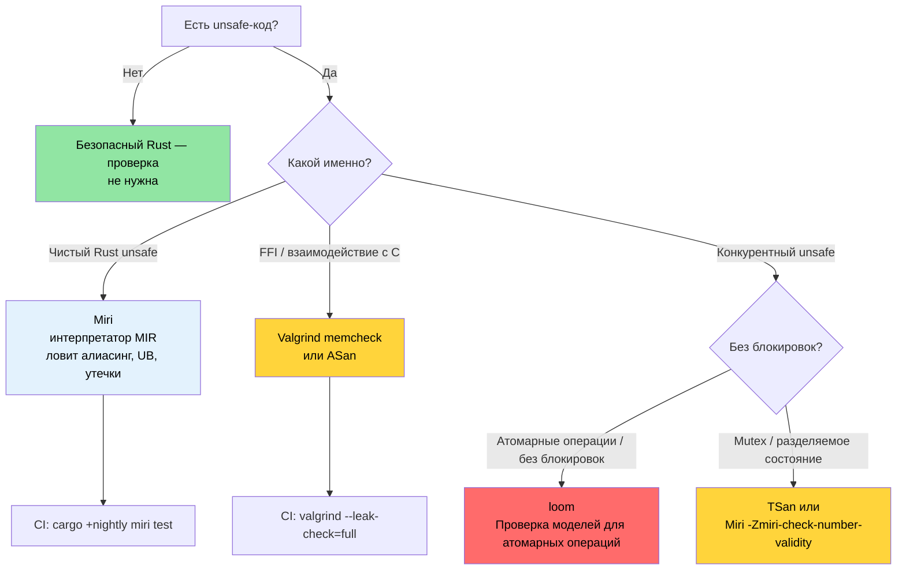

# Miri, Valgrind и санитайзеры — проверка unsafe-кода 🔴

> **Чему вы научитесь:**
> - Miri как интерпретатор MIR — что он ловит (алиасинг, UB, утечки) и что не может (FFI, системные вызовы)
> - Valgrind memcheck, Helgrind (гонки данных), Callgrind (профилирование) и Massif (куча)
> - Санитайзеры LLVM: ASan, MSan, TSan, LSan с nightly-сборкой `-Zbuild-std`
> - `cargo-fuzz` для поиска падений и `loom` для проверки моделей конкурентности
> - Дерево решений для выбора подходящего инструмента проверки
>
> **Перекрёстные ссылки:** [Покрытие кода](ch04-code-coverage-seeing-what-tests-miss.md) — покрытие находит непротестированные пути, Miri проверяет протестированные · [`no_std` и фичи](ch09-no-std-and-feature-verification.md) — код `no_std` часто требует `unsafe`, который может проверить Miri · [CI/CD-конвейер](ch11-putting-it-all-together-a-production-cic.md) — джоба Miri в конвейере

Безопасный Rust гарантирует безопасность памяти и отсутствие гонок данных на этапе компиляции.
Но как только вы пишете `unsafe` — для FFI, собственных структур данных или ради
производительности, — эти гарантии становятся *вашей* ответственностью. Эта глава описывает
инструменты, которые проверяют, действительно ли ваш `unsafe`-код выполняет заявленные
контракты безопасности.

### Miri — интерпретатор для unsafe Rust

[Miri](https://github.com/rust-lang/miri) — это **интерпретатор** промежуточного
представления Rust (Mid-level Intermediate Representation, MIR). Вместо компиляции в машинный
код Miri *выполняет* программу шаг за шагом, проверяя на каждой операции отсутствие
неопределённого поведения (UB).

```bash
# Установка Miri (компонент только для nightly)
rustup +nightly component add miri

# Запуск тестового набора под Miri
cargo +nightly miri test

# Запуск конкретного бинарника под Miri
cargo +nightly miri run

# Запуск конкретного теста
cargo +nightly miri test -- test_name
```

**Как работает Miri:**

```text
Исходник → rustc → MIR → Miri интерпретирует MIR
                        │
                        ├─ Отслеживает происхождение (provenance) каждого указателя
                        ├─ Проверяет каждое обращение к памяти
                        ├─ Проверяет выравнивание при каждом разыменовании
                        ├─ Обнаруживает use-after-free
                        ├─ Обнаруживает гонки данных (в многопоточном коде)
                        └─ Применяет правила Stacked Borrows / Tree Borrows
```

### Что ловит Miri (а что не может)

**Miri обнаруживает:**

| Категория | Пример | Упадёт ли во время выполнения? |
|-----------|--------|--------------------------------|
| Выход за границы | `ptr.add(100).read()` за пределами выделения | Иногда (зависит от раскладки страниц) |
| Use-after-free | Чтение `Box` после освобождения через сырой указатель | Иногда (зависит от аллокатора) |
| Double free | Двойной вызов `drop_in_place` | Обычно |
| Невыровненный доступ | `(ptr as *const u32).read()` по нечётному адресу | На некоторых архитектурах |
| Некорректные значения | `transmute::<u8, bool>(2)` | Молча даёт неверный результат |
| Висящие ссылки | `&*ptr`, где ptr уже освобождён | Нет (молчаливое повреждение) |
| Гонки данных | Два потока, один пишет, без синхронизации | Периодически, трудно воспроизвести |
| Нарушение Stacked Borrows | Алиасинг `&mut`-ссылок | Нет (молчаливое повреждение) |

**Miri НЕ обнаруживает:**

| Ограничение | Почему |
|-------------|--------|
| Логические ошибки | Miri проверяет безопасность памяти, а не корректность |
| Взаимоблокировки | Miri проверяет гонки данных, а не livelock |
| Проблемы производительности | Интерпретация в 10–100× медленнее нативного выполнения |
| Взаимодействие с ОС и железом | Miri не может эмулировать системные вызовы и ввод-вывод устройств |
| Все вызовы FFI | Не может интерпретировать C-код (только Rust MIR) |
| Полное покрытие путей | Проверяет только те пути, до которых доходит ваш тестовый набор |

**Конкретный пример — поиск некорректного кода, который «работает» на практике:**

```rust
#[cfg(test)]
mod tests {
    #[test]
    fn test_miri_catches_ub() {
        // Это «работает» в release-сборках, но является неопределённым поведением
        let mut v = vec![1, 2, 3];
        let ptr = v.as_ptr();

        // Push может перевыделить буфер, и тогда ptr станет недействительным
        v.push(4);

        // ❌ UB: ptr может висеть после перевыделения
        // Miri поймает это, даже если аллокатор случайно не переместит буфер.
        // let _val = unsafe { *ptr };
        // Ошибка: Miri сообщит:
        //   "pointer to alloc1234 was dereferenced after this
        //    allocation got freed"

        // ✅ Правильно: получаем новый указатель после изменения
        let ptr = v.as_ptr();
        let val = unsafe { *ptr };
        assert_eq!(val, 1);
    }
}
```

### Запуск Miri на реальном крейте

**Практический workflow Miri для крейта с `unsafe`:**

```bash
# Шаг 1: запустите все тесты под Miri
cargo +nightly miri test 2>&1 | tee miri_output.txt

# Шаг 2: если Miri сообщил об ошибках, изолируйте их
cargo +nightly miri test -- failing_test_name

# Шаг 3: используйте бэктрейс Miri для диагностики
MIRIFLAGS="-Zmiri-backtrace=full" cargo +nightly miri test

# Шаг 4: выберите модель заимствований
# Stacked Borrows (по умолчанию, строже):
cargo +nightly miri test

# Tree Borrows (экспериментальная, менее строгая):
MIRIFLAGS="-Zmiri-tree-borrows" cargo +nightly miri test
```

**Флаги Miri для типичных сценариев:**

```bash
# Отключить изоляцию (разрешить доступ к файловой системе и переменным окружения)
MIRIFLAGS="-Zmiri-disable-isolation" cargo +nightly miri test

# Проверка утечек памяти включена в Miri по умолчанию.
# Чтобы подавить ошибки утечек (например, для намеренных утечек):
# MIRIFLAGS="-Zmiri-ignore-leaks" cargo +nightly miri test

# Задать seed для ГСЧ — воспроизводимые результаты в тестах с рандомизацией
MIRIFLAGS="-Zmiri-seed=42" cargo +nightly miri test

# Включить строгую проверку provenance
MIRIFLAGS="-Zmiri-strict-provenance" cargo +nightly miri test

# Несколько флагов сразу
MIRIFLAGS="-Zmiri-disable-isolation -Zmiri-backtrace=full -Zmiri-strict-provenance" \
    cargo +nightly miri test
```

**Miri в CI:**

```yaml
# .github/workflows/miri.yml
name: Miri
on: [push, pull_request]

jobs:
  miri:
    runs-on: ubuntu-latest
    steps:
      - uses: actions/checkout@v4
      - uses: dtolnay/rust-toolchain@nightly
        with:
          components: miri

      - name: Запуск Miri
        run: cargo miri test --workspace
        env:
          MIRIFLAGS: "-Zmiri-backtrace=full"
          # Проверка утечек включена по умолчанию.
          # Пропускайте тесты, которые используют системные вызовы, с которыми Miri не справляется
          # (файловый ввод-вывод, сеть и т. п.)
```

> **Замечание о производительности**: Miri в 10–100× медленнее нативного выполнения. Тестовый
> набор, который нативно выполняется за 5 секунд, под Miri может идти 5 минут. В CI запускайте
> Miri на выбранном подмножестве: только крейты с `unsafe`-кодом.

### Valgrind и его интеграция с Rust

[Valgrind](https://valgrind.org/) — классический инструмент проверки памяти для C/C++.
Он работает и со скомпилированными бинарниками Rust, проверяя ошибки памяти на уровне
машинного кода.

```bash
# Установка Valgrind
sudo apt install valgrind  # Debian/Ubuntu
sudo dnf install valgrind  # Fedora

# Сборка с отладочной информацией (Valgrind нужны символы)
cargo build --tests
# или для release с отладочной информацией:
# cargo build --release
# [profile.release]
# debug = true

# Запуск конкретного тестового бинарника под Valgrind
valgrind --tool=memcheck \
    --leak-check=full \
    --show-leak-kinds=all \
    --track-origins=yes \
    ./target/debug/deps/my_crate-abc123 --test-threads=1

# Запуск основного бинарника
valgrind --tool=memcheck \
    --leak-check=full \
    --error-exitcode=1 \
    ./target/debug/diag_tool --run-diagnostics
```

**Инструменты Valgrind помимо memcheck:**

| Инструмент | Команда | Что обнаруживает |
|------------|---------|------------------|
| **Memcheck** | `--tool=memcheck` | Утечки памяти, use-after-free, переполнение буфера |
| **Helgrind** | `--tool=helgrind` | Гонки данных и нарушения порядка захвата блокировок |
| **DRD** | `--tool=drd` | Гонки данных (другой алгоритм обнаружения) |
| **Callgrind** | `--tool=callgrind` | Профилирование количества инструкций CPU (на уровне путей) |
| **Massif** | `--tool=massif` | Профилирование кучи во времени |
| **Cachegrind** | `--tool=cachegrind` | Анализ промахов кеша |

**Callgrind для профилирования на уровне инструкций:**

```bash
# Подсчёт инструкций (стабильнее, чем измерение реального времени)
valgrind --tool=callgrind \
    --callgrind-out-file=callgrind.out \
    ./target/release/diag_tool --run-diagnostics

# Визуализация в KCachegrind
kcachegrind callgrind.out
# или текстовый вариант:
callgrind_annotate callgrind.out | head -100
```

**Miri или Valgrind — когда что использовать:**

| Аспект | Miri | Valgrind |
|--------|------|----------|
| Проверяет UB, специфичный для Rust | ✅ Stacked/Tree Borrows | ❌ Не знает правил Rust |
| Проверяет C FFI-код | ❌ Не может интерпретировать C | ✅ Проверяет весь машинный код |
| Нужен nightly | ✅ Да | ❌ Нет |
| Скорость | В 10–100× медленнее | В 10–50× медленнее |
| Платформа | Любая (интерпретирует MIR) | Linux, macOS (выполняет нативный код) |
| Обнаружение гонок данных | ✅ Да | ✅ Да (Helgrind/DRD) |
| Обнаружение утечек | ✅ Да | ✅ Да (более тщательно) |
| Ложные срабатывания | Очень редко | Иногда (особенно с аллокаторами) |

**Используйте оба:**
- **Miri** — для чистого Rust `unsafe` (Stacked Borrows, provenance)
- **Valgrind** — для кода с большим количеством FFI и для анализа утечек всей программы

### AddressSanitizer, MemorySanitizer, ThreadSanitizer

Санитайзеры LLVM — это проходы инструментирования на этапе компиляции, которые добавляют
проверки времени выполнения. Они быстрее Valgrind (накладные расходы 2–5× против 10–50×)
и ловят другие классы ошибок.

```bash
# Нужно: установите исходники Rust для пересборки std с инструментированием санитайзера
rustup component add rust-src --toolchain nightly
# AddressSanitizer (ASan) — переполнение буфера, use-after-free, переполнение стека
RUSTFLAGS="-Zsanitizer=address" \
    cargo +nightly test -Zbuild-std --target x86_64-unknown-linux-gnu

# MemorySanitizer (MSan) — чтение неинициализированной памяти
RUSTFLAGS="-Zsanitizer=memory" \
    cargo +nightly test -Zbuild-std --target x86_64-unknown-linux-gnu

# ThreadSanitizer (TSan) — гонки данных
RUSTFLAGS="-Zsanitizer=thread" \
    cargo +nightly test -Zbuild-std --target x86_64-unknown-linux-gnu

# LeakSanitizer (LSan) — утечки памяти (по умолчанию входит в ASan)
RUSTFLAGS="-Zsanitizer=leak" \
    cargo +nightly test --target x86_64-unknown-linux-gnu
```

> **Примечание**: ASan, MSan и TSan требуют `-Zbuild-std`, чтобы пересобрать стандартную
> библиотеку с инструментированием санитайзера. LSan — не требует.

**Сравнение санитайзеров:**

| Санитайзер | Накладные расходы | Что ловит | Nightly? | `-Zbuild-std`? |
|------------|-------------------|-----------|----------|----------------|
| **ASan** | 2× память, 2× CPU | Переполнение буфера, use-after-free, переполнение стека | Да | Да |
| **MSan** | 3× память, 3× CPU | Чтение неинициализированных данных | Да | Да |
| **TSan** | 5–10× память, 5× CPU | Гонки данных | Да | Да |
| **LSan** | Минимальные | Утечки памяти | Да | Нет |

**Практический пример — ловим гонку данных с помощью TSan:**

```rust
use std::sync::Arc;
use std::thread;

fn racy_counter() -> u64 {
    // ❌ UB: неслинхронизированное разделяемое изменяемое состояние
    let data = Arc::new(std::cell::UnsafeCell::new(0u64));
    let mut handles = vec![];

    for _ in 0..4 {
        let data = Arc::clone(&data);
        handles.push(thread::spawn(move || {
            for _ in 0..1000 {
                // SAFETY: НЕКОРРЕКТНО — гонка данных!
                unsafe {
                    *data.get() += 1;
                }
            }
        }));
    }

    for h in handles {
        h.join().unwrap();
    }

    // Значение должно быть 4000, но из-за гонки может оказаться любым
    unsafe { *data.get() }
}

// И Miri, и TSan находят это:
// Miri:  "Data race detected between (1) write and (2) write"
// TSan:  "WARNING: ThreadSanitizer: data race"
//
// Исправление: используйте AtomicU64 или Mutex<u64>
```

### Смежные инструменты: фаззинг и проверка конкурентности

**`cargo-fuzz` — фаззинг с обратной связью по покрытию** (находит падения в парсерах и декодерах):

```bash
# Установка
cargo install cargo-fuzz

# Инициализация цели фаззинга
cargo fuzz init
cargo fuzz add parse_gpu_csv
```

```rust
// fuzz/fuzz_targets/parse_gpu_csv.rs
#![no_main]
use libfuzzer_sys::fuzz_target;

fuzz_target!(|data: &[u8]| {
    if let Ok(s) = std::str::from_utf8(data) {
        // Фаззер генерирует миллионы входных данных в поисках паник и падений.
        let _ = diag_tool::parse_gpu_csv(s);
    }
});
```

```bash
# Запуск фаззера (работает до прерывания или до обнаружения падения)
cargo +nightly fuzz run parse_gpu_csv -- -max_total_time=300  # 5 минут

# Минимизация падения
cargo +nightly fuzz tmin parse_gpu_csv artifacts/parse_gpu_csv/crash-...
```

> **Когда фаззить**: любая функция, которая разбирает недоверенные или полудоверенные входные
> данные (вывод датчиков, конфигурационные файлы, сетевые данные, JSON/CSV). Фаззинг находил
> реальные ошибки во всех крупных крейтах-парсерах Rust (serde, regex, image).

**`loom` — проверка моделей конкурентности** (исчерпывающе перебирает порядки атомарных операций):

```toml
[dev-dependencies]
loom = "0.7"
```

```rust
#[cfg(loom)]
mod tests {
    use loom::sync::atomic::{AtomicUsize, Ordering};
    use loom::thread;

    #[test]
    fn test_counter_is_atomic() {
        loom::model(|| {
            let counter = loom::sync::Arc::new(AtomicUsize::new(0));
            let c1 = counter.clone();
            let c2 = counter.clone();

            let t1 = thread::spawn(move || { c1.fetch_add(1, Ordering::SeqCst); });
            let t2 = thread::spawn(move || { c2.fetch_add(1, Ordering::SeqCst); });

            t1.join().unwrap();
            t2.join().unwrap();

            // loom перебирает ВСЕ возможные чередования потоков
            assert_eq!(counter.load(Ordering::SeqCst), 2);
        });
    }
}
```

> **Когда использовать `loom`**: когда у вас есть структуры данных без блокировок или
> собственные примитивы синхронизации. Loom исчерпывающе перебирает чередования потоков —
> это проверка модели, а не стресс-тест. Для кода на основе `Mutex`/`RwLock` он не нужен.

### Когда какой инструмент использовать

```text
Дерево решений для проверки unsafe-кода:

Код написан на чистом Rust (без FFI)?
├─ Да → Используйте Miri (ловит UB, специфичный для Rust, Stacked Borrows)
│        В CI также запускайте ASan для защиты в глубину
└─ Нет (вызывает C/C++ код через FFI)
   ├─ Есть опасения по безопасности памяти?
   │  └─ Да → Используйте Valgrind memcheck И ASan
   ├─ Есть опасения по конкурентности?
   │  └─ Да → Используйте TSan (быстрее) или Helgrind (тщательнее)
   └─ Есть опасения по утечкам памяти?
      └─ Да → Используйте Valgrind --leak-check=full
```

**Рекомендуемая матрица CI:**

```yaml
# Запускаем все инструменты параллельно для быстрой обратной связи
jobs:
  miri:
    runs-on: ubuntu-latest
    steps:
      - uses: dtolnay/rust-toolchain@nightly
        with: { components: miri }
      - run: cargo miri test --workspace

  asan:
    runs-on: ubuntu-latest
    steps:
      - uses: dtolnay/rust-toolchain@nightly
      - run: |
          RUSTFLAGS="-Zsanitizer=address" \
          cargo test -Zbuild-std --target x86_64-unknown-linux-gnu

  valgrind:
    runs-on: ubuntu-latest
    steps:
      - run: sudo apt-get install -y valgrind
      - uses: dtolnay/rust-toolchain@stable
      - run: cargo build --tests
      - run: |
          for test_bin in $(find target/debug/deps -maxdepth 1 -executable -type f ! -name '*.d'); do
            valgrind --error-exitcode=1 --leak-check=full "$test_bin" --test-threads=1
          done
```

### Применение: ноль unsafe — и когда он понадобится

В проекте **ни одного блока `unsafe`** на более чем 90 тысячах строк Rust. Для инструмента
диагностики системного уровня это замечательное достижение, которое показывает, что безопасного
Rust достаточно для:
- Связи с IPMI (через `std::process::Command` к `ipmitool`)
- Запросов к GPU (через `std::process::Command` к `accel-query`)
- Разбора топологии PCIe (чистый разбор JSON и текста)
- Управления записями SEL (чистые структуры данных)
- Генерации DER-отчётов (сериализация JSON)

**Когда проекту понадобится `unsafe`?**

Вероятные причины появления `unsafe`:

| Сценарий | Почему нужен `unsafe` | Рекомендуемая проверка |
|----------|----------------------|------------------------|
| Прямой IPMI через ioctl | `libc::ioctl()` обходит подпроцесс `ipmitool` | Miri + Valgrind |
| Прямые запросы к драйверу GPU | FFI к accel-mgmt вместо разбора вывода `accel-query` | Valgrind (C-библиотека) |
| Memory-mapped конфигурация PCIe | `mmap` для прямого чтения конфигурационного пространства | ASan + Valgrind |
| Буфер SEL без блокировок | `AtomicPtr` для параллельного сбора событий | Miri + TSan |
| Вариант для встраиваемых систем / `no_std` | Манипуляции с сырыми указателями для bare-metal | Miri |

**Подготовка**: прежде чем вводить `unsafe`, добавьте инструменты проверки в CI:

```toml
# Cargo.toml — добавляем флаги фич для unsafe-оптимизаций
[features]
default = []
direct-ipmi = []     # Включить прямой ioctl-доступ к IPMI вместо подпроцесса ipmitool
direct-accel-api = []     # Включить FFI accel-mgmt вместо разбора вывода accel-query
```

```rust
// src/ipmi.rs — за флагом фичи
#[cfg(feature = "direct-ipmi")]
mod direct {
    //! Прямой доступ к IPMI-устройству через ioctl на /dev/ipmi0.
    //!
    //! # Safety
    //! Этот модуль использует `unsafe` для системных вызовов ioctl.
    //! Проверено: Miri (где возможно), Valgrind memcheck, ASan.

    use std::os::unix::io::RawFd;

    // ... реализация unsafe ioctl ...
}

#[cfg(not(feature = "direct-ipmi"))]
mod subprocess {
    //! IPMI через подпроцесс ipmitool (по умолчанию, полностью безопасно).
    // ... текущая реализация ...
}
```

> **Ключевая мысль**: держите `unsafe` за [флагами фич](ch09-no-std-and-feature-verification.md),
> чтобы его можно было проверять независимо. Запускайте `cargo +nightly miri test --features direct-ipmi`
> в [CI](ch11-putting-it-all-together-a-production-cic.md), чтобы непрерывно проверять unsafe-пути,
> не затрагивая безопасную сборку по умолчанию.

### `cargo-careful` — дополнительные проверки UB без Miri

[`cargo-careful`](https://github.com/RalfJung/cargo-careful) запускает ваш код с включёнными
дополнительными проверками стандартной библиотеки. Он ловит часть неопределённого поведения,
которое обычные сборки игнорируют, не требуя nightly или замедления Miri в 10–100×:

```bash
# Установка (требуется nightly, но код выполняется почти с нативной скоростью)
cargo install cargo-careful

# Запуск тестов с дополнительными проверками UB (ловит неинициализированную память и некорректные значения)
cargo +nightly careful test

# Запуск бинарника с дополнительными проверками
cargo +nightly careful run -- --run-diagnostics
```

**Что `cargo-careful` ловит, чего не ловят обычные сборки:**
- Чтение неинициализированной памяти в `MaybeUninit` и `zeroed()`
- Создание некорректных значений `bool`, `char` или перечислений через transmute
- Невыровненное чтение и запись через указатели
- `copy_nonoverlapping` с перекрывающимися диапазонами

**Место в лестнице проверок:**

```text
Наименьшие накладные расходы                                Наибольшая тщательность
├─ cargo test ──► cargo careful test ──► Miri ──► ASan ──► Valgrind ─┤
│  (0× накладные)  (~1.5× накладные)  (10-100×)  (2×)     (10-50×)   │
│  Только safe Rust  Ловит часть UB  Чистый Rust  FFI+Rust  FFI+Rust │
```

> **Рекомендация**: добавьте `cargo +nightly careful test` в CI как быструю проверку безопасности.
> Он работает почти с нативной скоростью (в отличие от Miri) и ловит реальные ошибки, которые
> маскируют безопасные абстракции Rust.

### Устранение неполадок с Miri и санитайзерами

| Симптом | Причина | Решение |
|---------|---------|---------|
| `Miri does not support FFI` | Miri — интерпретатор Rust, он не может выполнять C-код | Для FFI-кода используйте Valgrind или ASan |
| `error: unsupported operation: can't call foreign function` | Miri встретил вызов `extern "C"` | Замокайте границу FFI или ограничьте код через `#[cfg(miri)]` |
| `Stacked Borrows violation` | Нарушение правила алиасинга — даже если код «работает» | Miri прав; перепишите код, чтобы не алиасить `&mut` с `&` |
| Санитайзер сообщает `DEADLYSIGNAL` | ASan обнаружил переполнение буфера | Проверьте индексацию массивов, операции со срезами и арифметику указателей |
| `LeakSanitizer: detected memory leaks` | `Box::leak()`, `forget()` или пропущенный `drop()` | Намеренно: подавите через `__lsan_disable()`; непреднамеренно: исправьте утечку |
| Miri невероятно медленный | Miri интерпретирует, а не компилирует — в 10–100× медленнее | Запускайте только тесты `--lib` или помечайте медленные тесты через `#[cfg_attr(miri, ignore)]` |
| `TSan: false positive` с атомарными операциями | TSan не до конца понимает модель порядка атомарных операций Rust | Добавьте `TSAN_OPTIONS=suppressions=tsan.supp` с конкретными подавлениями |

### Попробуйте сами

1. **Вызовите обнаружение UB в Miri**: напишите `unsafe`-функцию, которая создаёт две ссылки
   `&mut` на один и тот же `i32` (нарушение алиасинга). Запустите `cargo +nightly miri test`
   и посмотрите на ошибку «Stacked Borrows». Исправьте её через `UnsafeCell` или отдельные выделения.

2. **Запустите ASan на намеренной ошибке**: создайте тест с `unsafe`-доступом к массиву за
   пределами границ. Соберите с `RUSTFLAGS="-Zsanitizer=address"` и посмотрите отчёт ASan.
   Обратите внимание, как он указывает точную строку.

3. **Измерьте накладные расходы Miri**: замерьте `cargo test --lib` и `cargo +nightly miri test --lib`
   на одном и том же наборе тестов. Рассчитайте коэффициент замедления. По результатам решите,
   какие тесты запускать под Miri в CI, а какие пропускать через `#[cfg_attr(miri, ignore)]`.

### Дерево решений для проверки безопасности



### 🏋️ Упражнения

#### 🟡 Упражнение 1: вызовите обнаружение UB в Miri

Напишите `unsafe`-функцию, которая создаёт две ссылки `&mut` на один и тот же `i32`
(нарушение алиасинга). Запустите `cargo +nightly miri test`, найдите ошибку Stacked Borrows
и исправьте её.

<details>
<summary>Решение</summary>

```rust
#[cfg(test)]
mod tests {
    #[test]
    fn aliasing_ub() {
        let mut x: i32 = 42;
        let ptr = &mut x as *mut i32;
        unsafe {
            // ОШИБКА: две ссылки &mut на одно и то же место
            let _a = &mut *ptr;
            let _b = &mut *ptr; // Miri: нарушение Stacked Borrows!
        }
    }
}
```

Исправление: используйте отдельные выделения или `UnsafeCell`:

```rust
use std::cell::UnsafeCell;

#[test]
fn no_aliasing_ub() {
    let x = UnsafeCell::new(42);
    unsafe {
        let a = &mut *x.get();
        *a = 100;
    }
}
```
</details>

#### 🔴 Упражнение 2: обнаружение выхода за границы с помощью ASan

Создайте тест с `unsafe`-доступом к массиву за пределами границ. Соберите на nightly с
`RUSTFLAGS="-Zsanitizer=address"` и посмотрите отчёт ASan.

<details>
<summary>Решение</summary>

```rust
#[test]
fn oob_access() {
    let arr = [1u8, 2, 3, 4, 5];
    let ptr = arr.as_ptr();
    unsafe {
        let _val = *ptr.add(10); // Выход за границы!
    }
}
```

```bash
RUSTFLAGS="-Zsanitizer=address" cargo +nightly test -Zbuild-std \
  --target x86_64-unknown-linux-gnu -- oob_access
# Отчёт ASan: stack-buffer-overflow по адресу <точный адрес>
```
</details>

### Ключевые выводы

- **Miri** — инструмент для чистого Rust `unsafe`: он ловит нарушения алиасинга, use-after-free
  и утечки, которые компилируются и проходят тесты
- **Valgrind** — инструмент для FFI и взаимодействия с C: он работает с готовым бинарником
  без перекомпиляции
- **Санитайзеры** (ASan, TSan, MSan) требуют nightly, но работают почти с нативной скоростью —
  идеально для больших тестовых наборов
- **`loom`** создан специально для проверки структур данных без блокировок
- Запускайте Miri в CI на каждый push, а санитайзеры — по ночному расписанию, чтобы не замедлять
  основной конвейер

---
