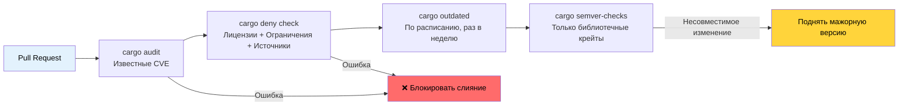

# Управление зависимостями и безопасность цепочки поставок 🟢

> **Чему вы научитесь:**
> - Поиск известных уязвимостей с помощью `cargo-audit`
> - Соблюдение политик по лицензиям, рекомендациям и источникам с помощью `cargo-deny`
> - Проверка доверия к цепочке поставок с помощью `cargo-vet` от Mozilla
> - Отслеживание устаревших зависимостей и обнаружение несовместимых изменений API
> - Визуализация и дедупликация дерева зависимостей
>
> **Перекрёстные ссылки:** [Профили релиза](ch07-release-profiles-and-binary-size.md) — `cargo-udeps` убирает неиспользуемые зависимости, найденные здесь · [CI/CD-конвейер](ch11-putting-it-all-together-a-production-cic.md) — джобы audit и deny в конвейере · [Build-скрипты](ch01-build-scripts-buildrs-in-depth.md) — `build-dependencies` тоже входят в вашу цепочку поставок

Бинарник на Rust содержит не только ваш код — он содержит все транзитивные зависимости
из `Cargo.lock`. Уязвимость, нарушение лицензии или вредоносный крейт в любой точке этого
дерева становятся *вашей* проблемой. Эта глава описывает инструменты, которые делают
управление зависимостями поддающимся аудиту и автоматизированным.

### cargo-audit — поиск известных уязвимостей

[`cargo-audit`](https://github.com/rustsec/rustsec/tree/main/cargo-audit) сверяет ваш
`Cargo.lock` с [базой рекомендаций RustSec](https://rustsec.org/), в которой отслеживаются
известные уязвимости опубликованных крейтов.

```bash
# Установка
cargo install cargo-audit

# Поиск известных уязвимостей
cargo audit

# Вывод:
# Crate:     chrono
# Version:   0.4.19
# Title:     Potential segfault in localtime_r invocations
# Date:      2020-11-10
# ID:        RUSTSEC-2020-0159
# URL:       https://rustsec.org/advisories/RUSTSEC-2020-0159
# Solution:  Upgrade to >= 0.4.20

# Проверка с падением CI, если есть уязвимости
cargo audit --deny warnings

# Генерация JSON-вывода для автоматической обработки
cargo audit --json

# Исправление уязвимостей обновлением Cargo.lock
cargo audit fix
```

**Интеграция с CI:**

```yaml
# .github/workflows/audit.yml
name: Проверка безопасности
on:
  schedule:
    - cron: '0 0 * * *'  # Ежедневная проверка — рекомендации появляются постоянно
  push:
    paths: ['Cargo.lock']

jobs:
  audit:
    runs-on: ubuntu-latest
    steps:
      - uses: actions/checkout@v4
      - uses: rustsec/audit-check@v2
        with:
          token: ${{ secrets.GITHUB_TOKEN }}
```

### cargo-deny — комплексное применение политик

[`cargo-deny`](https://github.com/EmbarkStudios/cargo-deny) выходит далеко за рамки поиска
уязвимостей. Он применяет политики по четырём направлениям:

1. **Рекомендации (advisories)** — известные уязвимости (как и в cargo-audit)
2. **Лицензии** — список разрешённых и запрещённых лицензий
3. **Ограничения (bans)** — запрещённые крейты или дублирующиеся версии
4. **Источники (sources)** — разрешённые реестры и git-источники

```bash
# Установка
cargo install cargo-deny

# Инициализация конфигурации
cargo deny init
# Создаёт deny.toml с документированными значениями по умолчанию

# Запуск всех проверок
cargo deny check

# Запуск отдельных проверок
cargo deny check advisories
cargo deny check licenses
cargo deny check bans
cargo deny check sources
```

**Пример `deny.toml`:**

```toml
# deny.toml

[advisories]
vulnerability = "deny"        # Падать при известных уязвимостях
unmaintained = "warn"         # Предупреждать о неподдерживаемых крейтах
yanked = "deny"               # Падать на отозванных (yanked) крейтах
notice = "warn"               # Предупреждать об информационных рекомендациях

[licenses]
unlicensed = "deny"           # У всех крейтов должна быть лицензия
allow = [
    "MIT",
    "Apache-2.0",
    "BSD-2-Clause",
    "BSD-3-Clause",
    "ISC",
    "Unicode-DFS-2016",
]
copyleft = "deny"             # Никаких GPL/LGPL/AGPL в этом проекте
default = "deny"              # Запрещать всё, что не разрешено явно

[bans]
multiple-versions = "warn"    # Предупреждать, если один крейт присутствует в 2 версиях
wildcards = "deny"            # Никаких path = "*" в зависимостях
highlight = "all"             # Показывать все дубликаты, а не только первый

# Запрещаем отдельные проблемные крейты
deny = [
    # openssl-sys подтягивает C-библиотеку OpenSSL — предпочитайте rustls
    { name = "openssl-sys", wrappers = ["native-tls"] },
]

# Разрешаем отдельные дублирующиеся версии (когда их не избежать)
[[bans.skip]]
name = "syn"
version = "1.0"               # syn 1.x и 2.x часто сосуществуют

[sources]
unknown-registry = "deny"     # Разрешён только crates.io
unknown-git = "deny"          # Никаких случайных git-зависимостей
allow-registry = ["https://github.com/rust-lang/crates.io-index"]
```

**Контроль лицензий** особенно ценен для коммерческих проектов:

```bash
# Проверить, какие лицензии есть в дереве зависимостей
cargo deny list

# Вывод:
# MIT          — 127 crates
# Apache-2.0   — 89 crates
# BSD-3-Clause — 12 crates
# MPL-2.0      — 3 crates   ← может потребоваться юридическая проверка
# Unicode-DFS  — 1 crate
```

### cargo-vet — проверка доверия к цепочке поставок

[`cargo-vet`](https://github.com/mozilla/cargo-vet) (от Mozilla) отвечает на другой вопрос:
не «есть ли у этого крейта известные баги?», а «проверил ли этот код доверенный человек?»

```bash
# Установка
cargo install cargo-vet

# Инициализация (создаёт директорию supply-chain/)
cargo vet init

# Проверить, какие крейты нужно проверить
cargo vet

# После проверки крейта подтвердите это:
cargo vet certify serde 1.0.203
# Фиксирует, что вы проверили serde 1.0.203 по своим критериям

# Импорт аудитов от доверенных организаций
cargo vet import mozilla
cargo vet import google
cargo vet import bytecode-alliance
```

**Как это работает:**

```text
supply-chain/
├── audits.toml       ← Сертификаты аудита вашей команды
├── config.toml       ← Конфигурация доверия и критерии
└── imports.lock      ← Зафиксированные импорты от других организаций
```

`cargo-vet` наиболее полезен организациям со строгими требованиями к цепочке поставок
(госсектор, финансы, инфраструктура). Для большинства команд `cargo-deny` даёт достаточную защиту.

### cargo-outdated и cargo-semver-checks

**`cargo-outdated`** — поиск зависимостей, для которых есть более новые версии:

```bash
cargo install cargo-outdated

cargo outdated --workspace
# Вывод:
# Name        Project  Compat  Latest   Kind
# serde       1.0.193  1.0.203 1.0.203  Normal
# regex       1.9.6    1.10.4  1.10.4   Normal
# thiserror   1.0.50   1.0.61  2.0.3    Normal  ← доступна мажорная версия
```

**`cargo-semver-checks`** — обнаружение несовместимых изменений API до публикации.
Незаменим для библиотечных крейтов:

```bash
cargo install cargo-semver-checks

# Проверить, совместимы ли ваши изменения с semver
cargo semver-checks

# Вывод:
# ✗ Function `parse_gpu_csv` is now private (was public)
#   → This is a BREAKING change. Bump MAJOR version.
#
# ✗ Struct `GpuInfo` has a new required field `power_limit_w`
#   → This is a BREAKING change. Bump MAJOR version.
#
# ✓ Function `parse_gpu_csv_v2` was added (non-breaking)
```

### cargo-tree — визуализация и дедупликация зависимостей

`cargo tree` встроен в Cargo (ничего устанавливать не нужно) и незаменим для понимания
графа зависимостей:

```bash
# Полное дерево зависимостей
cargo tree

# Понять, почему включён конкретный крейт
cargo tree --invert --package openssl-sys
# Показывает все пути от вашего крейта к openssl-sys

# Найти дублирующиеся версии
cargo tree --duplicates
# Вывод:
# syn v1.0.109
# └── serde_derive v1.0.193
#
# syn v2.0.48
# ├── thiserror-impl v1.0.56
# └── tokio-macros v2.2.0

# Показать только прямые зависимости
cargo tree --depth 1

# Показать фичи зависимостей
cargo tree --format "{p} {f}"

# Подсчитать общее количество зависимостей
cargo tree | wc -l
```

**Стратегия дедупликации**: если `cargo tree --duplicates` показывает один и тот же крейт
в двух мажорных версиях, проверьте, можно ли обновить цепочку зависимостей, чтобы объединить
их. Каждый дубликат увеличивает время компиляции и размер бинарника.

### Применение: гигиена зависимостей в мультикрейтовом проекте

Воркспейс использует `[workspace.dependencies]` для централизованного управления версиями —
отличная практика. В сочетании с [`cargo tree --duplicates`](ch07-release-profiles-and-binary-size.md)
для анализа размера это предотвращает расхождение версий и уменьшает раздувание бинарника:

```toml
# Корневой Cargo.toml — все версии зафиксированы в одном месте
[workspace.dependencies]
serde = { version = "1.0", features = ["derive"] }
serde_json = { version = "1.0", features = ["preserve_order"] }
regex = "1.10"
thiserror = "1.0"
anyhow = "1.0"
rayon = "1.8"
```

**Рекомендуемые дополнения для проекта:**

```bash
# Добавить в CI-конвейер:
cargo deny init              # Однократная настройка
cargo deny check             # Каждый PR — лицензии, рекомендации, ограничения
cargo audit --deny warnings  # Каждый push — поиск уязвимостей
cargo outdated --workspace   # Раз в неделю — отслеживание доступных обновлений
```

**Рекомендуемый `deny.toml` для проекта:**

```toml
[advisories]
vulnerability = "deny"
yanked = "deny"

[licenses]
allow = ["MIT", "Apache-2.0", "BSD-2-Clause", "BSD-3-Clause", "ISC", "Unicode-DFS-2016"]
copyleft = "deny"     # Инструмент диагностики железа — никакого copyleft

[bans]
multiple-versions = "warn"   # Отслеживаем дубликаты, пока не блокируем
wildcards = "deny"

[sources]
unknown-registry = "deny"
unknown-git = "deny"
```

### Конвейер аудита цепочки поставок



### 🏋️ Упражнения

#### 🟢 Упражнение 1: проверьте свои зависимости

Запустите `cargo audit` и `cargo deny init && cargo deny check` на любом проекте на Rust.
Сколько рекомендаций найдено? Сколько категорий лицензий в вашем дереве?

<details>
<summary>Решение</summary>

```bash
cargo audit
# Обратите внимание на рекомендации — чаще всего это chrono, time или старые крейты

cargo deny init
cargo deny list
# Показывает разбивку по лицензиям: MIT (N), Apache-2.0 (N) и т. д.

cargo deny check
# Показывает полную проверку по всем четырём направлениям
```
</details>

#### 🟡 Упражнение 2: найдите и устраните дублирующиеся зависимости

Запустите `cargo tree --duplicates` на воркспейсе. Найдите крейт, который присутствует в двух
версиях. Можно ли обновить `Cargo.toml`, чтобы их объединить? Измерьте влияние на время
компиляции и размер бинарника.

<details>
<summary>Решение</summary>

```bash
cargo tree --duplicates
# Типично: syn 1.x и syn 2.x

# Выясняем, кто подтягивает старую версию:
cargo tree --invert --package syn@1.0.109
# Вывод: serde_derive 1.0.xxx -> syn 1.0.109

# Проверяем, использует ли новый serde_derive syn 2.x:
cargo update -p serde_derive
cargo tree --duplicates
# Если syn 1.x исчез, вы устранили дубликат

# Измеряем влияние:
time cargo build --release  # До и после
cargo bloat --release --crates | head -20
```
</details>

### Ключевые выводы

- `cargo audit` ловит известные CVE — запускайте его на каждый push и по ежедневному расписанию
- `cargo deny` применяет политики по четырём направлениям: рекомендации, лицензии, ограничения и источники
- Используйте `[workspace.dependencies]`, чтобы централизовать управление версиями в мультикрейтовом воркспейсе
- `cargo tree --duplicates` выявляет раздувание: каждый дубликат увеличивает время компиляции и размер бинарника
- `cargo-vet` предназначен для сред с высокими требованиями к безопасности; для большинства команд достаточно `cargo-deny`

---
