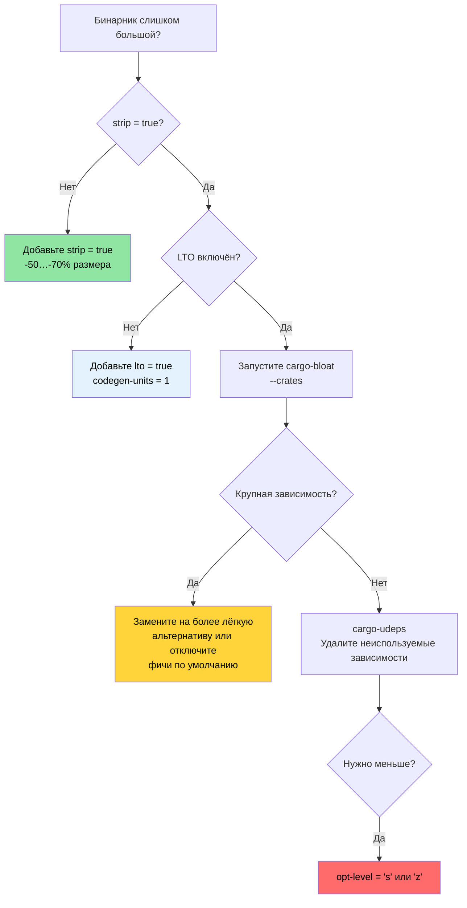

# Профили релиза и размер бинарного файла 🟡

> **Чему вы научитесь:**
> - Устройство профиля релиза: LTO, codegen-units, стратегия паники, strip, opt-level
> - Компромиссы thin LTO, fat LTO и кросс-языкового LTO
> - Анализ размера бинарника с помощью `cargo-bloat`
> - Сокращение зависимостей с помощью `cargo-udeps`, `cargo-machete` и `cargo-shear`
>
> **Перекрёстные ссылки:** [Инструменты времени компиляции](ch08-compile-time-and-developer-tools.md) — вторая половина оптимизации · [Бенчмаркинг](ch03-benchmarking-measuring-what-matters.md) — измеряйте время выполнения до оптимизации · [Зависимости](ch06-dependency-management-and-supply-chain-s.md) — сокращение зависимостей уменьшает и размер, и время компиляции

Стандартный `cargo build --release` уже хорош. Но для продакшн-развёртывания — особенно
инструментов из одного бинарника, которые ставятся на тысячи серверов, — между «хорошо»
и «оптимизировано» есть существенная разница. Эта глава описывает ручки настройки профиля
и инструменты для измерения размера бинарника.

### Устройство профиля релиза

Профили Cargo определяют, как `rustc` компилирует ваш код. Значения по умолчанию
консервативны — они рассчитаны на широкую совместимость, а не на максимальную производительность:

```toml
# Cargo.toml — встроенные значения Cargo по умолчанию (то, что получается, если ничего не указывать)

[profile.release]
opt-level = 3        # Уровень оптимизации (0=нет, 1=базовый, 2=хороший, 3=агрессивный)
lto = false          # Оптимизация на этапе линковки ВЫКЛЮЧЕНА
codegen-units = 16   # Параллельные единицы генерации кода (быстрее компиляция, меньше оптимизации)
panic = "unwind"     # Раскрутка стека при панике (бинарник больше, catch_unwind работает)
strip = "none"       # Сохранять все символы и отладочную информацию
overflow-checks = false  # Проверки переполнения целых чисел в release отключены
debug = false        # Отладочной информации в release нет
```

**Оптимизированный профиль для продакшна** (то, что уже использует проект):

```toml
[profile.release]
lto = true           # Полная оптимизация между крейтами
codegen-units = 1    # Одна единица генерации кода — максимум возможностей для оптимизации
panic = "abort"      # Без накладных расходов на раскрутку — меньше и быстрее
strip = true         # Удалить все символы — меньше бинарник
```

**Влияние каждой настройки:**

| Настройка | По умолчанию → оптимизировано | Размер бинарника | Скорость выполнения | Время компиляции |
|-----------|-------------------------------|------------------|---------------------|------------------|
| `lto = false → true` | — | -10 до -20% | +5 до +20% | В 2–5× медленнее |
| `codegen-units = 16 → 1` | — | -5 до -10% | +5 до +10% | В 1,5–2× медленнее |
| `panic = "unwind" → "abort"` | — | -5 до -10% | Незначительно | Незначительно |
| `strip = "none" → true` | — | -50 до -70% | Нет | Нет |
| `opt-level = 3 → "s"` | — | -10 до -30% | -5 до -10% | Примерно так же |
| `opt-level = 3 → "z"` | — | -15 до -40% | -10 до -20% | Примерно так же |

**Дополнительные тонкие настройки профиля:**

```toml
[profile.release]
# Всё перечисленное выше, плюс:
overflow-checks = true    # Оставить проверки переполнения даже в release (безопасность важнее скорости)
debug = "line-tables-only" # Минимальная отладочная информация для бэктрейсов без полного DWARF
rpath = false             # Не встраивать пути к runtime-библиотекам
incremental = false       # Отключить инкрементальную компиляцию (чище сборки)

# Для сборок, оптимизированных по размеру (встраиваемые системы, WASM):
# opt-level = "z"         # Агрессивная оптимизация по размеру
# strip = "symbols"       # Удалить символы, но оставить секции отладки
```

**Переопределения профиля для отдельных крейтов** — оптимизируйте горячие крейты, остальные не трогайте:

```toml
# Dev-сборки: оптимизируем зависимости, но не свой код (быстрая пересборка)
[profile.dev.package."*"]
opt-level = 2          # Оптимизировать все зависимости в dev-режиме

# Release-сборки: переопределяем оптимизацию для конкретного крейта
[profile.release.package.serde_json]
opt-level = 3          # Максимальная оптимизация для разбора JSON
codegen-units = 1

# Профиль тестов: совпадает с release для точных интеграционных тестов
[profile.test]
opt-level = 1          # Небольшая оптимизация, чтобы медленные тесты не упирались в таймаут
```

### LTO подробно — thin, fat и кросс-языковой

Link-Time Optimization позволяет LLVM оптимизировать код через границы крейтов — встраивать
функции из `serde_json` в ваш код разбора, удалять мёртвый код из `regex` и т. д. Без LTO
каждый крейт — это отдельный «островок» оптимизации.

```toml
[profile.release]
# Вариант 1: Fat LTO (по умолчанию при lto = true)
lto = true
# Весь код объединяется в один модуль LLVM → максимальная оптимизация
# Самая долгая компиляция, самый маленький и быстрый бинарник

# Вариант 2: Thin LTO
lto = "thin"
# Каждый крейт остаётся отдельным, но LLVM делает межмодульную оптимизацию
# Компиляция быстрее, чем у fat LTO, оптимизация почти такая же
# Лучший компромисс для большинства проектов

# Вариант 3: без LTO
lto = false
# Только оптимизация внутри крейта
# Самая быстрая компиляция, бинарник больше

# Вариант 4: выключено (явно)
lto = "off"
# То же, что false
```

**Fat LTO и Thin LTO:**

| Аспект | Fat LTO (`true`) | Thin LTO (`"thin"`) |
|--------|------------------|---------------------|
| Качество оптимизации | Лучшее | ~95% от fat |
| Время компиляции | Долго (весь код в одном модуле) | Умеренно (параллельные модули) |
| Потребление памяти | Высокое (весь LLVM IR в памяти) | Ниже (потоковая обработка) |
| Параллелизм | Нет (один модуль) | Хороший (по модулям) |
| Рекомендуется для | Финальных релизных сборок | Сборок CI и разработки |

**Кросс-языковой LTO** — оптимизация через границы Rust и C:

```toml
[profile.release]
lto = true

# Cargo.toml — для крейтов, использующих крейт cc
[build-dependencies]
cc = "1.0"
```

```rust
// build.rs — включаем кросс-языковой LTO (через линкер-плагин)
fn main() {
    // Крейт cc учитывает CFLAGS из окружения.
    // Для кросс-языкового LTO компилируйте C-код с флагами:
    //   -flto=thin -O2
    cc::Build::new()
        .file("csrc/fast_parser.c")
        .flag("-flto=thin")
        .opt_level(2)
        .compile("fast_parser");
}
```

```bash
# Включаем LTO через линкер-плагин (требуется совместимый линкер LLD или gold)
RUSTFLAGS="-Clinker-plugin-lto -Clinker=clang -Clink-arg=-fuse-ld=lld" \
    cargo build --release
```

Кросс-языковой LTO позволяет LLVM встраивать C-функции в вызывающий их Rust-код и наоборот.
Наибольший эффект — в коде с большим количеством FFI, где часто вызываются маленькие
C-функции (например, обёртки над ioctl для IPMI).

### Анализ размера бинарника с cargo-bloat

[`cargo-bloat`](https://github.com/RazrFalcon/cargo-bloat) отвечает на вопрос:
«Какие функции и крейты занимают больше всего места в моём бинарнике?»

```bash
# Установка
cargo install cargo-bloat

# Показать самые большие функции
cargo bloat --release -n 20
# Вывод:
#  File  .text     Size          Crate    Name
#  2.8%   5.1%  78.5KiB  serde_json       serde_json::de::Deserializer::parse_...
#  2.1%   3.8%  58.2KiB  regex_syntax     regex_syntax::ast::parse::ParserI::p...
#  1.5%   2.7%  42.1KiB  accel_diag         accel_diag::vendor::parse_smi_output
#  ...

# Показать по крейтам (какие зависимости самые большие)
cargo bloat --release --crates
# Вывод:
#  File  .text     Size Crate
# 12.3%  22.1%  340KiB serde_json
#  8.7%  15.6%  240KiB regex
#  6.2%  11.1%  170KiB std
#  5.1%   9.2%  141KiB accel_diag
#  ...

# Сравнить две сборки (до и после оптимизации)
cargo bloat --release --crates > before.txt
# ... вносим изменения ...
cargo bloat --release --crates > after.txt
diff before.txt after.txt
```

**Типичные источники раздувания и способы борьбы с ними:**

| Источник раздувания | Типичный размер | Решение |
|---------------------|-----------------|---------|
| `regex` (полный движок) | 200–400 КБ | Используйте `regex-lite`, если Unicode не нужен |
| `serde_json` (полный) | 200–350 КБ | Рассмотрите `simd-json` или `sonic-rs`, если важна производительность |
| Мономорфизация обобщений | Зависит от случая | Используйте `dyn Trait` на границах API |
| Механизмы форматирования (`Display`, `Debug`) | 50–150 КБ | `#[derive(Debug)]` на больших перечислениях накапливается |
| Строки сообщений о панике | 20–80 КБ | `panic = "abort"` убирает раскрутку, `strip` убирает строки |
| Неиспользуемые фичи | Зависит от случая | Отключите фичи по умолчанию: `serde = { version = "1", default-features = false }` |

### Сокращение зависимостей с помощью cargo-udeps

[`cargo-udeps`](https://github.com/est31/cargo-udeps) находит зависимости, объявленные в
`Cargo.toml`, которые ваш код на самом деле не использует:

```bash
# Установка (требуется nightly)
cargo install cargo-udeps

# Поиск неиспользуемых зависимостей
cargo +nightly udeps --workspace
# Вывод:
# unused dependencies:
# `diag_tool v0.1.0`
# └── "tempfile" (dev-dependency)
#
# `accel_diag v0.1.0`
# └── "once_cell"    ← нужна была до LazyLock, теперь мёртвая
```

Каждая неиспользуемая зависимость:
- Увеличивает время компиляции
- Увеличивает размер бинарника
- Добавляет риски цепочки поставок
- Добавляет возможные проблемы с лицензиями

**Альтернатива: `cargo-machete`** — быстрый эвристический подход:

```bash
cargo install cargo-machete
cargo machete
# Быстрее, но возможны ложные срабатывания (эвристика, а не анализ на основе компиляции)
```

**Альтернатива: `cargo-shear`** — золотая середина между `cargo-udeps` и `cargo-machete`:

```bash
cargo install cargo-shear
cargo shear --fix
# Медленнее, чем cargo-machete, но намного быстрее cargo-udeps
# Значительно меньше ложных срабатываний, чем у cargo-machete
```

### Дерево решений по оптимизации размера



### 🏋️ Упражнения

#### 🟢 Упражнение 1: измерьте эффект LTO

Соберите проект с настройками release по умолчанию, затем с `lto = true` +
`codegen-units = 1` + `strip = true`. Сравните размер бинарника и время компиляции.

<details>
<summary>Решение</summary>

```bash
# Release по умолчанию
cargo build --release
ls -lh target/release/my-binary
time cargo build --release  # Запомните время

# Оптимизированный release — добавьте в Cargo.toml:
# [profile.release]
# lto = true
# codegen-units = 1
# strip = true
# panic = "abort"

cargo clean
cargo build --release
ls -lh target/release/my-binary  # Обычно на 30–50% меньше
time cargo build --release       # Обычно компиляция в 2–3× медленнее
```
</details>

#### 🟡 Упражнение 2: найдите самый большой крейт

Запустите `cargo bloat --release --crates` на проекте. Определите самую большую зависимость.
Можно ли её уменьшить, отключив фичи по умолчанию или заменив на более лёгкую альтернативу?

<details>
<summary>Решение</summary>

```bash
cargo install cargo-bloat
cargo bloat --release --crates
# Вывод:
#  File  .text     Size Crate
# 12.3%  22.1%  340KiB serde_json
#  8.7%  15.6%  240KiB regex

# Для regex — попробуйте regex-lite, если Unicode не нужен:
# regex-lite = "0.1"  # ~10× меньше полного regex

# Для serde — отключите фичи по умолчанию, если std не нужен:
# serde = { version = "1", default-features = false, features = ["derive"] }

cargo bloat --release --crates  # Сравните результаты после изменений
```
</details>

### Ключевые выводы

- `lto = true` + `codegen-units = 1` + `strip = true` + `panic = "abort"` — это профиль релиза для продакшна
- Thin LTO (`lto = "thin"`) даёт около 80% выигрыша fat LTO при малой части затрат на компиляцию
- `cargo-bloat --crates` точно показывает, какие зависимости занимают место в бинарнике
- `cargo-udeps`, `cargo-machete` и `cargo-shear` находят мёртвые зависимости, которые тратят время компиляции и размер бинарника
- Переопределения профиля для отдельных крейтов позволяют оптимизировать горячие крейты, не замедляя всю сборку

---
