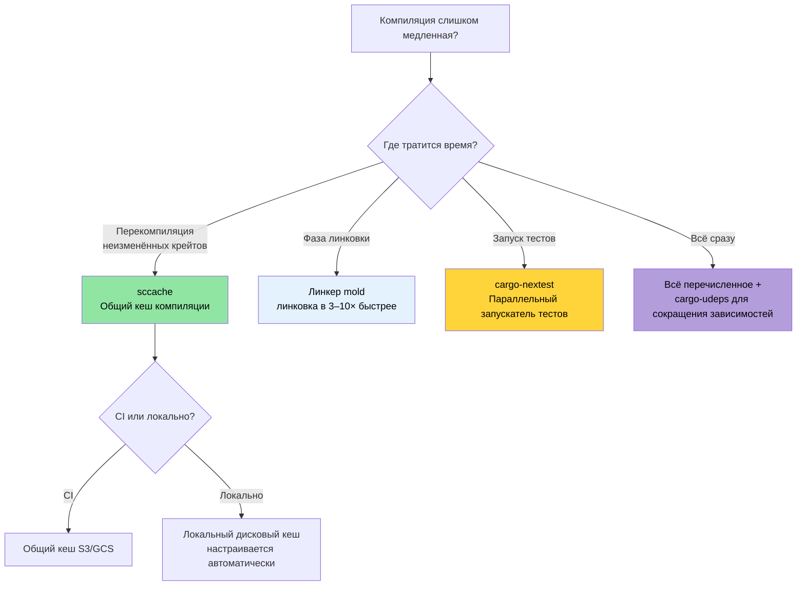

# Инструменты времени компиляции и разработки 🟡

> **Чему вы научитесь:**
> - Кеширование компиляции с помощью `sccache` для локальных сборок и CI
> - Более быстрая линковка с `mold` (в 3–10× быстрее линкера по умолчанию)
> - `cargo-nextest`: более быстрый и информативный запускатель тестов
> - Инструменты наблюдения за разработкой: `cargo-expand`, `cargo-geiger`, `cargo-watch`
> - Линты воркспейса, политика MSRV и документация как часть CI
>
> **Перекрёстные ссылки:** [Профили релиза](ch07-release-profiles-and-binary-size.md) — LTO и оптимизация размера бинарника · [CI/CD-конвейер](ch11-putting-it-all-together-a-production-cic.md) — эти инструменты встраиваются в ваш конвейер · [Зависимости](ch06-dependency-management-and-supply-chain-s.md) — меньше зависимостей = быстрее компиляция

### Оптимизация времени компиляции: sccache, mold, cargo-nextest

Долгая компиляция — главная боль разработчиков на Rust. Эти инструменты вместе могут
сократить время итерации на 50–80%:

**`sccache` — общий кеш компиляции:**

```bash
# Установка
cargo install sccache

# Настраиваем как обёртку rustc
export RUSTC_WRAPPER=sccache

# Или задаём постоянно в .cargo/config.toml:
# [build]
# rustc-wrapper = "sccache"

# Первая сборка: обычная скорость (заполняет кеш)
cargo build --release  # 3 минуты

# Очистка и пересборка: попадания в кеш для неизменившихся крейтов
cargo clean && cargo build --release  # 45 секунд

# Проверка статистики кеша
sccache --show-stats
# Compile requests        1,234
# Cache hits               987 (80%)
# Cache misses             247
```

`sccache` поддерживает общие кеши (S3, GCS, Azure Blob) для обмена кешем в команде и в CI.

**`mold` — более быстрый линкер:**

Линковка часто оказывается самой медленной фазой. `mold` в 3–5× быстрее `lld` и в 10–20×
быстрее стандартного GNU `ld`:

```bash
# Установка
sudo apt install mold  # Ubuntu 22.04+
# Примечание: mold предназначен для целей ELF (Linux). macOS использует Mach-O, а не ELF.
# Линкер macOS (ld64) и так довольно быстрый; если нужен более быстрый:
# brew install sold     # sold = mold для Mach-O (экспериментально, менее зрелый)
# На практике время линковки на macOS редко становится узким местом.
```

```toml
# Используем mold для линковки
# .cargo/config.toml
[target.x86_64-unknown-linux-gnu]
rustflags = ["-C", "link-arg=-fuse-ld=mold"]
```

```bash
# См. https://github.com/rui314/mold/blob/main/docs/mold.md#environment-variables
export MOLD_JOBS=1

# Проверяем, что используется mold
cargo build -v 2>&1 | grep mold
```

**`cargo-nextest` — более быстрый запускатель тестов:**

```bash
# Установка
cargo install cargo-nextest

# Запуск тестов (по умолчанию параллельно, с таймаутом на тест и повторами)
cargo nextest run

# Ключевые преимущества перед cargo test:
# - Каждый тест выполняется в своём процессе → лучше изоляция
# - Параллельное выполнение с умным планированием
# - Таймауты на тест (больше никаких зависших CI)
# - Вывод в JUnit XML для CI
# - Повтор упавших тестов

# Конфигурация
cargo nextest run --retries 2 --fail-fast

# Архивируем тестовые бинарники (полезно для CI: собрать один раз, тестировать на нескольких машинах)
cargo nextest archive --archive-file tests.tar.zst
cargo nextest run --archive-file tests.tar.zst
```

```toml
# .config/nextest.toml
[profile.default]
retries = 0
slow-timeout = { period = "60s", terminate-after = 3 }
fail-fast = true

[profile.ci]
retries = 2
fail-fast = false
junit = { path = "test-results.xml" }
```

**Общая конфигурация для разработки:**

```toml
# .cargo/config.toml — оптимизируем внутренний цикл разработки
[build]
rustc-wrapper = "sccache"       # Кешировать артефакты компиляции

[target.x86_64-unknown-linux-gnu]
rustflags = ["-C", "link-arg=-fuse-ld=mold"]  # Более быстрая линковка

# Dev-профиль: оптимизируем зависимости, но не свой код
# (поместить в Cargo.toml)
# [profile.dev.package."*"]
# opt-level = 2
```

### cargo-expand и cargo-geiger — инструменты наблюдения

**`cargo-expand`** — посмотреть, что генерируют макросы:

```bash
cargo install cargo-expand

# Раскрыть все макросы в конкретном модуле
cargo expand --lib accel_diag::vendor

# Раскрыть конкретный derive
# Дано: #[derive(Debug, Serialize, Deserialize)]
# cargo expand покажет сгенерированные блоки impl
cargo expand --lib --tests
```

Незаменим для отладки вывода макросов `#[derive]`, раскрытий `macro_rules!` и для понимания
того, что генерирует `serde` для ваших типов.

Помимо `cargo-expand`, раскрыть макросы можно и с помощью rust-analyzer:

1. Установите курсор на макрос, который хотите проверить.
2. Откройте палитру команд (например, `F1` в VSCode).
3. Найдите `rust-analyzer: Expand macro recursively at caret`.

**`cargo-geiger`** — подсчёт использования `unsafe` во всём дереве зависимостей:

```bash
cargo install cargo-geiger

cargo geiger
# Output:
# Metric output format: x/y
#   x = unsafe code used by the build
#   y = total unsafe code found in the crate
#
# Functions  Expressions  Impls  Traits  Methods
# 0/0        0/0          0/0    0/0     0/0      ✅ my_crate
# 0/5        0/23         0/2    0/0     0/3      ✅ serde
# 3/3        14/14        0/0    0/0     2/2      ❗ libc
# 15/15      142/142      4/4    0/0     12/12    ☢️ ring

# Обозначения:
# ✅ = unsafe не используется
# ❗ = используется некоторое количество unsafe
# ☢️ = сильно использует unsafe
```

Для политики проекта «без unsafe» `cargo geiger` проверяет, что ни одна зависимость не
вносит в граф вызовов, который реально выполняет ваш код, unsafe-код.

### Линты воркспейса — `[workspace.lints]`

Начиная с Rust 1.74, Clippy и линты компилятора можно настраивать централизованно в
`Cargo.toml` — больше не нужны `#![deny(...)]` в начале каждого крейта:

```toml
# Корневой Cargo.toml — конфигурация линтов для всех крейтов
[workspace.lints.clippy]
unwrap_used = "warn"         # Предпочитайте ? или expect("причина")
dbg_macro = "deny"           # Не допускаем dbg!() в закоммиченном коде
todo = "warn"                # Отслеживаем незавершённые реализации
large_enum_variant = "warn"  # Ловим случайное раздувание размера

[workspace.lints.rust]
unsafe_code = "deny"         # Обеспечиваем политику «без unsafe»
missing_docs = "warn"        # Поощряем документирование
```

```toml
# Cargo.toml каждого крейта — подключаем линты воркспейса
[lints]
workspace = true
```

Это заменяет разрозненные атрибуты `#![deny(clippy::unwrap_used)]` и обеспечивает единую
политику во всём воркспейсе.

**Автоисправление предупреждений Clippy:**

```bash
# Пусть Clippy автоматически применит предложения, которые можно применить механически
cargo clippy --fix --workspace --all-targets --allow-dirty

# Исправляем и применяем предложения, которые могут изменить поведение (проверяйте внимательно!)
cargo clippy --fix --workspace --all-targets --allow-dirty -- -W clippy::pedantic
```

> **Совет**: запускайте `cargo clippy --fix` перед коммитом. Он обрабатывает тривиальные
> проблемы (неиспользуемые импорты, избыточные клоны, упрощения типов), которые вручную
> исправлять скучно.

### Политика MSRV и rust-version

Minimum Supported Rust Version (MSRV) гарантирует, что ваш крейт компилируется на старых
тулчейнах. Это важно при развёртывании на системах с замороженной версией Rust.

```toml
# Cargo.toml
[package]
name = "diag_tool"
version = "0.1.0"
rust-version = "1.75"    # Минимальная требуемая версия Rust
```

```bash
# Проверка соответствия MSRV
cargo +1.75.0 check --workspace

# Автоматический поиск MSRV
cargo install cargo-msrv
cargo msrv find
# Output: Minimum Supported Rust Version is 1.75.0

# Проверка в CI
cargo msrv verify
```

**MSRV в CI:**

```yaml
jobs:
  msrv:
    name: Проверка MSRV
    runs-on: ubuntu-latest
    steps:
      - uses: actions/checkout@v4
      - uses: dtolnay/rust-toolchain@master
        with:
          toolchain: "1.75.0"    # Совпадает с rust-version в Cargo.toml
      - run: cargo check --workspace
```

**Стратегия MSRV:**
- **Бинарные приложения** (как большой проект): используйте последний stable. MSRV не нужен.
- **Библиотечные крейты** (публикуемые на crates.io): задайте MSRV как самую старую версию
  Rust, которая поддерживает все используемые фичи. Обычно это `N-2` (на две версии позади текущей).
- **Корпоративные развёртывания**: задайте MSRV по самой старой версии Rust, установленной на вашем парке.

### Применение: профиль продакшн-бинарника

В проекте уже есть отличный [профиль релиза](ch07-release-profiles-and-binary-size.md):

```toml
# Текущий Cargo.toml воркспейса
[profile.release]
lto = true           # ✅ Полная оптимизация между крейтами
codegen-units = 1    # ✅ Максимальная оптимизация
panic = "abort"      # ✅ Нет накладных расходов на раскрутку
strip = true         # ✅ Удаляем символы для развёртывания

[profile.dev]
opt-level = 0        # ✅ Быстрая компиляция
debug = true         # ✅ Полная отладочная информация
```

**Рекомендуемые дополнения:**

```toml
# Оптимизируем зависимости в dev-режиме (быстрее выполнение тестов)
[profile.dev.package."*"]
opt-level = 2

# Профиль тестов: немного оптимизации, чтобы медленные тесты не упирались в таймаут
[profile.test]
opt-level = 1

# Оставляем проверки переполнения в release (безопасность)
[profile.release]
lto = true
codegen-units = 1
panic = "abort"
strip = true
overflow-checks = true    # ← добавьте: ловим переполнения целых чисел
debug = "line-tables-only" # ← добавьте: бэктрейсы без полного DWARF
```

**Рекомендуемые инструменты для разработчика:**

```toml
# .cargo/config.toml (предлагаемый)
[build]
rustc-wrapper = "sccache"  # 80%+ попаданий в кеш после первой сборки

[target.x86_64-unknown-linux-gnu]
rustflags = ["-C", "link-arg=-fuse-ld=mold"]  # В 3–5× быстрее линковка
```

**Ожидаемый эффект на проект:**

| Метрика | Сейчас | С дополнениями |
|---------|--------|----------------|
| Release-бинарник | ~10 МБ (stripped, LTO) | То же |
| Время dev-сборки | ~45 с | ~25 с (sccache + mold) |
| Пересборка (изменение одного файла) | ~15 с | ~5 с (sccache + mold) |
| Запуск тестов | `cargo test` | `cargo nextest` — в 2× быстрее |
| Сканирование уязвимостей зависимостей | Нет | `cargo audit` в CI |
| Соответствие лицензиям | Вручную | `cargo deny` автоматически |
| Поиск неиспользуемых зависимостей | Вручную | `cargo udeps` в CI |

### `cargo-watch` — автоматическая пересборка при изменении файлов

[`cargo-watch`](https://github.com/watchexec/cargo-watch) перезапускает команду при каждом
изменении исходного файла — незаменим для быстрого цикла обратной связи:

```bash
# Установка
cargo install cargo-watch

# Повторная проверка при каждом сохранении (мгновенная обратная связь)
cargo watch -x check

# Запуск clippy и тестов при изменении
cargo watch -x 'clippy --workspace --all-targets' -x 'test --workspace --lib'

# Следим только за конкретными крейтами (быстрее для больших воркспейсов)
cargo watch -w accel_diag/src -x 'test -p accel_diag'

# Очищать экран между запусками
cargo watch -c -x check
```

> **Совет**: сочетайте с `mold` и `sccache` из примеров выше, чтобы инкрементальная проверка
> занимала меньше секунды.

### `cargo doc` и документация воркспейса

Для большого воркспейса сгенерированная документация необходима, чтобы API было легко
найти. `cargo doc` использует rustdoc, чтобы создать HTML-документацию из doc-комментариев
и сигнатур типов:

```bash
# Генерация документации для всех крейтов воркспейса (откроется в браузере)
cargo doc --workspace --no-deps --open

# Включить приватные элементы (полезно при разработке)
cargo doc --workspace --no-deps --document-private-items

# Проверить ссылки в документации без генерации HTML (быстрая проверка в CI)
cargo doc --workspace --no-deps 2>&1 | grep -E 'warning|error'
```

**Внутридокументные ссылки** — ссылки между типами разных крейтов без URL:

```rust
/// Запускает диагностику GPU с настройками из [`GpuConfig`].
///
/// Реализацию см. в [`crate::accel_diag::run_diagnostics`].
/// Возвращает [`DiagResult`], который можно сериализовать
/// в формат [`DerReport`](crate::core_lib::DerReport).
pub fn run_accel_diag(config: &GpuConfig) -> DiagResult {
    // ...
}
```

**Показываем платформенно-специфичные API в документации:**

```rust
// Cargo.toml: [package.metadata.docs.rs]
// all-features = true
// rustdoc-args = ["--cfg", "docsrs"]

/// Только для Windows: читает состояние батареи через Win32 API.
///
/// Доступно только в сборках `cfg(windows)`.
#[cfg(windows)]
#[doc(cfg(windows))]  // Показывает бейдж «Доступно только в Windows» в документации
pub fn get_battery_status() -> Option<u8> {
    // ...
}
```

**Проверка документации в CI:**

```yaml
# Добавьте в workflow CI
- name: Проверка документации
  run: RUSTDOCFLAGS="-D warnings" cargo doc --workspace --no-deps
  # Считает битые внутридокументные ссылки ошибками
```

> **Для проекта**: при большом количестве крейтов `cargo doc --workspace` — лучший способ
> для новых участников команды увидеть поверхность API. Добавьте `RUSTDOCFLAGS="-D warnings"`
> в CI, чтобы ловить битые ссылки до слияния.

### Дерево решений по времени компиляции



### 🏋️ Упражнения

#### 🟢 Упражнение 1: настройте sccache и mold

Установите `sccache` и `mold`, настройте их в `.cargo/config.toml`, затем измерьте выигрыш
по времени компиляции при чистой пересборке.

<details>
<summary>Решение</summary>

```bash
# Установка
cargo install sccache
sudo apt install mold  # Ubuntu 22.04+

# Настраиваем .cargo/config.toml:
cat > .cargo/config.toml << 'EOF'
[build]
rustc-wrapper = "sccache"

[target.x86_64-unknown-linux-gnu]
linker = "clang"
rustflags = ["-C", "link-arg=-fuse-ld=mold"]
EOF

# Первая сборка (заполняет кеш)
time cargo build --release  # например, 180 с

# Очистка и пересборка (попадания в кеш)
cargo clean
time cargo build --release  # например, 45 с

sccache --show-stats
# Попаданий в кеш должно быть 60–80%+
```
</details>

#### 🟡 Упражнение 2: переходим на cargo-nextest

Установите `cargo-nextest` и запустите набор тестов. Сравните реальное время с `cargo test`.
Каков прирост скорости?

<details>
<summary>Решение</summary>

```bash
cargo install cargo-nextest

# Стандартный запускатель тестов
time cargo test --workspace 2>&1 | tail -5

# nextest (параллельное выполнение по тестовым бинарникам)
time cargo nextest run --workspace 2>&1 | tail -5

# Типичный прирост: в 2–5× для больших воркспейсов
# nextest также предоставляет:
# - время выполнения каждого теста
# - повторы для нестабильных тестов
# - вывод JUnit XML для CI
cargo nextest run --workspace --retries 2
```
</details>

### Ключевые выводы

- `sccache` с бэкендом S3/GCS разделяет кеш компиляции между командой и CI
- `mold` — самый быстрый линкер для ELF: время линковки падает с секунд до миллисекунд
- `cargo-nextest` запускает тесты параллельно по бинарникам, с лучшим выводом и поддержкой повторов
- `cargo-geiger` считает использование `unsafe` — запускайте его перед тем, как принимать новые зависимости
- `[workspace.lints]` централизует настройку линтов Clippy и rustc во всём многокрейтовом воркспейсе

---
