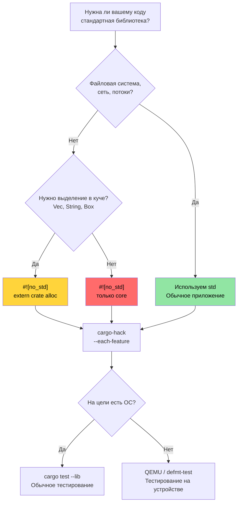

# `no_std` и проверка фич 🔴

> **Чему вы научитесь:**
> - Систематическая проверка комбинаций фич с помощью `cargo-hack`
> - Три уровня Rust: `core`, `alloc` и `std` — когда что использовать
> - Сборка крейтов `no_std` с собственными обработчиками паники и аллокаторами
> - Тестирование кода `no_std` на хосте и с помощью QEMU
>
> **Перекрёстные ссылки:** [Windows и условная компиляция](ch10-windows-and-conditional-compilation.md) — платформенная половина этой темы · [Кросс-компиляция](ch02-cross-compilation-one-source-many-target.md) — кросс-компиляция под ARM и встраиваемые цели · [Miri и санитайзеры](ch05-miri-valgrind-and-sanitizers-verifying-u.md) — проверка `unsafe`-кода в окружениях `no_std` · [Build-скрипты](ch01-build-scripts-buildrs-in-depth.md) — `cfg`-флаги, которые выводит `build.rs`

Rust работает везде — от 8-битных микроконтроллеров до облачных серверов. Эта глава описывает
фундамент: как отказаться от стандартной библиотеки через `#![no_std]` и проверить, что
ваши комбинации фич действительно компилируются.

### Проверка комбинаций фич с помощью `cargo-hack`

[`cargo-hack`](https://github.com/taiki-e/cargo-hack) систематически проверяет все комбинации
фич — это необходимо для крейтов с кодом под `#[cfg(...)]`:

```bash
# Установка
cargo install cargo-hack

# Проверяем, что каждая фича компилируется по отдельности
cargo hack check --each-feature --workspace

# Ядерный вариант: проверяем ВСЕ комбинации фич (экспоненциально!)
# Годится только для крейтов с менее чем 8 фичами.
cargo hack check --feature-powerset --workspace

# Практичный компромисс: каждая фича отдельно + все фичи + ни одной фичи
cargo hack check --each-feature --workspace --no-dev-deps
cargo check --workspace --all-features
cargo check --workspace --no-default-features
```

**Почему это важно для проекта:**

Если вы добавляете платформенные фичи (`linux`, `windows`, `direct-ipmi`, `direct-accel-api`),
`cargo-hack` поймает комбинации, которые ломаются:

```toml
# Пример: фичи, которые закрывают платформенный код
[features]
default = ["linux"]
linux = []                          # Доступ к железу, специфичный для Linux
windows = ["dep:windows-sys"]       # API, специфичные для Windows
direct-ipmi = []                    # небезопасный ioctl IPMI (гл. 5)
direct-accel-api = []                    # небезопасный FFI accel-mgmt (гл. 5)
```

```bash
# Проверяем, что все фичи компилируются по отдельности И вместе
cargo hack check --each-feature -p diag_tool
# Ловит: «feature 'windows' не компилируется без 'direct-ipmi'»
# Ловит: опечатку в #[cfg(feature = \"linux\")] — там написано 'lnux'
```

**Интеграция с CI:**

```yaml
# Добавьте в конвейер CI (быстро — только проверки компиляции)
- name: Проверка матрицы фич
  run: cargo hack check --each-feature --workspace --no-dev-deps
```

> **Эмпирическое правило**: запускайте `cargo hack check --each-feature` в CI для любого
> крейта с двумя и более фичами. `--feature-powerset` — только для базовых библиотечных крейтов
> с менее чем 8 фичами: это экспоненциально ($2^n$ комбинаций).

### `no_std` — когда и зачем

`#![no_std]` говорит компилятору: «не линкуй стандартную библиотеку». Крейт может использовать
только `core` (и, при необходимости, `alloc`). Зачем это нужно?

| Сценарий | Зачем `no_std` |
|----------|----------------|
| Встраиваемая прошивка (ARM Cortex-M, RISC-V) | Нет ОС, нет кучи, нет файловой системы |
| UEFI-диагностический инструмент | Среда до загрузки ОС, нет API ОС |
| Модули ядра | Пространство ядра не может использовать пользовательский `std` |
| WebAssembly (WASM) | Минимизация размера бинарника, нет зависимостей от ОС |
| Загрузчики | Работают до появления какой-либо ОС |
| Разделяемая библиотека с C-интерфейсом | Не тянуть рантайм Rust в вызывающий код |

**Для диагностики железа** `no_std` становится актуален при создании:
- UEFI-диагностических инструментов, которые работают до загрузки ОС
- Диагностики прошивки BMC (ограниченные по ресурсам ARM SoC)
- Диагностики PCIe на уровне ядра (модуль ядра или eBPF-зонд)

### `core`, `alloc` и `std` — три уровня

```text
┌─────────────────────────────────────────────────────────────┐
│ std                                                         │
│  Всё из core и alloc, ПЛЮС:                                 │
│  • Файловый ввод-вывод (std::fs, std::io)                   │
│  • Сеть (std::net)                                          │
│  • Потоки (std::thread)                                     │
│  • Время (std::time)                                        │
│  • Окружение (std::env)                                     │
│  • Процессы (std::process)                                  │
│  • Специфичное для ОС (std::os::unix, std::os::windows)     │
├─────────────────────────────────────────────────────────────┤
│ alloc          (доступен с #![no_std] + extern crate        │
│                 alloc, если есть глобальный аллокатор)      │
│  • String, Vec, Box, Rc, Arc                                │
│  • BTreeMap, BTreeSet                                       │
│  • Макрос format!()                                         │
│  • Коллекции и умные указатели, которым нужна куча          │
├─────────────────────────────────────────────────────────────┤
│ core           (всегда доступен, даже в #![no_std])         │
│  • Примитивные типы (u8, bool, char и др.)                  │
│  • Option, Result                                           │
│  • Iterator, slice, array, str (срезы, а не String)         │
│  • Трейты: Clone, Copy, Debug, Display, From, Into          │
│  • Атомарные типы (core::sync::atomic)                      │
│  • Cell, RefCell (core::cell) — Pin (core::pin)             │
│  • core::fmt (форматирование без выделения памяти)          │
│  • core::mem, core::ptr (низкоуровневые операции с памятью) │
│  • Математика: core::num, базовая арифметика                │
└─────────────────────────────────────────────────────────────┘
```

**Что вы теряете без `std`:**
- Нет `HashMap` (нужен хешер — используйте `BTreeMap` из `alloc` или `hashbrown`)
- Нет `println!()` (нужен stdout — используйте `core::fmt::Write` в буфер)
- Нет `std::error::Error` (стабилизирован в `core` начиная с Rust 1.81, но многие экосистемы ещё не перешли)
- Нет файлового ввода-вывода, сети и потоков (если их не предоставляет платформенный HAL)
- Нет `Mutex` (используйте `spin::Mutex` или платформенные блокировки)

### Сборка крейта `no_std`

```rust
// src/lib.rs — библиотечный крейт no_std
#![no_std]

// При желании используем выделение памяти в куче
extern crate alloc;
use alloc::string::String;
use alloc::vec::Vec;
use core::fmt;

/// Показание температуры с термодатчика.
/// Работает в любой среде — от голого железа до Linux.
#[derive(Clone, Copy, Debug)]
pub struct Temperature {
    /// Сырое значение датчика (0.0625°C на LSB для типичных I2C-датчиков)
    raw: u16,
}

impl Temperature {
    pub const fn from_raw(raw: u16) -> Self {
        Self { raw }
    }

    /// Преобразование в градусы Цельсия (fixed-point, FPU не нужен)
    pub const fn millidegrees_c(&self) -> i32 {
        (self.raw as i32) * 625 / 10 // разрешение 0.0625°C
    }

    pub fn degrees_c(&self) -> f32 {
        self.raw as f32 * 0.0625
    }
}

impl fmt::Display for Temperature {
    fn fmt(&self, f: &mut fmt::Formatter<'_>) -> fmt::Result {
        let md = self.millidegrees_c();
        // Обрабатываем знак корректно для значений между -0.999°C и -0.001°C,
        // где md / 1000 == 0, но значение отрицательное.
        if md < 0 && md > -1000 {
            write!(f, "-0.{:03}°C", (-md) % 1000)
        } else {
            write!(f, "{}.{:03}°C", md / 1000, (md % 1000).abs())
        }
    }
}

/// Разбор значений температуры, разделённых пробелами.
/// Использует alloc — требуется глобальный аллокатор.
pub fn parse_temperatures(input: &str) -> Vec<Temperature> {
    input
        .split_whitespace()
        .filter_map(|s| s.parse::<u16>().ok())
        .map(Temperature::from_raw)
        .collect()
}

/// Форматирование без выделения памяти — пишем прямо в буфер.
/// Работает в окружениях только с `core` (без alloc и кучи).
pub fn format_temp_into(temp: &Temperature, buf: &mut [u8]) -> usize {
    use core::fmt::Write;
    struct SliceWriter<'a> {
        buf: &'a mut [u8],
        pos: usize,
    }
    impl<'a> Write for SliceWriter<'a> {
        fn write_str(&mut self, s: &str) -> fmt::Result {
            let bytes = s.as_bytes();
            let remaining = self.buf.len() - self.pos;
            if bytes.len() > remaining {
                // Буфер полон — сообщаем об ошибке вместо тихого обрезания.
                // Вызывающий код может проверить возвращённый pos на частичную запись.
                return Err(fmt::Error);
            }
            self.buf[self.pos..self.pos + bytes.len()].copy_from_slice(bytes);
            self.pos += bytes.len();
            Ok(())
        }
    }
    let mut w = SliceWriter { buf, pos: 0 };
    let _ = write!(w, "{}", temp);
    w.pos
}
```

```toml
# Cargo.toml для крейта no_std
[package]
name = "thermal-sensor"
version = "0.1.0"
edition = "2021"

[features]
default = ["alloc"]
alloc = []    # Включает Vec, String и т. д.
std = []      # Включает полный std (подразумевает alloc)

[dependencies]
# Используем совместимые с no_std крейты
serde = { version = "1.0", default-features = false, features = ["derive"] }
# ↑ default-features = false убирает зависимость от std!
```

> **Ключевой паттерн крейтов**: многие популярные крейты (serde, log, rand, embedded-hal)
> поддерживают `no_std` через `default-features = false`. Всегда проверяйте, требует ли
> зависимость `std`, прежде чем использовать её в контексте `no_std`. Учтите, что некоторым
> крейтам (например, `regex`) нужен как минимум `alloc`, и в окружениях только с `core`
> они не работают.

### Собственные обработчики паники и аллокаторы

В бинарниках `#![no_std]` (а не в библиотеках) нужно предоставить обработчик паники и,
при необходимости, глобальный аллокатор:

```rust
// src/main.rs — бинарник no_std (например, UEFI-диагностика)
#![no_std]
#![no_main]

extern crate alloc;

use core::panic::PanicInfo;

// Обязательно: что делать при панике (раскрутки стека нет)
#[panic_handler]
fn panic(info: &PanicInfo) -> ! {
    // В embedded: мигнуть светодиодом, писать в UART, зависнуть
    // В UEFI: вывести сообщение в консоль, остановиться
    // Минимально: просто бесконечный цикл
    loop {
        core::hint::spin_loop();
    }
}

// Обязательно при использовании alloc: предоставить глобальный аллокатор
use alloc::alloc::{GlobalAlloc, Layout};

struct BumpAllocator {
    // Простой bump-аллокатор для embedded/UEFI
    // В реальности используйте крейт вроде `linked_list_allocator` или `embedded-alloc`
}

// ПРЕДУПРЕЖДЕНИЕ: это нерабочая заглушка! Вызов alloc() вернёт null,
// что сразу приведёт к UB (контракт глобального аллокатора требует
// ненулевых результатов для выделений ненулевого размера). В реальном коде
// используйте проверенный крейт-аллокатор:
//   - embedded-alloc (embedded-цели)
//   - linked_list_allocator (UEFI / ядра ОС)
//   - talc (универсальный no_std)
unsafe impl GlobalAlloc for BumpAllocator {
    /// # Safety
    /// Layout должен иметь ненулевой размер. Возвращает null (заглушка — упадёт).
    unsafe fn alloc(&self, _layout: Layout) -> *mut u8 {
        // ЗАГЛУШКА — упадёт! Замените на реальную логику выделения.
        core::ptr::null_mut()
    }
    /// # Safety
    /// `_ptr` должен быть возвращён `alloc` с совместимым layout.
    unsafe fn dealloc(&self, _ptr: *mut u8, _layout: Layout) {
        // Ничего не делаем для bump-аллокатора
    }
}

#[global_allocator]
static ALLOCATOR: BumpAllocator = BumpAllocator {};

// Точка входа (зависит от платформы, а не fn main)
// Для UEFI: #[entry] или efi_main
// Для embedded: #[cortex_m_rt::entry]
```

### Тестирование кода `no_std`

Тесты выполняются на хост-машине, где есть `std`. Хитрость: ваша библиотека — `no_std`,
но тестовый харнес использует `std`:

```rust
// Ваш крейт: #![no_std] в src/lib.rs
// Но тесты автоматически работают под std:

#[cfg(test)]
mod tests {
    use super::*;
    // std здесь доступен — println!, assert!, Vec работают

    #[test]
    fn test_temperature_conversion() {
        let temp = Temperature::from_raw(800); // 50.0°C
        assert_eq!(temp.millidegrees_c(), 50000);
        assert!((temp.degrees_c() - 50.0).abs() < 0.01);
    }

    #[test]
    fn test_format_into_buffer() {
        let temp = Temperature::from_raw(800);
        let mut buf = [0u8; 32];
        let len = format_temp_into(&temp, &mut buf);
        let s = core::str::from_utf8(&buf[..len]).unwrap();
        assert_eq!(s, "50.000°C");
    }
}
```

**Тестирование на реальной цели** (когда `std` вообще недоступен):

```bash
# Для тестов на устройстве (встраиваемый ARM) используйте defmt-test
# Для целей UEFI используйте uefi-test-runner
# Для кросс-архитектурных тестов без железа используйте QEMU

# Запуск тестов библиотеки no_std на хосте (всегда работает):
cargo test --lib

# Проверка компиляции no_std под целевую платформу no_std:
cargo check --target thumbv7em-none-eabihf  # ARM Cortex-M
cargo check --target riscv32imac-unknown-none-elf  # RISC-V
```

### Дерево решений по `no_std`



### 🏋️ Упражнения

#### 🟡 Упражнение 1: проверка комбинаций фич

Установите `cargo-hack` и запустите `cargo hack check --each-feature --workspace` на проекте
с несколькими фичами. Находит ли он нерабочие комбинации?

<details>
<summary>Решение</summary>

```bash
cargo install cargo-hack

# Проверяем каждую фичу по отдельности
cargo hack check --each-feature --workspace --no-dev-deps

# Если какая-то комбинация фич не компилируется:
# error[E0433]: failed to resolve: use of undeclared crate or module `std`
# → Значит, в фича-гейте не хватает защиты #[cfg]

# Проверяем все фичи, отсутствие фич и каждую по отдельности:
cargo hack check --each-feature --workspace
cargo check --workspace --all-features
cargo check --workspace --no-default-features
```
</details>

#### 🔴 Упражнение 2: сборка библиотеки `no_std`

Создайте библиотечный крейт, который компилируется с `#![no_std]`. Реализуйте простой кольцевой
буфер на стеке. Проверьте компиляцию под `thumbv7em-none-eabihf` (ARM Cortex-M).

<details>
<summary>Решение</summary>

```rust
// lib.rs
#![no_std]

pub struct RingBuffer<const N: usize> {
    data: [u8; N],
    head: usize,
    len: usize,
}

impl<const N: usize> RingBuffer<N> {
    pub const fn new() -> Self {
        Self { data: [0; N], head: 0, len: 0 }
    }

    pub fn push(&mut self, byte: u8) -> bool {
        if self.len == N { return false; }
        let idx = (self.head + self.len) % N;
        self.data[idx] = byte;
        self.len += 1;
        true
    }

    pub fn pop(&mut self) -> Option<u8> {
        if self.len == 0 { return None; }
        let byte = self.data[self.head];
        self.head = (self.head + 1) % N;
        self.len -= 1;
        Some(byte)
    }
}

#[cfg(test)]
mod tests {
    use super::*;

    #[test]
    fn push_pop() {
        let mut rb = RingBuffer::<4>::new();
        assert!(rb.push(1));
        assert!(rb.push(2));
        assert_eq!(rb.pop(), Some(1));
        assert_eq!(rb.pop(), Some(2));
        assert_eq!(rb.pop(), None);
    }
}
```

```bash
rustup target add thumbv7em-none-eabihf
cargo check --target thumbv7em-none-eabihf
# ✅ Компилируется для bare-metal ARM
```
</details>

### Ключевые выводы

- `cargo-hack --each-feature` обязателен для любого крейта с условной компиляцией — запускайте его в CI
- `core` → `alloc` → `std` — это слои: каждый добавляет возможности, но требует больше поддержки рантайма
- Собственные обработчики паники и аллокаторы обязательны для бинарников `no_std` на голом железе
- Тестируйте библиотеки `no_std` на хосте через `cargo test --lib` — железо не нужно
- Запускайте `--feature-powerset` только для базовых библиотек с менее чем 8 фичами — это $2^n$ комбинаций

---
