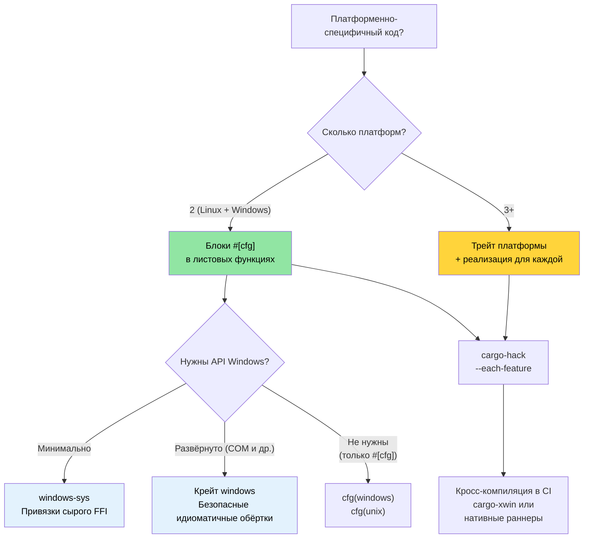

# Windows и условная компиляция 🟡

> **Чему вы научитесь:**
> - Паттерны поддержки Windows: крейты `windows-sys`/`windows`, `cargo-xwin`
> - Условная компиляция через `#[cfg]` — её проверяет компилятор, а не препроцессор
> - Архитектура платформенных абстракций: когда хватает блоков `#[cfg]`, а когда нужны трейты
> - Кросс-компиляция под Windows из Linux
>
> **Перекрёстные ссылки:** [`no_std` и фичи](ch09-no-std-and-feature-verification.md) — `cargo-hack` и проверка фич · [Кросс-компиляция](ch02-cross-compilation-one-source-many-target.md) — общая настройка кросс-сборки · [Build-скрипты](ch01-build-scripts-buildrs-in-depth.md) — `cfg`-флаги, которые выводит `build.rs`

### Поддержка Windows — платформенные абстракции

Атрибуты `#[cfg()]` в Rust и фичи Cargo позволяют одной кодовой базе аккуратно работать
и на Linux, и на Windows. В проекте этот паттерн уже есть в `platform::run_command`:

```rust
// Реальный паттерн из проекта — запуск оболочки в зависимости от платформы
pub fn exec_cmd(cmd: &str, timeout_secs: Option<u64>) -> Result<CommandResult, CommandError> {
    #[cfg(windows)]
    let mut child = Command::new("cmd")
        .args(["/C", cmd])
        .stdout(Stdio::piped())
        .stderr(Stdio::piped())
        .spawn()?;

    #[cfg(not(windows))]
    let mut child = Command::new("sh")
        .args(["-c", cmd])
        .stdout(Stdio::piped())
        .stderr(Stdio::piped())
        .spawn()?;

    // ... остальной код не зависит от платформы ...
}
```

**Доступные предикаты `cfg`:**

```rust
// Операционная система
#[cfg(target_os = "linux")]         // Именно Linux
#[cfg(target_os = "windows")]       // Windows
#[cfg(target_os = "macos")]         // macOS
#[cfg(unix)]                        // Linux, macOS, BSD и т. д.
#[cfg(windows)]                     // Windows (сокращённая запись)

// Архитектура
#[cfg(target_arch = "x86_64")]      // x86 64-бит
#[cfg(target_arch = "aarch64")]     // ARM 64-бит
#[cfg(target_arch = "x86")]         // x86 32-бит

// Ширина указателя (переносимая альтернатива архитектуре)
#[cfg(target_pointer_width = "64")] // Любая 64-битная платформа
#[cfg(target_pointer_width = "32")] // Любая 32-битная платформа

// Окружение / C-библиотека
#[cfg(target_env = "gnu")]          // glibc
#[cfg(target_env = "musl")]         // musl libc
#[cfg(target_env = "msvc")]         // MSVC в Windows

// Порядок байтов
#[cfg(target_endian = "little")]
#[cfg(target_endian = "big")]

// Комбинации через any(), all(), not()
#[cfg(all(target_os = "linux", target_arch = "x86_64"))]
#[cfg(any(target_os = "linux", target_os = "macos"))]
#[cfg(not(windows))]
```

### Крейты `windows-sys` и `windows`

Для прямых вызовов API Windows:

```toml
# Cargo.toml — windows-sys для сырого FFI (легче, без абстракций)
[target.'cfg(windows)'.dependencies]
windows-sys = { version = "0.59", features = [
    "Win32_Foundation",
    "Win32_System_Services",
    "Win32_System_Registry",
    "Win32_System_Power",
] }
# ПРИМЕЧАНИЕ: windows-sys выпускает несовместимые по semver релизы (0.48 → 0.52 → 0.59).
# Зафиксируйте одну минорную версию — в каждом релизе могут удаляться или переименовываться привязки API.
# Перед началом нового проекта проверьте актуальную версию на https://github.com/microsoft/windows-rs

# Или используйте крейт windows для безопасных обёрток (тяжелее, зато удобнее)
# windows = { version = "0.59", features = [...] }
```

```rust
// src/platform/windows.rs
#[cfg(windows)]
mod win {
    use windows_sys::Win32::System::Power::{
        GetSystemPowerStatus, SYSTEM_POWER_STATUS,
    };

    pub fn get_battery_status() -> Option<u8> {
        let mut status = SYSTEM_POWER_STATUS::default();
        // SAFETY: GetSystemPowerStatus записывает в переданный буфер.
        // Буфер корректного размера и выравнивания.
        let ok = unsafe { GetSystemPowerStatus(&mut status) };
        if ok != 0 {
            Some(status.BatteryLifePercent)
        } else {
            None
        }
    }
}
```

**`windows-sys` и крейт `windows`:**

| Аспект | `windows-sys` | `windows` |
|--------|---------------|-----------|
| Стиль API | Сырой FFI (вызовы через `unsafe`) | Безопасные обёртки на Rust |
| Размер бинарника | Минимальный (только объявления extern) | Больше (код обёрток) |
| Время компиляции | Быстрое | Медленнее |
| Эргономика | В стиле C, безопасность вручную | Идиоматично для Rust |
| Обработка ошибок | Сырые `BOOL` / `HRESULT` | `Result<T, windows::core::Error>` |
| Когда использовать | Критичная к производительности тонкая обёртка | Прикладной код, удобство |

### Кросс-компиляция под Windows из Linux

```bash
# Вариант 1: MinGW (GNU ABI)
rustup target add x86_64-pc-windows-gnu
sudo apt install gcc-mingw-w64-x86-64
cargo build --target x86_64-pc-windows-gnu
# Получаем .exe — запускается на Windows, линкуется с msvcrt

# Вариант 2: ABI MSVC через xwin (для полной совместимости с MSVC)
cargo install cargo-xwin
cargo xwin build --target x86_64-pc-windows-msvc
# Использует CRT и заголовки SDK от Microsoft, которые скачиваются автоматически

# Вариант 3: кросс-компиляция на основе Zig
cargo zigbuild --target x86_64-pc-windows-gnu
```

**GNU и MSVC ABI в Windows:**

| Аспект | `x86_64-pc-windows-gnu` | `x86_64-pc-windows-msvc` |
|--------|-------------------------|--------------------------|
| Линкер | MinGW `ld` | MSVC `link.exe` или `lld-link` |
| C-рантайм | `msvcrt.dll` (универсальный) | `ucrtbase.dll` (современный) |
| Совместимость с C++ | ABI GCC | ABI MSVC |
| Кросс-компиляция из Linux | Просто (MinGW) | Возможна (`cargo-xwin`) |
| Поддержка Windows API | Полная | Полная |
| Формат отладочной информации | DWARF | PDB |
| Рекомендуется для | Простых инструментов, сборок CI | Полной интеграции с Windows |

### Паттерны условной компиляции

**Паттерн 1: выбор платформенного модуля**

```rust
// src/platform/mod.rs — компилируем разные модули для разных ОС
#[cfg(target_os = "linux")]
mod linux;
#[cfg(target_os = "linux")]
pub use linux::*;

#[cfg(target_os = "windows")]
mod windows;
#[cfg(target_os = "windows")]
pub use windows::*;

// Оба модуля реализуют один и тот же публичный API:
// pub fn get_cpu_temperature() -> Result<f64, PlatformError>
// pub fn list_pci_devices() -> Result<Vec<PciDevice>, PlatformError>
```

**Паттерн 2: платформенная поддержка за фичами**

```toml
# Cargo.toml
[features]
default = ["linux"]
linux = []              # Доступ к железу, специфичный для Linux
windows = ["dep:windows-sys"]  # API, специфичные для Windows

[target.'cfg(windows)'.dependencies]
windows-sys = { version = "0.59", features = [...], optional = true }
```

```rust
// Ошибка компиляции, если кто-то пытается собрать под Windows без фичи:
#[cfg(all(target_os = "windows", not(feature = "windows")))]
compile_error!("Включите фичу 'windows', чтобы собрать проект для Windows");
```

**Паттерн 3: платформенная абстракция на трейтах**

```rust
/// Не зависящий от платформы интерфейс доступа к железу.
pub trait HardwareAccess {
    type Error: std::error::Error;

    fn read_cpu_temperature(&self) -> Result<f64, Self::Error>;
    fn read_gpu_temperature(&self, gpu_index: u32) -> Result<f64, Self::Error>;
    fn list_pci_devices(&self) -> Result<Vec<PciDevice>, Self::Error>;
    fn send_ipmi_command(&self, cmd: &IpmiCmd) -> Result<IpmiResponse, Self::Error>;
}

#[cfg(target_os = "linux")]
pub struct LinuxHardware;

#[cfg(target_os = "linux")]
impl HardwareAccess for LinuxHardware {
    type Error = LinuxHwError;

    fn read_cpu_temperature(&self) -> Result<f64, Self::Error> {
        // Читаем из /sys/class/thermal/thermal_zone0/temp
        let raw = std::fs::read_to_string("/sys/class/thermal/thermal_zone0/temp")?;
        Ok(raw.trim().parse::<f64>()? / 1000.0)
    }
    // ...
}

#[cfg(target_os = "windows")]
pub struct WindowsHardware;

#[cfg(target_os = "windows")]
impl HardwareAccess for WindowsHardware {
    type Error = WindowsHwError;

    fn read_cpu_temperature(&self) -> Result<f64, Self::Error> {
        // Читаем через WMI (Win32_TemperatureProbe) или Open Hardware Monitor
        todo!("запрос температуры через WMI")
    }
    // ...
}

/// Создаём реализацию, подходящую для текущей платформы
pub fn create_hardware() -> impl HardwareAccess {
    #[cfg(target_os = "linux")]
    { LinuxHardware }
    #[cfg(target_os = "windows")]
    { WindowsHardware }
}
```

### Архитектура платформенной абстракции

Для проекта, который работает на нескольких платформах, код стоит разложить по трём слоям:

```text
┌──────────────────────────────────────────────────┐
│ Прикладная логика (не зависит от платформы)      │
│  diag_tool, accel_diag, network_diag, event_log  │
│  Использует только трейт абстракции платформы    │
├──────────────────────────────────────────────────┤
│ Слой абстракции платформы (определения трейтов)  │
│  trait HardwareAccess { ... }                    │
│  trait CommandRunner { ... }                     │
│  trait FileSystem { ... }                        │
├──────────────────────────────────────────────────┤
│ Платформенные реализации (через cfg)             │
│  ┌──────────────┐  ┌──────────────┐              │
│  │ Реализация   │  │ Реализация   │              │
│  │ для Linux    │  │ для Windows  │              │
│  │ /sys, /proc  │  │ WMI, Registry│              │
│  │ ipmitool     │  │ ipmiutil     │              │
│  │ lspci        │  │ devcon       │              │
│  └──────────────┘  └──────────────┘              │
└──────────────────────────────────────────────────┘
```

**Тестирование абстракции**: мокайте платформенный трейт в модульных тестах:

```rust
#[cfg(test)]
mod tests {
    use super::*;

    struct MockHardware {
        cpu_temp: f64,
        gpu_temps: Vec<f64>,
    }

    impl HardwareAccess for MockHardware {
        type Error = std::io::Error;

        fn read_cpu_temperature(&self) -> Result<f64, Self::Error> {
            Ok(self.cpu_temp)
        }

        fn read_gpu_temperature(&self, index: u32) -> Result<f64, Self::Error> {
            self.gpu_temps.get(index as usize)
                .copied()
                .ok_or_else(|| std::io::Error::new(
                    std::io::ErrorKind::NotFound,
                    format!("GPU {index} не найден")
                ))
        }

        fn list_pci_devices(&self) -> Result<Vec<PciDevice>, Self::Error> {
            Ok(vec![]) // Мок возвращает пустой результат
        }

        fn send_ipmi_command(&self, _cmd: &IpmiCmd) -> Result<IpmiResponse, Self::Error> {
            Ok(IpmiResponse::default())
        }
    }

    #[test]
    fn test_thermal_check_with_mock() {
        let hw = MockHardware {
            cpu_temp: 75.0,
            gpu_temps: vec![82.0, 84.0],
        };
        let result = run_thermal_diagnostic(&hw);
        assert!(result.is_ok());
    }
}
```

### Приложение: сначала Linux, готовность к Windows

Проект уже частично готов к Windows. Используйте
[`cargo-hack`](ch09-no-std-and-feature-verification.md), чтобы проверить все комбинации фич,
и [кросс-компиляцию](ch02-cross-compilation-one-source-many-target.md), чтобы тестировать
под Windows из Linux:

**Уже сделано:**
- `platform::run_command` использует `#[cfg(windows)]` для выбора оболочки
- Тесты используют `#[cfg(windows)]` / `#[cfg(not(windows))]`, чтобы подбирать команды,
  подходящие для платформы

**Рекомендуемый путь развития поддержки Windows:**

```text
Фаза 1: выделяем трейт платформенной абстракции (текущий этап → 2 недели)
  ├─ определяем трейт HardwareAccess в core_lib
  ├─ оборачиваем текущий код для Linux в реализацию LinuxHardware
  └─ все диагностические модули зависят от трейта, а не от особенностей Linux

Фаза 2: добавляем заглушки для Windows (2 недели)
  ├─ реализуем WindowsHardware с заглушками TODO
  ├─ CI собирает проект для x86_64-pc-windows-msvc (только проверка компиляции)
  └─ тесты проходят с MockHardware на всех платформах

Фаза 3: реализация для Windows (постоянная работа)
  ├─ IPMI через ipmiutil.exe или драйвер OpenIPMI для Windows
  ├─ GPU через accel-mgmt (accel-api.dll) — тот же API, что и в Linux
  ├─ PCIe через Windows Setup API (SetupDiEnumDeviceInfo)
  └─ NIC через WMI (Win32_NetworkAdapter)
```

**Дополнение к кросс-платформенному CI:**

```yaml
# Добавьте в матрицу CI
- target: x86_64-pc-windows-msvc
  os: windows-latest
  name: windows-x86_64
```

Это гарантирует, что кодовая база компилируется под Windows ещё до завершения полной
реализации, а ошибки в `cfg` выявляются рано.

> **Ключевая мысль**: абстракция не обязана быть идеальной с первого дня. Начинайте с блоков
> `#[cfg]` в листовых функциях (как уже делает `exec_cmd`), а переходите к трейтам, когда
> появятся две и более платформенные реализации. Преждевременная абстракция хуже, чем блоки `#[cfg]`.

### Дерево решений по условной компиляции



### 🏋️ Упражнения

#### 🟢 Упражнение 1: платформенно-условный модуль

Создайте модуль с реализациями `get_hostname()` под `#[cfg(unix)]` и `#[cfg(windows)]`.
Проверьте, что обе компилируются через `cargo check` и `cargo check --target x86_64-pc-windows-msvc`.

<details>
<summary>Решение</summary>

```rust
// src/hostname.rs
#[cfg(unix)]
pub fn get_hostname() -> String {
    use std::fs;
    fs::read_to_string("/etc/hostname")
        .unwrap_or_else(|_| "unknown".to_string())
        .trim()
        .to_string()
}

#[cfg(windows)]
pub fn get_hostname() -> String {
    use std::env;
    env::var("COMPUTERNAME").unwrap_or_else(|_| "unknown".to_string())
}

#[cfg(test)]
mod tests {
    use super::*;

    #[test]
    fn hostname_is_not_empty() {
        let name = get_hostname();
        assert!(!name.is_empty());
    }
}
```

```bash
# Проверка компиляции под Linux
cargo check

# Проверка компиляции под Windows (кросс-проверка)
rustup target add x86_64-pc-windows-msvc
cargo check --target x86_64-pc-windows-msvc
```
</details>

#### 🟡 Упражнение 2: кросс-компиляция под Windows с cargo-xwin

Установите `cargo-xwin` и соберите простой бинарник для `x86_64-pc-windows-msvc` из Linux.
Убедитесь, что результат — `.exe`.

<details>
<summary>Решение</summary>

```bash
cargo install cargo-xwin
rustup target add x86_64-pc-windows-msvc

cargo xwin build --release --target x86_64-pc-windows-msvc
# Заголовки и библиотеки Windows SDK скачиваются автоматически

file target/x86_64-pc-windows-msvc/release/my-binary.exe
# Вывод: PE32+ executable (console) x86-64, for MS Windows

# Можно также проверить через Wine:
wine target/x86_64-pc-windows-msvc/release/my-binary.exe
```
</details>

### Ключевые выводы

- Начинайте с блоков `#[cfg]` в листовых функциях; переходите к трейтам, когда три и более платформ начинают расходиться
- `windows-sys` — для сырого FFI; крейт `windows` предоставляет безопасные идиоматичные обёртки
- `cargo-xwin` кросс-компилирует под ABI MSVC Windows из Linux — машина с Windows не нужна
- Всегда проверяйте `--target x86_64-pc-windows-msvc` в CI, даже если выпускаете только под Linux
- Комбинируйте `#[cfg]` с фичами Cargo для необязательной поддержки платформ (например, `feature = "windows"`)

---
