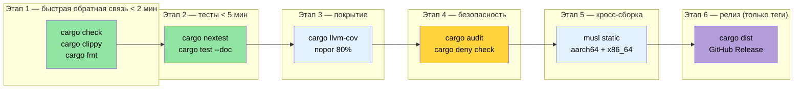

# Собираем всё вместе — продакшн-конвейер CI/CD 🟡

> **Чему вы научитесь:**
> - Структура многоэтапного workflow CI в GitHub Actions (check → test → coverage → security → cross → release)
> - Стратегии кеширования с `rust-cache` и тонкая настройка `save-if`
> - Запуск Miri и санитайзеров по ночному расписанию
> - Автоматизация задач с помощью `Makefile.toml` и pre-commit-хуков
> - Автоматические релизы с `cargo-dist`
>
> **Перекрёстные ссылки:** [Build-скрипты](ch01-build-scripts-buildrs-in-depth.md) · [Кросс-компиляция](ch02-cross-compilation-one-source-many-target.md) · [Бенчмаркинг](ch03-benchmarking-measuring-what-matters.md) · [Покрытие](ch04-code-coverage-seeing-what-tests-miss.md) · [Miri и санитайзеры](ch05-miri-valgrind-and-sanitizers-verifying-u.md) · [Зависимости](ch06-dependency-management-and-supply-chain-s.md) · [Профили релиза](ch07-release-profiles-and-binary-size.md) · [Инструменты времени компиляции](ch08-compile-time-and-developer-tools.md) · [`no_std`](ch09-no-std-and-feature-verification.md) · [Windows](ch10-windows-and-conditional-compilation.md)

Отдельные инструменты полезны. Конвейер, который автоматически запускает их на каждый push,
меняет всё. Эта глава собирает инструменты из глав 1–10 в единый CI/CD-workflow.

### Полный workflow GitHub Actions

Один файл workflow, который запускает все этапы проверки параллельно:

```yaml
# .github/workflows/ci.yml
name: CI

on:
  push:
    branches: [main]
  pull_request:
    branches: [main]

env:
  CARGO_TERM_COLOR: always
  CARGO_ENCODED_RUSTFLAGS: "-Dwarnings"  # Считать предупреждения ошибками (только для верхнеуровневого крейта)
  # ПРИМЕЧАНИЕ: в отличие от RUSTFLAGS, CARGO_ENCODED_RUSTFLAGS не влияет на build-скрипты
  # и процедурные макросы, что избавляет от ложных падений из-за предупреждений сторонних крейтов.
  # Если хотите применять правило и к build-скриптам, используйте RUSTFLAGS="-Dwarnings".

jobs:
  # ─── Этап 1: быстрая обратная связь (< 2 мин) ───
  check:
    name: Проверка + Clippy + форматирование
    runs-on: ubuntu-latest
    steps:
      - uses: actions/checkout@v4
      - uses: dtolnay/rust-toolchain@stable
        with:
          components: clippy, rustfmt

      - uses: Swatinem/rust-cache@v2  # Кешируем зависимости

      - name: Проверка Cargo.lock
        run: cargo fetch --locked

      - name: Проверка документации
        run: RUSTDOCFLAGS='-Dwarnings' cargo doc --workspace --all-features --no-deps

      - name: Проверка компиляции
        run: cargo check --workspace --all-targets --all-features

      - name: Линты Clippy
        run: cargo clippy --workspace --all-targets --all-features -- -D warnings

      - name: Форматирование
        run: cargo fmt --all -- --check

  # ─── Этап 2: тесты (< 5 мин) ───
  test:
    name: Тесты (${{ matrix.os }})
    needs: check
    strategy:
      matrix:
        os: [ubuntu-latest, windows-latest]
    runs-on: ${{ matrix.os }}
    steps:
      - uses: actions/checkout@v4
      - uses: dtolnay/rust-toolchain@stable
      - uses: Swatinem/rust-cache@v2

      - name: Запуск тестов
        run: cargo test --workspace

      - name: Запуск doc-тестов
        run: cargo test --workspace --doc

  # ─── Этап 3: кросс-компиляция (< 10 мин) ───
  cross:
    name: Кросс-сборка (${{ matrix.target }})
    needs: check
    strategy:
      matrix:
        include:
          - target: x86_64-unknown-linux-musl
            os: ubuntu-latest
          - target: aarch64-unknown-linux-gnu
            os: ubuntu-latest
            use_cross: true
    runs-on: ${{ matrix.os }}
    steps:
      - uses: actions/checkout@v4
      - uses: dtolnay/rust-toolchain@stable
        with:
          targets: ${{ matrix.target }}

      - name: Установка musl-tools
        if: contains(matrix.target, 'musl')
        run: sudo apt-get install -y musl-tools

      - name: Установка cross
        if: matrix.use_cross
        uses: taiki-e/install-action@cross

      - name: Сборка (нативная)
        if: "!matrix.use_cross"
        run: cargo build --release --target ${{ matrix.target }}

      - name: Сборка (cross)
        if: matrix.use_cross
        run: cross build --release --target ${{ matrix.target }}

      - name: Загрузка артефакта
        uses: actions/upload-artifact@v4
        with:
          name: binary-${{ matrix.target }}
          path: target/${{ matrix.target }}/release/diag_tool

  # ─── Этап 4: покрытие (< 10 мин) ───
  coverage:
    name: Покрытие кода
    needs: check
    runs-on: ubuntu-latest
    steps:
      - uses: actions/checkout@v4
      - uses: dtolnay/rust-toolchain@stable
        with:
          components: llvm-tools-preview
      - uses: taiki-e/install-action@cargo-llvm-cov

      - name: Генерация покрытия
        run: cargo llvm-cov --workspace --lcov --output-path lcov.info

      - name: Проверка минимального покрытия
        run: cargo llvm-cov --workspace --fail-under-lines 75

      - name: Загрузка в Codecov
        uses: codecov/codecov-action@v4
        with:
          files: lcov.info
          token: ${{ secrets.CODECOV_TOKEN }}

  # ─── Этап 5: проверка безопасности (< 15 мин) ───
  miri:
    name: Miri
    needs: check
    runs-on: ubuntu-latest
    steps:
      - uses: actions/checkout@v4
      - uses: dtolnay/rust-toolchain@nightly
        with:
          components: miri

      - name: Запуск Miri
        run: cargo miri test --workspace
        env:
          MIRIFLAGS: "-Zmiri-backtrace=full"

  # ─── Этап 6: бенчмарки (только для PR, < 10 мин) ───
  bench:
    name: Бенчмарки
    if: github.event_name == 'pull_request'
    needs: check
    runs-on: ubuntu-latest
    steps:
      - uses: actions/checkout@v4
      - uses: dtolnay/rust-toolchain@stable

      - name: Запуск бенчмарков
        run: cargo bench -- --output-format bencher | tee bench.txt

      - name: Сравнение с базовой линией
        uses: benchmark-action/github-action-benchmark@v1
        with:
          tool: 'cargo'
          output-file-path: bench.txt
          github-token: ${{ secrets.GITHUB_TOKEN }}
          alert-threshold: '115%'
          comment-on-alert: true
```

**Схема выполнения конвейера:**

```text
                    ┌─────────┐
                    │  check  │  ← clippy + fmt + cargo check (2 мин)
                    └────┬────┘
           ┌─────────┬──┴──┬──────────┬──────────┐
           ▼         ▼     ▼          ▼          ▼
       ┌──────┐  ┌──────┐ ┌────────┐ ┌──────┐ ┌──────┐
       │ test │  │cross │ │coverage│ │ miri │ │bench │
       │ (2×) │  │ (2×) │ │        │ │      │ │(PR)  │
       └──────┘  └──────┘ └────────┘ └──────┘ └──────┘
         3 мин    8 мин     8 мин     12 мин    5 мин

Общее время: ~14 мин (параллельно после шлюза check)
```

### Стратегии кеширования в CI

[`Swatinem/rust-cache@v2`](https://github.com/Swatinem/rust-cache) — стандартное для Rust
действие кеширования в CI. Оно кеширует `~/.cargo` и `target/` между запусками, но большим
воркспейсам нужна тонкая настройка:

```yaml
# Базовый вариант (то, что используем выше)
- uses: Swatinem/rust-cache@v2

# Настроенный для большого воркспейса:
- uses: Swatinem/rust-cache@v2
  with:
    # Отдельные кеши для каждой джобы — не даём артефактам тестов раздувать кеш сборки
    prefix-key: "v1-rust"
    key: ${{ matrix.os }}-${{ matrix.target || 'default' }}
    # Сохраняем кеш только в ветке main (PR читают, но не записывают)
    save-if: ${{ github.ref == 'refs/heads/main' }}
    # Кешируем реестр Cargo, git-чекауты и директорию target
    cache-targets: true
    cache-all-crates: true
```

**Подводные камни инвалидации кеша:**

| Проблема | Решение |
|----------|---------|
| Кеш растёт без границ (>5 ГБ) | Задайте `prefix-key: "v2-rust"`, чтобы принудительно создать новый кеш |
| Разные фичи засоряют кеш | Используйте `key: ${{ hashFiles('**/Cargo.lock') }}` |
| Кеш из PR перезаписывает main | Задайте `save-if: ${{ github.ref == 'refs/heads/main' }}` |
| Цели кросс-компиляции раздувают кеш | Используйте отдельный `key` для каждой тройки целей (target triple) |

**Совместное использование кеша между джобами:**

Джоба `check` сохраняет кеш, а последующие джобы (`test`, `cross`, `coverage`) его читают.
Благодаря `save-if` только для `main` запуски PR получают выгоду от кешированных зависимостей
и не записывают устаревшие кеши.

> **Измеренный эффект на крупном воркспейсе**: холодная сборка ~4 мин → сборка из кеша ~45 с.
> Одно только действие кеширования экономит около 25 минут CI-времени за запуск конвейера
> (по всем параллельным джобам).

### Makefile.toml с cargo-make

[`cargo-make`](https://sagiegurari.github.io/cargo-make/) — переносимый исполнитель задач,
который работает на разных платформах (в отличие от `make`/`Makefile`):

```bash
# Установка
cargo install cargo-make
```

```toml
# Makefile.toml — в корне воркспейса

[config]
default_to_workspace = false

# ─── Рабочие сценарии разработчика ───

[tasks.dev]
description = "Полная локальная проверка (те же проверки, что и в CI)"
dependencies = ["check", "test", "clippy", "fmt-check"]

[tasks.check]
command = "cargo"
args = ["check", "--workspace", "--all-targets"]

[tasks.test]
command = "cargo"
args = ["test", "--workspace"]

[tasks.clippy]
command = "cargo"
args = ["clippy", "--workspace", "--all-targets", "--", "-D", "warnings"]

[tasks.fmt]
command = "cargo"
args = ["fmt", "--all"]

[tasks.fmt-check]
command = "cargo"
args = ["fmt", "--all", "--", "--check"]

# ─── Покрытие ───

[tasks.coverage]
description = "Генерация HTML-отчёта о покрытии"
install_crate = "cargo-llvm-cov"
command = "cargo"
args = ["llvm-cov", "--workspace", "--html", "--open"]

[tasks.coverage-ci]
description = "Генерация LCOV для загрузки в CI"
install_crate = "cargo-llvm-cov"
command = "cargo"
args = ["llvm-cov", "--workspace", "--lcov", "--output-path", "lcov.info"]

# ─── Бенчмарки ───

[tasks.bench]
description = "Запуск всех бенчмарков"
command = "cargo"
args = ["bench"]

# ─── Кросс-компиляция ───

[tasks.build-musl]
description = "Сборка статического бинарника (musl)"
command = "cargo"
args = ["build", "--release", "--target", "x86_64-unknown-linux-musl"]

[tasks.build-arm]
description = "Сборка для aarch64 (требует cross)"
command = "cross"
args = ["build", "--release", "--target", "aarch64-unknown-linux-gnu"]

[tasks.build-all]
description = "Сборка для всех целей развёртывания"
dependencies = ["build-musl", "build-arm"]

# ─── Проверка безопасности ───

[tasks.miri]
description = "Запуск Miri на всех тестах"
toolchain = "nightly"
command = "cargo"
args = ["miri", "test", "--workspace"]

[tasks.audit]
description = "Проверка на известные уязвимости"
install_crate = "cargo-audit"
command = "cargo"
args = ["audit"]

# ─── Релиз ───

[tasks.release-dry]
description = "Показать, что сделал бы cargo-release (без выполнения)"
install_crate = "cargo-release"
command = "cargo"
args = ["release", "--workspace", "--dry-run"]
```

**Использование:**

```bash
# Аналог конвейера CI, но локально
cargo make dev

# Генерация и просмотр покрытия
cargo make coverage

# Сборка под все цели
cargo make build-all

# Проверки безопасности
cargo make miri

# Проверка на уязвимости
cargo make audit
```

### Pre-commit-хуки: собственные скрипты и `cargo-husky`

Ловите проблемы *до* того, как они попадут в CI. Рекомендуемый подход — собственный git-хук:
он простой, прозрачный и не имеет внешних зависимостей:

```bash
#!/bin/sh
# .githooks/pre-commit

set -e

echo "=== Проверки перед коммитом ==="

# Сначала быстрые проверки
echo "→ cargo fmt --check"
cargo fmt --all -- --check

echo "→ cargo check"
cargo check --workspace --all-targets

echo "→ cargo clippy"
cargo clippy --workspace --all-targets -- -D warnings

echo "→ cargo test (только lib, быстро)"
cargo test --workspace --lib

echo "=== Все проверки пройдены ==="
```

```bash
# Установка хука
git config core.hooksPath .githooks
chmod +x .githooks/pre-commit
```

**Альтернатива: `cargo-husky`** (автоматически устанавливает хуки через build-скрипт):

> ⚠️ **Примечание**: `cargo-husky` не обновлялся с 2022 года. Он всё ещё работает, но
> фактически не поддерживается. Для новых проектов рассмотрите описанный выше собственный хук.

```bash
cargo install cargo-husky
```

```toml
# Cargo.toml — добавьте в dev-dependencies корневого крейта
[dev-dependencies]
cargo-husky = { version = "1", default-features = false, features = [
    "precommit-hook",
    "run-cargo-check",
    "run-cargo-clippy",
    "run-cargo-fmt",
    "run-cargo-test",
] }
```

### Workflow релиза: `cargo-release` и `cargo-dist`

**`cargo-release`** — автоматизирует повышение версии, создание тегов и публикацию:

```bash
# Установка
cargo install cargo-release
```

```toml
# release.toml — в корне воркспейса
[workspace]
consolidate-commits = true
pre-release-commit-message = "chore: release {{version}}"
tag-message = "v{{version}}"
tag-name = "v{{version}}"

# Не публикуем внутренние крейты
[[package]]
name = "core_lib"
release = false

[[package]]
name = "diag_framework"
release = false

# Публикуем только основной бинарник
[[package]]
name = "diag_tool"
release = true
```

```bash
# Предварительный просмотр релиза
cargo release patch --dry-run

# Выполнение релиза (повышает версию, коммитит, ставит тег, при необходимости публикует)
cargo release patch --execute
# 0.1.0 → 0.1.1

cargo release minor --execute
# 0.1.1 → 0.2.0
```

**`cargo-dist`** — генерирует готовые к скачиванию бинарники для GitHub Releases:

```bash
# Установка
cargo install cargo-dist

# Инициализация (создаёт CI-workflow и метаданные)
cargo dist init

# Предварительный просмотр того, что будет собрано
cargo dist plan

# Генерация релиза (обычно выполняется CI при пуше тега)
cargo dist build
```

```toml
# Дополнения в Cargo.toml, которые добавляет `cargo dist init`
[workspace.metadata.dist]
cargo-dist-version = "0.28.0"
ci = "github"
targets = [
    "x86_64-unknown-linux-gnu",
    "x86_64-unknown-linux-musl",
    "aarch64-unknown-linux-gnu",
    "x86_64-pc-windows-msvc",
]
install-path = "CARGO_HOME"
```

Это генерирует workflow GitHub Actions, который при пуше тега:
1. Собирает бинарник для всех целевых платформ
2. Создаёт GitHub Release с архивами `.tar.gz` / `.zip` для скачивания
3. Генерирует установочные скрипты для shell и PowerShell
4. Публикует на crates.io (если это настроено)

### Try It Yourself — итоговое упражнение

Это упражнение связывает все главы. Вы создадите полный инженерный конвейер для нового
воркспейса Rust:

1. **Создайте новый воркспейс** из двух крейтов: библиотеки (`core_lib`) и бинарника (`cli`).
   Добавьте `build.rs`, который встраивает хеш git и временную метку сборки, используя
   `SOURCE_DATE_EPOCH` (гл. 1).

2. **Настройте кросс-компиляцию** для `x86_64-unknown-linux-musl` и `aarch64-unknown-linux-gnu`.
   Убедитесь, что обе цели собираются через `cargo zigbuild` или `cross` (гл. 2).

3. **Добавьте бенчмарк** с помощью Criterion или Divan для одной функции в `core_lib`.
   Запустите его локально и зафиксируйте базовую линию (гл. 3).

4. **Измерьте покрытие кода** с помощью `cargo llvm-cov`. Задайте минимальный порог 80%
   и убедитесь, что он проходит (гл. 4).

5. **Запустите `cargo +nightly careful test`** и `cargo miri test`. Добавьте тест, который
   проверяет `unsafe`-код, если он у вас есть (гл. 5).

6. **Настройте `cargo-deny`** с `deny.toml`, который запрещает `openssl` и требует лицензии
   MIT/Apache-2.0 (гл. 6).

7. **Оптимизируйте профиль релиза** с `lto = "thin"`, `strip = true` и `codegen-units = 1`.
   Замерьте размер бинарника до и после с помощью `cargo bloat` (гл. 7).

8. **Добавьте проверку `cargo hack --each-feature`**. Создайте флаг фичи для необязательной
   зависимости и убедитесь, что он компилируется отдельно (гл. 9).

9. **Напишите workflow GitHub Actions** (эта глава) со всеми 6 этапами. Добавьте
   `Swatinem/rust-cache@v2` с настройкой `save-if`.

**Критерий успеха**: отправьте код на GitHub → все этапы CI зелёные → `cargo dist plan`
показывает ваши целевые платформы релиза. Теперь у вас есть продакшн-уровня конвейер на Rust.

### Архитектура CI-конвейера



### Ключевые выводы

- Стройте CI как параллельные этапы: быстрые проверки — первыми, дорогие джобы — за шлюзами
- `Swatinem/rust-cache@v2` с `save-if: ${{ github.ref == 'refs/heads/main' }}` предотвращает перезапись кеша из PR
- Запускайте Miri и более тяжёлые санитайзеры по расписанию `schedule:` в nightly, а не на каждый push
- `Makefile.toml` (`cargo make`) объединяет многоинструментальные сценарии в одну команду для локальной разработки
- `cargo-dist` автоматизирует сборку релизов для разных платформ — больше не нужно писать матрицу платформ в YAML вручную

---
