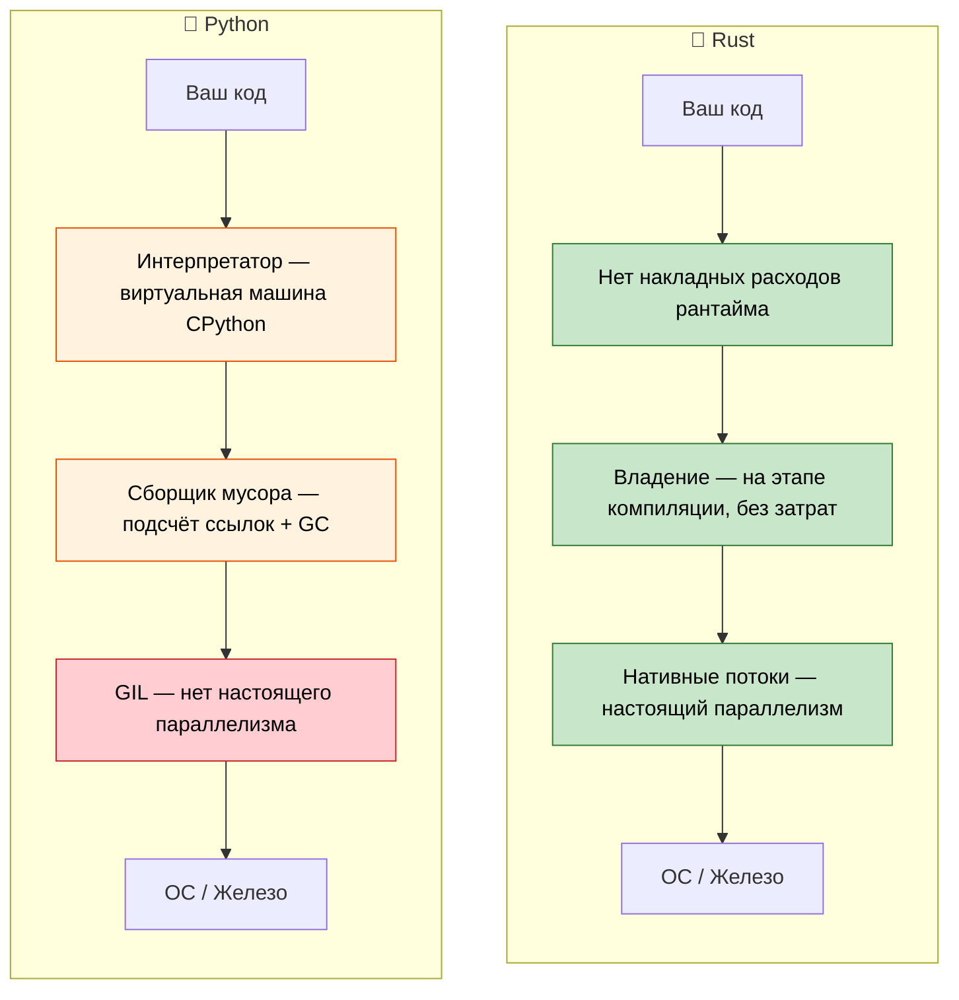

## О курсе и общий подход

- О курсе
    - Курс основан на оригинальных материалах Rust Training (лицензии MIT и CC-BY-4.0)
    - Русский перевод и адаптация выполнены участниками проекта RustTraining-Rus
- Курс задуман максимально интерактивным
    - Предполагается, что вы знаете Python и его экосистему
    - Примеры намеренно сопоставляют понятия Python с их аналогами в Rust
    - **Не стесняйтесь задавать уточняющие вопросы в любой момент**

---

## Аргументы в пользу Rust для разработчиков на Python

> **Что вы узнаете:** почему разработчики на Python переходят на Rust, какие реальные выигрыши в производительности получили компании (Dropbox, Discord, Pydantic), когда Rust — правильный выбор по сравнению с Python и в чём принципиальные философские различия между двумя языками.
>
> **Сложность:** 🟢 Начальный

### Производительность: от минут до миллисекунд

Python известен медленной работой с задачами, ограниченными процессором. Rust даёт производительность уровня C при высокоуровневом стиле написания кода.

```python
# Python — ~2 секунды на 10 миллионов вызовов
import time

def fibonacci(n: int) -> int:
    if n <= 1:
        return n
    a, b = 0, 1
    for _ in range(2, n + 1):
        a, b = b, a + b
    return b

start = time.perf_counter()
results = [fibonacci(n % 30) for n in range(10_000_000)]
elapsed = time.perf_counter() - start
print(f"Прошло: {elapsed:.2f}s")  # ~2 с на типичном железе
```

```rust
// Rust — ~0.07 секунды на те же 10 миллионов вызовов
use std::time::Instant;

fn fibonacci(n: u64) -> u64 {
    if n <= 1 {
        return n;
    }
    let (mut a, mut b) = (0u64, 1u64);
    for _ in 2..=n {
        let temp = b;
        b = a + b;
        a = temp;
    }
    b
}

fn main() {
    let start = Instant::now();
    let results: Vec<u64> = (0..10_000_000).map(|n| fibonacci(n % 30)).collect();
    println!("Прошло: {:.2?}", start.elapsed());  // ~0.07 с
}
```
> Примечание: для честного сравнения производительности Rust нужно запускать в release-режиме (`cargo run --release`).
> **В чём разница?** Python при каждом `+` обращается к поиску в словаре, извлекает целые числа из объектов в куче и проверяет типы на каждой операции. Rust компилирует `fibonacci` напрямую в несколько инструкций x86 `add`/`mov` — ровно тот код, который выдал бы компилятор C.

### Безопасность памяти без сборщика мусора

У сборщика мусора Python на основе подсчёта ссылок есть известные проблемы: циклические ссылки, непредсказуемое время вызова `__del__` и фрагментация памяти. Rust устраняет их на этапе компиляции.

```python
# Python — циклическая ссылка, которую счётчик ссылок CPython не может освободить
class Node:
    def __init__(self, value):
        self.value = value
        self.parent = None
        self.children = []

    def add_child(self, child):
        self.children.append(child)
        child.parent = self  # Циклическая ссылка!

# Эти два узла ссылаются друг на друга — счётчик ссылок никогда не станет 0.
# Детектор циклов CPython *в конце концов* их очистит,
# но вы не контролируете, когда это произойдёт, и это добавляет накладные расходы на паузы GC.
root = Node("root")
child = Node("child")
root.add_child(child)
```

```rust
// Rust — владение по замыслу исключает циклические ссылки
struct Node {
    value: String,
    children: Vec<Node>,  // Дети ПРИНАДЛЕЖАТ родителю — циклы невозможны
}

impl Node {
    fn new(value: &str) -> Self {
        Node {
            value: value.to_string(),
            children: Vec::new(),
        }
    }

    fn add_child(&mut self, child: Node) {
        self.children.push(child);  // Владение переходит здесь
    }
}

fn main() {
    let mut root = Node::new("root");
    let child = Node::new("child");
    root.add_child(child);
    // Когда root уничтожается, уничтожаются и все дети.
    // Детерминированно, без накладных расходов, без GC.
}
```

> **Ключевая мысль**: в Rust потомок не хранит ссылку обратно на родителя. Если действительно нужны перекрёстные ссылки (например, для графа), используются явные механизмы вроде `Rc<RefCell<T>>` или индексов, что делает сложность видимой и осознанной.

***

## Частые проблемы Python, которые решает Rust

### 1. Ошибки типов во время выполнения

Самая распространённая продакшен-ошибка в Python: передача функции значения неправильного типа. Подсказки типов помогают, но они не проверяются.

```python
# Python — подсказки типов являются рекомендациями, а не правилами
def process_user(user_id: int, name: str) -> dict:
    return {"id": user_id, "name": name.upper()}

# Все эти вызовы «проходят» на месте вызова и падают во время выполнения
process_user("not-a-number", 42)        # TypeError: int has no .upper()
process_user(None, "Alice")             # Молча сохраняет None как id — ошибка спрячется, пока последующий код не ожидает int

# Даже с mypy типы можно обойти:
data = json.loads('{"id": "oops"}')     # Всегда возвращает Any
process_user(data["id"], data["name"])  # mypy это не поймает
```

```rust
// Rust — компилятор ловит всё это до запуска программы
fn process_user(user_id: i64, name: &str) -> User {
    User {
        id: user_id,
        name: name.to_uppercase(),
    }
}

// process_user("not-a-number", 42);     // ❌ Ошибка компиляции: ожидался i64, найден &str
// process_user(None, "Alice");           // ❌ Ошибка компиляции: ожидался i64, найден Option
// Лишние аргументы — всегда ошибка компиляции.

// Десериализация JSON тоже типобезопасна:
#[derive(Deserialize)]
struct UserInput {
    id: i64,     // Должно быть числом в JSON
    name: String, // Должно быть строкой в JSON
}
let input: UserInput = serde_json::from_str(json_str)?; // Возвращает Err, если типы не совпадают
process_user(input.id, &input.name); // ✅ Типы гарантированно корректны
```

### 2. None: миллиардная ошибка (издание для Python)

`None` может появиться там, где ожидается значение. В Python нет способа на этапе компиляции предотвратить `AttributeError: 'NoneType' object has no attribute ...`.

```python
# Python — None проникает повсюду
def find_user(user_id: int) -> dict | None:
    users = {1: {"name": "Alice"}, 2: {"name": "Bob"}}
    return users.get(user_id)

user = find_user(999)         # Возвращает None
print(user["name"])           # 💥 TypeError: 'NoneType' object is not subscriptable

# Даже с подсказкой типа Optional ничто не требует проверки:
from typing import Optional
def get_name(user_id: int) -> Optional[str]:
    return None

name: Optional[str] = get_name(1)
print(name.upper())          # 💥 AttributeError — mypy предупреждает, а во время выполнения это никого не волнует
```

```rust
// Rust — None невозможен, пока вы его явно не обработаете
fn find_user(user_id: i64) -> Option<User> {
    let users = HashMap::from([
        (1, User { name: "Alice".into() }),
        (2, User { name: "Bob".into() }),
    ]);
    users.get(&user_id).cloned()
}

let user = find_user(999);  // Возвращает вариант None типа Option<User>
// println!("{}", user.name);  // ❌ Ошибка компиляции: у Option<User> нет поля `name`

// Вариант None ОБЯЗАТЕЛЬНО нужно обработать:
match find_user(999) {
    Some(user) => println!("{}", user.name),
    None => println!("Пользователь не найден"),
}

// Или используйте комбинаторы:
let name = find_user(999)
    .map(|u| u.name)
    .unwrap_or_else(|| "Unknown".to_string());
```

### 3. GIL: потолок конкурентности Python

Глобальная блокировка интерпретатора (GIL) в Python означает, что потоки не выполняют код Python параллельно. `threading` полезен только для задач, ограниченных вводом-выводом; задачи, ограниченные процессором, требуют `multiprocessing` (с накладными расходами на сериализацию) или C-расширений.

```python
# Python — потоки НЕ ускоряют работу с процессором из-за GIL
import threading
import time

def cpu_work(n):
    total = 0
    for i in range(n):
        total += i * i
    return total

start = time.perf_counter()
threads = [threading.Thread(target=cpu_work, args=(10_000_000,)) for _ in range(4)]
for t in threads:
    t.start()
for t in threads:
    t.join()
elapsed = time.perf_counter() - start
print(f"4 потока: {elapsed:.2f}s")  # Примерно ТАКОЕ ЖЕ время, как у 1 потока! GIL не даёт параллелизму работать.

# multiprocessing «работает», но сериализует данные между процессами:
from multiprocessing import Pool
with Pool(4) as p:
    results = p.map(cpu_work, [10_000_000] * 4)  # ~в 4 раза быстрее, но с накладными расходами на pickle
```

```rust
// Rust — настоящий параллелизм, без GIL и без накладных расходов на сериализацию
use std::thread;

fn cpu_work(n: u64) -> u64 {
    (0..n).map(|i| i * i).sum()
}

fn main() {
    let start = std::time::Instant::now();
    let handles: Vec<_> = (0..4)
        .map(|_| thread::spawn(|| cpu_work(3_000_000)))
        .collect();

    let results: Vec<u64> = handles.into_iter()
        .map(|h| h.join().unwrap())
        .collect();

    println!("4 потока: {:.2?}", start.elapsed());  // ~в 4 раза быстрее одного потока
}
```

> **С Rayon** (библиотекой параллельных итераторов для Rust) параллелизм становится ещё проще:
> ```rust
> use rayon::prelude::*;
> let results: Vec<u64> = inputs.par_iter().map(|&n| cpu_work(n)).collect();
> ```

### 4. Боль развёртывания и распространения

Развёртывание Python известно своей сложностью: venv, конфликты с системным Python, сбои `pip install`, колёса (wheels) C-расширений, Docker-образы с полным рантаймом Python.

```python
# Чек-лист развёртывания Python:
# 1. Какая версия Python? 3.9? 3.10? 3.11? 3.12?
# 2. Виртуальное окружение: venv, conda, poetry, pipenv?
# 3. C-расширения: нужен компилятор? manylinux-колёса?
# 4. Системные зависимости: libssl, libffi и т. д.?
# 5. Docker: полный образ python:3.12 весит 1,0 ГБ
# 6. Время запуска: 200–500 мс для приложений с большим количеством импортов

# Docker-образ: ~1 ГБ
# FROM python:3.12-slim
# COPY requirements.txt .
# RUN pip install -r requirements.txt
# COPY . .
# CMD ["python", "app.py"]
```

```rust
// Развёртывание Rust: один статический бинарник, рантайм не нужен
// cargo build --release → один бинарник, ~5–20 МБ
// Копируйте куда угодно — ни Python, ни venv, ни зависимостей

// Docker-образ: ~5 МБ (from scratch или distroless)
// FROM scratch
// COPY target/release/my_app /my_app
// CMD ["/my_app"]

// Время запуска: <1 мс
// Кросс-компиляция: cargo build --target x86_64-unknown-linux-musl
```

***

## Когда выбирать Rust вместо Python

### Выбирайте Rust, когда:
- **Производительность критична**: конвейеры данных, обработка в реальном времени, вычислительно тяжёлые сервисы
- **Корректность важна**: финансовые системы, код, критичный к безопасности, реализации протоколов
- **Простота развёртывания**: один бинарник, без зависимостей рантайма
- **Низкоуровневый контроль**: взаимодействие с железом, интеграция с ОС, встраиваемые системы
- **Настоящая конкурентность**: параллелизм для задач, ограниченных процессором, без обходных путей вокруг GIL
- **Эффективность памяти**: снижение облачных расходов для сервисов, которые много используют память
- **Долгоработающие сервисы**: где важна предсказуемая задержка (без пауз GC)

### Оставайтесь на Python, когда:
- **Быстрое прототипирование**: исследовательский анализ данных, скрипты, разовые инструменты
- **Рабочие процессы ML/AI**: экосистема PyTorch, TensorFlow, scikit-learn
- **Клеящий код**: подключение API, скрипты преобразования данных
- **Экспертиза команды**: когда кривая обучения Rust не окупается выгодами
- **Время выхода на рынок**: когда скорость разработки важнее скорости выполнения
- **Интерактивная работа**: блокноты Jupyter, разработка через REPL
- **Скрипты**: автоматизация, задачи системного администрирования, быстрые утилиты

### Рассмотрите оба варианта (гибридный подход с PyO3):
- **Вычислительно тяжёлый код на Rust**: вызывается из Python через PyO3/maturin
- **Бизнес-логика и оркестрация на Python**: привычно и продуктивно
- **Постепенная миграция**: найти узкие места и заменить их расширениями на Rust
- **Лучшее из двух миров**: экосистема Python + производительность Rust

***

## Практический эффект: почему компании выбирают Rust

### Dropbox: инфраструктура хранения
- **До (Python)**: высокая загрузка CPU, избыточное потребление памяти в движке синхронизации
- **После (Rust)**: прирост производительности в 10 раз, снижение потребления памяти на 50%
- **Результат**: миллионы долларов экономии на инфраструктуре

### Discord: бэкенд голоса и видео
- **До (Python → Go)**: паузы GC приводили к обрывам звука
- **После (Rust)**: стабильно низкая задержка
- **Результат**: лучше пользовательский опыт и ниже расходы на серверы

### Cloudflare: edge-воркеры
- **Почему Rust**: компиляция в WebAssembly, предсказуемая производительность на периферии сети
- **Результат**: воркеры запускаются с холодным стартом в микросекундах

### Pydantic V2
- **До**: валидация на чистом Python — медленно для больших объёмов данных
- **После**: ядро на Rust (через PyO3) — валидация **в 5–50 раз быстрее**
- **Результат**: тот же API на Python, значительно более быстрое выполнение

### Почему это важно для разработчиков на Python:
1. **Взаимодополняющие навыки**: Rust и Python решают разные задачи
2. **Мост PyO3**: пишите расширения на Rust, которые можно вызывать из Python
3. **Понимание производительности**: вы узнаете, почему Python медленный и как исправлять узкие места
4. **Карьерный рост**: экспертиза в системном программировании становится всё ценнее
5. **Облачные расходы**: код в 10 раз быстрее = значительно меньше расходов на инфраструктуру

***

## Сравнение языковой философии

### Философия Python
- **Читаемость важна**: чистый синтаксис, «один очевидный способ сделать это»
- **Всё в комплекте**: обширная стандартная библиотека, быстрое прототипирование
- **Утиная типизация**: «Если это ходит как утка и крякает как утка...»
- **Скорость разработки**: оптимизация под скорость написания кода, а не скорость выполнения
- **Всё динамически**: изменение классов во время выполнения, monkey-patching, метаклассы

### Философия Rust
- **Производительность без компромиссов**: абстракции с нулевой стоимостью, без накладных расходов рантайма
- **Корректность прежде всего**: если код компилируется, целые классы ошибок становятся невозможными
- **Явное лучше неявного**: никакого скрытого поведения и неявных преобразований
- **Владение**: у ресурсов ровно один владелец: память, файлы, сокеты
- **Конкурентность без страха**: система типов предотвращает гонки данных на этапе компиляции



***

## Краткая справка: Rust против Python

| **Концепция** | **Python** | **Rust** | **Ключевое отличие** |
|---------------|-----------|----------|---------------------|
| Типизация | Динамическая (`duck typing`) | Статическая (на этапе компиляции) | Ошибки обнаруживаются до выполнения |
| Память | Сборка мусора (подсчёт ссылок + GC для циклов) | Система владения | Без накладных расходов, детерминированная очистка |
| None/null | `None` где угодно | `Option<T>` | Безопасность None на этапе компиляции |
| Обработка ошибок | `raise`/`try`/`except` | `Result<T, E>` | Явно, без скрытого потока управления |
| Изменяемость | Всё изменяемо | Неизменяемость по умолчанию | Изменение нужно включать явно |
| Скорость | Интерпретируемый (~в 10–100 раз медленнее) | Компилируемый (скорость C/C++) | На порядки быстрее |
| Конкурентность | GIL ограничивает потоки | Нет GIL, трейты `Send`/`Sync` | Настоящий параллелизм по умолчанию |
| Зависимости | `pip install` / `poetry add` | `cargo add` | Управление зависимостями встроено |
| Система сборки | setuptools/poetry/hatch | Cargo | Один единый инструмент |
| Упаковка | `pyproject.toml` | `Cargo.toml` | Похожая декларативная конфигурация |
| REPL | Интерактивный `python` | Нет REPL (используйте тесты или `cargo run`) | Процесс, ориентированный на компиляцию |
| Подсказки типов | Необязательные, не проверяются | Обязательные, проверяются компилятором | Типы — не украшение |

---

## Упражнения

<details>
<summary><strong>🏋️ Упражнение: проверка ментальной модели</strong> (нажмите, чтобы раскрыть)</summary>

**Задание**: для каждого фрагмента на Python предскажите, что в Rust потребуется иначе. Код писать не нужно, просто опишите ограничение.

1. `x = [1, 2, 3]; y = x; x.append(4)` — что произойдёт в Rust?
2. `data = None; print(data.upper())` — как Rust этому помешает?
3. `import threading; shared = []; threading.Thread(target=shared.append, args=(1,)).start()` — что требует Rust?

<details>
<summary>🔑 Решение</summary>

1. **Перемещение владения**: `let y = x;` перемещает `x`, поэтому `x.push(4)` — ошибка компиляции. Понадобилось бы `let y = x.clone();` или заимствование через `let y = &x;`.
2. **Нет null**: `data` не может быть `None`, если только это не `Option<String>`. Нужно использовать `match`, `.unwrap()` или `if let`, и неожиданных ошибок `NoneType` не будет.
3. **Send + Sync**: компилятор требует обернуть `shared` в `Arc<Mutex<Vec<i32>>>`. Забытая блокировка — это ошибка компиляции, а не гонка данных.

**Главный вывод**: Rust переносит ошибки времени выполнения в ошибки времени компиляции. «Трение», которое вы чувствуете, — это компилятор, который ловит настоящие баги.

</details>
</details>

***

