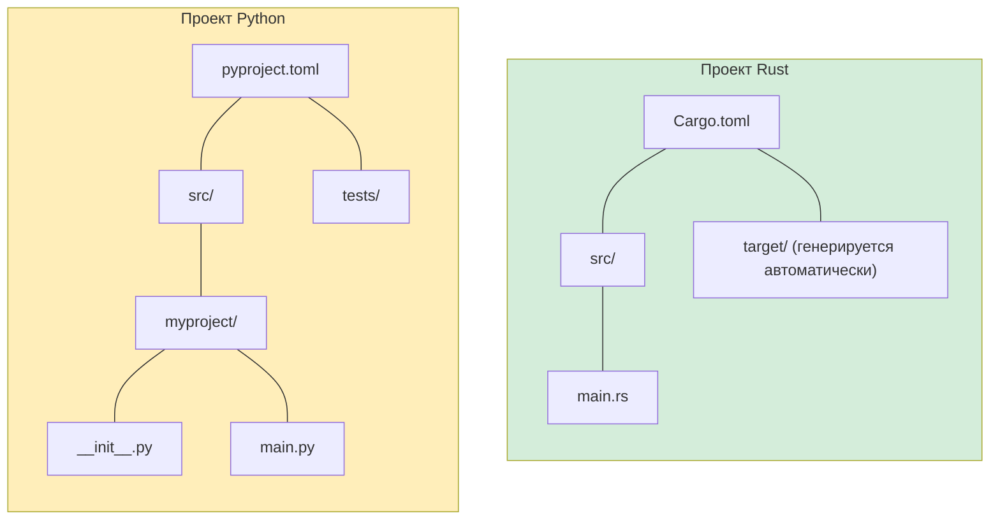

## Установка и настройка

> **Что вы узнаете:** как установить Rust и его тулчейн, чем система сборки Cargo отличается от pip/Poetry, как настроить IDE, как написать первую программу `Hello, world!` и какие ключевые слова Rust соответствуют конструкциям Python.
>
> **Сложность:** 🟢 Начальный

### Установка Rust
```bash
# Установка Rust через rustup (Linux/macOS/WSL)
curl --proto '=https' --tlsv1.2 -sSf https://sh.rustup.rs | sh

# Проверка установки
rustc --version     # Компилятор Rust
cargo --version     # Инструмент сборки + менеджер пакетов (как pip и setuptools вместе)

# Обновление Rust
rustup update
```

### Инструменты Rust и инструменты Python

| Назначение | Python | Rust |
|------------|--------|------|
| Среда выполнения языка | `python` (интерпретатор) | `rustc` (компилятор, напрямую вызывается редко) |
| Менеджер пакетов | `pip` / `poetry` / `uv` | `cargo` (встроен) |
| Конфигурация проекта | `pyproject.toml` | `Cargo.toml` |
| Lock-файл | `poetry.lock` / `requirements.txt` | `Cargo.lock` |
| Виртуальное окружение | `venv` / `conda` | Не нужно (зависимости хранятся для каждого проекта) |
| Форматтер | `black` / `ruff format` | `rustfmt` (встроен: `cargo fmt`) |
| Линтер | `ruff` / `flake8` / `pylint` | `clippy` (встроен: `cargo clippy`) |
| Проверка типов | `mypy` / `pyright` | Встроена в компилятор (всегда включена) |
| Запуск тестов | `pytest` | `cargo test` (встроен) |
| Документация | `sphinx` / `mkdocs` | `cargo doc` (встроен) |
| REPL | `python` / `ipython` | Нет (используйте `cargo test` или Rust Playground) |

### Настройка IDE

**VS Code** (рекомендуется):
```text
Расширения для установки:
- rust-analyzer        ← Обязательно: возможности IDE, подсказки типов, автодополнение
- Even Better TOML     ← Подсветка синтаксиса для Cargo.toml
- CodeLLDB             ← Поддержка отладчика

# Соответствие с Python:
# rust-analyzer ≈ Pylance (но с полным покрытием типами всегда)
# cargo clippy  ≈ ruff (но проверяет корректность, а не только стиль)
```

***

## Ваша первая программа на Rust

### Hello World на Python
```python
# hello.py — просто запустите
print("Hello, World!")

# Запуск:
# python hello.py
```

### Hello World на Rust
```rust
// src/main.rs — сначала нужно скомпилировать
fn main() {
    println!("Hello, World!");   // println! — это макрос (обратите внимание на !)
}

// Сборка и запуск:
// cargo run
```

### Ключевые различия для разработчиков на Python

```text
Python:                              Rust:
─────────                            ─────
- main() не нужен                    - fn main() — точка входа
- Отступы = блоки                    - Фигурные скобки {} = блоки
- print() — это функция              - println!() — это макрос (важен восклицательный знак)
- Без точек с запятой                - Точка с запятой завершает инструкции
- Без объявлений типов               - Типы выводятся, но всегда известны
- Интерпретируется (запуск напрямую) - Компилируется (cargo build, затем запуск)
- Ошибки во время выполнения         - Большинство ошибок на этапе компиляции
```

### Создание первого проекта
```bash
# Python                              # Rust
mkdir myproject                        cargo new myproject
cd myproject                           cd myproject
python -m venv .venv                   # Виртуальное окружение не нужно
source .venv/bin/activate              # Активация не нужна
# Создаём файлы вручную               # src/main.rs уже создан

# Структура проекта Python:            Структура проекта Rust:
# myproject/                           myproject/
# ├── pyproject.toml                   ├── Cargo.toml        (аналог pyproject.toml)
# ├── src/                             ├── src/
# │   └── myproject/                   │   └── main.rs       (точка входа)
# │       ├── __init__.py              └── (__init__.py не нужен)
# │       └── main.py
# └── tests/
#     └── test_main.py
```



> **Ключевое отличие**: проекты на Rust проще. Не нужны `__init__.py`, виртуальные окружения и путаница между `setup.py`, `setup.cfg` и `pyproject.toml`. Достаточно `Cargo.toml` и `src/`.

***

## Cargo и pip/Poetry

### Конфигурация проекта

```toml
# Python — pyproject.toml
[project]
name = "myproject"
version = "0.1.0"
requires-python = ">=3.10"
dependencies = [
    "requests>=2.28",
    "pydantic>=2.0",
]

[project.optional-dependencies]
dev = ["pytest", "ruff", "mypy"]
```

```toml
# Rust — Cargo.toml
[package]
name = "myproject"
version = "0.1.0"
edition = "2021"          # Редакция Rust (аналог версии Python)

[dependencies]
reqwest = "0.12"          # HTTP-клиент (аналог requests)
serde = { version = "1.0", features = ["derive"] }  # Сериализация (аналог pydantic)

[dev-dependencies]
# Тестовые зависимости — собираются только для `cargo test`
# (Отдельная конфигурация для тестов не нужна — `cargo test` встроен)
```

### Частые команды Cargo
```bash
# Аналог в Python                  # Rust
pip install requests               cargo add reqwest
pip install -r requirements.txt    cargo build           # автоматически устанавливает зависимости
pip install -e .                   cargo build            # всегда «редактируемая» сборка
python -m pytest                   cargo test
python -m mypy .                   # Встроено в компилятор — работает всегда
ruff check .                       cargo clippy
ruff format .                      cargo fmt
python main.py                     cargo run
python -c "..."                    # Аналога нет — используйте cargo run или тесты

# Специфичное для Rust:
cargo new myproject                # Создать новый проект
cargo build --release              # Оптимизированная сборка (в 10–100 раз быстрее отладочной)
cargo doc --open                   # Сгенерировать и открыть документацию API
cargo update                       # Обновить зависимости (аналог pip install --upgrade)
```

***


## Ключевые слова Rust для разработчиков на Python

### Ключевые слова для переменных и изменяемости

```rust
// let — объявление переменной (как присваивание в Python, но неизменяемой по умолчанию)
let name = "Alice";          // Python: name = "Alice" (но изменяемая)
// name = "Bob";             // ❌ Ошибка компиляции! По умолчанию неизменяемая

// mut — явное включение изменяемости
let mut count = 0;           // Python: count = 0 (в Python всегда изменяемая)
count += 1;                  // ✅ Разрешено благодаря `mut`

// const — константа времени компиляции (как соглашение Python об UPPER_CASE, но с принудительной проверкой)
const MAX_SIZE: usize = 1024;   // Python: MAX_SIZE = 1024 (только соглашение)

// static — глобальная переменная (используйте осторожно; в Python есть глобальные переменные уровня модуля)
static VERSION: &str = "1.0";
```

### Ключевые слова владения и заимствования

```rust
// У этих ключевых слов НЕТ аналогов в Python — это специфичные для Rust концепции

// & — заимствование (ссылка только для чтения)
fn print_name(name: &str) { }    // Python: def print_name(name: str) — но Python всегда передаёт по ссылке

// &mut — изменяемое заимствование
fn append(list: &mut Vec<i32>) { }  // Python: def append(lst: list) — в Python всегда изменяемый

// move — передача владения (в Rust происходит неявно, в Python — никогда)
let s1 = String::from("hello");
let s2 = s1;    // s1 ПЕРЕМЕЩЁН в s2 — s1 больше не действителен
// println!("{}", s1);  // ❌ Ошибка компиляции: значение перемещено
```

### Ключевые слова определения типов

```rust
// struct — как dataclass или NamedTuple в Python
struct Point {               // @dataclass
    x: f64,                  // class Point:
    y: f64,                  //     x: float
}                            //     y: float

// enum — как enum в Python, но гораздо мощнее (хранит данные)
enum Shape {                 // Прямого аналога в Python нет
    Circle(f64),             // Каждый вариант может хранить свои данные
    Rectangle(f64, f64),
}

// impl — присоединяет методы к типу (как определение методов в классе)
impl Point {                 // class Point:
    fn distance(&self) -> f64 {  //     def distance(self) -> float:
        (self.x.powi(2) + self.y.powi(2)).sqrt()
    }
}

// trait — как ABC или Protocol (PEP 544) в Python
trait Drawable {             // class Drawable(Protocol):
    fn draw(&self);          //     def draw(self) -> None: ...
}

// type — псевдоним типа (как TypeAlias в Python)
type UserId = i64;           // UserId = int  (или TypeAlias)
```

### Ключевые слова управления потоком

```rust
// match — исчерпывающее сопоставление с образцом (как match в Python 3.10+, но с обязательной проверкой)
match value {
    1 => println!("one"),
    2 | 3 => println!("two or three"),
    _ => println!("other"),          // _ = подстановка (как case _: в Python)
}

// if let — деструктуризация с условием (по-питоновски: if (m := regex.match(s)):)
if let Some(x) = optional_value {
    println!("{}", x);
}

// loop — бесконечный цикл (как while True:)
loop {
    break;  // Для выхода нужен break
}

// for — итерация (как for в Python, но .iter() нужен чаще)
for item in collection.iter() {      // for item in collection:
    println!("{}", item);
}

// while let — цикл с деструктуризацией
while let Some(item) = stack.pop() {
    process(item);
}
```

### Ключевые слова видимости

```rust
// pub — публичный (в Python нет настоящего private; используется соглашение с _)
pub fn greet() { }           // def greet():  — в Python всё «публично»

// pub(crate) — видим только внутри крейта
pub(crate) fn internal() { } // def _internal():  — соглашение с одним подчёркиванием

// (без ключевого слова) — приватный для модуля
fn private_helper() { }      // def __private():  — искажение имён с двумя подчёркиваниями

// В Python «приватность» — это джентльменское соглашение.
// В Rust приватность гарантирует компилятор.
```

---

## Упражнения

<details>
<summary><strong>🏋️ Упражнение: первая программа на Rust</strong> (нажмите, чтобы раскрыть)</summary>

**Задание**: создайте новый проект на Rust и напишите программу, которая:
1. Объявляет переменную `name` с вашим именем (тип `&str`)
2. Объявляет изменяемую переменную `count`, начальное значение 0
3. Использует цикл `for` от 1..=5, чтобы увеличивать `count` и выводить `"Привет, {name}! (счётчик: {count})"`
4. После цикла выводит, чётное или нечётное значение `count`, с помощью выражения `match`

<details>
<summary>🔑 Решение</summary>

```bash
cargo new hello_rust && cd hello_rust
```

```rust
// src/main.rs
fn main() {
    let name = "Pythonista";
    let mut count = 0u32;

    for _ in 1..=5 {
        count += 1;
        println!("Привет, {name}! (счётчик: {count})");
    }

    let parity = match count % 2 {
        0 => "чётное",
        _ => "нечётное",
    };
    println!("Итоговый счётчик {count} — {parity}");
}
```

**Главные выводы**:
- `let` по умолчанию неизменяем (чтобы менять `count`, нужен `mut`)
- `1..=5` — диапазон с включённой правой границей (аналог `range(1, 6)` в Python)
- `match` — это выражение, которое возвращает значение
- Никакого `self` и никакого `if __name__ == "__main__"`, только `fn main()`

</details>
</details>

***

