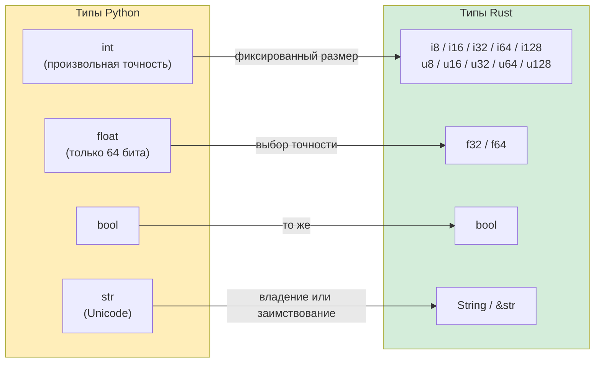

## Переменные и изменяемость

> **Что вы узнаете:** переменные, неизменяемые по умолчанию, явный `mut`, примитивные числовые типы в сравнении с `int` произвольной точности в Python, `String` и `&str` (самая трудная концепция на раннем этапе), форматирование строк и обязательные аннотации типов в Rust.
>
> **Сложность:** 🟢 Начальный

### Объявление переменных в Python
```python
# Python — всё изменяемо, типизация динамическая
count = 0          # Изменяемая, тип выводится как int
count = 5          # ✅ Работает
count = "hello"    # ✅ Работает — тип может меняться! (динамическая типизация)

# «Константы» — это только соглашение:
MAX_SIZE = 1024    # Ничто не мешает потом написать MAX_SIZE = 999
```

### Объявление переменных в Rust
```rust
// Rust — по умолчанию неизменяемые, статически типизированные
let count = 0;           // Неизменяемая, тип выводится как i32
// count = 5;            // ❌ Ошибка компиляции: нельзя дважды присвоить значение неизменяемой переменной
// count = "hello";      // ❌ Ошибка компиляции: ожидалось целое число, найден &str

let mut count = 0;       // Явно изменяемая
count = 5;               // ✅ Работает
// count = "hello";      // ❌ Тип по-прежнему нельзя менять

const MAX_SIZE: usize = 1024; // Настоящая константа — гарантируется компилятором
```

### Ключевой сдвиг мышления для разработчиков на Python
```rust
// Python: переменные — это метки, которые указывают на объекты
// Rust: переменные — это именованные места хранения, которые ВЛАДЕЮТ своими значениями

// Затенение (shadowing) — характерно для Rust, очень полезно
let input = "42";              // &str
let input = input.parse::<i32>().unwrap();  // Теперь i32 — новая переменная с тем же именем
let input = input * 2;         // Теперь 84 — ещё одна новая переменная

// В Python вы бы просто переприсвоили значение и потеряли старый тип:
# input = "42"
# input = int(input)   # То же имя, другой тип — Python тоже это позволяет
# Но в Rust каждый `let` создаёт действительно новую привязку. Старая исчезает.
```

### Практический пример: счётчик
```python
# Версия на Python
class Counter:
    def __init__(self):
        self.value = 0
    
    def increment(self):
        self.value += 1
    
    def get_value(self):
        return self.value

c = Counter()
c.increment()
print(c.get_value())  # 1
```

```rust
// Версия на Rust
struct Counter {
    value: i64,
}

impl Counter {
    fn new() -> Self {
        Counter { value: 0 }
    }

    fn increment(&mut self) {     // &mut self — этот метод будет изменять объект
        self.value += 1;
    }

    fn get_value(&self) -> i64 {  // &self — этот метод только читает
        self.value
    }
}

fn main() {
    let mut c = Counter::new();   // Нужен `mut`, чтобы вызвать increment()
    c.increment();
    println!("{}", c.get_value()); // 1
}
```

> **Ключевое отличие**: в Rust `&mut self` в сигнатуре метода сообщает и вам, и компилятору, что `increment` изменяет счётчик. В Python любой метод может изменить что угодно, и чтобы это понять, нужно читать код.

***

## Сравнение примитивных типов



### Числовые типы

| Python | Rust | Примечания |
|--------|------|------------|
| `int` (произвольная точность) | `i8`, `i16`, `i32`, `i64`, `i128`, `isize` | Целые числа в Rust имеют фиксированный размер |
| `int` (беззнаковые: отдельного типа нет) | `u8`, `u16`, `u32`, `u64`, `u128`, `usize` | Беззнаковые типы указываются явно |
| `float` (64-бит, IEEE 754) | `f32`, `f64` | В Python есть только 64-битный float |
| `bool` | `bool` | Та же концепция |
| `complex` | Нет встроенного (используйте крейт `num`) | Редко встречается в системном коде |

```python
# Python — один целочисленный тип, произвольная точность
x = 42                     # int — может расти до любого размера
big = 2 ** 1000            # По-прежнему работает — тысячи цифр
y = 3.14                   # float — всегда 64-битный
```

```rust
// Rust — явные размеры, переполнение — ошибка компиляции или выполнения
let x: i32 = 42;           // 32-битное знаковое целое
let y: f64 = 3.14;         // 64-битное число с плавающей точкой (аналог float в Python)
let big: i128 = 2_i128.pow(100); // Максимум 128 бит — произвольной точности нет
// Для произвольной точности используйте крейт `num-bigint`

// Подчёркивания для читаемости (как 1_000_000 в Python):
let million = 1_000_000;   // Тот же синтаксис, что и в Python!

// Синтаксис суффиксов типа:
let a = 42u8;              // u8
let b = 3.14f32;           // f32
```

### Типы размера (важно!)

```rust
// usize и isize — целые размером с указатель, используются для индексации
let length: usize = vec![1, 2, 3].len();  // .len() возвращает usize
let index: usize = 0;                     // Индексы массивов всегда usize

// В Python len() возвращает int, и индексы тоже int — различий нет.
// В Rust смешивание i32 и usize требует явного преобразования:
let i: i32 = 5;
// let item = vec[i];    // ❌ Ошибка: ожидался usize, найден i32
let item = vec[i as usize]; // ✅ Явное преобразование
```

### Вывод типов

```rust
// Rust выводит типы, но они ФИКСИРОВАННЫЕ — не динамические
let x = 42;          // Компилятор выводит i32 (целый тип по умолчанию)
let y = 3.14;        // Компилятор выводит f64 (вещественный тип по умолчанию)
let s = "hello";     // Компилятор выводит &str (срез строки)
let v = vec![1, 2];  // Компилятор выводит Vec<i32>

// Можно всегда указать тип явно:
let x: i64 = 42;
let y: f32 = 3.14;

// В отличие от Python, тип НИКОГДА не меняется после вывода:
let x = 42;
// x = "hello";      // ❌ Ошибка: ожидалось целое число, найден &str
```

***

## Строковые типы: String и &str

Это один из самых больших сюрпризов для разработчиков на Python. В Rust есть **два** основных строковых типа там, где в Python один.

### Работа со строками в Python
```python
# Python — один строковый тип, неизменяемый, с подсчётом ссылок
name = "Alice"          # str — неизменяемый, размещается в куче
greeting = f"Hello, {name}!"  # Форматирование через f-строку
chars = list(name)      # Преобразование в список символов
upper = name.upper()    # Возвращает новую строку (строки неизменяемы)
```

### Строковые типы Rust
```rust
// В Rust ДВА строковых типа:

// 1. &str (срез строки) — заимствованный, неизменяемый, «вид» на данные строки
let name: &str = "Alice";           // Указывает на данные строки в бинарнике
                                     // Ближе всего к str в Python, но это ССЫЛКА

// 2. String (строка-владелец) — в куче, растёт, принадлежит владельцу
let mut greeting = String::from("Hello, ");  // Владеющая строка, её можно изменять
greeting.push_str(name);
greeting.push('!');
// greeting теперь "Hello, Alice!"
```

### Когда что использовать?

```rust
// Думайте так:
// &str   = «Я смотрю на строку, которой владеет кто-то другой» (вид только для чтения)
// String = «Я владею этой строкой и могу её менять» (владеющие данные)

// Параметры функций: лучше &str (принимает оба типа)
fn greet(name: &str) -> String {          // принимает и &str, и &String
    format!("Hello, {}!", name)           // format! создаёт новый String
}

let s1 = "world";                         // литерал &str
let s2 = String::from("Rust");            // String

greet(s1);      // ✅ &str работает напрямую
greet(&s2);     // ✅ &String автоматически преобразуется в &str (Deref coercion)
```

### Практические примеры

```python
# Строковые операции в Python
name = "alice"
upper = name.upper()               # "ALICE"
contains = "lic" in name           # True
parts = "a,b,c".split(",")         # ["a", "b", "c"]
joined = "-".join(["a", "b", "c"]) # "a-b-c"
stripped = "  hello  ".strip()     # "hello"
replaced = name.replace("a", "A") # "Alice"
```

```rust
// Аналоги в Rust
let name = "alice";
let upper = name.to_uppercase();           // String — новое выделение памяти
let contains = name.contains("lic");       // bool
let parts: Vec<&str> = "a,b,c".split(',').collect();  // Vec<&str>
let joined = ["a", "b", "c"].join("-");    // String
let stripped = "  hello  ".trim();         // &str — без выделения памяти!
let replaced = name.replace("a", "A");     // String

// Ключевая мысль: одни операции возвращают &str (без выделения памяти), другие — String.
// .trim() возвращает срез исходной строки — это эффективно!
// .to_uppercase() должен создать новый String — нужно выделение памяти.
```

### Разработчикам на Python: думайте так

```text
Python str     ≈ Rust &str     (вы в основном читаете строки)
Python str     ≈ Rust String   (когда нужно владеть или изменять)

Правило большого пальца:
- Параметры функций        → используйте &str (самый гибкий вариант)
- Поля структур            → используйте String (структура владеет своими данными)
- Возвращаемые значения    → используйте String (вызывающий код должен владеть ими)
- Строковые литералы       → автоматически &str
```

***

## Вывод и форматирование строк

### Базовый вывод
```python
# Python
print("Hello, World!")
print("Имя:", name, "Возраст:", age)    # Через пробел
print(f"Имя: {name}, Возраст: {age}")   # f-строка
```

```rust
// Rust
println!("Hello, World!");
println!("Имя: {} Возраст: {}", name, age);    // Позиционные {}
println!("Имя: {name}, Возраст: {age}");       // Встроенные переменные (Rust 1.58+, как f-строки!)
```

### Спецификаторы формата
```python
# Форматирование в Python
print(f"{3.14159:.2f}")          # "3.14" — 2 знака после запятой
print(f"{42:05d}")               # "00042" — дополнение нулями
print(f"{255:#x}")               # "0xff" — шестнадцатеричный вид
print(f"{42:>10}")               # "        42" — выравнивание по правому краю
print(f"{'left':<10}|")          # "left      |" — выравнивание по левому краю
```

```rust
// Форматирование в Rust (очень похоже на Python!)
println!("{:.2}", 3.14159);         // "3.14" — 2 знака после запятой
println!("{:05}", 42);              // "00042" — дополнение нулями
println!("{:#x}", 255);             // "0xff" — шестнадцатеричный вид
println!("{:>10}", 42);             // "        42" — выравнивание по правому краю
println!("{:<10}|", "left");        // "left      |" — выравнивание по левому краю
```

### Отладочный вывод
```python
# Python — repr() и pprint
print(repr([1, 2, 3]))             # "[1, 2, 3]"
from pprint import pprint
pprint({"key": [1, 2, 3]})         # Красивый вывод
```

```rust
// Rust — {:?} и {:#?}
println!("{:?}", vec![1, 2, 3]);       // "[1, 2, 3]" — формат Debug
println!("{:#?}", vec![1, 2, 3]);      // Красивый формат Debug

// Чтобы типы можно было вывести, добавьте derive Debug:
#[derive(Debug)]
struct Point { x: f64, y: f64 }

let p = Point { x: 1.0, y: 2.0 };
println!("{:?}", p);                   // "Point { x: 1.0, y: 2.0 }"
println!("{p:?}");                     // То же самое, но со встроенным синтаксисом
```

### Краткая справка

| Python | Rust | Примечания |
|--------|------|------------|
| `print(x)` | `println!("{}", x)` или `println!("{x}")` | Формат Display |
| `print(repr(x))` | `println!("{:?}", x)` | Формат Debug |
| `f"Hello {name}"` | `format!("Hello {name}")` | Возвращает String |
| `print(x, end="")` | `print!("{x}")` | Без перевода строки (`print!` и `println!`) |
| `print(x, file=sys.stderr)` | `eprintln!("{x}")` | Вывод в stderr |
| `sys.stdout.write(s)` | `print!("{s}")` | Без перевода строки |

***

## Аннотации типов: необязательные и обязательные

### Подсказки типов в Python (необязательные, не проверяются)
```python
# Python — подсказки типов служат документацией, а не принудительной проверкой
def add(a: int, b: int) -> int:
    return a + b

add(1, 2)         # ✅
add("a", "b")     # ✅ Python не возражает — возвращает "ab"
add(1, "2")       # ✅ Пока не упадёт во время выполнения: TypeError

# Union-типы, Optional
def find(key: str) -> int | None:
    ...

# Обобщённые типы
def first(items: list[int]) -> int | None:
    return items[0] if items else None

# Псевдонимы типов
UserId = int
Mapping = dict[str, list[int]]
```

### Объявления типов в Rust (обязательные, проверяются компилятором)
```rust
// Rust — типы проверяются всегда, без исключений.
fn add(a: i32, b: i32) -> i32 {
    a + b
}

add(1, 2);         // ✅
// add("a", "b");  // ❌ Ошибка компиляции: ожидался i32, найден &str

// Необязательные значения используют Option<T>
fn find(key: &str) -> Option<i32> {
    // Возвращает Some(value) или None
    Some(42)
}

// Обобщённые типы
fn first(items: &[i32]) -> Option<i32> {
    items.first().copied()
}

// Псевдонимы типов
type UserId = i64;
type Mapping = HashMap<String, Vec<i32>>;
```

> **Ключевая мысль**: в Python подсказки типов помогают вашей IDE и mypy, но на выполнение программы не влияют. В Rust типы — это и есть программа: компилятор использует их, чтобы гарантировать безопасность памяти, предотвратить гонки данных и исключить ошибки нулевых указателей.
>
> 📌 **См. также**: [Гл. 6 — Перечисления и сопоставление с образцом](ch06-enums-and-pattern-matching.md) показывает, как система типов Rust заменяет `Union`-типы Python и проверки `isinstance()`.

---

## Упражнения

<details>
<summary><strong>🏋️ Упражнение: конвертер температуры</strong> (нажмите, чтобы раскрыть)</summary>

**Задание**: напишите функцию `celsius_to_fahrenheit(c: f64) -> f64` и функцию `classify(temp_f: f64) -> &'static str`, которая по пороговым значениям возвращает `"холодно"`, `"умеренно"` или `"жарко"`. Выведите результат для 0, 20 и 35 градусов Цельсия. Используйте форматирование строк.

<details>
<summary>🔑 Решение</summary>

```rust
fn celsius_to_fahrenheit(c: f64) -> f64 {
    c * 9.0 / 5.0 + 32.0
}

fn classify(temp_f: f64) -> &'static str {
    if temp_f < 50.0 { "холодно" }
    else if temp_f < 77.0 { "умеренно" }
    else { "жарко" }
}

fn main() {
    for c in [0.0, 20.0, 35.0] {
        let f = celsius_to_fahrenheit(c);
        println!("{c:.1}°C = {f:.1}°F — {}", classify(f));
    }
}
```

**Ключевой вывод**: Rust требует явного `f64` (нет неявного преобразования int → float), `for` перебирает массивы напрямую (без `range()`), а блоки `if/else` — это выражения.

</details>
</details>

***

