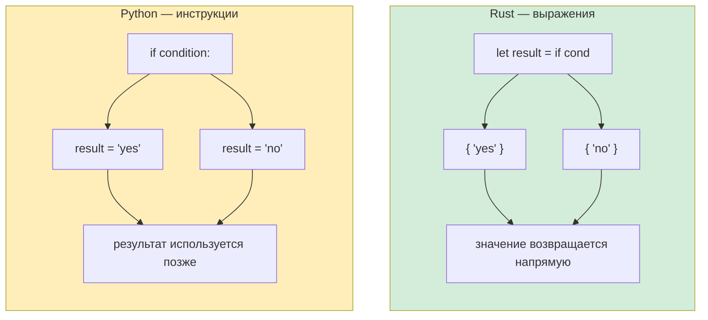

## Условные конструкции

> **Что вы узнаете:** `if`/`else` без скобок (но с фигурными скобками), `loop`/`while`/`for` в сравнении с моделью итерации Python, блоки-выражения (всё возвращает значение) и сигнатуры функций с обязательными типами возвращаемых значений.
>
> **Сложность:** 🟢 Начальный

### if/else

```python
# Python
if temperature > 100:
    print("Слишком жарко!")
elif temperature < 0:
    print("Слишком холодно!")
else:
    print("В самый раз")

# Тернарный оператор
status = "hot" if temperature > 100 else "ok"
```

```rust
// Rust — фигурные скобки обязательны, двоеточий нет, пишется `else if`, а не `elif`
if temperature > 100 {
    println!("Слишком жарко!");
} else if temperature < 0 {
    println!("Слишком холодно!");
} else {
    println!("В самый раз");
}

// if — это ВЫРАЖЕНИЕ, оно возвращает значение (как тернарный оператор Python, но мощнее)
let status = if temperature > 100 { "hot" } else { "ok" };
```

### Важные различия
```rust
// 1. Условие должно быть bool — никакой «истинности» и «ложности»
let x = 42;
// if x { }          // ❌ Ошибка: ожидался bool, найден целый тип
if x != 0 { }        // ✅ Нужно явное сравнение

// В Python всё это приводится к True/False:
// if []:      → False    (пустой список)
// if "":      → False    (пустая строка)
// if 0:       → False    (ноль)
// if None:    → False

// В Rust в условиях работает ТОЛЬКО bool:
let items: Vec<i32> = vec![];
// if items { }           // ❌ Ошибка
if !items.is_empty() { }  // ✅ Явная проверка

let name = "";
// if name { }             // ❌ Ошибка
if !name.is_empty() { }    // ✅ Явная проверка
```

***

## Циклы и итерация

### Циклы for
```python
# Python
for i in range(5):
    print(i)

for item in ["a", "b", "c"]:
    print(item)

for i, item in enumerate(["a", "b", "c"]):
    print(f"{i}: {item}")

for key, value in {"x": 1, "y": 2}.items():
    print(f"{key} = {value}")
```

```rust
// Rust
for i in 0..5 {                           // range(5) → 0..5
    println!("{}", i);
}

for item in ["a", "b", "c"] {             // Прямая итерация
    println!("{}", item);
}

for (i, item) in ["a", "b", "c"].iter().enumerate() {  // enumerate()
    println!("{}: {}", i, item);
}

// Итерация по HashMap
use std::collections::HashMap;
let map = HashMap::from([("x", 1), ("y", 2)]);
for (key, value) in &map {                // & — заимствование словаря
    println!("{} = {}", key, value);
}
```

### Синтаксис диапазонов
```rust
Python:              Rust:               Примечания:
range(5)             0..5                Полуоткрытый (правая граница не включается)
range(1, 10)         1..10               Полуоткрытый
range(1, 11)         1..=10              Закрытый (правая граница включается)
range(0, 10, 2)      (0..10).step_by(2)  Шаг (метод, а не синтаксис)
```

### Циклы while
```python
# Python
count = 0
while count < 5:
    print(count)
    count += 1

# Бесконечный цикл
while True:
    data = get_input()
    if data == "quit":
        break
```

```rust
// Rust
let mut count = 0;
while count < 5 {
    println!("{}", count);
    count += 1;
}

// Бесконечный цикл — используйте `loop`, а не `while true`
loop {
    let data = get_input();
    if data == "quit" {
        break;
    }
}

// loop может вернуть значение! (уникально для Rust)
let result = loop {
    let input = get_input();
    if let Ok(num) = input.parse::<i32>() {
        break num;  // `break` со значением — как return для циклов
    }
    println!("Не число, попробуйте ещё раз");
};
```

### Списочные включения и цепочки итераторов
```python
# Python — списочные включения (list comprehensions)
squares = [x ** 2 for x in range(10)]
evens = [x for x in range(20) if x % 2 == 0]
pairs = [(x, y) for x in range(3) for y in range(3)]
```

```rust
// Rust — цепочки итераторов (.map, .filter, .collect)
let squares: Vec<i32> = (0..10).map(|x| x * x).collect();
let evens: Vec<i32> = (0..20).filter(|x| x % 2 == 0).collect();
let pairs: Vec<(i32, i32)> = (0..3)
    .flat_map(|x| (0..3).map(move |y| (x, y)))
    .collect();

// Они ЛЕНИВЫЕ — ничего не выполняется до .collect()
// Списочные включения в Python энергичные (выполняются сразу)
// Итераторы Rust могут быть эффективнее на больших наборах данных
```

***

## Блоки-выражения

Всё в Rust является выражением (или может им быть). Это большой сдвиг по сравнению с Python, где `if` и `for` — это инструкции.

```python
# Python — if — это инструкция (кроме тернарного оператора)
if condition:
    result = "yes"
else:
    result = "no"

# Или тернарный оператор (только одно выражение):
result = "yes" if condition else "no"
```

```rust
// Rust — if — это выражение (возвращает значение)
let result = if condition { "yes" } else { "no" };

// Блоки — это выражения: последняя строка (без точки с запятой) и есть возвращаемое значение
let value = {
    let x = 5;
    let y = 10;
    x + y    // Без точки с запятой → это значение блока (15)
};

// match — тоже выражение
let description = match temperature {
    t if t > 100 => "boiling",
    t if t > 50 => "hot",
    t if t > 20 => "warm",
    _ => "cold",
};
```

Диаграмма ниже иллюстрирует ключевое различие между управлением потоком в Python на основе инструкций и в Rust на основе выражений:



> **Правило точки с запятой**: в Rust последнее выражение блока **без точки с запятой** — это возвращаемое значение блока. Добавленная точка с запятой превращает его в инструкцию (возвращается `()`). Поначалу это сбивает с толку разработчиков на Python: это похоже на неявный `return`.

***

## Функции и сигнатуры типов

### Функции в Python
```python
# Python — типы необязательны, диспетчеризация динамическая
def greet(name: str, greeting: str = "Hello") -> str:
    return f"{greeting}, {name}!"

# Аргументы по умолчанию, *args, **kwargs
def flexible(*args, **kwargs):
    pass

# Функции первого класса
def apply(f, x):
    return f(x)

result = apply(lambda x: x * 2, 5)  # 10
```

### Функции в Rust
```rust
// Rust — типы в сигнатурах функций ОБЯЗАТЕЛЬНЫ, значений по умолчанию нет
fn greet(name: &str, greeting: &str) -> String {
    format!("{}, {}!", greeting, name)
}

// Аргументов по умолчанию нет — используйте паттерн «строитель» или Option
fn greet_with_default(name: &str, greeting: Option<&str>) -> String {
    let greeting = greeting.unwrap_or("Hello");
    format!("{}, {}!", greeting, name)
}

// Нет *args/**kwargs — используйте срезы или структуры
fn sum_all(numbers: &[i32]) -> i32 {
    numbers.iter().sum()
}

// Функции первого класса и замыкания
fn apply(f: fn(i32) -> i32, x: i32) -> i32 {
    f(x)
}

let result = apply(|x| x * 2, 5);  // 10
```

### Возвращаемые значения
```python
# Python — return пишется явно, None подразумевается
def divide(a, b):
    if b == 0:
        return None  # Или выбросить исключение
    return a / b
```

```rust
// Rust — последнее выражение и есть возвращаемое значение (без точки с запятой)
fn divide(a: f64, b: f64) -> Option<f64> {
    if b == 0.0 {
        None              // Ранний возврат (можно также написать `return None;`)
    } else {
        Some(a / b)       // Последнее выражение — неявный возврат
    }
}
```

### Несколько возвращаемых значений
```python
# Python — возвращаем кортеж
def min_max(numbers):
    return min(numbers), max(numbers)

lo, hi = min_max([3, 1, 4, 1, 5])
```

```rust
// Rust — возвращаем кортеж (та же концепция!)
fn min_max(numbers: &[i32]) -> (i32, i32) {
    let min = *numbers.iter().min().unwrap();
    let max = *numbers.iter().max().unwrap();
    (min, max)
}

let (lo, hi) = min_max(&[3, 1, 4, 1, 5]);
```

### Методы: self, &self и &mut self
```rust
// В Python `self` — это всегда изменяемая ссылка на объект.
// В Rust выбираете вы:

impl MyStruct {
    fn new() -> Self { ... }                // Без self — «статический метод» / «classmethod»
    fn read_only(&self) { ... }             // &self — заимствует неизменяемо (нельзя менять)
    fn modify(&mut self) { ... }            // &mut self — заимствует изменяемо (можно менять)
    fn consume(self) { ... }                // self — забирает владение (объект перемещается)
}

// Аналог в Python:
// class MyStruct:
//     @classmethod
//     def new(cls): ...                    # Экземпляр не нужен
//     def read_only(self): ...             # В Python все три варианта одинаковы:
//     def modify(self): ...                # Python self всегда изменяем
//     def consume(self): ...               # Python никогда не «потребляет» self
```

---

## Упражнения

<details>
<summary><strong>🏋️ Упражнение: FizzBuzz на выражениях</strong> (нажмите, чтобы раскрыть)</summary>

**Задание**: напишите FizzBuzz для 1..=30 с использованием `match` как выражения Rust. Каждое число должно выводить `"Fizz"`, `"Buzz"`, `"FizzBuzz"` или само число. Используйте `match (n % 3, n % 5)` в качестве выражения.

<details>
<summary>🔑 Решение</summary>

```rust
fn main() {
    for n in 1..=30 {
        let result = match (n % 3, n % 5) {
            (0, 0) => String::from("FizzBuzz"),
            (0, _) => String::from("Fizz"),
            (_, 0) => String::from("Buzz"),
            _ => n.to_string(),
        };
        println!("{result}");
    }
}
```

**Ключевой вывод**: `match` — это выражение, которое возвращает значение, поэтому цепочки `if/elif/else` не нужны. Подстановка `_` заменяет `case _:` из Python в роли значения по умолчанию.

</details>
</details>

***

