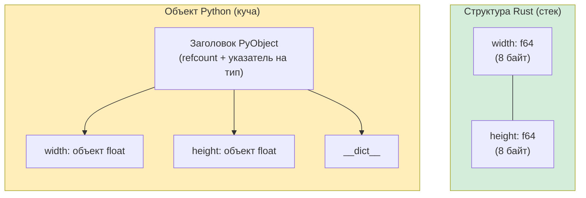

## Кортежи и деструктуризация

> **Что вы узнаете:** кортежи Rust и Python, массивы и срезы, структуры (замена классам в Rust), `Vec<T>` и `list`, `HashMap<K,V>` и `dict`, а также паттерн newtype для моделирования предметной области.
>
> **Сложность:** 🟢 Начальный

### Кортежи в Python
```python
# Python — кортежи это неизменяемые последовательности
point = (3.0, 4.0)
x, y = point                    # Распаковка
print(f"x={x}, y={y}")

# Кортежи могут содержать значения разных типов
record = ("Alice", 30, True)
name, age, active = record

# Именованные кортежи для ясности
from typing import NamedTuple

class Point(NamedTuple):
    x: float
    y: float

p = Point(3.0, 4.0)
print(p.x)                      # Доступ по имени
```

### Кортежи в Rust
```rust
// Rust — кортежи фиксированного размера, с типами, могут содержать значения разных типов
let point: (f64, f64) = (3.0, 4.0);
let (x, y) = point;              // Деструктуризация (то же, что распаковка в Python)
println!("x={x}, y={y}");

// Значения разных типов
let record: (&str, i32, bool) = ("Alice", 30, true);
let (name, age, active) = record;

// Доступ по индексу (в отличие от Python, используется синтаксис .0 .1 .2)
let first = record.0;            // "Alice"
let second = record.1;           // 30

// Python: record[0]
// Rust:   record.0      ← индекс через точку, а не квадратные скобки
```

### Когда использовать кортежи, а когда структуры
```rust
// Кортежи: быстрая группировка, возврат из функций, временные значения
fn min_max(data: &[i32]) -> (i32, i32) {
    (*data.iter().min().unwrap(), *data.iter().max().unwrap())
}
let (lo, hi) = min_max(&[3, 1, 4, 1, 5]);

// Структуры: именованные поля, понятный смысл, методы
struct Point { x: f64, y: f64 }

// Эмпирическое правило:
// - 2–3 поля одного типа → кортеж подойдёт
// - Нужны именованные поля → используйте структуру
// - Нужны методы → используйте структуру
// (Те же рекомендации, что и в Python: tuple vs namedtuple vs dataclass)
```

***

## Массивы и срезы

### Списки Python и массивы Rust
```python
# Python — списки динамические, гетерогенные
numbers = [1, 2, 3, 4, 5]       # Могут расти, уменьшаться, содержать значения разных типов
numbers.append(6)
mixed = [1, "two", 3.0]         # Смешанные типы допустимы
```

```rust
// В Rust есть ДВА понятия: фиксированный размер и динамический размер

// 1. Массив — фиксированный размер, размещается на стеке (аналога в Python нет)
let numbers: [i32; 5] = [1, 2, 3, 4, 5]; // Размер входит в тип!
// numbers.push(6);  // ❌ Массивы не могут расти

// Инициализация всех элементов одним значением:
let zeros = [0; 10];            // [0, 0, 0, 0, 0, 0, 0, 0, 0, 0]

// 2. Срез — представление участка массива или Vec (как срезы в Python, но заимствованный)
let slice: &[i32] = &numbers[1..4]; // [2, 3, 4] — ссылка, а не копия!

// Python: numbers[1:4] создаёт НОВЫЙ список (копию)
// Rust:   &numbers[1..4] создаёт ПРЕДСТАВЛЕНИЕ (без копирования и выделения памяти)
```

### Практическое сравнение
```python
# Срезы в Python создают копии
data = [10, 20, 30, 40, 50]
first_three = data[:3]          # Новый список: [10, 20, 30]
last_two = data[-2:]            # Новый список: [40, 50]
reversed_data = data[::-1]      # Новый список: [50, 40, 30, 20, 10]
```

```rust
// Срезы в Rust создают представления (ссылки)
let data = [10, 20, 30, 40, 50];
let first_three = &data[..3];         // &[i32], представление: [10, 20, 30]
let last_two = &data[3..];            // &[i32], представление: [40, 50]

// Отрицательных индексов нет — используйте .len()
let last_two = &data[data.len()-2..]; // &[i32], представление: [40, 50]

// Разворот: используйте итератор
let reversed: Vec<i32> = data.iter().rev().copied().collect();
```

***

## Структуры и классы

### Классы в Python
```python
# Python — класс с __init__, методами и свойствами
from dataclasses import dataclass

@dataclass
class Rectangle:
    width: float
    height: float

    def area(self) -> float:
        return self.width * self.height

    def perimeter(self) -> float:
        return 2.0 * (self.width + self.height)

    def scale(self, factor: float) -> "Rectangle":
        return Rectangle(self.width * factor, self.height * factor)

    def __str__(self) -> str:
        return f"Rectangle({self.width} x {self.height})"

r = Rectangle(10.0, 5.0)
print(r.area())         # 50.0
print(r)                # Rectangle(10.0 x 5.0)
```

### Структуры в Rust
```rust
// Rust — struct + блоки impl (без наследования!)
#[derive(Debug, Clone)]
struct Rectangle {
    width: f64,
    height: f64,
}

impl Rectangle {
    // «Конструктор» — ассоциированная функция (без self)
    fn new(width: f64, height: f64) -> Self {
        Rectangle { width, height }   // Сокращённая запись полей, когда имена совпадают
    }

    fn area(&self) -> f64 {
        self.width * self.height
    }

    fn perimeter(&self) -> f64 {
        2.0 * (self.width + self.height)
    }

    fn scale(&self, factor: f64) -> Rectangle {
        Rectangle::new(self.width * factor, self.height * factor)
    }
}

// Трейт Display — аналог __str__ в Python
impl std::fmt::Display for Rectangle {
    fn fmt(&self, f: &mut std::fmt::Formatter<'_>) -> std::fmt::Result {
        write!(f, "Rectangle({} x {})", self.width, self.height)
    }
}

fn main() {
    let r = Rectangle::new(10.0, 5.0);
    println!("{}", r.area());    // 50.0
    println!("{}", r);           // Rectangle(10 x 5)
}
```



> **Наблюдение о памяти**: объект Python `Rectangle` имеет 56-байтовый заголовок плюс отдельные объекты float в куче. Структура Rust `Rectangle` занимает ровно 16 байт на стеке: без косвенных обращений и без нагрузки на GC.
>
> 📌 **См. также**: [Гл. 10 — Трейты и обобщения](ch10-traits-and-generics.md) рассказывает о реализации трейтов вроде `Display`, `Debug` и перегрузки операторов для ваших структур.

### Соответствие: магические методы Python → трейты Rust

| Python | Rust | Назначение |
|--------|------|------------|
| `__str__` | `impl Display` | Человекочитаемая строка |
| `__repr__` | `#[derive(Debug)]` | Отладочное представление |
| `__eq__` | `#[derive(PartialEq)]` | Сравнение на равенство |
| `__hash__` | `#[derive(Hash)]` | Хешируемость (для ключей dict и HashSet) |
| `__lt__`, `__le__` и т. д. | `#[derive(PartialOrd, Ord)]` | Упорядочивание |
| `__add__` | `impl Add` | Оператор `+` |
| `__iter__` | `impl Iterator` | Итерация |
| `__len__` | метод `.len()` | Длина |
| `__enter__`/`__exit__` | RAII + `impl Drop` | Автоматическая очистка; прямого аналога двухфазного протокола менеджера контекста нет |
| `__init__` | `fn new()` (соглашение) | Конструктор |
| `__getitem__` | `impl Index` | Индексация через `[]` |
| `__contains__` | метод `.contains()` | Оператор `in` |

### Нет наследования: вместо него композиция
```python
# Python — наследование
class Animal:
    def __init__(self, name: str):
        self.name = name
    def speak(self) -> str:
        raise NotImplementedError

class Dog(Animal):
    def speak(self) -> str:
        return f"{self.name} говорит: Гав!"

class Cat(Animal):
    def speak(self) -> str:
        return f"{self.name} говорит: Мяу!"
```

```rust
// Rust — трейты и композиция (без наследования)
trait Animal {
    fn name(&self) -> &str;
    fn speak(&self) -> String;
}

struct Dog { name: String }
struct Cat { name: String }

impl Animal for Dog {
    fn name(&self) -> &str { &self.name }
    fn speak(&self) -> String {
        format!("{} говорит: Гав!", self.name)
    }
}

impl Animal for Cat {
    fn name(&self) -> &str { &self.name }
    fn speak(&self) -> String {
        format!("{} говорит: Мяу!", self.name)
    }
}

// Для полиморфизма используйте трейт-объекты (как утиную типизацию в Python):
fn animal_roll_call(animals: &[&dyn Animal]) {
    for a in animals {
        println!("{}", a.speak());
    }
}
```

> **Ментальная модель**: Python говорит «унаследуй поведение». Rust говорит «реализуй контракт». Результат похож, но Rust избегает проблемы ромбовидного наследования и хрупкости базовых классов.

***

## Vec и list

`Vec<T>` — это растущий массив Rust в куче, ближайший аналог `list` в Python.

### Создание векторов
```python
# Python
numbers = [1, 2, 3]
empty = []
repeated = [0] * 10
from_range = list(range(1, 6))
```

```rust
// Rust
let numbers = vec![1, 2, 3];            // макрос vec! (аналог литерала списка)
let empty: Vec<i32> = Vec::new();        // Пустой vec (нужна аннотация типа)
let repeated = vec![0; 10];              // [0, 0, 0, 0, 0, 0, 0, 0, 0, 0]
let from_range: Vec<i32> = (1..6).collect(); // [1, 2, 3, 4, 5]
```

### Частые операции
```python
# Операции со списками Python
nums = [1, 2, 3]
nums.append(4)                   # [1, 2, 3, 4]
nums.extend([5, 6])             # [1, 2, 3, 4, 5, 6]
nums.insert(0, 0)               # [0, 1, 2, 3, 4, 5, 6]
last = nums.pop()               # 6, nums = [0, 1, 2, 3, 4, 5]
length = len(nums)              # 6
nums.sort()                     # Сортировка на месте
sorted_copy = sorted(nums)     # Новый отсортированный список
nums.reverse()                  # Разворот на месте
contains = 3 in nums           # True
index = nums.index(3)          # Индекс первой тройки
```

```rust
// Операции с Vec в Rust
let mut nums = vec![1, 2, 3];
nums.push(4);                          // [1, 2, 3, 4]
nums.extend([5, 6]);                   // [1, 2, 3, 4, 5, 6]
nums.insert(0, 0);                     // [0, 1, 2, 3, 4, 5, 6]
let last = nums.pop();                 // Some(6), nums = [0, 1, 2, 3, 4, 5]
let length = nums.len();               // 6
nums.sort();                           // Сортировка на месте
let mut sorted_copy = nums.clone();
sorted_copy.sort();                    // Сортируем копию
nums.reverse();                        // Разворот на месте
let contains = nums.contains(&3);      // true
let index = nums.iter().position(|&x| x == 3); // Some(index) или None
```

### Краткая справка

| Python | Rust | Примечания |
|--------|------|------------|
| `lst.append(x)` | `vec.push(x)` | |
| `lst.extend(other)` | `vec.extend(other)` | |
| `lst.pop()` | `vec.pop()` | Возвращает `Option<T>` |
| `lst.insert(i, x)` | `vec.insert(i, x)` | |
| `lst.remove(x)` | `vec.iter().position(\|v\| v == &x).map(\|i\| vec.remove(i))` | Удаляет только первое совпадение (чтобы удалить все, используйте `retain`) |
| `del lst[i]` | `vec.remove(i)` | Возвращает удалённый элемент |
| `len(lst)` | `vec.len()` | |
| `x in lst` | `vec.contains(&x)` | |
| `lst.sort()` | `vec.sort()` | |
| `sorted(lst)` | Клонирование + sort или итератор | |
| `lst[i]` | `vec[i]` | Паника, если индекс вне границ |
| `lst.get(i, default)` | `vec.get(i)` | Возвращает `Option<&T>` |
| `lst[1:3]` | `&vec[1..3]` | Возвращает срез (без копирования) |

***

## HashMap и dict

`HashMap<K, V>` — хеш-таблица Rust, аналог `dict` в Python.

### Создание HashMap
```python
# Python
scores = {"Alice": 100, "Bob": 85}
empty = {}
from_pairs = dict([("x", 1), ("y", 2)])
comprehension = {k: v for k, v in zip(keys, values)}
```

```rust
// Rust
use std::collections::HashMap;

let scores = HashMap::from([("Alice", 100), ("Bob", 85)]);
let empty: HashMap<String, i32> = HashMap::new();
let from_pairs: HashMap<&str, i32> = [("x", 1), ("y", 2)].into_iter().collect();
let comprehension: HashMap<_, _> = keys.iter().zip(values.iter()).collect();
```

### Частые операции
```python
# Операции со словарём Python
d = {"a": 1, "b": 2}
d["c"] = 3                      # Вставка
val = d["a"]                     # 1 (KeyError, если ключа нет)
val = d.get("z", 0)             # 0 (значение по умолчанию, если ключа нет)
del d["b"]                       # Удаление
exists = "a" in d               # True
keys = list(d.keys())           # ["a", "c"]
values = list(d.values())       # [1, 3]
items = list(d.items())         # [("a", 1), ("c", 3)]
length = len(d)                 # 2

# setdefault / defaultdict
from collections import defaultdict
word_count = defaultdict(int)
for word in words:
    word_count[word] += 1
```

```rust
// Операции с HashMap в Rust
use std::collections::HashMap;

let mut d = HashMap::new();
d.insert("a", 1);
d.insert("b", 2);
d.insert("c", 3);                       // Вставка или перезапись

let val = d["a"];                        // 1 (паника, если ключа нет)
let val = d.get("z").copied().unwrap_or(0); // 0 (безопасный доступ)
d.remove("b");                          // Удаление
let exists = d.contains_key("a");       // true
let keys: Vec<_> = d.keys().collect();
let values: Vec<_> = d.values().collect();
let length = d.len();

// Entry API — аналог паттерна setdefault / defaultdict в Python
let mut word_count: HashMap<&str, i32> = HashMap::new();
for word in words {
    *word_count.entry(word).or_insert(0) += 1;
}
```

### Краткая справка

| Python | Rust | Примечания |
|--------|------|------------|
| `d[key] = val` | `d.insert(key, val)` | Возвращает `Option<V>` (старое значение) |
| `d[key]` | `d[&key]` | Паника, если ключа нет |
| `d.get(key)` | `d.get(&key)` | Возвращает `Option<&V>` |
| `d.get(key, default)` | `d.get(&key).unwrap_or(&default)` | |
| `key in d` | `d.contains_key(&key)` | |
| `del d[key]` | `d.remove(&key)` | Возвращает `Option<V>` |
| `d.keys()` | `d.keys()` | Итератор |
| `d.values()` | `d.values()` | Итератор |
| `d.items()` | `d.iter()` | Итератор по `(&K, &V)` |
| `len(d)` | `d.len()` | |
| `d.update(other)` | `d.extend(other)` | |
| `defaultdict(int)` | `.entry().or_insert(0)` | Entry API |
| `d.setdefault(k, v)` | `d.entry(k).or_insert(v)` | Entry API |

***

### Другие коллекции

| Python | Rust | Примечания |
|--------|------|------------|
| `set()` | `HashSet<T>` | `use std::collections::HashSet;` |
| `collections.deque` | `VecDeque<T>` | `use std::collections::VecDeque;` |
| `heapq` | `BinaryHeap<T>` | Max-куча по умолчанию |
| `collections.OrderedDict` | `IndexMap` (крейт) | HashMap не сохраняет порядок |
| `sortedcontainers.SortedList` | `BTreeSet<T>` / `BTreeMap<K,V>` | На основе дерева, отсортировано |

---

## Упражнения

<details>
<summary><strong>🏋️ Упражнение: счётчик частоты слов</strong> (нажмите, чтобы раскрыть)</summary>

**Задание**: напишите функцию, которая принимает предложение `&str` и возвращает `HashMap<String, usize>` с частотами слов (без учёта регистра). В Python это `Counter(s.lower().split())`. Перепишите её на Rust.

<details>
<summary>🔑 Решение</summary>

```rust
use std::collections::HashMap;

fn word_frequencies(text: &str) -> HashMap<String, usize> {
    let mut counts = HashMap::new();
    for word in text.split_whitespace() {
        let key = word.to_lowercase();
        *counts.entry(key).or_insert(0) += 1;
    }
    counts
}

fn main() {
    let text = "the quick brown fox jumps over the lazy fox";
    let freq = word_frequencies(text);
    for (word, count) in &freq {
        println!("{word}: {count}");
    }
}
```

**Ключевой вывод**: `HashMap::entry().or_insert()` — аналог `defaultdict` или `Counter` в Python. Разыменование `*` нужно, потому что `or_insert` возвращает `&mut usize`.

</details>
</details>

***

