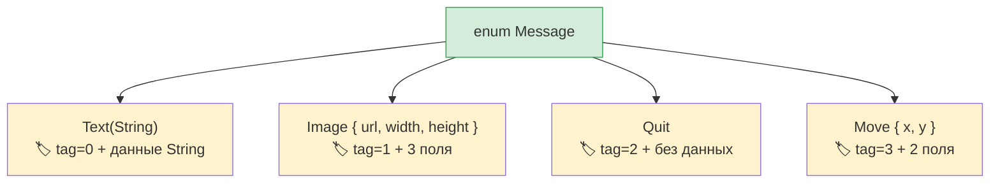

## Алгебраические типы данных и объединения типов

> **Что вы узнаете:** перечисления Rust с данными в сравнении с типами `Union` в Python, исчерпывающий `match` в сравнении с `match/case`, `Option<T>` как замену `None` на этапе компиляции и защитные условия (guards).
>
> **Сложность:** 🟡 Средний

Python 3.10 ввёл оператор `match` и объединения типов. Перечисления Rust идут дальше: каждый вариант может хранить собственные данные, а компилятор следит, чтобы обрабатывался каждый случай.

### Объединения типов и match в Python
```python
# Python 3.10+ — структурное сопоставление с образцом
from typing import Union
from dataclasses import dataclass

@dataclass
class Circle:
    radius: float

@dataclass
class Rectangle:
    width: float
    height: float

@dataclass
class Triangle:
    base: float
    height: float

Shape = Union[Circle, Rectangle, Triangle]  # Псевдоним типа

def area(shape: Shape) -> float:
    match shape:
        case Circle(radius=r):
            return 3.14159 * r * r
        case Rectangle(width=w, height=h):
            return w * h
        case Triangle(base=b, height=h):
            return 0.5 * b * h
        # Компилятор не предупредит, если вы что-то пропустите!
        # Добавляете новую фигуру? Остаётся надеяться, что вы нашли все блоки match через grep.
```

### Перечисления Rust с вариантами, которые хранят данные
```rust
// Rust — варианты перечисления хранят данные, компилятор требует исчерпывающего сопоставления
enum Shape {
    Circle(f64),                // Круг хранит радиус
    Rectangle(f64, f64),        // Прямоугольник хранит ширину и высоту
    Triangle { base: f64, height: f64 }, // Можно использовать и именованные поля
}

fn area(shape: &Shape) -> f64 {
    match shape {
        Shape::Circle(r) => std::f64::consts::PI * r * r,
        Shape::Rectangle(w, h) => w * h,
        Shape::Triangle { base, height } => 0.5 * base * height,
        // ❌ Если вы добавите Shape::Pentagon и забудете обработать его здесь,
        //    компилятор откажется собирать программу. grep не нужен.
    }
}
```

> **Ключевая мысль**: `match` в Rust — **исчерпывающий**: компилятор проверяет, что вы обработали каждый вариант. Добавьте новый вариант в перечисление, и компилятор точно укажет, в каких блоках `match` его нужно учесть. У `match` в Python такой гарантии нет.

### Перечисления заменяют несколько паттернов Python

```python
# Python — несколько паттернов, которые заменяют перечисления Rust:

# 1. Строковые константы
STATUS_PENDING = "pending"
STATUS_ACTIVE = "active"
STATUS_CLOSED = "closed"

# 2. Перечисление Python (без данных)
from enum import Enum
class Status(Enum):
    PENDING = "pending"
    ACTIVE = "active"
    CLOSED = "closed"

# 3. Теговые объединения (класс + поле типа)
class Message:
    def __init__(self, kind, **data):
        self.kind = kind
        self.data = data
# Message(kind="text", content="hello")
# Message(kind="image", url="...", width=100)
```

```rust
// Rust — одно перечисление заменяет все три и даже больше

// 1. Простое перечисление (как Enum в Python)
enum Status {
    Pending,
    Active,
    Closed,
}

// 2. Перечисление с данными (теговое объединение, с проверкой типов!)
enum Message {
    Text(String),
    Image { url: String, width: u32, height: u32 },
    Quit,                    // Без данных
    Move { x: i32, y: i32 },
}
```



> **Наблюдение о памяти**: перечисления Rust — это «помеченные объединения» (tagged unions): компилятор хранит дискриминант-тег и место под самый большой вариант. У Python-аналога (`Union[str, dict, None]`) компактного представления нет.
>
> 📌 **См. также**: [Гл. 9 — Обработка ошибок](ch09-error-handling.md) широко использует перечисления: `Result<T, E>` и `Option<T>` — это просто перечисления и `match`.

```rust
fn process(msg: &Message) {
    match msg {
        Message::Text(content) => println!("Текст: {content}"),
        Message::Image { url, width, height } => {
            println!("Изображение: {url} ({width}x{height})")
        }
        Message::Quit => println!("Выход"),
        Message::Move { x, y } => println!("Перемещение в ({x}, {y})"),
    }
}
```

***

## Исчерпывающее сопоставление с образцом

### match в Python — не исчерпывающий
```python
# Python — случай-«заглушка» необязателен, помощи компилятора нет
def describe(value):
    match value:
        case 0:
            return "zero"
        case 1:
            return "one"
        # Если вы забудете default, Python молча вернёт None.
        # Ни предупреждения, ни ошибки.

describe(42)  # Возвращает None — молчаливая ошибка
```

### match в Rust — проверяется компилятором
```rust
// Rust — ОБЯЗАТЕЛЬНО обработать каждый возможный случай
fn describe(value: i32) -> &'static str {
    match value {
        0 => "zero",
        1 => "one",
        // ❌ Ошибка компиляции: паттерны не исчерпывающие: `i32::MIN..=-1_i32`
        //    и `2_i32..=i32::MAX` не покрыты
        _ => "other",   // _ = «ловушка» для всех остальных значений (обязательна для типов с открытым множеством значений)
    }
}

// Для перечислений «ловушка» НЕ нужна — компилятор знает все варианты:
enum Color { Red, Green, Blue }

fn color_hex(c: Color) -> &'static str {
    match c {
        Color::Red => "#ff0000",
        Color::Green => "#00ff00",
        Color::Blue => "#0000ff",
        // _ не нужен — все варианты покрыты
        // Добавите Color::Yellow позже → ошибка компиляции ЗДЕСЬ
    }
}
```

### Возможности сопоставления с образцом
```rust
// Несколько значений (как case 1 | 2 | 3: в Python)
match value {
    1 | 2 | 3 => println!("маленькое"),
    4..=9 => println!("среднее"),    // Диапазоны
    _ => println!("большое"),
}

// Защитные условия (guards, как case x if x > 0: в Python)
match temperature {
    t if t > 100 => println!("кипение"),
    t if t < 0 => println!("ниже нуля"),
    t => println!("норма: {t}°"),
}

// Вложенная деструктуризация
let point = (3, (4, 5));
match point {
    (0, _) => println!("на оси Y"),
    (_, (0, _)) => println!("y=0"),
    (x, (y, z)) => println!("x={x}, y={y}, z={z}"),
}
```

***

## Option для безопасной работы с None

`Option<T>` — самое важное перечисление Rust для разработчиков на Python. Оно заменяет `None` безопасной по типам альтернативой.

### None в Python

```python
# Python — None — это значение, которое может появиться где угодно
def find_user(user_id: int) -> dict | None:
    users = {1: {"name": "Alice"}}
    return users.get(user_id)

user = find_user(999)
# user — None, но ничто не заставляет вас проверить это!
print(user["name"])  # 💥 TypeError во время выполнения
```

### Option в Rust

```rust
// Rust — Option<T> заставляет обработать случай None
fn find_user(user_id: i64) -> Option<User> {
    let users = HashMap::from([(1, User { name: "Alice".into() })]);
    users.get(&user_id).cloned()
}

let user = find_user(999);
// user имеет тип Option<User> — НЕЛЬЗЯ использовать его, не обработав None

// Способ 1: match
match find_user(999) {
    Some(user) => println!("Найден: {}", user.name),
    None => println!("Не найден"),
}

// Способ 2: if let (как if (x := expr) is not None в Python)
if let Some(user) = find_user(1) {
    println!("Найден: {}", user.name);
}

// Способ 3: unwrap_or
let name = find_user(999)
    .map(|u| u.name)
    .unwrap_or_else(|| "Unknown".to_string());

// Способ 4: оператор ? (в функциях, которые возвращают Option)
fn get_user_name(id: i64) -> Option<String> {
    let user = find_user(id)?;     // Досрочно возвращает None, если пользователь не найден
    Some(user.name)
}
```

### Методы Option: аналоги в Python

| Задача | Python | Rust |
|--------|--------|------|
| Проверка наличия | `if x is not None:` | `if let Some(x) = opt {` |
| Значение по умолчанию | `x or default` | `opt.unwrap_or(default)` |
| Фабрика значения по умолчанию | `x or compute()` | `opt.unwrap_or_else(\|\| compute())` |
| Преобразование, если значение есть | `f(x) if x else None` | `opt.map(f)` |
| Цепочка обращений | `x and x.attr and x.attr.method()` | `opt.and_then(\|x\| x.method())` |
| Падение при None | Нельзя предотвратить | `opt.unwrap()` (паника) или `opt.expect("msg")` |
| Получить значение или выбросить ошибку | `x if x else raise` | `opt.ok_or(Error)?` |

---

## Упражнения

<details>
<summary><strong>🏋️ Упражнение: калькулятор площади фигур</strong> (нажмите, чтобы раскрыть)</summary>

**Задание**: определите перечисление `Shape` с вариантами `Circle(f64)` (радиус), `Rectangle(f64, f64)` (ширина, высота) и `Triangle(f64, f64)` (основание, высота). Реализуйте метод `fn area(&self) -> f64` с использованием `match`. Создайте по одной фигуре каждого вида и выведите их площади.

<details>
<summary>🔑 Решение</summary>

```rust
use std::f64::consts::PI;

enum Shape {
    Circle(f64),
    Rectangle(f64, f64),
    Triangle(f64, f64),
}

impl Shape {
    fn area(&self) -> f64 {
        match self {
            Shape::Circle(r) => PI * r * r,
            Shape::Rectangle(w, h) => w * h,
            Shape::Triangle(b, h) => 0.5 * b * h,
        }
    }
}

fn main() {
    let shapes = [
        Shape::Circle(5.0),
        Shape::Rectangle(4.0, 6.0),
        Shape::Triangle(3.0, 8.0),
    ];
    for shape in &shapes {
        println!("Площадь: {:.2}", shape.area());
    }
}
```

**Ключевой вывод**: перечисления Rust заменяют `Union[Circle, Rectangle, Triangle]` и проверки `isinstance()` в Python. Компилятор следит, чтобы обрабатывался каждый вариант: добавление новой фигуры без обновления `area()` — ошибка компиляции.

</details>
</details>

***

