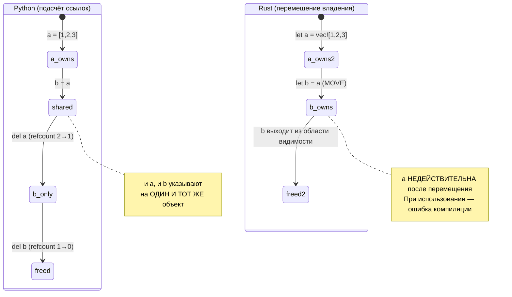
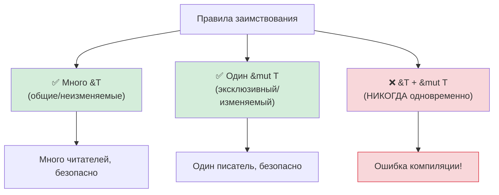

## Понимание владения

> **Что вы узнаете:** зачем в Rust нужно владение (без GC!), семантику перемещения в сравнении с подсчётом ссылок в Python, заимствование (`&` и `&mut`), основы времён жизни и умные указатели (`Box`, `Rc`, `Arc`).
>
> **Сложность:** 🟡 Средний

Это самая трудная концепция для разработчиков на Python. В Python вы никогда не задумываетесь о том, кто «владеет» данными: этим занимается сборщик мусора. В Rust у каждого значения ровно один владелец, и компилятор отслеживает это на этапе компиляции.

### Python: повсюду разделяемые ссылки
```python
# Python — всё является ссылкой, сборщик мусора всё очищает
a = [1, 2, 3]
b = a              # b и a указывают на ОДИН И ТОТ ЖЕ список
b.append(4)
print(a)            # [1, 2, 3, 4] — сюрприз! a тоже изменился

# Кто владеет списком? Обе переменные ссылаются на него.
# Сборщик мусора освободит его, когда не останется ссылок.
# Об этом вы никогда не задумываетесь.
```

### Rust: единоличное владение
```rust
// Rust — у каждого значения ровно ОДИН владелец
let a = vec![1, 2, 3];
let b = a;           // Владение ПЕРЕМЕЩАЕТСЯ из a в b
// println!("{:?}", a); // ❌ Ошибка компиляции: значение использовано после перемещения

// a больше не существует. b — единственный владелец.
println!("{:?}", b); // ✅ [1, 2, 3]

// Когда b выходит из области видимости, Vec освобождается. Детерминированно. Без GC.
```

### Три правила владения
```rust
1. У каждого значения ровно ОДНА переменная-владелец.
2. Когда владелец выходит из области видимости, значение уничтожается (освобождается).
3. Владение можно передать (переместить), но нельзя продублировать (если тип не реализует Clone).
```

### Семантика перемещения: самый большой шок для Python
```python
# Python — присваивание копирует ссылку, а не данные
def process(data):
    data.append(42)
    # Исходный список изменён!

my_list = [1, 2, 3]
process(my_list)
print(my_list)       # [1, 2, 3, 42] — изменён функцией process!
```

```rust
// Rust — передача в функцию ПЕРЕМЕЩАЕТ владение (для типов, не реализующих Copy)
fn process(mut data: Vec<i32>) -> Vec<i32> {
    data.push(42);
    data  // Нужно вернуть его, чтобы вернуть владение!
}

let my_vec = vec![1, 2, 3];
let my_vec = process(my_vec);  // Владение уходит внутрь и возвращается обратно
println!("{:?}", my_vec);      // [1, 2, 3, 42]

// Или лучше — заимствовать вместо перемещения:
fn process_borrowed(data: &mut Vec<i32>) {
    data.push(42);
}

let mut my_vec = vec![1, 2, 3];
process_borrowed(&mut my_vec);  // Временно одалживаем
println!("{:?}", my_vec);       // [1, 2, 3, 42] — по-прежнему наш
```

### Владение в наглядном виде
```text
Python:                              Rust:

  a ──────┐                           a ──→ [1, 2, 3]
           ├──→ [1, 2, 3]
  b ──────┘                           После: let b = a;

  (a и b делят один объект)           a  (недействительна, перемещена)
  (refcount = 2)                      b ──→ [1, 2, 3]
                                      (владеет данными только b)

  del a → refcount = 1                drop(b) → данные освобождены
  del b → refcount = 0 → освобождено  (детерминированно, без GC)
```



***

## Семантика перемещения и подсчёт ссылок

### Копирование и перемещение
```rust
// Простые типы (целые, числа с плавающей точкой, bool, char) КОПИРУЮТСЯ, а не перемещаются
let x = 42;
let y = x;    // x КОПИРУЕТСЯ в y (оба остаются действительными)
println!("{x} {y}");  // ✅ 42 42

// Типы, размещённые в куче (String, Vec, HashMap), ПЕРЕМЕЩАЮТСЯ
let s1 = String::from("hello");
let s2 = s1;  // s1 ПЕРЕМЕЩАЕТСЯ в s2
// println!("{s1}");  // ❌ Ошибка: значение использовано после перемещения

// Чтобы явно скопировать данные из кучи, используйте .clone()
let s1 = String::from("hello");
let s2 = s1.clone();  // Глубокая копия
println!("{s1} {s2}");  // ✅ hello hello (оба действительны)
```

### Ментальная модель разработчика на Python
```text
Python:                    Rust:
─────────                  ─────
int, float, bool           Копируемые типы (i32, f64, bool, char)
→ общие ссылки на          → побитовое копирование при присваивании
  неизменяемые объекты       (всегда независимые значения)
  (настоящей копии нет)    (Примечание: Python кэширует малые int; копии в Rust всегда предсказуемы)

list, dict, str            Типы с перемещением (Vec, HashMap, String)
→ общая ссылка             → передача владения (поведение другое!)
→ сборщик мусора очищает   → владелец уничтожает данные
→ копия через list(x)      → копия через x.clone()
   или copy.deepcopy(x)
```

### Когда модель совместного использования в Python приводит к ошибкам

```python
# Python — случайное создание псевдонимов
def remove_duplicates(items):
    seen = set()
    result = []
    for item in items:
        if item not in seen:
            seen.add(item)
            result.append(item)
    return result

original = [1, 2, 2, 3, 3, 3]
alias = original          # Псевдоним, НЕ копия
unique = remove_duplicates(alias)
# original по-прежнему [1, 2, 2, 3, 3, 3] — но только потому, что мы его не меняли
# Если бы remove_duplicates изменял входные данные, original тоже пострадал бы
```

```rust
use std::collections::HashSet;

// Rust — владение предотвращает случайное создание псевдонимов
fn remove_duplicates(items: &[i32]) -> Vec<i32> {
    let mut seen = HashSet::new();
    items.iter()
        .filter(|&&item| seen.insert(item))
        .copied()
        .collect()
}

let original = vec![1, 2, 2, 3, 3, 3];
let unique = remove_duplicates(&original); // Заимствование — изменить нельзя
// original гарантированно не изменится — компилятор запретил мутацию через &
```

***

## Заимствование и времена жизни

### Заимствование = одолжить книгу
```rust
Представьте владение как физическую книгу:

Python:  У каждого есть фотокопия (общие ссылки + GC)
Rust:    Книга принадлежит одному человеку. Остальные могут:
         - &book     = посмотреть (неизменяемое заимствование, таких может быть много)
         - &mut book = писать в ней (изменяемое заимствование, эксклюзивное)
         - book      = отдать её (перемещение)
```

### Правила заимствования



```rust
// Правило 1: можно иметь МНОГО неизменяемых заимствований ИЛИ ОДНО изменяемое (но не оба сразу)

let mut data = vec![1, 2, 3];

// Несколько неизменяемых заимствований — допустимо
let a = &data;
let b = &data;
println!("{:?} {:?}", a, b);  // ✅

// Изменяемое заимствование — должно быть эксклюзивным
let c = &mut data;
c.push(4);
// println!("{:?}", a);  // ❌ Ошибка: нельзя использовать неизменяемое заимствование, пока существует изменяемое

// Так гонки данных предотвращаются на этапе компиляции!
// В Python аналога нет: именно поэтому изменение словаря во время итерации приводит к падению во время выполнения.
```

### Времена жизни: краткое введение
```rust
// Времена жизни отвечают на вопрос: «Как долго живёт эта ссылка?»
// Обычно компилятор выводит их сам. Вы редко пишете их явно.

// Простой случай — компилятор справляется сам:
fn first_word(s: &str) -> &str {
    s.split_whitespace().next().unwrap_or("")
}
// Компилятор знает: возвращаемый &str живёт столько же, сколько входной &str

// Когда нужны явные времена жизни (редко):
fn longest<'a>(a: &'a str, b: &'a str) -> &'a str {
    if a.len() > b.len() { a } else { b }
}
// 'a означает: «возвращаемое значение живёт, пока живут оба входных параметра»
```

> **Для разработчиков на Python**: поначалу не беспокойтесь о временах жизни. Компилятор сам скажет, когда они понадобятся, а в 95% случаев он выводит их автоматически. Думайте об аннотациях времён жизни как о подсказках, которые вы даёте компилятору, когда он не может сам разобраться в связях.

***

## Умные указатели

Там, где единоличного владения недостаточно, Rust предоставляет умные указатели. Они ближе к модели ссылок Python, но явные и включаются осознанно.

```rust
// Box<T> — выделение в куче с одним владельцем (как обычное выделение памяти в Python)
let boxed = Box::new(42);  // i32 в куче

// Rc<T> — подсчёт ссылок (как refcount в Python!)
use std::rc::Rc;
let shared = Rc::new(vec![1, 2, 3]);
let clone1 = Rc::clone(&shared);  // Увеличиваем счётчик ссылок
let clone2 = Rc::clone(&shared);  // Увеличиваем счётчик ссылок
// Все три указывают на один Vec. Когда все они уничтожены, Vec освобождается.
// Похоже на подсчёт ссылок в Python, но Rc НЕ обрабатывает циклы —
// используйте Weak<T>, чтобы разрывать циклы (сборщик мусора Python обрабатывает циклы автоматически)

// Arc<T> — атомарный подсчёт ссылок (Rc для многопоточного кода)
use std::sync::Arc;
let thread_safe = Arc::new(vec![1, 2, 3]);
// Используйте Arc, когда данные разделяются между потоками (Rc — только для одного потока)

// RefCell<T> — проверка заимствований во время выполнения (как модель «всё можно» в Python)
use std::cell::RefCell;
let cell = RefCell::new(42);
*cell.borrow_mut() = 99;  // Изменяемое заимствование во время выполнения (паника при двойном заимствовании)
```

### Когда что использовать

| Умный указатель | Аналог в Python | Сценарий использования |
|-----------------|-----------------|------------------------|
| `Box<T>` | Обычное выделение памяти | Большие данные, рекурсивные типы, трейт-объекты |
| `Rc<T>` | Стандартный подсчёт ссылок Python | Общее владение, один поток |
| `Arc<T>` | Потокобезопасный подсчёт ссылок | Общее владение, несколько потоков |
| `RefCell<T>` | Модель «просто меняй» в Python | Внутренняя изменяемость (запасной люк) |
| `Rc<RefCell<T>>` | Обычная объектная модель Python | Общие и изменяемые данные (графовые структуры) |

> **Ключевая мысль**: `Rc<RefCell<T>>` даёт семантику, похожую на Python (общие, изменяемые данные), но включать её нужно явно. Принятое в Rust по умолчанию владение с перемещением быстрее и не несёт накладных расходов на подсчёт ссылок. Для графоподобных структур с циклами используйте `Weak<T>`, чтобы разрывать циклы ссылок: в отличие от Python, у `Rc` в Rust нет сборщика циклов.

> 📌 **См. также**: [Гл. 13 — Конкурентность](ch13-concurrency.md) описывает `Arc<Mutex<T>>` для общего состояния в многопоточном коде.

---

## Упражнения

<details>
<summary><strong>🏋️ Упражнение: найдите ошибку заимствования</strong> (нажмите, чтобы раскрыть)</summary>

**Задание**: в следующем коде есть 3 ошибки borrow checker. Найдите каждую и исправьте их, не используя `.clone()`:

```rust
fn main() {
    let mut names = vec!["Alice".to_string(), "Bob".to_string()];
    let first = &names[0];
    names.push("Charlie".to_string());
    println!("First: {first}");

    let greeting = make_greeting(names[0]);
    println!("{greeting}");
}

fn make_greeting(name: String) -> String {
    format!("Hello, {name}!")
}
```

<details>
<summary>🔑 Решение</summary>

```rust
fn main() {
    let mut names = vec!["Alice".to_string(), "Bob".to_string()];
    let first = &names[0];
    println!("First: {first}"); // Используем заимствование ДО изменения
    names.push("Charlie".to_string()); // Теперь безопасно — живого неизменяемого заимствования нет

    let greeting = make_greeting(&names[0]); // Передаём ссылку, а не владение
    println!("{greeting}");
}

fn make_greeting(name: &str) -> String { // Принимаем &str, а не String
    format!("Hello, {name}!")
}
```

**Исправленные ошибки**:
1. **Неизменяемое заимствование и изменение**: `first` заимствует `names`, а затем `push` его изменяет. Исправление: использовать `first` до `push`.
2. **Перемещение из Vec**: `names[0]` пытается переместить String из Vec, а это запрещено. Исправление: заимствовать через `&names[0]`.
3. **Функция забирает владение**: `make_greeting(String)` потребляет значение. Исправление: принимать `&str`.

</details>
</details>

***

