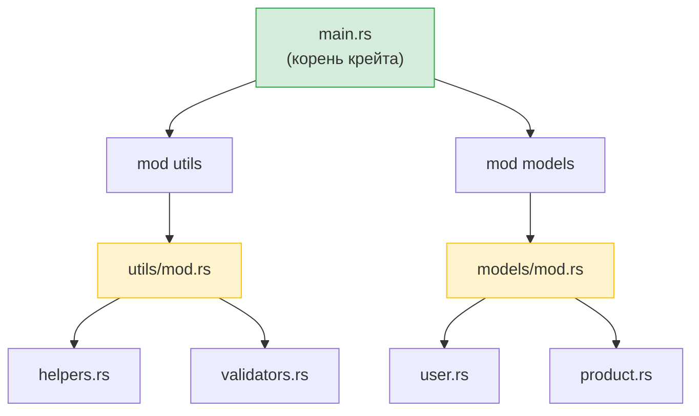

## Модули Rust и пакеты Python

> **Что вы узнаете:** `mod` и `use` в сравнении с `import`, видимость (`pub`) в сравнении с приватностью Python, основанной на соглашениях, Cargo.toml в сравнении с pyproject.toml, crates.io в сравнении с PyPI, а также рабочие пространства в сравнении с монорепозиториями.
>
> **Сложность:** 🟢 Начальный

### Система модулей Python
```python
# Python — файлы являются модулями, каталоги с __init__.py — пакетами

# myproject/
# ├── __init__.py          # Делает каталог пакетом
# ├── main.py
# ├── utils/
# │   ├── __init__.py      # Делает utils подпакетом
# │   ├── helpers.py
# │   └── validators.py
# └── models/
#     ├── __init__.py
#     ├── user.py
#     └── product.py

# Импорт:
from myproject.utils.helpers import format_name
from myproject.models.user import User
import myproject.utils.validators as validators
```

### Система модулей Rust
```rust
// Rust — объявления mod создают дерево модулей, файлы содержат код

// src/
// ├── main.rs             # Корень крейта — объявляет модули
// ├── utils/
// │   ├── mod.rs           # Объявление модуля (как __init__.py)
// │   ├── helpers.rs
// │   └── validators.rs
// └── models/
//     ├── mod.rs
//     ├── user.rs
//     └── product.rs

// В src/main.rs:
mod utils;       // Говорит Rust искать src/utils/mod.rs
mod models;      // Говорит Rust искать src/models/mod.rs

use utils::helpers::format_name;
use models::user::User;

// В src/utils/mod.rs:
pub mod helpers;      // Объявляет модуль helpers из helpers.rs и делает его публичным
pub mod validators;   // Объявляет модуль validators из validators.rs и делает его публичным
```



> **Аналог в Python**: думайте о `mod.rs` как о `__init__.py`: он объявляет, что экспортирует модуль. Корень крейта (`main.rs` / `lib.rs`) похож на `__init__.py` вашего верхнеуровневого пакета.

### Ключевые различия

| Понятие | Python | Rust |
|---------|--------|------|
| Модуль = файл | ✅ Автоматически | Нужно объявить через `mod` |
| Пакет = каталог | `__init__.py` | `mod.rs` |
| Публично по умолчанию | ✅ Всё | ❌ По умолчанию приватно |
| Сделать публичным | Соглашение с префиксом `_` | Ключевое слово `pub` |
| Синтаксис импорта | `from x import y` | `use x::y;` |
| Импорт всего | `from x import *` | `use x::*;` (не рекомендуется) |
| Относительный импорт | `from . import sibling` | `use super::sibling;` |
| Реэкспорт | `__all__` или явно | `pub use inner::Thing;` |

### Видимость: приватно по умолчанию
```python
# Python — «здесь все взрослые»
class User:
    def __init__(self):
        self.name = "Alice"       # Публичное (по соглашению)
        self._age = 30            # «Приватное» (соглашение: одно подчёркивание)
        self.__secret = "тсс"     # Искажённое имя (не по-настоящему приватное)

# Ничто не мешает обратиться к _age или даже к __secret
print(user._age)                  # Работает
print(user._User__secret)        # Тоже работает (искажение имён)
```

```rust
// Rust — приватность гарантируется компилятором
pub struct User {
    pub name: String,      // Публичное — доступно всем
    age: i32,              // Приватное — доступно только этому модулю
}

impl User {
    pub fn new(name: &str, age: i32) -> Self {
        User { name: name.to_string(), age }
    }

    pub fn age(&self) -> i32 {   // Публичный геттер
        self.age
    }

    fn validate(&self) -> bool { // Приватный метод
        self.age > 0
    }
}

// Снаружи модуля:
let user = User::new("Alice", 30);
println!("{}", user.name);        // ✅ Публичное
// println!("{}", user.age);      // ❌ Ошибка компиляции: поле приватное
println!("{}", user.age());       // ✅ Публичный метод (геттер)
```

***

## Крейты и пакеты PyPI

### Пакеты Python (PyPI)
```bash
# Python
pip install requests           # Установка из PyPI
pip install "requests>=2.28"   # Ограничение версии
pip freeze > requirements.txt  # Зафиксировать версии
pip install -r requirements.txt # Воссоздать окружение
```

### Крейты Rust (crates.io)
```bash
# Rust
cargo add reqwest              # Установка из crates.io (добавляет в Cargo.toml)
cargo add reqwest@0.12         # Ограничение версии
# Cargo.lock создаётся автоматически, никаких ручных действий
cargo build                    # Загружает и компилирует зависимости
```

### Cargo.toml и pyproject.toml
```toml
# Rust — Cargo.toml
[package]
name = "my-project"
version = "0.1.0"
edition = "2021"

[dependencies]
serde = { version = "1.0", features = ["derive"] }  # С флагами функций
reqwest = { version = "0.12", features = ["json"] }
tokio = { version = "1", features = ["full"] }
log = "0.4"

[dev-dependencies]
mockall = "0.13"
```

### Основные крейты для разработчиков на Python

| Библиотека Python | Крейт Rust | Назначение |
|-------------------|------------|------------|
| `requests` | `reqwest` | HTTP-клиент |
| `json` (stdlib) | `serde_json` | Разбор JSON |
| `pydantic` | `serde` | Сериализация и валидация |
| `pathlib` | `std::path` (stdlib) | Работа с путями |
| `os` / `shutil` | `std::fs` (stdlib) | Операции с файлами |
| `re` | `regex` | Регулярные выражения |
| `logging` | `tracing` / `log` | Логирование |
| `click` / `argparse` | `clap` | Разбор аргументов CLI |
| `asyncio` | `tokio` | Асинхронный рантайм |
| `datetime` | `chrono` | Дата и время |
| `pytest` | Встроенное + `rstest` | Тестирование |
| `dataclasses` | `#[derive(...)]` | Структуры данных |
| `typing.Protocol` | Трейты | Структурная типизация |
| `subprocess` | `std::process` (stdlib) | Запуск внешних команд |
| `sqlite3` | `rusqlite` | SQLite |
| `sqlalchemy` | `diesel` / `sqlx` | ORM / инструментарий SQL |
| `fastapi` | `axum` / `actix-web` | Веб-фреймворк |

***

## Рабочие пространства и монорепозитории

### Монорепозиторий Python (типичный)
```text
# Монорепозиторий Python (разные подходы, стандарта нет)
myproject/
├── pyproject.toml           # Корневой проект
├── packages/
│   ├── core/
│   │   ├── pyproject.toml   # У каждого пакета своя конфигурация
│   │   └── src/core/...
│   ├── api/
│   │   ├── pyproject.toml
│   │   └── src/api/...
│   └── cli/
│       ├── pyproject.toml
│       └── src/cli/...
# Инструменты: poetry workspaces, pip -e ., uv workspaces — стандарта нет
```

### Рабочее пространство Rust
```toml
# Rust — Cargo.toml в корне
[workspace]
members = [
    "core",
    "api",
    "cli",
]

# Общие зависимости для всего рабочего пространства
[workspace.dependencies]
serde = { version = "1.0", features = ["derive"] }
tokio = { version = "1", features = ["full"] }
```

```text
# Структура рабочего пространства Rust — стандартизирована, встроена в Cargo
myproject/
├── Cargo.toml               # Корень рабочего пространства
├── Cargo.lock               # Единый lock-файл для всех крейтов
├── core/
│   ├── Cargo.toml            # [dependencies] serde.workspace = true
│   └── src/lib.rs
├── api/
│   ├── Cargo.toml
│   └── src/lib.rs
└── cli/
    ├── Cargo.toml
    └── src/main.rs
```

```bash
# Команды рабочего пространства
cargo build                  # Собрать всё
cargo test                   # Протестировать всё
cargo build -p core          # Собрать только крейт core
cargo test -p api            # Протестировать только крейт api
cargo clippy --all           # Проверить линтером всё
```

> **Ключевая мысль**: рабочие пространства в Rust — полноценная возможность, встроенная в Cargo. Монорепозиториям Python нужны сторонние инструменты (poetry, uv, pants) с разным уровнем поддержки. В рабочем пространстве Rust все крейты используют один `Cargo.lock`, что обеспечивает согласованные версии зависимостей во всём проекте.

---

## Упражнения

<details>
<summary><strong>🏋️ Упражнение: видимость модулей</strong> (нажмите, чтобы раскрыть)</summary>

**Задание**: для этой структуры модулей предскажите, какие строки компилируются, а какие нет:

```rust
mod kitchen {
    fn secret_recipe() -> &'static str { "42 специи" }
    pub fn menu() -> &'static str { "Фирменное блюдо дня" }

    pub mod staff {
        pub fn cook() -> String {
            format!("Готовим с помощью {}", super::secret_recipe())
        }
    }
}

fn main() {
    println!("{}", kitchen::menu());             // Строка A
    println!("{}", kitchen::secret_recipe());     // Строка B
    println!("{}", kitchen::staff::cook());       // Строка C
}
```

<details>
<summary>🔑 Решение</summary>

- **Строка A**: ✅ Компилируется: `menu()` объявлена как `pub`
- **Строка B**: ❌ Ошибка компиляции: `secret_recipe()` приватна для `kitchen`
- **Строка C**: ✅ Компилируется: `staff::cook()` объявлена как `pub`, а `cook()` может обращаться к `secret_recipe()` через `super::` (дочерние модули видят приватные элементы родителя)

**Ключевой вывод**: в Rust дочерние модули видят приватные элементы родителя (как соглашение `_private` в Python, но с гарантией компилятора). Посторонние — нет. Это противоположность Python, где `_private` — лишь подсказка.

</details>
</details>

***

