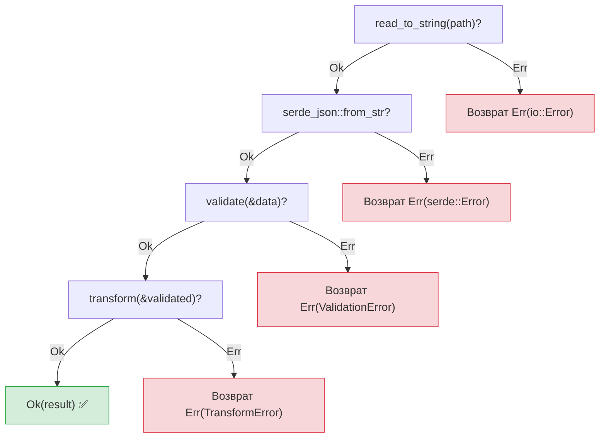
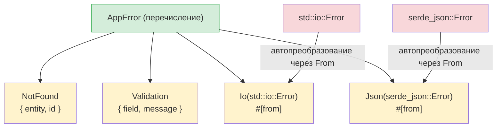

## Исключения и Result

> **Что вы узнаете:** `Result<T, E>` в сравнении с `try`/`except`, оператор `?` для краткой передачи ошибок, собственные типы ошибок с `thiserror`, `anyhow` для приложений и то, почему явные ошибки предотвращают скрытые баги.
>
> **Сложность:** 🟡 Средний

Для разработчиков на Python это одна из самых больших смен мышления. Python использует исключения: ошибку можно выбросить откуда угодно и перехватить где угодно (или не перехватывать вовсе). Rust использует `Result<T, E>`: ошибки — это значения, которые нужно явно обработать.

### Обработка исключений в Python
```python
# Python — исключения могут быть выброшены откуда угодно
import json

def load_config(path: str) -> dict:
    try:
        with open(path) as f:
            data = json.load(f)     # Может выбросить JSONDecodeError
            if "version" not in data:
                raise ValueError("Отсутствует поле version")
            return data
    except FileNotFoundError:
        print(f"Файл конфигурации не найден: {path}")
        return {}
    except json.JSONDecodeError as e:
        print(f"Некорректный JSON: {e}")
        return {}
    # Какие ещё исключения может выбросить эта функция?
    # IOError? PermissionError? UnicodeDecodeError?
    # По сигнатуре функции этого не понять!
```

### Обработка ошибок через Result в Rust
```rust
// Rust — ошибки являются возвращаемыми значениями, видимыми в сигнатуре функции
use std::fs;
use serde_json::Value;

fn load_config(path: &str) -> Result<Value, ConfigError> {
    let contents = fs::read_to_string(path)    // Возвращает Result
        .map_err(|e| ConfigError::FileError(e.to_string()))?;

    let data: Value = serde_json::from_str(&contents)  // Возвращает Result
        .map_err(|e| ConfigError::ParseError(e.to_string()))?;

    if data.get("version").is_none() {
        return Err(ConfigError::MissingField("version".to_string()));
    }

    Ok(data)
}

#[derive(Debug)]
enum ConfigError {
    FileError(String),
    ParseError(String),
    MissingField(String),
}
```

### Ключевые различия

```text
Python:                                 Rust:
─────────                               ─────
- Ошибки — это исключения (выбрасываются)   - Ошибки — это значения (возвращаются)
- Скрытый поток управления (раскрутка стека) - Явный поток управления (оператор ?)
- По сигнатуре не понять, какие ошибки      - Ошибки ОБЯЗАНЫ быть видны в типе возврата
- Необработанные исключения роняют программу в рантайме - Необработанные Result дают предупреждения компилятора (их всегда нужно обрабатывать)
- try/except необязательны                 - Обработка Result обязательна
- Широкий except ловит всё                 - Ветки match исчерпывающие
```

### Два варианта Result
```rust
// У Result<T, E> ровно два варианта:
enum Result<T, E> {
    Ok(T),    // Успех — содержит значение (как return в Python)
    Err(E),   // Неудача — содержит ошибку (как выброшенное исключение в Python)
}

// Использование Result:
fn divide(a: f64, b: f64) -> Result<f64, String> {
    if b == 0.0 {
        Err("Деление на ноль".to_string())  // Как: raise ValueError("...")
    } else {
        Ok(a / b)                             // Как: return a / b
    }
}

// Обработка Result — как try/except, только явная
match divide(10.0, 0.0) {
    Ok(result) => println!("Результат: {result}"),
    Err(msg) => println!("Ошибка: {msg}"),
}
```

***

## Оператор ?

Оператор `?` — это аналог в Rust того, что исключения всплывают вверх по стеку вызовов, только он виден и явен.

### Python: неявное распространение
```python
# Python — исключения тихо всплывают вверх по стеку вызовов
def read_username() -> str:
    with open("config.txt") as f:      # FileNotFoundError всплывает
        return f.readline().strip()    # IOError всплывает

def greet():
    name = read_username()             # Если здесь выброшено исключение, greet() тоже его выбросит
    print(f"Привет, {name}!")          # При ошибке эта строка пропускается

# Распространение ошибок НЕВИДИМО — чтобы узнать, какие исключения могут выйти наружу,
# нужно читать реализацию.
```

### Rust: явное распространение с помощью ?
```rust
// Rust — ? передаёт ошибки дальше, и это видно и в коде, и в сигнатуре
use std::fs;
use std::io;

fn read_username() -> Result<String, io::Error> {
    let contents = fs::read_to_string("config.txt")?;  // ? = передать дальше при Err
    Ok(contents.lines().next().unwrap_or("").to_string())
}

fn greet() -> Result<(), io::Error> {
    let name = read_username()?;       // ? = если Err, сразу вернуть Err
    println!("Привет, {name}!");        // Достигается только при Ok
    Ok(())
}

// ? означает: «если здесь Err, немедленно вернуть его ИЗ ЭТОЙ функции».
// Это похоже на распространение исключений в Python, но:
// 1. Это видно (вы видите ?)
// 2. Это есть в типе возврата (Result<..., io::Error>)
// 3. Компилятор следит, чтобы ошибка была обработана где-то
```

### Цепочки с ?
```python
# Python — несколько операций, которые могут завершиться ошибкой
def process_file(path: str) -> dict:
    with open(path) as f:                    # Может завершиться ошибкой
        text = f.read()                       # Может завершиться ошибкой
    data = json.loads(text)                   # Может завершиться ошибкой
    validate(data)                            # Может завершиться ошибкой
    return transform(data)                    # Может завершиться ошибкой
    # Любая из них может выбросить исключение, и тип исключения у каждой свой!
```

```rust
// Rust — та же цепочка, но явная
fn process_file(path: &str) -> Result<Data, AppError> {
    let text = fs::read_to_string(path)?;     // ? передаёт io::Error дальше
    let data: Value = serde_json::from_str(&text)?;  // ? передаёт ошибку serde дальше
    let validated = validate(&data)?;          // ? передаёт ошибку валидации дальше
    let result = transform(&validated)?;       // ? передаёт ошибку преобразования дальше
    Ok(result)
}
// Каждый ? — это потенциальный досрочный возврат, и все они видны!
```



> Каждый `?` — это точка выхода. В отличие от try/except в Python, где без чтения документации не видно, какая строка может выбросить исключение.
>
> 📌 **См. также**: [Гл. 15 — Паттерны миграции](ch15-migration-patterns.md) рассказывает о переводе паттернов try/except из Python на Rust в реальных проектах.

***

## Собственные типы ошибок с thiserror



> Атрибут `#[from]` автоматически генерирует `impl From<io::Error> for AppError`, поэтому `?` сам превращает ошибки библиотек в ошибки вашего приложения.

### Собственные исключения в Python
```python
# Python — собственные классы исключений
class AppError(Exception):
    pass

class NotFoundError(AppError):
    def __init__(self, entity: str, id: int):
        self.entity = entity
        self.id = id
        super().__init__(f"{entity} с id {id} не найден")

class ValidationError(AppError):
    def __init__(self, field: str, message: str):
        self.field = field
        super().__init__(f"Ошибка валидации поля {field}: {message}")

# Использование:
def find_user(user_id: int) -> dict:
    if user_id not in users:
        raise NotFoundError("Пользователь", user_id)
    return users[user_id]
```

### Собственные ошибки в Rust с thiserror
```rust
// Rust — перечисления ошибок с thiserror (самый популярный подход)
// Cargo.toml: thiserror = "2"

use thiserror::Error;

#[derive(Debug, Error)]
enum AppError {
    #[error("{entity} с id {id} не найден")]
    NotFound { entity: String, id: i64 },

    #[error("Ошибка валидации поля {field}: {message}")]
    Validation { field: String, message: String },

    #[error("Ошибка ввода-вывода: {0}")]
    Io(#[from] std::io::Error),        // Автопреобразование из io::Error

    #[error("Ошибка JSON: {0}")]
    Json(#[from] serde_json::Error),   // Автопреобразование из ошибки serde
}

// Использование:
fn find_user(user_id: i64) -> Result<User, AppError> {
    users.get(&user_id)
        .cloned()
        .ok_or(AppError::NotFound {
            entity: "Пользователь".to_string(),
            id: user_id,
        })
}

// Атрибут #[from] означает, что ? автоматически преобразует io::Error в AppError::Io
fn load_users(path: &str) -> Result<Vec<User>, AppError> {
    let data = fs::read_to_string(path)?;  // io::Error → AppError::Io автоматически
    let users: Vec<User> = serde_json::from_str(&data)?;  // → AppError::Json
    Ok(users)
}
```

### Краткая справка по обработке ошибок

| Python | Rust | Примечания |
|--------|------|------------|
| `raise ValueError("msg")` | `return Err(AppError::Validation {...})` | Явный возврат |
| `try: ... except:` | `match result { Ok(v) => ..., Err(e) => ... }` | Исчерпывающе |
| `except ValueError as e:` | `Err(AppError::Validation { .. }) =>` | Сопоставление с образцом |
| `raise ... from e` | Атрибут `#[from]` или `.map_err()` | Цепочка ошибок |
| `finally:` | Трейт `Drop` (автоматически) | Детерминированная очистка |
| `with open(...):` | Освобождение по области видимости (автоматически) | Паттерн RAII |
| Исключение распространяется молча | `?` распространяет явно | Всегда в типе возврата |
| `isinstance(e, ValueError)` | `matches!(e, AppError::Validation {..})` | Проверка типа |

---

## Упражнения

<details>
<summary><strong>🏋️ Упражнение: разбор значения конфигурации</strong> (нажмите, чтобы раскрыть)</summary>

**Задание**: напишите функцию `parse_port(s: &str) -> Result<u16, String>`, которая:
1. Отклоняет пустые строки с ошибкой `"пустой ввод"`
2. Разбирает строку в `u16`, преобразуя ошибку разбора в `"некорректное число: {исходная_ошибка}"`
3. Отклоняет порты ниже 1024 с ошибкой `"порт {n} привилегированный"`

Вызовите её с `""`, `"hello"`, `"80"` и `"8080"` и выведите результаты.

<details>
<summary>🔑 Решение</summary>

```rust
fn parse_port(s: &str) -> Result<u16, String> {
    if s.is_empty() {
        return Err("пустой ввод".to_string());
    }
    let port: u16 = s.parse().map_err(|e| format!("некорректное число: {e}"))?;
    if port < 1024 {
        return Err(format!("порт {port} привилегированный"));
    }
    Ok(port)
}

fn main() {
    for input in ["", "hello", "80", "8080"] {
        match parse_port(input) {
            Ok(port) => println!("✅ {input} → {port}"),
            Err(e) => println!("❌ {input:?} → {e}"),
        }
    }
}
```

**Ключевой вывод**: `?` вместе с `.map_err()` — это аналог в Rust конструкции `try/except ValueError as e: raise ConfigError(...) from e`. Каждый путь ошибки виден в типе возврата.

</details>
</details>

***

