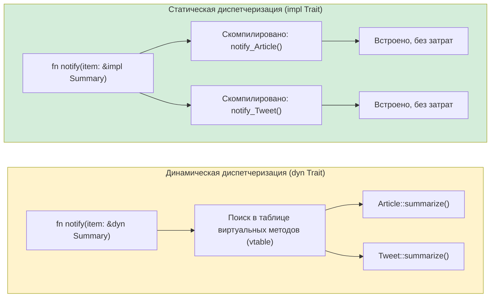

## Трейты и утиная типизация

> **Что вы узнаете:** трейты как явные контракты (в отличие от утиной типизации Python), `Protocol` (PEP 544) ≈ трейт, ограничения обобщений через предложения `where`, трейт-объекты (`dyn Trait`) в сравнении со статической диспетчеризацией и распространённые трейты стандартной библиотеки.
>
> **Сложность:** 🟡 Средний

Именно здесь система типов Rust по-настоящему раскрывается для разработчиков на Python. Утиная типизация Python говорит: «если это ходит как утка и крякает как утка, значит, это утка». Трейты Rust говорят: «я точно скажу, какое поведение утки мне нужно, и это будет проверено на этапе компиляции».

### Утиная типизация в Python
```python
# Python — утиная типизация: подходит всё, у чего есть нужные методы
def total_area(shapes):
    """Работает с любым объектом, у которого есть метод .area()."""
    return sum(shape.area() for shape in shapes)

class Circle:
    def __init__(self, radius): self.radius = radius
    def area(self): return 3.14159 * self.radius ** 2

class Rectangle:
    def __init__(self, w, h): self.w, self.h = w, h
    def area(self): return self.w * self.h

# Работает во время выполнения, наследование не нужно!
shapes = [Circle(5), Rectangle(3, 4)]
print(total_area(shapes))  # 90.54

# А что, если у объекта нет .area()?
class Dog:
    def bark(self): return "Гав!"

total_area([Dog()])  # 💥 AttributeError: 'Dog' has no attribute 'area'
# Ошибка возникает во ВРЕМЯ ВЫПОЛНЕНИЯ, а не при определении
```

### Трейты Rust: явная утиная типизация
```rust
// Rust — трейты делают контракт «утки» явным
trait HasArea {
    fn area(&self) -> f64;      // Любой тип, реализующий этот трейт, имеет .area()
}

struct Circle { radius: f64 }
struct Rectangle { width: f64, height: f64 }

impl HasArea for Circle {
    fn area(&self) -> f64 {
        std::f64::consts::PI * self.radius * self.radius
    }
}

impl HasArea for Rectangle {
    fn area(&self) -> f64 {
        self.width * self.height
    }
}

// Ограничение трейтом явное, компилятор проверяет его на этапе компиляции
fn total_area(shapes: &[&dyn HasArea]) -> f64 {
    shapes.iter().map(|s| s.area()).sum()
}

// Использование:
let shapes: Vec<&dyn HasArea> = vec![&Circle { radius: 5.0 }, &Rectangle { width: 3.0, height: 4.0 }];
println!("{}", total_area(&shapes));  // 90.54

// struct Dog;
// total_area(&[&Dog {}]);  // ❌ Ошибка компиляции: Dog не реализует HasArea
```

> **Ключевая мысль**: утиная типизация Python откладывает ошибки до времени выполнения. Трейты Rust ловят их на этапе компиляции. Гибкость та же, а ошибки обнаруживаются раньше.

***

## Протоколы (PEP 544) и трейты

Python 3.8 ввёл `Protocol` (PEP 544) для структурной типизации: это ближайшее к трейтам Rust понятие в Python.

### Protocol в Python
```python
# Python — Protocol (структурная типизация, как трейты Rust)
from typing import Protocol, runtime_checkable

@runtime_checkable
class Printable(Protocol):
    def to_string(self) -> str: ...

class User:
    def __init__(self, name: str):
        self.name = name
    def to_string(self) -> str:
        return f"User({self.name})"

class Product:
    def __init__(self, name: str, price: float):
        self.name = name
        self.price = price
    def to_string(self) -> str:
        return f"Product({self.name}, ${self.price:.2f})"

def print_all(items: list[Printable]) -> None:
    for item in items:
        print(item.to_string())

# Работает, потому что у User и Product есть to_string()
print_all([User("Alice"), Product("Widget", 9.99)])

# НО: mypy это проверяет, а среда выполнения Python — НЕТ
# print_all([42])  # mypy предупредит, но Python запустит это и упадёт
```

### Трейт Rust (аналог, но с принуждением!)
```rust
// Rust — трейты проверяются на этапе компиляции
trait Printable {
    fn to_string(&self) -> String;
}

struct User { name: String }
struct Product { name: String, price: f64 }

impl Printable for User {
    fn to_string(&self) -> String {
        format!("User({})", self.name)
    }
}

impl Printable for Product {
    fn to_string(&self) -> String {
        format!("Product({}, ${:.2})", self.name, self.price)
    }
}

fn print_all(items: &[&dyn Printable]) {
    for item in items {
        println!("{}", item.to_string());
    }
}

// print_all(&[&42i32]);  // ❌ Ошибка компиляции: i32 не реализует Printable
```

### Сравнительная таблица

| Свойство | Protocol в Python | Трейт Rust |
|----------|-------------------|------------|
| Структурная типизация | ✅ (неявно) | ❌ (нужен явный `impl`) |
| Когда проверяется | Во время выполнения (или mypy) | На этапе компиляции (всегда) |
| Реализации по умолчанию | ❌ | ✅ |
| Можно добавить к чужим типам | ❌ | ✅ (в определённых пределах) |
| Несколько протоколов | ✅ | ✅ (несколько трейтов) |
| Ассоциированные типы | ❌ | ✅ |
| Ограничения обобщений | ✅ (с `TypeVar`) | ✅ (ограничения трейтов) |

***

## Ограничения обобщений

### Обобщения в Python
```python
# Python — TypeVar для обобщённых функций
from typing import TypeVar, Sequence

T = TypeVar('T')

def first(items: Sequence[T]) -> T | None:
    return items[0] if items else None

# Ограниченный TypeVar
from typing import SupportsFloat
T = TypeVar('T', bound=SupportsFloat)

def average(items: Sequence[T]) -> float:
    return sum(float(x) for x in items) / len(items)
```

### Обобщения Rust с ограничениями трейтов
```rust
// Rust — обобщения с ограничениями трейтов
fn first<T>(items: &[T]) -> Option<&T> {
    items.first()
}

// С ограничениями трейтов — «T должен реализовывать эти трейты»
fn average<T>(items: &[T]) -> f64
where
    T: Into<f64> + Copy,   // T должен преобразовываться в f64 и быть копируемым
{
    let sum: f64 = items.iter().map(|&x| x.into()).sum();
    sum / items.len() as f64
}

// Несколько ограничений — «T должен реализовывать Display, Debug и Clone»
fn log_and_clone<T: std::fmt::Display + std::fmt::Debug + Clone>(item: &T) -> T {
    println!("Display: {}", item);
    println!("Debug: {:?}", item);
    item.clone()
}

// Краткая запись с impl Trait (для простых случаев)
fn print_it(item: &impl std::fmt::Display) {
    println!("{}", item);
}
```

### Краткая справка по обобщениям

| Python | Rust | Примечания |
|--------|------|------------|
| `TypeVar('T')` | `<T>` | Обобщённый тип без ограничений |
| `TypeVar('T', bound=X)` | `<T: X>` | Обобщённый тип с ограничением |
| `Union[int, str]` | `enum` или трейт-объект | В Rust нет объединений типов |
| `Sequence[T]` | `&[T]` (срез) | Заимствованная последовательность |
| `Callable[[A], R]` | `Fn(A) -> R` | Трейт функции |
| `Optional[T]` | `Option<T>` | Встроено в язык |

***

## Распространённые трейты стандартной библиотеки

Это аналоги «магических методов» Python в Rust: они определяют, как типы ведут себя в типичных ситуациях.

### Display и Debug (вывод)
```rust
use std::fmt;

// Debug — как __repr__ (можно получить через derive)
#[derive(Debug)]
struct Point { x: f64, y: f64 }
// Теперь можно: println!("{:?}", point);

// Display — как __str__ (реализуется вручную)
impl fmt::Display for Point {
    fn fmt(&self, f: &mut fmt::Formatter<'_>) -> fmt::Result {
        write!(f, "({}, {})", self.x, self.y)
    }
}
// Теперь можно: println!("{}", point);
```

### Трейты сравнения
```rust
// PartialEq — как __eq__
// Eq — полное равенство (f64 реализует PartialEq, но не Eq, потому что NaN != NaN)
// PartialOrd — как __lt__, __le__ и т. д.
// Ord — полный порядок

#[derive(Debug, PartialEq, Eq, PartialOrd, Ord, Hash, Clone)]
struct Student {
    name: String,
    grade: i32,
}

// Теперь студентов можно сравнивать, сортировать, использовать как ключи HashMap и клонировать
let mut students = vec![
    Student { name: "Charlie".into(), grade: 85 },
    Student { name: "Alice".into(), grade: 92 },
];
students.sort();  // Использует Ord: сортирует по имени, затем по оценке (порядок полей структуры)
```

### Трейт Iterator
```rust
// Реализация Iterator — как __iter__/__next__ в Python
struct Countdown { value: i32 }

impl Iterator for Countdown {
    type Item = i32;       // Что выдаёт итератор

    fn next(&mut self) -> Option<Self::Item> {
        if self.value > 0 {
            self.value -= 1;
            Some(self.value + 1)
        } else {
            None             // Итерация завершена
        }
    }
}

// Использование:
for n in (Countdown { value: 5 }) {
    println!("{n}");  // 5, 4, 3, 2, 1
}
```

### Общие трейты в одном взгляде

| Трейт Rust | Аналог в Python | Назначение |
|------------|-----------------|------------|
| `Display` | `__str__` | Человекочитаемая строка |
| `Debug` | `__repr__` | Отладочная строка (можно получить через derive) |
| `Clone` | `copy.deepcopy` | Глубокая копия |
| `Copy` | (автокопирование int/float) | Неявное копирование простых типов |
| `PartialEq` / `Eq` | `__eq__` | Сравнение на равенство |
| `PartialOrd` / `Ord` | `__lt__` и др. | Упорядочивание |
| `Hash` | `__hash__` | Хешируемость (для ключей dict) |
| `Default` | Значения по умолчанию в `__init__` | Значения по умолчанию |
| `From` / `Into` | Перегрузки `__init__` | Преобразования типов |
| `Iterator` | `__iter__` / `__next__` | Итерация |
| `Drop` | `__del__` / `__exit__` | Очистка |
| `Add`, `Sub`, `Mul` | `__add__`, `__sub__`, `__mul__` | Перегрузка операторов |
| `Index` | `__getitem__` | Индексация через `[]` |
| `Deref` | (аналога нет) | Разыменование умных указателей |
| `Send` / `Sync` | (аналога нет) | Маркеры потокобезопасности |



> **Аналог в Python**: Python *всегда* использует динамическую диспетчеризацию (`getattr` во время выполнения). Rust по умолчанию использует статическую диспетчеризацию (мономорфизацию: компилятор генерирует специализированный код для каждого конкретного типа). `dyn Trait` используйте только тогда, когда нужен полиморфизм во время выполнения.
>
> 📌 **См. также**: [Гл. 11 — Трейты From и Into](ch11-from-and-into-traits.md) подробно описывает трейты преобразования (`From`, `Into`, `TryFrom`).

### Ассоциированные типы

Трейты Rust могут определять *ассоциированные типы*: заполнители типов, которые заполняет каждая реализация. У Python нет аналога:

```rust
// Iterator определяет ассоциированный тип 'Item'
trait Iterator {
    type Item;
    fn next(&mut self) -> Option<Self::Item>;
}

struct Countdown { remaining: u32 }

impl Iterator for Countdown {
    type Item = u32;  // Этот итератор выдаёт значения u32
    fn next(&mut self) -> Option<u32> {
        if self.remaining > 0 {
            self.remaining -= 1;
            Some(self.remaining)
        } else {
            None
        }
    }
}
```

В Python `__iter__` / `__next__` возвращают `Any`: нельзя объявить «этот итератор выдаёт `int`» и получить принудительную проверку (подсказки типов `Iterator[int]` носят лишь рекомендательный характер).

### Перегрузка операторов: `__add__` → `impl Add`

Python использует магические методы (`__add__`, `__mul__`). Rust использует реализации трейтов: та же идея, но с проверкой типов на этапе компиляции:

```python
# Python
class Vec2:
    def __init__(self, x, y):
        self.x, self.y = x, y
    def __add__(self, other):
        return Vec2(self.x + other.x, self.y + other.y)  # Нет проверки типа 'other'
```

```rust
use std::ops::Add;

#[derive(Debug, Clone, Copy)]
struct Vec2 { x: f64, y: f64 }

impl Add for Vec2 {
    type Output = Vec2;  // Ассоциированный тип: что возвращает +?
    fn add(self, rhs: Vec2) -> Vec2 {
        Vec2 { x: self.x + rhs.x, y: self.y + rhs.y }
    }
}

let a = Vec2 { x: 1.0, y: 2.0 };
let b = Vec2 { x: 3.0, y: 4.0 };
let c = a + b;  // Безопасно по типам: допускается только Vec2 + Vec2
```

Ключевое отличие: `__add__` в Python принимает *любой* `other` во время выполнения (типы приходится проверять вручную или получить `TypeError`). Трейт `Add` в Rust проверяет типы операндов на этапе компиляции: `Vec2 + i32` — ошибка компиляции, если вы явно не напишете `impl Add<i32> for Vec2`.

---

## Упражнения

<details>
<summary><strong>🏋️ Упражнение: обобщённый трейт Summary</strong> (нажмите, чтобы раскрыть)</summary>

**Задание**: определите трейт `Summary` с методом `fn summarize(&self) -> String`. Реализуйте его для двух структур: `Article { title: String, body: String }` и `Tweet { username: String, content: String }`. Затем напишите функцию `fn notify(item: &impl Summary)`, которая выводит сводку.

<details>
<summary>🔑 Решение</summary>

```rust
trait Summary {
    fn summarize(&self) -> String;
}

struct Article { title: String, body: String }
struct Tweet { username: String, content: String }

impl Summary for Article {
    fn summarize(&self) -> String {
        format!("{} — {}...", self.title, &self.body[..20.min(self.body.len())])
    }
}

impl Summary for Tweet {
    fn summarize(&self) -> String {
        format!("@{}: {}", self.username, self.content)
    }
}

fn notify(item: &impl Summary) {
    println!("📢 {}", item.summarize());
}

fn main() {
    let article = Article {
        title: "Rust is great".into(),
        body: "Here is why Rust beats Python for systems...".into(),
    };
    let tweet = Tweet {
        username: "rustacean".into(),
        content: "Just shipped my first crate!".into(),
    };
    notify(&article);
    notify(&tweet);
}
```

**Ключевой вывод**: `&impl Summary` — это аналог `Protocol` из Python с методом `summarize`. Но Rust проверяет это на этапе компиляции: передача типа, который не реализует `Summary`, — ошибка компиляции, а не `AttributeError` во время выполнения.

</details>
</details>

***

