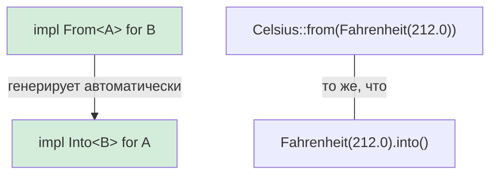

## Преобразование типов в Rust

> **Что вы узнаете:** трейты `From` и `Into` для преобразований без накладных расходов, `TryFrom` для преобразований, которые могут завершиться ошибкой, как `impl From<A> for B` автоматически создаёт `Into`, и паттерны преобразования строк.
>
> **Сложность:** 🟡 Средний

Python выполняет преобразования типов через вызовы конструкторов (`int("42")`, `str(42)`, `float("3.14")`). Rust использует трейты `From` и `Into` для типобезопасных преобразований.

### Преобразование типов в Python
```python
# Python — явные конструкторы для преобразований
x = int("42")           # str → int (может выбросить ValueError)
s = str(42)             # int → str
f = float("3.14")       # str → float
lst = list((1, 2, 3))   # tuple → list

# Собственное преобразование через __init__ или методы класса
class Celsius:
    def __init__(self, temp: float):
        self.temp = temp

    @classmethod
    def from_fahrenheit(cls, f: float) -> "Celsius":
        return cls((f - 32.0) * 5.0 / 9.0)

c = Celsius.from_fahrenheit(212.0)  # 100.0°C
```

### From/Into в Rust
```rust
// Rust — трейт From задаёт преобразования
// Реализация From<T> даёт вам Into<U> автоматически!

struct Celsius(f64);
struct Fahrenheit(f64);

impl From<Fahrenheit> for Celsius {
    fn from(f: Fahrenheit) -> Self {
        Celsius((f.0 - 32.0) * 5.0 / 9.0)
    }
}

// Теперь работают оба варианта:
let c1 = Celsius::from(Fahrenheit(212.0));    // Явный From
let c2: Celsius = Fahrenheit(212.0).into();   // Into (выводится автоматически)

// Преобразования строк:
let s: String = String::from("hello");         // &str → String
let s: String = "hello".to_string();           // То же самое
let s: String = "hello".into();                // Тоже работает (From реализован)

let num: i64 = 42i32.into();                   // i32 → i64 (без потерь, поэтому From есть)
// let small: i32 = 42i64.into();              // ❌ i64 → i32 может потерять данные, From нет

// Для преобразований, которые могут завершиться ошибкой, используйте TryFrom:
let n: Result<i32, _> = "42".parse();          // str → i32 (может завершиться ошибкой)
let n: i32 = "42".parse().unwrap();            // Паника, если это не число
let n: i32 = "42".parse()?;                    // Передать ошибку дальше с помощью ?
```

### Связь From и Into



> **Правило большого пальца**: всегда реализуйте `From`, а не `Into` напрямую. Реализация `From<A> for B` даёт вам `Into<B> for A` бесплатно.

***

### Когда использовать From/Into

```rust
// Реализуйте From<T> для своих типов, чтобы API было удобнее:

#[derive(Debug)]
struct UserId(i64);

impl From<i64> for UserId {
    fn from(id: i64) -> Self {
        UserId(id)
    }
}

// Теперь функции могут принимать всё, что можно преобразовать в UserId:
fn find_user(id: impl Into<UserId>) -> Option<String> {
    let user_id = id.into();
    // ... логика поиска
    Some(format!("User #{:?}", user_id))
}

find_user(42i64);              // ✅ i64 автоматически преобразуется в UserId
find_user(UserId(42));         // ✅ UserId остаётся как есть
```

***

## TryFrom: преобразования, которые могут завершиться ошибкой

Не все преобразования могут быть успешными. Python выбрасывает исключения; Rust использует `TryFrom`, который возвращает `Result`:

```python
# Python — преобразования, которые могут завершиться ошибкой, выбрасывают исключения
try:
    port = int("not_a_number")   # ValueError
except ValueError as e:
    print(f"Некорректно: {e}")

# Собственная валидация в __init__
class Port:
    def __init__(self, value: int):
        if not (1 <= value <= 65535):
            raise ValueError(f"Некорректный порт: {value}")
        self.value = value

try:
    p = Port(99999)  # ValueError во время выполнения
except ValueError:
    pass
```

```rust
use std::num::ParseIntError;

// TryFrom для встроенных типов
let n: Result<i32, ParseIntError> = "42".try_into();   // Ok(42)
let n: Result<i32, ParseIntError> = "bad".try_into();  // Err(...)

// Собственный TryFrom для валидации
#[derive(Debug)]
struct Port(u16);

#[derive(Debug)]
enum PortError {
    Zero,
}

impl TryFrom<u16> for Port {
    type Error = PortError;

    fn try_from(value: u16) -> Result<Self, Self::Error> {
        match value {
            0 => Err(PortError::Zero),
            1..=65535 => Ok(Port(value)),
        }
    }
}

impl std::fmt::Display for PortError {
    fn fmt(&self, f: &mut std::fmt::Formatter<'_>) -> std::fmt::Result {
        match self {
            PortError::Zero => write!(f, "порт не может быть нулём"),
        }
    }
}

// Использование:
let p: Result<Port, _> = 8080u16.try_into();   // Ok(Port(8080))
let p: Result<Port, _> = 0u16.try_into();       // Err(PortError::Zero)
```

> **Ментальная модель Python → Rust**: `TryFrom` — это `__init__`, который проверяет данные и может завершиться ошибкой. Но вместо выбрасывания исключения он возвращает `Result`, поэтому вызывающий код **обязан** обработать случай ошибки.

***

## Паттерны преобразования строк

Строки — самый частый источник путаницы при преобразованиях для разработчиков на Python:

```rust
// String → &str (заимствование, бесплатно)
let s = String::from("hello");
let r: &str = &s;              // Автоматическое приведение через Deref
let r: &str = s.as_str();     // Явно

// &str → String (выделение памяти, стоит ресурсов)
let r: &str = "hello";
let s1 = String::from(r);     // Трейт From
let s2 = r.to_string();       // Трейт ToString (через Display)
let s3: String = r.into();    // Трейт Into

// Число → String
let s = 42.to_string();       // "42" — как str(42) в Python
let s = format!("{:.2}", 3.14); // "3.14" — как f"{3.14:.2f}" в Python

// Строка → число
let n: i32 = "42".parse().unwrap();       // как int("42") в Python
let f: f64 = "3.14".parse().unwrap();     // как float("3.14") в Python

// Собственные типы → String (реализуйте Display)
use std::fmt;

struct Point { x: f64, y: f64 }

impl fmt::Display for Point {
    fn fmt(&self, f: &mut fmt::Formatter<'_>) -> fmt::Result {
        write!(f, "({}, {})", self.x, self.y)
    }
}

let p = Point { x: 1.0, y: 2.0 };
println!("{p}");                // (1, 2) — как __str__ в Python
let s = p.to_string();         // Тоже работает! Display даёт ToString бесплатно.
```

### Краткая справка по преобразованиям

| Python | Rust | Примечания |
|--------|------|------------|
| `str(x)` | `x.to_string()` | Требует реализации `Display` |
| `int("42")` | `"42".parse::<i32>()` | Возвращает `Result` |
| `float("3.14")` | `"3.14".parse::<f64>()` | Возвращает `Result` |
| `list(iter)` | `iter.collect::<Vec<_>>()` | Нужна аннотация типа |
| `dict(pairs)` | `pairs.collect::<HashMap<_,_>>()` | Нужна аннотация типа |
| `bool(x)` | Прямого аналога нет | Используйте явные проверки |
| `MyClass(x)` | `MyClass::from(x)` | Реализуйте `From<T>` |
| `MyClass(x)` (с валидацией) | `MyClass::try_from(x)?` | Реализуйте `TryFrom<T>` |

***

## Цепочки преобразований и обработка ошибок

В реальном коде часто встречаются цепочки из нескольких преобразований. Сравните подходы:

```python
# Python — цепочка преобразований с try/except
def parse_config(raw: str) -> tuple[str, int]:
    try:
        host, port_str = raw.split(":")
        port = int(port_str)
        if not (1 <= port <= 65535):
            raise ValueError(f"Некорректный порт: {port}")
        return (host, port)
    except (ValueError, AttributeError) as e:
        raise ConfigError(f"Некорректная конфигурация: {e}") from e
```

```rust
fn parse_config(raw: &str) -> Result<(String, u16), String> {
    let (host, port_str) = raw
        .split_once(':')
        .ok_or_else(|| "отсутствует разделитель ':'".to_string())?;

    let port: u16 = port_str
        .parse()
        .map_err(|e| format!("некорректный порт: {e}"))?;

    if port == 0 {
        return Err("порт не может быть нулём".to_string());
    }

    Ok((host.to_string(), port))
}

fn main() {
    match parse_config("localhost:8080") {
        Ok((host, port)) => println!("Подключение к {host}:{port}"),
        Err(e) => eprintln!("Ошибка конфигурации: {e}"),
    }
}
```

> **Ключевая мысль**: каждый `?` — это видимая точка выхода. В Python любая строка внутри `try` может оказаться той, что выбросит исключение, а в Rust ошибиться могут только строки, оканчивающиеся на `?`.
>
> 📌 **См. также**: [Гл. 9 — Обработка ошибок](ch09-error-handling.md) подробно описывает `Result`, `?` и собственные типы ошибок с `thiserror`.

---

## Упражнения

<details>
<summary><strong>🏋️ Упражнение: библиотека преобразования температур</strong> (нажмите, чтобы раскрыть)</summary>

**Задание**: создайте мини-библиотеку преобразования температур:
1. Определите структуры `Celsius(f64)`, `Fahrenheit(f64)` и `Kelvin(f64)`
2. Реализуйте `From<Celsius> for Fahrenheit` и `From<Celsius> for Kelvin`
3. Реализуйте `TryFrom<f64> for Kelvin`, который отклоняет значения ниже абсолютного нуля (-273.15°C = 0K)
4. Реализуйте `Display` для всех трёх типов (например, `"100.00°C"`)

<details>
<summary>🔑 Решение</summary>

```rust
use std::fmt;

struct Celsius(f64);
struct Fahrenheit(f64);
struct Kelvin(f64);

impl From<Celsius> for Fahrenheit {
    fn from(c: Celsius) -> Self {
        Fahrenheit(c.0 * 9.0 / 5.0 + 32.0)
    }
}

impl From<Celsius> for Kelvin {
    fn from(c: Celsius) -> Self {
        Kelvin(c.0 + 273.15)
    }
}

#[derive(Debug)]
struct BelowAbsoluteZero;

impl fmt::Display for BelowAbsoluteZero {
    fn fmt(&self, f: &mut fmt::Formatter<'_>) -> fmt::Result {
        write!(f, "температура ниже абсолютного нуля")
    }
}

impl TryFrom<f64> for Kelvin {
    type Error = BelowAbsoluteZero;

    fn try_from(value: f64) -> Result<Self, Self::Error> {
        if value < 0.0 {
            Err(BelowAbsoluteZero)
        } else {
            Ok(Kelvin(value))
        }
    }
}

impl fmt::Display for Celsius    { fn fmt(&self, f: &mut fmt::Formatter<'_>) -> fmt::Result { write!(f, "{:.2}°C", self.0) } }
impl fmt::Display for Fahrenheit { fn fmt(&self, f: &mut fmt::Formatter<'_>) -> fmt::Result { write!(f, "{:.2}°F", self.0) } }
impl fmt::Display for Kelvin     { fn fmt(&self, f: &mut fmt::Formatter<'_>) -> fmt::Result { write!(f, "{:.2}K",  self.0) } }

fn main() {
    let boiling = Celsius(100.0);
    let f: Fahrenheit = Celsius(100.0).into();
    let k: Kelvin = Celsius(100.0).into();
    println!("{boiling} = {f} = {k}");

    match Kelvin::try_from(-10.0) {
        Ok(k) => println!("{k}"),
        Err(e) => println!("Ошибка: {e}"),
    }
}
```

**Ключевой вывод**: `From` отвечает за преобразования, которые всегда успешны (Celsius → Fahrenheit работает всегда). `TryFrom` отвечает за те, которые могут не удаться (отрицательный Kelvin невозможен). Python смешивает оба варианта в `__init__`, а Rust делает различие явным в системе типов.

</details>
</details>

***

