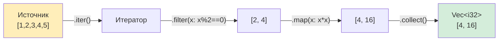

## Замыкания Rust и лямбды Python

> **Что вы узнаете:** многострочные замыкания (а не только однострочные лямбды), семантику захвата `Fn`/`FnMut`/`FnOnce`, цепочки итераторов в сравнении со списочными включениями, `map`/`filter`/`fold` и основы `macro_rules!`.
>
> **Сложность:** 🟡 Средний

### Замыкания и лямбды в Python
```python
# Python — лямбды это анонимные функции из одного выражения
double = lambda x: x * 2
result = double(5)  # 10

# Полноценные замыкания захватывают переменные из окружающей области видимости:
def make_adder(n):
    def adder(x):
        return x + n    # Захватывает `n` из внешней области видимости
    return adder

add_5 = make_adder(5)
print(add_5(10))  # 15

# Функции высшего порядка:
numbers = [1, 2, 3, 4, 5]
doubled = list(map(lambda x: x * 2, numbers))
evens = list(filter(lambda x: x % 2 == 0, numbers))
```

### Замыкания в Rust
```rust
// Rust — замыкания используют синтаксис |аргументы| тело
let double = |x: i32| x * 2;
let result = double(5);  // 10

// Замыкания захватывают переменные из окружающей области видимости:
fn make_adder(n: i32) -> impl Fn(i32) -> i32 {
    move |x| x + n    // `move` передаёт владение `n` внутрь замыкания
}

let add_5 = make_adder(5);
println!("{}", add_5(10));  // 15

// Функции высшего порядка с итераторами:
let numbers = vec![1, 2, 3, 4, 5];
let doubled: Vec<i32> = numbers.iter().map(|x| x * 2).collect();
let evens: Vec<i32> = numbers.iter().filter(|&&x| x % 2 == 0).copied().collect();
```

### Сравнение синтаксиса замыканий
```text
Python:                              Rust:
─────────                            ─────
lambda x: x * 2                      |x| x * 2
lambda x, y: x + y                   |x, y| x + y
lambda: 42                           || 42

# Многострочное
def f(x):                            |x| {
    y = x * 2                            let y = x * 2;
    return y + 1                         y + 1
                                      }
```

### Захват в замыканиях: чем отличается Rust
```python
# Python — замыкания захватывают по ссылке (позднее связывание!)
funcs = [lambda: i for i in range(3)]
print([f() for f in funcs])  # [2, 2, 2] — сюрприз! Все захватили один и тот же `i`

# Исправление через трюк со значением по умолчанию:
funcs = [lambda i=i: i for i in range(3)]
print([f() for f in funcs])  # [0, 1, 2]
```

```rust
// Rust — замыкания захватывают корректно (ловушки позднего связывания нет)
let funcs: Vec<Box<dyn Fn() -> i32>> = (0..3)
    .map(|i| Box::new(move || i) as Box<dyn Fn() -> i32>)
    .collect();

let results: Vec<i32> = funcs.iter().map(|f| f()).collect();
println!("{:?}", results);  // [0, 1, 2] — правильно!

// `move` захватывает КОПИЮ `i` для каждого замыкания, никаких сюрпризов позднего связывания.
```

### Три трейта замыканий
```rust
// Замыкания Rust реализуют один или несколько из этих трейтов:

// Fn — можно вызывать много раз, не изменяет захваченное (самый распространённый)
fn apply(f: impl Fn(i32) -> i32, x: i32) -> i32 { f(x) }

// FnMut — можно вызывать много раз, МОЖЕТ изменять захваченное
fn apply_mut(mut f: impl FnMut(i32) -> i32, x: i32) -> i32 { f(x) }

// FnOnce — можно вызвать ТОЛЬКО ОДИН раз (потребляет захваченное)
fn apply_once(f: impl FnOnce() -> String) -> String { f() }

// В Python аналога нет: замыкания всегда ведут себя как Fn.
// В Rust компилятор сам определяет, какой трейт использовать.
```

***

## Итераторы и генераторы

### Генераторы в Python
```python
# Python — генераторы с yield
def fibonacci():
    a, b = 0, 1
    while True:
        yield a
        a, b = b, a + b

# Ленивые: значения вычисляются по требованию
fib = fibonacci()
first_10 = [next(fib) for _ in range(10)]

# Генераторные выражения — как ленивые списочные включения
squares = (x ** 2 for x in range(1000000))  # Без выделения памяти
first_5 = [next(squares) for _ in range(5)]
```

### Итераторы Rust
```rust
// Rust — трейт Iterator (похожая концепция, другой синтаксис)
struct Fibonacci {
    a: u64,
    b: u64,
}

impl Fibonacci {
    fn new() -> Self {
        Fibonacci { a: 0, b: 1 }
    }
}

impl Iterator for Fibonacci {
    type Item = u64;

    fn next(&mut self) -> Option<Self::Item> {
        let current = self.a;
        self.a = self.b;
        self.b = current + self.b;
        Some(current)
    }
}

// Ленивые: значения вычисляются по требованию (как генераторы Python)
let first_10: Vec<u64> = Fibonacci::new().take(10).collect();

// Цепочки итераторов — как генераторные выражения
let squares: Vec<u64> = (0..1_000_000u64).map(|x| x * x).take(5).collect();
```

***

## Списочные включения и цепочки итераторов

Этот раздел сопоставляет синтаксис списочных включений Python с цепочками итераторов Rust.

### Списочные включения → map/filter/collect
```python
# Списочные включения в Python:
squares = [x ** 2 for x in range(10)]
evens = [x for x in range(20) if x % 2 == 0]
names = [user.name for user in users if user.active]
pairs = [(x, y) for x in range(3) for y in range(3)]
flat = [item for sublist in nested for item in sublist]
```



> **Ключевая мысль**: итераторы Rust ленивые: ничего не происходит до `.collect()`. Генераторы Python работают похоже, но списочные включения вычисляются сразу (энергично).

```rust
// Цепочки итераторов Rust:
let squares: Vec<i32> = (0..10).map(|x| x * x).collect();
let evens: Vec<i32> = (0..20).filter(|x| x % 2 == 0).collect();
let names: Vec<&str> = users.iter()
    .filter(|u| u.active)
    .map(|u| u.name.as_str())
    .collect();
let pairs: Vec<(i32, i32)> = (0..3)
    .flat_map(|x| (0..3).map(move |y| (x, y)))
    .collect();
let flat: Vec<i32> = nested.iter()
    .flat_map(|sublist| sublist.iter().copied())
    .collect();
```

### Словарное включение → collect в HashMap
```python
# Python
word_lengths = {word: len(word) for word in words}
inverted = {v: k for k, v in mapping.items()}
```

```rust
// Rust
let word_lengths: HashMap<&str, usize> = words.iter()
    .map(|w| (*w, w.len()))
    .collect();
let inverted: HashMap<&V, &K> = mapping.iter()
    .map(|(k, v)| (v, k))
    .collect();
```

### Включение множества → collect в HashSet
```python
# Python
unique_lengths = {len(word) for word in words}
```

```rust
// Rust
let unique_lengths: HashSet<usize> = words.iter()
    .map(|w| w.len())
    .collect();
```

### Частые методы итераторов

| Python | Rust | Примечания |
|--------|------|------------|
| `map(f, iter)` | `.map(f)` | Преобразует каждый элемент |
| `filter(f, iter)` | `.filter(f)` | Оставляет подходящие элементы |
| `sum(iter)` | `.sum()` | Суммирует все элементы |
| `min(iter)` / `max(iter)` | `.min()` / `.max()` | Возвращает `Option` |
| `any(f(x) for x in iter)` | `.any(f)` | True, если хотя бы один подходит |
| `all(f(x) for x in iter)` | `.all(f)` | True, если подходят все |
| `enumerate(iter)` | `.enumerate()` | Индекс и значение |
| `zip(a, b)` | `a.zip(b)` | Попарное объединение элементов |
| `len(list)` | `.count()` (потребляет итератор!) или `.len()` | Подсчёт элементов |
| `list(reversed(x))` | `.rev()` | Обратный обход |
| `itertools.chain(a, b)` | `a.chain(b)` | Соединение итераторов |
| `next(iter)` | `.next()` | Получить следующий элемент |
| `next(iter, default)` | `.next().unwrap_or(default)` | С значением по умолчанию |
| `list(iter)` | `.collect::<Vec<_>>()` | Материализация в коллекцию |
| `sorted(iter)` | Собрать, затем `.sort()` | Ленивого итератора сортировки нет |
| `functools.reduce(f, iter)` | `.fold(init, f)` или `.reduce(f)` | Накопление |

### Ключевые различия
```text
Итераторы Python:                     Итераторы Rust:
─────────────────                     ──────────────
- Ленивые по умолчанию (генераторы)   - Ленивые по умолчанию (все цепочки итераторов)
- yield создаёт генераторы            - impl Iterator { fn next() }
- StopIteration для завершения        - None для завершения
- Потребляются один раз               - Потребляются один раз
- Нет типовой безопасности            - Полностью типобезопасны
- Немного медленнее (интерпретатор)   - Без накладных расходов (компилируется)
```

***

<!-- ch12a: Macros -->
## Зачем нужны макросы в Rust

В Python нет системы макросов: для метапрограммирования используются декораторы, метаклассы и интроспекция во время выполнения. Rust использует макросы для генерации кода на этапе компиляции.

### Метапрограммирование в Python и макросы Rust
```python
# Python — декораторы и метаклассы для метапрограммирования
from dataclasses import dataclass
from functools import wraps

@dataclass              # Генерирует __init__, __repr__, __eq__ во время импорта
class Point:
    x: float
    y: float

# Собственный декоратор
def log_calls(func):
    @wraps(func)
    def wrapper(*args, **kwargs):
        print(f"Вызов {func.__name__}")
        return func(*args, **kwargs)
    return wrapper

@log_calls
def process(data):
    return data.upper()
```

```rust
// Rust — производные макросы и декларативные макросы для генерации кода
#[derive(Debug, Clone, PartialEq)]  // Генерирует реализации Debug, Clone, PartialEq на этапе КОМПИЛЯЦИИ
struct Point {
    x: f64,
    y: f64,
}

// Декларативный макрос (как шаблон)
macro_rules! log_call {
    ($func_name:expr, $body:expr) => {
        {
            println!("Вызов {}", $func_name);
            $body
        }
    };
}

fn process(data: &str) -> String {
    log_call!("process", data.to_uppercase())
}
```

### Частые встроенные макросы
```rust
// Эти макросы используются повсюду в Rust:

println!("Hello, {}!", name);           // Вывод с форматированием
format!("Value: {}", x);               // Создание форматированной String
vec![1, 2, 3];                          // Создание Vec
assert_eq!(2 + 2, 4);                  // Проверка равенства в тесте
assert!(value > 0, "должно быть положительным"); // Проверка логического условия
dbg!(expression);                       // Отладочный вывод: печатает выражение И его значение
todo!();                                // Заглушка: компилируется, но паникует при вызове
unimplemented!();                       // Отметить код как нереализованный
panic!("something went wrong");         // Аварийное завершение с сообщением (как raise RuntimeError)

// Почему это макросы, а не функции?
// - println! принимает переменное число аргументов (функции Rust не могут)
// - vec! генерирует код для любого типа и размера
// - assert_eq! знает ИСХОДНЫЙ КОД того, что сравнивалось
// - dbg! знает ИМЯ ФАЙЛА и НОМЕР СТРОКИ
```

## Пишем простой макрос с помощью macro_rules!
```rust
// Аналог dict() в Python
// Python: d = dict(a=1, b=2)
// Rust:   let d = hashmap!{ "a" => 1, "b" => 2 };

macro_rules! hashmap {
    ($($key:expr => $value:expr),* $(,)?) => {
        {
            let mut map = std::collections::HashMap::new();
            $(map.insert($key, $value);)*
            map
        }
    };
}

let scores = hashmap! {
    "Alice" => 100,
    "Bob" => 85,
    "Charlie" => 90,
};
```

## Производные макросы: автоматическая реализация трейтов
```rust
// #[derive(...)] — это аналог декоратора @dataclass в Python

// Python:
// @dataclass(frozen=True, order=True)
// class Student:
//     name: str
//     grade: int

// Rust:
#[derive(Debug, Clone, PartialEq, Eq, PartialOrd, Ord, Hash)]
struct Student {
    name: String,
    grade: i32,
}

// Частые производные макросы:
// Debug         → форматирование {:?} (как __repr__)
// Clone         → .clone(), глубокая копия
// Copy          → неявное копирование (только для простых типов)
// PartialEq, Eq → сравнение == (как __eq__)
// PartialOrd, Ord → <, >, сортировка (как __lt__ и др.)
// Hash          → можно использовать как ключ HashMap (как __hash__)
// Default       → MyType::default() (как __init__ без аргументов)

// Производные макросы из крейтов:
// Serialize, Deserialize (serde) → сериализация в JSON/YAML/TOML
//                                  (как json.dumps/loads в Python, но с проверкой типов)
```

### Декоратор Python и производный макрос Rust

| Декоратор Python | Производный макрос Rust | Назначение |
|------------------|-------------------------|------------|
| `@dataclass` | `#[derive(Debug, Clone, PartialEq)]` | Класс данных |
| `@dataclass(frozen=True)` | Неизменяемость по умолчанию | Неизменяемость |
| `@dataclass(order=True)` | `#[derive(Ord, PartialOrd)]` | Сравнение и сортировка |
| `@total_ordering` | `#[derive(PartialOrd, Ord)]` | Полный порядок |
| JSON `json.dumps(obj.__dict__)` | `#[derive(Serialize)]` | Сериализация |
| JSON `MyClass(**json.loads(s))` | `#[derive(Deserialize)]` | Десериализация |

---

## Упражнения

<details>
<summary><strong>🏋️ Упражнение: derive и собственный Debug</strong> (нажмите, чтобы раскрыть)</summary>

**Задание**: создайте структуру `User` с полями `name: String`, `email: String` и `password_hash: String`. Реализуйте `Clone` и `PartialEq` через derive, а `Debug` напишите вручную так, чтобы он выводил имя и email, а пароль скрывал (вместо него показывал `"***"`).

<details>
<summary>🔑 Решение</summary>

```rust
use std::fmt;

#[derive(Clone, PartialEq)]
struct User {
    name: String,
    email: String,
    password_hash: String,
}

impl fmt::Debug for User {
    fn fmt(&self, f: &mut fmt::Formatter<'_>) -> fmt::Result {
        f.debug_struct("User")
            .field("name", &self.name)
            .field("email", &self.email)
            .field("password_hash", &"***")
            .finish()
    }
}

fn main() {
    let user = User {
        name: "Alice".into(),
        email: "alice@example.com".into(),
        password_hash: "a1b2c3d4e5f6".into(),
    };
    println!("{user:?}");
    // Output: User { name: "Alice", email: "alice@example.com", password_hash: "***" }
}
```

**Ключевой вывод**: в отличие от `__repr__` в Python, Rust позволяет получить `Debug` через derive бесплатно, но его можно переопределить для чувствительных полей. Это безопаснее, чем в Python, где `print(user)` может случайно раскрыть секреты.

</details>
</details>

***

