## Нет GIL: настоящий параллелизм

> **Что вы узнаете:** почему GIL ограничивает конкурентность в Python, трейты `Send`/`Sync` Rust для проверки потокобезопасности на этапе компиляции, `Arc<Mutex<T>>` в сравнении с `threading.Lock` в Python, каналы в сравнении с `queue.Queue` и различия async/await.
>
> **Сложность:** 🔴 Продвинутый

GIL (Global Interpreter Lock, глобальная блокировка интерпретатора) — главное ограничение Python для задач, ограниченных CPU. В Rust GIL нет: потоки действительно работают параллельно, а система типов предотвращает гонки данных на этапе компиляции.

```mermaid
gantt
    title Работа, ограниченная CPU: GIL в Python против потоков Rust
    dateFormat X
    axisFormat %s
    section Python (GIL)
        Поток 1 :a1, 0, 4
        Поток 2 :a2, 4, 8
        Поток 3 :a3, 8, 12
        Поток 4 :a4, 12, 16
    section Rust (без GIL)
        Поток 1 :b1, 0, 4
        Поток 2 :b2, 0, 4
        Поток 3 :b3, 0, 4
        Поток 4 :b4, 0, 4
```



> **Ключевая мысль**: потоки Python при работе с CPU выполняются последовательно (GIL их сериализует). Потоки Rust действительно работают параллельно: 4 потока дают ускорение примерно в 4 раза.
>
> 📌 **Предварительное требование**: убедитесь, что вы освоили [Гл. 7 — Владение и заимствование](ch07-ownership-and-borrowing.md), прежде чем переходить к этой главе. `Arc`, `Mutex` и замыкания `move` опираются на понятия владения.

### Проблема GIL в Python
```python
# Python — потоки не помогают при работе, ограниченной CPU
import threading
import time

counter = 0

def increment(n):
    global counter
    for _ in range(n):
        counter += 1  # НЕ потокобезопасно! Но GIL как бы «защищает» простые операции

threads = [threading.Thread(target=increment, args=(1_000_000,)) for _ in range(4)]
start = time.perf_counter()
for t in threads:
    t.start()
for t in threads:
    t.join()
elapsed = time.perf_counter() - start

print(f"Счётчик: {counter}")    # Может быть не 4 000 000!
print(f"Время: {elapsed:.2f}s")  # Примерно ТАКОЕ ЖЕ время, как у одного потока (GIL)

# Для настоящего параллелизма в Python нужен multiprocessing:
from multiprocessing import Pool
with Pool(4) as pool:
    results = pool.map(cpu_work, data)  # Отдельные процессы, накладные расходы на pickle
```

### Rust: настоящий параллелизм и проверка на этапе компиляции
```rust
use std::sync::atomic::{AtomicI64, Ordering};
use std::sync::Arc;
use std::thread;

fn main() {
    let counter = Arc::new(AtomicI64::new(0));

    let handles: Vec<_> = (0..4).map(|_| {
        let counter = Arc::clone(&counter);
        thread::spawn(move || {
            for _ in 0..1_000_000 {
                counter.fetch_add(1, Ordering::Relaxed);
            }
        })
    }).collect();

    for h in handles {
        h.join().unwrap();
    }

    println!("Счётчик: {}", counter.load(Ordering::Relaxed)); // Всегда 4 000 000
    // Работает на ВСЕХ ядрах: настоящий параллелизм, без GIL
}
```

***

## Безопасность потоков: гарантии системы типов

### Python: ошибки во время выполнения
```python
# Python — гонки данных обнаруживаются во время выполнения (или не обнаруживаются вовсе)
import threading

shared_list = []

def append_items(items):
    for item in items:
        shared_list.append(item)  # «Потокобезопасно» благодаря GIL для append
        # Но сложные операции НЕ безопасны:
        # if item not in shared_list:
        #     shared_list.append(item)  # ГОНКА ДАННЫХ!

# Использование Lock для безопасности:
lock = threading.Lock()
def safe_append(items):
    for item in items:
        with lock:
            if item not in shared_list:
                shared_list.append(item)
# Забыли блокировку? Предупреждения компилятора не будет. Ошибка обнаружится в продакшене.
```

### Rust: ошибки на этапе компиляции
```rust
use std::sync::{Arc, Mutex};
use std::thread;

fn main() {
    // Попытка разделить Vec между потоками без защиты:
    // let shared = vec![];
    // thread::spawn(move || shared.push(1));
    // ❌ Ошибка компиляции: Vec не реализует Send/Sync без защиты

    // С Mutex (аналог threading.Lock в Rust):
    let shared = Arc::new(Mutex::new(Vec::new()));

    let handles: Vec<_> = (0..4).map(|i| {
        let shared = Arc::clone(&shared);
        thread::spawn(move || {
            let mut data = shared.lock().unwrap(); // Блокировка ОБЯЗАТЕЛЬНА для доступа
            data.push(i);
            // Блокировка автоматически освобождается, когда `data` выходит из области видимости
            // Нельзя «забыть разблокировать»: RAII гарантирует это
        })
    }).collect();

    for h in handles {
        h.join().unwrap();
    }

    println!("{:?}", shared.lock().unwrap()); // [0, 1, 2, 3] (порядок может отличаться)
}
```

### Трейты Send и Sync
```rust
// Rust использует два маркерных трейта для обеспечения потокобезопасности:

// Send — «этот тип можно передать в другой поток»
// Большинство типов — Send. Rc<T> — НЕТ (для потоков используйте Arc<T>).

// Sync — «на этот тип можно ссылаться из нескольких потоков»
// Большинство типов — Sync. Cell<T>/RefCell<T> — НЕТ (используйте Mutex<T>).

// Компилятор проверяет это автоматически:
// thread::spawn(move || { ... })
//   ↑ Захваченные замыканием значения должны быть Send
//   ↑ Общие ссылки должны быть Sync
//   ↑ Если нет, то ошибка компиляции

// У Python аналога нет. Ошибки потокобезопасности обнаруживаются во время выполнения.
// Rust ловит их на этапе компиляции. Это и есть «конкурентность без страха».
```

### Сравнение примитивов конкурентности

| Python | Rust | Назначение |
|--------|------|------------|
| `threading.Lock()` | `Mutex<T>` | Взаимное исключение |
| `threading.RLock()` | `Mutex<T>` (не реентерабельный) | Реентерабельная блокировка (используется иначе) |
| `threading.RWLock` (нет) | `RwLock<T>` | Много читателей ИЛИ один писатель |
| `threading.Event()` | `Condvar` | Условная переменная |
| `queue.Queue()` | `mpsc::channel()` | Потокобезопасный канал |
| `multiprocessing.Pool` | `rayon::ThreadPool` | Пул потоков |
| `concurrent.futures` | `rayon` / `tokio::spawn` | Параллелизм на основе задач |
| `threading.local()` | `thread_local!` | Локальное для потока хранилище |
| Нет | Типы `Atomic*` | Безблокировочные счётчики и флаги |

### Отравление мьютекса

Если поток **паникует**, удерживая `Mutex`, блокировка становится *отравленной* (poisoned). В Python аналога нет: если поток падает, удерживая `threading.Lock()`, блокировка остаётся захваченной навсегда.

```rust
use std::sync::{Arc, Mutex};
use std::thread;

let data = Arc::new(Mutex::new(vec![1, 2, 3]));
let data2 = Arc::clone(&data);

let _ = thread::spawn(move || {
    let mut guard = data2.lock().unwrap();
    guard.push(4);
    panic!("упс!");  // Блокировка теперь отравлена
}).join();

// Последующие попытки блокировки возвращают Err(PoisonError)
match data.lock() {
    Ok(guard) => println!("Данные: {guard:?}"),
    Err(poisoned) => {
        println!("Блокировка отравлена! Восстанавливаем...");
        let guard = poisoned.into_inner();
        println!("Восстановлено: {guard:?}");  // [1, 2, 3, 4]
    }
}
```

### Порядок атомарных операций (краткая заметка)

Параметр `Ordering` в атомарных операциях управляет гарантиями видимости памяти:

| Ordering | Когда использовать |
|----------|--------------------|
| `Relaxed` | Простые счётчики, где порядок не важен |
| `Acquire`/`Release` | Производитель-потребитель: писатель использует `Release`, читатель `Acquire` |
| `SeqCst` | Если сомневаетесь: самый строгий порядок, самый понятный |

Модуль `threading` в Python скрывает эти детали за GIL. В Rust вы выбираете явно: используйте `SeqCst`, пока профилирование не покажет, что нужно что-то послабее.

***

## Сравнение async/await

Python и Rust имеют синтаксис `async`/`await`, но внутри работают очень по-разному.

### async/await в Python
```python
# Python — asyncio для параллельного ввода-вывода
import asyncio
import aiohttp

async def fetch_url(session, url):
    async with session.get(url) as resp:
        return await resp.text()

async def main():
    urls = ["https://example.com", "https://httpbin.org/get"]

    async with aiohttp.ClientSession() as session:
        tasks = [fetch_url(session, url) for url in urls]
        results = await asyncio.gather(*tasks)

    for url, result in zip(urls, results):
        print(f"{url}: {len(result)} байт")

asyncio.run(main())

# Async в Python работает в одном потоке (всё ещё под GIL)!
# Помогает только при задачах, ограниченных вводом-выводом (ожидание сети или диска).
# Задачи, ограниченные CPU, внутри async всё равно блокируют цикл событий.
```

### async/await в Rust
```rust
// Rust — tokio для параллельного ввода-вывода (и параллелизма CPU!)
use reqwest;
use tokio;
use futures::future::join_all;  // добавьте `futures` в Cargo.toml

async fn fetch_url(url: &str) -> Result<String, reqwest::Error> {
    reqwest::get(url).await?.text().await
}

#[tokio::main]
async fn main() -> Result<(), Box<dyn std::error::Error>> {
    let urls = vec!["https://example.com", "https://httpbin.org/get"];

    let tasks: Vec<_> = urls.iter()
        .map(|url| tokio::spawn(fetch_url(url)))  // Без ограничений GIL
        .collect();                                 // Можно использовать все ядра CPU

    let results = futures::future::join_all(tasks).await;

    for (url, result) in urls.iter().zip(results) {
        match result {
            Ok(Ok(body)) => println!("{url}: {} байт", body.len()),
            Ok(Err(e)) => println!("{url}: ошибка {e}"),
            Err(e) => println!("{url}: задача завершилась с ошибкой {e}"),
        }
    }

    Ok(())
}
```

### Ключевые различия

| Аспект | Python asyncio | Rust tokio |
|--------|---------------|------------|
| GIL | Действует | Нет GIL |
| Параллелизм CPU | ❌ Один поток | ✅ Многопоточность |
| Рантайм | Встроен (asyncio) | Внешний крейт (tokio) |
| Экосистема | aiohttp, asyncpg и др. | reqwest, sqlx и др. |
| Производительность | Хорошо для I/O | Отлично и для I/O, и для CPU |
| Обработка ошибок | Исключения | `Result<T, E>` |
| Отмена | `task.cancel()` | Удалить future (drop) |
| «Проблема цвета» функций | Граница sync ↔ async | Та же проблема существует |

### Простой параллелизм с Rayon
```python
# Python — multiprocessing для параллелизма CPU
from multiprocessing import Pool

def process_item(item):
    return heavy_computation(item)

with Pool(8) as pool:
    results = pool.map(process_item, items)
```

```rust
// Rust — rayon для лёгкого параллелизма CPU (изменение одной строки!)
use rayon::prelude::*;

// Последовательно:
let results: Vec<_> = items.iter().map(|item| heavy_computation(item)).collect();

// Параллельно (замените .iter() на .par_iter(), и всё!):
let results: Vec<_> = items.par_iter().map(|item| heavy_computation(item)).collect();

// Без pickle, без накладных расходов на процессы, без сериализации.
// Rayon автоматически распределяет работу по ядрам.
```

---

## 💼 Кейс: параллельный конвейер обработки изображений

Команда специалистов по данным ежедневно обрабатывает 50 000 спутниковых снимков. Их конвейер на Python использует `multiprocessing.Pool`:

```python
# Python — multiprocessing для обработки изображений, ограниченной CPU
import multiprocessing
from PIL import Image
import numpy as np

def process_image(path: str) -> dict:
    img = np.array(Image.open(path))
    # Ресурсоёмкие операции: выравнивание гистограммы, выделение границ, классификация
    histogram = np.histogram(img, bins=256)[0]
    edges = detect_edges(img)       # ~200 мс на изображение
    label = classify(edges)          # ~100 мс на изображение
    return {"path": path, "label": label, "edge_count": len(edges)}

# Проблема: каждый подпроцесс копирует весь интерпретатор Python
# Память: 50 МБ на воркер × 16 воркеров = 800 МБ накладных расходов
# Запуск: 2–3 секунды на fork и pickle аргументов
with multiprocessing.Pool(16) as pool:
    results = pool.map(process_image, image_paths)  # ~4,5 часа на 50 тыс. изображений
```

**Болевые точки**: 800 МБ памяти на форк, сериализация pickle аргументов и результатов, GIL мешает использовать потоки, обработка ошибок непрозрачна (исключения в воркерах трудно отлаживать).

```rust
use rayon::prelude::*;
use image::GenericImageView;

struct ImageResult {
    path: String,
    label: String,
    edge_count: usize,
}

fn process_image(path: &str) -> Result<ImageResult, image::ImageError> {
    let img = image::open(path)?;
    // Специфичные для приложения функции (реализуйте под свою задачу)
    let histogram = compute_histogram(&img);       // ~50 мс (без накладных расходов numpy)
    let edges = detect_edges(&img);                // ~40 мс (оптимизировано через SIMD)
    let label = classify(&edges);                  // ~20 мс
    Ok(ImageResult {
        path: path.to_string(),
        label,
        edge_count: edges.len(),
    })
}

fn main() -> Result<(), Box<dyn std::error::Error>> {
    let paths: Vec<String> = load_image_paths()?;

    // Rayon автоматически использует все ядра CPU: без форка, без pickle, без GIL
    let results: Vec<ImageResult> = paths
        .par_iter()                                // Параллельный итератор
        .filter_map(|p| process_image(p).ok())     // Аккуратно пропускаем ошибки
        .collect();                                // Собираем параллельно

    println!("Обработано изображений: {}", results.len());
    Ok(())
}
// 50 тыс. изображений за ~35 минут (против 4,5 часа в Python)
// Память: ~50 МБ всего (общие потоки, без форка)
```

**Результаты**:

| Метрика | Python (multiprocessing) | Rust (rayon) |
|---------|--------------------------|--------------|
| Время (50 тыс. изображений) | ~4,5 часа | ~35 минут |
| Накладные расходы памяти | 800 МБ (16 воркеров) | ~50 МБ (общая) |
| Обработка ошибок | Непрозрачные ошибки pickle | `Result<T, E>` на каждом шаге |
| Стоимость запуска | 2–3 с (fork + pickle) | Нет (потоки) |

> **Ключевой урок**: для параллельной работы, ограниченной CPU, потоки Rust и rayon заменяют `multiprocessing` из Python без накладных расходов на сериализацию, с общей памятью и проверкой безопасности на этапе компиляции.

---

## Упражнения

<details>
<summary><strong>🏋️ Упражнение: потокобезопасный счётчик</strong> (нажмите, чтобы раскрыть)</summary>

**Задание**: в Python для защиты общего счётчика вы могли бы использовать `threading.Lock`. Перепишите это на Rust: запустите 10 потоков, каждый из которых 1000 раз увеличивает общий счётчик. Выведите итоговое значение (должно быть 10000). Используйте `Arc<Mutex<u64>>`.

<details>
<summary>🔑 Решение</summary>

```rust
use std::sync::{Arc, Mutex};
use std::thread;

fn main() {
    let counter = Arc::new(Mutex::new(0u64));
    let mut handles = vec![];

    for _ in 0..10 {
        let counter = Arc::clone(&counter);
        handles.push(thread::spawn(move || {
            for _ in 0..1000 {
                let mut num = counter.lock().unwrap();
                *num += 1;
            }
        }));
    }

    for handle in handles {
        handle.join().unwrap();
    }

    println!("Итоговый счёт: {}", *counter.lock().unwrap());
}
```

**Ключевой вывод**: `Arc<Mutex<T>>` — это аналог в Rust для `lock = threading.Lock()` плюс общая переменная, но Rust *не скомпилируется*, если вы забудете `Arc` или `Mutex`. Python спокойно запустит программу с гонкой и молча выдаст неверный ответ.

</details>
</details>

***

