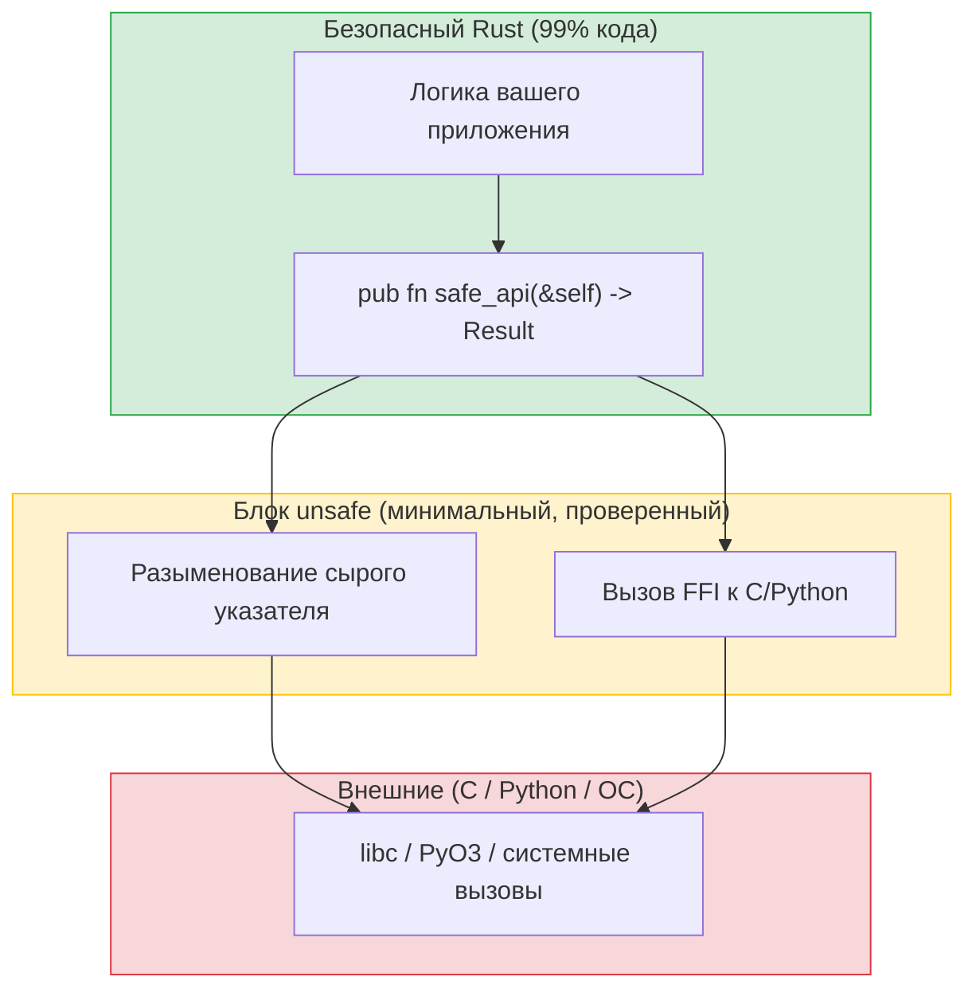

## Когда и зачем использовать unsafe

> **Что вы узнаете:** что разрешает `unsafe` и почему он существует, написание расширений Python на PyO3 (главная возможность для разработчиков на Python), систему тестирования Rust в сравнении с pytest, моки с помощью mockall и бенчмаркинг.
>
> **Сложность:** 🔴 Продвинутый

`unsafe` в Rust — это запасной люк: он сообщает компилятору «я делаю то, что ты не можешь проверить, но обещаю, что это корректно». У Python аналога нет, потому что Python никогда не даёт прямого доступа к памяти.



> **Схема**: безопасный API оборачивает небольшой блок `unsafe`. Вызывающий код никогда не видит `unsafe`. В `ctypes` Python такой границы нет: каждый вызов FFI неявно небезопасен.
>
> 📌 **См. также**: [Гл. 13 — Конкурентность](ch13-concurrency.md) описывает трейты `Send`/`Sync`, которые являются небезопасными автотрейтами, и компилятор проверяет их для потокобезопасности.

### Что разрешает unsafe
```rust
// unsafe позволяет делать ПЯТЬ вещей, которые запрещены в безопасном Rust:
// 1. Разыменовывать сырые указатели
// 2. Вызывать небезопасные функции и методы
// 3. Обращаться к изменяемым статическим переменным
// 4. Реализовывать небезопасные трейты
// 5. Обращаться к полям union

// Пример: вызов функции из C
extern "C" {
    fn abs(input: i32) -> i32;
}

fn main() {
    // SAFETY: abs() — корректно определённая функция стандартной библиотеки C.
    let result = unsafe { abs(-42) };  // Безопасный Rust не может проверить код на C
    println!("{result}");               // 42
}
```

### Когда использовать unsafe
```rust
// 1. FFI — вызов библиотек на C (самая частая причина)
// 2. Критичные к производительности внутренние циклы (редко)
// 3. Структуры данных, которые заимствующий checker не может выразить (редко)

// Как разработчик на Python, вы в основном встретите unsafe в:
// - внутренностях PyO3 (мост Python ↔ Rust)
// - привязках к библиотекам на C
// - низкоуровневых системных вызовах

// Практическое правило: если вы пишете прикладной код (а не библиотечный),
// unsafe почти никогда не нужен. Если кажется, что нужен, сначала спросите
// сообщество Rust: обычно есть безопасная альтернатива.
```

***

## PyO3: расширения Rust для Python

PyO3 — мост между Python и Rust. Он позволяет писать функции и классы на Rust, которые вызываются из Python, и это идеально для замены медленных участков кода на Python.

### Создание расширения Python на Rust
```bash
# Установка
pip install maturin    # Инструмент сборки расширений Rust для Python
maturin init           # Создаёт структуру проекта

# Структура проекта:
# my_extension/
# ├── Cargo.toml
# ├── pyproject.toml
# └── src/
#     └── lib.rs
```

```toml
# Cargo.toml
[package]
name = "my_extension"
version = "0.1.0"
edition = "2021"

[lib]
crate-type = ["cdylib"]    # Разделяемая библиотека для Python

[dependencies]
pyo3 = { version = "0.22", features = ["extension-module"] }
```

```rust
// src/lib.rs — функции Rust, которые можно вызывать из Python
use pyo3::prelude::*;

/// Быстрая функция Фибоначчи, написанная на Rust.
#[pyfunction]
fn fibonacci(n: u64) -> u64 {
    let (mut a, mut b) = (0u64, 1u64);
    for _ in 0..n {
        let temp = b;
        b = a.wrapping_add(b);
        a = temp;
    }
    a
}

/// Найти все простые числа до n (решето Эратосфена).
#[pyfunction]
fn primes_up_to(n: usize) -> Vec<usize> {
    let mut is_prime = vec![true; n + 1];
    is_prime[0] = false;
    if n > 0 { is_prime[1] = false; }
    for i in 2..=((n as f64).sqrt() as usize) {
        if is_prime[i] {
            for j in (i * i..=n).step_by(i) {
                is_prime[j] = false;
            }
        }
    }
    (2..=n).filter(|&i| is_prime[i]).collect()
}

/// Класс Rust, который можно использовать из Python.
#[pyclass]
struct Counter {
    value: i64,
}

#[pymethods]
impl Counter {
    #[new]
    fn new(start: i64) -> Self {
        Counter { value: start }
    }

    fn increment(&mut self) {
        self.value += 1;
    }

    fn get_value(&self) -> i64 {
        self.value
    }

    fn __repr__(&self) -> String {
        format!("Counter(value={})", self.value)
    }
}

/// Определение модуля Python.
#[pymodule]
fn my_extension(m: &Bound<'_, PyModule>) -> PyResult<()> {
    m.add_function(wrap_pyfunction!(fibonacci, m)?)?;
    m.add_function(wrap_pyfunction!(primes_up_to, m)?)?;
    m.add_class::<Counter>()?;
    Ok(())
}
```

### Использование из Python
```bash
# Сборка и установка:
maturin develop --release   # Собирает и устанавливает в текущее venv
```

```python
# Python — используйте расширение Rust как любой модуль Python
import my_extension

# Вызов функции на Rust
result = my_extension.fibonacci(50)
print(result)  # 12586269025 — вычислено за микросекунды

# Использование класса Rust
counter = my_extension.Counter(0)
counter.increment()
counter.increment()
print(counter.get_value())  # 2
print(counter)              # Counter(value=2)

# Сравнение производительности:
import time

# Версия на Python
def py_primes(n):
    sieve = [True] * (n + 1)
    for i in range(2, int(n**0.5) + 1):
        if sieve[i]:
            for j in range(i*i, n+1, i):
                sieve[j] = False
    return [i for i in range(2, n+1) if sieve[i]]

start = time.perf_counter()
py_result = py_primes(10_000_000)
py_time = time.perf_counter() - start

start = time.perf_counter()
rs_result = my_extension.primes_up_to(10_000_000)
rs_time = time.perf_counter() - start

print(f"Python: {py_time:.3f}s")    # ~3,5 с
print(f"Rust:   {rs_time:.3f}s")    # ~0,05 с — в 70 раз быстрее!
print(f"Результаты совпадают: {py_result == rs_result}")  # True
```

### Краткая справка по PyO3

| Концепция Python | Атрибут PyO3 | Примечания |
|------------------|--------------|------------|
| Функция | `#[pyfunction]` | Доступна в Python |
| Класс | `#[pyclass]` | Класс, видимый в Python |
| Метод | `#[pymethods]` | Методы pyclass |
| `__init__` | `#[new]` | Конструктор |
| `__repr__` | `fn __repr__()` | Строковое представление |
| `__str__` | `fn __str__()` | Строка для вывода |
| `__len__` | `fn __len__()` | Длина |
| `__getitem__` | `fn __getitem__()` | Индексация |
| Property | `#[getter]` / `#[setter]` | Доступ к атрибутам |
| Static method | `#[staticmethod]` | Без self |
| Class method | `#[classmethod]` | Принимает cls |

### Шаблоны безопасности FFI

Когда Rust экспортируется в Python (через PyO3 или сырой C FFI), эти правила предотвращают самые частые ошибки:

1. **Никогда не пропускайте панику через границу FFI.** Паника Rust, раскручивающаяся в Python (или C), — это **неопределённое поведение**. PyO3 делает это автоматически для `#[pyfunction]`, но сырым функциям `extern "C"` нужна явная защита:
    ```rust
    #[no_mangle]
    pub extern "C" fn raw_ffi_function() -> i32 {
        match std::panic::catch_unwind(|| {
            // собственно логика
            42
        }) {
            Ok(result) => result,
            Err(_) => -1,  // Возвращаем код ошибки вместо паники в C/Python
        }
    }
    ```

2. **`#[repr(C)]` для общих структур**: если Python/C читает поля структуры напрямую, **обязательно** используйте `#[repr(C)]`, чтобы гарантировать совместимую с C раскладку. Если передаются непрозрачные указатели (как делает PyO3 для `#[pyclass]`), это не нужно.

3. **`extern "C"`**: обязательно для сырых FFI-функций, чтобы соглашение о вызовах совпадало с тем, что ожидают C/Python. `#[pyfunction]` в PyO3 делает это за вас.

> **Преимущество PyO3**: PyO3 берёт на себя большинство этих проблем безопасности: перехват паник, преобразование типов, управление GIL. Предпочитайте PyO3 сырому FFI, если нет особой причины не делать этого.

***


<!-- ch14a: Testing -->
## Модульные тесты и pytest

### Тестирование на Python с pytest
```python
# test_calculator.py
import pytest
from calculator import add, divide

def test_add():
    assert add(2, 3) == 5

def test_add_negative():
    assert add(-1, 1) == 0

def test_divide():
    assert divide(10, 2) == 5.0

def test_divide_by_zero():
    with pytest.raises(ZeroDivisionError):
        divide(1, 0)

# Параметризованные тесты
@pytest.mark.parametrize("a,b,expected", [
    (1, 2, 3),
    (0, 0, 0),
    (-1, -1, -2),
    (100, 200, 300),
])
def test_add_parametrized(a, b, expected):
    assert add(a, b) == expected

# Фикстуры
@pytest.fixture
def sample_data():
    return [1, 2, 3, 4, 5]

def test_sum(sample_data):
    assert sum(sample_data) == 15
```

```bash
# Запуск тестов
pytest                      # Запустить все тесты
pytest test_calculator.py   # Запустить один файл
pytest -k "test_add"        # Запустить подходящие тесты
pytest -v                   # Подробный вывод
pytest --tb=short           # Короткие трассировки
```

### Встроенное тестирование в Rust
```rust
// src/calculator.rs — тесты находятся в ТОМ ЖЕ файле!
fn add(a: i32, b: i32) -> i32 {
    a + b
}

fn divide(a: f64, b: f64) -> Result<f64, String> {
    if b == 0.0 {
        Err("Деление на ноль".to_string())
    } else {
        Ok(a / b)
    }
}

// Тесты размещаются в модуле #[cfg(test)]: он компилируется только при `cargo test`
#[cfg(test)]
mod tests {
    use super::*;  // Импортировать всё из родительского модуля

    #[test]
    fn test_add() {
        assert_eq!(add(2, 3), 5);
    }

    #[test]
    fn test_add_negative() {
        assert_eq!(add(-1, 1), 0);
    }

    #[test]
    fn test_divide() {
        assert_eq!(divide(10.0, 2.0), Ok(5.0));
    }

    #[test]
    fn test_divide_by_zero() {
        assert!(divide(1.0, 0.0).is_err());
    }

    // Проверка, что что-то паникует (как pytest.raises)
    #[test]
    #[should_panic(expected = "out of bounds")]
    fn test_out_of_bounds() {
        let v = vec![1, 2, 3];
        let _ = v[99];  // Паника
    }
}
```

```bash
# Запуск тестов
cargo test                         # Запустить все тесты
cargo test test_add                # Запустить подходящие тесты
cargo test -- --nocapture          # Показать вывод println!
cargo test -p my_crate             # Тестировать один крейт в рабочем пространстве
cargo test -- --test-threads=1     # Последовательно (для тестов с побочными эффектами)
```

### Краткая справка по тестированию

| pytest | Rust | Примечания |
|--------|------|------------|
| `assert x == y` | `assert_eq!(x, y)` | Равенство |
| `assert x != y` | `assert_ne!(x, y)` | Неравенство |
| `assert condition` | `assert!(condition)` | Логическое условие |
| `assert condition, "msg"` | `assert!(condition, "msg")` | С сообщением |
| `pytest.raises(E)` | `#[should_panic]` | Ожидается паника |
| `@pytest.fixture` | Настройка в тесте или вспомогательной функции | Встроенных фикстур нет |
| `@pytest.mark.parametrize` | Крейт `rstest` | Параметризованные тесты |
| `conftest.py` | `tests/common/mod.rs` | Общие вспомогательные функции для тестов |
| `pytest.skip()` | `#[ignore]` | Пропустить тест |
| Фикстура `tmp_path` | Крейт `tempfile` | Временные каталоги |

***

## Параметризованные тесты с rstest
```rust
// Cargo.toml: rstest = "0.23"

use rstest::rstest;

// Как @pytest.mark.parametrize
#[rstest]
#[case(1, 2, 3)]
#[case(0, 0, 0)]
#[case(-1, -1, -2)]
#[case(100, 200, 300)]
fn test_add(#[case] a: i32, #[case] b: i32, #[case] expected: i32) {
    assert_eq!(add(a, b), expected);
}

// Как @pytest.fixture
use rstest::fixture;

#[fixture]
fn sample_data() -> Vec<i32> {
    vec![1, 2, 3, 4, 5]
}

#[rstest]
fn test_sum(sample_data: Vec<i32>) {
    assert_eq!(sample_data.iter().sum::<i32>(), 15);
}
```

***

## Моки с mockall
```python
# Python — моки с помощью unittest.mock
from unittest.mock import Mock, patch

def test_fetch_user():
    mock_db = Mock()
    mock_db.get_user.return_value = {"name": "Alice"}

    result = fetch_user_name(mock_db, 1)
    assert result == "Alice"
    mock_db.get_user.assert_called_once_with(1)
```

```rust
// Rust — моки с помощью крейта mockall
// Cargo.toml: mockall = "0.13"

use mockall::{automock, predicate::*};

#[automock]                          // Автоматически генерирует MockDatabase
trait Database {
    fn get_user(&self, id: i64) -> Option<User>;
}

fn fetch_user_name(db: &dyn Database, id: i64) -> Option<String> {
    db.get_user(id).map(|u| u.name)
}

#[test]
fn test_fetch_user() {
    let mut mock = MockDatabase::new();
    mock.expect_get_user()
        .with(eq(1))                   // assert_called_with(1)
        .times(1)                      // assert_called_once
        .returning(|_| Some(User { name: "Alice".into() }));

    let result = fetch_user_name(&mock, 1);
    assert_eq!(result, Some("Alice".to_string()));
}
```

---

## Упражнения

<details>
<summary><strong>🏋️ Упражнение: безопасная обёртка вокруг unsafe</strong> (нажмите, чтобы раскрыть)</summary>

**Задание**: напишите безопасную функцию `split_at_mid`, которая принимает `&mut [i32]` и возвращает два изменяемых среза `(&mut [i32], &mut [i32])`, разделённых посередине. Внутри используйте `unsafe` с сырыми указателями (имитируя то, что делает `split_at_mut`). Затем оберните это в безопасный API.

<details>
<summary>🔑 Решение</summary>

```rust
fn split_at_mid(slice: &mut [i32]) -> (&mut [i32], &mut [i32]) {
    let mid = slice.len() / 2;
    let ptr = slice.as_mut_ptr();
    let len = slice.len();

    assert!(mid <= len); // Проверка безопасности до unsafe

    // SAFETY: mid <= len (проверено выше), а ptr получен из корректного &mut среза,
    // поэтому оба подсреза находятся в границах и не пересекаются.
    unsafe {
        (
            std::slice::from_raw_parts_mut(ptr, mid),
            std::slice::from_raw_parts_mut(ptr.add(mid), len - mid),
        )
    }
}

fn main() {
    let mut data = vec![1, 2, 3, 4, 5, 6];
    let (left, right) = split_at_mid(&mut data);
    left[0] = 99;
    right[0] = 88;
    println!("слева: {left:?}, справа: {right:?}");
    // слева: [99, 2, 3], справа: [88, 5, 6]
}
```

**Ключевой вывод**: блок `unsafe` небольшой и защищён `assert!`. Публичный API полностью безопасен: вызывающий код никогда не видит `unsafe`. Это паттерн Rust: небезопасные внутренности, безопасные интерфейсы. `ctypes` в Python не даёт таких гарантий.

</details>
</details>

***

