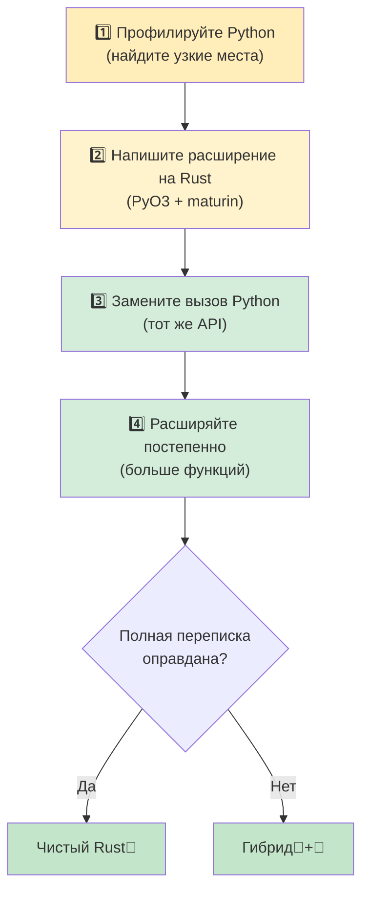

## Частые паттерны Python в Rust

> **Что вы узнаете:** как переводить dict → struct, class → struct+impl, списочные включения → цепочки итераторов, декоратор → функции высшего порядка и контекстный менеджер → Drop/RAII. Плюс основные крейты и стратегия постепенного внедрения.
>
> **Сложность:** 🟡 Средний

### Словарь → структура
```python
# Python — dict как контейнер данных (очень распространённо)
user = {
    "name": "Alice",
    "age": 30,
    "email": "alice@example.com",
    "active": True,
}
print(user["name"])
```

```rust
// Rust — структура с именованными полями
#[derive(Debug, Clone, serde::Serialize, serde::Deserialize)]
struct User {
    name: String,
    age: i32,
    email: String,
    active: bool,
}

let user = User {
    name: "Alice".into(),
    age: 30,
    email: "alice@example.com".into(),
    active: true,
};
println!("{}", user.name);
```

### Контекстный менеджер → RAII (Drop)
```python
# Python — контекстный менеджер для освобождения ресурсов
class FileManager:
    def __init__(self, path):
        self.file = open(path, 'w')

    def __enter__(self):
        return self.file

    def __exit__(self, *args):
        self.file.close()

with FileManager("output.txt") as f:
    f.write("hello")
# Файл автоматически закрывается при выходе из блока `with`
```

```rust
// Rust — RAII: трейт Drop выполняется, когда значение выходит из области видимости
use std::fs::File;
use std::io::Write;

fn write_file() -> std::io::Result<()> {
    let mut file = File::create("output.txt")?;
    file.write_all(b"hello")?;
    Ok(())
    // Файл автоматически закрывается, когда `file` выходит из области видимости
    // `with` не нужен: RAII делает всё сам!
}
```

### Декоратор → функция высшего порядка или макрос
```python
# Python — декоратор для замера времени
import functools, time

def timed(func):
    @functools.wraps(func)
    def wrapper(*args, **kwargs):
        start = time.perf_counter()
        result = func(*args, **kwargs)
        elapsed = time.perf_counter() - start
        print(f"{func.__name__} выполнилась за {elapsed:.4f}s")
        return result
    return wrapper

@timed
def slow_function():
    time.sleep(1)
```

```rust
// Rust — никаких декораторов: используйте функции-обёртки или макросы
use std::time::Instant;

fn timed<F, R>(name: &str, f: F) -> R
where
    F: FnOnce() -> R,
{
    let start = Instant::now();
    let result = f();
    println!("{} выполнилась за {:.4?}", name, start.elapsed());
    result
}

// Использование:
let result = timed("slow_function", || {
    std::thread::sleep(std::time::Duration::from_secs(1));
    42
});
```

### Конвейер итераторов (обработка данных)
```python
# Python — цепочка преобразований
import csv
from collections import Counter

def analyze_sales(filename):
    with open(filename) as f:
        reader = csv.DictReader(f)
        sales = [
            row for row in reader
            if float(row["amount"]) > 100
        ]
    by_region = Counter(sale["region"] for sale in sales)
    top_regions = by_region.most_common(5)
    return top_regions
```

```rust
// Rust — цепочки итераторов с сильной типизацией
use std::collections::HashMap;

#[derive(Debug, serde::Deserialize)]
struct Sale {
    region: String,
    amount: f64,
}

fn analyze_sales(filename: &str) -> Vec<(String, usize)> {
    let data = std::fs::read_to_string(filename).unwrap();
    let mut reader = csv::Reader::from_reader(data.as_bytes());

    let mut by_region: HashMap<String, usize> = HashMap::new();
    for sale in reader.deserialize::<Sale>().flatten() {
        if sale.amount > 100.0 {
            *by_region.entry(sale.region).or_insert(0) += 1;
        }
    }

    let mut top: Vec<_> = by_region.into_iter().collect();
    top.sort_by(|a, b| b.1.cmp(&a.1));
    top.truncate(5);
    top
}
```

### Глобальная конфигурация / синглтон
```python
# Python — синглтон на уровне модуля (распространённый паттерн)
# config.py
import json

class Config:
    _instance = None

    def __new__(cls):
        if cls._instance is None:
            cls._instance = super().__new__(cls)
            with open("config.json") as f:
                cls._instance.data = json.load(f)
        return cls._instance

config = Config()  # Синглтон на уровне модуля
```

```rust
// Rust — OnceLock для ленивой статической инициализации (Rust 1.70+)
use std::sync::OnceLock;
use serde_json::Value;

static CONFIG: OnceLock<Value> = OnceLock::new();

fn get_config() -> &'static Value {
    CONFIG.get_or_init(|| {
        let data = std::fs::read_to_string("config.json")
            .expect("Не удалось прочитать конфигурацию");
        serde_json::from_str(&data)
            .expect("Не удалось разобрать конфигурацию")
    })
}

// Использование в любом месте:
let db_host = get_config()["database"]["host"].as_str().unwrap();
```

***

## Основные крейты для разработчиков на Python

### Обработка данных и сериализация

| Задача | Python | Крейт Rust | Примечания |
|--------|--------|------------|------------|
| JSON | `json` | `serde_json` | Типобезопасная сериализация |
| CSV | `csv`, `pandas` | `csv` | Потоковая обработка, мало памяти |
| YAML | `pyyaml` | `serde_yaml` | Файлы конфигурации |
| TOML | `tomllib` | `toml` | Файлы конфигурации |
| Валидация данных | `pydantic` | `serde` + собственная логика | Проверка на этапе компиляции |
| Дата и время | `datetime` | `chrono` | Полная поддержка часовых поясов |
| Регулярные выражения | `re` | `regex` | Очень быстро |
| UUID | `uuid` | `uuid` | Та же концепция |

### Веб и сеть

| Задача | Python | Крейт Rust | Примечания |
|--------|--------|------------|------------|
| HTTP-клиент | `requests` | `reqwest` | Асинхронный в первую очередь |
| Веб-фреймворк | `FastAPI`/`Flask` | `axum` / `actix-web` | Очень быстро |
| WebSocket | `websockets` | `tokio-tungstenite` | Асинхронный |
| gRPC | `grpcio` | `tonic` | Полная поддержка |
| База данных (SQL) | `sqlalchemy` | `sqlx` / `diesel` | SQL с проверкой на этапе компиляции |
| Redis | `redis-py` | `redis` | Поддержка async |

### CLI и система

| Задача | Python | Крейт Rust | Примечания |
|--------|--------|------------|------------|
| Аргументы CLI | `argparse`/`click` | `clap` | Макросы derive |
| Цветной вывод | `colorama` | `colored` | Цвета в терминале |
| Индикатор прогресса | `tqdm` | `indicatif` | Похожий UX |
| Отслеживание файлов | `watchdog` | `notify` | Кроссплатформенный |
| Логирование | `logging` | `tracing` | Структурированный, готов к async |
| Переменные окружения | `os.environ` | `std::env` + `dotenvy` | Поддержка .env |
| Подпроцессы | `subprocess` | `std::process::Command` | Встроен |
| Временные файлы | `tempfile` | `tempfile` | Одинаковое название! |

### Тестирование

| Задача | Python | Крейт Rust | Примечания |
|--------|--------|------------|------------|
| Фреймворк тестов | `pytest` | Встроенный + `rstest` | `cargo test` |
| Моки | `unittest.mock` | `mockall` | На основе трейтов |
| Property-тестирование | `hypothesis` | `proptest` | Похожий API |
| Снапшот-тестирование | `syrupy` | `insta` | Подтверждение снимков |
| Бенчмарки | `pytest-benchmark` | `criterion` | Статистические |
| Покрытие кода | `coverage.py` | `cargo-tarpaulin` | На основе LLVM |

***

## Стратегия постепенного внедрения



> 📌 **См. также**: [Гл. 14 — Unsafe Rust и FFI](ch14-unsafe-rust-and-ffi.md) описывает низкоуровневые детали FFI, необходимые для привязок PyO3.

### Шаг 1: найдите узкие места

```python
# Сначала профилируйте код на Python
import cProfile
cProfile.run('main()')  # Находим функции, которые сильно грузят CPU

# Или используйте py-spy как профилировщик сэмплирования:
# py-spy top --pid <python-pid>
# py-spy record -o profile.svg -- python main.py
```

### Шаг 2: напишите расширение на Rust для узкого места

```bash
# Создаём расширение на Rust с помощью maturin
cd my_python_project
maturin init --bindings pyo3

# Пишем горячую функцию на Rust (см. раздел про PyO3 выше)
# Собираем и устанавливаем:
maturin develop --release
```

### Шаг 3: замените вызов Python вызовом Rust

```python
# До:
result = python_hot_function(data)  # Медленно

# После:
import my_rust_extension
result = my_rust_extension.hot_function(data)  # Быстро!

# Тот же API, те же тесты, в 10–100 раз быстрее
```

### Шаг 4: расширяйте постепенно

```rust
Неделя 1–2: заменить одну функцию, ограниченную CPU, на Rust
Неделя 3–4: заменить слой разбора и валидации данных
Месяц 2:    заменить основной конвейер данных
Месяц 3+:   рассмотреть полную переписку на Rust, если выгода оправдывает затраты

Ключевой принцип: оставьте Python для оркестрации, а Rust для вычислений.
```

---

## 💼 Кейс: ускорение конвейера данных с PyO3

Финтех-стартап обрабатывает ежедневно файлы CSV с транзакциями общим объёмом 2 ГБ на Python. Критическое узкое место — шаг валидации и преобразования:

```python
# Python — медленная часть (~12 минут на 2 ГБ)
import csv
from decimal import Decimal
from datetime import datetime

def validate_and_transform(filepath: str) -> list[dict]:
    results = []
    with open(filepath) as f:
        reader = csv.DictReader(f)
        for row in reader:
            # Разбираем и проверяем каждое поле
            amount = Decimal(row["amount"])
            if amount < 0:
                raise ValueError(f"Отрицательная сумма: {amount}")
            date = datetime.strptime(row["date"], "%Y-%m-%d")
            category = categorize(row["merchant"])  # Поиск по строкам, ~50 правил

            results.append({
                "amount_cents": int(amount * 100),
                "date": date.isoformat(),
                "category": category,
                "merchant": row["merchant"].strip().lower(),
            })
    return results
# ~12 минут на 15 млн строк. Пробовали pandas: вышло ~8 минут, но 6 ГБ ОЗУ.
```

**Шаг 1**: профилируем и находим узкое место (разбор CSV + преобразование Decimal + поиск по строкам = 95% времени).

**Шаг 2**: пишем расширение на Rust:

```rust
// src/lib.rs — расширение PyO3
use pyo3::prelude::*;
use pyo3::types::PyList;
use std::fs::File;
use std::io::BufReader;

#[derive(Debug)]
struct Transaction {
    amount_cents: i64,
    date: String,
    category: String,
    merchant: String,
}

fn categorize(merchant: &str) -> &'static str {
    // Aho-Corasick или простые правила: компилируются один раз и работают очень быстро
    if merchant.contains("amazon") { "shopping" }
    else if merchant.contains("uber") || merchant.contains("lyft") { "transport" }
    else if merchant.contains("starbucks") { "food" }
    else { "other" }
}

#[pyfunction]
fn process_transactions(path: &str) -> PyResult<Vec<(i64, String, String, String)>> {
    let file = File::open(path).map_err(|e| pyo3::exceptions::PyIOError::new_err(e.to_string()))?;
    let mut reader = csv::Reader::from_reader(BufReader::new(file));

    let mut results = Vec::with_capacity(15_000_000); // Предварительное выделение памяти

    for record in reader.records() {
        let record = record.map_err(|e| pyo3::exceptions::PyValueError::new_err(e.to_string()))?;
        let amount_str = &record[0];
        let amount_cents = parse_amount_cents(amount_str)?;  // Ваш собственный парсер (Decimal не нужен)
        let date = &record[1];  // Уже в формате ISO, нужно только проверить
        let merchant = record[2].trim().to_lowercase();
        let category = categorize(&merchant).to_string();

        results.push((amount_cents, date.to_string(), category, merchant));
    }
    Ok(results)
}

#[pymodule]
fn fast_pipeline(m: &Bound<'_, PyModule>) -> PyResult<()> {
    m.add_function(wrap_pyfunction!(process_transactions, m)?)?;
    Ok(())
}
```

**Шаг 3**: заменяем одну строку в Python:

```python
# До:
results = validate_and_transform("transactions.csv")  # 12 минут

# После:
import fast_pipeline
results = fast_pipeline.process_transactions("transactions.csv")  # 45 секунд

# Та же оркестрация на Python, те же тесты, то же развёртывание
# Заменена только одна функция
```

**Результаты**:

| Метрика | Python (csv + Decimal) | Rust (PyO3 + крейт csv) |
|---------|------------------------|-------------------------|
| Время (2 ГБ / 15 млн строк) | 12 минут | 45 секунд |
| Пиковая память | 6 ГБ (pandas) / 2 ГБ (csv) | 200 МБ |
| Строк изменено в Python | — | 1 (import + вызов) |
| Написано кода на Rust | — | ~60 строк |
| Пройденные тесты | 47/47 | 47/47 (без изменений) |

> **Ключевой урок**: переписывать всё приложение не нужно. Найдите 5% кода, на который уходит 95% времени, перепишите его на Rust с PyO3, а всё остальное оставьте на Python. Команда перешла от «нам нужно добавить серверов» к «одного сервера достаточно».

---

## Упражнения

<details>
<summary><strong>🏋️ Упражнение: матрица решений по миграции</strong> (нажмите, чтобы раскрыть)</summary>

**Задание**: у вас есть веб-приложение на Python с такими компонентами. Для каждого решите: **оставить на Python**, **переписать на Rust** или **мост PyO3**. Обоснуйте каждый выбор.

1. Обработчики маршрутов Flask (разбор запросов, ответы JSON)
2. Генерация миниатюр изображений (ограничено CPU, 10 тыс. изображений в день)
3. Запросы ORM к базе данных (SQLAlchemy)
4. Разбор CSV для финансовых файлов по 2 ГБ (запускается ночью)
5. Панель администратора (шаблоны Jinja2)

<details>
<summary>🔑 Решение</summary>

| Компонент | Решение | Обоснование |
|---|---|---|
| Обработчики маршрутов Flask | 🐍 Оставить на Python | Ограничено вводом-выводом, завязано на фреймворк, выигрыш от Rust мал |
| Генерация миниатюр изображений | 🦀 Мост PyO3 | Горячий путь, ограниченный CPU: API остаётся на Python, внутренности на Rust |
| Запросы ORM к базе данных | 🐍 Оставить на Python | SQLAlchemy зрелый, запросы ограничены вводом-выводом |
| Разбор CSV (2 ГБ) | 🦀 Мост PyO3 или полный Rust | Ограничено CPU и памятью, здесь хорошо работает разбор без копирования |
| Панель администратора | 🐍 Оставить на Python | Код UI и шаблонов, производительность не проблема |

**Ключевой вывод**: золотая середина миграции — это код, ограниченный CPU и критичный к производительности, с чистой границей. Не переписывайте клеящий код и обработчики, ограниченные вводом-выводом: выигрыш не окупит затрат.

</details>
</details>

***

