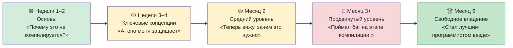

## Идиоматичный Rust для разработчиков на Python

> **Что вы узнаете:** десять привычек, которые стоит выработать, частые ошибки и их исправления, структурированный трёхмесячный план обучения, полную справочную таблицу «Розеттский камень» Python → Rust и рекомендуемые ресурсы для изучения.
>
> **Сложность:** 🟡 Средний



### Десять привычек, которые стоит выработать

1. **Используйте `match` для перечислений вместо `if isinstance()`**
   ```python
   # Python                              # Rust
   if isinstance(shape, Circle): ...     match shape { Shape::Circle(r) => ... }
   ```

2. **Доверяйте компилятору.** Внимательно читайте сообщения об ошибках. Компилятор Rust — лучший среди всех языков. Он говорит, что не так, И как это исправить.

3. **Предпочитайте `&str` вместо `String` в параметрах функций.** Принимайте наиболее общий тип. `&str` работает и с `String`, и с строковыми литералами.

4. **Используйте итераторы вместо циклов по индексу.** Цепочки итераторов идиоматичнее и часто быстрее, чем `for i in 0..vec.len()`.

5. **Используйте `Option` и `Result` в полной мере.** Не вызывайте `.unwrap()` везде. Используйте `?`, `map`, `and_then`, `unwrap_or_else`.

6. **Щедро используйте derive для трейтов.** `#[derive(Debug, Clone, PartialEq)]` должен стоять на большинстве структур. Это бесплатно и упрощает тестирование.

7. **Регулярно запускайте `cargo clippy`.** Он находит сотни проблем со стилем и корректностью. Относитесь к нему как к `ruff` для Rust.

8. **Не боритесь с borrow checker.** Если вы с ним воюете, скорее всего, данные структурированы неправильно. Переделайте структуру, чтобы владение стало понятным.

9. **Используйте перечисления для конечных автоматов.** Вместо строковых флагов или булевых значений используйте перечисления. Компилятор следит, чтобы обрабатывалось каждое состояние.

10. **Сначала клонируйте, потом оптимизируйте.** На этапе изучения свободно используйте `.clone()`, чтобы не разбираться со сложностью владения. Оптимизируйте, только когда профилирование покажет необходимость.

### Частые ошибки разработчиков на Python

| Ошибка | Почему плохо | Исправление |
|--------|--------------|-------------|
| `.unwrap()` везде | Паника во время выполнения | Используйте `?` или `match` |
| `String` вместо `&str` | Лишнее выделение памяти | Используйте `&str` в параметрах |
| `for i in 0..vec.len()` | Не идиоматично | `for item in &vec` |
| Игнорирование предупреждений clippy | Упускаете простые улучшения | `cargo clippy` |
| Слишком много вызовов `.clone()` | Накладные расходы | Пересмотрите владение |
| Огромная функция main() | Трудно тестировать | Вынесите код в lib.rs |
| Не используете `#[derive()]` | Изобретаете велосипед | Derive для общих трейтов |
| Паника при ошибках | Не восстанавливается | Возвращайте `Result<T, E>` |

***

## Сравнение производительности

### Бенчмарк: частые операции
```text
Операция               Python 3.12    Rust (release)    Ускорение
─────────────────────  ────────────   ──────────────    ─────────
Фибоначчи(40)          ~25s           ~0.3s             ~80x
Сортировка 10 млн целых ~5.2s         ~0.6s             ~9x
Разбор JSON 100 МБ     ~8.5s          ~0.4s             ~21x
Регулярные выражения: 1 млн совпадений ~3.1s  ~0.3s    ~10x
HTTP-сервер (запросов/с) ~5,000       ~150,000          ~30x
SHA-256 для файла 1 ГБ ~12s           ~1.2s             ~10x
Разбор CSV: 1 млн строк ~4.5s         ~0.2s             ~22x
Конкатенация строк     ~2.1s          ~0.05s            ~42x
```

> **Примечание**: Python с C-расширениями (NumPy и др.) заметно сокращает разрыв в численных расчётах. Эти бенчмарки сравнивают чистый Python с чистым Rust.

### Использование памяти
```text
Python:                                 Rust:
─────────                               ─────
- Заголовок объекта: 28 байт/объект    - Заголовка объекта нет
- int: 28 байт (даже для 0)            - i32: 4 байта, i64: 8 байт
- str "hello": 54 байта                - &str "hello": 16 байт (указатель + длина)
- список из 1000 int: ~36 КБ           - Vec<i32>: ~4 КБ
  (8 КБ указатели + 28 КБ объекты int)
- dict из 100 элементов: ~5,5 КБ       - HashMap из 100 элементов: ~2,4 КБ

Итого для типичного приложения:
- Python: базово 50–200 МБ             - Rust: базово 1–5 МБ
```

***

## Частые ошибки и их решения

### Ловушка 1: «Borrow checker не даёт»
```rust
// Проблема: попытка одновременно итерировать и менять коллекцию
let mut items = vec![1, 2, 3, 4, 5];
// for item in &items {
//     if *item > 3 { items.push(*item * 2); }  // ❌ Нельзя взять изменяемую ссылку, пока есть заимствование
// }

// Решение 1: собрать изменения и применить их после
let additions: Vec<i32> = items.iter()
    .filter(|&&x| x > 3)
    .map(|&x| x * 2)
    .collect();
items.extend(additions);

// Решение 2: используйте retain/extend
items.retain(|&x| x <= 3);
```

### Ловушка 2: «Слишком много строковых типов»
```rust
// Если сомневаетесь:
// - &str для параметров функций
// - String для полей структур и возвращаемых значений
// - литералы &str ("hello") работают везде, где ожидается &str

fn process(input: &str) -> String {    // Принимаем &str, возвращаем String
    format!("Processed: {}", input)
}
```

### Ловушка 3: «Мне не хватает простоты Python»
```rust
// Однострочник на Python:
// result = [x**2 for x in data if x > 0]

// Эквивалент на Rust:
let result: Vec<i32> = data.iter()
    .filter(|&&x| x > 0)
    .map(|&x| x * x)
    .collect();

// Он многословнее, зато:
// - типобезопасен на этапе компиляции
// - в 10–100 раз быстрее
// - ошибки типов во время выполнения невозможны
// - явно видно выделение памяти (.collect())
```

### Ловушка 4: «А где мой REPL?»
```rust
// В Rust нет REPL. Вместо этого:
// 1. Используйте `cargo test` как REPL: пишите небольшие тесты, чтобы что-то проверить
// 2. Используйте Rust Playground (play.rust-lang.org) для быстрых экспериментов
// 3. Используйте макрос `dbg!()` для быстрого отладочного вывода
// 4. Используйте `cargo watch -x test`, чтобы тесты запускались при сохранении

#[test]
fn playground() {
    // Используйте это как свой «REPL»: запускайте через `cargo test playground`
    let result = "hello world"
        .split_whitespace()
        .map(|w| w.to_uppercase())
        .collect::<Vec<_>>();
    dbg!(&result);  // Выводит: [src/main.rs:5] &result = ["HELLO", "WORLD"]
}
```

***

## Путь обучения и ресурсы

### Недели 1–2: основы
- [ ] Установите Rust и настройте VS Code с rust-analyzer
- [ ] Пройдите главы 1–4 этого руководства (типы, управление потоком)
- [ ] Напишите 5 небольших программ, переписав скрипты Python на Rust
- [ ] Освойтесь с `cargo build`, `cargo test`, `cargo clippy`

### Недели 3–4: ключевые концепции
- [ ] Пройдите главы 5–8 (структуры, перечисления, владение, модули)
- [ ] Перепишите на Rust скрипт обработки данных на Python
- [ ] Практикуйтесь с `Option<T>` и `Result<T, E>`, пока это не станет естественным
- [ ] Внимательно читайте сообщения компилятора: они вас учат

### Месяц 2: средний уровень
- [ ] Пройдите главы 9–12 (обработка ошибок, трейты, итераторы)
- [ ] Создайте CLI-утилиту с `clap` и `serde`
- [ ] Напишите расширение PyO3 для узкого места в проекте на Python
- [ ] Практикуйтесь с цепочками итераторов, пока они не станут похожи на списочные включения

### Месяц 3: продвинутый уровень
- [ ] Пройдите главы 13–16 (конкурентность, unsafe, тестирование)
- [ ] Создайте веб-сервис с `axum` и `tokio`
- [ ] Внесите вклад в проект Rust с открытым исходным кодом
- [ ] Прочитайте «Programming Rust» (O'Reilly), чтобы глубже понять язык

### Рекомендуемые ресурсы
- **The Rust Book**: https://doc.rust-lang.org/book/ (официальная книга, отличная)
- **Rust by Example**: https://doc.rust-lang.org/rust-by-example/ (учитесь на практике)
- **Rustlings**: https://github.com/rust-lang/rustlings (упражнения)
- **Rust Playground**: https://play.rust-lang.org/ (онлайн-компилятор)
- **This Week in Rust**: https://this-week-in-rust.org/ (рассылка)
- **PyO3 Guide**: https://pyo3.rs/ (мост Python ↔ Rust)
- **Comprehensive Rust** (Google): https://google.github.io/comprehensive-rust/

### Шпаргалка Python → Rust

| Python | Rust | Глава |
|--------|------|-------|
| `list` | `Vec<T>` | 5 |
| `dict` | `HashMap<K,V>` | 5 |
| `set` | `HashSet<T>` | 5 |
| `tuple` | `(T1, T2, ...)` | 5 |
| `class` | `struct` + `impl` | 5 |
| `@dataclass` | `#[derive(...)]` | 5, 12a |
| `Enum` | `enum` | 6 |
| `None` | `Option<T>` | 6 |
| `raise`/`try`/`except` | `Result<T,E>` + `?` | 9 |
| `Protocol` (PEP 544) | `trait` | 10 |
| `TypeVar` | Обобщения `<T>` | 10 |
| `__dunder__` методы | Трейты (Display, Add и др.) | 10 |
| `lambda` | `\|args\| body` | 12 |
| генератор `yield` | `impl Iterator` | 12 |
| списочное включение | `.map().filter().collect()` | 12 |
| `@decorator` | Функция высшего порядка или макрос | 12a, 15 |
| `asyncio` | `tokio` | 13 |
| `threading` | `std::thread` | 13 |
| `multiprocessing` | `rayon` | 13 |
| `unittest.mock` | `mockall` | 14a |
| `pytest` | `cargo test` + `rstest` | 14a |
| `pip install` | `cargo add` | 8 |
| `requirements.txt` | `Cargo.lock` | 8 |
| `pyproject.toml` | `Cargo.toml` | 8 |
| `with` (контекстный менеджер) | Освобождение по области видимости (`Drop`) | 15 |
| `json.dumps/loads` | `serde_json` | 15 |

***

## Заключительные мысли для разработчиков на Python

```rust
Чего вам будет не хватать из Python:
- REPL и интерактивного исследования
- Скорости быстрого прототипирования
- Богатой экосистемы ML/AI (PyTorch и др.)
- Динамической типизации, которая «просто работает»
- pip install и мгновенного использования

Что вы получите от Rust:
- Уверенность «если компилируется, значит, работает»
- Прирост производительности в 10–100 раз
- Больше никаких ошибок типов во время выполнения
- Больше никаких падений из-за None/null
- Настоящий параллелизм (без GIL!)
- Развёртывание одним бинарником
- Предсказуемое потребление памяти
- Лучшие сообщения об ошибках компилятора среди всех языков

Путь:
Неделя 1:   «Почему компилятор меня ненавидит?»
Неделя 2:   «А, он на самом деле защищает меня от багов»
Месяц 1:    «Теперь вижу, зачем это нужно»
Месяц 2:    «Поймал баг на этапе компиляции, который стал бы инцидентом в продакшене»
Месяц 3:    «Не хочу возвращаться к коду без типов»
Месяц 6:    «Rust сделал меня лучшим программистом на любом языке»
```

---

## Упражнения

<details>
<summary><strong>🏋️ Упражнение: чек-лист код-ревью</strong> (нажмите, чтобы раскрыть)</summary>

**Задание**: проверьте этот код на Rust (его написал разработчик на Python) и найдите 5 идиоматичных улучшений:

```rust
fn get_name(names: Vec<String>, index: i32) -> String {
    if index >= 0 && (index as usize) < names.len() {
        return names[index as usize].clone();
    } else {
        return String::from("");
    }
}

fn main() {
    let mut result = String::from("");
    let names = vec!["Alice".to_string(), "Bob".to_string()];
    result = get_name(names.clone(), 0);
    println!("{}", result);
}
```

<details>
<summary>🔑 Решение</summary>

Пять улучшений:

```rust
// 1. Принимайте &[String], а не Vec<String> (не забирайте владение всем вектором)
// 2. Используйте usize для индекса (не i32: индексы всегда неотрицательны)
// 3. Возвращайте Option<&str> вместо пустой строки (используйте систему типов!)
// 4. Используйте .get() вместо ручной проверки границ
// 5. Не вызывайте clone() в main: передавайте ссылку

fn get_name(names: &[String], index: usize) -> Option<&str> {
    names.get(index).map(|s| s.as_str())
}

fn main() {
    let names = vec!["Alice".to_string(), "Bob".to_string()];
    match get_name(&names, 0) {
        Some(name) => println!("{name}"),
        None => println!("Не найдено"),
    }
}
```

**Ключевой вывод**: привычки Python, которые мешают в Rust: клонирование всего (используйте заимствования), значения-заглушки вроде `""` (используйте `Option`), забирание владения там, где достаточно заимствования, и знаковые целые для индексов.

</details>
</details>

***

*Конец учебного руководства «Rust для программистов на Python»*
