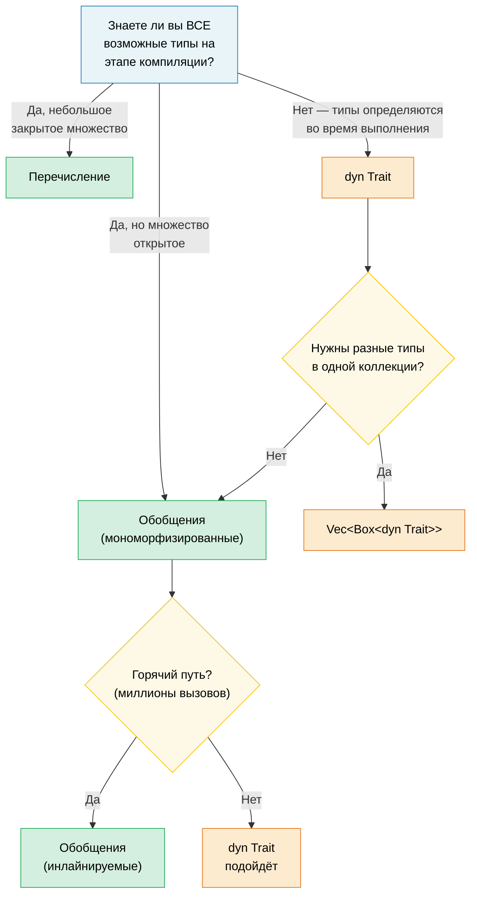

# 1. Обобщённые типы — полная картина 🟢

> **Что вы узнаете:**
> - Как мономорфизация даёт обобщения без накладных расходов и когда она приводит к раздуванию кода
> - Схему выбора: обобщения, перечисления или трейт-объекты
> - Const-обобщения для размеров массивов на этапе компиляции и `const fn` для вычислений на этапе компиляции
> - Когда на холодных путях стоит заменить статическую диспетчеризацию динамической

## Мономорфизация и нулевые затраты

Обобщения в Rust **мономорфизируются**: компилятор генерирует специализированную копию каждой обобщённой функции для каждого конкретного типа, с которым она используется. Это противоположность Java и C#, где обобщения стираются во время выполнения.

```rust
fn max_of<T: PartialOrd>(a: T, b: T) -> T {
    if a >= b { a } else { b }
}

fn main() {
    max_of(3_i32, 5_i32);     // Компилятор сгенерирует max_of_i32
    max_of(2.0_f64, 7.0_f64); // Компилятор сгенерирует max_of_f64
    max_of("a", "z");         // Компилятор сгенерирует max_of_str
}
```

**Что на самом деле создаёт компилятор** (концептуально):

```rust
// Три отдельные функции — никакой динамической диспетчеризации и никакой vtable:
fn max_of_i32(a: i32, b: i32) -> i32 { if a >= b { a } else { b } }
fn max_of_f64(a: f64, b: f64) -> f64 { if a >= b { a } else { b } }
fn max_of_str<'a>(a: &'a str, b: &'a str) -> &'a str { if a >= b { a } else { b } }
```

> **Почему `max_of_str` требует `<'a>`, а `max_of_i32` — нет?** `i32` и `f64` — типы с `Copy`, функция возвращает копию значения, которая не зависит ни от каких заимствований. А `&str` — это ссылка, поэтому компилятор должен знать время жизни возвращаемой ссылки. Аннотация `<'a>` означает: «возвращаемый `&str` живёт не меньше, чем оба входных параметра».

**Преимущества**: нулевые затраты во время выполнения — код совпадает с вручную написанной специализированной версией. Оптимизатор может независимо инлайнить, векторизовать и специализировать каждую копию.

**Сравнение с C++**: обобщения в Rust работают как шаблоны C++, но есть одно принципиальное отличие — **проверка ограничений происходит в момент определения, а не инстанцирования**. В C++ шаблон компилируется только при использовании с конкретным типом, поэтому ошибки всплывают глубоко в библиотечном коде и выглядят запутанно. В Rust `T: PartialOrd` проверяется при определении функции, поэтому ошибки находятся раньше, а сообщения понятны.

```rust,compile_fail
// Rust: ошибка уже в месте определения — "T doesn't implement Display"
fn broken<T>(val: T) {
    println!("{val}"); // ❌ Error: T doesn't implement Display
}
```

```rust
// Исправление: добавляем ограничение
fn fixed<T: std::fmt::Display>(val: T) {
    println!("{val}"); // ✅
}
```

### Когда обобщения вредят: раздувание кода

У мономорфизации есть цена — размер бинарного файла. Каждая уникальная инстанциация дублирует тело функции:

```rust,ignore
// Эта невинная функция...
fn serialize<T: serde::Serialize>(value: &T) -> Vec<u8> {
    serde_json::to_vec(value).unwrap()
}

// ...используемая с 50 разными типами → 50 копий в бинарном файле.
```

**Стратегии смягчения**:

```rust,ignore
// 1. Вынести необобщённое ядро (паттерн «outline»)
fn serialize<T: serde::Serialize>(value: &T) -> Result<Vec<u8>, serde_json::Error> {
    // Обобщённая часть: только вызов сериализации
    let json_value = serde_json::to_value(value)?;
    // Необобщённая часть: вынесена в отдельную функцию
    serialize_value(json_value)
}

fn serialize_value(value: serde_json::Value) -> Result<Vec<u8>, serde_json::Error> {
    // Эта функция существует в бинарном файле ТОЛЬКО ОДИН раз
    serde_json::to_vec(&value)
}

// 2. Использовать трейт-объекты (динамическая диспетчеризация), когда инлайнинг не критичен
fn log_item(item: &dyn std::fmt::Display) {
    // Одна копия — диспетчеризация через vtable
    println!("[LOG] {item}");
}
```

> **Практическое правило**: используйте обобщения на горячих путях, где важен инлайнинг. Используйте `dyn Trait` на холодных путях (обработка ошибок, логирование, конфигурация), где вызов через vtable несущественен.

### Обобщения, перечисления и трейт-объекты: руководство по выбору

В Rust есть три способа реализовать «разные типы с одинаковым интерфейсом»:

| Подход | Диспетчеризация | Известен на этапе | Расширяемый? | Накладные расходы |
|--------|-----------------|-------------------|--------------|-------------------|
| **Обобщения** (`impl Trait` / `<T: Trait>`) | Статическая (мономорфизация) | Компиляции | ✅ (открытое множество) | Нулевые — инлайнятся |
| **Перечисление** | Ветка `match` | Компиляции | ❌ (закрытое множество) | Нулевые — без vtable |
| **Трейт-объект** (`dyn Trait`) | Динамическая (vtable) | Выполнения | ✅ (открытое множество) | Указатель на vtable и косвенный вызов |

```rust,ignore
// --- ОБОБЩЕНИЯ: открытое множество, нулевые затраты, решается на этапе компиляции ---
fn process<H: Handler>(handler: H, request: Request) -> Response {
    handler.handle(request) // Мономорфизировано — по одной копии на каждый H
}

// --- ПЕРЕЧИСЛЕНИЕ: закрытое множество, нулевые затраты, исчерпывающее сопоставление ---
enum Shape {
    Circle(f64),
    Rect(f64, f64),
    Triangle(f64, f64, f64),
}

impl Shape {
    fn area(&self) -> f64 {
        match self {
            Shape::Circle(r) => std::f64::consts::PI * r * r,
            Shape::Rect(w, h) => w * h,
            Shape::Triangle(a, b, c) => {
                let s = (a + b + c) / 2.0;
                (s * (s - a) * (s - b) * (s - c)).sqrt()
            }
        }
    }
}
// При добавлении нового варианта придётся обновить ВСЕ ветки match: компилятор
// требует исчерпывающего сопоставления. Это удобно, когда вы контролируете все варианты.

// --- ТРЕЙТ-ОБЪЕКТ: открытое множество, затраты во время выполнения, расширяемый ---
fn log_all(items: &[Box<dyn std::fmt::Display>]) {
    for item in items {
        println!("{item}"); // диспетчеризация через vtable
    }
}
```

**Схема выбора**:



### Const-обобщения

Начиная с Rust 1.51, типы и функции можно параметризовать *константными значениями*, а не только типами:

```rust
// Обёртка над массивом, параметризованная размерами
struct Matrix<const ROWS: usize, const COLS: usize> {
    data: [[f64; COLS]; ROWS],
}

impl<const ROWS: usize, const COLS: usize> Matrix<ROWS, COLS> {
    fn new() -> Self {
        Matrix { data: [[0.0; COLS]; ROWS] }
    }

    fn transpose(&self) -> Matrix<COLS, ROWS> {
        let mut result = Matrix::<COLS, ROWS>::new();
        for r in 0..ROWS {
            for c in 0..COLS {
                result.data[c][r] = self.data[r][c];
            }
        }
        result
    }
}

// Компилятор следит за согласованностью размерностей:
fn multiply<const M: usize, const N: usize, const P: usize>(
    a: &Matrix<M, N>,
    b: &Matrix<N, P>, // N должно совпадать!
) -> Matrix<M, P> {
    let mut result = Matrix::<M, P>::new();
    for i in 0..M {
        for j in 0..P {
            for k in 0..N {
                result.data[i][j] += a.data[i][k] * b.data[k][j];
            }
        }
    }
    result
}

// Использование:
let a = Matrix::<2, 3>::new(); // 2×3
let b = Matrix::<3, 4>::new(); // 3×4
let c = multiply(&a, &b);      // 2×4 ✅

// let d = Matrix::<5, 5>::new();
// multiply(&a, &d); // ❌ Compile error: expected Matrix<3, _>, got Matrix<5, 5>
```

> **Сравнение с C++**: это похоже на `template<int N>` в C++, но const-обобщения в Rust проверяются сразу и не страдают от сложности SFINAE.

### Константные функции (const fn)

`const fn` помечает функцию как вычислимую на этапе компиляции. Это аналог `constexpr` в C++. Результат можно использовать в контекстах `const` и `static`:

```rust
// Простая const fn — вычисляется на этапе компиляции в константном контексте
const fn celsius_to_fahrenheit(c: f64) -> f64 {
    c * 9.0 / 5.0 + 32.0
}

const BOILING_F: f64 = celsius_to_fahrenheit(100.0); // Вычисляется на этапе компиляции
const FREEZING_F: f64 = celsius_to_fahrenheit(0.0);  // 32.0

// Константные конструкторы — создаём статические значения без lazy_static!
struct BitMask(u32);

impl BitMask {
    const fn new(bit: u32) -> Self {
        BitMask(1 << bit)
    }

    const fn or(self, other: BitMask) -> Self {
        BitMask(self.0 | other.0)
    }

    const fn contains(&self, bit: u32) -> bool {
        self.0 & (1 << bit) != 0
    }
}

// Статическая таблица поиска — без затрат во время выполнения и без ленивой инициализации
const GPIO_INPUT:  BitMask = BitMask::new(0);
const GPIO_OUTPUT: BitMask = BitMask::new(1);
const GPIO_IRQ:    BitMask = BitMask::new(2);
const GPIO_IO:     BitMask = GPIO_INPUT.or(GPIO_OUTPUT);

// Таблицы регистров как константные массивы:
const SENSOR_THRESHOLDS: [u16; 4] = {
    let mut table = [0u16; 4];
    table[0] = 50;   // Предупреждение
    table[1] = 70;   // Высокая температура
    table[2] = 85;   // Критическая
    table[3] = 100;  // Аварийное отключение
    table
};
// Вся таблица находится в бинарном файле: без кучи и без инициализации во время выполнения.
```

**Что МОЖНО делать в `const fn`** (начиная с Rust 1.79):
- арифметика, битовые операции, сравнения
- `if`/`else`, `match`, `loop`, `while` (управление потоком)
- создание и изменение локальных переменных (`let mut`)
- вызов других `const fn`
- ссылки (`&`, `&mut` в пределах константного контекста)
- `panic!()` (становится ошибкой компиляции, если достигается на этапе компиляции)
- базовая арифметика с плавающей точкой (`+`, `-`, `*`, `/`; сложные операции вроде `sqrt`/`sin` не могут быть `const`)

**Чего НЕЛЬЗЯ** (пока):
- выделение памяти в куче (`Box`, `Vec`, `String`)
- вызов методов трейтов (только собственные методы типа)
- ввод-вывод и побочные эффекты

```rust
// const fn с panic — становится ошибкой компиляции:
const fn checked_div(a: u32, b: u32) -> u32 {
    if b == 0 {
        panic!("деление на ноль"); // Ошибка компиляции, если b равно 0 на этапе const
    }
    a / b
}

const RESULT: u32 = checked_div(100, 4);  // ✅ 25
// const BAD: u32 = checked_div(100, 0);  // ❌ Ошибка компиляции: паника «деление на ноль»
```

> **Сравнение с C++**: `const fn` — это аналог `constexpr` в Rust. Ключевое отличие: в Rust это явный выбор, и компилятор строго проверяет, что используются только операции, совместимые с const. Функции `constexpr` в C++ могут молча перейти к вычислению во время выполнения. В Rust контекст `const` *требует* вычисления на этапе компиляции, иначе это жёсткая ошибка.

> **Практический совет**: делайте конструкторы и простые служебные функции `const fn`, когда это возможно. Это ничего не стоит, а вызывающий код сможет использовать их в константных контекстах. Для кода диагностики оборудования `const fn` идеально подходит для описания регистров, построения битовых масок и таблиц пороговых значений.

> **Ключевые выводы — обобщения**
> - Мономорфизация даёт абстракции без накладных расходов, но может раздувать код — на холодных путях используйте `dyn Trait`
> - Const-обобщения (`[T; N]`) заменяют шаблонные трюки C++ размерами массивов, проверяемыми на этапе компиляции
> - `const fn` избавляет от `lazy_static!` для значений, которые можно вычислить на этапе компиляции

> **См. также:** [гл. 2 — Трейты в деталях](ch02-traits-in-depth.md) — ограничения трейтов, ассоциированные типы и трейт-объекты. [гл. 4 — PhantomData](ch04-phantomdata-types-that-carry-no-data.md) — маркеры-обобщения нулевого размера.

---

### Упражнение: обобщённый кэш с вытеснением ★★ (~30 минут)

Реализуйте обобщённую структуру `Cache<K, V>`, которая хранит пары «ключ — значение» с настраиваемой максимальной ёмкостью. Когда кэш заполнен, вытесняется самая старая запись (FIFO). Требования:

- `fn new(capacity: usize) -> Self`
- `fn insert(&mut self, key: K, value: V)` — вытесняет самую старую запись, если достигнута ёмкость
- `fn get(&self, key: &K) -> Option<&V>`
- `fn len(&self) -> usize`
- Ограничьте `K: Eq + Hash + Clone`

<details>
<summary>🔑 Решение</summary>

```rust
use std::collections::{HashMap, VecDeque};
use std::hash::Hash;

struct Cache<K, V> {
    map: HashMap<K, V>,
    order: VecDeque<K>,
    capacity: usize,
}

impl<K: Eq + Hash + Clone, V> Cache<K, V> {
    fn new(capacity: usize) -> Self {
        Cache {
            map: HashMap::with_capacity(capacity),
            order: VecDeque::with_capacity(capacity),
            capacity,
        }
    }

    fn insert(&mut self, key: K, value: V) {
        if self.capacity == 0 {
            // нет ёмкости!
            return;
        }
        if self.map.contains_key(&key) {
            self.map.insert(key, value);
            return;
        }
        if self.map.len() >= self.capacity {
            if let Some(oldest) = self.order.pop_front() {
                self.map.remove(&oldest);
            }
        }
        self.order.push_back(key.clone());
        self.map.insert(key, value);
    }

    fn get(&self, key: &K) -> Option<&V> {
        self.map.get(key)
    }

    fn len(&self) -> usize {
        self.map.len()
    }
}

fn main() {
    // Тест базового кэша
    let mut cache = Cache::new(3);
    cache.insert("a", 1);
    cache.insert("b", 2);
    cache.insert("c", 3);
    assert_eq!(cache.len(), 3);

    cache.insert("d", 4); // Вытесняет "a"
    assert_eq!(cache.get(&"a"), None);
    assert_eq!(cache.get(&"d"), Some(&4));

    // Упражнение для читателя: каким должен быть тип атрибута `capacity`,
    // чтобы нельзя было создать такой бесполезный кэш?
    let mut empty_cache = Cache::new(0);
    empty_cache.insert("0", 0);
    assert_eq!(empty_cache.get(&"0"), None);
    assert_eq!(empty_cache.len(), 0);

    println!("Кэш работает! len = {}", cache.len());
}
```

</details>

***
