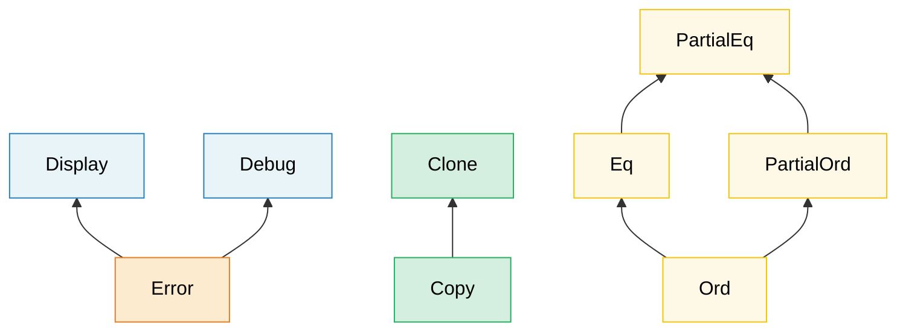

# 2. Трейты в деталях 🟡

> **Что вы узнаете:**
> - Ассоциированные типы и обобщённые параметры: когда что использовать
> - GAT, blanket-реализации, маркерные трейты и правила объектной безопасности
> - Как устроены vtable и «толстые» указатели
> - Трейты-расширения, диспетчеризация через перечисления и паттерны типизированных команд

## Ассоциированные типы и обобщённые параметры

Оба механизма позволяют трейту работать с разными типами, но служат разным целям:

```rust
// --- АССОЦИИРОВАННЫЙ ТИП: одна реализация на тип ---
trait Iterator {
    type Item; // Каждый итератор выдаёт ровно ОДИН вид элементов

    fn next(&mut self) -> Option<Self::Item>;
}

// Пользовательский итератор, который всегда возвращает i32 — выбора здесь нет
struct Counter { max: i32, current: i32 }

impl Iterator for Counter {
    type Item = i32; // Ровно один тип Item в каждой реализации
    fn next(&mut self) -> Option<i32> {
        if self.current < self.max {
            self.current += 1;
            Some(self.current)
        } else {
            None
        }
    }
}

// --- ОБОБЩЁННЫЙ ПАРАМЕТР: несколько реализаций на тип ---
trait Convert<T> {
    fn convert(&self) -> T;
}

// Один тип может реализовать Convert для МНОГИХ целевых типов:
impl Convert<f64> for i32 {
    fn convert(&self) -> f64 { *self as f64 }
}
impl Convert<String> for i32 {
    fn convert(&self) -> String { self.to_string() }
}
```

**Когда что использовать**:

| Случай | Когда |
|--------|-------|
| **Ассоциированный тип** | Для каждого реализующего типа есть ровно ОДИН естественный результат. `Iterator::Item`, `Deref::Target`, `Add::Output` |
| **Обобщённый параметр** | Тип может осмысленно реализовывать трейт для МНОГИХ разных типов. `From<T>`, `AsRef<T>`, `PartialEq<Rhs>` |

**Интуиция**: если осмысленно спросить «каков `Item` у этого итератора?», используйте ассоциированный тип. Если осмысленно спросить «можно ли это преобразовать в `f64`? в `String`? в `bool`?», используйте обобщённый параметр.

```rust
// Пример из реального мира: std::ops::Add
trait Add<Rhs = Self> {
    type Output; // Ассоциированный тип — у сложения ОДИН тип результата
    fn add(self, rhs: Rhs) -> Self::Output;
}

// Rhs — обобщённый параметр: к Meters можно прибавлять разные типы:
struct Meters(f64);
struct Centimeters(f64);

impl Add<Meters> for Meters {
    type Output = Meters;
    fn add(self, rhs: Meters) -> Meters { Meters(self.0 + rhs.0) }
}
impl Add<Centimeters> for Meters {
    type Output = Meters;
    fn add(self, rhs: Centimeters) -> Meters { Meters(self.0 + rhs.0 / 100.0) }
}
```

### Обобщённые ассоциированные типы (GAT)

Начиная с Rust 1.65, ассоциированные типы могут иметь собственные обобщённые параметры. Это позволяет реализовать **lending-итераторы**: итераторы, которые возвращают ссылки, привязанные к самому итератору, а не к базовой коллекции.

```rust
// Без GAT выразить lending-итератор невозможно:
// trait LendingIterator {
//     type Item<'a>;  // ← До 1.65 это отклонялось компилятором
// }

// С GAT (Rust 1.65+):
// Примечание: это пользовательский трейт, отличный от std::iter::Iterator.
// В реальном коде назовите его `LendingIterator`, чтобы не путать со
// стандартным трейтом `Iterator`.
trait LendingIterator {
    type Item<'a> where Self: 'a;

    fn next(&mut self) -> Option<Self::Item<'_>>;
}

// Пример: итератор, который выдаёт перекрывающиеся окна
struct WindowIter<'data> {
    data: &'data [u8],
    pos: usize,
    window_size: usize,
}

impl<'data> LendingIterator for WindowIter<'data> {
    type Item<'a> = &'a [u8] where Self: 'a;

    fn next(&mut self) -> Option<&[u8]> {
        if self.pos + self.window_size <= self.data.len() {
            let window = &self.data[self.pos..self.pos + self.window_size];
            self.pos += 1;
            Some(window)
        } else {
            None
        }
    }
}
```

> **Когда нужны GAT**: lending-итераторы, потоковые парсеры и любые трейты, где время жизни ассоциированного типа зависит от заимствования `&self`. Для большинства кода достаточно обычных ассоциированных типов.

### Супертрейты и иерархии трейтов

Трейты могут требовать другие трейты как предварительное условие, формируя иерархии:



> Стрелки направлены от субтрейта к супертрейту: реализация `Error` требует `Display` и `Debug`.

Трейт может потребовать, чтобы его реализаторы реализовывали и другие трейты:

```rust
use std::fmt;

// Display — супертрейт для Error
trait Error: fmt::Display + fmt::Debug {
    fn source(&self) -> Option<&(dyn Error + 'static)> { None }
}
// Любой тип, реализующий Error, ОБЯЗАН также реализовать Display и Debug

// Строим собственные иерархии:
trait Identifiable {
    fn id(&self) -> u64;
}

trait Timestamped {
    fn created_at(&self) -> chrono::DateTime<chrono::Utc>;
}

// Entity требует оба:
trait Entity: Identifiable + Timestamped {
    fn is_active(&self) -> bool;
}

// Реализация Entity заставляет реализовать все три трейта:
struct User { id: u64, name: String, created: chrono::DateTime<chrono::Utc> }

impl Identifiable for User {
    fn id(&self) -> u64 { self.id }
}
impl Timestamped for User {
    fn created_at(&self) -> chrono::DateTime<chrono::Utc> { self.created }
}
impl Entity for User {
    fn is_active(&self) -> bool { true }
}
```

### Blanket-реализации

Реализуйте трейт сразу для ВСЕХ типов, которые удовлетворяют некоторому ограничению:

```rust
// Так устроена std: любой тип с Display автоматически получает ToString
impl<T: fmt::Display> ToString for T {
    fn to_string(&self) -> String {
        format!("{self}")
    }
}
// Теперь i32, &str и ваши собственные типы, у которых есть Display, получают to_string() бесплатно.

// Собственная blanket-реализация:
trait Loggable {
    fn log(&self);
}

// Каждый тип с Debug автоматически становится Loggable:
impl<T: std::fmt::Debug> Loggable for T {
    fn log(&self) {
        eprintln!("[LOG] {self:?}");
    }
}

// Теперь ЛЮБОЙ тип с Debug имеет метод .log():
// 42.log();              // [LOG] 42
// "hello".log();         // [LOG] "hello"
// vec![1, 2, 3].log();   // [LOG] [1, 2, 3]
```

> **Осторожно**: blanket-реализации мощны, но необратимы. Нельзя добавить более специфичную реализацию для типа, который уже покрыт blanket-реализацией (правила сирот и когерентность). Проектируйте их внимательно.

### Маркерные трейты

Трейты без методов помечают тип как обладающий некоторым свойством:

```rust
// Маркерные трейты стандартной библиотеки:
// Send    — безопасно передавать между потоками
// Sync    — безопасно разделять (&T) между потоками
// Unpin   — безопасно перемещать после закрепления (pin)
// Sized   — размер известен на этапе компиляции
// Copy    — может дублироваться через memcpy

// Собственный маркерный трейт:
/// Маркер: этот датчик прошёл заводскую калибровку
trait Calibrated {}

struct RawSensor { reading: f64 }
struct CalibratedSensor { reading: f64 }

impl Calibrated for CalibratedSensor {}

// В продакшене используются только откалиброванные датчики:
fn record_measurement<S: Calibrated>(sensor: &S) {
    // ...
}
// record_measurement(&RawSensor { reading: 0.0 }); // ❌ Ошибка компиляции
// record_measurement(&CalibratedSensor { reading: 0.0 }); // ✅
```

Это напрямую связано с **паттерном type-state** из главы 3.

### Правила объектной безопасности

Не каждый трейт можно использовать как `dyn Trait`. Трейт является **объектно-безопасным** только если:

1. **Нет ограничения `Self: Sized`** на сам трейт
2. **Нет обобщённых параметров типа** у методов
3. **Нет `Self` в возвращаемом типе** (кроме случаев через косвенность, например `Box<Self>`)
4. **Нет ассоциированных функций без приёмника**: методы должны принимать `&self`, `&mut self` или `self`

```rust
// ✅ Объектно-безопасен — можно использовать как dyn Drawable
trait Drawable {
    fn draw(&self);
    fn bounding_box(&self) -> (f64, f64, f64, f64);
}

let shapes: Vec<Box<dyn Drawable>> = vec![/* ... */]; // ✅ Работает

// ❌ НЕ объектно-безопасен — использует Self в возвращаемом типе
trait Clonable {
    fn clone_self(&self) -> Self;
    //                       ^^^^ Во время выполнения нельзя узнать конкретный размер
}
// let items: Vec<Box<dyn Clonable>> = ...; // ❌ Ошибка компиляции

// ❌ НЕ объектно-безопасен — обобщённый метод
trait Converter {
    fn convert<T>(&self) -> T;
    //        ^^^ vtable не может содержать бесконечное число мономорфизаций
}

// ❌ НЕ объектно-безопасен — ассоциированная функция (без self)
trait Factory {
    fn create() -> Self;
    // Нет &self — как вызвать это через трейт-объект?
}
```

**Обходные пути**:

```rust
// Добавьте `where Self: Sized`, чтобы исключить метод из vtable:
trait MyTrait {
    fn regular_method(&self); // Входит в vtable

    fn generic_method<T>(&self) -> T
    where
        Self: Sized; // Исключён из vtable — нельзя вызвать через dyn MyTrait
}

// Теперь dyn MyTrait допустим, но generic_method можно вызвать
// только тогда, когда конкретный тип известен.
```

> **Практическое правило**: если вы собираетесь использовать `dyn Trait`, держите методы простыми: без обобщений, без `Self` в возвращаемых типах и без ограничений `Sized`. Если сомневаетесь, попробуйте `let _: Box<dyn YourTrait>;` и пусть компилятор подскажет.

### Трейт-объекты изнутри: vtable и «толстые» указатели

`&dyn Trait` (или `Box<dyn Trait>`) — это **«толстый» указатель**, состоящий из двух машинных слов:

```text
┌──────────────────────────────────────────────────┐
│  &dyn Drawable (на 64-битной системе: 16 байт)   │
├──────────────┬───────────────────────────────────┤
│  data_ptr    │  vtable_ptr                       │
│  (8 байт)    │  (8 байт)                         │
│  ↓           │  ↓                                │
│  ┌─────────┐ │  ┌──────────────────────────────┐ │
│  │ Circle  │ │  │ vtable для <Circle as        │ │
│  │ {       │ │  │           Drawable>          │ │
│  │  r: 5.0 │ │  │                              │ │
│  │ }       │ │  │  drop_in_place: 0x7f...a0    │ │
│  └─────────┘ │  │  size:           8           │ │
│              │  │  align:          8           │ │
│              │  │  draw:          0x7f...b4    │ │
│              │  │  bounding_box:  0x7f...c8    │ │
│              │  └──────────────────────────────┘ │
└──────────────┴───────────────────────────────────┘
```

**Как работает вызов через vtable** (например, `shape.draw()`):

1. Загрузить `vtable_ptr` из «толстого» указателя (второе слово)
2. Найти в vtable указатель на функцию `draw`
3. Вызвать её, передав `data_ptr` в качестве аргумента `self`

По стоимости это похоже на виртуальную диспетчеризацию C++ (одно косвенное обращение на вызов), но Rust хранит указатель на vtable внутри «толстого» указателя, а не внутри самого объекта. Поэтому обычный `Circle` на стеке вообще не содержит указателя на vtable.

```rust
trait Drawable {
    fn draw(&self);
    fn area(&self) -> f64;
}

struct Circle { radius: f64 }

impl Drawable for Circle {
    fn draw(&self) { println!("Рисуем круг r={}", self.radius); }
    fn area(&self) -> f64 { std::f64::consts::PI * self.radius * self.radius }
}

struct Square { side: f64 }

impl Drawable for Square {
    fn draw(&self) { println!("Рисуем квадрат s={}", self.side); }
    fn area(&self) -> f64 { self.side * self.side }
}

fn main() {
    let shapes: Vec<Box<dyn Drawable>> = vec![
        Box::new(Circle { radius: 5.0 }),
        Box::new(Square { side: 3.0 }),
    ];

    // Каждый элемент — «толстый» указатель: (data_ptr, vtable_ptr)
    // vtable для Circle и Square РАЗНЫЕ
    for shape in &shapes {
        shape.draw();  // диспетчеризация через vtable → Circle::draw или Square::draw
        println!("  площадь = {:.2}", shape.area());
    }

    // Сравнение размеров:
    println!("Размер size_of::<&Circle>()        = {}", std::mem::size_of::<&Circle>());
    // → 8 байт (один указатель — компилятор знает тип)
    println!("Размер size_of::<&dyn Drawable>()  = {}", std::mem::size_of::<&dyn Drawable>());
    // → 16 байт (data_ptr + vtable_ptr)
}
```

**Модель стоимости производительности**:

| Аспект | Статическая диспетчеризация (`impl Trait` / обобщения) | Динамическая диспетчеризация (`dyn Trait`) |
|--------|--------------------------------------------------------|---------------------------------------------|
| Накладные расходы на вызов | Нулевые: инлайнится LLVM | Одно косвенное обращение через указатель на каждый вызов |
| Инлайнинг | ✅ Компилятор может инлайнить | ❌ Непрозрачный указатель на функцию |
| Размер бинарного файла | Больше (по копии на каждый тип) | Меньше (одна общая функция) |
| Размер указателя | «Тонкий» (1 слово) | «Толстый» (2 слова) |
| Разнородные коллекции | ❌ | ✅ `Vec<Box<dyn Trait>>` |

> **Когда стоимость vtable имеет значение**: в узких циклах, которые миллионы раз вызывают метод трейта, косвенность и невозможность инлайнинга могут заметно замедлить код (в 2–10 раз). Для холодных путей, конфигурации и архитектур с плагинами гибкость `dyn Trait` стоит небольшой цены.

### Higher-Ranked Trait Bounds (HRTB)

Иногда нужна функция, которая работает со ссылками с *любым* временем жизни, а не с каким-то конкретным. Здесь и появляется синтаксис `for<'a>`:

```rust
// Проблема: этой функции нужно замыкание, которое может обрабатывать
// ссылки с ЛЮБЫМ временем жизни, а не с каким-то одним конкретным.

// ❌ Это слишком ограничительно — 'a фиксируется вызывающей стороной:
// fn apply<'a, F: Fn(&'a str) -> &'a str>(f: F, data: &'a str) -> &'a str

// ✅ HRTB: F должен работать для ВСЕХ возможных времён жизни:
fn apply<F>(f: F, data: &str) -> &str
where
    F: for<'a> Fn(&'a str) -> &'a str,
{
    f(data)
}

fn main() {
    let result = apply(|s| s.trim(), "  hello  ");
    println!("{result}"); // "hello"
}
```

**Где вы встретите HRTB**:
- Трейты `Fn(&T) -> &U`: в большинстве случаев компилятор выводит `for<'a>` автоматически
- Собственные реализации трейтов, которые должны работать с разными заимствованиями
- Десериализация с `serde`: `for<'de> Deserialize<'de>`

```rust,ignore
// DeserializeOwned в serde определён так:
// trait DeserializeOwned: for<'de> Deserialize<'de> {}
// Смысл: «может быть десериализован из данных с ЛЮБЫМ временем жизни»
// (то есть результат не заимствует данные из входа)

use serde::de::DeserializeOwned;

fn parse_json<T: DeserializeOwned>(input: &str) -> T {
    serde_json::from_str(input).unwrap()
}
```

> **Практический совет**: сами вы редко будете писать `for<'a>`. Чаще всего он появляется в ограничениях трейтов для параметров замыканий, и компилятор обрабатывает его неявно. Но если узнавать его в сообщениях об ошибках («expected a `for<'a> Fn(&'a ...)` bound»), проще понять, чего от вас хочет компилятор.

### `impl Trait`: позиция аргумента и позиция возвращаемого значения

`impl Trait` встречается в двух позициях с **разной семантикой**:

```rust
// --- impl Trait в позиции аргумента (APIT) ---
// «Вызывающая сторона выбирает тип» — синтаксический сахар для обобщённого параметра
fn print_all(items: impl Iterator<Item = i32>) {
    for item in items { println!("{item}"); }
}
// Эквивалентно:
fn print_all_verbose<I: Iterator<Item = i32>>(items: I) {
    for item in items { println!("{item}"); }
}
// Решает вызывающая сторона: print_all(vec![1,2,3].into_iter())
//                            print_all(0..10)

// --- impl Trait в позиции возвращаемого значения (RPIT) ---
// «Вызываемая функция выбирает тип» — функция сама определяет конкретный тип
fn evens(limit: i32) -> impl Iterator<Item = i32> {
    (0..limit).filter(|x| x % 2 == 0)
    // Конкретный тип — Filter<Range<i32>, Closure>,
    // но вызывающая сторона видит лишь «какой-то Iterator<Item = i32>»
}
```

**Ключевое отличие**:

| | APIT (`fn foo(x: impl T)`) | RPIT (`fn foo() -> impl T`) |
|---|---|---|
| Кто выбирает тип? | Вызывающая сторона | Вызываемая функция (тело функции) |
| Мономорфизируется? | Да: по копии на каждый тип | Да: один конкретный тип |
| Turbofish? | Нет (`foo::<X>()` недопустим) | Неприменимо |
| Эквивалентно | `fn foo<X: T>(x: X)` | Экзистенциальный тип |

#### RPIT в определениях трейтов (RPITIT)

Начиная с Rust 1.75, можно использовать `-> impl Trait` прямо в определениях трейтов:

```rust
trait Container {
    fn items(&self) -> impl Iterator<Item = &str>;
    //                 ^^^^ Каждая реализация возвращает свой конкретный тип
}

struct CsvRow {
    fields: Vec<String>,
}

impl Container for CsvRow {
    fn items(&self) -> impl Iterator<Item = &str> {
        self.fields.iter().map(String::as_str)
    }
}

struct FixedFields;

impl Container for FixedFields {
    fn items(&self) -> impl Iterator<Item = &str> {
        ["host", "port", "timeout"].into_iter()
    }
}
```

> **До Rust 1.75** для этого в трейтах приходилось использовать `Box<dyn Iterator>` или ассоциированный тип. RPITIT убирает необходимость в выделении памяти в куче.

#### `impl Trait` или `dyn Trait`: руководство по выбору

```text
Известен ли конкретный тип на этапе компиляции?
├── ДА  → Используйте impl Trait или обобщения (нулевые затраты, можно инлайнить)
└── НЕТ → Нужна ли разнородная коллекция?
     ├── ДА → Используйте dyn Trait (Box<dyn T>, &dyn T)
     └── НЕТ → Нужен ли ОДИН И ТОТ ЖЕ трейт-объект на границе API?
          ├── ДА → Используйте dyn Trait
          └── НЕТ → Используйте обобщения / impl Trait
```

| Характеристика | `impl Trait` | `dyn Trait` |
|----------------|--------------|-------------|
| Диспетчеризация | Статическая (мономорфизация) | Динамическая (vtable) |
| Производительность | Лучшая: можно инлайнить | Одно косвенное обращение на вызов |
| Разнородные коллекции | ❌ | ✅ |
| Размер бинарного файла на тип | Своя копия для каждого | Общий код |
| Трейт должен быть объектно-безопасным? | Нет | Да |
| Работает в определениях трейтов | ✅ (Rust 1.75+) | Всегда |

***

## Стирание типов с помощью `Any` и `TypeId`

Иногда нужно хранить значения *неизвестных* типов и позже приводить их обратно к конкретному типу. Такой паттерн знаком по `void*` в C и `object` в C#. В Rust его даёт `std::any::Any`:

```rust
use std::any::Any;

// Хранение разнородных значений:
fn log_value(value: &dyn Any) {
    if let Some(s) = value.downcast_ref::<String>() {
        println!("String: {s}");
    } else if let Some(n) = value.downcast_ref::<i32>() {
        println!("i32: {n}");
    } else {
        // TypeId позволяет узнать тип во время выполнения:
        println!("Неизвестный тип: {:?}", value.type_id());
    }
}

// Полезно для систем плагинов, шин событий и архитектур в стиле ECS:
struct AnyMap(std::collections::HashMap<std::any::TypeId, Box<dyn Any + Send>>);

impl AnyMap {
    fn new() -> Self { AnyMap(std::collections::HashMap::new()) }

    fn insert<T: Any + Send + 'static>(&mut self, value: T) {
        self.0.insert(std::any::TypeId::of::<T>(), Box::new(value));
    }

    fn get<T: Any + Send + 'static>(&self) -> Option<&T> {
        self.0.get(&std::any::TypeId::of::<T>())?
            .downcast_ref()
    }
}

fn main() {
    let mut map = AnyMap::new();
    map.insert(42_i32);
    map.insert(String::from("hello"));

    assert_eq!(map.get::<i32>(), Some(&42));
    assert_eq!(map.get::<String>().map(|s| s.as_str()), Some("hello"));
    assert_eq!(map.get::<f64>(), None); // Никогда не вставлялось
}
```

> **Когда использовать `Any`**: системы плагинов и расширений, карты с индексацией по типам (`typemap`), приведение ошибок к конкретному типу (`anyhow::Error::downcast_ref`). Если набор типов известен на этапе компиляции, предпочитайте обобщения или трейт-объекты: `Any` — это крайняя мера, которая обменивает безопасность на этапе компиляции на гибкость.

***

## Трейты-расширения: добавление методов к чужим типам

Правило сирот не позволяет реализовать чужой трейт для чужого типа. Стандартный обходной путь — трейты-расширения: вы определяете в своём крейте **новый трейт**, методы которого имеют blanket-реализацию для любого типа, удовлетворяющего некоторому ограничению. Вызывающий код импортирует трейт, и новые методы появляются у существующих типов.

Этот паттерн широко распространён в экосистеме Rust: `itertools::Itertools`, `futures::StreamExt`, `tokio::io::AsyncReadExt`, `tower::ServiceExt`.

### Проблема

```rust
// Хотим добавить метод .mean() ко всем итераторам, которые выдают f64.
// Но Iterator определён в std, а f64 — примитивный тип, и правило сирот не позволяет:
//
// impl<I: Iterator<Item = f64>> I {   // ❌ Нельзя добавлять собственные методы к чужому типу
//     fn mean(self) -> f64 { ... }
// }
```

### Решение: трейт-расширение

```rust
/// Методы-расширения для итераторов по числовым значениям.
pub trait IteratorExt: Iterator {
    /// Вычисляет среднее арифметическое. Для пустых итераторов возвращает `None`.
    fn mean(self) -> Option<f64>
    where
        Self: Sized,
        Self::Item: Into<f64>;
}

// Blanket-реализация — автоматически применяется ко ВСЕМ итераторам
impl<I: Iterator> IteratorExt for I {
    fn mean(self) -> Option<f64>
    where
        Self: Sized,
        Self::Item: Into<f64>,
    {
        let mut sum: f64 = 0.0;
        let mut count: u64 = 0;
        for item in self {
            sum += item.into();
            count += 1;
        }
        if count == 0 { None } else { Some(sum / count as f64) }
    }
}

// Использование — достаточно импортировать трейт:
use crate::IteratorExt;  // Один импорт — и метод появляется у всех итераторов

fn analyze_temperatures(readings: &[f64]) -> Option<f64> {
    readings.iter().copied().mean()  // .mean() теперь доступен!
}

fn analyze_sensor_data(data: &[i32]) -> Option<f64> {
    data.iter().copied().mean()  // Работает и для i32 (i32: Into<f64>)
}
```

### Пример из практики: расширения для результатов диагностики

```rust
use std::collections::HashMap;

struct DiagResult {
    component: String,
    passed: bool,
    message: String,
}

/// Трейт-расширение для Vec<DiagResult>: добавляет методы предметного анализа.
pub trait DiagResultsExt {
    fn passed_count(&self) -> usize;
    fn failed_count(&self) -> usize;
    fn overall_pass(&self) -> bool;
    fn failures_by_component(&self) -> HashMap<String, Vec<&DiagResult>>;
}

impl DiagResultsExt for Vec<DiagResult> {
    fn passed_count(&self) -> usize {
        self.iter().filter(|r| r.passed).count()
    }

    fn failed_count(&self) -> usize {
        self.iter().filter(|r| !r.passed).count()
    }

    fn overall_pass(&self) -> bool {
        self.iter().all(|r| r.passed)
    }

    fn failures_by_component(&self) -> HashMap<String, Vec<&DiagResult>> {
        let mut map = HashMap::new();
        for r in self.iter().filter(|r| !r.passed) {
            map.entry(r.component.clone()).or_default().push(r);
        }
        map
    }
}

// Теперь у любого Vec<DiagResult> есть эти методы:
fn report(results: Vec<DiagResult>) {
    if !results.overall_pass() {
        let failures = results.failures_by_component();
        for (component, fails) in &failures {
            eprintln!("{component}: отказов — {}", fails.len());
        }
    }
}
```

### Соглашение об именах

В экосистеме Rust принято единообразное суффиксное имя `Ext`:

| Крейт | Трейт-расширение | Расширяет |
|-------|------------------|-----------|
| `itertools` | `Itertools` | `Iterator` |
| `futures` | `StreamExt`, `FutureExt` | `Stream`, `Future` |
| `tokio` | `AsyncReadExt`, `AsyncWriteExt` | `AsyncRead`, `AsyncWrite` |
| `tower` | `ServiceExt` | `Service` |
| `bytes` | `BufMut` (частично) | `&mut [u8]` |
| Ваш крейт | `DiagResultsExt` | `Vec<DiagResult>` |

### Когда использовать

| Ситуация | Нужен трейт-расширение? |
|----------|:---:|
| Добавить удобные методы к чужому типу | ✅ |
| Сгруппировать логику предметной области для обобщённых коллекций | ✅ |
| Методу нужен доступ к приватным полям | ❌ (используйте обёртку/newtype) |
| Метод логически принадлежит новому типу, которым вы управляете | ❌ (просто добавьте его в свой тип) |
| Нужно, чтобы метод был доступен без каких-либо импортов | ❌ (подойдут только собственные методы) |

***

## Диспетчеризация через перечисления: статический полиморфизм без `dyn`

Если у вас есть **закрытое множество** типов, реализующих трейт, можно заменить `dyn Trait` перечислением, варианты которого хранят конкретные типы. Это устраняет косвенное обращение через vtable и выделение памяти в куче, сохраняя тот же интерфейс для вызывающего кода.

### Проблема с `dyn Trait`

```rust
trait Sensor {
    fn read(&self) -> f64;
    fn name(&self) -> &str;
}

struct Gps { lat: f64, lon: f64 }
struct Thermometer { temp_c: f64 }
struct Accelerometer { g_force: f64 }

impl Sensor for Gps {
    fn read(&self) -> f64 { self.lat }
    fn name(&self) -> &str { "GPS" }
}
impl Sensor for Thermometer {
    fn read(&self) -> f64 { self.temp_c }
    fn name(&self) -> &str { "Термометр" }
}
impl Sensor for Accelerometer {
    fn read(&self) -> f64 { self.g_force }
    fn name(&self) -> &str { "Акселерометр" }
}

// Разнородная коллекция через dyn — работает, но имеет свою цену:
fn read_all_dyn(sensors: &[Box<dyn Sensor>]) -> Vec<f64> {
    sensors.iter().map(|s| s.read()).collect()
    // Каждый вызов .read() проходит через косвенное обращение к vtable
    // Каждый Box выделяет память в куче
}
```

### Решение через диспетчеризацию по перечислению

```rust
// Заменяем трейт-объект перечислением:
enum AnySensor {
    Gps(Gps),
    Thermometer(Thermometer),
    Accelerometer(Accelerometer),
}

impl AnySensor {
    fn read(&self) -> f64 {
        match self {
            AnySensor::Gps(s) => s.read(),
            AnySensor::Thermometer(s) => s.read(),
            AnySensor::Accelerometer(s) => s.read(),
        }
    }

    fn name(&self) -> &str {
        match self {
            AnySensor::Gps(s) => s.name(),
            AnySensor::Thermometer(s) => s.name(),
            AnySensor::Accelerometer(s) => s.name(),
        }
    }
}

// Теперь: без выделения памяти в куче, без vtable, хранится inline
fn read_all(sensors: &[AnySensor]) -> Vec<f64> {
    sensors.iter().map(|s| s.read()).collect()
    // Каждый .read() — это ветка match, компилятор может заинлайнить всё
}

fn main() {
    let sensors = vec![
        AnySensor::Gps(Gps { lat: 47.6, lon: -122.3 }),
        AnySensor::Thermometer(Thermometer { temp_c: 72.5 }),
        AnySensor::Accelerometer(Accelerometer { g_force: 1.02 }),
    ];

    for sensor in &sensors {
        println!("{}: {:.2}", sensor.name(), sensor.read());
    }
}
```

### Реализация трейта для перечисления

Для совместимости можно реализовать исходный трейт и для самого перечисления:

```rust
impl Sensor for AnySensor {
    fn read(&self) -> f64 {
        match self {
            AnySensor::Gps(s) => s.read(),
            AnySensor::Thermometer(s) => s.read(),
            AnySensor::Accelerometer(s) => s.read(),
        }
    }

    fn name(&self) -> &str {
        match self {
            AnySensor::Gps(s) => s.name(),
            AnySensor::Thermometer(s) => s.name(),
            AnySensor::Accelerometer(s) => s.name(),
        }
    }
}

// Теперь AnySensor работает везде, где ожидается Sensor, через обобщения:
fn report<S: Sensor>(s: &S) {
    println!("{}: {:.2}", s.name(), s.read());
}
```

### Уменьшение шаблонного кода с помощью макроса

Делегирование в каждой ветке `match` повторяется. Макрос убирает повторы:

```rust
macro_rules! dispatch_sensor {
    ($self:expr, $method:ident $(, $arg:expr)*) => {
        match $self {
            AnySensor::Gps(s) => s.$method($($arg),*),
            AnySensor::Thermometer(s) => s.$method($($arg),*),
            AnySensor::Accelerometer(s) => s.$method($($arg),*),
        }
    };
}

impl Sensor for AnySensor {
    fn read(&self) -> f64     { dispatch_sensor!(self, read) }
    fn name(&self) -> &str    { dispatch_sensor!(self, name) }
}
```

Для больших проектов крейт `enum_dispatch` автоматизирует всё это полностью:

```rust
use enum_dispatch::enum_dispatch;

#[enum_dispatch]
trait Sensor {
    fn read(&self) -> f64;
    fn name(&self) -> &str;
}

#[enum_dispatch(Sensor)]
enum AnySensor {
    Gps,
    Thermometer,
    Accelerometer,
}
// Весь код делегирования генерируется автоматически.
```

### `dyn Trait` или диспетчеризация через перечисление: руководство по выбору

```text
Известно ли закрытое множество типов (на этапе компиляции)?
├── ДА  → Предпочтительна диспетчеризация через перечисление (быстрее, без выделения памяти в куче)
│         ├── Мало вариантов (< ~20)?          → перечисление вручную
│         └── Много вариантов или они растут?  → крейт enum_dispatch
└── НЕТ → Нужен dyn Trait (плагины, типы, предоставленные пользователем)
```

| Свойство | `dyn Trait` | Диспетчеризация через перечисление |
|----------|:-----------:|:----------------------------------:|
| Стоимость диспетчеризации | Косвенное обращение через vtable (~2 нс) | Предсказание ветвлений (~0,3 нс) |
| Выделение памяти в куче | Обычно (Box) | Нет (хранится inline) |
| Дружелюбность к кэшу | Нет (переходы по указателям) | Да (непрерывное хранение) |
| Открытость для новых типов | ✅ (реализовать может любой) | ❌ (закрытое множество) |
| Размер кода | Общий | Одна копия на вариант |
| Трейт должен быть объектно-безопасным | Да | Нет |
| Добавление варианта | Изменения кода не нужны | Обновить перечисление и ветки match |

### Когда использовать диспетчеризацию через перечисление

| Сценарий | Рекомендация |
|----------|--------------|
| Типы диагностических тестов (CPU, GPU, NIC, память, ...) | ✅ Диспетчеризация через перечисление: закрытое множество, известное на этапе компиляции |
| Протоколы шин (SPI, I2C, UART, ...) | ✅ Диспетчеризация через перечисление или трейт-конфигурация |
| Система плагинов (пользователь загружает .so во время выполнения) | ❌ Используйте `dyn Trait` |
| 2–3 варианта | ✅ Диспетчеризация через перечисление вручную |
| 10+ вариантов со многими методами | ✅ Крейт `enum_dispatch` |
| Критичный к производительности внутренний цикл | ✅ Диспетчеризация через перечисление (устраняет vtable) |

***

## Примеси возможностей (capability mixins): ассоциированные типы как композиция без накладных расходов

Разработчики на Ruby компонуют поведение с помощью **миксинов**: `include SomeModule` добавляет методы в класс. Трейты Rust с **ассоциированными типами, методами по умолчанию и blanket-реализациями** дают тот же результат, за исключением следующего:

* Всё разрешается на **этапе компиляции**: никаких сюрпризов вида method_missing
* Каждый ассоциированный тип — это **ручка настройки**, которая меняет то, что порождают методы по умолчанию
* Компилятор **мономорфизирует** каждую комбинацию: никаких накладных расходов на vtable

### Проблема: сквозные зависимости от шин

Процедуры аппаратной диагностики используют общие операции: чтение датчика IPMI, переключение линии питания GPIO, измерение температуры по SPI. Но разным диагностикам нужны разные комбинации. В Rust нет иерархий наследования. Передавать каждый дескриптор шины отдельным аргументом функции значит получить громоздкие сигнатуры. Нам нужен способ **подмешивать** возможности шин по выбору, как блюда из меню à la carte.

### Шаг 1: определите трейты-«ингредиенты»

Каждый ингредиент предоставляет одну аппаратную возможность через ассоциированный тип:

```rust
use std::io;

// ── Абстракции шин (трейты, которые предоставляет команда аппаратного обеспечения) ──
pub trait SpiBus {
    fn spi_transfer(&self, tx: &[u8], rx: &mut [u8]) -> io::Result<()>;
}

pub trait I2cBus {
    fn i2c_read(&self, addr: u8, reg: u8, buf: &mut [u8]) -> io::Result<()>;
    fn i2c_write(&self, addr: u8, reg: u8, data: &[u8]) -> io::Result<()>;
}

pub trait GpioPin {
    fn set_high(&self) -> io::Result<()>;
    fn set_low(&self) -> io::Result<()>;
    fn read_level(&self) -> io::Result<bool>;
}

pub trait IpmiBmc {
    fn raw_command(&self, net_fn: u8, cmd: u8, data: &[u8]) -> io::Result<Vec<u8>>;
    fn read_sensor(&self, sensor_id: u8) -> io::Result<f64>;
}

// ── Трейты-ингредиенты: по одному на шину, каждый содержит ассоциированный тип ──
pub trait HasSpi {
    type Spi: SpiBus;
    fn spi(&self) -> &Self::Spi;
}

pub trait HasI2c {
    type I2c: I2cBus;
    fn i2c(&self) -> &Self::I2c;
}

pub trait HasGpio {
    type Gpio: GpioPin;
    fn gpio(&self) -> &Self::Gpio;
}

pub trait HasIpmi {
    type Ipmi: IpmiBmc;
    fn ipmi(&self) -> &Self::Ipmi;
}
```

Каждый ингредиент мал, обобщён и тестируется изолированно.

### Шаг 2: определите трейты-«примеси»

Трейт-примесь объявляет необходимые ингредиенты как супертрейты, а затем предоставляет все свои методы через **реализации по умолчанию**. Реализаторы получают их бесплатно:

```rust
/// Примесь: диагностика вентиляторов. Нужны I2C (тахометр) и GPIO (разрешение ШИМ)
pub trait FanDiagMixin: HasI2c + HasGpio {
    /// Прочитать обороты вентилятора из микросхемы тахометра по I2C.
    fn read_fan_rpm(&self, fan_id: u8) -> io::Result<u32> {
        let mut buf = [0u8; 2];
        self.i2c().i2c_read(0x48 + fan_id, 0x00, &mut buf)?;
        Ok(u16::from_be_bytes(buf) as u32 * 60) // отсчёты тахометра → об/мин
    }

    /// Включить или выключить ШИМ-выход вентилятора через GPIO.
    fn set_fan_pwm(&self, enable: bool) -> io::Result<()> {
        if enable { self.gpio().set_high() }
        else      { self.gpio().set_low() }
    }

    /// Полная проверка состояния вентилятора: чтение оборотов и проверка порога.
    fn check_fan_health(&self, fan_id: u8, min_rpm: u32) -> io::Result<bool> {
        let rpm = self.read_fan_rpm(fan_id)?;
        Ok(rpm >= min_rpm)
    }
}

/// Примесь: мониторинг температуры. Нужны SPI (АЦП термопары) и IPMI (датчики BMC)
pub trait TempMonitorMixin: HasSpi + HasIpmi {
    /// Прочитать термопару через АЦП на SPI (например, MAX31855).
    fn read_thermocouple(&self) -> io::Result<f64> {
        let mut rx = [0u8; 4];
        self.spi().spi_transfer(&[0x00; 4], &mut rx)?;
        let raw = i32::from_be_bytes(rx) >> 18; // 14 бит, со знаком
        Ok(raw as f64 * 0.25)
    }

    /// Прочитать датчик температуры, которым управляет BMC, через IPMI.
    fn read_bmc_temp(&self, sensor_id: u8) -> io::Result<f64> {
        self.ipmi().read_sensor(sensor_id)
    }

    /// Перекрёстная проверка: показания термопары и BMC должны совпадать в пределах delta.
    fn validate_temps(&self, sensor_id: u8, max_delta: f64) -> io::Result<bool> {
        let tc = self.read_thermocouple()?;
        let bmc = self.read_bmc_temp(sensor_id)?;
        Ok((tc - bmc).abs() <= max_delta)
    }
}

/// Примесь: управление последовательностью питания. Нужны GPIO (включение линии) и IPMI (журнал событий)
pub trait PowerSeqMixin: HasGpio + HasIpmi {
    /// Установить сигнал power-good через GPIO и проверить его через датчик IPMI.
    fn enable_power_rail(&self, sensor_id: u8) -> io::Result<bool> {
        self.gpio().set_high()?;
        std::thread::sleep(std::time::Duration::from_millis(50));
        let voltage = self.ipmi().read_sensor(sensor_id)?;
        Ok(voltage > 0.8) // выше 80% номинала: норма
    }

    /// Снять питание и записать отключение через OEM-команду IPMI.
    fn disable_power_rail(&self) -> io::Result<()> {
        self.gpio().set_low()?;
        // Записать OEM-событие «линия питания отключена» в BMC
        self.ipmi().raw_command(0x2E, 0x01, &[0x00, 0x01])?;
        Ok(())
    }
}
```

### Шаг 3: blanket-реализации делают их настоящими «примесями»

Ключевая строка: предоставьте ингредиенты, получите методы:

```rust
impl<T: HasI2c + HasGpio>  FanDiagMixin    for T {}
impl<T: HasSpi  + HasIpmi>  TempMonitorMixin for T {}
impl<T: HasGpio + HasIpmi>  PowerSeqMixin   for T {}
```

Любая структура, которая реализует нужные трейты-ингредиенты, **автоматически** получает все методы примесей: без шаблонного кода, без делегирования и без наследования.

### Шаг 4: соберите продакшен-версию

```rust
// ── Конкретные реализации шин (платформа Linux) ────────────────
struct LinuxSpi  { dev: String }
struct LinuxI2c  { dev: String }
struct SysfsGpio { pin: u32 }
struct IpmiTool  { timeout_secs: u32 }

impl SpiBus for LinuxSpi {
    fn spi_transfer(&self, _tx: &[u8], _rx: &mut [u8]) -> io::Result<()> {
        // ioctl spidev: опущено для краткости
        Ok(())
    }
}
impl I2cBus for LinuxI2c {
    fn i2c_read(&self, _addr: u8, _reg: u8, _buf: &mut [u8]) -> io::Result<()> {
        // ioctl i2c-dev: опущено для краткости
        Ok(())
    }
    fn i2c_write(&self, _addr: u8, _reg: u8, _data: &[u8]) -> io::Result<()> { Ok(()) }
}
impl GpioPin for SysfsGpio {
    fn set_high(&self) -> io::Result<()>  { /* /sys/class/gpio */ Ok(()) }
    fn set_low(&self) -> io::Result<()>   { Ok(()) }
    fn read_level(&self) -> io::Result<bool> { Ok(true) }
}
impl IpmiBmc for IpmiTool {
    fn raw_command(&self, _nf: u8, _cmd: u8, _data: &[u8]) -> io::Result<Vec<u8>> {
        // вызывает ipmitool: опущено для краткости
        Ok(vec![])
    }
    fn read_sensor(&self, _id: u8) -> io::Result<f64> { Ok(25.0) }
}

// ── Продакшен-платформа: все четыре шины ─────────────────────────
struct DiagPlatform {
    spi:  LinuxSpi,
    i2c:  LinuxI2c,
    gpio: SysfsGpio,
    ipmi: IpmiTool,
}

impl HasSpi  for DiagPlatform { type Spi  = LinuxSpi;  fn spi(&self)  -> &LinuxSpi  { &self.spi  } }
impl HasI2c  for DiagPlatform { type I2c  = LinuxI2c;  fn i2c(&self)  -> &LinuxI2c  { &self.i2c  } }
impl HasGpio for DiagPlatform { type Gpio = SysfsGpio; fn gpio(&self) -> &SysfsGpio { &self.gpio } }
impl HasIpmi for DiagPlatform { type Ipmi = IpmiTool;  fn ipmi(&self) -> &IpmiTool  { &self.ipmi } }

// Теперь DiagPlatform имеет ВСЕ методы примесей:
fn production_diagnostics(platform: &DiagPlatform) -> io::Result<()> {
    let rpm = platform.read_fan_rpm(0)?;       // из FanDiagMixin
    let tc  = platform.read_thermocouple()?;   // из TempMonitorMixin
    let ok  = platform.enable_power_rail(42)?; // из PowerSeqMixin
    println!("Вентилятор: {rpm} об/мин, температура: {tc}°C, питание: {ok}");
    Ok(())
}
```

### Шаг 5: тестирование на моках (аппаратура не нужна)

```rust
#[cfg(test)]
mod tests {
    use super::*;
    use std::cell::Cell;

    struct MockSpi  { temp: Cell<f64> }
    struct MockI2c  { rpm: Cell<u32> }
    struct MockGpio { level: Cell<bool> }
    struct MockIpmi { sensor_val: Cell<f64> }

    impl SpiBus for MockSpi {
        fn spi_transfer(&self, _tx: &[u8], rx: &mut [u8]) -> io::Result<()> {
            // Кодируем температуру мока в формате MAX31855
            let raw = ((self.temp.get() / 0.25) as i32) << 18;
            rx.copy_from_slice(&raw.to_be_bytes());
            Ok(())
        }
    }
    impl I2cBus for MockI2c {
        fn i2c_read(&self, _addr: u8, _reg: u8, buf: &mut [u8]) -> io::Result<()> {
            let tach = (self.rpm.get() / 60) as u16;
            buf.copy_from_slice(&tach.to_be_bytes());
            Ok(())
        }
        fn i2c_write(&self, _: u8, _: u8, _: &[u8]) -> io::Result<()> { Ok(()) }
    }
    impl GpioPin for MockGpio {
        fn set_high(&self)  -> io::Result<()>   { self.level.set(true);  Ok(()) }
        fn set_low(&self)   -> io::Result<()>   { self.level.set(false); Ok(()) }
        fn read_level(&self) -> io::Result<bool> { Ok(self.level.get()) }
    }
    impl IpmiBmc for MockIpmi {
        fn raw_command(&self, _: u8, _: u8, _: &[u8]) -> io::Result<Vec<u8>> { Ok(vec![]) }
        fn read_sensor(&self, _: u8) -> io::Result<f64> { Ok(self.sensor_val.get()) }
    }

    // ── Частичная платформа: только шины, нужные вентиляторам ─────
    struct FanTestRig {
        i2c:  MockI2c,
        gpio: MockGpio,
    }
    impl HasI2c  for FanTestRig { type I2c  = MockI2c;  fn i2c(&self)  -> &MockI2c  { &self.i2c  } }
    impl HasGpio for FanTestRig { type Gpio = MockGpio; fn gpio(&self) -> &MockGpio { &self.gpio } }
    // FanTestRig получает FanDiagMixin, но НЕ TempMonitorMixin и НЕ PowerSeqMixin

    #[test]
    fn fan_health_check_passes_above_threshold() {
        let rig = FanTestRig {
            i2c:  MockI2c  { rpm: Cell::new(6000) },
            gpio: MockGpio { level: Cell::new(false) },
        };
        assert!(rig.check_fan_health(0, 4000).unwrap());
    }

    #[test]
    fn fan_health_check_fails_below_threshold() {
        let rig = FanTestRig {
            i2c:  MockI2c  { rpm: Cell::new(2000) },
            gpio: MockGpio { level: Cell::new(false) },
        };
        assert!(!rig.check_fan_health(0, 4000).unwrap());
    }
}
```

Обратите внимание: `FanTestRig` реализует только `HasI2c + HasGpio`. Он автоматически получает `FanDiagMixin`, но компилятор **не примет** `rig.read_thermocouple()`, потому что `HasSpi` не выполнен. Так область действия примесей обеспечивается на этапе компиляции.

### Условные методы: то, чего не умеет Ruby

Добавляйте границы `where` к отдельным методам по умолчанию. Метод **существует** только тогда, когда ассоциированный тип удовлетворяет дополнительному ограничению:

```rust
/// Трейт-маркер для SPI-контроллеров с поддержкой DMA
pub trait DmaCapable: SpiBus {
    fn dma_transfer(&self, tx: &[u8], rx: &mut [u8]) -> io::Result<()>;
}

/// Трейт-маркер для GPIO-линий с поддержкой прерываний
pub trait InterruptCapable: GpioPin {
    fn wait_for_edge(&self, timeout_ms: u32) -> io::Result<bool>;
}

pub trait AdvancedDiagMixin: HasSpi + HasGpio {
    // Доступен всегда
    fn basic_probe(&self) -> io::Result<bool> {
        let mut rx = [0u8; 1];
        self.spi().spi_transfer(&[0xFF], &mut rx)?;
        Ok(rx[0] != 0x00)
    }

    // Существует только тогда, когда SPI-контроллер поддерживает DMA
    fn bulk_sensor_read(&self, buf: &mut [u8]) -> io::Result<()>
    where
        Self::Spi: DmaCapable,
    {
        self.spi().dma_transfer(&vec![0x00; buf.len()], buf)
    }

    // Существует только тогда, когда GPIO-линия поддерживает прерывания
    fn wait_for_fault_signal(&self, timeout_ms: u32) -> io::Result<bool>
    where
        Self::Gpio: InterruptCapable,
    {
        self.gpio().wait_for_edge(timeout_ms)
    }
}

impl<T: HasSpi + HasGpio> AdvancedDiagMixin for T {}
```

Если SPI вашей платформы не поддерживает DMA, вызов `bulk_sensor_read()` — это **ошибка компиляции**, а не падение во время выполнения. Ближайший аналог — проверка `respond_to?` в Ruby, но она выполняется во время развёртывания, а не компиляции.

### Компонуемость: наложение примесей

Несколько примесей могут использовать один и тот же ингредиент, и ромбовидной проблемы здесь нет:

```text
┌─────────────┐    ┌───────────┐    ┌──────────────┐
│ FanDiagMixin│    │TempMonitor│    │ PowerSeqMixin│
│  (I2C+GPIO) │    │ (SPI+IPMI)│    │  (GPIO+IPMI) │
└──────┬──────┘    └─────┬─────┘    └──────┬───────┘
       │                 │                 │
       │   ┌─────────────┴─────────────┐   │
       └──►│      DiagPlatform         │◄──┘
           │ HasSpi+HasI2c+HasGpio     │
           │        +HasIpmi           │
           └───────────────────────────┘
```

`DiagPlatform` реализует `HasGpio` **один раз**, а `FanDiagMixin` и `PowerSeqMixin` используют один и тот же `self.gpio()`. В Ruby это были бы два модуля, оба обращающиеся к `self.gpio_pin`. Но если бы они ожидали разные номера пинов, конфликт обнаружился бы только во время выполнения. В Rust неоднозначность можно разрешить на уровне типов.

### Сравнение: миксины Ruby и возможностные миксины Rust

| Параметр | Миксины Ruby | Возможностные миксины Rust |
|----------|--------------|----------------------------|
| Диспетчеризация | Во время выполнения (поиск в таблице методов) | На этапе компиляции (мономорфизация) |
| Безопасная композиция | Линеаризация MRO скрывает конфликты | Компилятор отвергает неоднозначность |
| Условные методы | `respond_to?` во время выполнения | Границы `where` на этапе компиляции |
| Накладные расходы | Диспетчеризация методов и сборка мусора | Без накладных расходов (инлайнится) |
| Тестируемость | Заглушки и моки через метапрограммирование | Обобщения по типам-моков |
| Добавление новых шин | `include` во время выполнения | Добавить трейт-ингредиент и перекомпилировать |
| Гибкость во время выполнения | `extend`, `prepend`, открытые классы | Нет (полностью статично) |

### Когда использовать возможностные миксины

| Сценарий | Использовать миксины? |
|----------|:---------------------:|
| Несколько диагностик используют общую логику чтения шин | ✅ |
| Тестовому стенду нужны разные подмножества шин | ✅ (структуры с частичным набором ингредиентов) |
| Методы допустимы только для определённых возможностей шин (DMA, IRQ) | ✅ (условные границы `where`) |
| Нужна загрузка модулей во время выполнения (плагины) | ❌ (используйте `dyn Trait` или диспетчеризацию через перечисление) |
| Одна структура с одной шиной, разделять нечего | ❌ (оставьте всё простым) |
| Ингредиенты из разных крейтов с проблемами когерентности | ⚠️ (используйте обёртки newtype) |

> **Ключевые выводы: возможностные миксины**
>
> 1. **Трейт-ингредиент** = ассоциированный тип + метод доступа (например, `HasSpi`)
> 2. **Трейт-примесь** = супертрейты-ингредиенты + тела методов по умолчанию
> 3. **Blanket-реализация** = `impl<T: HasX + HasY> Mixin for T {}`: автоматически добавляет методы
> 4. **Условные методы** = `where Self::Spi: DmaCapable` у отдельных методов по умолчанию
> 5. **Частичные платформы** = тестовые структуры, которые реализуют только нужные ингредиенты
> 6. **Без затрат во время выполнения**: компилятор генерирует специализированный код для каждого типа платформы

***

## Типизированные команды: безопасность возвращаемых типов в стиле GADT

В Haskell **обобщённые алгебраические типы данных (GADT)** позволяют каждому конструктору типа уточнять параметр типа, поэтому `Expr Int` и `Expr Bool` различает проверка типов. В Rust нет прямого синтаксиса GADT, но **трейты с ассоциированными типами** дают ту же гарантию: тип команды **определяет** тип ответа, а перепутать их — ошибка компиляции.

Этот паттерн особенно полезен в аппаратной диагностике: команды IPMI, чтение регистров и запросы к датчикам возвращают разные физические величины, которые нельзя путать.

### Проблема: болото из нетипизированных `Vec<u8>`

Большинство стеков IPMI на C/C++ и наивные порты на Rust используют сырые байты повсюду:

```rust
use std::io;

struct BmcConnectionUntyped { timeout_secs: u32 }

impl BmcConnectionUntyped {
    fn raw_command(&self, net_fn: u8, cmd: u8, data: &[u8]) -> io::Result<Vec<u8>> {
        // ... вызывает ipmitool ...
        Ok(vec![0x00, 0x19, 0x00]) // заглушка
    }
}

fn diagnose_thermal_untyped(bmc: &BmcConnectionUntyped) -> io::Result<()> {
    // Читаем температуру CPU — ID датчика 0x20
    let raw = bmc.raw_command(0x04, 0x2D, &[0x20])?;
    let cpu_temp = raw[0] as f64;  // 🤞 надеемся, что байт 0 — это показание

    // Читаем скорость вентилятора — ID датчика 0x30
    let raw = bmc.raw_command(0x04, 0x2D, &[0x30])?;
    let fan_rpm = raw[0] as u32;  // 🐛 ОШИБКА: скорость вентилятора — 2 байта, little-endian

    // Читаем входное напряжение — ID датчика 0x40
    let raw = bmc.raw_command(0x04, 0x2D, &[0x40])?;
    let voltage = raw[0] as f64;  // 🐛 ОШИБКА: нужно делить на 1000

    // 🐛 Сравнение °C с об/мин — компилируется, но бессмысленно
    if cpu_temp > fan_rpm as f64 {
        println!("Ой-ой");
    }

    // 🐛 Передача вольт как температуры — компилируется без проблем
    log_temp_untyped(voltage);
    log_volts_untyped(cpu_temp);

    Ok(())
}

fn log_temp_untyped(t: f64)  { println!("Температура: {t}°C"); }
fn log_volts_untyped(v: f64) { println!("Напряжение: {v}В"); }
```

**Каждое показание — это `f64`**: компилятор не знает, что одно из них — температура, другое — обороты, а третье — напряжение. Четыре разные ошибки компилируются без единого предупреждения:

| № | Ошибка | Последствие | Обнаружена |
|---|--------|-------------|------------|
| 1 | Обороты вентилятора разбираются как 1 байт вместо 2 | Читается 25 об/мин вместо 6400 | В продакшене, в 3 часа ночи, потоком сообщений об отказе вентиляторов |
| 2 | Напряжение не поделено на 1000 | 12000 В вместо 12,0 В | Проверка порога помечает каждый блок питания |
| 3 | Сравнение °C с об/мин | Бессмысленное логическое значение | Возможно, никогда |
| 4 | Напряжение передано в `log_temp_untyped()` | Тихое повреждение данных в логах | Через 6 месяцев, при чтении истории |

### Решение: типизированные команды через ассоциированные типы

#### Шаг 1: доменные newtype

```rust
#[derive(Debug, Clone, Copy, PartialEq, PartialOrd)]
struct Celsius(f64);

#[derive(Debug, Clone, Copy, PartialEq, PartialOrd)]
struct Rpm(u32);

#[derive(Debug, Clone, Copy, PartialEq, PartialOrd)]
struct Volts(f64);

#[derive(Debug, Clone, Copy, PartialEq, PartialOrd)]
struct Watts(f64);
```

#### Шаг 2: трейт команды (аналог GADT)

Ключевой элемент здесь — ассоциированный тип `Response`: он связывает каждую команду с её типом результата.

```rust
trait IpmiCmd {
    /// «Индекс» GADT: определяет, что возвращает execute().
    type Response;

    fn net_fn(&self) -> u8;
    fn cmd_byte(&self) -> u8;
    fn payload(&self) -> Vec<u8>;

    /// Разбор ответа инкапсулирован ЗДЕСЬ: каждая команда знает свою раскладку байтов.
    fn parse_response(&self, raw: &[u8]) -> io::Result<Self::Response>;
}
```

#### Шаг 3: одна структура на команду, разбор записан один раз

```rust
struct ReadTemp { sensor_id: u8 }
impl IpmiCmd for ReadTemp {
    type Response = Celsius;  // ← «эта команда возвращает температуру»
    fn net_fn(&self) -> u8 { 0x04 }
    fn cmd_byte(&self) -> u8 { 0x2D }
    fn payload(&self) -> Vec<u8> { vec![self.sensor_id] }
    fn parse_response(&self, raw: &[u8]) -> io::Result<Celsius> {
        // Знаковый байт по IPMI SDR: написан один раз, протестирован один раз
        Ok(Celsius(raw[0] as i8 as f64))
    }
}

struct ReadFanSpeed { fan_id: u8 }
impl IpmiCmd for ReadFanSpeed {
    type Response = Rpm;     // ← «эта команда возвращает обороты»
    fn net_fn(&self) -> u8 { 0x04 }
    fn cmd_byte(&self) -> u8 { 0x2D }
    fn payload(&self) -> Vec<u8> { vec![self.fan_id] }
    fn parse_response(&self, raw: &[u8]) -> io::Result<Rpm> {
        // 2 байта, little-endian: правильная раскладка, записана один раз
        Ok(Rpm(u16::from_le_bytes([raw[0], raw[1]]) as u32))
    }
}

struct ReadVoltage { rail: u8 }
impl IpmiCmd for ReadVoltage {
    type Response = Volts;   // ← «эта команда возвращает напряжение»
    fn net_fn(&self) -> u8 { 0x04 }
    fn cmd_byte(&self) -> u8 { 0x2D }
    fn payload(&self) -> Vec<u8> { vec![self.rail] }
    fn parse_response(&self, raw: &[u8]) -> io::Result<Volts> {
        // Милливольты → вольты, всегда корректно
        Ok(Volts(u16::from_le_bytes([raw[0], raw[1]]) as f64 / 1000.0))
    }
}

struct ReadFru { fru_id: u8 }
impl IpmiCmd for ReadFru {
    type Response = String;
    fn net_fn(&self) -> u8 { 0x0A }
    fn cmd_byte(&self) -> u8 { 0x11 }
    fn payload(&self) -> Vec<u8> { vec![self.fru_id, 0x00, 0x00, 0xFF] }
    fn parse_response(&self, raw: &[u8]) -> io::Result<String> {
        Ok(String::from_utf8_lossy(raw).to_string())
    }
}
```

#### Шаг 4: исполнитель (без `dyn`, мономорфизация)

```rust
struct BmcConnection { timeout_secs: u32 }

impl BmcConnection {
    /// Обобщённая по любой команде: компилятор создаёт одну версию на каждый тип команды.
    fn execute<C: IpmiCmd>(&self, cmd: &C) -> io::Result<C::Response> {
        let raw = self.raw_send(cmd.net_fn(), cmd.cmd_byte(), &cmd.payload())?;
        cmd.parse_response(&raw)
    }

    fn raw_send(&self, _nf: u8, _cmd: u8, _data: &[u8]) -> io::Result<Vec<u8>> {
        Ok(vec![0x19, 0x00]) // заглушка: настоящая реализация вызывает ipmitool
    }
}
```

#### Шаг 5: код вызывающей стороны — все четыре ошибки становятся ошибками компиляции

```rust
fn diagnose_thermal(bmc: &BmcConnection) -> io::Result<()> {
    let cpu_temp: Celsius = bmc.execute(&ReadTemp { sensor_id: 0x20 })?;
    let fan_rpm:  Rpm     = bmc.execute(&ReadFanSpeed { fan_id: 0x30 })?;
    let voltage:  Volts   = bmc.execute(&ReadVoltage { rail: 0x40 })?;

    // Ошибка №1 — НЕВОЗМОЖНА: разбор находится в ReadFanSpeed::parse_response
    // Ошибка №2 — НЕВОЗМОЖНА: масштабирование находится в ReadVoltage::parse_response

    // Ошибка №3 — ОШИБКА КОМПИЛЯЦИИ:
    // if cpu_temp > fan_rpm { }
    //    ^^^^^^^^   ^^^^^^^
    //    Celsius    Rpm      → "mismatched types" ❌

    // Ошибка №4 — ОШИБКА КОМПИЛЯЦИИ:
    // log_temperature(voltage);
    //                 ^^^^^^^  Volts, expected Celsius ❌

    // Компилируются только корректные сравнения:
    if cpu_temp > Celsius(85.0) {
        println!("ЦП перегревается: {:?}", cpu_temp);
    }
    if fan_rpm < Rpm(4000) {
        println!("Вентилятор слишком медленный: {:?}", fan_rpm);
    }

    Ok(())
}

fn log_temperature(t: Celsius) { println!("Температура: {:?}", t); }
fn log_voltage(v: Volts)       { println!("Напряжение: {:?}", v); }
```

### Макро-DSL для диагностических сценариев

Для больших диагностических процедур, которые выполняют много команд подряд, макрос даёт краткий декларативный синтаксис и при этом сохраняет полную типобезопасность:

```rust
/// Выполняет последовательность типизированных команд IPMI и возвращает кортеж результатов.
/// Каждый элемент кортежа имеет собственный тип Response команды.
macro_rules! diag_script {
    ($bmc:expr; $($cmd:expr),+ $(,)?) => {{
        ( $( $bmc.execute(&$cmd)?, )+ )
    }};
}

fn full_pre_flight(bmc: &BmcConnection) -> io::Result<()> {
    // Раскрывается в: (Celsius, Rpm, Volts, String). Каждый тип отслеживается
    let (temp, rpm, volts, board_pn) = diag_script!(bmc;
        ReadTemp     { sensor_id: 0x20 },
        ReadFanSpeed { fan_id:    0x30 },
        ReadVoltage  { rail:      0x40 },
        ReadFru      { fru_id:    0x00 },
    );

    println!("Плата: {:?}", board_pn);
    println!("ЦП: {:?}, вентилятор: {:?}, 12 В: {:?}", temp, rpm, volts);

    // Проверки порогов с учётом типов:
    assert!(temp  < Celsius(95.0), "ЦП слишком горячий");
    assert!(rpm   > Rpm(3000),     "Вентилятор слишком медленный");
    assert!(volts > Volts(11.4),   "Линия 12 В просела");

    Ok(())
}
```

Макрос — это всего лишь синтаксический сахар: тип кортежа `(Celsius, Rpm, Volts, String)` полностью выводится компилятором. Поменяйте местами две команды, и деструктуризация сломается на этапе компиляции, а не во время выполнения.

### Диспетчеризация через перечисление для разнородных списков команд

Когда нужен `Vec` из команд разных типов (например, настраиваемый сценарий, загруженный из JSON), используйте диспетчеризацию через перечисление, чтобы обойтись без `dyn`:

```rust
enum AnyReading {
    Temp(Celsius),
    Rpm(Rpm),
    Volt(Volts),
    Text(String),
}

enum AnyCmd {
    Temp(ReadTemp),
    Fan(ReadFanSpeed),
    Voltage(ReadVoltage),
    Fru(ReadFru),
}

impl AnyCmd {
    fn execute(&self, bmc: &BmcConnection) -> io::Result<AnyReading> {
        match self {
            AnyCmd::Temp(c)    => Ok(AnyReading::Temp(bmc.execute(c)?)),
            AnyCmd::Fan(c)     => Ok(AnyReading::Rpm(bmc.execute(c)?)),
            AnyCmd::Voltage(c) => Ok(AnyReading::Volt(bmc.execute(c)?)),
            AnyCmd::Fru(c)     => Ok(AnyReading::Text(bmc.execute(c)?)),
        }
    }
}

/// Динамический диагностический сценарий: команды загружаются во время выполнения
fn run_script(bmc: &BmcConnection, script: &[AnyCmd]) -> io::Result<Vec<AnyReading>> {
    script.iter().map(|cmd| cmd.execute(bmc)).collect()
}
```

Вы теряете отслеживание типа для каждого отдельного элемента (всё становится `AnyReading`), но получаете гибкость во время выполнения, а разбор по-прежнему инкапсулирован в каждой реализации `IpmiCmd`.

### Тестирование типизированных команд

```rust
#[cfg(test)]
mod tests {
    use super::*;

    struct StubBmc {
        responses: std::collections::HashMap<u8, Vec<u8>>,
    }

    impl StubBmc {
        fn execute<C: IpmiCmd>(&self, cmd: &C) -> io::Result<C::Response> {
            let key = cmd.payload()[0]; // ID датчика как ключ
            let raw = self.responses.get(&key)
                .ok_or_else(|| io::Error::new(io::ErrorKind::NotFound, "нет заглушки"))?;
            cmd.parse_response(raw)
        }
    }

    #[test]
    fn read_temp_parses_signed_byte() {
        let bmc = StubBmc {
            responses: [( 0x20, vec![0xE7] )].into() // -25 как i8 = 0xE7
        };
        let temp = bmc.execute(&ReadTemp { sensor_id: 0x20 }).unwrap();
        assert_eq!(temp, Celsius(-25.0));
    }

    #[test]
    fn read_fan_parses_two_byte_le() {
        let bmc = StubBmc {
            responses: [( 0x30, vec![0x00, 0x19] )].into() // 0x1900 = 6400
        };
        let rpm = bmc.execute(&ReadFanSpeed { fan_id: 0x30 }).unwrap();
        assert_eq!(rpm, Rpm(6400));
    }

    #[test]
    fn read_voltage_scales_millivolts() {
        let bmc = StubBmc {
            responses: [( 0x40, vec![0xE8, 0x2E] )].into() // 0x2EE8 = 12008 мВ
        };
        let v = bmc.execute(&ReadVoltage { rail: 0x40 }).unwrap();
        assert!((v.0 - 12.008).abs() < 0.001);
    }
}
```

Разбор каждой команды тестируется независимо. Если `ReadFanSpeed` в новой редакции спецификации IPMI перейдёт с 2-байтового little-endian на 4-байтовый big-endian, вы обновите **один** `parse_response`, а тест поймает регрессии.

### Как это соотносится с GADT в Haskell

```text
GADT в Haskell                       Аналог в Rust
────────────────                     ───────────────────────
data Cmd a where                     trait IpmiCmd {
  ReadTemp :: SensorId -> Cmd Temp       type Response;
  ReadFan  :: FanId    -> Cmd Rpm        ...
                                     }

eval :: Cmd a -> IO a                fn execute<C: IpmiCmd>(&self, cmd: &C)
                                         -> io::Result<C::Response>

Уточнение типа в ветках case         Мономорфизация: компилятор генерирует
                                     execute::<ReadTemp>() → возвращает Celsius
                                     execute::<ReadFanSpeed>() → возвращает Rpm
```

Оба варианта гарантируют: **команда определяет тип результата**. Rust достигает этого через обобщённую мономорфизацию, а не через анализ случаев на уровне типов. Безопасность та же, а стоимость во время выполнения нулевая.

### Сводка: до и после

| Параметр | Нетипизированный (`Vec<u8>`) | Типизированные команды |
|----------|:---:|:---:|
| Строк на датчик | ~3 (дублируются в каждом месте вызова) | ~15 (написаны и протестированы один раз) |
| Возможные ошибки разбора | В каждом месте вызова | В одной реализации `parse_response` |
| Ошибки путаницы единиц | Без ограничений | Нет (ошибка компиляции) |
| Добавление нового датчика | Правка N файлов, копирование разбора | Добавить 1 структуру и 1 реализацию |
| Затраты во время выполнения | — | Такие же (мономорфизация) |
| Автодополнение в IDE | `f64` везде | `Celsius`, `Rpm`, `Volts`: код документирует себя |
| Нагрузка на код-ревью | Нужно проверить разбор каждого сырого байта | Проверить по одной `parse_response` на датчик |
| Макро-DSL | Неприменимо | `diag_script!(bmc; ReadTemp{..}, ReadFan{..})` → `(Celsius, Rpm)` |
| Динамические сценарии | Ручная диспетчеризация | Перечисление `AnyCmd`, по-прежнему без `dyn` |

### Когда использовать типизированные команды

| Сценарий | Рекомендация |
|----------|:------------:|
| Чтение датчиков IPMI с разными физическими единицами | ✅ Типизированные команды |
| Карта регистров с полями разной ширины | ✅ Типизированные команды |
| Сетевые сообщения протокола (запрос → ответ) | ✅ Типизированные команды |
| Один тип команды с одним форматом ответа | ❌ Избыточно: верните тип напрямую |
| Прототипирование или изучение неизвестного устройства | ❌ Сначала сырые байты, типы позже |
| Система плагинов, где команды неизвестны на этапе компиляции | ⚠️ Используйте диспетчеризацию через перечисление `AnyCmd` |

> **Ключевые выводы: трейты**
> - Ассоциированные типы = одна реализация на тип; обобщённые параметры = много реализаций на тип
> - GAT открывают путь к lending-итераторам и паттернам async в трейтах
> - Для закрытых множеств используйте диспетчеризацию через перечисление (быстро), для открытых: `dyn Trait` (гибко)
> - `Any` + `TypeId` — запасной выход, когда типы неизвестны на этапе компиляции

> **См. также:** [гл. 1 — Обобщённые типы](ch01-generics-the-full-picture.md) — мономорфизация и случаи, когда обобщения раздувают код. [гл. 3 — Newtype и type-state](ch03-the-newtype-and-type-state-patterns.md) — использование трейтов в паттерне конфигурационного трейта.

---

### Упражнение: репозиторий с ассоциированными типами ★★★ (~40 минут)

Спроектируйте трейт `Repository` с ассоциированными типами `Error`, `Id` и `Item`. Реализуйте его для хранилища в памяти и продемонстрируйте безопасность типов на этапе компиляции.

<details>
<summary>🔑 Решение</summary>

```rust
use std::collections::HashMap;

trait Repository {
    type Item;
    type Id;
    type Error;

    fn get(&self, id: &Self::Id) -> Result<Option<&Self::Item>, Self::Error>;
    fn insert(&mut self, item: Self::Item) -> Result<Self::Id, Self::Error>;
    fn delete(&mut self, id: &Self::Id) -> Result<bool, Self::Error>;
}

#[derive(Debug, Clone)]
struct User {
    name: String,
    email: String,
}

struct InMemoryUserRepo {
    data: HashMap<u64, User>,
    next_id: u64,
}

impl InMemoryUserRepo {
    fn new() -> Self {
        InMemoryUserRepo { data: HashMap::new(), next_id: 1 }
    }
}

impl Repository for InMemoryUserRepo {
    type Item = User;
    type Id = u64;
    type Error = std::convert::Infallible;

    fn get(&self, id: &u64) -> Result<Option<&User>, Self::Error> {
        Ok(self.data.get(id))
    }

    fn insert(&mut self, item: User) -> Result<u64, Self::Error> {
        let id = self.next_id;
        self.next_id += 1;
        self.data.insert(id, item);
        Ok(id)
    }

    fn delete(&mut self, id: &u64) -> Result<bool, Self::Error> {
        Ok(self.data.remove(id).is_some())
    }
}

fn create_and_fetch<R: Repository>(repo: &mut R, item: R::Item) -> Result<(), R::Error>
where
    R::Item: std::fmt::Debug,
    R::Id: std::fmt::Debug,
{
    let id = repo.insert(item)?;
    println!("Вставлено с id: {id:?}");
    let retrieved = repo.get(&id)?;
    println!("Получено: {retrieved:?}");
    Ok(())
}

fn main() {
    let mut repo = InMemoryUserRepo::new();
    create_and_fetch(&mut repo, User {
        name: "Alice".into(),
        email: "alice@example.com".into(),
    }).unwrap();
}
```

</details>

***
