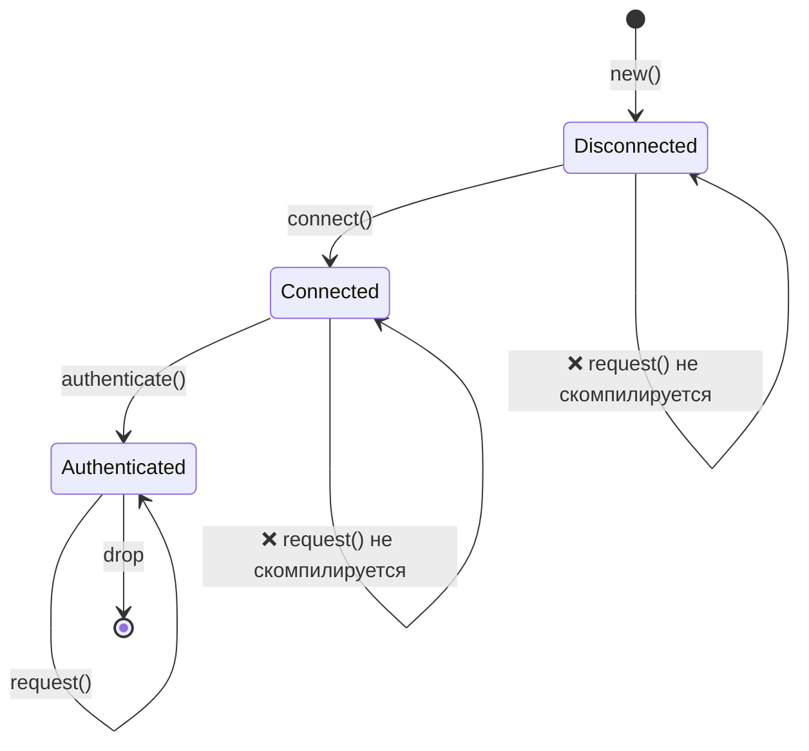
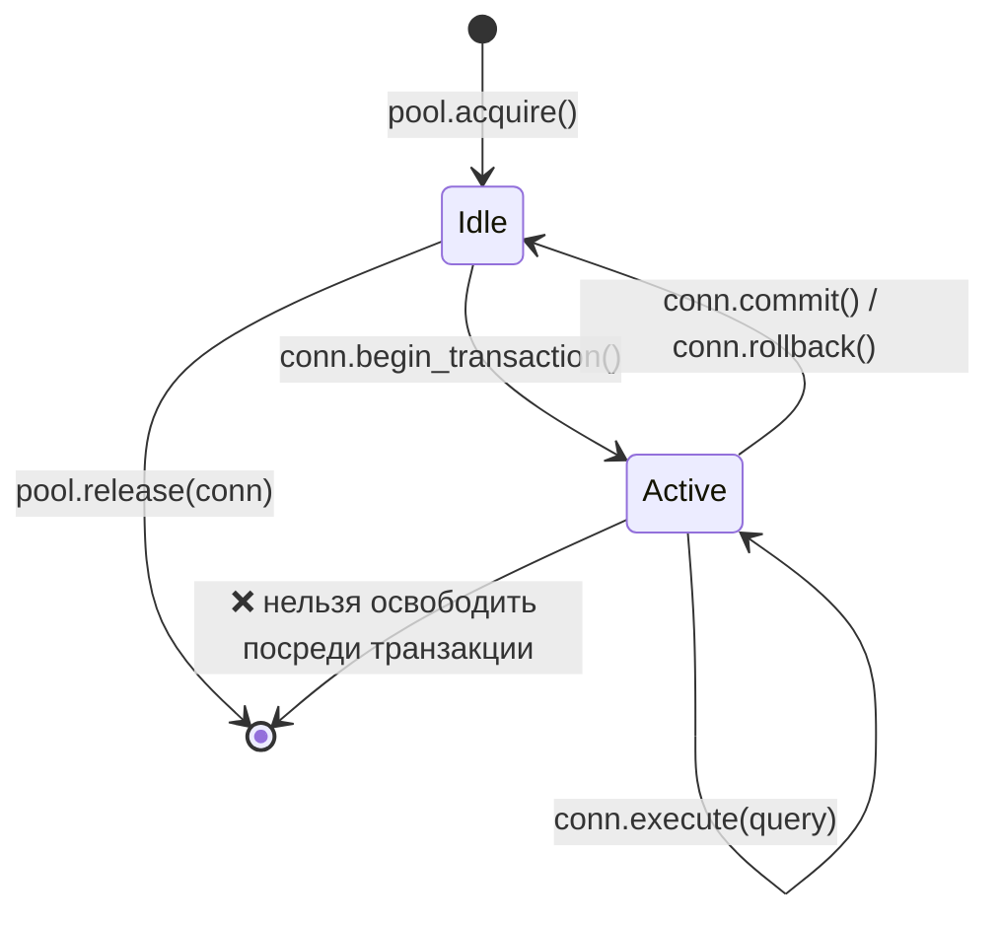
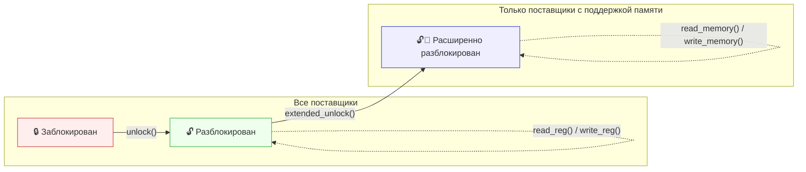
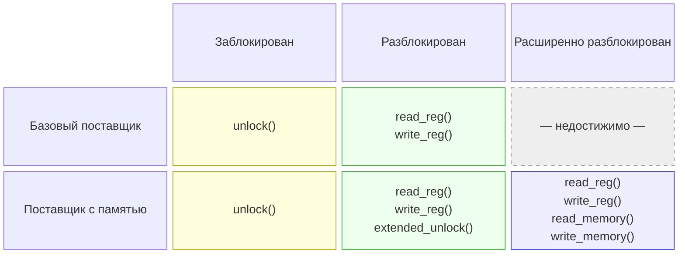

# 3. Паттерны newtype и type-state 🟡

> **Что вы узнаете:**
> - Паттерн newtype для безопасности типов на этапе компиляции без накладных расходов
> - Паттерн type-state: как сделать недопустимые переходы между состояниями невыразимыми
> - Builder-паттерн с type-state для конструирования, которое проверяет компилятор
> - Паттерн конфигурационного трейта для борьбы с разрастанием обобщённых параметров

## Newtype: безопасность типов без накладных расходов

Паттерн newtype оборачивает существующий тип в кортежную структуру с одним полем, создавая отдельный тип без накладных расходов во время выполнения:

```rust
// Без newtype легко перепутать аргументы:
fn create_user(name: String, email: String, age: u32, employee_id: u32) { }
// create_user(name, email, age, id);  — а что, если поменять местами age и id?
// create_user(name, email, id, age);  — КОМПИЛИРУЕТСЯ БЕЗ ОШИБОК, НО ЭТО БАГ

// С newtype компилятор ловит ошибки:
struct UserName(String);
struct Email(String);
struct Age(u32);
struct EmployeeId(u32);

fn create_user(name: UserName, email: Email, age: Age, id: EmployeeId) { }
// create_user(name, email, EmployeeId(42), Age(30));
// ❌ Compile error: expected Age, got EmployeeId
```

### `impl Deref` для newtype: возможности и подводные камни

Реализация `Deref` для newtype позволяет автоматически приводить его к ссылке на внутренний тип и получать все методы внутреннего типа «бесплатно»:

```rust
use std::ops::Deref;

struct Email(String);

impl Email {
    fn new(raw: &str) -> Result<Self, &'static str> {
        if raw.contains('@') {
            Ok(Email(raw.to_string()))
        } else {
            Err("некорректный email: нет символа @")
        }
    }
}

impl Deref for Email {
    type Target = str;
    fn deref(&self) -> &str { &self.0 }
}

// Теперь Email автоматически разыменовывается в &str:
let email = Email::new("user@example.com").unwrap();
println!("Длина: {}", email.len()); // Использует str::len через Deref
```

Это удобно, но фактически **пробивает брешь** в границе абстракции вашего newtype: каждый метод целевого типа становится доступен и у вашей обёртки.

#### Когда `Deref` УМЕСТЕН

| Сценарий | Пример | Почему это нормально |
|----------|--------|----------------------|
| Обёртки-умные указатели | `Box<T>`, `Arc<T>`, `MutexGuard<T>` | Единственная задача обёртки — вести себя как `T` |
| Прозрачные «тонкие» обёртки | `String` → `str`, `PathBuf` → `Path`, `Vec<T>` → `[T]` | Обёртка является расширенной версией целевого типа |
| Ваш newtype по сути и есть внутренний тип | `struct Hostname(String)`, где всегда нужны все строковые операции | Ограничение API не принесёт пользы |

#### Когда `Deref` — антипаттерн

| Сценарий | Проблема |
|----------|----------|
| **Доменные типы с инвариантами** | `Email` разыменовывается в `&str`, поэтому вызывающий код может вызвать `.split_at()`, `.trim()` и т. д. Ни один из них не сохраняет инвариант «должен содержать @». Если кто-то сохранит обрезанный `&str` и соберёт объект заново, инвариант будет потерян. |
| **Типы, для которых нужен ограниченный API** | `struct Password(String)` с `Deref<Target = str>` открывает `.as_bytes()`, `.chars()` и вывод `Debug`: ровно то, что вы пытаетесь скрыть. |
| **Имитация наследования** | Использование `Deref`, чтобы `ManagerWidget` автоматически разыменовывался в `Widget`, имитирует наследование из ООП. Это прямо не рекомендуется: см. Rust API Guidelines (C-DEREF). |

> **Практическое правило**: если ваш newtype существует, чтобы *добавить безопасность типов* или *ограничить API*, не реализуйте `Deref`. Если же он нужен, чтобы *добавить возможности*, сохранив полный интерфейс внутреннего типа (как умный указатель), `Deref` будет правильным выбором.

#### `DerefMut` удваивает риск

Если вы также реализуете `DerefMut`, вызывающий код может *изменять* внутреннее значение напрямую, минуя любые проверки в конструкторах:

```rust
use std::ops::{Deref, DerefMut};

struct PortNumber(u16);

impl Deref for PortNumber {
    type Target = u16;
    fn deref(&self) -> &u16 { &self.0 }
}

impl DerefMut for PortNumber {
    fn deref_mut(&mut self) -> &mut u16 { &mut self.0 }
}

let mut port = PortNumber(443);
*port = 0; // Обходит любую проверку — теперь порт некорректен
```

Реализуйте `DerefMut` только тогда, когда у внутреннего типа нет инвариантов, которые нужно защищать.

#### Лучше использовать явное делегирование

Если нужны лишь *некоторые* методы внутреннего типа, делегируйте их явно:

```rust
struct Email(String);

impl Email {
    fn new(raw: &str) -> Result<Self, &'static str> {
        if raw.contains('@') { Ok(Email(raw.to_string())) }
        else { Err("нет символа @") }
    }

    // Открываем только то, что имеет смысл:
    pub fn as_str(&self) -> &str { &self.0 }
    pub fn len(&self) -> usize { self.0.len() }
    pub fn domain(&self) -> &str {
        self.0.split('@').nth(1).unwrap_or("")
    }
    // .split_at(), .trim(), .replace() — НЕ открыты
}
```

#### Clippy и экосистема

- **`clippy::wrong_self_convention`** может сработать, когда приведение через `Deref` делает разрешение методов неожиданным (например, `is_empty()` разрешается в версию внутреннего типа, а не в ту, которую вы хотели переопределить).
- **Rust API Guidelines** (C-DEREF) утверждают: *«только умные указатели должны реализовывать `Deref`»*. Считайте это сильным правилом по умолчанию и отступайте от него, только имея веское обоснование.
- Если нужна совместимость с трейтами (например, передать `Email` в функции, которые ожидают `&str`), рассмотрите реализацию `AsRef<str>` и `Borrow<str>`. Это явные преобразования без сюрпризов автоматического приведения.

#### Матрица решений

```text
Нужны ли ВСЕ методы внутреннего типа?
  ├─ ДА → Использует ли ваш тип инварианты или ограничивает API?
  │    ├─ НЕТ → impl Deref ✅  (умный указатель / прозрачная обёртка)
  │    └─ ДА  → Не реализуйте Deref ❌ (инвариант протекает)
  └─ НЕТ → Не реализуйте Deref ❌  (используйте AsRef / явное делегирование)
```

### Type-State: принуждение к протоколу на этапе компиляции

Паттерн type-state использует систему типов, чтобы гарантировать, что операции выполняются в правильном порядке. Недопустимые состояния становятся **невыразимыми**.



> Каждый переход *поглощает* `self` и возвращает новый тип. Компилятор следит за правильным порядком.

```rust
// Проблема: сетевое соединение должно пройти шаги:
// 1. Создание
// 2. Подключение
// 3. Аутентификация
// 4. И только потом использование для запросов
// Вызов request() до authenticate() должен быть ОШИБКОЙ КОМПИЛЯЦИИ.

// --- Маркеры состояний (типы нулевого размера) ---
struct Disconnected;
struct Connected;
struct Authenticated;

// --- Соединение, параметризованное состоянием ---
struct Connection<State> {
    address: String,
    _state: std::marker::PhantomData<State>,
}

// Только отключённые соединения могут подключаться:
impl Connection<Disconnected> {
    fn new(address: &str) -> Self {
        Connection {
            address: address.to_string(),
            _state: std::marker::PhantomData,
        }
    }

    fn connect(self) -> Connection<Connected> {
        println!("Подключение к {}...", self.address);
        Connection {
            address: self.address,
            _state: std::marker::PhantomData,
        }
    }
}

// Только подключённые соединения могут аутентифицироваться:
impl Connection<Connected> {
    fn authenticate(self, _token: &str) -> Connection<Authenticated> {
        println!("Аутентификация...");
        Connection {
            address: self.address,
            _state: std::marker::PhantomData,
        }
    }
}

// Только аутентифицированные соединения могут отправлять запросы:
impl Connection<Authenticated> {
    fn request(&self, path: &str) -> String {
        format!("GET {} с {}", path, self.address)
    }
}

fn main() {
    let conn = Connection::new("api.example.com");
    // conn.request("/data"); // ❌ Compile error: no method `request` on Connection<Disconnected>

    let conn = conn.connect();
    // conn.request("/data"); // ❌ Compile error: no method `request` on Connection<Connected>

    let conn = conn.authenticate("secret-token");
    let response = conn.request("/data"); // ✅ Работает только после аутентификации
    println!("{response}");
}
```

> **Ключевая мысль**: каждый переход состояния *поглощает* `self` и возвращает новый тип. После перехода использовать старое состояние нельзя: это обеспечивает компилятор. Затрат во время выполнения нет: `PhantomData` имеет нулевой размер, а состояния стираются на этапе компиляции.

**Сравнение с C++ и C#**: там это обеспечивают проверками во время выполнения (`if (!authenticated) throw ...`). Паттерн type-state переносит такие проверки на этап компиляции: недопустимые состояния буквально невыразимы в системе типов.

### Builder-паттерн с type-state

Практическое применение: builder, который требует заполнения обязательных полей.

```rust
use std::marker::PhantomData;

// Маркерные типы для обязательных полей
struct NeedsName;
struct NeedsPort;
struct Ready;

struct ServerConfig<State> {
    name: Option<String>,
    port: Option<u16>,
    max_connections: usize, // Необязательное поле, есть значение по умолчанию
    _state: PhantomData<State>,
}

impl ServerConfig<NeedsName> {
    fn new() -> Self {
        ServerConfig {
            name: None,
            port: None,
            max_connections: 100,
            _state: PhantomData,
        }
    }

    fn name(self, name: &str) -> ServerConfig<NeedsPort> {
        ServerConfig {
            name: Some(name.to_string()),
            port: self.port,
            max_connections: self.max_connections,
            _state: PhantomData,
        }
    }
}

impl ServerConfig<NeedsPort> {
    fn port(self, port: u16) -> ServerConfig<Ready> {
        ServerConfig {
            name: self.name,
            port: Some(port),
            max_connections: self.max_connections,
            _state: PhantomData,
        }
    }
}

impl ServerConfig<Ready> {
    fn max_connections(mut self, n: usize) -> Self {
        self.max_connections = n;
        self
    }

    fn build(self) -> Server {
        Server {
            name: self.name.unwrap(),
            port: self.port.unwrap(),
            max_connections: self.max_connections,
        }
    }
}

struct Server {
    name: String,
    port: u16,
    max_connections: usize,
}

fn main() {
    // Сначала обязательно задаём имя, затем порт, и только после этого можно собирать:
    let server = ServerConfig::new()
        .name("my-server")
        .port(8080)
        .max_connections(500)
        .build();

    // ServerConfig::new().port(8080); // ❌ Compile error: no method `port` on NeedsName
    // ServerConfig::new().name("x").build(); // ❌ Compile error: no method `build` on NeedsPort
}
```

***

## Пример: типобезопасный пул соединений

Реальным системам нужны пулы соединений, в которых соединения проходят через чётко определённые состояния. Вот как паттерн typestate обеспечивает корректность в промышленном пуле:



```rust
use std::marker::PhantomData;

// Состояния
struct Idle;
struct InTransaction;

struct PooledConnection<State> {
    id: u32,
    _state: PhantomData<State>,
}

struct Pool {
    next_id: u32,
}

impl Pool {
    fn new() -> Self { Pool { next_id: 0 } }

    fn acquire(&mut self) -> PooledConnection<Idle> {
        self.next_id += 1;
        println!("[pool] Получено соединение #{}", self.next_id);
        PooledConnection { id: self.next_id, _state: PhantomData }
    }

    // Освобождать можно только простаивающие соединения: это предотвращает утечки посреди транзакции
    fn release(&self, conn: PooledConnection<Idle>) {
        println!("[pool] Возвращено соединение #{}", conn.id);
    }
}

impl PooledConnection<Idle> {
    fn begin_transaction(self) -> PooledConnection<InTransaction> {
        println!("[conn #{}] BEGIN", self.id);
        PooledConnection { id: self.id, _state: PhantomData }
    }
}

impl PooledConnection<InTransaction> {
    fn execute(&self, query: &str) {
        println!("[conn #{}] EXEC: {}", self.id, query);
    }

    fn commit(self) -> PooledConnection<Idle> {
        println!("[conn #{}] COMMIT", self.id);
        PooledConnection { id: self.id, _state: PhantomData }
    }

    fn rollback(self) -> PooledConnection<Idle> {
        println!("[conn #{}] ROLLBACK", self.id);
        PooledConnection { id: self.id, _state: PhantomData }
    }
}

fn main() {
    let mut pool = Pool::new();

    let conn = pool.acquire();
    let conn = conn.begin_transaction();
    conn.execute("INSERT INTO users VALUES ('Alice')");
    conn.execute("INSERT INTO orders VALUES (1, 42)");
    let conn = conn.commit(); // Снова Idle
    pool.release(conn);       // ✅ Работает только с соединениями в состоянии Idle

    // pool.release(conn_active); // ❌ Compile error: can't release InTransaction
}
```

**Почему это важно на практике**: соединение, утёкшее посреди транзакции, удерживает блокировки базы данных бесконечно. Паттерн typestate делает такую утечку невозможной: вернуть соединение в пул нельзя, пока транзакция не будет зафиксирована (commit) или откатана (rollback).

***

## Паттерн конфигурационного трейта: укрощаем разрастание обобщённых параметров

### Проблема

По мере того как структура получает всё больше обязанностей, каждая из которых опирается на обобщённый параметр с ограничением трейтом, сигнатура типа становится громоздкой:

```rust
trait SpiBus   { fn spi_transfer(&self, tx: &[u8], rx: &mut [u8]) -> Result<(), BusError>; }
trait ComPort  { fn com_send(&self, data: &[u8]) -> Result<usize, BusError>; }
trait I3cBus   { fn i3c_read(&self, addr: u8, buf: &mut [u8]) -> Result<(), BusError>; }
trait SmBus    { fn smbus_read_byte(&self, addr: u8, cmd: u8) -> Result<u8, BusError>; }
trait GpioBus  { fn gpio_set(&self, pin: u32, high: bool); }

// ❌ Каждый новый трейт шины добавляет ещё один обобщённый параметр
struct DiagController<S: SpiBus, C: ComPort, I: I3cBus, M: SmBus, G: GpioBus> {
    spi: S,
    com: C,
    i3c: I,
    smbus: M,
    gpio: G,
}
// Блоки impl, сигнатуры функций и вызывающий код повторяют весь список.
// Добавление шестой шины потребует правки каждого упоминания DiagController<S, C, I, M, G>.
```

Это часто называют **«взрывом обобщённых параметров»** (generic parameter explosion). Он усугубляется в блоках `impl`, параметрах функций и у потребителей, каждый из которых вынужден повторять полный список параметров.

### Решение: конфигурационный трейт

Объедините все ассоциированные типы в один трейт. Тогда у структуры будет **один** обобщённый параметр, сколько бы компонентов она ни содержала:

```rust
#[derive(Debug)]
enum BusError {
    Timeout,
    NakReceived,
    HardwareFault(String),
}

// --- Трейты шин (без изменений) ---
trait SpiBus {
    fn spi_transfer(&self, tx: &[u8], rx: &mut [u8]) -> Result<(), BusError>;
    fn spi_write(&self, data: &[u8]) -> Result<(), BusError>;
}

trait ComPort {
    fn com_send(&self, data: &[u8]) -> Result<usize, BusError>;
    fn com_recv(&self, buf: &mut [u8], timeout_ms: u32) -> Result<usize, BusError>;
}

trait I3cBus {
    fn i3c_read(&self, addr: u8, buf: &mut [u8]) -> Result<(), BusError>;
    fn i3c_write(&self, addr: u8, data: &[u8]) -> Result<(), BusError>;
}

// --- Конфигурационный трейт: один ассоциированный тип на компонент ---
trait BoardConfig {
    type Spi: SpiBus;
    type Com: ComPort;
    type I3c: I3cBus;
}

// --- У DiagController ровно ОДИН обобщённый параметр ---
struct DiagController<Cfg: BoardConfig> {
    spi: Cfg::Spi,
    com: Cfg::Com,
    i3c: Cfg::I3c,
}
```

`DiagController<Cfg>` больше никогда не получит новый обобщённый параметр. Добавление четвёртой шины означает добавление одного ассоциированного типа в `BoardConfig` и одного поля в `DiagController`, без изменения зависимых сигнатур.

### Реализация контроллера

```rust
impl<Cfg: BoardConfig> DiagController<Cfg> {
    fn new(spi: Cfg::Spi, com: Cfg::Com, i3c: Cfg::I3c) -> Self {
        DiagController { spi, com, i3c }
    }

    fn read_flash_id(&self) -> Result<u32, BusError> {
        let cmd = [0x9F]; // JEDEC Read ID
        let mut id = [0u8; 4];
        self.spi.spi_transfer(&cmd, &mut id)?;
        Ok(u32::from_be_bytes(id))
    }

    fn send_bmc_command(&self, cmd: &[u8]) -> Result<Vec<u8>, BusError> {
        self.com.com_send(cmd)?;
        let mut resp = vec![0u8; 256];
        let n = self.com.com_recv(&mut resp, 1000)?;
        resp.truncate(n);
        Ok(resp)
    }

    fn read_sensor_temp(&self, sensor_addr: u8) -> Result<i16, BusError> {
        let mut buf = [0u8; 2];
        self.i3c.i3c_read(sensor_addr, &mut buf)?;
        Ok(i16::from_be_bytes(buf))
    }

    fn run_full_diag(&self) -> Result<DiagReport, BusError> {
        let flash_id = self.read_flash_id()?;
        let bmc_resp = self.send_bmc_command(b"VERSION\n")?;
        let cpu_temp = self.read_sensor_temp(0x48)?;
        let gpu_temp = self.read_sensor_temp(0x49)?;

        Ok(DiagReport {
            flash_id,
            bmc_version: String::from_utf8_lossy(&bmc_resp).to_string(),
            cpu_temp_c: cpu_temp,
            gpu_temp_c: gpu_temp,
        })
    }
}

#[derive(Debug)]
struct DiagReport {
    flash_id: u32,
    bmc_version: String,
    cpu_temp_c: i16,
    gpu_temp_c: i16,
}
```

### Сборка для продакшена

Один `impl BoardConfig` выбирает конкретные драйверы оборудования:
```rust
struct PlatformSpi  { dev: String, speed_hz: u32 }
struct UartCom      { dev: String, baud: u32 }
struct LinuxI3c     { dev: String }

impl SpiBus for PlatformSpi {
    fn spi_transfer(&self, tx: &[u8], rx: &mut [u8]) -> Result<(), BusError> {
        // ioctl(SPI_IOC_MESSAGE) в продакшене
        rx[0..4].copy_from_slice(&[0xEF, 0x40, 0x18, 0x00]);
        Ok(())
    }
    fn spi_write(&self, _data: &[u8]) -> Result<(), BusError> { Ok(()) }
}

impl ComPort for UartCom {
    fn com_send(&self, _data: &[u8]) -> Result<usize, BusError> { Ok(0) }
    fn com_recv(&self, buf: &mut [u8], _timeout: u32) -> Result<usize, BusError> {
        let resp = b"BMC v2.4.1\n";
        buf[..resp.len()].copy_from_slice(resp);
        Ok(resp.len())
    }
}

impl I3cBus for LinuxI3c {
    fn i3c_read(&self, _addr: u8, buf: &mut [u8]) -> Result<(), BusError> {
        buf[0] = 0x00; buf[1] = 0x2D; // 45°C
        Ok(())
    }
    fn i3c_write(&self, _addr: u8, _data: &[u8]) -> Result<(), BusError> { Ok(()) }
}

// ✅ Одна структура, одна реализация: все конкретные типы определяются здесь
struct ProductionBoard;
impl BoardConfig for ProductionBoard {
    type Spi = PlatformSpi;
    type Com = UartCom;
    type I3c = LinuxI3c;
}

fn main() {
    let ctrl = DiagController::<ProductionBoard>::new(
        PlatformSpi { dev: "/dev/spidev0.0".into(), speed_hz: 10_000_000 },
        UartCom     { dev: "/dev/ttyS0".into(),     baud: 115200 },
        LinuxI3c    { dev: "/dev/i3c-0".into() },
    );
    let report = ctrl.run_full_diag().unwrap();
    println!("{report:#?}");
}
```

### Подключение тестов с моками

Замените весь аппаратный слой, определив другой `BoardConfig`:

```rust
struct MockSpi  { flash_id: [u8; 4] }
struct MockCom  { response: Vec<u8> }
struct MockI3c  { temps: std::collections::HashMap<u8, i16> }

impl SpiBus for MockSpi {
    fn spi_transfer(&self, _tx: &[u8], rx: &mut [u8]) -> Result<(), BusError> {
        rx[..4].copy_from_slice(&self.flash_id);
        Ok(())
    }
    fn spi_write(&self, _data: &[u8]) -> Result<(), BusError> { Ok(()) }
}

impl ComPort for MockCom {
    fn com_send(&self, _data: &[u8]) -> Result<usize, BusError> { Ok(0) }
    fn com_recv(&self, buf: &mut [u8], _timeout: u32) -> Result<usize, BusError> {
        let n = self.response.len().min(buf.len());
        buf[..n].copy_from_slice(&self.response[..n]);
        Ok(n)
    }
}

impl I3cBus for MockI3c {
    fn i3c_read(&self, addr: u8, buf: &mut [u8]) -> Result<(), BusError> {
        let temp = self.temps.get(&addr).copied().unwrap_or(0);
        buf[..2].copy_from_slice(&temp.to_be_bytes());
        Ok(())
    }
    fn i3c_write(&self, _addr: u8, _data: &[u8]) -> Result<(), BusError> { Ok(()) }
}

struct TestBoard;
impl BoardConfig for TestBoard {
    type Spi = MockSpi;
    type Com = MockCom;
    type I3c = MockI3c;
}

#[cfg(test)]
mod tests {
    use super::*;

    fn make_test_controller() -> DiagController<TestBoard> {
        let mut temps = std::collections::HashMap::new();
        temps.insert(0x48, 45i16);
        temps.insert(0x49, 72i16);

        DiagController::<TestBoard>::new(
            MockSpi  { flash_id: [0xEF, 0x40, 0x18, 0x00] },
            MockCom  { response: b"BMC v2.4.1\n".to_vec() },
            MockI3c  { temps },
        )
    }

    #[test]
    fn test_flash_id() {
        let ctrl = make_test_controller();
        assert_eq!(ctrl.read_flash_id().unwrap(), 0xEF401800);
    }

    #[test]
    fn test_sensor_temps() {
        let ctrl = make_test_controller();
        assert_eq!(ctrl.read_sensor_temp(0x48).unwrap(), 45);
        assert_eq!(ctrl.read_sensor_temp(0x49).unwrap(), 72);
    }

    #[test]
    fn test_full_diag() {
        let ctrl = make_test_controller();
        let report = ctrl.run_full_diag().unwrap();
        assert_eq!(report.flash_id, 0xEF401800);
        assert_eq!(report.cpu_temp_c, 45);
        assert_eq!(report.gpu_temp_c, 72);
        assert!(report.bmc_version.contains("2.4.1"));
    }
}
```

### Добавление новой шины позже

Когда понадобится четвёртая шина, меняются только две вещи: `BoardConfig` и `DiagController`. **Зависимые сигнатуры не меняются.** Число обобщённых параметров остаётся равным одному:

```rust
trait SmBus {
    fn smbus_read_byte(&self, addr: u8, cmd: u8) -> Result<u8, BusError>;
}

// 1. Добавляем один ассоциированный тип:
trait BoardConfig {
    type Spi: SpiBus;
    type Com: ComPort;
    type I3c: I3cBus;
    type Smb: SmBus;     // ← новое
}

// 2. Добавляем одно поле:
struct DiagController<Cfg: BoardConfig> {
    spi: Cfg::Spi,
    com: Cfg::Com,
    i3c: Cfg::I3c,
    smb: Cfg::Smb,       // ← новое
}

// 3. Указываем конкретный тип в каждой реализации конфигурации:
impl BoardConfig for ProductionBoard {
    type Spi = PlatformSpi;
    type Com = UartCom;
    type I3c = LinuxI3c;
    type Smb = LinuxSmbus; // ← новое
}
```

### Когда использовать этот паттерн

| Ситуация | Использовать конфигурационный трейт? | Альтернатива |
|----------|:-:|---|
| У структуры 3 и более обобщённых параметров с ограничениями трейтами | ✅ Да | — |
| Нужно заменить весь аппаратный слой или платформу целиком | ✅ Да | — |
| Только 1–2 обобщённых параметра | ❌ Избыточно | Прямые обобщённые параметры |
| Нужен полиморфизм во время выполнения | ❌ | Трейт-объекты `dyn Trait` |
| Открытая система плагинов | ❌ | Карта типов / `Any` |
| Трейты компонентов естественно образуют группу (плата, платформа) | ✅ Да | — |

### Ключевые свойства

- **Один обобщённый параметр навсегда**: `DiagController<Cfg>` никогда не получит новых `<A, B, C, ...>`
- **Полностью статическая диспетчеризация**: никаких vtable, `dyn` и выделений памяти в куче для трейт-объектов
- **Чистая подмена в тестах**: определите `TestBoard` с моками, без условной компиляции
- **Безопасность на этапе компиляции**: забыли ассоциированный тип → ошибка компиляции, а не падение во время выполнения
- **Проверено на практике**: именно этот паттерн использует система frame в Substrate/Polkadot, чтобы управлять более чем 20 ассоциированными типами через один трейт `Config`

> **Ключевые выводы: newtype и type-state**
> - Newtype даёт безопасность типов на этапе компиляции без затрат во время выполнения
> - Type-state превращает недопустимые переходы состояний в ошибку компиляции, а не в ошибку времени выполнения
> - Конфигурационные трейты укрощают разрастание обобщённых параметров в больших системах

> **См. также:** [гл. 4 — PhantomData](ch04-phantomdata-types-that-carry-no-data.md) — нулевые маркеры, на которых держится type-state. [гл. 2 — Трейты в деталях](ch02-traits-in-depth.md) — ассоциированные типы в паттерне конфигурационного трейта.

---

## Пример: двухосевой typestate (поставщик × состояние протокола)

Описанные выше паттерны работают по одной оси за раз: typestate обеспечивает *порядок протокола*, а абстракция через трейты справляется с *несколькими поставщиками*. Реальным системам часто нужны **обе вещи одновременно**: обёртка `Handle<Vendor, State>`, в которой доступные методы зависят от того, *какой поставщик* подключён, **и** от того, *в каком состоянии* находится дескриптор.

В этом разделе показан паттерн **условного `impl` по двум осям**: блоки `impl` ограничиваются одновременно границей трейта поставщика и маркерным трейтом состояния.

### Двумерная задача

Рассмотрим интерфейс отладочного зонда (JTAG/SWD). Зонды выпускают разные поставщики, и каждый зонд нужно разблокировать, прежде чем станут доступны регистры. Некоторые поставщики дополнительно поддерживают прямое чтение памяти, но только после *расширенной разблокировки*, которая настраивает порт доступа к памяти:



**Матрица возможностей**, то есть какие методы существуют для каждой комбинации (поставщик, состояние), двумерна:



Задача: выразить эту матрицу **полностью на этапе компиляции** со статической диспетчеризацией, чтобы вызов `extended_unlock()` у базового зонда или `read_memory()` у разблокированного, но не расширенно разблокированного дескриптора был ошибкой компиляции.

### Решение: `Jtag<V, S>` с маркерными трейтами

**Шаг 1: токены состояний и маркеры возможностей:**

```rust,ignore
use std::marker::PhantomData;

// Токены состояний нулевого размера: без затрат во время выполнения
struct Locked;
struct Unlocked;
struct ExtendedUnlocked;

// Маркерные трейты описывают, какие возможности есть у каждого состояния
trait HasRegAccess {}
impl HasRegAccess for Unlocked {}
impl HasRegAccess for ExtendedUnlocked {}

trait HasMemAccess {}
impl HasMemAccess for ExtendedUnlocked {}
```

> **Почему маркерные трейты, а не просто конкретные состояния?**
> Запись `impl<V, S: HasRegAccess> Jtag<V, S>` означает, что `read_reg()` работает в *любом* состоянии с доступом к регистрам. Сегодня это `Unlocked` и `ExtendedUnlocked`, но если завтра добавить `DebugHalted`, достаточно одной строки: `impl HasRegAccess for DebugHalted {}`. Каждая функция для регистров станет работать с ним автоматически, без изменений в коде.

**Шаг 2: трейты поставщиков (низкоуровневые операции):**
```rust,ignore
// Каждый поставщик зондов реализует эти методы
trait JtagVendor {
    fn raw_unlock(&mut self);
    fn raw_read_reg(&self, addr: u32) -> u32;
    fn raw_write_reg(&mut self, addr: u32, val: u32);
}

// Поставщики с доступом к памяти дополнительно реализуют этот супертрейт
trait JtagMemoryVendor: JtagVendor {
    fn raw_extended_unlock(&mut self);
    fn raw_read_memory(&self, addr: u64, buf: &mut [u8]);
    fn raw_write_memory(&mut self, addr: u64, data: &[u8]);
}
```

**Шаг 3: обёртка с условными блоками `impl`:**

```rust,ignore
struct Jtag<V, S = Locked> {
    vendor: V,
    _state: PhantomData<S>,
}

// Конструирование: всегда начинается в состоянии Locked
impl<V: JtagVendor> Jtag<V, Locked> {
    fn new(vendor: V) -> Self {
        Jtag { vendor, _state: PhantomData }
    }

    fn unlock(mut self) -> Jtag<V, Unlocked> {
        self.vendor.raw_unlock();
        Jtag { vendor: self.vendor, _state: PhantomData }
    }
}

// Ввод-вывод регистров: любой поставщик, любое состояние с HasRegAccess
impl<V: JtagVendor, S: HasRegAccess> Jtag<V, S> {
    fn read_reg(&self, addr: u32) -> u32 {
        self.vendor.raw_read_reg(addr)
    }
    fn write_reg(&mut self, addr: u32, val: u32) {
        self.vendor.raw_write_reg(addr, val);
    }
}

// Расширенная разблокировка: только поставщики с памятью, только из Unlocked
impl<V: JtagMemoryVendor> Jtag<V, Unlocked> {
    fn extended_unlock(mut self) -> Jtag<V, ExtendedUnlocked> {
        self.vendor.raw_extended_unlock();
        Jtag { vendor: self.vendor, _state: PhantomData }
    }
}

// Ввод-вывод памяти: только поставщики с памятью, только в состоянии ExtendedUnlocked
impl<V: JtagMemoryVendor, S: HasMemAccess> Jtag<V, S> {
    fn read_memory(&self, addr: u64, buf: &mut [u8]) {
        self.vendor.raw_read_memory(addr, buf);
    }
    fn write_memory(&mut self, addr: u64, data: &[u8]) {
        self.vendor.raw_write_memory(addr, data);
    }
}
```

Каждый блок `impl` кодирует одну ячейку (или строку) матрицы возможностей. Компилятор обеспечивает соблюдение матрицы: никаких проверок во время выполнения.

### Реализации поставщиков

Добавление поставщика означает реализацию низкоуровневых методов в **одной структуре**: без дублирования структур для каждого состояния и без шаблонного кода делегирования:

```rust,ignore
// Поставщик A: базовый зонд, только доступ к регистрам
struct BasicProbe { port: u16 }

impl JtagVendor for BasicProbe {
    fn raw_unlock(&mut self)                    { /* последовательность TAP reset */ }
    fn raw_read_reg(&self, addr: u32) -> u32    { /* DR scan */  0 }
    fn raw_write_reg(&mut self, addr: u32, val: u32) { /* DR scan */ }
}
// BasicProbe НЕ реализует JtagMemoryVendor.
// extended_unlock() не скомпилируется для Jtag<BasicProbe, _>.

// Поставщик B: полнофункциональный зонд, регистры и память
struct DapProbe { serial: String }

impl JtagVendor for DapProbe {
    fn raw_unlock(&mut self)                    { /* переключение на SWD, чтение DPIDR */ }
    fn raw_read_reg(&self, addr: u32) -> u32    { /* чтение регистра AP */ 0 }
    fn raw_write_reg(&mut self, addr: u32, val: u32) { /* запись регистра AP */ }
}

impl JtagMemoryVendor for DapProbe {
    fn raw_extended_unlock(&mut self)           { /* выбор MEM-AP, включение питания */ }
    fn raw_read_memory(&self, addr: u64, buf: &mut [u8])  { /* чтение MEM-AP */ }
    fn raw_write_memory(&mut self, addr: u64, data: &[u8]) { /* запись MEM-AP */ }
}
```

### Что предотвращает компилятор

| Попытка | Ошибка | Причина |
|---------|--------|---------|
| `Jtag<_, Locked>::read_reg()` | no method `read_reg` | `Locked` не реализует `HasRegAccess` |
| `Jtag<BasicProbe, _>::extended_unlock()` | no method `extended_unlock` | `BasicProbe` не реализует `JtagMemoryVendor` |
| `Jtag<_, Unlocked>::read_memory()` | no method `read_memory` | `Unlocked` не реализует `HasMemAccess` |
| Двойной вызов `unlock()` | value used after move | `unlock()` поглощает `self` |

Все четыре ошибки обнаруживаются **на этапе компиляции**. Никаких паник, никакого `Option` и никакого перечисления состояний во время выполнения.

### Написание обобщённых функций

Функции привязываются только к тем осям, которые им важны:

```rust,ignore
/// Работает с ЛЮБЫМ поставщиком и ЛЮБЫМ состоянием, которое даёт доступ к регистрам.
fn read_idcode<V: JtagVendor, S: HasRegAccess>(jtag: &Jtag<V, S>) -> u32 {
    jtag.read_reg(0x00)
}

/// Компилируется только для поставщиков с памятью в состоянии ExtendedUnlocked.
fn dump_firmware<V: JtagMemoryVendor, S: HasMemAccess>(jtag: &Jtag<V, S>) {
    let mut buf = [0u8; 256];
    jtag.read_memory(0x0800_0000, &mut buf);
}
```

`read_idcode` не важно, находитесь ли вы в `Unlocked` или `ExtendedUnlocked`: ему нужен только `HasRegAccess`. Здесь маркерные трейты окупаются по сравнению с жёсткой фиксацией конкретных состояний в сигнатурах.

### Тот же паттерн в другой предметной области: бэкенды хранилища

Приём с двумя осями не привязан к аппаратуре. Вот та же структура для слоя хранения, где некоторые бэкенды поддерживают транзакции:

```rust,ignore
// Состояния
struct Closed;
struct Open;
struct InTransaction;

trait HasReadWrite {}
impl HasReadWrite for Open {}
impl HasReadWrite for InTransaction {}

// Трейты поставщиков
trait StorageBackend {
    fn raw_open(&mut self);
    fn raw_read(&self, key: &[u8]) -> Option<Vec<u8>>;
    fn raw_write(&mut self, key: &[u8], value: &[u8]);
}

trait TransactionalBackend: StorageBackend {
    fn raw_begin(&mut self);
    fn raw_commit(&mut self);
    fn raw_rollback(&mut self);
}

// Обёртка
struct Store<B, S = Closed> { backend: B, _s: PhantomData<S> }

impl<B: StorageBackend> Store<B, Closed> {
    fn open(mut self) -> Store<B, Open> { self.backend.raw_open(); /* ... */ todo!() }
}
impl<B: StorageBackend, S: HasReadWrite> Store<B, S> {
    fn read(&self, key: &[u8]) -> Option<Vec<u8>>  { self.backend.raw_read(key) }
    fn write(&mut self, key: &[u8], val: &[u8])    { self.backend.raw_write(key, val) }
}
impl<B: TransactionalBackend> Store<B, Open> {
    fn begin(mut self) -> Store<B, InTransaction>   { /* ... */ todo!() }
}
impl<B: TransactionalBackend> Store<B, InTransaction> {
    fn commit(mut self) -> Store<B, Open>           { /* ... */ todo!() }
    fn rollback(mut self) -> Store<B, Open>         { /* ... */ todo!() }
}
```

Бэкенд на плоских файлах реализует только `StorageBackend`, поэтому `begin()` не скомпилируется. Бэкенд базы данных добавляет `TransactionalBackend`, и становится доступен полный цикл `Open → InTransaction → Open`.

### Когда прибегать к этому паттерну

| Признак | Почему подходит двухосевой паттерн |
|---------|------------------------------------|
| Две независимые оси: «кто предоставляет» и «в каком состоянии» | Матрица блоков `impl` напрямую кодирует обе оси |
| У одних поставщиков строго больше возможностей, чем у других | Супертрейт (`MemoryVendor: Vendor`) и условный `impl` |
| Неправильное использование состояния или возможности — ошибка безопасности или корректности | Предотвращение на этапе компиляции важнее проверок во время выполнения |
| Нужна статическая диспетчеризация (без vtable) | `PhantomData` + обобщения = без накладных расходов |

| Признак | Что рассмотреть проще |
|---------|-----------------------|
| Меняется только одна ось (состояние ИЛИ поставщик, но не обе) | Одноосевой typestate или обычные трейт-объекты |
| Три и более независимых осей | Конфигурационный трейт (выше) объединяет оси в ассоциированные типы |
| Допустим полиморфизм во время выполнения | Состояние в виде `enum` и диспетчеризация через `dyn` проще |

> **Когда осей становится три и больше:**
> Если вы обнаруживаете, что пишете `Handle<V, S, D, T>` (поставщик, состояние, уровень отладки, транспорт), то список обобщённых параметров говорит сам за себя. Подумайте о том, чтобы свернуть ось *поставщика* в конфигурационный трейт с ассоциированными типами (см. [Паттерн конфигурационного трейта](#паттерн-конфигурационного-трейта-укрощаем-разрастание-обобщённых-параметров) выше в этой главе), оставив ось *состояния* обобщённым параметром: `Handle<Cfg, S>`. Конфигурационный трейт объединяет `type Vendor`, `type Transport` и т. д. в один параметр, а ось состояния сохраняет гарантии переходов на этапе компиляции. Это естественная эволюция, а не переписывание: вы переносите типы, связанные с поставщиком, в `Cfg`, а механизм typestate не трогаете.

> **Ключевой вывод:** двухосевой паттерн — это пересечение typestate и абстракции на основе трейтов. Каждый блок `impl` соответствует одной ячейке матрицы (поставщик × состояние). Компилятор обеспечивает соблюдение всей матрицы: никаких проверок состояния во время выполнения, никаких паник из-за невозможного состояния и никаких затрат.

---

### Упражнение: типобезопасный автомат состояний ★★ (~30 минут)

Постройте автомат состояний светофора с помощью паттерна type-state. Свет должен переходить `Red → Green → Yellow → Red`, и никакой другой порядок не должен быть возможен.

<details>
<summary>🔑 Решение</summary>

```rust
use std::marker::PhantomData;

struct Red;
struct Green;
struct Yellow;

struct TrafficLight<State> {
    _state: PhantomData<State>,
}

impl TrafficLight<Red> {
    fn new() -> Self {
        println!("🔴 Красный — СТОП");
        TrafficLight { _state: PhantomData }
    }

    fn go(self) -> TrafficLight<Green> {
        println!("🟢 Зелёный — ВПЕРЁД");
        TrafficLight { _state: PhantomData }
    }
}

impl TrafficLight<Green> {
    fn caution(self) -> TrafficLight<Yellow> {
        println!("🟡 Жёлтый — ВНИМАНИЕ");
        TrafficLight { _state: PhantomData }
    }
}

impl TrafficLight<Yellow> {
    fn stop(self) -> TrafficLight<Red> {
        println!("🔴 Красный — СТОП");
        TrafficLight { _state: PhantomData }
    }
}

fn main() {
    let light = TrafficLight::new(); // Красный
    let light = light.go();          // Зелёный
    let light = light.caution();     // Жёлтый
    let _light = light.stop();       // Красный

    // light.caution(); // ❌ Compile error: no method `caution` on Red
    // TrafficLight::new().stop(); // ❌ Compile error: no method `stop` on Red
}
```

**Ключевой вывод**: недопустимые переходы — это ошибки компиляции, а не паники во время выполнения.

</details>

***
