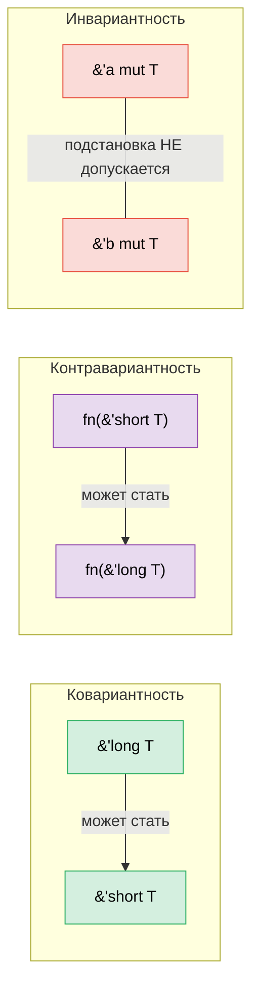

# 4. PhantomData — типы, которые не несут данных 🔴

> **Что вы узнаете:**
> - Зачем нужен `PhantomData<T>` и три проблемы, которые он решает
> - Маркировка времён жизни (lifetime branding) для проверки области действия на этапе компиляции
> - Паттерн «единицы измерения» для арифметики с проверкой размерностей
> - Вариантность (ковариантность, контравариантность, инвариантность) и то, как ею управляет PhantomData

## Что решает PhantomData

`PhantomData<T>` — это тип нулевого размера, который сообщает компилятору: «эта структура логически связана с `T`, хотя самого `T` она не содержит». Он влияет на вариантность, проверку drop и автоматический вывод auto-трейтов, не занимая при этом памяти.

```rust
use std::marker::PhantomData;

// Без PhantomData:
struct Slice<'a, T> {
    ptr: *const T,
    len: usize,
    // Проблема: компилятор не знает, что эта структура заимствует данные из 'a,
    // и не учитывает связь с T при проверке drop
}

// С PhantomData:
struct Slice<'a, T> {
    ptr: *const T,
    len: usize,
    _marker: PhantomData<&'a T>,
    // Теперь компилятор знает:
    // 1. Эта структура заимствует данные с временем жизни 'a
    // 2. Она ковариантна по 'a (времена жизни могут сокращаться)
    // 3. Проверка drop учитывает T
}
```

**Три задачи PhantomData**:

| Задача | Пример | Что делает |
|--------|--------|-----------|
| **Привязка времени жизни** | `PhantomData<&'a T>` | Структура считается заимствующей `'a` |
| **Имитация владения** | `PhantomData<T>` | Проверка drop считает, что структура владеет `T` |
| **Управление вариантностью** | `PhantomData<fn(T)>` | Делает структуру контравариантной по `T` |

### Маркировка времени жизни (lifetime branding)

Используйте `PhantomData`, чтобы не допустить смешивания значений из разных «сессий» или «контекстов»:

```rust
use std::marker::PhantomData;

/// Дескриптор, действительный только в пределах времени жизни конкретной арены
struct ArenaHandle<'arena> {
    index: usize,
    _brand: PhantomData<&'arena ()>,
}

struct Arena {
    data: Vec<String>,
}

impl Arena {
    fn new() -> Self {
        Arena { data: Vec::new() }
    }

    /// Выделяет строку и возвращает дескриптор с маркером арены
    fn alloc<'a>(&'a mut self, value: String) -> ArenaHandle<'a> {
        let index = self.data.len();
        self.data.push(value);
        ArenaHandle { index, _brand: PhantomData }
    }

    /// Поиск по дескриптору: принимает только дескрипторы ЭТОЙ арены
    fn get<'a>(&'a self, handle: ArenaHandle<'a>) -> &'a str {
        &self.data[handle.index]
    }
}

fn main() {
    let mut arena1 = Arena::new();
    let handle1 = arena1.alloc("hello".to_string());

    // С другой ареной handle1 использовать нельзя: времена жизни не совпадут
    // let mut arena2 = Arena::new();
    // arena2.get(handle1); // ❌ Lifetime mismatch

    println!("{}", arena1.get(handle1)); // ✅
}
```

### Паттерн «единицы измерения»

Предотвращайте смешивание несовместимых единиц на этапе компиляции без затрат во время выполнения:

```rust
use std::marker::PhantomData;
use std::ops::{Add, Mul};

// Маркерные типы единиц (нулевого размера)
struct Meters;
struct Seconds;
struct MetersPerSecond;

#[derive(Debug, Clone, Copy)]
struct Quantity<Unit> {
    value: f64,
    _unit: PhantomData<Unit>,
}

impl<U> Quantity<U> {
    fn new(value: f64) -> Self {
        Quantity { value, _unit: PhantomData }
    }
}

// Складывать можно только одинаковые единицы:
impl<U> Add for Quantity<U> {
    type Output = Quantity<U>;
    fn add(self, rhs: Self) -> Self::Output {
        Quantity::new(self.value + rhs.value)
    }
}

// Метры / секунды = метры в секунду (собственная реализация трейта)
impl std::ops::Div<Quantity<Seconds>> for Quantity<Meters> {
    type Output = Quantity<MetersPerSecond>;
    fn div(self, rhs: Quantity<Seconds>) -> Quantity<MetersPerSecond> {
        Quantity::new(self.value / rhs.value)
    }
}

fn main() {
    let dist = Quantity::<Meters>::new(100.0);
    let time = Quantity::<Seconds>::new(9.58);
    let speed = dist / time; // Quantity<MetersPerSecond>
    println!("Скорость: {:.2} м/с", speed.value); // 10.44 м/с

    // let nonsense = dist + time; // ❌ Compile error: can't add Meters + Seconds
}
```

> **Это чистая магия системы типов**: `PhantomData<Meters>` имеет нулевой размер, поэтому `Quantity<Meters>` имеет ту же раскладку в памяти, что и `f64`. Во время выполнения никаких накладных расходов на обёртку, но полная проверка единиц на этапе компиляции.

### PhantomData и проверка drop

Когда компилятор проверяет, не может ли деструктор структуры обратиться к уже недействительным данным, он использует `PhantomData`, чтобы принять решение:

```rust
use std::marker::PhantomData;

// PhantomData<T>: компилятор считает, что мы МОЖЕМ удалить T
// Это значит, что T должен жить дольше нашей структуры
struct OwningSemantic<T> {
    ptr: *const T,
    _marker: PhantomData<T>,  // «Логически я владею T»
}

// PhantomData<*const T>: компилятор считает, что мы НЕ владеем T
// Более либерально: T не обязан жить дольше нас
struct NonOwningSemantic<T> {
    ptr: *const T,
    _marker: PhantomData<*const T>,  // «Я лишь указываю на T»
}
```

**Практическое правило**: при обёртывании сырых указателей выбирайте PhantomData внимательно:
- Пишете контейнер, который владеет своими данными? → `PhantomData<T>`
- Пишете тип-представление (view) или ссылку? → `PhantomData<&'a T>` или `PhantomData<*const T>`

### Вариантность: почему важен параметр типа в PhantomData

**Вариантность** определяет, можно ли подставить вместо обобщённого типа его подтип или надтип (в Rust «подтип» означает «время жизни длиннее»). Ошибка в вариантности приводит либо к отклонению корректного кода, либо к принятию небезопасного.



#### Три вариантности

| Вариантность | Смысл | «Можно ли подставить…» | Пример в Rust |
|--------------|-------|------------------------|---------------|
| **Ковариантность** | Подтип передаётся по направлению | `'long` там, где ожидается `'short` ✅ | `&'a T`, `Vec<T>`, `Box<T>` |
| **Контравариантность** | Подтип передаётся *против* направления | `'short` там, где ожидается `'long` ✅ | `fn(T)` (в позиции параметра) |
| **Инвариантность** | Подстановка не допускается | Ни в одну сторону ✅ | `&mut T`, `Cell<T>`, `UnsafeCell<T>` |

#### Почему `&'a T` ковариантна по `'a`

```rust
fn print_str(s: &str) {
    println!("{s}");
}

fn main() {
    let owned = String::from("hello");
    // owned живёт всё время выполнения функции ('long)
    // print_str ожидает &'_ str ('short: только на время вызова)
    print_str(&owned); // ✅ Ковариантность: 'long → 'short безопасно
    // Ссылка с более долгим временем жизни всегда может использоваться там, где нужна более короткая.
}
```

#### Почему `&mut T` инвариантна по `T`

```rust
// Если бы &mut T была ковариантна по T, этот код скомпилировался бы:
fn evil(s: &mut &'static str) {
    // Мы могли бы записать в слот &'static str ссылку с более коротким временем жизни!
    let local = String::from("temporary");
    // *s = &local; // ← Создал бы висячий &'static str
}

// Инвариантность запрещает это: &'static str ≠ &'a str при мутации.
// Компилятор полностью отклоняет подстановку.
```

#### Как PhantomData управляет вариантностью

`PhantomData<X>` придаёт вашей структуре **ту же вариантность, что и у `X`**:

```rust
use std::marker::PhantomData;

// Ковариантна по 'a: Ref<'long> можно использовать как Ref<'short>
struct Ref<'a, T> {
    ptr: *const T,
    _marker: PhantomData<&'a T>,  // Ковариантна по 'a, ковариантна по T
}

// Инвариантна по T: предотвращает небезопасное сокращение времени жизни T
struct MutRef<'a, T> {
    ptr: *mut T,
    _marker: PhantomData<&'a mut T>,  // Ковариантна по 'a, ИНВАРИАНТНА по T
}

// Контравариантна по T: полезна для контейнеров callback-функций
struct CallbackSlot<T> {
    _marker: PhantomData<fn(T)>,  // Контравариантна по T
}
```

**Шпаргалка по вариантности PhantomData**:

| Тип PhantomData | Вариантность по `T` | Вариантность по `'a` | Когда использовать |
|-----------------|---------------------|----------------------|--------------------|
| `PhantomData<T>` | Ковариантна | — | Вы логически владеете `T` |
| `PhantomData<&'a T>` | Ковариантна | Ковариантна | Вы заимствуете `T` со временем жизни `'a` |
| `PhantomData<&'a mut T>` | **Инвариантна** | Ковариантна | Вы заимствуете `T` изменяемо |
| `PhantomData<*const T>` | Ковариантна | — | Невладеющий указатель на `T` |
| `PhantomData<*mut T>` | **Инвариантна** | — | Невладеющий изменяемый указатель |
| `PhantomData<fn(T)>` | **Контравариантна** | — | `T` находится в позиции аргумента |
| `PhantomData<fn() -> T>` | Ковариантна | — | `T` находится в позиции возвращаемого значения |
| `PhantomData<fn(T) -> T>` | **Инвариантна** | — | `T` в обеих позициях: ковариантность и контравариантность уравновешивают друг друга |

#### Пример: почему это важно на практике

```rust
use std::marker::PhantomData;

// Токен, который помечает значения временем жизни сессии.
// ДОЛЖЕН быть ковариантен по 'a, иначе вызывающий код не сможет сократить
// время жизни при передаче в функции, которым нужно более короткое заимствование.
struct SessionToken<'a> {
    id: u64,
    _brand: PhantomData<&'a ()>,  // ✅ Ковариантна: вызывающий код может сократить 'a
    // _brand: PhantomData<fn(&'a ())>,  // ❌ Контравариантна: ломает эргономику
    // _brand: PhantomData<&'a mut ()>;  // ❌ Инвариантна по (): слишком ограничительно
}

fn use_token(token: &SessionToken<'_>) {
    println!("Используем токен {}", token.id);
}

fn main() {
    let token = SessionToken { id: 42, _brand: PhantomData };
    use_token(&token); // ✅ Работает, потому что SessionToken ковариантна по 'a
}
```

> **Правило выбора**: начинайте с `PhantomData<&'a T>` (ковариантна). Переходите к `PhantomData<&'a mut T>` (инвариантна), только если ваша абстракция выдаёт изменяемый доступ к `T`. `PhantomData<fn(T)>` (контравариантна) почти никогда не нужна: она корректна только в сценариях хранения callback-функций.

> **Ключевые выводы: PhantomData**
> - `PhantomData<T>` несёт информацию о типе и времени жизни без затрат во время выполнения
> - Используйте его для маркировки времён жизни, управления вариантностью и паттерна единиц измерения
> - Проверка drop: `PhantomData<T>` сообщает компилятору, что ваш тип логически владеет `T`

> **См. также:** [гл. 3 — Newtype и type-state](ch03-the-newtype-and-type-state-patterns.md) — паттерны type-state, которые используют PhantomData. [гл. 12 — Unsafe Rust](ch12-unsafe-rust-controlled-danger.md) — о том, как PhantomData взаимодействует с сырыми указателями.

---

### Упражнение: единицы измерения с PhantomData ★★ (~30 минут)

Расширьте паттерн единиц измерения, чтобы он поддерживал:
- `Meters`, `Seconds`, `Kilograms`
- сложение одинаковых единиц
- умножение: `Meters * Meters = SquareMeters`
- деление: `Meters / Seconds = MetersPerSecond`

<details>
<summary>🔑 Решение</summary>

```rust
use std::marker::PhantomData;
use std::ops::{Add, Mul, Div};

#[derive(Clone, Copy)]
struct Meters;
#[derive(Clone, Copy)]
struct Seconds;
#[derive(Clone, Copy)]
struct Kilograms;
#[derive(Clone, Copy)]
struct SquareMeters;
#[derive(Clone, Copy)]
struct MetersPerSecond;

#[derive(Debug, Clone, Copy)]
struct Qty<U> {
    value: f64,
    _unit: PhantomData<U>,
}

impl<U> Qty<U> {
    fn new(v: f64) -> Self { Qty { value: v, _unit: PhantomData } }
}

impl<U> Add for Qty<U> {
    type Output = Qty<U>;
    fn add(self, rhs: Self) -> Self::Output { Qty::new(self.value + rhs.value) }
}

impl Mul<Qty<Meters>> for Qty<Meters> {
    type Output = Qty<SquareMeters>;
    fn mul(self, rhs: Qty<Meters>) -> Qty<SquareMeters> {
        Qty::new(self.value * rhs.value)
    }
}

impl Div<Qty<Seconds>> for Qty<Meters> {
    type Output = Qty<MetersPerSecond>;
    fn div(self, rhs: Qty<Seconds>) -> Qty<MetersPerSecond> {
        Qty::new(self.value / rhs.value)
    }
}

fn main() {
    let width = Qty::<Meters>::new(5.0);
    let height = Qty::<Meters>::new(3.0);
    let area = width * height; // Qty<SquareMeters>
    println!("Площадь: {:.1} м²", area.value);

    let dist = Qty::<Meters>::new(100.0);
    let time = Qty::<Seconds>::new(9.58);
    let speed = dist / time;
    println!("Скорость: {:.2} м/с", speed.value);

    let sum = width + height; // Одинаковые единицы ✅
    println!("Сумма: {:.1} м", sum.value);

    // let bad = width + time; // ❌ Compile error: can't add Meters + Seconds
}
```

</details>

***
