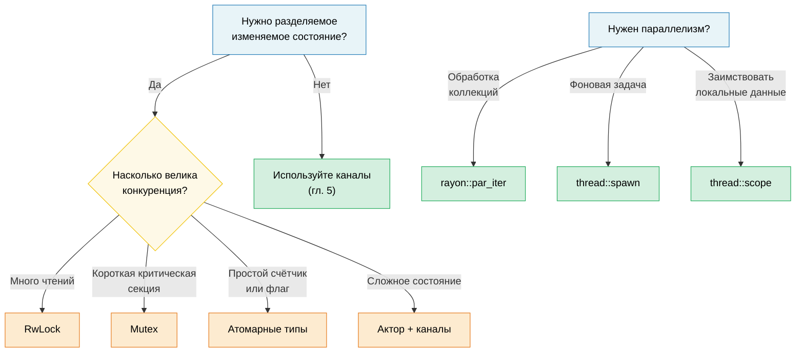

# 6. Конкурентность, параллелизм и потоки 🟡

> **Что вы узнаете:**
> - Точное различие между конкурентностью и параллелизмом
> - Потоки ОС, scoped-потоки и rayon для параллелизма по данным
> - Примитивы разделяемого состояния: Arc, Mutex, RwLock, атомарные типы, Condvar
> - Ленивая инициализация через OnceLock/LazyLock и паттерны без блокировок

## Терминология: конкурентность ≠ параллелизм

Эти термины часто путают. Вот точное различие:

| | Конкурентность | Параллелизм |
|---|---|---|
| **Определение** | Управление несколькими задачами, которые могут продвигаться вперёд | Одновременное выполнение нескольких задач |
| **Требование к железу** | Достаточно одного ядра | Нужно несколько ядер |
| **Аналогия** | Один повар, много блюд (переключается между ними) | Несколько поваров, каждый готовит своё блюдо |
| **Инструменты Rust** | `async/await`, каналы, `select!` | `rayon`, `thread::spawn`, `par_iter()` |

```text
Конкурентность (одно ядро):          Параллелизм (несколько ядер):

Задача A: ██░░██░░██                 Задача A: ██████████
Задача B: ░░██░░██░░                 Задача B: ██████████
─────────────────→ время             ─────────────────→ время
(чередуются на одном ядре)           (выполняются одновременно на двух ядрах)
```

### std::thread: потоки ОС

Потоки Rust соответствуют потокам ОС один к одному. У каждого из них свой стек (обычно 2–8 МБ):

```rust
use std::thread;
use std::time::Duration;

fn main() {
    // Запускаем поток: принимает замыкание
    let handle = thread::spawn(|| {
        for i in 0..5 {
            println!("порождённый поток: {i}");
            thread::sleep(Duration::from_millis(100));
        }
        42 // Возвращаемое значение
    });

    // Одновременно работаем в главном потоке
    for i in 0..3 {
        println!("главный поток: {i}");
        thread::sleep(Duration::from_millis(150));
    }

    // Ждём завершения потока и получаем его возвращаемое значение
    let result = handle.join().unwrap(); // unwrap запаникует, если поток упал
    println!("Поток вернул: {result}");
}
```

**Требования к типам в `Thread::spawn`**:

```rust
// Замыкание должно быть:
// 1. Send: может быть передано в другой поток
// 2. 'static: не может заимствовать данные из вызывающей области видимости
// 3. FnOnce: забирает владение захваченными переменными

let data = vec![1, 2, 3];

// ❌ Заимствует data — не 'static
// thread::spawn(|| println!("{data:?}"));

// ✅ Передаём владение в поток
thread::spawn(move || println!("{data:?}"));
// data здесь больше недоступна
```

### Scoped-потоки (std::thread::scope)

Начиная с Rust 1.63, scoped-потоки снимают требование `'static`: потоки могут заимствовать данные из родительской области видимости:

```rust
use std::thread;

fn main() {
    let mut data = vec![1, 2, 3, 4, 5];

    thread::scope(|s| {
        // Поток 1: заимствуем разделяемую ссылку
        s.spawn(|| {
            let sum: i32 = data.iter().sum();
            println!("Сумма: {sum}");
        });

        // Поток 2: тоже заимствует разделяемую ссылку (несколько читателей — это нормально)
        s.spawn(|| {
            let max = data.iter().max().unwrap();
            println!("Максимум: {max}");
        });

        // ❌ Нельзя взять изменяемую ссылку, пока существуют разделяемые заимствования:
        // s.spawn(|| data.push(6));
    });
    // ВСЕ scoped-потоки завершаются здесь: гарантированно до возврата из scope

    // Теперь безопасно менять данные: все потоки завершены
    data.push(6);
    println!("Обновлено: {data:?}");
}
```

> **Это большое улучшение**: до scoped-потоков всё, что нужно было разделить с потоками, приходилось клонировать через `Arc::clone()`. Теперь можно заимствовать данные напрямую, а компилятор доказывает, что все потоки завершатся до того, как данные выйдут из области видимости.

### rayon: параллелизм по данным

`rayon` предоставляет параллельные итераторы, которые автоматически распределяют работу по пулу потоков:

```rust,ignore
// Cargo.toml: rayon = "1"
use rayon::prelude::*;

fn main() {
    let data: Vec<u64> = (0..1_000_000).collect();

    // Последовательно:
    let sum_seq: u64 = data.iter().map(|x| x * x).sum();

    // Параллельно: достаточно заменить .iter() на .par_iter()
    let sum_par: u64 = data.par_iter().map(|x| x * x).sum();

    assert_eq!(sum_seq, sum_par);

    // Параллельная сортировка:
    let mut numbers = vec![5, 2, 8, 1, 9, 3];
    numbers.par_sort();

    // Параллельная обработка через map/filter/collect:
    let results: Vec<_> = data
        .par_iter()
        .filter(|&&x| x % 2 == 0)
        .map(|&x| expensive_computation(x))
        .collect();
}

fn expensive_computation(x: u64) -> u64 {
    // Имитация вычислений, требующих много ресурсов CPU
    (0..1000).fold(x, |acc, _| acc.wrapping_mul(7).wrapping_add(13))
}
```

**Когда использовать rayon, а когда потоки**:

| Инструмент | Когда |
|------------|-------|
| `rayon::par_iter()` | Параллельная обработка коллекций (map, filter, reduce) |
| `thread::spawn` | Долгоживущие фоновые задачи, рабочие потоки для I/O |
| `thread::scope` | Короткоживущие параллельные задачи, которые заимствуют локальные данные |
| `async` + `tokio` | Конкурентность, ограниченная I/O (сеть, файловый ввод-вывод) |

### Разделяемое состояние: Arc, Mutex, RwLock, атомарные типы

Когда потокам нужно разделяемое изменяемое состояние, Rust предоставляет безопасные абстракции:

```rust
use std::sync::{Arc, Mutex, RwLock};
use std::sync::atomic::{AtomicU64, Ordering};
use std::thread;

// --- Arc<Mutex<T>>: разделяемый и эксклюзивный доступ ---
fn mutex_example() {
    let counter = Arc::new(Mutex::new(0u64));
    let mut handles = vec![];

    for _ in 0..10 {
        let counter = Arc::clone(&counter);
        handles.push(thread::spawn(move || {
            for _ in 0..1000 {
                let mut guard = counter.lock().unwrap();
                *guard += 1;
            } // Защитник уничтожен → блокировка снята
        }));
    }

    for h in handles { h.join().unwrap(); }
    println!("Счётчик: {}", counter.lock().unwrap()); // 10000
}

// --- Arc<RwLock<T>>: несколько читателей ИЛИ один писатель ---
fn rwlock_example() {
    let config = Arc::new(RwLock::new(String::from("initial")));

    // Много читателей: не блокируют друг друга
    let readers: Vec<_> = (0..5).map(|id| {
        let config = Arc::clone(&config);
        thread::spawn(move || {
            let guard = config.read().unwrap();
            println!("Читатель {id}: {guard}");
        })
    }).collect();

    // Писатель: ждёт, пока завершатся все читатели
    {
        let mut guard = config.write().unwrap();
        *guard = "updated".to_string();
    }

    for r in readers { r.join().unwrap(); }
}

// --- Атомарные типы: без блокировок для простых значений ---
fn atomic_example() {
    let counter = Arc::new(AtomicU64::new(0));
    let mut handles = vec![];

    for _ in 0..10 {
        let counter = Arc::clone(&counter);
        handles.push(thread::spawn(move || {
            for _ in 0..1000 {
                counter.fetch_add(1, Ordering::Relaxed);
                // Без блокировки и мьютекса: аппаратная атомарная инструкция
            }
        }));
    }

    for h in handles { h.join().unwrap(); }
    println!("Атомарный счётчик: {}", counter.load(Ordering::Relaxed)); // 10000
}
```

### Краткое сравнение

| Примитив | Сценарий | Стоимость | Конкуренция |
|----------|----------|-----------|-------------|
| `Mutex<T>` | Короткие критические секции | Захват и освобождение | Потоки стоят в очереди |
| `RwLock<T>` | Много чтений, редкая запись | Блокировка «читатель — писатель» | Читатели работают одновременно, писатель эксклюзивен |
| `AtomicU64` и др. | Счётчики, флаги | Аппаратный CAS | Без блокировок, без ожидания |
| Каналы | Передача сообщений | Операции с очередью | Производитель и потребитель разделены |

### Условные переменные (`Condvar`)

`Condvar` позволяет потоку **ждать**, пока другой поток не сообщит, что условие выполнено, без активного опроса (busy-loop). Он всегда используется вместе с `Mutex`:

```rust
use std::sync::{Arc, Mutex, Condvar};
use std::thread;

let pair = Arc::new((Mutex::new(false), Condvar::new()));
let pair2 = Arc::clone(&pair);

// Порождённый поток: ждём, пока ready == true
let handle = thread::spawn(move || {
    let (lock, cvar) = &*pair2;
    let mut ready = lock.lock().unwrap();
    while !*ready {
        ready = cvar.wait(ready).unwrap(); // атомарно снимает блокировку и засыпает
    }
    println!("Рабочий: условие выполнено, продолжаем");
});

// Главный поток: выставляем ready = true и сигнализируем
{
    let (lock, cvar) = &*pair;
    let mut ready = lock.lock().unwrap();
    *ready = true;
    cvar.notify_one(); // будим один ждущий поток (для многих используйте notify_all)
}
handle.join().unwrap();
```

> **Шаблон**: после возврата из `wait()` всегда перепроверяйте условие в цикле `while`, потому что ОС допускает ложные пробуждения (spurious wakeups).

### Ленивая инициализация: OnceLock и LazyLock

До Rust 1.80 для инициализации глобальной `static`-переменной, которой нужны вычисления во время выполнения (например, разбор конфигурации или компиляция регулярного выражения), требовался макрос `lazy_static!` или крейт `once_cell`. Теперь стандартная библиотека предоставляет два типа, которые покрывают эти сценарии без внешних зависимостей:

```rust
use std::sync::{OnceLock, LazyLock};
use std::collections::HashMap;

// OnceLock: инициализация при первом использовании через `get_or_init`.
// Полезно, когда начальное значение зависит от аргументов времени выполнения.
static CONFIG: OnceLock<HashMap<String, String>> = OnceLock::new();

fn get_config() -> &'static HashMap<String, String> {
    CONFIG.get_or_init(|| {
        // Дорогая операция: читаем и разбираем файл конфигурации. Выполняется ровно один раз.
        let mut m = HashMap::new();
        m.insert("log_level".into(), "info".into());
        m
    })
}

// LazyLock: инициализация при первом обращении, замыкание задаётся в месте определения.
// Эквивалент lazy_static!, но без макроса.
static REGEX: LazyLock<regex::Regex> = LazyLock::new(|| {
    regex::Regex::new(r"^[a-zA-Z0-9_]+$").unwrap()
});

fn is_valid_identifier(s: &str) -> bool {
    REGEX.is_match(s) // Первый вызов компилирует регулярное выражение; последующие переиспользуют его.
}
```

| Тип | Стабилизирован | Момент инициализации | Когда использовать |
|-----|----------------|----------------------|--------------------|
| `OnceLock<T>` | Rust 1.70 | В месте вызова (`get_or_init`) | Инициализация зависит от аргументов времени выполнения |
| `LazyLock<T>` | Rust 1.80 | В месте определения (замыкание) | Инициализация самодостаточна |
| `lazy_static!` | — | В месте определения (макрос) | Кодовые базы до 1.80 (лучше мигрировать) |
| `const fn` + `static` | Всегда | На этапе компиляции | Значение вычисляется на этапе компиляции |

> **Совет по миграции**: замените `lazy_static! { static ref X: T = expr; }` на `static X: LazyLock<T> = LazyLock::new(|| expr);`. Семантика та же, но без макроса и без внешней зависимости.

### Паттерны без блокировок

Для высокопроизводительного кода полностью избегайте блокировок:

```rust
use std::sync::atomic::{AtomicBool, AtomicUsize, Ordering};
use std::sync::Arc;

// Паттерн 1: спин-лок (учебный пример, в продакшене используйте std::sync::Mutex)
// ⚠️ ВНИМАНИЕ: это только учебный пример. Настоящим спин-локам нужны:
//   - RAII-защитник (чтобы паника во время удержания не привела к вечной блокировке)
//   - Гарантии справедливости (при конкуренции этот вариант приводит к голоданию)
//   - Стратегии отката (экспоненциальная задержка, передача управления ОС)
// В продакшене используйте std::sync::Mutex или parking_lot::Mutex.
struct SpinLock {
    locked: AtomicBool,
}

impl SpinLock {
    fn new() -> Self { SpinLock { locked: AtomicBool::new(false) } }

    fn lock(&self) {
        while self.locked
            .compare_exchange_weak(false, true, Ordering::Acquire, Ordering::Relaxed)
            .is_err()
        {
            std::hint::spin_loop(); // Подсказка процессору: мы крутимся в цикле
        }
    }

    fn unlock(&self) {
        self.locked.store(false, Ordering::Release);
    }
}

// Паттерн 2: lock-free SPSC (один производитель, один потребитель)
// В продакшене используйте crossbeam::queue::ArrayQueue или аналог;
// писать свою реализацию стоит только для обучения.

// Паттерн 3: счётчик последовательности для чтений без ожидания (wait-free)
// ⚠️ Лучше всего для типов, помещающихся в одно машинное слово (u64, f64).
// Более широкие T могут быть прочитаны «порванными» (tearing).
struct SeqLock<T: Copy> {
    seq: AtomicUsize,
    data: std::cell::UnsafeCell<T>,
}

unsafe impl<T: Copy + Send> Sync for SeqLock<T> {}

impl<T: Copy> SeqLock<T> {
    fn new(val: T) -> Self {
        SeqLock {
            seq: AtomicUsize::new(0),
            data: std::cell::UnsafeCell::new(val),
        }
    }

    fn read(&self) -> T {
        loop {
            let s1 = self.seq.load(Ordering::Acquire);
            if s1 & 1 != 0 { continue; } // Записывающий поток в процессе, повторяем

            // SAFETY: используем ptr::read_volatile, чтобы компилятор не переупорядочивал
            // и не кэшировал чтение. Протокол SeqLock (проверка s1 == s2 после чтения)
            // гарантирует повтор, если писатель был активен.
            // Это повторяет паттерн C SeqLock, где чтение данных должно использовать
            // семантику volatile/relaxed, чтобы избежать «разрыва» значения при конкуренции.
            let value = unsafe { core::ptr::read_volatile(self.data.get() as *const T) };

            // Acquire-барьер: гарантирует, что чтение данных выше упорядочено раньше
            // повторной проверки счётчика последовательности.
            std::sync::atomic::fence(Ordering::Acquire);
            let s2 = self.seq.load(Ordering::Relaxed);

            if s1 == s2 { return value; } // Писатель не вмешался
            // иначе повторяем
        }
    }

    /// # Контракт безопасности
    /// Только ОДИН поток может вызывать `write()` одновременно. Если нужны несколько писателей,
    /// оберните вызов `write()` во внешний `Mutex`.
    fn write(&self, val: T) {
        // Увеличиваем до нечётного значения (сигнал: запись в процессе).
        // AcqRel: сторона Acquire не даёт последующей записи данных
        // переупорядочиться раньше этого инкремента (читатели должны увидеть
        // нечётное значение до того, как смогут наблюдать частичную запись). Сторона
        // Release формально не нужна для единственного писателя, но безвредна и согласована.
        self.seq.fetch_add(1, Ordering::AcqRel);
        unsafe { *self.data.get() = val; }
        // Увеличиваем до чётного значения (сигнал: запись завершена).
        // Release: гарантирует, что запись данных видна раньше, чем читатели увидят чётный номер.
        self.seq.fetch_add(1, Ordering::Release);
    }
}
```

> **⚠️ Оговорка о модели памяти Rust**: неатомарная запись через `UnsafeCell` в `write()`, выполняемая одновременно с неатомарным `ptr::read_volatile` в `read()`, формально является гонкой данных (data race) в абстрактной машине Rust, даже несмотря на то, что протокол SeqLock гарантирует повтор читателями при устаревших данных. Это повторяет паттерн SeqLock из ядра C и на всех современных процессорах корректно на практике для типов `T`, помещающихся в одно машинное слово (например, `u64`). Для более широких типов рассмотрите `AtomicU64` для поля данных или оберните доступ в `Mutex`. Актуальные обсуждения по `UnsafeCell` в конкурентности см. в [рекомендациях Rust по небезопасному коду](https://rust-lang.github.io/unsafe-code-guidelines/).

> **Практический совет**: код без блокировок трудно написать правильно. Используйте `Mutex` или `RwLock`, если профилирование не показывает, что узкое место именно в конкуренции за блокировки. Если блокировки без них действительно не обойтись, берите проверенные крейты (`crossbeam`, `arc-swap`, `dashmap`), а не пишите собственные реализации.

> **Ключевые выводы: конкурентность**
> - Scoped-потоки (`thread::scope`) позволяют заимствовать данные со стека без `Arc`
> - `rayon::par_iter()` распараллеливает итераторы одним вызовом метода
> - Используйте `OnceLock`/`LazyLock` вместо `lazy_static!`; берите `Mutex` раньше, чем атомарные типы
> - Код без блокировок сложен: предпочитайте проверенные крейты собственным реализациям

> **См. также:** [гл. 5 — Каналы](ch05-channels-and-message-passing.md) о конкурентности через передачу сообщений. [гл. 9 — Умные указатели](ch09-smart-pointers-and-interior-mutability.md) о подробностях Arc и Rc.



---

### Упражнение: параллельный map на scoped-потоках ★★ (~25 минут)

Напишите функцию `parallel_map<T, R>(data: &[T], f: fn(&T) -> R, num_threads: usize) -> Vec<R>`, которая делит `data` на `num_threads` частей и обрабатывает каждую часть в scoped-потоке. Не используйте `rayon`, используйте `std::thread::scope`.

<details>
<summary>🔑 Решение</summary>

```rust
fn parallel_map<T: Sync, R: Send>(data: &[T], f: fn(&T) -> R, num_threads: usize) -> Vec<R> {
    let chunk_size = (data.len() + num_threads - 1) / num_threads;
    let mut results = Vec::with_capacity(data.len());

    std::thread::scope(|s| {
        let mut handles = Vec::new();
        for chunk in data.chunks(chunk_size) {
            handles.push(s.spawn(move || {
                chunk.iter().map(f).collect::<Vec<_>>()
            }));
        }
        for h in handles {
            results.extend(h.join().unwrap());
        }
    });

    results
}

fn main() {
    let data: Vec<u64> = (1..=20).collect();
    let squares = parallel_map(&data, |x| x * x, 4);
    assert_eq!(squares, (1..=20).map(|x: u64| x * x).collect::<Vec<_>>());
    println!("Параллельные квадраты: {squares:?}");
}
```

</details>

***
