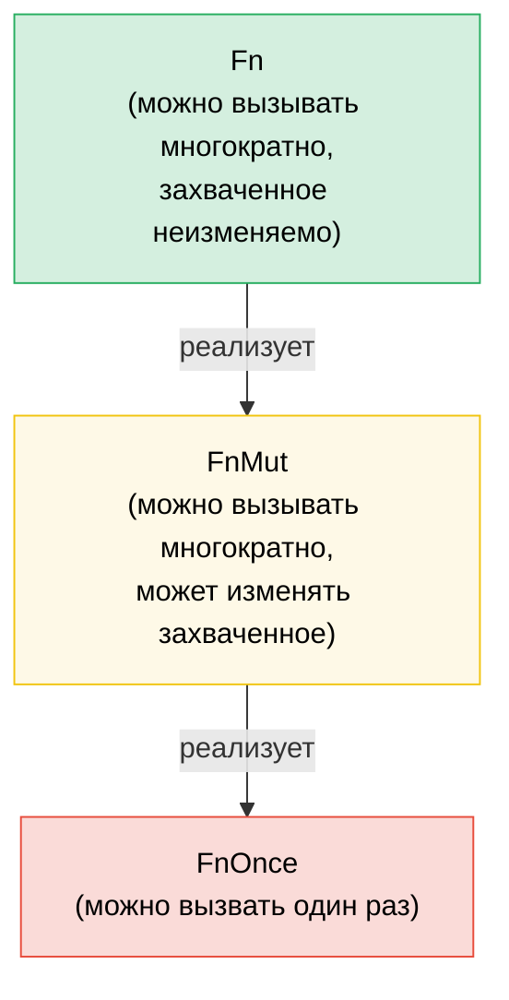

# 7. Замыкания и функции высшего порядка 🟢

> **Что вы узнаете:**
> - Три трейта замыканий (`Fn`, `FnMut`, `FnOnce`) и то, как устроен захват переменных
> - Передачу замыканий в качестве параметров и возврат их из функций
> - Цепочки комбинаторов и адаптеры итераторов для функционального стиля
> - Проектирование собственных API высшего порядка с правильными границами трейтов

## Fn, FnMut, FnOnce: трейты замыканий

Каждое замыкание в Rust реализует один или несколько из трёх трейтов в зависимости от того, как оно захватывает переменные:

```rust
// FnOnce: потребляет захваченные значения (вызвать можно только один раз)
let name = String::from("Alice");
let greet = move || {
    println!("Hello, {name}!"); // Забирает владение `name`
    drop(name); // name потреблено
};
greet(); // ✅ Первый вызов
// greet(); // ❌ Нельзя вызвать снова: `name` уже потреблено

// FnMut: изменяемо заимствует захваченные значения (можно вызывать многократно)
let mut count = 0;
let mut increment = || {
    count += 1; // Изменяемо заимствует `count`
};
increment(); // count == 1
increment(); // count == 2

// Fn: неизменяемо заимствует захваченные значения (можно вызывать многократно и одновременно)
let prefix = "Result";
let display = |x: i32| {
    println!("{prefix}: {x}"); // Неизменяемо заимствует `prefix`
};
display(1);
display(2);
```

**Иерархия**: `Fn` : `FnMut` : `FnOnce`, каждый из них является подтрейтом следующего:

```text
FnOnce  ← любое замыкание можно вызвать хотя бы один раз
 ↑
FnMut   ← можно вызывать многократно (может изменять состояние)
 ↑
Fn      ← можно вызывать многократно и одновременно (без изменения состояния)
```

Если замыкание реализует `Fn`, то оно реализует также `FnMut` и `FnOnce`.

### Замыкания как параметры и возвращаемые значения

```rust
// --- Параметры ---

// Статическая диспетчеризация (мономорфизация, самая быстрая)
fn apply_twice<F: Fn(i32) -> i32>(f: F, x: i32) -> i32 {
    f(f(x))
}

// То же, записанное через impl Trait:
fn apply_twice_v2(f: impl Fn(i32) -> i32, x: i32) -> i32 {
    f(f(x))
}

// Динамическая диспетчеризация (трейт-объект, гибко, с небольшими накладными расходами)
fn apply_dyn(f: &dyn Fn(i32) -> i32, x: i32) -> i32 {
    f(x)
}

// --- Возвращаемые значения ---

// Нельзя вернуть замыкание по значению без упаковки в Box (у него анонимный тип):
fn make_adder(n: i32) -> Box<dyn Fn(i32) -> i32> {
    Box::new(move |x| x + n)
}

// С impl Trait (проще, мономорфизируется, но динамически использовать нельзя):
fn make_adder_v2(n: i32) -> impl Fn(i32) -> i32 {
    move |x| x + n
}

fn main() {
    let double = |x: i32| x * 2;
    println!("{}", apply_twice(double, 3)); // 12

    let add5 = make_adder(5);
    println!("{}", add5(10)); // 15
}
```

### Цепочки комбинаторов и адаптеры итераторов

Функции высшего порядка особенно хороши с итераторами: это идиоматичный Rust:

```rust
// Императивный цикл в стиле C:
let data = vec![1, 2, 3, 4, 5, 6, 7, 8, 9, 10];
let mut result = Vec::new();
for x in &data {
    if x % 2 == 0 {
        result.push(x * x);
    }
}

// Идиоматичный Rust (функциональная цепочка комбинаторов):
let result: Vec<i32> = data.iter()
    .filter(|&&x| x % 2 == 0)
    .map(|&x| x * x)
    .collect();

// Производительность та же: итераторы ленивые и оптимизируются LLVM
assert_eq!(result, vec![4, 16, 36, 64, 100]);
```

**Шпаргалка по распространённым комбинаторам**:

| Комбинатор | Что делает | Пример |
|------------|-----------|--------|
| `.map(f)` | Преобразует каждый элемент | `.map(|x| x * 2)` |
| `.filter(p)` | Оставляет элементы, для которых предикат истинен | `.filter(|x| x > &5)` |
| `.filter_map(f)` | Отображение и фильтрация за один шаг (возвращает `Option`) | `.filter_map(|x| x.parse().ok())` |
| `.flat_map(f)` | Отображение с последующим разворачиванием вложенных итераторов | `.flat_map(|s| s.chars())` |
| `.fold(init, f)` | Свёртка в одно значение (аналог `Aggregate` в C#) | `.fold(0, |acc, x| acc + x)` |
| `.any(p)` / `.all(p)` | Логическая проверка с ранним выходом | `.any(|x| x > 100)` |
| `.enumerate()` | Добавляет индекс | `.enumerate().map(|(i, x)| ...)` |
| `.zip(other)` | Объединяет в пары с другим итератором | `.zip(labels.iter())` |
| `.take(n)` / `.skip(n)` | Первые N элементов / пропуск N элементов | `.take(10)` |
| `.chain(other)` | Конкатенация двух итераторов | `.chain(extra.iter())` |
| `.peekable()` | Заглядывание вперёд без потребления | `.peek()` |
| `.collect()` | Собирает результат в коллекцию | `.collect::<Vec<_>>()` |

### Собственные API высшего порядка

Проектируйте API, которые принимают замыкания для настройки:

```rust
/// Повторяет операцию с настраиваемой стратегией
fn retry<T, E, F, S>(
    mut operation: F,
    mut should_retry: S,
    max_attempts: usize,
) -> Result<T, E>
where
    F: FnMut() -> Result<T, E>,
    S: FnMut(&E, usize) -> bool, // (ошибка, попытка) → повторить ли?
{
    for attempt in 1..=max_attempts {
        match operation() {
            Ok(val) => return Ok(val),
            Err(e) if attempt < max_attempts && should_retry(&e, attempt) => {
                continue;
            }
            Err(e) => return Err(e),
        }
    }
    unreachable!()
}

// Использование: вызывающая сторона управляет логикой повторов:
```

```rust
# fn connect_to_database() -> Result<(), String> { Ok(()) }
# fn http_get(_url: &str) -> Result<String, String> { Ok(String::new()) }
# trait TransientError { fn is_transient(&self) -> bool; }
# impl TransientError for String { fn is_transient(&self) -> bool { true } }
# let url = "http://example.com";
let result = retry(
    || connect_to_database(),
    |err, attempt| {
        eprintln!("Попытка {attempt} не удалась: {err}");
        true // Всегда повторять
    },
    3,
);

// Использование: повторять только определённые ошибки
let result = retry(
    || http_get(url),
    |err, _| err.is_transient(), // Повторять только временные ошибки
    5,
);
```

### Паттерн `with`: доступ к ресурсу в скобках

Иногда нужно гарантировать, что ресурс находится в определённом состоянии на время операции и восстанавливается после неё, независимо от того, как завершился код вызывающей стороны (досрочный выход, `?`, паника). Вместо того чтобы открывать ресурс напрямую и надеяться, что вызывающие не забудут его настроить и откатить, **передайте ресурс через замыкание**:

```text
настройка → вызов замыкания с ресурсом → откат
```

Вызывающий код никогда не трогает настройку и откат. Он не может ничего забыть или сделать неправильно, и не может удерживать ресурс за пределами области действия замыкания.

#### Пример: направление GPIO-пина

Контроллер GPIO управляет пинами, которые поддерживают двунаправленный ввод-вывод. Одним вызывающим нужно, чтобы пин был настроен на ввод, другим на вывод. Вместо того чтобы открывать прямой доступ к пину и надеяться, что вызывающие правильно выставят направление, контроллер предоставляет `with_pin_input` и `with_pin_output`:

```rust
/// Направление GPIO-пина: не публичное, вызывающие никогда не выставляют его напрямую.
#[derive(Debug, Clone, Copy, PartialEq)]
enum Direction { In, Out }

/// Дескриптор GPIO-пина, переданный в замыкание. Его нельзя сохранить или клонировать:
/// он существует только на время вызова callback-функции.
pub struct GpioPin<'a> {
    pin_number: u8,
    _controller: &'a GpioController,
}

impl GpioPin<'_> {
    pub fn read(&self) -> bool {
        // Считываем уровень пина из аппаратного регистра
        println!("  чтение пина {}", self.pin_number);
        true // заглушка
    }

    pub fn write(&self, high: bool) {
        // Устанавливаем уровень пина через аппаратный регистр
        println!("  запись в пин {} = {high}", self.pin_number);
    }
}

pub struct GpioController {
    current_direction: std::cell::Cell<Option<Direction>>,
}

impl GpioController {
    pub fn new() -> Self {
        GpioController {
            current_direction: std::cell::Cell::new(None),
        }
    }

    /// Настраиваем пин на ввод, выполняем замыкание, восстанавливаем состояние.
    /// Вызывающая сторона получает `GpioPin`, который живёт только на время callback-функции.
    pub fn with_pin_input<R>(
        &self,
        pin: u8,
        mut f: impl FnMut(&GpioPin<'_>) -> R,
    ) -> R {
        let prev = self.current_direction.get();
        self.set_direction(pin, Direction::In);
        let handle = GpioPin { pin_number: pin, _controller: self };
        let result = f(&handle);
        // Восстанавливаем предыдущее направление (или оставляем как есть: вопрос политики)
        if let Some(dir) = prev {
            self.set_direction(pin, dir);
        }
        result
    }

    /// Настраиваем пин на вывод, выполняем замыкание, восстанавливаем состояние.
    pub fn with_pin_output<R>(
        &self,
        pin: u8,
        mut f: impl FnMut(&GpioPin<'_>) -> R,
    ) -> R {
        let prev = self.current_direction.get();
        self.set_direction(pin, Direction::Out);
        let handle = GpioPin { pin_number: pin, _controller: self };
        let result = f(&handle);
        if let Some(dir) = prev {
            self.set_direction(pin, dir);
        }
        result
    }

    fn set_direction(&self, pin: u8, dir: Direction) {
        println!("  [hw] пин {pin} → {dir:?}");
        self.current_direction.set(Some(dir));
    }
}

fn main() {
    let gpio = GpioController::new();

    // Вызывающая сторона 1: нужен ввод. Ей не важно и не нужно знать, как управляется направление
    let level = gpio.with_pin_input(4, |pin| {
        pin.read()
    });
    println!("Уровень пина 4: {level}");

    // Вызывающая сторона 2: нужен вывод. Форма API та же, гарантия другая
    gpio.with_pin_output(4, |pin| {
        pin.write(true);
        // делаем другую работу...
        pin.write(false);
    });

    // Нельзя использовать дескриптор пина вне замыкания:
    // let escaped_pin = gpio.with_pin_input(4, |pin| pin);
    // ❌ ERROR: borrowed value does not live long enough
}
```

**Что гарантирует паттерн `with`:**
- Направление **всегда выставляется до** выполнения кода вызывающей стороны
- Направление **всегда восстанавливается после**, даже если замыкание вернуло управление досрочно
- Дескриптор `GpioPin` **не может выйти** за пределы замыкания: заимствующая проверка обеспечивает это через время жизни, привязанное к ссылке на контроллер
- Вызывающим не нужно импортировать `Direction` или вызывать `set_direction`: API невозможно использовать неправильно

#### Где встречается этот паттерн

Паттерн `with` встречается по всей стандартной библиотеке Rust и экосистеме:

| API | Настройка | Замыкание (callback) | Откат |
|-----|-----------|----------------------|-------|
| `std::thread::scope` | Создание области | `\|s\| { s.spawn(...) }` | Ожидание всех потоков |
| `Mutex::lock` | Захват блокировки | Использование `MutexGuard` (RAII, не замыкание, но та же идея) | Освобождение при уничтожении |
| `tempfile::tempdir` | Создание временного каталога | Использование пути | Удаление при уничтожении |
| `std::io::BufWriter::new` | Буферизация записи | Операции записи | Сброс буфера при уничтожении |
| GPIO `with_pin_*` (выше) | Выставление направления | Использование дескриптора пина | Восстановление направления |

Вариант на основе замыканий наиболее эффективен, когда:
- **настройка и откат идут парами**, и пропуск любого из них является ошибкой
- **ресурс не должен жить дольше операции**: заимствующая проверка обеспечивает это естественным образом
- **существует несколько конфигураций** (`with_pin_input` и `with_pin_output`): каждый метод `with_*` инкапсулирует свою настройку и не раскрывает конфигурацию вызывающей стороне

> **`with` и RAII (Drop):** оба варианта гарантируют очистку. Используйте RAII / `Drop`, когда вызывающему нужно удерживать ресурс через несколько инструкций и вызовов функций. Используйте `with`, когда операция **заключена в скобки**: одна настройка, один блок работы, один откат, и вы не хотите, чтобы вызывающий мог нарушить эти скобки.

> **FnMut или Fn в дизайне API**: используйте `FnMut` как границу по умолчанию. Это самый гибкий вариант: вызывающие могут передавать и `Fn`, и `FnMut`. Требуйте `Fn`, только если нужно вызывать замыкание одновременно (например, из нескольких потоков). Требуйте `FnOnce`, только если вызываете его ровно один раз.

> **Ключевые выводы: замыкания**
> - `Fn` заимствует, `FnMut` заимствует изменяемо, `FnOnce` потребляет: принимайте самую слабую границу, которая нужна вашему API
> - `impl Fn` в параметрах, `Box<dyn Fn>` для хранения, `impl Fn` в возвращаемом значении (или `Box<dyn Fn>`, если нужна динамика)
> - Цепочки комбинаторов (`map`, `filter`, `and_then`) чисто компонуются и инлайнятся в плотные циклы
> - Паттерн `with` (доступ в скобках через замыкание) гарантирует настройку и откат и не даёт ресурсу «утечь»: используйте его, когда вызывающий не должен управлять жизненным циклом конфигурации

> **См. также:** [гл. 2 — Трейты в деталях](ch02-traits-in-depth.md) о том, как `Fn`/`FnMut`/`FnOnce` связаны с трейт-объектами. [гл. 8 — Функциональный и императивный стили](ch08-functional-vs-imperative-when-elegance-wins.md) о том, когда выбирать комбинаторы вместо циклов. [гл. 15 — Дизайн API](ch15-crate-architecture-and-api-design.md) о паттернах эргономичных параметров.



> Каждый `Fn` также является `FnMut`, а каждый `FnMut` также является `FnOnce`. По умолчанию принимайте `FnMut`: это самая гибкая граница для вызывающих.

---

### Упражнение: конвейер комбинаторов высшего порядка ★★ (~25 минут)

Создайте структуру `Pipeline`, которая связывает преобразования в цепочку. Она должна поддерживать `.pipe(f)` для добавления преобразования и `.execute(input)` для выполнения всей цепочки.

<details>
<summary>🔑 Решение</summary>

```rust
struct Pipeline<T> {
    transforms: Vec<Box<dyn Fn(T) -> T>>,
}

impl<T: 'static> Pipeline<T> {
    fn new() -> Self {
        Pipeline { transforms: Vec::new() }
    }

    fn pipe(mut self, f: impl Fn(T) -> T + 'static) -> Self {
        self.transforms.push(Box::new(f));
        self
    }

    fn execute(self, input: T) -> T {
        self.transforms.into_iter().fold(input, |val, f| f(val))
    }
}

fn main() {
    let result = Pipeline::new()
        .pipe(|s: String| s.trim().to_string())
        .pipe(|s| s.to_uppercase())
        .pipe(|s| format!(">>> {s} <<<"))
        .execute("  hello world  ".to_string());

    println!("{result}"); // >>> HELLO WORLD <<<

    let result = Pipeline::new()
        .pipe(|x: i32| x * 2)
        .pipe(|x| x + 10)
        .pipe(|x| x * x)
        .execute(5);

    println!("{result}"); // (5*2 + 10)^2 = 400
}
```

</details>

***
