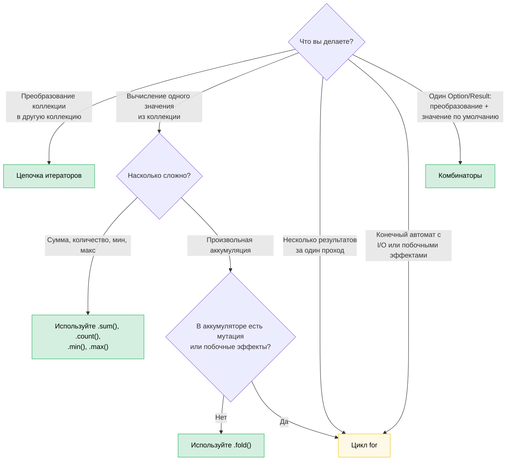

# 8. Функциональный и императивный стили: когда выигрывает изящество (и когда нет)

> **Сложность:** 🟡 Средний | **Время:** 2–3 часа | **Предварительные знания:** [гл. 7 — Замыкания](ch07-closures-and-higher-order-functions.md)

Rust предоставляет настоящее равноправие функционального и императивного стилей. В отличие от Haskell (функциональный по определению) или C (императивный по умолчанию), Rust позволяет выбирать, и правильный выбор зависит от того, что вы выражаете. Эта глава помогает выработать навык правильного выбора.

**Основной принцип:** функциональный стиль хорош, когда вы *преобразуете данные через конвейер*. Императивный стиль хорош, когда вы *управляете переходами состояний с побочными эффектами*. В большинстве реального кода есть и то и другое, и мастерство состоит в том, чтобы видеть, где проходит граница.

---

## 8.1 Комбинатор, о котором вы не знали, что он вам нужен

Многие разработчики на Rust пишут так:

```rust
let value = if let Some(x) = maybe_config() {
    x
} else {
    default_config()
};
process(value);
```

Хотя могли бы написать так:

```rust
process(maybe_config().unwrap_or_else(default_config));
```

Или вот такой распространённый шаблон:

```rust
let display_name = if let Some(name) = user.nickname() {
    name.to_uppercase()
} else {
    "ANONYMOUS".to_string()
};
```

Который эквивалентен:

```rust
let display_name = user.nickname()
    .map(|n| n.to_uppercase())
    .unwrap_or_else(|| "ANONYMOUS".to_string());
```

Функциональная версия не просто короче: она сразу говорит, *что* происходит (преобразовать, затем подставить значение по умолчанию), и не заставляет прослеживать поток управления. Версия с `if let` заставляет читать каждую ветку, чтобы понять, что оба пути приводят в одно и то же место.

### Семейство комбинаторов Option

Модель в голове такая: `Option<T>` — это коллекция из одного элемента или пустая коллекция. У каждого комбинатора `Option` есть аналогия с операцией над коллекцией.

| Вы пишете... | Вместо... | Что это сообщает |
|---|---|---|
| `opt.unwrap_or(default)` | `if let Some(x) = opt { x } else { default }` | «Используй это значение или запасной вариант» |
| `opt.unwrap_or_else(\|\| expensive())` | `if let Some(x) = opt { x } else { expensive() }` | То же, но значение по умолчанию вычисляется лениво |
| `opt.map(f)` | `match opt { Some(x) => Some(f(x)), None => None }` | «Преобразовать содержимое, сохранить отсутствие» |
| `opt.and_then(f)` | `match opt { Some(x) => f(x), None => None }` | «Связать операции, которые могут не удаться» (flatmap) |
| `opt.filter(\|x\| pred(x))` | `match opt { Some(x) if pred(&x) => Some(x), _ => None }` | «Оставить, только если проходит проверку» |
| `opt.zip(other)` | `if let (Some(a), Some(b)) = (opt, other) { Some((a,b)) } else { None }` | «Оба или ни одного» |
| `opt.or(fallback)` | `if opt.is_some() { opt } else { fallback }` | «Первое доступное» |
| `opt.or_else(\|\| try_another())` | `if opt.is_some() { opt } else { try_another() }` | «Пробовать альтернативы по порядку» |
| `opt.map_or(default, f)` | `if let Some(x) = opt { f(x) } else { default }` | «Преобразовать или подставить значение по умолчанию»: одна строка |
| `opt.map_or_else(default_fn, f)` | `if let Some(x) = opt { f(x) } else { default_fn() }` | То же, но обе стороны — замыкания |
| `opt?` | `match opt { Some(x) => x, None => return None }` | «Передать отсутствие вверх по стеку» |

### Семейство комбинаторов Result

Тот же паттерн применим к `Result<T, E>`:

| Вы пишете... | Вместо... | Что это сообщает |
|---|---|---|
| `res.map(f)` | `match res { Ok(x) => Ok(f(x)), Err(e) => Err(e) }` | Преобразовать путь успеха |
| `res.map_err(f)` | `match res { Ok(x) => Ok(x), Err(e) => Err(f(e)) }` | Преобразовать ошибку |
| `res.and_then(f)` | `match res { Ok(x) => f(x), Err(e) => Err(e) }` | Связать операции, которые могут не удаться |
| `res.unwrap_or_else(\|e\| default(e))` | `match res { Ok(x) => x, Err(e) => default(e) }` | Восстановиться после ошибки |
| `res.ok()` | `match res { Ok(x) => Some(x), Err(_) => None }` | «Ошибка мне не важна» |
| `res?` | `match res { Ok(x) => x, Err(e) => return Err(e.into()) }` | Передать ошибку вверх по стеку |

### Когда `if let` лучше

Комбинаторы проигрывают, когда:

- **В ветке `Some` нужно несколько инструкций.** Замыкание map на 5 строк хуже, чем `if let` на 5 строк.
- **Сам поток управления и есть суть.** `if let Some(connection) = pool.try_get() { /* использовать */ } else { /* записать в журнал, повторить, оповестить */ }`: обе ветки — действительно разные пути выполнения, а не «преобразовать или подставить значение по умолчанию».
- **Доминируют побочные эффекты.** Если обе ветки выполняют ввод-вывод с разной обработкой ошибок, версия с комбинаторами скрывает важные различия.

**Практическое правило:** если ветка `else` даёт *тот же тип*, что и ветка `Some`, а тела короткие, используйте комбинатор. Если ветки делают принципиально разные вещи, используйте `if let` или `match`.

---

## 8.2 Булевы комбинаторы: `.then()` и `.then_some()`

Ещё один шаблон, который встречается чаще, чем следовало бы:

```rust
let label = if is_admin {
    Some("ADMIN")
} else {
    None
};
```

Начиная с Rust 1.62, можно написать так:

```rust
let label = is_admin.then_some("ADMIN");
```

Или с вычисляемым значением:

```rust
let permissions = is_admin.then(|| compute_admin_permissions());
```

Это особенно полезно в цепочках:

```rust
// Императивно
let mut tags = Vec::new();
if user.is_admin { tags.push("admin"); }
if user.is_verified { tags.push("verified"); }
if user.score > 100 { tags.push("power-user"); }

// Функционально
let tags: Vec<&str> = [
    user.is_admin.then_some("admin"),
    user.is_verified.then_some("verified"),
    (user.score > 100).then_some("power-user"),
]
.into_iter()
.flatten()
.collect();
```

Функциональная версия явно выражает паттерн: «собрать список из условных элементов». Императивная версия заставляет читать каждый `if`, чтобы убедиться, что все они делают одно и то же: добавляют тег.

---

## 8.3 Цепочки итераторов и циклы: система принятия решений

В главе 7 показана механика. Этот раздел помогает выработать суждение.

### Когда выигрывают итераторы

**Конвейеры данных**: преобразование коллекции через последовательность шагов:

```rust
// Императивно: 8 строк, 2 изменяемые переменные
let mut results = Vec::new();
for item in inventory {
    if item.category == Category::Server {
        if let Some(temp) = item.last_temperature() {
            if temp > 80.0 {
                results.push((item.id, temp));
            }
        }
    }
}

// Функционально: 6 строк, 0 изменяемых переменных, один конвейер
let results: Vec<_> = inventory.iter()
    .filter(|item| item.category == Category::Server)
    .filter_map(|item| item.last_temperature().map(|t| (item.id, t)))
    .filter(|(_, temp)| *temp > 80.0)
    .collect();
```

Функциональная версия выигрывает, потому что:
- Каждый фильтр читается независимо
- Нет `mut`: данные текут в одном направлении
- Этапы конвейера можно добавлять, удалять и переставлять без перестройки кода
- LLVM инлайнит адаптеры итераторов в тот же машинный код, что и цикл

**Агрегация**: вычисление одного значения из коллекции:

```rust
// Императивно
let mut total_power = 0.0;
let mut count = 0;
for server in fleet {
    total_power += server.power_draw();
    count += 1;
}
let avg = total_power / count as f64;

// Функционально
let (total_power, count) = fleet.iter()
    .map(|s| s.power_draw())
    .fold((0.0, 0usize), |(sum, n), p| (sum + p, n + 1));
let avg = total_power / count as f64;
```

Или даже проще, если нужна только сумма:

```rust
let total: f64 = fleet.iter().map(|s| s.power_draw()).sum();
```

### Когда выигрывают циклы

**Ранний выход со сложным состоянием:**

```rust
// Это понятно и прямолинейно
let mut best_candidate = None;
for server in fleet {
    let score = evaluate(server);
    if score > threshold {
        if server.is_available() {
            best_candidate = Some(server);
            break; // Нашли один: останавливаемся сразу
        }
    }
}

// Функциональная версия выглядит натянуто
let best_candidate = fleet.iter()
    .filter(|s| evaluate(s) > threshold)
    .find(|s| s.is_available());
```

Постойте, эта функциональная версия на самом деле довольно чистая. Попробуем случай, где она действительно проигрывает:

**Одновременное формирование нескольких результатов:**

```rust
// Императивно: понятно, каждая ветка делает своё
let mut warnings = Vec::new();
let mut errors = Vec::new();
let mut stats = Stats::default();

for event in log_stream {
    match event.severity {
        Severity::Warn => {
            warnings.push(event.clone());
            stats.warn_count += 1;
        }
        Severity::Error => {
            errors.push(event.clone());
            stats.error_count += 1;
            if event.is_critical() {
                alert_oncall(&event);
            }
        }
        _ => stats.other_count += 1,
    }
}

// Функциональная версия: вынужденная, неуклюжая, её никто не захочет читать
let (warnings, errors, stats) = log_stream.iter().fold(
    (Vec::new(), Vec::new(), Stats::default()),
    |(mut w, mut e, mut s), event| {
        match event.severity {
            Severity::Warn => { w.push(event.clone()); s.warn_count += 1; }
            Severity::Error => {
                e.push(event.clone()); s.error_count += 1;
                if event.is_critical() { alert_oncall(event); }
            }
            _ => s.other_count += 1,
        }
        (w, e, s)
    },
);
```

Версия с fold *длиннее*, *труднее читается* и всё равно содержит мутацию (деструктурированные изменяемые аккумуляторы). Цикл выигрывает, потому что:
- Несколько результатов строятся параллельно
- Побочные эффекты (оповещение) смешаны с логикой
- Тела ветвей это инструкции, а не выражения

**Конечные автоматы с вводом-выводом:**

```rust
// Парсер, который читает токены: цикл и есть алгоритм
let mut state = ParseState::Start;
loop {
    let token = lexer.next_token()?;
    state = match state {
        ParseState::Start => match token {
            Token::Keyword(k) => ParseState::GotKeyword(k),
            Token::Eof => break,
            _ => return Err(ParseError::UnexpectedToken(token)),
        },
        ParseState::GotKeyword(k) => match token {
            Token::Ident(name) => ParseState::GotName(k, name),
            _ => return Err(ParseError::ExpectedIdentifier),
        },
        // ...остальные состояния
    };
}
```

Чище функциональной альтернативы не получится. Цикл с `match state` это естественная запись конечного автомата.

### Блок-схема выбора



### Врезка: ограниченная изменяемость, императивно внутри и функционально снаружи

Блоки Rust являются выражениями. Это позволяет ограничить мутацию фазой построения и связать результат неизменяемо:

```rust
use rand::random;

let samples = {
    let mut buf = Vec::with_capacity(10);
    while buf.len() < 10 {
        let reading: f64 = random();
        buf.push(reading);
        if random::<u8>() % 3 == 0 { break; } // случайная досрочная остановка
    }
    buf
};
// samples неизменяем: содержит от 1 до 10 элементов
```

Внутренний `buf` изменяем только внутри блока. Когда блок возвращает значение, внешняя привязка `samples` становится неизменяемой, и компилятор отклонит любой последующий вызов `samples.push(...)`.

**Почему не цепочка итераторов?** Можно попробовать так:

```rust
let samples: Vec<f64> = std::iter::from_fn(|| Some(random()))
    .take(10)
    .take_while(|_| random::<u8>() % 3 != 0)
    .collect();
```

Но `take_while` *исключает* элемент, который не прошёл предикат, поэтому получается от нуля до десяти элементов, а не гарантированно хотя бы один, как в императивной версии. Это можно обойти через `scan` или `chain`, но императивная версия понятнее.

**Когда ограниченная изменяемость действительно выигрывает:**

| Сценарий | Почему итераторам трудно |
|---|---|
| **Сортировка, затем фиксация** (`sort_unstable()` + `dedup()`) | Оба возвращают `()`: нет цепочечного результата (itertools предлагает `.sorted().dedup()`, если доступен) |
| **Остановка по состоянию** (остановка по условию, не связанному с данными) | `take_while` отбрасывает граничный элемент |
| **Пошаговое заполнение структуры** (поле за полем из разных источников) | Нет естественного единого конвейера |

**Честная оценка:** для большинства задач построения коллекций предпочтительны цепочки итераторов или [itertools](https://docs.rs/itertools). Прибегайте к ограниченной изменяемости, когда логика построения содержит ветвления, ранний выход или мутацию на месте, которая не укладывается в один конвейер. Настоящая ценность этого паттерна в том, что *область видимости мутации может быть меньше времени жизни переменной*. Это основополагающая особенность Rust, которая удивляет разработчиков, пришедших из C++, C# и Python.

---

## 8.4 Оператор `?`: там, где функциональное встречается с императивным

Оператор `?` это самый элегантный синтез обоих стилей в Rust. По сути это `.and_then()` в сочетании с ранним возвратом:

```rust
// Эта цепочка and_then...
fn load_config() -> Result<Config, Error> {
    read_file("config.toml")
        .and_then(|contents| parse_toml(&contents))
        .and_then(|table| validate_config(table))
        .and_then(|valid| Config::from_validated(valid))
}

// ...в точности эквивалентна этой
fn load_config() -> Result<Config, Error> {
    let contents = read_file("config.toml")?;
    let table = parse_toml(&contents)?;
    let valid = validate_config(table)?;
    Config::from_validated(valid)
}
```

Обе версии по духу функциональны (они автоматически передают ошибки), но версия с `?` даёт именованные промежуточные переменные. Это важно, когда:

- Вам снова нужна `contents` позже
- Вы хотите добавить `.context("при разборе конфигурации")?` на каждом шаге
- Вы отлаживаете код и хотите посмотреть промежуточные значения

**Антипаттерн:** длинные цепочки `.and_then()`, когда доступен `?`. Если каждое замыкание в цепочке имеет вид `|x| next_step(x)`, вы заново изобрели `?` без читаемости.

**Когда `.and_then()` лучше, чем `?`:**

```rust
// Преобразование внутри Option без раннего возврата
let port: Option<u16> = config.get("port")
    .and_then(|v| v.parse::<u16>().ok())
    .filter(|&p| p > 0 && p < 65535);
```

Здесь нельзя использовать `?`, потому что нет охватывающей функции, из которой можно вернуться: вы строите `Option`, а не передаёте его дальше.

---

## 8.5 Построение коллекций: `collect()` и циклы с push

`collect()` мощнее, чем обычно думают разработчики:

### Сбор в Result

```rust
// Императивно: разбираем список, падаем на первой ошибке
let mut numbers = Vec::new();
for s in input_strings {
    let n: i64 = s.parse().map_err(|_| Error::BadInput(s.clone()))?;
    numbers.push(n);
}

// Функционально: собираем в Result<Vec<_>, _>
let numbers: Vec<i64> = input_strings.iter()
    .map(|s| s.parse::<i64>().map_err(|_| Error::BadInput(s.clone())))
    .collect::<Result<_, _>>()?;
```

Приём `collect::<Result<Vec<_>, _>>()` работает, потому что `Result` реализует `FromIterator`. Он прекращает работу на первом `Err`, точно так же, как цикл с `?`.

### Сбор в HashMap

```rust
// Императивно
let mut index = HashMap::new();
for server in fleet {
    index.insert(server.id.clone(), server);
}

// Функционально
let index: HashMap<_, _> = fleet.into_iter()
    .map(|s| (s.id.clone(), s))
    .collect();
```

### Сбор в String

```rust
// Императивно
let mut csv = String::new();
for (i, field) in fields.iter().enumerate() {
    if i > 0 { csv.push(','); }
    csv.push_str(field);
}

// Функционально
let csv = fields.join(",");

// Или для более сложного форматирования:
let csv: String = fields.iter()
    .map(|f| format!("\"{f}\""))
    .collect::<Vec<_>>()
    .join(",");
```

### Когда выигрывает версия с циклом

`collect()` выделяет новую коллекцию. Если вы *меняете на месте*, цикл одновременно понятнее и эффективнее:

```rust
// Обновление на месте: функционального аналога, который был бы лучше, нет
for server in &mut fleet {
    if server.needs_refresh() {
        server.refresh_telemetry()?;
    }
}
```

Функциональная версия потребовала бы `.iter_mut().for_each(|s| { ... })`, а это просто цикл с лишним синтаксисом.

---

## 8.6 Сопоставление с образцом как диспетчеризация функций

`match` в Rust это функциональная конструкция, которую большинство разработчиков использует императивно. Вот функциональный взгляд:

### match как таблица поиска

```rust
// Императивное мышление: «проверяем каждый случай»
fn status_message(code: StatusCode) -> &'static str {
    if code == StatusCode::OK { "Success" }
    else if code == StatusCode::NOT_FOUND { "Not found" }
    else if code == StatusCode::INTERNAL { "Server error" }
    else { "Unknown" }
}

// Функциональное мышление: «отображение из области определения в область значений»
fn status_message(code: StatusCode) -> &'static str {
    match code {
        StatusCode::OK => "Success",
        StatusCode::NOT_FOUND => "Not found",
        StatusCode::INTERNAL => "Server error",
        _ => "Unknown",
    }
}
```

Версия с `match` это не только вопрос стиля: компилятор проверяет исчерпывающность. Добавьте новый вариант, и каждый `match`, который его не обрабатывает, станет ошибкой компиляции. Цепочка `if/else` молча провалится в ветку по умолчанию.

### Сопоставление с образцом и деструктуризация как конвейер

```rust
// Разбор команды: каждая ветка извлекает данные и преобразует их
fn execute(cmd: Command) -> Result<Response, Error> {
    match cmd {
        Command::Get { key } => db.get(&key).map(Response::Value),
        Command::Set { key, value } => db.set(key, value).map(|_| Response::Ok),
        Command::Delete { key } => db.delete(&key).map(|_| Response::Ok),
        Command::Batch(cmds) => cmds.into_iter()
            .map(execute)
            .collect::<Result<Vec<_>, _>>()
            .map(Response::Batch),
    }
}
```

Каждая ветка является выражением, возвращающим один и тот же тип. Это сопоставление с образцом как диспетчеризация функций: ветки `match` по сути образуют таблицу функций, индексированную вариантом перечисления.

---

## 8.7 Цепочки методов на собственных типах

Функциональный стиль выходит за пределы типов стандартной библиотеки. Паттерны builder и fluent API это функциональное программирование в маскировке:

```rust
// Это цепочка комбинаторов над вашим собственным типом
let query = QueryBuilder::new("servers")
    .filter("status", Eq, "active")
    .filter("rack", In, &["A1", "A2", "B1"])
    .order_by("temperature", Desc)
    .limit(50)
    .build();
```

**Ключевая мысль**: если у вашего типа есть методы, которые принимают `self` и возвращают `Self` (или преобразованный тип), вы построили комбинатор. К нему применимо то же суждение о функциональном и императивном стиле:

```rust
// Хорошо: цепочка работает, потому что каждый шаг это простое преобразование
let config = Config::default()
    .with_timeout(Duration::from_secs(30))
    .with_retries(3)
    .with_tls(true);

// Плохо: цепочка работает, но делает слишком много не связанных между собой вещей
let result = processor
    .load_data(path)?       // I/O
    .validate()             // Чисто
    .transform(rule_set)    // Чисто
    .save_to_disk(output)?  // I/O
    .notify_downstream()?;  // Побочный эффект

// Лучше: отделить чистый конвейер от I/O на концах
let data = load_data(path)?;
let processed = data.validate().transform(rule_set);
save_to_disk(output, &processed)?;
notify_downstream()?;
```

Цепочка ломается, когда смешивает чистые преобразования с I/O. Читатель не может понять, какие вызовы могут завершиться ошибкой, какие имеют побочные эффекты и где на самом деле происходят преобразования данных.

---

## 8.8 Производительность: они одинаковы

Распространённое заблуждение: «функциональный стиль медленнее из-за всех этих замыканий и выделений памяти».

В Rust **цепочки итераторов компилируются в тот же машинный код, что и написанные вручную циклы.** LLVM инлайнит вызовы замыканий, устраняет структуры адаптеров итераторов и часто выдаёт идентичный ассемблер. Это называется *абстракцией с нулевой стоимостью*, и это не пожелание, а измеренный факт.

```rust
// На release-сборках эти варианты дают идентичный ассемблер:

// Функционально
let sum: i64 = (0..1000).filter(|n| n % 2 == 0).map(|n| n * n).sum();

// Императивно
let mut sum: i64 = 0;
for n in 0..1000 {
    if n % 2 == 0 {
        sum += n * n;
    }
}
```

**Единственное исключение**: `.collect()` выделяет память. Если вы строите цепочку `.map().collect().iter().map().collect()` с промежуточными коллекциями, вы платите за выделения, которых избежала бы версия с циклом. Решение: убрать промежуточные `collect` и соединить адаптеры напрямую или использовать цикл, если промежуточные коллекции нужны по другим причинам.

---

## 8.9 Проверка вкуса: каталог преобразований

Справочная таблица для самых частых шаблонов «я написал 6 строк, а есть однострочник»:

| Императивный шаблон | Функциональный аналог | Когда предпочесть функциональный |
|---|---|---|
| `if let Some(x) = opt { f(x) } else { default }` | `opt.map_or(default, f)` | Короткие выражения с обеих сторон |
| `if let Some(x) = opt { Some(g(x)) } else { None }` | `opt.map(g)` | Всегда: для этого и существует `map` |
| `if condition { Some(x) } else { None }` | `condition.then_some(x)` | Всегда |
| `if condition { Some(compute()) } else { None }` | `condition.then(compute)` | Всегда |
| `match opt { Some(x) if pred(x) => Some(x), _ => None }` | `opt.filter(pred)` | Всегда |
| `for x in iter { if pred(x) { result.push(f(x)); } }` | `iter.filter(pred).map(f).collect()` | Когда конвейер читается с одного экрана |
| `if a.is_some() && b.is_some() { Some((a?, b?)) }` | `a.zip(b)` | Всегда: `.zip()` делает ровно это |
| `match (a, b) { (Some(x), Some(y)) => x + y, _ => 0 }` | `a.zip(b).map(\|(x,y)\| x + y).unwrap_or(0)` | Вопрос суждения, зависит от сложности |
| `iter.map(f).collect::<Vec<_>>()[0]` | `iter.map(f).next().unwrap()` | Не выделяйте Vec под один элемент |
| `let mut v = vec; v.sort(); v` | `{ let mut v = vec; v.sort(); v }` | В стандартной библиотеке нет `.sorted()` (используйте itertools) |

---

## 8.10 Антипаттерны

### Чрезмерная функциональность: цепочка из пяти уровней, которую никто не может прочитать

```rust
// Это не элегантно. Это головоломка.
let result = data.iter()
    .filter_map(|x| x.metadata.as_ref())
    .flat_map(|m| m.tags.iter())
    .filter(|t| t.starts_with("env:"))
    .map(|t| t.strip_prefix("env:").unwrap())
    .filter(|env| allowed_envs.contains(env))
    .map(|env| env.to_uppercase())
    .collect::<HashSet<_>>()
    .into_iter()
    .sorted()
    .collect::<Vec<_>>();
```

Когда цепочка превышает примерно 4 адаптера, разбейте её на именованные промежуточные переменные или вынесите часть в отдельную функцию:

```rust
let env_tags = data.iter()
    .filter_map(|x| x.metadata.as_ref())
    .flat_map(|m| m.tags.iter());

let allowed: Vec<_> = env_tags
    .filter_map(|t| t.strip_prefix("env:"))
    .filter(|env| allowed_envs.contains(env))
    .map(|env| env.to_uppercase())
    .sorted()
    .collect();
```

### Недостаточная функциональность: цикл в стиле C, для которого у Rust есть слово

```rust
// Это просто .any()
let mut found = false;
for item in &list {
    if item.is_expired() {
        found = true;
        break;
    }
}

// Напишите вместо этого
let found = list.iter().any(|item| item.is_expired());
```

```rust
// Это просто .find()
let mut target = None;
for server in &fleet {
    if server.id == target_id {
        target = Some(server);
        break;
    }
}

// Напишите вместо этого
let target = fleet.iter().find(|s| s.id == target_id);
```

```rust
// Это просто .all()
let mut all_healthy = true;
for server in &fleet {
    if !server.is_healthy() {
        all_healthy = false;
        break;
    }
}

// Напишите вместо этого
let all_healthy = fleet.iter().all(|s| s.is_healthy());
```

В стандартной библиотеке эти методы есть не случайно. Выучите словарь, и паттерны станут очевидны.

---

## Ключевые выводы

> - **Option и Result это коллекции из одного элемента.** Их комбинаторы (`.map()`, `.and_then()`, `.unwrap_or_else()`, `.filter()`, `.zip()`) заменяют большую часть шаблонного кода с `if let` и `match`.
> - **Используйте `bool::then_some()`**: он заменяет `if cond { Some(x) } else { None }` в любом случае.
> - **Цепочки итераторов выигрывают для конвейеров данных**: filter, map и collect без изменяемого состояния. Они компилируются в тот же машинный код, что и циклы.
> - **Циклы выигрывают для автоматов с несколькими результатами**: когда вы строите несколько коллекций, выполняете I/O в ветках или управляете переходом состояния.
> - **Оператор `?` это лучшее из двух миров**: функциональная передача ошибок с императивной читаемостью.
> - **Разбивайте цепочки примерно на 4 адаптерах**: используйте именованные промежуточные переменные для читаемости. Чрезмерная функциональность так же вредна, как недостаточная.
> - **Выучите словарь стандартной библиотеки**: `.any()`, `.all()`, `.find()`, `.position()`, `.sum()`, `.min_by_key()`. Каждый из них заменяет многострочный цикл одним вызовом, который выражает намерение.

> **См. также:** [гл. 7](ch07-closures-and-higher-order-functions.md) о механике замыканий и иерархии трейта `Fn`. [гл. 10](ch10-error-handling-patterns.md) о комбинаторах для обработки ошибок. [гл. 15](ch15-crate-architecture-and-api-design.md) о проектировании fluent API.

---

## Упражнение: рефакторинг императивного кода в функциональный ★★ (~30 мин)

Перепишите следующую функцию из императивного стиля в функциональный. Затем найдите одно место, где функциональная версия *хуже*, и объясните почему.

```rust
fn summarize_fleet(fleet: &[Server]) -> FleetSummary {
    let mut healthy = Vec::new();
    let mut degraded = Vec::new();
    let mut failed = Vec::new();
    let mut total_power = 0.0;
    let mut max_temp = f64::NEG_INFINITY;

    for server in fleet {
        match server.health_status() {
            Health::Healthy => healthy.push(server.id.clone()),
            Health::Degraded(reason) => degraded.push((server.id.clone(), reason)),
            Health::Failed(err) => failed.push((server.id.clone(), err)),
        }
        total_power += server.power_draw();
        if server.max_temperature() > max_temp {
            max_temp = server.max_temperature();
        }
    }

    FleetSummary {
        healthy,
        degraded,
        failed,
        avg_power: total_power / fleet.len() as f64,
        max_temp,
    }
}
```

<details>
<summary>🔑 Решение</summary>

`total_power` и `max_temp` — чистые функциональные переписывания:

```rust
fn summarize_fleet(fleet: &[Server]) -> FleetSummary {
    let avg_power: f64 = fleet.iter().map(|s| s.power_draw()).sum::<f64>()
        / fleet.len() as f64;

    let max_temp = fleet.iter()
        .map(|s| s.max_temperature())
        .fold(f64::NEG_INFINITY, f64::max);

    // Но разбиение на три группы ЛУЧШЕ сделать циклом.
    // Функциональная версия потребовала бы трёх отдельных проходов
    // или неуклюжего fold с тремя изменяемыми аккумуляторами.
    let mut healthy = Vec::new();
    let mut degraded = Vec::new();
    let mut failed = Vec::new();

    for server in fleet {
        match server.health_status() {
            Health::Healthy => healthy.push(server.id.clone()),
            Health::Degraded(reason) => degraded.push((server.id.clone(), reason)),
            Health::Failed(err) => failed.push((server.id.clone(), err)),
        }
    }

    FleetSummary { healthy, degraded, failed, avg_power, max_temp }
}
```

**Почему цикл лучше для разбиения на три группы:** функциональная версия либо потребовала бы три прохода `.filter().collect()` (трёхкратный обход), либо `.fold()` с тремя `mut Vec`-аккумуляторами внутри кортежа, то есть тот же цикл, переписанный с худшим синтаксисом. Императивный цикл за один проход понятнее, эффективнее и проще расширять.

</details>

***
