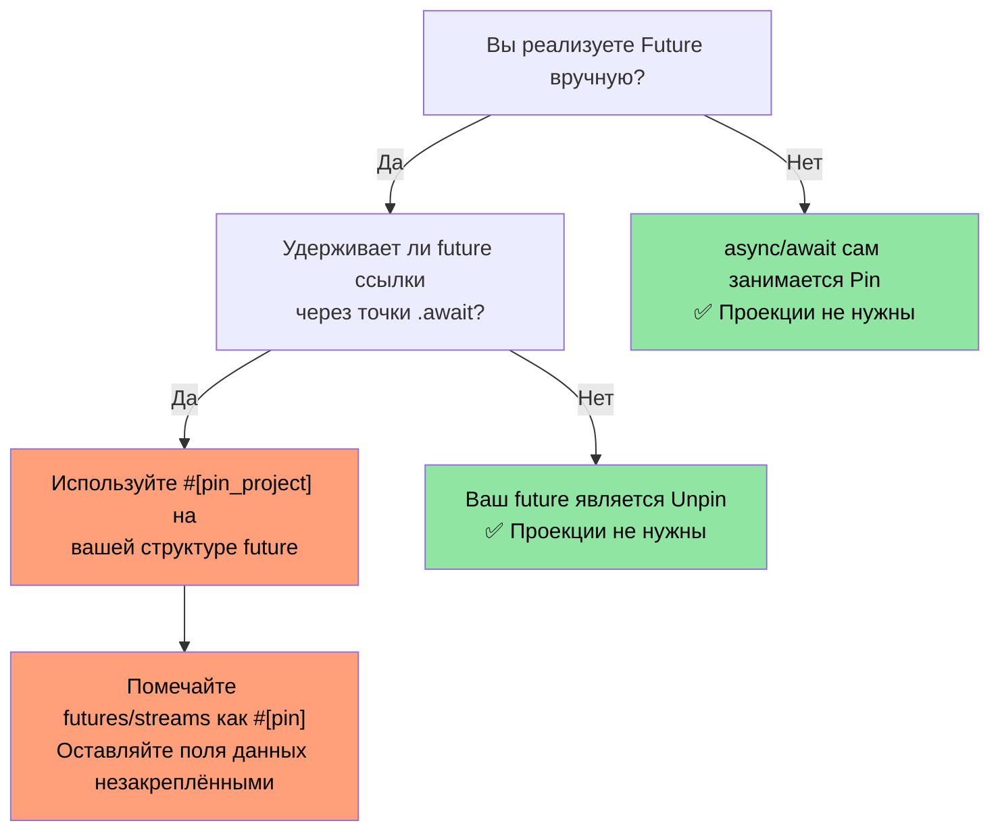
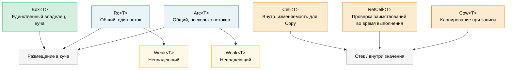

# 9. Умные указатели и внутренняя изменяемость 🟡

> **Что вы узнаете:**
> - Box, Rc и Arc для размещения в куче и совместного владения
> - Слабые ссылки (Weak) для разрыва циклов ссылок в Rc/Arc
> - Cell, RefCell и Cow для паттернов внутренней изменяемости
> - Pin для самоссылающихся типов и ManuallyDrop для управления жизненным циклом

## Box, Rc, Arc: размещение в куче и совместное использование

```rust
// --- Box<T>: единственный владелец, размещение в куче ---
// Использовать, когда нужны рекурсивные типы, большие значения или трейт-объекты
let boxed: Box<i32> = Box::new(42);
println!("{}", *boxed); // Deref к i32

// Рекурсивный тип требует Box (иначе размер бесконечен):
enum List<T> {
    Cons(T, Box<List<T>>),
    Nil,
}

// Трейт-объект (динамическая диспетчеризация):
let writer: Box<dyn std::io::Write> = Box::new(std::io::stdout());

// --- Rc<T>: несколько владельцев, один поток ---
// Использовать, когда нужно совместное владение внутри одного потока (без Send/Sync)
use std::rc::Rc;

let a = Rc::new(vec![1, 2, 3]);
let b = Rc::clone(&a); // Увеличивает счётчик ссылок (НЕ глубокое копирование)
let c = Rc::clone(&a);
println!("Счётчик ссылок: {}", Rc::strong_count(&a)); // 3

// Все три указывают на один и тот же Vec. Когда уничтожается последний Rc,
// Vec освобождается.

// --- Arc<T>: несколько владельцев, потокобезопасно ---
// Использовать, когда нужно совместное владение между потоками
use std::sync::Arc;

let shared = Arc::new(String::from("общие данные"));
let handles: Vec<_> = (0..5).map(|_| {
    let shared = Arc::clone(&shared);
    std::thread::spawn(move || println!("{shared}"))
}).collect();
for h in handles { h.join().unwrap(); }
```

### Weak-ссылки: разрыв циклов ссылок

`Rc` и `Arc` используют подсчёт ссылок, который не может освободить циклы (A → B → A). `Weak<T>` это невладеющий дескриптор, который **не** увеличивает сильный счётчик:

```rust
use std::rc::{Rc, Weak};
use std::cell::RefCell;

struct Node {
    value: i32,
    parent: RefCell<Weak<Node>>,   // НЕ удерживает родителя живым
    children: RefCell<Vec<Rc<Node>>>,
}

let parent = Rc::new(Node {
    value: 0, parent: RefCell::new(Weak::new()), children: RefCell::new(vec![]),
});
let child = Rc::new(Node {
    value: 1, parent: RefCell::new(Rc::downgrade(&parent)), children: RefCell::new(vec![]),
});
parent.children.borrow_mut().push(Rc::clone(&child));

// Доступ к родителю из потомка: возвращает Option<Rc<Node>>:
if let Some(p) = child.parent.borrow().upgrade() {
    println!("Значение родителя потомка: {}", p.value); // 0
}
// Когда `parent` уничтожается, strong_count → 0, память освобождается.
// Тогда `child.parent.upgrade()` вернёт `None`.
```

**Практическое правило**: используйте `Rc`/`Arc` для рёбер владения, а `Weak` для обратных ссылок и кэшей. Для потокобезопасного кода используйте `Arc<T>` вместе с `sync::Weak<T>`.

### Cell и RefCell: внутренняя изменяемость

Иногда нужно изменять данные за разделяемой ссылкой (`&`). Rust предоставляет *внутреннюю изменяемость* с проверкой заимствований во время выполнения:

```rust
use std::cell::{Cell, RefCell};

// --- Cell<T>: внутренняя изменяемость через копирование ---
// Только для типов Copy (или для типов, которые можно заменять через swap/replace)
struct Counter {
    count: Cell<u32>,
}

impl Counter {
    fn new() -> Self { Counter { count: Cell::new(0) } }

    fn increment(&self) { // &self, а не &mut self!
        self.count.set(self.count.get() + 1);
    }

    fn value(&self) -> u32 { self.count.get() }
}

// --- RefCell<T>: проверка заимствований во время выполнения ---
// Паникует, если нарушить правила заимствования во время выполнения
struct Cache {
    data: RefCell<Vec<String>>,
}

impl Cache {
    fn new() -> Self { Cache { data: RefCell::new(Vec::new()) } }

    fn add(&self, item: String) { // &self: снаружи выглядит неизменяемым
        self.data.borrow_mut().push(item); // &mut, проверяемый во время выполнения
    }

    fn get_all(&self) -> Vec<String> {
        self.data.borrow().clone() // & , проверяемый во время выполнения
    }

    fn bad_example(&self) {
        let _guard1 = self.data.borrow();
        // let _guard2 = self.data.borrow_mut();
        // ❌ ПАНИКА во время выполнения: нельзя иметь &mut, пока существует &
    }
}
```

> **Cell или RefCell**: `Cell` никогда не паникует (он копирует или меняет значения местами), но работает только с типами `Copy` или через `swap()`/`replace()`. `RefCell` работает с любым типом, но паникует при двойном изменяемом заимствовании. Ни один из них не является `Sync`: для многопоточного использования смотрите `Mutex`/`RwLock`.

### Cow: клонирование при записи

`Cow` (Clone on Write) хранит либо заимствованное, либо владеющее значение. Он клонирует данные *только* тогда, когда нужна мутация:

```rust
use std::borrow::Cow;

// Не выделяет память, если изменение не нужно:
fn normalize(input: &str) -> Cow<'_, str> {
    if input.contains('\t') {
        // Выделяем память, только если табуляции нужно заменить
        Cow::Owned(input.replace('\t', "    "))
    } else {
        // Без выделения памяти: просто возвращаем ссылку
        Cow::Borrowed(input)
    }
}

fn main() {
    let clean = "no tabs here";
    let dirty = "tabs\there";

    let r1 = normalize(clean); // Cow::Borrowed: без выделения памяти
    let r2 = normalize(dirty); // Cow::Owned: выделена новая String

    println!("{r1}");
    println!("{r2}");
}

// Также полезно для параметров функции, которым МОЖЕТ понадобиться владение:
fn process(data: Cow<'_, [u8]>) {
    // Можно читать данные без копирования
    println!("Длина: {}", data.len());
    // Если нужна мутация, Cow сам клонирует:
    let mut owned = data.into_owned(); // Клонируем, только если Borrowed
    owned.push(0xFF);
}
```

#### `Cow<'_, [u8]>` для бинарных данных

`Cow` особенно полезен в API для работы с байтами, где данные могут требовать преобразования (вставка контрольной суммы, дополнение, экранирование), а могут и не требовать. Это позволяет не выделять `Vec<u8>` на частом быстром пути:

```rust
use std::borrow::Cow;

/// Дополняет кадр до минимальной длины, заимствуя данные, если дополнение не нужно.
fn pad_frame(frame: &[u8], min_len: usize) -> Cow<'_, [u8]> {
    if frame.len() >= min_len {
        Cow::Borrowed(frame)  // Уже достаточно длинный: без выделения памяти
    } else {
        let mut padded = frame.to_vec();
        padded.resize(min_len, 0x00);
        Cow::Owned(padded)    // Выделяем память, только когда нужно дополнение
    }
}

let short = pad_frame(&[0xDE, 0xAD], 8);    // Owned: дополнен до 8 байт
let long  = pad_frame(&[0; 64], 8);          // Borrowed: уже ≥ 8
```

> **Совет**: сочетайте `Cow<[u8]>` с `bytes::Bytes` (гл. 11), когда нужно совместное использование с подсчётом ссылок для потенциально преобразованных буферов.

### Какой указатель выбрать

| Указатель | Число владельцев | Потокобезопасный | Изменяемость | Когда использовать |
|-----------|:----------------:|:----------------:|:------------:|--------------------|
| `Box<T>` | 1 | ✅ (если T: Send) | Через `&mut` | Размещение в куче, трейт-объекты, рекурсивные типы |
| `Rc<T>` | N | ❌ | Нет (оберните в Cell/RefCell) | Совместное владение в одном потоке, графы и деревья |
| `Arc<T>` | N | ✅ | Нет (оберните в Mutex/RwLock) | Совместное владение между потоками |
| `Cell<T>` | — | ❌ | `.get()` / `.set()` | Внутренняя изменяемость для типов Copy |
| `RefCell<T>` | — | ❌ | `.borrow()` / `.borrow_mut()` | Внутренняя изменяемость для любого типа в одном потоке |
| `Cow<'_, T>` | 0 или 1 | ✅ (если T: Send) | Клонирование при записи | Избегать выделения памяти, когда данные часто не меняются |

### Pin и самоссылающиеся типы

`Pin<P>` не даёт значению переместиться в памяти. Это необходимо для **самоссылающихся типов** (структур, которые содержат указатель на собственные данные) и для `Future`, которые могут удерживать ссылки через точки `.await`.

```rust
use std::pin::Pin;
use std::marker::PhantomPinned;

// Самоссылающаяся структура (упрощённо):
struct SelfRef {
    data: String,
    ptr: *const String, // Указывает на `data` выше
    _pin: PhantomPinned, // Отказывается от Unpin: её нельзя переместить
}

impl SelfRef {
    fn new(s: &str) -> Pin<Box<Self>> {
        let val = SelfRef {
            data: s.to_string(),
            ptr: std::ptr::null(),
            _pin: PhantomPinned,
        };
        let mut boxed = Box::pin(val);

        // SAFETY: не перемещаем данные после установки указателя
        let self_ptr: *const String = &boxed.data;
        unsafe {
            let mut_ref = Pin::as_mut(&mut boxed);
            Pin::get_unchecked_mut(mut_ref).ptr = self_ptr;
        }
        boxed
    }

    fn data(&self) -> &str {
        &self.data
    }

    fn ptr_data(&self) -> &str {
        // SAFETY: ptr был установлен на указатель на self.data, пока структура закреплена
        unsafe { &*self.ptr }
    }
}

fn main() {
    let pinned = SelfRef::new("hello");
    assert_eq!(pinned.data(), pinned.ptr_data()); // Оба "hello"
    // std::mem::swap сделал бы ptr недействительным, но Pin этого не допускает
}
```

**Ключевые понятия**:

| Понятие | Значение |
|---------|----------|
| `Unpin` (авто-трейт) | «Перемещать этот тип безопасно». Большинство типов по умолчанию `Unpin`. |
| `!Unpin` / `PhantomPinned` | «У меня есть внутренние указатели: не перемещайте меня». |
| `Pin<&mut T>` | Изменяемая ссылка, которая гарантирует, что `T` не переместится |
| `Pin<Box<T>>` | Владеющее значение, закреплённое в куче |

**Почему это важно для async**: каждая `async fn` превращается в `Future`, который может удерживать ссылки через точки `.await`, то есть становится самоссылающимся. Асинхронный рантайм использует `Pin<&mut Future>`, чтобы гарантировать, что future не переместят после опроса (poll).

```rust
// Когда вы пишете:
async fn fetch(url: &str) -> String {
    let response = http_get(url).await; // ссылка удерживается через await
    response.text().await
}

// Компилятор генерирует структуру-автомат, которая является !Unpin,
// а рантайм закрепляет её перед вызовом Future::poll().
```

> **Когда задумываться о Pin**: (1) при ручной реализации `Future`, (2) при написании асинхронных рантаймов или комбинаторов, (3) для любой структуры с самоссылающимися указателями. В обычном прикладном коде `async/await` прозрачно занимается закреплением. Подробнее см. в сопутствующем курсе *Async Rust Training*.
>
> **Альтернативы в виде крейтов**: для самоссылающихся структур без ручного `Pin` рассмотрите [`ouroboros`](https://crates.io/crates/ouroboros) или [`self_cell`](https://crates.io/crates/self_cell). Они генерируют безопасные обёртки с правильным закреплением и семантикой drop.

### Проекции pin: структурное закрепление

Когда у вас есть `Pin<&mut MyStruct>`, часто нужно обращаться к отдельным полям. **Проекция pin** это паттерн безопасного перехода от `Pin<&mut Struct>` к `Pin<&mut Field>` (для закреплённых полей) или к `&mut Field` (для незакреплённых полей).

#### Проблема: доступ к полям закреплённых типов

```rust
use std::pin::Pin;
use std::marker::PhantomPinned;

struct MyFuture {
    data: String,              // Обычное поле: безопасно перемещать
    state: InternalState,      // Самоссылающееся: должно оставаться закреплённым
    _pin: PhantomPinned,
}

enum InternalState {
    Waiting { ptr: *const String }, // Указывает на `data`: самоссылка
    Done,
}

// Дано `Pin<&mut MyFuture>`, как получить доступ к `data` и `state`?
// НЕЛЬЗЯ просто написать `pinned.data`: компилятор не даст
// получить &mut к полю закреплённого значения без unsafe.
```

#### Ручная проекция pin (unsafe)

```rust
impl MyFuture {
    // Проекция на `data`: это поле структурно не закреплено (безопасно перемещать)
    fn data(self: Pin<&mut Self>) -> &mut String {
        // SAFETY: `data` структурно не закреплено. Перемещение только `data`
        // не перемещает всю структуру, поэтому гарантия Pin сохраняется.
        unsafe { &mut self.get_unchecked_mut().data }
    }

    // Проекция на `state`: это поле структурно закреплено
    fn state(self: Pin<&mut Self>) -> Pin<&mut InternalState> {
        // SAFETY: `state` структурно закреплено: мы поддерживаем инвариант
        // закрепления, возвращая Pin<&mut InternalState>.
        unsafe { Pin::new_unchecked(&mut self.get_unchecked_mut().state) }
    }
}
```

**Правила структурного закрепления**: поле «структурно закреплено», если:
1. Перемещение или обмен только этого поля может нарушить самоссылку
2. Реализация `Drop` для структуры не должна перемещать это поле
3. Структура должна быть `!Unpin` (обеспечивается `PhantomPinned` или полем `!Unpin`)

#### `pin-project`: безопасные проекции pin (без unsafe)

Крейт `pin-project` генерирует корректные проекции на этапе компиляции, избавляя от необходимости ручного `unsafe`:

```rust
use pin_project::pin_project;
use std::pin::Pin;
use std::future::Future;
use std::task::{Context, Poll};

#[pin_project]                   // <-- Генерирует методы проекции
struct TimedFuture<F: Future> {
    #[pin]                       // <-- Структурно закреплено (это Future)
    inner: F,
    started_at: std::time::Instant, // НЕ закреплено: обычные данные
}

impl<F: Future> Future for TimedFuture<F> {
    type Output = (F::Output, std::time::Duration);

    fn poll(self: Pin<&mut Self>, cx: &mut Context<'_>) -> Poll<Self::Output> {
        let this = self.project();  // Безопасно! Генерируется pin_project
        //   this.inner   : Pin<&mut F>              — закреплённое поле
        //   this.started_at : &mut std::time::Instant — незакреплённое поле

        match this.inner.poll(cx) {
            Poll::Ready(output) => {
                let elapsed = this.started_at.elapsed();
                Poll::Ready((output, elapsed))
            }
            Poll::Pending => Poll::Pending,
        }
    }
}
```

#### `pin-project` и ручная проекция

| Аспект | Вручную (`unsafe`) | `pin-project` |
|--------|--------------------|---------------|
| Безопасность | Вы доказываете инварианты | Проверяется компилятором |
| Шаблонный код | Мало (но легко ошибиться) | Нет: derive-макрос |
| Взаимодействие с `Drop` | Нельзя перемещать закреплённые поля | Обеспечивается через `#[pinned_drop]` |
| Стоимость на этапе компиляции | Нет | Раскрытие процедурного макроса |
| Применение | Примитивы, `no_std` | Прикладной код и библиотеки |

#### `#[pinned_drop]`: Drop для закреплённых типов

Если у типа есть поля с `#[pin]`, `pin-project` требует `#[pinned_drop]` вместо обычной реализации `Drop`, чтобы случайно не переместить закреплённые поля:

```rust
use pin_project::{pin_project, pinned_drop};
use std::pin::Pin;

#[pin_project(PinnedDrop)]
struct Connection<F> {
    #[pin]
    future: F,
    buffer: Vec<u8>,  // Не закреплено: можно переместить в drop
}

#[pinned_drop]
impl<F> PinnedDrop for Connection<F> {
    fn drop(self: Pin<&mut Self>) {
        let this = self.project();
        // `this.future` имеет тип Pin<&mut F>: его нельзя переместить, только уничтожить на месте
        // `this.buffer` имеет тип &mut Vec<u8>: его можно опустошить, очистить и т. д.
        this.buffer.clear();
        println!("Соединение уничтожено, буфер очищен");
    }
}
```

#### Когда проекции pin важны на практике

> **Примечание**: диаграмма ниже использует синтаксис Mermaid. Она отображается на GitHub и в инструментах с поддержкой Mermaid (mdBook с плагином `mermaid`, VS Code с расширением Mermaid). В простых просмотрщиках Markdown вы увидите исходный код.



> **Практическое правило**: если вы оборачиваете другой `Future` или `Stream`, используйте `pin-project`. Если вы пишете прикладной код с `async/await`, проекции pin вам напрямую никогда не понадобятся. Подробнее о комбинаторах async с проекциями pin см. в сопутствующем курсе *Async Rust Training*.

### Порядок drop и ManuallyDrop

Порядок drop в Rust детерминирован, но у него есть правила, которые стоит знать:

#### Правила порядка drop

```rust
struct Label(&'static str);

impl Drop for Label {
    fn drop(&mut self) { println!("Уничтожается {}", self.0); }
}

fn main() {
    let a = Label("first");   // Объявлена первой
    let b = Label("second");  // Объявлена второй
    let c = Label("third");   // Объявлена третьей
}
// Вывод:
//   Уничтожается third    ← локальные переменные уничтожаются в ОБРАТНОМ порядке объявления
//   Уничтожается second
//   Уничтожается first
```

**Три правила**:

| Что | Порядок drop | Обоснование |
|-----|--------------|-------------|
| **Локальные переменные** | В обратном порядке объявления | Более поздние переменные могут ссылаться на более ранние |
| **Поля структуры** | В порядке объявления (сверху вниз) | Совпадает с порядком создания (стабильно с Rust 1.0, гарантируется [RFC 1857](https://rust-lang.github.io/rfcs/1857-stabilize-drop-order.html)) |
| **Элементы кортежа** | В порядке объявления (слева направо) | `(a, b, c)`: сначала `a`, затем `b`, затем `c` |

```rust
struct Server {
    listener: Label,  // Уничтожается 1-м
    handler: Label,   // Уничтожается 2-м
    logger: Label,    // Уничтожается 3-м
}
// Поля уничтожаются сверху вниз (в порядке объявления).
// Это важно, когда поля ссылаются друг на друга или держат ресурсы.
```

> **Практическое влияние**: если в вашей структуре есть `JoinHandle` и `Sender`, порядок полей определяет, что уничтожается первым. Если поток читает из канала, сначала уничтожьте `Sender` (закройте канал), чтобы поток завершился, а потом дождитесь `JoinHandle`. Поставьте `Sender` выше `JoinHandle` в структуре.

#### `ManuallyDrop<T>`: подавление автоматического drop

`ManuallyDrop<T>` оборачивает значение и не даёт его деструктору выполниться автоматически. Ответственность за уничтожение (или намеренную утечку) лежит на вас:

```rust
use std::mem::ManuallyDrop;

// Случай 1: предотвращаем двойное освобождение в unsafe-коде
struct TwoPhaseBuffer {
    // Vec нужно уничтожить самим, чтобы контролировать момент
    data: ManuallyDrop<Vec<u8>>,
    committed: bool,
}

impl TwoPhaseBuffer {
    fn new(capacity: usize) -> Self {
        TwoPhaseBuffer {
            data: ManuallyDrop::new(Vec::with_capacity(capacity)),
            committed: false,
        }
    }

    fn write(&mut self, bytes: &[u8]) {
        self.data.extend_from_slice(bytes);
    }

    fn commit(&mut self) {
        self.committed = true;
        println!("Зафиксировано байт: {}", self.data.len());
    }
}

impl Drop for TwoPhaseBuffer {
    fn drop(&mut self) {
        if !self.committed {
            println!("Откат: уничтожаем незафиксированные данные");
        }
        // SAFETY: data здесь всегда корректен; уничтожаем его только один раз.
        unsafe { ManuallyDrop::drop(&mut self.data); }
    }
}
```

```rust
// Случай 2: намеренная утечка (например, глобальные синглтоны)
fn leaked_string() -> &'static str {
    // Box::leak() — идиоматичный способ создать ссылку &'static:
    let s = String::from("живёт вечно");
    Box::leak(s.into_boxed_str())
    // ⚠️ Это контролируемая утечка памяти. Выделение String в куче
    // никогда не освобождается. Используйте только для долгоживущих синглтонов.
}

// Альтернатива через ManuallyDrop (требует unsafe):
// ⚠️ Предпочитайте Box::leak() выше: это показано только для иллюстрации
// семантики ManuallyDrop (подавление Drop при сохранении данных в куче).
fn leaked_string_manual() -> &'static str {
    use std::mem::ManuallyDrop;
    let md = ManuallyDrop::new(String::from("живёт вечно"));
    // SAFETY: ManuallyDrop предотвращает освобождение; данные в куче живут
    // вечно, поэтому ссылка 'static корректна.
    unsafe { &*(md.as_str() as *const str) }
}
```

```rust
// Случай 3: поля union (в каждый момент действителен только один вариант)
use std::mem::ManuallyDrop;

union IntOrString {
    i: u64,
    s: ManuallyDrop<String>,
    // String имеет реализацию Drop, поэтому он ДОЛЖЕН быть обёрнут в ManuallyDrop
    // внутри union: компилятор не может знать, какое поле активно.
}

// Автоматического Drop нет: код, который создаёт IntOrString, тоже должен
// заниматься очисткой. Если активен вариант String, вызовите:
//   unsafe { ManuallyDrop::drop(&mut value.s); }
// Без реализации Drop union просто утекает (без UB, только утечка).
```

**ManuallyDrop против `mem::forget`**:

| | `ManuallyDrop<T>` | `mem::forget(value)` |
|---|---|---|
| Когда | Оборачивание при создании | Потребление позже |
| Доступ к внутреннему | `&*md` / `&mut *md` | Значение уже недоступно |
| Уничтожить позже | `ManuallyDrop::drop(&mut md)` | Невозможно |
| Сценарий | Тонкое управление жизненным циклом | «Выстрелил и забыл»: утечка |

> **Правило**: используйте `ManuallyDrop` в небезопасных абстракциях, где нужно контролировать, *когда именно* выполняется деструктор. В безопасном прикладном коде это почти никогда не нужно: автоматический порядок drop в Rust справляется сам.

> **Ключевые выводы: умные указатели**
> - `Box` для единоличного владения в куче; `Rc`/`Arc` для совместного владения (в одном потоке / в нескольких)
> - `Cell`/`RefCell` дают внутреннюю изменяемость; `RefCell` паникует при нарушении правил во время выполнения
> - `Cow` избегает выделения памяти на частом пути; `Pin` запрещает перемещение самоссылающихся типов
> - Порядок drop: поля уничтожаются в порядке объявления (RFC 1857); локальные переменные в обратном порядке объявления

> **См. также:** [гл. 6 — Конкурентность](ch06-concurrency-vs-parallelism-vs-threads.md) о паттернах Arc + Mutex. [гл. 4 — PhantomData](ch04-phantomdata-types-that-carry-no-data.md) о PhantomData с умными указателями.



---

### Упражнение: граф с подсчётом ссылок ★★ (~30 минут)

Постройте направленный граф с помощью `Rc<RefCell<Node>>`, где каждый узел имеет имя и список потомков. Создайте цикл (A → B → C → A), используя `Weak` для обратного ребра. Убедитесь, что утечки памяти нет, с помощью `Rc::strong_count`.

<details>
<summary>🔑 Решение</summary>

```rust
use std::cell::RefCell;
use std::rc::{Rc, Weak};

struct Node {
    name: String,
    children: Vec<Rc<RefCell<Node>>>,
    back_ref: Option<Weak<RefCell<Node>>>,
}

impl Node {
    fn new(name: &str) -> Rc<RefCell<Self>> {
        Rc::new(RefCell::new(Node {
            name: name.to_string(),
            children: Vec::new(),
            back_ref: None,
        }))
    }
}

impl Drop for Node {
    fn drop(&mut self) {
        println!("Уничтожается {}", self.name);
    }
}

fn main() {
    let a = Node::new("A");
    let b = Node::new("B");
    let c = Node::new("C");

    // A → B → C, при этом C ссылается назад на A через Weak
    a.borrow_mut().children.push(Rc::clone(&b));
    b.borrow_mut().children.push(Rc::clone(&c));
    c.borrow_mut().back_ref = Some(Rc::downgrade(&a)); // Weak-ссылка!

    println!("Сильных ссылок у A: {}", Rc::strong_count(&a)); // 1 (только привязка `a`)
    println!("Сильных ссылок у B: {}", Rc::strong_count(&b)); // 2 (b + потомок A)
    println!("Сильных ссылок у C: {}", Rc::strong_count(&c)); // 2 (c + потомок B)

    // Поднимаем weak-ссылку, чтобы проверить, что она работает:
    let c_ref = c.borrow();
    if let Some(back) = &c_ref.back_ref {
        if let Some(a_ref) = back.upgrade() {
            println!("C ссылается назад на: {}", a_ref.borrow().name);
        }
    }
    // Когда a, b, c выходят из области видимости, все узлы уничтожаются (утечки цикла нет!)
}
```

</details>

***
