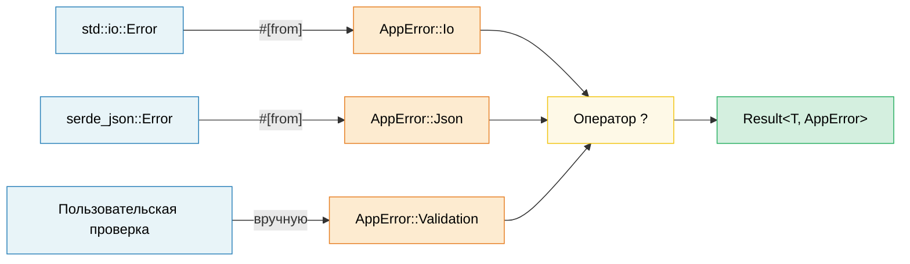

# 10. Паттерны обработки ошибок 🟢

> **Что вы узнаете:**
> - Когда использовать `thiserror` (библиотеки), а когда `anyhow` (приложения)
> - Цепочки преобразования ошибок через `#[from]` и обёртки `.context()`
> - Как оператор `?` раскрывается и как работает в `main()`
> - Когда паниковать, а когда возвращать ошибки, и `catch_unwind` для границ FFI

## thiserror и anyhow: библиотеки и приложения

Обработка ошибок в Rust строится вокруг типа `Result<T, E>`. Доминируют два крейта:

```rust,ignore
// --- thiserror: ДЛЯ БИБЛИОТЕК ---
// Генерирует реализации Display, Error и From через derive-макросы
use thiserror::Error;

#[derive(Error, Debug)]
pub enum DatabaseError {
    #[error("ошибка подключения: {0}")]
    ConnectionFailed(String),

    #[error("ошибка запроса: {source}")]
    QueryError {
        #[source]
        source: sqlx::Error,
    },

    #[error("запись не найдена: таблица={table}, id={id}")]
    NotFound { table: String, id: u64 },

    #[error(transparent)] // Делегировать Display внутренней ошибке
    Io(#[from] std::io::Error), // Автоматически генерирует From<io::Error>
}

// --- anyhow: ДЛЯ ПРИЛОЖЕНИЙ ---
// Динамический тип ошибки: удобен в верхнеуровневом коде, где нужно просто пробросить ошибку дальше
use anyhow::{Context, Result, bail, ensure};

fn read_config(path: &str) -> Result<Config> {
    let content = std::fs::read_to_string(path)
        .with_context(|| format!("не удалось прочитать конфигурацию из {path}"))?;

    let config: Config = serde_json::from_str(&content)
        .context("не удалось разобрать JSON конфигурации")?;

    ensure!(config.port > 0, "порт должен быть положительным, получено {}", config.port);

    Ok(config)
}

fn main() -> Result<()> {
    let config = read_config("server.toml")?;

    if config.name.is_empty() {
        bail!("имя сервера не может быть пустым"); // Немедленно возвращаем Err
    }

    Ok(())
}
```

**Когда что использовать**:

| | `thiserror` | `anyhow` |
|---|---|---|
| **Где использовать** | Библиотеки, общие крейты | Приложения, исполняемые файлы |
| **Типы ошибок** | Конкретные перечисления: вызывающий код может сопоставлять их с образцом | `anyhow::Error`: непрозрачный тип |
| **Усилия** | Определить собственное перечисление ошибок | Просто использовать `Result<T>` |
| **Приведение типа (downcasting)** | Не нужно: сопоставление с образцом | `error.downcast_ref::<MyError>()` |

### Цепочки преобразования ошибок (#[from])

```rust,ignore
use thiserror::Error;

#[derive(Error, Debug)]
enum AppError {
    #[error("ошибка ввода-вывода: {0}")]
    Io(#[from] std::io::Error),

    #[error("ошибка JSON: {0}")]
    Json(#[from] serde_json::Error),

    #[error("ошибка HTTP: {0}")]
    Http(#[from] reqwest::Error),
}

// Теперь ? автоматически выполняет преобразование:
fn fetch_and_parse(url: &str) -> Result<Config, AppError> {
    let body = reqwest::blocking::get(url)?.text()?;  // reqwest::Error → AppError::Http
    let config: Config = serde_json::from_str(&body)?; // serde_json::Error → AppError::Json
    Ok(config)
}
```

### Контекст и оборачивание ошибок

Добавляйте понятный контекст к ошибкам, не теряя исходную:

```rust,ignore
use anyhow::{Context, Result};

fn process_file(path: &str) -> Result<Data> {
    let content = std::fs::read_to_string(path)
        .with_context(|| format!("не удалось прочитать {path}"))?;

    let data = parse_content(&content)
        .with_context(|| format!("не удалось разобрать {path}"))?;

    validate(&data)
        .context("ошибка валидации")?;

    Ok(data)
}

// Вывод ошибки:
// Error: ошибка валидации
//
// Caused by:
//    0: не удалось разобрать config.json
//    1: expected ',' at line 5 column 12
```

### Оператор ? подробнее

`?` это синтаксический сахар для `match`, преобразования `From` и раннего возврата:

```rust
// Это:
let value = operation()?;

// Раскрывается в:
let value = match operation() {
    Ok(v) => v,
    Err(e) => return Err(From::from(e)),
    //                  ^^^^^^^^^^^^^^
    //                  Автоматическое преобразование через трейт From
};
```

**`?` также работает с `Option`** (в функциях, которые возвращают `Option`):

```rust
fn find_user_email(users: &[User], name: &str) -> Option<String> {
    let user = users.iter().find(|u| u.name == name)?; // Возвращает None, если не найден
    let email = user.email.as_ref()?; // Возвращает None, если email равен None
    Some(email.to_uppercase())
}
```

### Паника, catch_unwind и когда прерывать работу

```rust
// Паника: для ОШИБОК В КОДЕ, а не для ожидаемых ошибок
fn get_element(data: &[i32], index: usize) -> &i32 {
    // Если здесь случится паника, это ошибка программиста (баг).
    // Не «обрабатывайте» её, а исправьте вызывающий код.
    &data[index]
}

// catch_unwind: для границ (FFI, пулы потоков)
use std::panic;

let result = panic::catch_unwind(|| {
    // Безопасно запускаем код, который может паниковать
    risky_operation()
});

match result {
    Ok(value) => println!("Успех: {value:?}"),
    Err(_) => eprintln!("Операция завершилась паникой, продолжаем работу"),
}

// Когда что использовать:
// - Result<T, E> → ожидаемые сбои (файл не найден, таймаут сети)
// - panic!()     → ошибки в программе (выход за границы индекса, нарушен инвариант)
// - process::abort() → невосстановимое состояние (нарушение безопасности, повреждённые данные)
```

> **Сравнение с C++**: `Result<T, E>` заменяет исключения для ожидаемых ошибок. `panic!()` похож на `assert()` или `std::terminate()`: он предназначен для багов, а не для управления ходом программы. Оператор `?` делает распространение ошибок таким же удобным, как исключения, но без непредсказуемого потока управления.

> **Ключевые выводы: обработка ошибок**
> - Библиотеки: `thiserror` для структурированных перечислений ошибок; приложения: `anyhow` для удобного распространения ошибок
> - `#[from]` автоматически генерирует реализации `From`; `.context()` добавляет понятные обёртки
> - `?` раскрывается в `From::from()` и ранний возврат; работает в `main()`, возвращающей `Result`

> **См. также:** [гл. 15 — Дизайн API](ch15-crate-architecture-and-api-design.md) о паттернах «parse, don't validate». [гл. 11 — Сериализация](ch11-serialization-zero-copy-and-binary-data.md) об обработке ошибок в serde.



---

### Упражнение: иерархия ошибок на thiserror ★★ (~30 минут)

Спроектируйте иерархию типов ошибок для приложения обработки файлов, которое может завершиться ошибкой при вводе-выводе, разборе (JSON и CSV) или валидации. Используйте `thiserror` и продемонстрируйте распространение ошибок через `?`.

<details>
<summary>🔑 Решение</summary>

```rust,ignore
use thiserror::Error;

#[derive(Error, Debug)]
pub enum AppError {
    #[error("ошибка ввода-вывода: {0}")]
    Io(#[from] std::io::Error),

    #[error("ошибка разбора JSON: {0}")]
    Json(#[from] serde_json::Error),

    #[error("ошибка CSV в строке {line}: {message}")]
    Csv { line: usize, message: String },

    #[error("ошибка валидации: {field} — {reason}")]
    Validation { field: String, reason: String },
}

fn read_file(path: &str) -> Result<String, AppError> {
    Ok(std::fs::read_to_string(path)?) // io::Error → AppError::Io через #[from]
}

fn parse_json(content: &str) -> Result<serde_json::Value, AppError> {
    Ok(serde_json::from_str(content)?) // serde_json::Error → AppError::Json
}

fn validate_name(value: &serde_json::Value) -> Result<String, AppError> {
    let name = value.get("name")
        .and_then(|v| v.as_str())
        .ok_or_else(|| AppError::Validation {
            field: "name".into(),
            reason: "должно быть строкой, а не null".into(),
        })?;

    if name.is_empty() {
        return Err(AppError::Validation {
            field: "name".into(),
            reason: "не должно быть пустым".into(),
        });
    }

    Ok(name.to_string())
}

fn process_file(path: &str) -> Result<String, AppError> {
    let content = read_file(path)?;
    let json = parse_json(&content)?;
    let name = validate_name(&json)?;
    Ok(name)
}

fn main() {
    match process_file("config.json") {
        Ok(name) => println!("Имя: {name}"),
        Err(e) => eprintln!("Ошибка: {e}"),
    }
}
```

</details>

***
