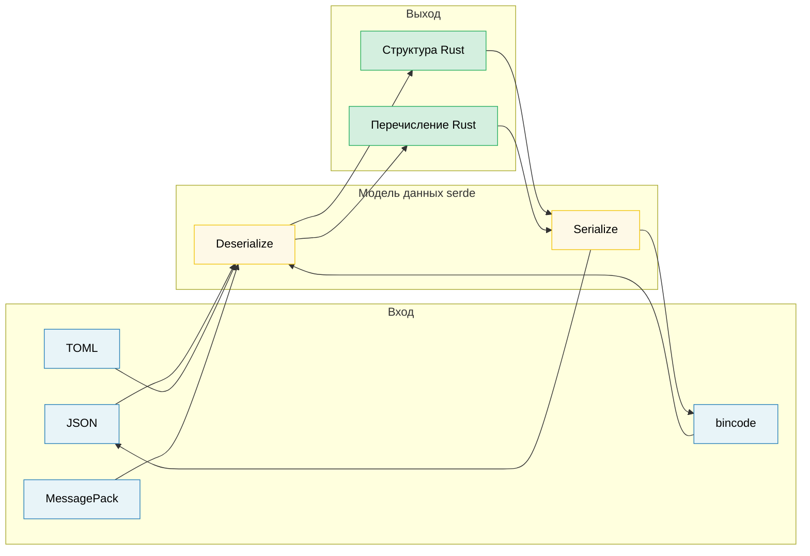

# 11. Сериализация, zero-copy и бинарные данные 🟡

> **Что вы узнаете:**
> - Основы serde: derive-макросы, атрибуты и представления перечислений
> - Десериализацию без копирования (zero-copy) для высоконагруженных сценариев чтения
> - Экосистему форматов serde (JSON, TOML, bincode, MessagePack)
> - Работу с бинарными данными через `repr(C)`, zerocopy и `bytes::Bytes`

## Основы serde

`serde` (SERialize/DEserialize) это универсальная система сериализации для Rust. Она отделяет **модель данных** (ваши структуры) от **формата** (JSON, TOML, бинарный):

```rust,ignore
use serde::{Serialize, Deserialize};

#[derive(Debug, Serialize, Deserialize)]
struct ServerConfig {
    name: String,
    port: u16,
    #[serde(default)]                    // Использовать Default::default(), если поле отсутствует
    max_connections: usize,
    #[serde(skip_serializing_if = "Option::is_none")]
    tls_cert_path: Option<String>,
}

fn main() -> Result<(), Box<dyn std::error::Error>> {
    // Десериализация из JSON:
    let json_input = r#"{
        "name": "hw-diag",
        "port": 8080
    }"#;
    let config: ServerConfig = serde_json::from_str(json_input)?;
    println!("{config:?}");
    // ServerConfig { name: "hw-diag", port: 8080, max_connections: 0, tls_cert_path: None }

    // Сериализация в JSON:
    let output = serde_json::to_string_pretty(&config)?;
    println!("{output}");

    // Та же структура, другой формат, без изменений в коде:
    let toml_input = r#"
        name = "hw-diag"
        port = 8080
    "#;
    let config: ServerConfig = toml::from_str(toml_input)?;
    println!("{config:?}");

    Ok(())
}
```

> **Ключевая мысль**: ваша структура один раз получает derive `Serialize` и `Deserialize`. После этого она работает с *любым* совместимым с serde форматом: JSON, TOML, YAML, bincode, MessagePack, CBOR, postcard и десятками других.

### Распространённые атрибуты serde

serde даёт тонкое управление сериализацией через атрибуты полей и контейнеров:

```rust,ignore
use serde::{Serialize, Deserialize};

// --- Атрибуты контейнера (на структуре или перечислении) ---
#[derive(Serialize, Deserialize)]
#[serde(rename_all = "camelCase")]       // Соглашение JSON: field_name → fieldName
#[serde(deny_unknown_fields)]            // Отвергать лишние ключи: строгий разбор
struct DiagResult {
    test_name: String,                   // Сериализуется как "testName"
    pass_count: u32,                     // Сериализуется как "passCount"
    fail_count: u32,                     // Сериализуется как "failCount"
}

// --- Атрибуты полей ---
#[derive(Serialize, Deserialize)]
struct Sensor {
    #[serde(rename = "sensor_id")]       // Переопределить имя поля при сериализации
    id: u64,

    #[serde(default)]                    // Использовать Default, если поля нет во входных данных
    enabled: bool,

    #[serde(default = "default_threshold")]
    threshold: f64,

    #[serde(skip)]                       // Никогда не сериализовать и не десериализовать
    cached_value: Option<f64>,

    #[serde(skip_serializing_if = "Vec::is_empty")]
    tags: Vec<String>,

    #[serde(flatten)]                    // Встроить поля вложенной структуры
    metadata: Metadata,

    #[serde(with = "hex_bytes")]         // Пользовательский модуль сериализации/десериализации
    raw_data: Vec<u8>,
}

fn default_threshold() -> f64 { 1.0 }

#[derive(Serialize, Deserialize)]
struct Metadata {
    vendor: String,
    model: String,
}
// С #[serde(flatten)] JSON выглядит так:
// { "sensor_id": 1, "vendor": "Intel", "model": "X200", ... }
// А НЕ так: { "sensor_id": 1, "metadata": { "vendor": "Intel", ... } }
```

**Шпаргалка по самым используемым атрибутам**:

| Атрибут | Уровень | Эффект |
|---------|---------|--------|
| `rename_all = "camelCase"` | Контейнер | Переименовать все поля в camelCase, snake_case или SCREAMING_SNAKE_CASE |
| `deny_unknown_fields` | Контейнер | Ошибка при неожиданных ключах (строгий режим) |
| `default` | Поле | Использовать `Default::default()`, если поле отсутствует |
| `rename = "..."` | Поле | Пользовательское имя при сериализации |
| `skip` | Поле | Полностью исключить из сериализации и десериализации |
| `skip_serializing_if = "fn"` | Поле | Условно исключить (например, `Option::is_none`) |
| `flatten` | Поле | Встроить поля вложенной структуры |
| `with = "module"` | Поле | Использовать пользовательские функции сериализации и десериализации |
| `alias = "..."` | Поле | Принимать альтернативные имена при десериализации |
| `deserialize_with = "fn"` | Поле | Только пользовательская функция десериализации |
| `untagged` | Перечисление | Пробовать каждый вариант по порядку (в выводе нет дискриминанта) |

### Представления перечислений

serde предоставляет четыре представления перечислений для форматов вроде JSON:

```rust,ignore
use serde::{Serialize, Deserialize};

// 1. Внешне помеченное (по умолчанию):
#[derive(Serialize, Deserialize)]
enum Command {
    Reboot,
    RunDiag { test_name: String, timeout_secs: u64 },
    SetFanSpeed(u8),
}
// "Reboot"                                          → Command::Reboot
// {"RunDiag": {"test_name": "gpu", "timeout_secs": 60}}  → Command::RunDiag { ... }

// 2. Внутренне помеченное: #[serde(tag = "type")]:
#[derive(Serialize, Deserialize)]
#[serde(tag = "type")]
enum Event {
    Start { timestamp: u64 },
    Error { code: i32, message: String },
    End   { timestamp: u64, success: bool },
}
// {"type": "Start", "timestamp": 1706000000}
// {"type": "Error", "code": 42, "message": "timeout"}

// 3. Смежно помеченное: #[serde(tag = "t", content = "c")]:
#[derive(Serialize, Deserialize)]
#[serde(tag = "t", content = "c")]
enum Payload {
    Text(String),
    Binary(Vec<u8>),
}
// {"t": "Text", "c": "hello"}
// {"t": "Binary", "c": [0, 1, 2]}

// 4. Без метки: #[serde(untagged)]:
#[derive(Serialize, Deserialize)]
#[serde(untagged)]
enum StringOrNumber {
    Str(String),
    Num(f64),
}
// "hello" → StringOrNumber::Str("hello")
// 42.0    → StringOrNumber::Num(42.0)
// ⚠️ Проверяются ПО ПОРЯДКУ: побеждает первый подходящий вариант
```

> **Какое представление выбрать**: для большинства JSON API используйте внутренне помеченное (`tag = "type"`): оно самое читаемое и соответствует соглашениям в Go, Python и TypeScript. Без метки используйте только для «объединённых» типов, где одна лишь форма однозначно определяет вариант.

### Десериализация без копирования

serde умеет десериализовать без выделения памяти под новые строки: заимствовать данные прямо из входного буфера. Это ключ к высокопроизводительному разбору:

```rust,ignore
use serde::Deserialize;

// --- Владеющая (с выделением памяти) ---
// Каждое строковое поле копирует байты из входных данных в новую выделенную память в куче.
#[derive(Deserialize)]
struct OwnedRecord {
    name: String,           // Выделяет новую String
    value: String,          // Выделяет ещё одну String
}

// --- Без копирования (заимствование) ---
// Поля &'de str заимствуют данные напрямую из входа: НИКАКИХ выделений памяти.
#[derive(Deserialize)]
struct BorrowedRecord<'a> {
    name: &'a str,          // Указывает во входной буфер
    value: &'a str,         // Указывает во входной буфер
}

fn main() {
    let input = r#"{"name": "cpu_temp", "value": "72.5"}"#;

    // Владеющая: выделяет два объекта String
    let owned: OwnedRecord = serde_json::from_str(input).unwrap();

    // Без копирования: `name` и `value` указывают в `input`, без выделения памяти
    let borrowed: BorrowedRecord = serde_json::from_str(input).unwrap();

    // Результат привязан ко времени жизни: borrowed не может пережить input
    println!("{}: {}", borrowed.name, borrowed.value);
}
```

**Понимание времени жизни**:

```rust,ignore
// Deserialize<'de>: структура может заимствовать данные с временем жизни 'de:
//   struct BorrowedRecord<'a> where 'a == 'de
//   Работает, только если входной буфер живёт достаточно долго

// DeserializeOwned: структура владеет всеми своими данными, без заимствования:
//   trait DeserializeOwned: for<'de> Deserialize<'de> {}
//   Работает с любым временем жизни входа (структура независима от него)

use serde::de::DeserializeOwned;

// Эта функция требует владеющих типов: вход может быть временным
fn parse_owned<T: DeserializeOwned>(input: &str) -> T {
    serde_json::from_str(input).unwrap()
}

// Эта функция допускает заимствование: эффективнее, но ограничивает времена жизни
fn parse_borrowed<'a, T: Deserialize<'a>>(input: &'a str) -> T {
    serde_json::from_str(input).unwrap()
}
```

**Когда использовать zero-copy**:
- Разбор больших файлов, из которых нужны лишь несколько полей
- Конвейеры с высокой пропускной способностью (сетевые пакеты, строки журнала)
- Когда входной буфер уже живёт достаточно долго (например, memory-mapped файл)

**Когда НЕ использовать zero-copy**:
- Вход эфемерен (буфер сетевого чтения, который переиспользуется)
- Результат нужно хранить дольше, чем живёт вход
- Полям нужны преобразования (экранирование, нормализация)

> **Практический совет**: `Cow<'a, str>` даёт лучшее из обоих миров: заимствует, когда возможно, и выделяет память, когда необходимо (например, когда нужно раскрыть экранированные последовательности JSON). serde поддерживает Cow напрямую.

### Экосистема форматов

| Формат | Крейт | Читается человеком | Размер | Скорость | Сценарий использования |
|--------|-------|:------------------:|:------:|:--------:|------------------------|
| JSON | `serde_json` | ✅ | Большой | Хорошая | Конфигурационные файлы, REST API, журналирование |
| TOML | `toml` | ✅ | Средний | Хорошая | Конфигурационные файлы (в стиле Cargo.toml) |
| YAML | `serde_yaml` | ✅ | Средний | Хорошая | Конфигурационные файлы (сложная вложенность) |
| bincode | `bincode` | ❌ | Маленький | Быстрая | IPC, кэши, обмен между программами на Rust |
| postcard | `postcard` | ❌ | Крошечный | Очень быстрая | Встраиваемые системы, `no_std` |
| MessagePack | `rmp-serde` | ❌ | Маленький | Быстрая | Межъязыковой бинарный протокол |
| CBOR | `ciborium` | ❌ | Маленький | Быстрая | IoT, ограниченные окружения |

```rust
// Одна структура, множество форматов: сила serde

#[derive(serde::Serialize, serde::Deserialize, Debug)]
struct DiagConfig {
    name: String,
    tests: Vec<String>,
    timeout_secs: u64,
}

let config = DiagConfig {
    name: "accel_diag".into(),
    tests: vec!["memory".into(), "compute".into()],
    timeout_secs: 300,
};

// JSON:   {"name":"accel_diag","tests":["memory","compute"],"timeout_secs":300}
let json = serde_json::to_string(&config).unwrap();       // 67 байт

// bincode: компактный бинарный формат, ~40 байт, без имён полей
let bin = bincode::serialize(&config).unwrap();            // Заметно меньше

// postcard: ещё меньше, кодирование varint, отлично для встраиваемых систем
// let post = postcard::to_allocvec(&config).unwrap();
```

> **Выбирайте формат**:
> - Конфигурационные файлы, которые редактируют люди: TOML или JSON
> - IPC и кэширование между программами на Rust: bincode (быстро, компактно, но только для Rust)
> - Межъязыковой бинарный формат: MessagePack или CBOR
> - Встраиваемые системы и `no_std`: postcard

### Бинарные данные и repr(C)

В аппаратной диагностике часто приходится разбирать данные бинарных протоколов. Rust предоставляет инструменты для безопасной работы с бинарными данными без копирования:

```rust
// --- #[repr(C)]: предсказуемая раскладка в памяти ---
// Гарантирует, что поля размещаются в порядке объявления по правилам выравнивания C.
// Необходимо для соответствия раскладке регистров оборудования и заголовков протоколов.

#[repr(C)]
#[derive(Debug, Clone, Copy)]
struct IpmiHeader {
    rs_addr: u8,
    net_fn_lun: u8,
    checksum: u8,
    rq_addr: u8,
    rq_seq_lun: u8,
    cmd: u8,
}

// --- Безопасный разбор бинарных данных вручную ---
impl IpmiHeader {
    fn from_bytes(data: &[u8]) -> Option<Self> {
        if data.len() < std::mem::size_of::<Self>() {
            return None;
        }
        Some(IpmiHeader {
            rs_addr:     data[0],
            net_fn_lun:  data[1],
            checksum:    data[2],
            rq_addr:     data[3],
            rq_seq_lun:  data[4],
            cmd:         data[5],
        })
    }

    fn net_fn(&self) -> u8 { self.net_fn_lun >> 2 }
    fn lun(&self)    -> u8 { self.net_fn_lun & 0x03 }
}

// --- Разбор с учётом порядка байтов (endianness) ---
fn read_u16_le(data: &[u8], offset: usize) -> u16 {
    u16::from_le_bytes([data[offset], data[offset + 1]])
}

fn read_u32_be(data: &[u8], offset: usize) -> u32 {
    u32::from_be_bytes([
        data[offset], data[offset + 1],
        data[offset + 2], data[offset + 3],
    ])
}

// --- #[repr(C, packed)]: убираем выравнивание (alignment = 1) ---
#[repr(C, packed)]
#[derive(Debug, Clone, Copy)]
struct PcieCapabilityHeader {
    cap_id: u8,        // Идентификатор capability
    next_cap: u8,      // Указатель на следующую capability
    cap_reg: u16,      // Регистр, специфичный для capability
}
// ⚠️ Упакованные структуры: взятие &field создаёт невыровненную ссылку — UB.
// Всегда копируйте поля: let id = header.cap_id;  // OK (Copy)
// Никогда не делайте так: let r = &header.cap_reg;               // UB, если невыровнено
```

### zerocopy и bytemuck: безопасная трансмутация

Вместо `unsafe` transmute используйте крейты, которые проверяют безопасность раскладки:

```rust
// --- zerocopy: преобразования без копирования с проверкой раскладки на этапе компиляции ---
// Cargo.toml: zerocopy = { version = "0.8", features = ["derive"] }

use zerocopy::{FromBytes, IntoBytes, KnownLayout, Immutable};

#[derive(FromBytes, IntoBytes, KnownLayout, Immutable, Debug)]
#[repr(C)]
struct SensorReading {
    sensor_id: u16,
    flags: u8,
    _reserved: u8,
    value: u32,     // Фиксированная точка: реальное значение = value / 1000.0
}

fn parse_sensor(raw: &[u8]) -> Option<&SensorReading> {
    // Безопасное zero-copy: раскладка типа проверяется на этапе компиляции (через derive),
    // а размер и выравнивание конкретного среза проверяются при вызове.
    // При несоответствии возвращается None.
    SensorReading::ref_from_bytes(raw).ok()
    // Возвращает &SensorReading, указывающий ВНУТРЬ raw: без копирования и выделения памяти
}

// --- bytemuck: простой, проверенный временем ---
// Cargo.toml: bytemuck = { version = "1", features = ["derive"] }

use bytemuck::{Pod, Zeroable};

#[derive(Pod, Zeroable, Clone, Copy, Debug)]
#[repr(C)]
struct GpuRegister {
    address: u32,
    value: u32,
}

fn cast_registers(data: &[u8]) -> &[GpuRegister] {
    // Безопасное приведение: Pod гарантирует, что все битовые комбинации допустимы
    bytemuck::cast_slice(data)
}
```

**Когда что использовать**:

| Подход | Безопасность | Накладные расходы | Когда использовать |
|--------|:------------:|-------------------|--------------------|
| Ручной разбор поле за полем | ✅ Безопасно | Копирование полей | Небольшие структуры, сложные раскладки |
| `zerocopy` | ✅ Безопасно | Без копирования | Большие буферы, много чтений, проверки на этапе компиляции |
| `bytemuck` | ✅ Безопасно | Без копирования | Простые типы `Pod`, приведение срезов |
| `unsafe { transmute() }` | ❌ Небезопасно | Без копирования | Крайняя мера: избегайте в прикладном коде |

### bytes::Bytes: буферы с подсчётом ссылок

Крейт `bytes` (его используют tokio, hyper и tonic) предоставляет байтовые буферы без копирования с подсчётом ссылок. `Bytes` относится к `Vec<u8>` так же, как `Arc<[u8]>` относится к владеющим срезам:

```rust
use bytes::{Bytes, BytesMut, Buf, BufMut};

fn main() {
    // --- BytesMut: изменяемый буфер для построения данных ---
    let mut buf = BytesMut::with_capacity(1024);
    buf.put_u8(0x01);                    // Записать байт
    buf.put_u16(0x1234);                 // Записать u16 (big-endian)
    buf.put_slice(b"hello");             // Записать сырые байты
    buf.put(&b"world"[..]);              // Записать из среза

    // Заморозить в неизменяемые Bytes (бесплатно):
    let data: Bytes = buf.freeze();

    // --- Bytes: неизменяемый, с подсчётом ссылок, клонируемый ---
    let data2 = data.clone();            // Дёшево: увеличивает счётчик ссылок, НЕ глубокое копирование
    let slice = data.slice(3..8);        // Подсрез без копирования (разделяет буфер)

    // Чтение из Bytes через трейт Buf:
    let mut reader = &data[..];
    let byte = reader.get_u8();          // 0x01
    let short = reader.get_u16();        // 0x1234

    // Разделение без копирования:
    let mut original = Bytes::from_static(b"HEADER\x00PAYLOAD");
    let header = original.split_to(6);   // header = "HEADER", original = "\x00PAYLOAD"

    println!("заголовок: {:?}", &header[..]);
    println!("полезная нагрузка: {:?}", &original[1..]);
}
```

**`bytes` против `Vec<u8>`**:

| Свойство | `Vec<u8>` | `Bytes` |
|----------|-----------|---------|
| Стоимость клонирования | O(n): глубокое копирование | O(1): увеличение счётчика ссылок |
| Подсрезы | Заимствуются с временем жизни | Владеющие, с отслеживанием счётчика ссылок |
| Потокобезопасность | Не `Sync` (нужен `Arc`) | `Send + Sync` встроены |
| Изменяемость | Прямой `&mut` | Сначала разделить на `BytesMut` |
| Экосистема | Стандартная библиотека | tokio, hyper, tonic, axum |

> **Когда использовать bytes**: сетевые протоколы, разбор пакетов и любой сценарий, в котором вы получаете буфер и должны разрезать его на части, которые обрабатываются разными компонентами или потоками. Разделение без копирования главное преимущество.

> **Ключевые выводы: сериализация и бинарные данные**
> - Derive-макросы serde покрывают 90% случаев; для остальных используйте атрибуты (`rename`, `skip`, `default`)
> - Десериализация без копирования (`&'a str` в структурах) исключает выделения памяти для сценариев с интенсивным чтением
> - `repr(C)` с `zerocopy` или `bytemuck` для раскладок регистров оборудования; `bytes::Bytes` для буферов с подсчётом ссылок

> **См. также:** [гл. 10 — Обработка ошибок](ch10-error-handling-patterns.md) о совмещении ошибок serde с `thiserror`. [гл. 12 — Unsafe](ch12-unsafe-rust-controlled-danger.md) о `repr(C)` и раскладках данных для FFI.



---

### Упражнение: собственная десериализация serde ★★★ (~45 минут)

Спроектируйте обёртку `HumanDuration`, которая десериализуется из читаемых человеком строк вроде `"30s"`, `"5m"`, `"2h"` с помощью собственного десериализатора serde. Она также должна сериализоваться обратно в тот же формат.

<details>
<summary>🔑 Решение</summary>

```rust,ignore
use serde::{Deserialize, Deserializer, Serialize, Serializer};
use std::fmt;

#[derive(Debug, Clone, PartialEq)]
struct HumanDuration(std::time::Duration);

impl HumanDuration {
    fn from_str(s: &str) -> Result<Self, String> {
        let s = s.trim();
        if s.is_empty() { return Err("пустая строка длительности".into()); }

        let (num_str, suffix) = s.split_at(
            s.find(|c: char| !c.is_ascii_digit()).unwrap_or(s.len())
        );
        let value: u64 = num_str.parse()
            .map_err(|_| format!("некорректное число: {num_str}"))?;

        let duration = match suffix {
            "s" | "sec"  => std::time::Duration::from_secs(value),
            "m" | "min"  => std::time::Duration::from_secs(value * 60),
            "h" | "hr"   => std::time::Duration::from_secs(value * 3600),
            "ms"         => std::time::Duration::from_millis(value),
            other        => return Err(format!("неизвестный суффикс: {other}")),
        };
        Ok(HumanDuration(duration))
    }
}

impl fmt::Display for HumanDuration {
    fn fmt(&self, f: &mut fmt::Formatter<'_>) -> fmt::Result {
        let secs = self.0.as_secs();
        if secs == 0 {
            write!(f, "{}ms", self.0.as_millis())
        } else if secs % 3600 == 0 {
            write!(f, "{}h", secs / 3600)
        } else if secs % 60 == 0 {
            write!(f, "{}m", secs / 60)
        } else {
            write!(f, "{}s", secs)
        }
    }
}

impl Serialize for HumanDuration {
    fn serialize<S: Serializer>(&self, serializer: S) -> Result<S::Ok, S::Error> {
        serializer.serialize_str(&self.to_string())
    }
}

impl<'de> Deserialize<'de> for HumanDuration {
    fn deserialize<D: Deserializer<'de>>(deserializer: D) -> Result<Self, D::Error> {
        let s = String::deserialize(deserializer)?;
        HumanDuration::from_str(&s).map_err(serde::de::Error::custom)
    }
}

#[derive(Debug, Deserialize, Serialize)]
struct Config {
    timeout: HumanDuration,
    retry_interval: HumanDuration,
}

fn main() {
    let json = r#"{ "timeout": "30s", "retry_interval": "5m" }"#;
    let config: Config = serde_json::from_str(json).unwrap();

    assert_eq!(config.timeout.0, std::time::Duration::from_secs(30));
    assert_eq!(config.retry_interval.0, std::time::Duration::from_secs(300));

    let serialized = serde_json::to_string(&config).unwrap();
    assert!(serialized.contains("30s"));
    println!("Конфигурация: {serialized}");
}
```

</details>

***
