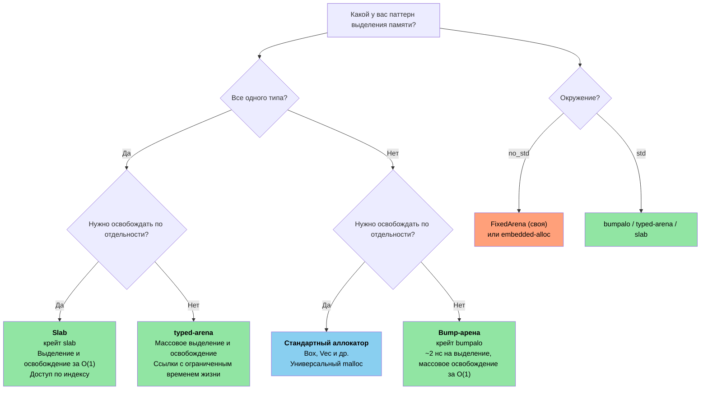

# 12. Unsafe Rust: контролируемая опасность 🔴

> **Что вы узнаете:**
> - Пять сверхспособностей unsafe и когда нужна каждая из них
> - Как писать корректные абстракции: безопасный API поверх небезопасного кода
> - Паттерны FFI для вызова C из Rust (и наоборот)
> - Распространённые ловушки UB и паттерны арена- и slab-аллокаторов

## Пять сверхспособностей unsafe

`unsafe` открывает пять операций, которые компилятор не может проверить:

```rust
// SAFETY: каждая операция объяснена ниже, по месту.
unsafe {
    // 1. Разыменование сырого указателя
    let ptr: *const i32 = &42;
    let value = *ptr; // Может быть висячим или нулевым указателем

    // 2. Вызов небезопасной функции
    let layout = std::alloc::Layout::new::<u64>();
    let mem = std::alloc::alloc(layout);

    // 3. Доступ к изменяемой статической переменной
    static mut COUNTER: u32 = 0;
    COUNTER += 1; // Гонка данных, если к ней обращаются несколько потоков

    // 4. Реализация небезопасного трейта
    // unsafe impl Send for MyType {}

    // 5. Доступ к полям union
    // union IntOrFloat { i: i32, f: f32 }
    // let u = IntOrFloat { i: 42 };
    // let f = u.f; // Переинтерпретация битов: результат может быть мусором
}
```

> **Ключевой принцип**: `unsafe` не отключает проверку заимствований и систему типов. Он открывает только эти пять конкретных возможностей. Все остальные правила Rust по-прежнему действуют.

### Написание корректных абстракций

Назначение `unsafe` в том, чтобы построить **безопасные абстракции** вокруг небезопасных операций:

```rust
/// Буфер фиксированной ёмкости, размещённый на стеке.
/// Все публичные методы безопасны: unsafe инкапсулирован.
pub struct StackBuf<T, const N: usize> {
    data: [std::mem::MaybeUninit<T>; N],
    len: usize,
}

impl<T, const N: usize> StackBuf<T, N> {
    pub fn new() -> Self {
        StackBuf {
            // Каждый элемент — отдельный MaybeUninit: unsafe не нужен.
            // Блоки `const { ... }` (Rust 1.79+) позволяют повторить
            // константное выражение, не реализующее Copy, N раз.
            data: [const { std::mem::MaybeUninit::uninit() }; N],
            len: 0,
        }
    }

    pub fn push(&mut self, value: T) -> Result<(), T> {
        if self.len >= N {
            return Err(value); // Буфер заполнен: возвращаем значение вызывающей стороне
        }
        // SAFETY: len < N, поэтому data[len] находится в пределах.
        // Записываем корректный T в ячейку MaybeUninit.
        self.data[self.len] = std::mem::MaybeUninit::new(value);
        self.len += 1;
        Ok(())
    }

    pub fn get(&self, index: usize) -> Option<&T> {
        if index < self.len {
            // SAFETY: index < len, и data[0..len] все инициализированы.
            Some(unsafe { self.data[index].assume_init_ref() })
        } else {
            None
        }
    }
}

impl<T, const N: usize> Drop for StackBuf<T, N> {
    fn drop(&mut self) {
        // SAFETY: data[0..len] инициализированы: уничтожаем их правильно.
        for i in 0..self.len {
            unsafe { self.data[i].assume_init_drop(); }
        }
    }
}
```

**Три правила корректного unsafe-кода**:
1. **Документируйте инварианты**: каждый комментарий `// SAFETY:` объясняет, почему операция допустима
2. **Инкапсулируйте**: unsafe находится внутри безопасного API, и пользователи не могут вызвать UB
3. **Минимизируйте**: unsafe-блок должен быть как можно меньше

### Паттерны FFI: вызов C из Rust

```rust
// Объявляем сигнатуру функции C:
extern "C" {
    fn strlen(s: *const std::ffi::c_char) -> usize;
    fn printf(format: *const std::ffi::c_char, ...) -> std::ffi::c_int;
}

// Безопасная обёртка:
fn safe_strlen(s: &str) -> usize {
    let c_string = std::ffi::CString::new(s).expect("строка содержит нулевой байт");
    // SAFETY: c_string — корректная строка с нулевым завершителем, живёт на время вызова.
    unsafe { strlen(c_string.as_ptr()) }
}

// Вызов Rust из C (экспорт функции):
#[no_mangle]
pub extern "C" fn rust_add(a: i32, b: i32) -> i32 {
    a + b
}
```

**Распространённые типы FFI**:

| Rust | C | Примечания |
|------|---|------------|
| `i32` / `u32` | `int32_t` / `uint32_t` | Фиксированная ширина, безопасно |
| `*const T` / `*mut T` | `const T*` / `T*` | Сырые указатели |
| `std::ffi::CStr` | `const char*` (заимствованная) | С нулевым завершителем, заимствованная |
| `std::ffi::CString` | `char*` (владеющая) | С нулевым завершителем, владеющая |
| `std::ffi::c_void` | `void` | Непрозрачная цель указателя |
| `Option<fn(...)>` | Указатель на функцию, который может быть NULL | `None` = NULL |

### Распространённые ловушки UB

| Ловушка | Пример | Почему это UB |
|---------|--------|---------------|
| Разыменование null | `*std::ptr::null::<i32>()` | Разыменование null всегда UB |
| Висячий указатель | Разыменование после `drop()` | Память может быть переиспользована |
| Гонка данных | Два потока пишут в `static mut` | Несинхронизированная параллельная запись |
| Неверный `assume_init` | `MaybeUninit::<String>::uninit().assume_init()` | Чтение неинициализированной памяти. **Примечание**: `[const { MaybeUninit::uninit() }; N]` (Rust 1.79+) это безопасный способ создать массив `MaybeUninit`: не нужны ни `unsafe`, ни `assume_init` (см. `StackBuf::new()` выше). |
| Нарушение псевдонимов | Создание двух `&mut` на одни и те же данные | Нарушает модель псевдонимов Rust |
| Недопустимое значение перечисления | `std::mem::transmute::<u8, bool>(2)` | `bool` может быть только 0 или 1 |

> **Когда использовать `unsafe` в продакшене**:
> - Границы FFI (вызов кода на C/C++)
> - Критичные к производительности внутренние циклы (избегаем проверок границ)
> - Создание примитивов (`Vec`, `HashMap`: они используют unsafe внутри)
> - Никогда не используйте в прикладной логике, если можно обойтись

### Пользовательские аллокаторы: паттерны арен и slab

В C для особых паттернов выделения памяти пишут собственные замены `malloc()`: арена-аллокаторы, которые освобождают всё разом, slab-аллокаторы для объектов фиксированного размера или пул-аллокаторы для систем с высокой пропускной способностью. Rust даёт ту же мощь через трейт `GlobalAlloc` и крейты-аллокаторы, плюс дополнительное преимущество: арены с ограничением по времени жизни **предотвращают use-after-free на этапе компиляции**.

#### Арена-аллокаторы: массовое выделение, массовое освобождение

Арена выделяет память, продвигая указатель вперёд. Отдельные элементы освободить нельзя: вся арена освобождается разом. Это идеально подходит для выделений, привязанных к запросу или кадру:

```rust
use bumpalo::Bump;

fn process_sensor_frame(raw_data: &[u8]) {
    // Создаём арену для выделений этого кадра
    let arena = Bump::new();

    // Выделяем объекты в арене: ~2 нс каждое (просто сдвиг указателя)
    let header = arena.alloc(parse_header(raw_data));
    let readings: &mut [f32] = arena.alloc_slice_fill_default(header.sensor_count);

    for (i, chunk) in raw_data[header.payload_offset..].chunks(4).enumerate() {
        if i < readings.len() {
            readings[i] = f32::from_le_bytes(chunk.try_into().unwrap());
        }
    }

    // Используем readings...
    let avg = readings.iter().sum::<f32>() / readings.len() as f32;
    println!("Средняя по кадру: {avg:.2}");

    // Арена уничтожается здесь: ВСЕ выделения освобождаются разом за O(1)
    // Никаких деструкторов для каждого объекта, никакой фрагментации
}
# fn parse_header(_: &[u8]) -> Header { Header { sensor_count: 4, payload_offset: 8 } }
# struct Header { sensor_count: usize, payload_offset: usize }
```

**Арена против стандартного аллокатора**:

| Аспект | `Vec::new()` / `Box::new()` | Арена `Bump` |
|--------|-----------------------------|--------------|
| Скорость выделения | ~25 нс (malloc) | ~2 нс (сдвиг указателя) |
| Скорость освобождения | Деструктор каждого объекта | Массовое освобождение за O(1) |
| Фрагментация | Есть (долгоживущие процессы) | Нет внутри арены |
| Безопасность времён жизни | Куча: освобождается при `Drop` | Ссылка на арену: проверяется на этапе компиляции |
| Сценарий | Универсальное назначение | Обработка запросов, кадров, пакетов |

#### `typed-arena`: арена с контролем типов

Когда все объекты арены одного типа, `typed-arena` предоставляет более простой API, который возвращает ссылки с временем жизни арены:

```rust
use typed_arena::Arena;

struct AstNode<'a> {
    value: i32,
    children: Vec<&'a AstNode<'a>>,
}

fn build_tree() {
    let arena: Arena<AstNode<'_>> = Arena::new();

    // Выделяем узлы: возвращается &AstNode, привязанный ко времени жизни арены
    let root = arena.alloc(AstNode { value: 1, children: vec![] });
    let left = arena.alloc(AstNode { value: 2, children: vec![] });
    let right = arena.alloc(AstNode { value: 3, children: vec![] });

    // Строим дерево: все ссылки действительны, пока жива `arena`
    // (для по-настоящему изменяемых деревьев нужна внутренняя изменяемость)

    println!("Корень: {}, левый: {}, правый: {}", root.value, left.value, right.value);

    // `arena` уничтожается здесь: все узлы освобождаются разом
}
```

#### Slab-аллокаторы: пулы объектов фиксированного размера

Slab-аллокатор заранее выделяет пул слотов фиксированного размера. Объекты выделяются и возвращаются по отдельности, но все слоты одного размера. Это устраняет фрагментацию и обеспечивает выделение и освобождение за O(1):

```rust
use slab::Slab;

struct Connection {
    id: u64,
    buffer: [u8; 1024],
    active: bool,
}

fn connection_pool_example() {
    // Заранее выделяем slab для соединений
    let mut connections: Slab<Connection> = Slab::with_capacity(256);

    // insert возвращает ключ (индекс usize): O(1)
    let key1 = connections.insert(Connection {
        id: 1001,
        buffer: [0; 1024],
        active: true,
    });

    let key2 = connections.insert(Connection {
        id: 1002,
        buffer: [0; 1024],
        active: true,
    });

    // Доступ по ключу: O(1)
    if let Some(conn) = connections.get_mut(key1) {
        conn.buffer[0..5].copy_from_slice(b"hello");
    }

    // remove возвращает значение: O(1), слот переиспользуется при следующей вставке
    let removed = connections.remove(key2);
    assert_eq!(removed.id, 1002);

    // Следующая вставка переиспользует освобождённый слот: без фрагментации
    let key3 = connections.insert(Connection {
        id: 1003,
        buffer: [0; 1024],
        active: true,
    });
    assert_eq!(key3, key2); // Тот же слот переиспользован!
}
```

#### Минимальная арена (для `no_std`)

Для bare-metal окружений, где нельзя подключить `bumpalo`, вот минимальная арена на `unsafe`:

```rust
#![cfg_attr(not(test), no_std)]

use core::alloc::Layout;
use core::cell::{Cell, UnsafeCell};

/// Простой bump-аллокатор на основе массива байтов фиксированного размера.
/// Не потокобезопасен: используйте отдельную арену на ядро или защищайте её блокировкой
/// для многопоточного кода.
///
/// **Важно**: как и `bumpalo`, эта арена НЕ вызывает деструкторы для выделенных
/// объектов при уничтожении арены. Типы с реализацией `Drop` будут утекать
/// свои ресурсы (дескрипторы файлов, сокеты и т. п.). Выделяйте только типы
/// без существенной реализации `Drop` или уничтожайте их вручную до арены.
pub struct FixedArena<const N: usize> {
    // UnsafeCell обязателен здесь: мы изменяем `buf` через `&self`.
    // Без UnsafeCell приведение &self.buf к *mut u8 было бы UB
    // (нарушает модель псевдонимов Rust: разделяемая ссылка подразумевает неизменяемость).
    buf: UnsafeCell<[u8; N]>,
    offset: Cell<usize>, // Внутренняя изменяемость для выделения через &self
}

impl<const N: usize> FixedArena<N> {
    pub const fn new() -> Self {
        FixedArena {
            buf: UnsafeCell::new([0; N]),
            offset: Cell::new(0),
        }
    }

    /// Выделяет `T` в арене. Возвращает `None`, если места нет.
    pub fn alloc<T>(&self, value: T) -> Option<&mut T> {
        let layout = Layout::new::<T>();
        let current = self.offset.get();

        // Выравнивание вверх
        let aligned = (current + layout.align() - 1) & !(layout.align() - 1);
        let new_offset = aligned + layout.size();

        if new_offset > N {
            return None; // Арена заполнена
        }

        self.offset.set(new_offset);

        // SAFETY:
        // - `aligned` находится в пределах `buf` (проверено выше)
        // - Выравнивание корректно (по требованию T)
        // - Без псевдонимов: каждое выделение возвращает уникальную непересекающуюся область
        // - UnsafeCell даёт право изменять через &self
        // - Арена переживёт возвращённую ссылку (это должен обеспечить вызывающий код)
        let ptr = unsafe {
            let base = (self.buf.get() as *mut u8).add(aligned);
            let typed = base as *mut T;
            typed.write(value);
            &mut *typed
        };

        Some(ptr)
    }

    /// Сбрасывает арену: делает недействительными все предыдущие выделения.
    ///
    /// # Safety
    /// Вызывающий код должен гарантировать, что ссылок на данные арены не осталось.
    pub unsafe fn reset(&self) {
        self.offset.set(0);
    }

    pub fn used(&self) -> usize {
        self.offset.get()
    }

    pub fn remaining(&self) -> usize {
        N - self.offset.get()
    }
}
```

#### Выбор стратегии аллокатора

> **Примечание**: диаграмма ниже использует синтаксис Mermaid. Она отображается на GitHub и в инструментах с поддержкой Mermaid (mdBook с плагином `mermaid`, VS Code с расширением Mermaid). В простых просмотрщиках Markdown вы увидите исходный код.



| Паттерн C | Аналог в Rust | Ключевое преимущество |
|-----------|---------------|------------------------|
| Пул поверх `malloc()` | Реализация `#[global_allocator]` | Типобезопасно, удобно для отладки |
| `obstack` (GNU) | `bumpalo::Bump` | Ограничено временем жизни, без use-after-free |
| Slab ядра (`kmem_cache`) | `slab::Slab<T>` | Типобезопасно, доступ по индексу |
| Временный буфер на стеке | `FixedArena<N>` (выше) | Без кучи, создаётся в `const`-контексте |
| `alloca()` | `[T; N]` или `SmallVec` | Размер известен на этапе компиляции, без UB |

> **Перекрёстная ссылка**: настройка аллокатора для bare-metal (`#[global_allocator]` с `embedded-alloc`) описана в книге *Rust Training for C Programmers*, глава 15.1 «Global Allocator Setup», где рассмотрена начальная загрузка, специфичная для встраиваемых систем.

> **Ключевые выводы: unsafe Rust**
> - Документируйте инварианты (комментарии `SAFETY:`), инкапсулируйте их за безопасными API и минимизируйте область unsafe
> - `[const { MaybeUninit::uninit() }; N]` (Rust 1.79+) заменяет устаревший антипаттерн с `assume_init`
> - FFI требует `extern "C"`, `#[repr(C)]` и аккуратной обработки null и времён жизни
> - Арена- и slab-аллокаторы обменивают универсальность на скорость выделения

> **См. также:** [гл. 4 — PhantomData](ch04-phantomdata-types-that-carry-no-data.md) о взаимодействии вариантности и проверки drop с unsafe-кодом. [гл. 9 — Умные указатели](ch09-smart-pointers-and-interior-mutability.md) о Pin и самоссылающихся типах.

---

### Упражнение: безопасная обёртка над unsafe ★★★ (~45 минут)

Напишите `FixedVec<T, const N: usize>`: вектор фиксированной ёмкости, размещённый на стеке. Требования:
- `push(&mut self, value: T) -> Result<(), T>` возвращает `Err(value)`, когда вектор заполнен
- `pop(&mut self) -> Option<T>` возвращает и удаляет последний элемент
- `as_slice(&self) -> &[T]` заимствует инициализированные элементы
- Все публичные методы должны быть безопасными; весь unsafe инкапсулирован с комментариями `SAFETY:`
- `Drop` должен очищать инициализированные элементы

<details>
<summary>🔑 Решение</summary>

```rust
use std::mem::MaybeUninit;

pub struct FixedVec<T, const N: usize> {
    data: [MaybeUninit<T>; N],
    len: usize,
}

impl<T, const N: usize> FixedVec<T, N> {
    pub fn new() -> Self {
        FixedVec {
            data: [const { MaybeUninit::uninit() }; N],
            len: 0,
        }
    }

    pub fn push(&mut self, value: T) -> Result<(), T> {
        if self.len >= N { return Err(value); }
        // SAFETY: len < N, поэтому data[len] находится в пределах.
        self.data[self.len] = MaybeUninit::new(value);
        self.len += 1;
        Ok(())
    }

    pub fn pop(&mut self) -> Option<T> {
        if self.len == 0 { return None; }
        self.len -= 1;
        // SAFETY: data[len] был инициализирован (len был > 0 до уменьшения).
        Some(unsafe { self.data[self.len].assume_init_read() })
    }

    pub fn as_slice(&self) -> &[T] {
        // SAFETY: data[0..len] инициализированы, и MaybeUninit<T>
        // имеет ту же раскладку, что и T.
        unsafe { std::slice::from_raw_parts(self.data.as_ptr() as *const T, self.len) }
    }

    pub fn len(&self) -> usize { self.len }
    pub fn is_empty(&self) -> bool { self.len == 0 }
}

impl<T, const N: usize> Drop for FixedVec<T, N> {
    fn drop(&mut self) {
        // SAFETY: data[0..len] инициализированы: уничтожаем каждый.
        for i in 0..self.len {
            unsafe { self.data[i].assume_init_drop(); }
        }
    }
}

fn main() {
    let mut v = FixedVec::<String, 4>::new();
    v.push("hello".into()).unwrap();
    v.push("world".into()).unwrap();
    assert_eq!(v.as_slice(), &["hello", "world"]);
    assert_eq!(v.pop(), Some("world".into()));
    assert_eq!(v.len(), 1);
}
```

</details>

***
