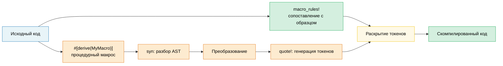

# 13. Макросы: код, который пишет код 🟡

> **Что вы узнаете:**
> - Декларативные макросы (`macro_rules!`) с сопоставлением с образцом и повторениями
> - Когда макросы подходят лучше обобщений и трейтов
> - Процедурные макросы: derive-, атрибутные и функциональные
> - Написание собственного derive-макроса с `syn` и `quote`

## Декларативные макросы (macro_rules!)

Макросы сопоставляют образцы с синтаксисом и раскрываются в код на этапе компиляции:

```rust
// Простой макрос, который создаёт HashMap
macro_rules! hashmap {
    // Сопоставление: пары «ключ => значение», разделённые запятыми
    ( $( $key:expr => $value:expr ),* $(,)? ) => {
        {
            let mut map = std::collections::HashMap::new();
            $( map.insert($key, $value); )*
            map
        }
    };
}

let scores = hashmap! {
    "Alice" => 95,
    "Bob" => 87,
    "Carol" => 92,
};
// Раскрывается в:
// let mut map = HashMap::new();
// map.insert("Alice", 95);
// map.insert("Bob", 87);
// map.insert("Carol", 92);
// map
```

**Типы фрагментов в макросах**:

| Фрагмент | Что сопоставляет | Пример |
|----------|------------------|--------|
| `$x:expr` | Любое выражение | `42`, `a + b`, `foo()` |
| `$x:ty` | Тип | `i32`, `Vec<String>` |
| `$x:ident` | Идентификатор | `my_var`, `Config` |
| `$x:pat` | Образец | `Some(x)`, `_` |
| `$x:stmt` | Инструкцию | `let x = 5;` |
| `$x:tt` | Одно дерево токенов | Что угодно (самый гибкий) |
| `$x:literal` | Литерал | `42`, `"hello"`, `true` |

**Повторения**: `$( ... ),*` означает «ноль или больше, разделённых запятыми»

```rust
// Автоматически генерируем тестовые функции
macro_rules! test_cases {
    ( $( $name:ident: $input:expr => $expected:expr ),* $(,)? ) => {
        $(
            #[test]
            fn $name() {
                assert_eq!(process($input), $expected);
            }
        )*
    };
}

test_cases! {
    test_empty: "" => "",
    test_hello: "hello" => "HELLO",
    test_trim: "  spaces  " => "SPACES",
}
// Генерирует три отдельные функции #[test]
```

### Когда (не) стоит использовать макросы

**Используйте макросы, когда**:
- Нужно убрать шаблонный код, с которым не справляются трейты и обобщения (вариативные аргументы, генерация тестов без повторов, DRY)
- Создаёте предметно-ориентированный язык (DSL), например `html!`, `sql!`, `vec!`
- Нужна условная генерация кода (`cfg!`, `compile_error!`)

**Не используйте макросы, когда**:
- Подойдёт функция или обобщение (макросы труднее отлаживать, и автодополнение в них не помогает)
- Внутри макроса нужна проверка типов (макросы работают с токенами, а не с типами)
- Шаблон используется один-два раза (абстракция не стоит того)

```rust
// ❌ Лишний макрос: функция справляется
macro_rules! double {
    ($x:expr) => { $x * 2 };
}

// ✅ Просто используйте функцию:
fn double(x: i32) -> i32 { x * 2 }

// ✅ Хорошее применение макроса: вариативные аргументы, не может быть функцией:
macro_rules! println {
    ($($arg:tt)*) => { /* строка формата + аргументы */ };
}
```

### Обзор процедурных макросов

Процедурные макросы это функции на Rust, которые преобразуют потоки токенов. Они требуют отдельного крейта с `proc-macro = true`:

```rust
// Три вида процедурных макросов:

// 1. Derive-макросы — #[derive(MyTrait)]
// Генерируют реализации трейтов по определениям структур
#[derive(Debug, Clone, Serialize, Deserialize)]
struct Config {
    name: String,
    port: u16,
}

// 2. Атрибутные макросы — #[my_attribute]
// Преобразуют помеченный элемент
#[route(GET, "/api/users")]
async fn list_users() -> Json<Vec<User>> { /* ... */ }

// 3. Функциональные макросы — my_macro!(...)
// Пользовательский синтаксис
let query = sql!(SELECT * FROM users WHERE id = ?);
```

### Derive-макросы на практике

Это самый распространённый вид процедурных макросов. Вот как концептуально работает `#[derive(Debug)]`:

```rust
// Вход (ваша структура):
#[derive(Debug)]
struct Point {
    x: f64,
    y: f64,
}

// Derive-макрос генерирует:
impl std::fmt::Debug for Point {
    fn fmt(&self, f: &mut std::fmt::Formatter<'_>) -> std::fmt::Result {
        f.debug_struct("Point")
            .field("x", &self.x)
            .field("y", &self.y)
            .finish()
    }
}
```

**Часто используемые derive-макросы**:

| Derive | Крейт | Что генерирует |
|--------|-------|----------------|
| `Debug` | std | Реализацию `fmt::Debug` (отладочный вывод) |
| `Clone`, `Copy` | std | Дублирование значений |
| `PartialEq`, `Eq` | std | Сравнение на равенство |
| `Hash` | std | Хеширование для ключей HashMap |
| `Serialize`, `Deserialize` | serde | Кодирование в JSON, YAML и др. |
| `Error` | thiserror | `std::error::Error` и `Display` |
| `Parser` | `clap` | Разбор аргументов командной строки |
| `Builder` | derive_builder | Паттерн builder |

> **Практический совет**: используйте derive-макросы без колебаний: они убирают подверженный ошибкам шаблонный код. Написание собственных процедурных макросов относится к продвинутым темам, поэтому сначала используйте готовые (`serde`, `thiserror`, `clap`).

### Гигиена макросов и `$crate`

**Гигиена** означает, что идентификаторы, созданные внутри макроса, не конфликтуют с идентификаторами в области видимости вызывающего кода. `macro_rules!` в Rust *частично* гигиеничен:

```rust
macro_rules! make_var {
    () => {
        let x = 42; // Этот 'x' находится в области видимости МАКРОСА
    };
}

fn main() {
    let x = 10;
    make_var!();   // Создаёт другой 'x' (гигиенично)
    println!("{x}"); // Выведет 10, а не 42: x из макроса не просачивается наружу
}
```

**`$crate`**: при написании макросов в библиотеке используйте `$crate`, чтобы ссылаться на собственный крейт. Он корректно разрешается независимо от того, как пользователи импортируют ваш крейт:

```rust
// В крейте my_diagnostics:

pub fn log_result(msg: &str) {
    println!("[diag] {msg}");
}

#[macro_export]
macro_rules! diag_log {
    ($($arg:tt)*) => {
        // ✅ $crate всегда ссылается на my_diagnostics, даже если пользователь
        // переименовал крейт в своём Cargo.toml
        $crate::log_result(&format!($($arg)*))
    };
}

// ❌ Без $crate:
// my_diagnostics::log_result(...)  ← сломается, если пользователь напишет:
//   [dependencies]
//   diag = { package = "my_diagnostics", version = "1" }
```

> **Правило**: всегда используйте `$crate::` в макросах с `#[macro_export]`. Никогда не используйте имя своего крейта напрямую.

### Рекурсивные макросы и `tt` munching

Рекурсивные макросы обрабатывают вход по одному токену за раз. Этот приём называется **`tt` munching** (token-tree munching, «поедание» деревьев токенов):

```rust
// Считаем, сколько выражений передано в макрос
macro_rules! count {
    // Базовый случай: токенов не осталось
    () => { 0usize };
    // Рекурсивный случай: забираем одно выражение и считаем остальные
    ($head:expr $(, $tail:expr)* $(,)?) => {
        1usize + count!($($tail),*)
    };
}

fn main() {
    let n = count!("a", "b", "c", "d");
    assert_eq!(n, 4);

    // Работает и на этапе компиляции:
    const N: usize = count!(1, 2, 3);
    assert_eq!(N, 3);
}
```

```rust
// Строим гетерогенный кортеж из списка выражений:
macro_rules! tuple_from {
    // Базовый случай: один элемент
    ($single:expr $(,)?) => { ($single,) };
    // Рекурсивный случай: первый элемент и остальные
    ($head:expr, $($tail:expr),+ $(,)?) => {
        ($head, tuple_from!($($tail),+))
    };
}

let t = tuple_from!(1, "hello", 3.14, true);
// Раскрывается в: (1, ("hello", (3.14, (true,))))
```

**Тонкости фрагментов**:

| Фрагмент | Подвох |
|----------|--------|
| `$x:expr` | Жадный разбор: `1 + 2` это ОДНО выражение, а не три токена |
| `$x:ty` | Жадный разбор: `Vec<String>` это один тип; за ним нельзя ставить `+` или `<` |
| `$x:tt` | Сопоставляет ровно ОДНО дерево токенов: самый гибкий, но меньше всего проверяется |
| `$x:ident` | Только простые идентификаторы, а не пути вроде `std::io` |
| `$x:pat` | В Rust 2021 сопоставляет шаблоны `A \| B`; для одиночных образцов используйте `$x:pat_param` |

> **Когда использовать `tt`**: когда нужно передать токены другому макросу, не ограничивая их парсером. Шаблон `$($args:tt)*` означает «принять всё» (его используют `println!`, `format!`, `vec!`).

### Пишем derive-макрос с `syn` и `quote`

Derive-макросы живут в отдельном крейте (`proc-macro = true`) и преобразуют поток токенов с помощью `syn` (разбор Rust) и `quote` (генерация Rust):

```toml
# my_derive/Cargo.toml
[lib]
proc-macro = true

[dependencies]
syn = { version = "2", features = ["full"] }
quote = "1"
proc-macro2 = "1"
```

```rust
// my_derive/src/lib.rs
use proc_macro::TokenStream;
use quote::quote;
use syn::{parse_macro_input, DeriveInput};

/// Derive-макрос, который генерирует метод `describe()`,
/// возвращающий имя структуры и имена её полей.
#[proc_macro_derive(Describe)]
pub fn derive_describe(input: TokenStream) -> TokenStream {
    let input = parse_macro_input!(input as DeriveInput);
    let name = &input.ident;
    let name_str = name.to_string();

    // Извлекаем имена полей (только для структур с именованными полями)
    let fields = match &input.data {
        syn::Data::Struct(data) => {
            data.fields.iter()
                .filter_map(|f| f.ident.as_ref())
                .map(|id| id.to_string())
                .collect::<Vec<_>>()
        }
        _ => vec![],
    };

    let field_list = fields.join(", ");

    let expanded = quote! {
        impl #name {
            pub fn describe() -> String {
                format!("{} {{ {} }}", #name_str, #field_list)
            }
        }
    };

    TokenStream::from(expanded)
}
```

```rust
// В приложении:
use my_derive::Describe;

#[derive(Describe)]
struct SensorReading {
    sensor_id: u16,
    value: f64,
    timestamp: u64,
}

fn main() {
    println!("{}", SensorReading::describe());
    // "SensorReading { sensor_id, value, timestamp }"
}
```

**Рабочий процесс**: `TokenStream` (сырые токены) → `syn::parse` (AST) → анализ и преобразование → `quote!` (генерация токенов) → `TokenStream` (обратно компилятору).

| Крейт | Роль | Ключевые типы |
|-------|------|---------------|
| `proc-macro` | Интерфейс с компилятором | `TokenStream` |
| `syn` | Разбор исходного кода Rust в AST | `DeriveInput`, `ItemFn`, `Type` |
| `quote` | Генерация токенов Rust из шаблонов | `quote!{}`, интерполяция `#variable` |
| `proc-macro2` | Мост между syn/quote и proc-macro | `TokenStream`, `Span` |

> **Практический совет**: прежде чем писать собственный макрос, изучите исходники простого derive-макроса, например `thiserror` или `derive_more`. Команда `cargo expand` (через `cargo-expand`) показывает, во что раскрывается любой макрос: это бесценно для отладки.

> **Ключевые выводы: макросы**
> - `macro_rules!` для простой генерации кода; процедурные макросы (`syn` и `quote`) для сложных derive-макросов
> - По возможности предпочитайте обобщения и трейты макросам: макросы труднее отлаживать и поддерживать
> - `$crate` обеспечивает гигиену; `tt` munching даёт рекурсивное сопоставление с образцом

> **См. также:** [гл. 2 — Трейты](ch02-traits-in-depth.md) о том, когда трейты и обобщения лучше макросов. [гл. 14 — Тестирование](ch14-testing-and-benchmarking-patterns.md) о тестировании кода, сгенерированного макросами.



---

### Упражнение: декларативный макрос `map!` ★ (~15 минут)

Напишите макрос `map!`, который создаёт `HashMap` из пар ключ-значение:

```rust,ignore
let m = map! {
    "host" => "localhost",
    "port" => "8080",
};
assert_eq!(m.get("host"), Some(&"localhost"));
```

Требования: поддержите завершающую запятую и пустой вызов `map!{}`.

<details>
<summary>🔑 Решение</summary>

```rust
macro_rules! map {
    () => { std::collections::HashMap::new() };
    ( $( $key:expr => $val:expr ),+ $(,)? ) => {{
        let mut m = std::collections::HashMap::new();
        $( m.insert($key, $val); )+
        m
    }};
}

fn main() {
    let config = map! {
        "host" => "localhost",
        "port" => "8080",
        "timeout" => "30",
    };
    assert_eq!(config.len(), 3);
    assert_eq!(config["host"], "localhost");

    let empty: std::collections::HashMap<String, String> = map!();
    assert!(empty.is_empty());

    let scores = map! { 1 => 100, 2 => 200 };
    assert_eq!(scores[&1], 100);
}
```

</details>

***
