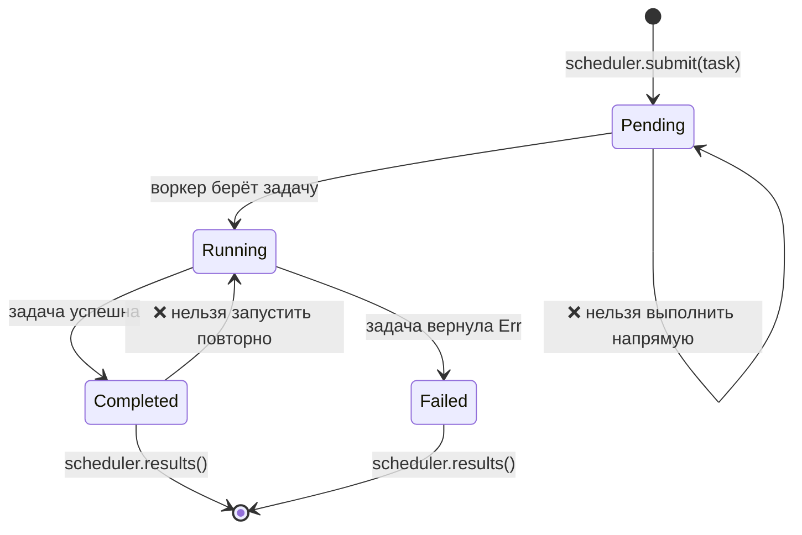

# Итоговый проект: планировщик задач с безопасностью типов

Этот проект объединяет паттерны из всей книги в одну систему промышленного уровня. Вы построите **конкурентный планировщик задач с безопасностью типов**, который использует обобщённые типы, трейты, typestate, каналы, обработку ошибок и тестирование.

**Примерное время**: 4–6 часов | **Сложность**: ★★★

> **Что вы будете практиковать:**
> - Обобщённые типы и границы трейтов (гл. 1–2)
> - Паттерн typestate для жизненного цикла задачи (гл. 3)
> - PhantomData для маркеров состояний без затрат во время выполнения (гл. 4)
> - Каналы для взаимодействия с воркерами (гл. 5)
> - Конкурентность со scoped-потоками (гл. 6)
> - Обработка ошибок с `thiserror` (гл. 10)
> - Тестирование свойств (гл. 14)
> - Дизайн API с `TryFrom` и проверенными типами (гл. 15)

## Постановка задачи

Постройте планировщик задач, в котором:

1. **Задачи** имеют типизированный жизненный цикл: `Pending → Running → Completed` (или `Failed`)
2. **Воркеры** берут задачи из канала, выполняют их и сообщают результаты
3. **Планировщик** управляет отправкой задач, координацией воркеров и сбором результатов
4. Недопустимые переходы состояний являются **ошибками компиляции**



## Шаг 1: определите типы задач

Начните с маркеров typestate и обобщённого `Task`:

```rust
use std::marker::PhantomData;

// --- Маркеры состояний (нулевого размера) ---
struct Pending;
struct Running;
struct Completed;
struct Failed;

// --- Идентификатор задачи (newtype для безопасности типов) ---
#[derive(Debug, Clone, Copy, PartialEq, Eq, Hash)]
struct TaskId(u64);

// --- Структура Task, параметризованная состоянием жизненного цикла ---
struct Task<State, R> {
    id: TaskId,
    name: String,
    _state: PhantomData<State>,
    _result: PhantomData<R>,
}
```

**Ваша задача**: реализуйте переходы состояний так, чтобы:
- `Task<Pending, R>` переходит в `Task<Running, R>` (через `start()`)
- `Task<Running, R>` переходит в `Task<Completed, R>` или `Task<Failed, R>`
- Никакие другие переходы не должны компилироваться

<details>
<summary>💡 Подсказка</summary>

Каждый метод перехода должен поглощать `self` и возвращать новое состояние:

```rust
impl<R> Task<Pending, R> {
    fn start(self) -> Task<Running, R> {
        Task {
            id: self.id,
            name: self.name,
            _state: PhantomData,
            _result: PhantomData,
        }
    }
}
```

</details>

## Шаг 2: определите рабочую функцию

Задачам нужна функция для выполнения. Используйте замыкание в `Box`:

```rust
struct WorkItem<R: Send + 'static> {
    id: TaskId,
    name: String,
    work: Box<dyn FnOnce() -> Result<R, String> + Send>,
}
```

**Ваша задача**: реализуйте `WorkItem::new()`, который принимает имя задачи и замыкание. Добавьте генератор `TaskId` (простой атомарный счётчик или счётчик под мьютексом).

## Шаг 3: обработка ошибок

Определите типы ошибок планировщика с помощью `thiserror`:

```rust,ignore
use thiserror::Error;

#[derive(Error, Debug)]
pub enum SchedulerError {
    #[error("планировщик остановлен")]
    ShutDown,

    #[error("задача {0:?} завершилась с ошибкой: {1}")]
    TaskFailed(TaskId, String),

    #[error("ошибка отправки в канал")]
    ChannelError(#[from] std::sync::mpsc::SendError<()>),

    #[error("воркер завершился паникой")]
    WorkerPanic,
}
```

## Шаг 4: планировщик

Постройте планировщик с помощью каналов (гл. 5) и scoped-потоков (гл. 6):

```rust
use std::sync::mpsc;

struct Scheduler<R: Send + 'static> {
    sender: Option<mpsc::Sender<WorkItem<R>>>,
    results: mpsc::Receiver<TaskResult<R>>,
    num_workers: usize,
}

struct TaskResult<R> {
    id: TaskId,
    name: String,
    outcome: Result<R, String>,
}
```

**Ваша задача**: реализуйте:
- `Scheduler::new(num_workers: usize) -> Self`: создаёт каналы и запускает воркеров
- `Scheduler::submit(&self, item: WorkItem<R>) -> Result<TaskId, SchedulerError>`
- `Scheduler::shutdown(self) -> Vec<TaskResult<R>>`: отбрасывает отправителя, дожидается воркеров и собирает результаты

<details>
<summary>💡 Подсказка: цикл воркера</summary>

```rust
fn worker_loop<R: Send + 'static>(
    rx: std::sync::Arc<std::sync::Mutex<mpsc::Receiver<WorkItem<R>>>>,
    result_tx: mpsc::Sender<TaskResult<R>>,
    worker_id: usize,
) {
    loop {
        let item = {
            let rx = rx.lock().unwrap();
            rx.recv()
        };
        match item {
            Ok(work_item) => {
                let outcome = (work_item.work)();
                let _ = result_tx.send(TaskResult {
                    id: work_item.id,
                    name: work_item.name,
                    outcome,
                });
            }
            Err(_) => break, // Канал закрыт
        }
    }
}
```

</details>

## Шаг 5: интеграционный тест

Напишите тесты, которые проверяют:

1. **Успешный сценарий**: отправьте 10 задач, остановите планировщик и убедитесь, что все 10 результатов имеют значение `Ok`
2. **Обработка ошибок**: отправьте задачи, которые завершаются ошибкой, и убедитесь, что `TaskResult.outcome` равен `Err`
3. **Пустой планировщик**: создайте и сразу остановите его, паник быть не должно
4. **Тест свойств** (бонус): используйте `proptest`, чтобы проверить, что для любого N задач (1..100) планировщик всегда возвращает ровно N результатов

```rust
#[cfg(test)]
mod tests {
    use super::*;

    #[test]
    fn happy_path() {
        let scheduler = Scheduler::<String>::new(4);

        for i in 0..10 {
            let item = WorkItem::new(
                format!("задача-{i}"),
                move || Ok(format!("результат-{i}")),
            );
            scheduler.submit(item).unwrap();
        }

        let results = scheduler.shutdown();
        assert_eq!(results.len(), 10);
        for r in &results {
            assert!(r.outcome.is_ok());
        }
    }

    #[test]
    fn handles_failures() {
        let scheduler = Scheduler::<String>::new(2);

        scheduler.submit(WorkItem::new("удачная", || Ok("ок".into()))).unwrap();
        scheduler.submit(WorkItem::new("неудачная", || Err("сбой".into()))).unwrap();

        let results = scheduler.shutdown();
        assert_eq!(results.len(), 2);

        let failures: Vec<_> = results.iter()
            .filter(|r| r.outcome.is_err())
            .collect();
        assert_eq!(failures.len(), 1);
    }
}
```

## Шаг 6: соберём всё вместе

Вот `main()`, который демонстрирует работу всей системы:

```rust,ignore
fn main() {
    let scheduler = Scheduler::<String>::new(4);

    // Отправляем задачи с разной нагрузкой
    for i in 0..20 {
        let item = WorkItem::new(
            format!("вычисление-{i}"),
            move || {
                // Имитация работы
                std::thread::sleep(std::time::Duration::from_millis(10));
                if i % 7 == 0 {
                    Err(format!("задача {i}: смоделированная ошибка"))
                } else {
                    Ok(format!("задача {i} завершена, значение {}", i * i))
                }
            },
        );
        // ПРИМЕЧАНИЕ: .unwrap() используется для краткости — в продакшене обрабатывайте SendError.
        scheduler.submit(item).unwrap();
    }

    println!("Все задачи отправлены. Останавливаем планировщик...");
    let results = scheduler.shutdown();

    let (ok, err): (Vec<_>, Vec<_>) = results.iter()
        .partition(|r| r.outcome.is_ok());

    println!("\n✅ Успешно: {}", ok.len());
    for r in &ok {
        println!("  {} → {}", r.name, r.outcome.as_ref().unwrap());
    }

    println!("\n❌ С ошибкой: {}", err.len());
    for r in &err {
        println!("  {} → {}", r.name, r.outcome.as_ref().unwrap_err());
    }
}
```

## Критерии оценки

| Критерий | Требование |
|----------|------------|
| Безопасность типов | Недопустимые переходы состояний не компилируются |
| Конкурентность | Воркеры работают параллельно, гонок данных нет |
| Обработка ошибок | Все сбои сохраняются в `TaskResult`, паник нет |
| Тестирование | Не менее 3 тестов; бонус за proptest |
| Организация кода | Понятная структура модулей, публичный API использует проверенные типы |
| Документация | У ключевых типов есть doc-комментарии с описанием инвариантов |

## Идеи для развития

Когда базовый планировщик заработает, попробуйте эти улучшения:

1. **Очередь с приоритетами**: добавьте newtype `Priority` (1–10) и сначала обрабатывайте задачи с более высоким приоритетом
2. **Политика повторов**: задача, завершившаяся ошибкой, повторяется до N раз, прежде чем получит статус окончательно проваленной
3. **Отмена**: добавьте метод `cancel(TaskId)`, который удаляет ожидающие задачи
4. **Асинхронная версия**: перенесите на `tokio::spawn` с каналами `tokio::sync::mpsc` (гл. 16)
5. **Метрики**: отслеживайте количество задач по каждому воркеру, среднее время выполнения и долю ошибок

***
