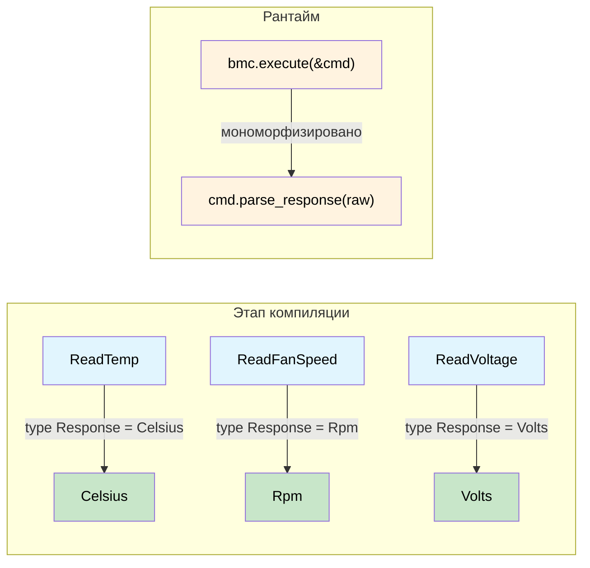

# Типизированные командные интерфейсы: запрос определяет ответ 🟡

> **Что вы узнаете:** как ассоциированные типы в трейте команды создают связь между запросом и ответом на этапе компиляции, устраняя рассогласованный разбор данных, путаницу единиц измерения и тихое приведение типов в протоколах IPMI, Redfish и NVMe.
>
> **Перекрёстные ссылки:** [гл. 01](ch01-the-philosophy-why-types-beat-tests.md) (философия), [гл. 06](ch06-dimensional-analysis-making-the-compiler.md) (размерные типы), [гл. 07](ch07-validated-boundaries-parse-dont-validate.md) (проверенные границы), [гл. 10](ch10-putting-it-all-together-a-complete-diagn.md) (интеграция)

## Неструктурированное болото

Большинство стеков управления аппаратным обеспечением — IPMI, Redfish, NVMe Admin, PLDM — начинаются с модели `сырые байты на входе → сырые байты на выходе`. Это порождает класс ошибок, которые тесты могут найти лишь частично:

```rust,ignore
use std::io;

struct BmcRaw { /* дескриптор ipmitool */ }

impl BmcRaw {
    fn raw_command(&self, net_fn: u8, cmd: u8, data: &[u8]) -> io::Result<Vec<u8>> {
        // ... вызывает ipmitool ...
        Ok(vec![0x00, 0x19, 0x00]) // заглушка
    }
}

fn diagnose_thermal(bmc: &BmcRaw) -> io::Result<()> {
    let raw = bmc.raw_command(0x04, 0x2D, &[0x20])?;
    let cpu_temp = raw[0] as f64;        // 🤞 а байт 0 — точно показание?

    let raw = bmc.raw_command(0x04, 0x2D, &[0x30])?;
    let fan_rpm = raw[0] as u32;         // 🐛 скорость вентилятора — 2 байта, little-endian

    let raw = bmc.raw_command(0x04, 0x2D, &[0x40])?;
    let voltage = raw[0] as f64;         // 🐛 нужно поделить на 1000

    if cpu_temp > fan_rpm as f64 {       // 🐛 сравниваем °C с об/мин
        println!("упс");
    }

    log_temp(voltage);                   // 🐛 передаём вольты как температуру
    Ok(())
}

fn log_temp(t: f64) { println!("Температура: {t}°C"); }
```

| № | Ошибка | Когда обнаружена |
|---|--------|------------------|
| 1 | Скорость вентилятора разобрана как 1 байт вместо 2 | В продакшене, в 3 часа ночи |
| 2 | Напряжение не масштабировано | Каждый блок питания помечен как перенапряжение |
| 3 | Сравнение °C с об/мин | Возможно, никогда |
| 4 | Вольты переданы в логгер температуры | Через полгода, при чтении исторических данных |

**Первопричина:** всё превращено в `Vec<u8>` → `f64` → и молимся.

## Паттерн типизированной команды

### Шаг 1 — Доменные newtype

```rust,ignore
#[derive(Debug, Clone, Copy, PartialEq, PartialOrd)]
pub struct Celsius(pub f64);

#[derive(Debug, Clone, Copy, PartialEq, PartialOrd)]
pub struct Rpm(pub u32);  // u32: сырое целочисленное показание датчика IPMI (об/мин)

#[derive(Debug, Clone, Copy, PartialEq, PartialOrd)]
pub struct Volts(pub f64);

#[derive(Debug, Clone, Copy, PartialEq, PartialOrd)]
pub struct Watts(pub f64);
```

> **Примечание о `Rpm(u32)` и `Rpm(f64)`:** в этой главе внутренний тип — `u32`, потому что показания датчиков IPMI — целые значения. В гл. 06 (анализ размерностей) `Rpm` использует `f64`, чтобы поддерживать арифметические операции (усреднение, масштабирование). Оба варианта допустимы: newtype предотвращает путаницу между единицами независимо от внутреннего типа.

### Шаг 2 — Трейт команды (диспетчеризация по индексу типа)

Ассоциированный тип `Response` — ключевой элемент: он связывает каждую структуру команды с её возвращаемым типом. Каждая реализующая структура фиксирует `Response` на конкретном доменном типе, поэтому `execute()` всегда возвращает ровно нужный тип:

```rust,ignore
pub trait IpmiCmd {
    /// «Индекс типа» — определяет, что возвращает execute().
    type Response;

    fn net_fn(&self) -> u8;
    fn cmd_byte(&self) -> u8;
    fn payload(&self) -> Vec<u8>;

    /// Разбор инкапсулирован здесь — каждая команда знает свою раскладку байтов.
    fn parse_response(&self, raw: &[u8]) -> io::Result<Self::Response>;
}
```

### Шаг 3 — Одна структура на команду

```rust,ignore
pub struct ReadTemp { pub sensor_id: u8 }
impl IpmiCmd for ReadTemp {
    type Response = Celsius;
    fn net_fn(&self) -> u8 { 0x04 }
    fn cmd_byte(&self) -> u8 { 0x2D }
    fn payload(&self) -> Vec<u8> { vec![self.sensor_id] }
    fn parse_response(&self, raw: &[u8]) -> io::Result<Celsius> {
        if raw.is_empty() {
            return Err(io::Error::new(io::ErrorKind::InvalidData, "пустой ответ"));
        }
        // Примечание: нетипизированный пример из гл. 01 использует `raw[0] as i8 as f64`
        // (со знаком), потому что та функция демонстрировала обобщённый разбор без
        // метаданных SDR. Здесь мы используем беззнаковое значение (`as f64`), так как
        // формула линеаризации SDR из раздела 35.5 спецификации IPMI преобразует
        // беззнаковое сырое показание в калиброванное значение. В продакшене примените
        // полную формулу SDR: result = (M × raw + B) × 10^(R_exp).
        Ok(Celsius(raw[0] as f64))  // беззнаковый сырой байт, преобразуется по формуле SDR
    }
}

pub struct ReadFanSpeed { pub fan_id: u8 }
impl IpmiCmd for ReadFanSpeed {
    type Response = Rpm;
    fn net_fn(&self) -> u8 { 0x04 }
    fn cmd_byte(&self) -> u8 { 0x2D }
    fn payload(&self) -> Vec<u8> { vec![self.fan_id] }
    fn parse_response(&self, raw: &[u8]) -> io::Result<Rpm> {
        if raw.len() < 2 {
            return Err(io::Error::new(io::ErrorKind::InvalidData,
                format!("для скорости вентилятора нужно 2 байта, получено {}", raw.len())));
        }
        Ok(Rpm(u16::from_le_bytes([raw[0], raw[1]]) as u32))
    }
}

pub struct ReadVoltage { pub rail: u8 }
impl IpmiCmd for ReadVoltage {
    type Response = Volts;
    fn net_fn(&self) -> u8 { 0x04 }
    fn cmd_byte(&self) -> u8 { 0x2D }
    fn payload(&self) -> Vec<u8> { vec![self.rail] }
    fn parse_response(&self, raw: &[u8]) -> io::Result<Volts> {
        if raw.len() < 2 {
            return Err(io::Error::new(io::ErrorKind::InvalidData,
                format!("для напряжения нужно 2 байта, получено {}", raw.len())));
        }
        Ok(Volts(u16::from_le_bytes([raw[0], raw[1]]) as f64 / 1000.0))
    }
}
```

### Шаг 4 — Исполнитель (без `dyn`, мономорфизированный)

```rust,ignore
pub struct BmcConnection { pub timeout_secs: u32 }

impl BmcConnection {
    pub fn execute<C: IpmiCmd>(&self, cmd: &C) -> io::Result<C::Response> {
        let raw = self.raw_send(cmd.net_fn(), cmd.cmd_byte(), &cmd.payload())?;
        cmd.parse_response(&raw)
    }

    fn raw_send(&self, _nf: u8, _cmd: u8, _data: &[u8]) -> io::Result<Vec<u8>> {
        Ok(vec![0x19, 0x00]) // заглушка
    }
}
```

### Шаг 5 — Все четыре ошибки становятся ошибками компиляции

```rust,ignore
fn diagnose_thermal_typed(bmc: &BmcConnection) -> io::Result<()> {
    let cpu_temp: Celsius = bmc.execute(&ReadTemp { sensor_id: 0x20 })?;
    let fan_rpm:  Rpm     = bmc.execute(&ReadFanSpeed { fan_id: 0x30 })?;
    let voltage:  Volts   = bmc.execute(&ReadVoltage { rail: 0x40 })?;

    // Ошибка №1 — НЕВОЗМОЖНА: разбор находится в ReadFanSpeed::parse_response
    // Ошибка №2 — НЕВОЗМОЖНА: масштабирование единиц находится в ReadVoltage::parse_response

    // Ошибка №3 — ОШИБКА КОМПИЛЯЦИИ:
    // if cpu_temp > fan_rpm { }
    //    ^^^^^^^^   ^^^^^^^ Celsius и Rpm → "mismatched types" ❌

    // Ошибка №4 — ОШИБКА КОМПИЛЯЦИИ:
    // log_temperature(voltage);
    //                 ^^^^^^^ Volts, ожидается Celsius ❌

    if cpu_temp > Celsius(85.0) { println!("Перегрев CPU: {:?}", cpu_temp); }
    if fan_rpm < Rpm(4000)      { println!("Вентилятор слишком медленный: {:?}", fan_rpm); }

    Ok(())
}

fn log_temperature(t: Celsius) { println!("Температура: {:?}", t); }
fn log_voltage(v: Volts)       { println!("Напряжение: {:?}", v); }
```

## IPMI: показания датчиков, которые нельзя перепутать

Добавление нового датчика — это одна структура и одна реализация, без разбросанного по коду разбора:

```rust,ignore
pub struct ReadPowerDraw { pub domain: u8 }
impl IpmiCmd for ReadPowerDraw {
    type Response = Watts;
    fn net_fn(&self) -> u8 { 0x04 }
    fn cmd_byte(&self) -> u8 { 0x2D }
    fn payload(&self) -> Vec<u8> { vec![self.domain] }
    fn parse_response(&self, raw: &[u8]) -> io::Result<Watts> {
        if raw.len() < 2 {
            return Err(io::Error::new(io::ErrorKind::InvalidData,
                format!("для потребляемой мощности нужно 2 байта, получено {}", raw.len())));
        }
        Ok(Watts(u16::from_le_bytes([raw[0], raw[1]]) as f64))
    }
}

// Любой вызов bmc.execute(&ReadPowerDraw { domain: 0 }) автоматически возвращает Watts —
// никакого кода разбора в других местах
```

### Тестирование каждой команды изолированно

```rust,ignore
#[cfg(test)]
mod tests {
    use super::*;

    struct StubBmc {
        responses: std::collections::HashMap<u8, Vec<u8>>,
    }

    impl StubBmc {
        fn execute<C: IpmiCmd>(&self, cmd: &C) -> io::Result<C::Response> {
            let key = cmd.payload()[0];
            let raw = self.responses.get(&key)
                .ok_or_else(|| io::Error::new(io::ErrorKind::NotFound, "нет заглушки"))?;
            cmd.parse_response(raw)
        }
    }

    #[test]
    fn read_temp_parses_raw_byte() {
        let bmc = StubBmc {
            responses: [(0x20, vec![0x19])].into(), // 25 в десятичной = 0x19
        };
        let temp = bmc.execute(&ReadTemp { sensor_id: 0x20 }).unwrap();
        assert_eq!(temp, Celsius(25.0));
    }

    #[test]
    fn read_fan_parses_two_byte_le() {
        let bmc = StubBmc {
            responses: [(0x30, vec![0x00, 0x19])].into(), // 0x1900 = 6400
        };
        let rpm = bmc.execute(&ReadFanSpeed { fan_id: 0x30 }).unwrap();
        assert_eq!(rpm, Rpm(6400));
    }

    #[test]
    fn read_voltage_scales_millivolts() {
        let bmc = StubBmc {
            responses: [(0x40, vec![0xE8, 0x2E])].into(), // 0x2EE8 = 12008 мВ
        };
        let v = bmc.execute(&ReadVoltage { rail: 0x40 }).unwrap();
        assert!((v.0 - 12.008).abs() < 0.001);
    }
}
```

## Redfish: REST-эндпоинты с типизированной схемой

Redfish подходит ещё лучше: каждый эндпоинт возвращает JSON-схему, определённую DMTF:

```rust,ignore
use serde::Deserialize;

#[derive(Debug, Deserialize)]
pub struct ThermalResponse {
    #[serde(rename = "Temperatures")]
    pub temperatures: Vec<RedfishTemp>,
    #[serde(rename = "Fans")]
    pub fans: Vec<RedfishFan>,
}

#[derive(Debug, Deserialize)]
pub struct RedfishTemp {
    #[serde(rename = "Name")]
    pub name: String,
    #[serde(rename = "ReadingCelsius")]
    pub reading: f64,
    #[serde(rename = "UpperThresholdCritical")]
    pub critical_hi: Option<f64>,
    #[serde(rename = "Status")]
    pub status: RedfishHealth,
}

#[derive(Debug, Deserialize)]
pub struct RedfishFan {
    #[serde(rename = "Name")]
    pub name: String,
    #[serde(rename = "Reading")]
    pub rpm: u32,
    #[serde(rename = "Status")]
    pub status: RedfishHealth,
}

#[derive(Debug, Deserialize)]
pub struct PowerResponse {
    #[serde(rename = "Voltages")]
    pub voltages: Vec<RedfishVoltage>,
    #[serde(rename = "PowerSupplies")]
    pub psus: Vec<RedfishPsu>,
}

#[derive(Debug, Deserialize)]
pub struct RedfishVoltage {
    #[serde(rename = "Name")]
    pub name: String,
    #[serde(rename = "ReadingVolts")]
    pub reading: f64,
    #[serde(rename = "Status")]
    pub status: RedfishHealth,
}

#[derive(Debug, Deserialize)]
pub struct RedfishPsu {
    #[serde(rename = "Name")]
    pub name: String,
    #[serde(rename = "PowerOutputWatts")]
    pub output_watts: Option<f64>,
    #[serde(rename = "Status")]
    pub status: RedfishHealth,
}

#[derive(Debug, Deserialize)]
pub struct ProcessorResponse {
    #[serde(rename = "Model")]
    pub model: String,
    #[serde(rename = "TotalCores")]
    pub cores: u32,
    #[serde(rename = "Status")]
    pub status: RedfishHealth,
}

#[derive(Debug, Deserialize)]
pub struct RedfishHealth {
    #[serde(rename = "State")]
    pub state: String,
    #[serde(rename = "Health")]
    pub health: Option<String>,
}

/// Типизированный эндпоинт Redfish — каждый знает тип своего ответа.
pub trait RedfishEndpoint {
    type Response: serde::de::DeserializeOwned;
    fn method(&self) -> &'static str;
    fn path(&self) -> String;
}

pub struct GetThermal { pub chassis_id: String }
impl RedfishEndpoint for GetThermal {
    type Response = ThermalResponse;
    fn method(&self) -> &'static str { "GET" }
    fn path(&self) -> String {
        format!("/redfish/v1/Chassis/{}/Thermal", self.chassis_id)
    }
}

pub struct GetPower { pub chassis_id: String }
impl RedfishEndpoint for GetPower {
    type Response = PowerResponse;
    fn method(&self) -> &'static str { "GET" }
    fn path(&self) -> String {
        format!("/redfish/v1/Chassis/{}/Power", self.chassis_id)
    }
}

pub struct GetProcessor { pub system_id: String, pub proc_id: String }
impl RedfishEndpoint for GetProcessor {
    type Response = ProcessorResponse;
    fn method(&self) -> &'static str { "GET" }
    fn path(&self) -> String {
        format!("/redfish/v1/Systems/{}/Processors/{}", self.system_id, self.proc_id)
    }
}

pub struct RedfishClient {
    pub base_url: String,
    pub auth_token: String,
}

impl RedfishClient {
    pub fn execute<E: RedfishEndpoint>(&self, endpoint: &E) -> io::Result<E::Response> {
        let url = format!("{}{}", self.base_url, endpoint.path());
        let json_bytes = self.http_request(endpoint.method(), &url)?;
        serde_json::from_slice(&json_bytes)
            .map_err(|e| io::Error::new(io::ErrorKind::InvalidData, e))
    }

    fn http_request(&self, _method: &str, _url: &str) -> io::Result<Vec<u8>> {
        Ok(vec![]) // заглушка — реальная реализация использует reqwest/hyper
    }
}

// Использование — полностью типизировано, код говорит сам за себя
fn redfish_pre_flight(client: &RedfishClient) -> io::Result<()> {
    let thermal: ThermalResponse = client.execute(&GetThermal {
        chassis_id: "1".into(),
    })?;
    let power: PowerResponse = client.execute(&GetPower {
        chassis_id: "1".into(),
    })?;

    // ❌ Ошибка компиляции — нельзя передать PowerResponse в проверку температуры:
    // check_thermals(&power);  → "expected ThermalResponse, found PowerResponse"

    for temp in &thermal.temperatures {
        if let Some(crit) = temp.critical_hi {
            if temp.reading > crit {
                println!("КРИТИЧНО: {} при {}°C (порог: {}°C)",
                    temp.name, temp.reading, crit);
            }
        }
    }
    Ok(())
}
```

## NVMe Admin: Identify не возвращает журнальные страницы

Команды NVMe Admin устроены так же. Контроллер различает коды команд (opcode), но в C вызывающий код должен знать, какую структуру наложить на 4-килобайтный буфер завершения. Паттерн типизированной команды делает такую ошибку невозможной:

```rust,ignore
use std::io;

/// Трейт команды NVMe Admin — той же формы, что IpmiCmd.
pub trait NvmeAdminCmd {
    type Response;
    fn opcode(&self) -> u8;
    fn parse_completion(&self, data: &[u8]) -> io::Result<Self::Response>;
}

// ── Identify (opcode 0x06) ──

#[derive(Debug, Clone)]
pub struct IdentifyResponse {
    pub model_number: String,   // байты 24–63
    pub serial_number: String,  // байты 4–23
    pub firmware_rev: String,   // байты 64–71
    pub total_capacity_gb: u64,
}

pub struct Identify {
    pub nsid: u32, // 0 = контроллер, >0 = пространство имён
}

impl NvmeAdminCmd for Identify {
    type Response = IdentifyResponse;
    fn opcode(&self) -> u8 { 0x06 }
    fn parse_completion(&self, data: &[u8]) -> io::Result<IdentifyResponse> {
        if data.len() < 4096 {
            return Err(io::Error::new(io::ErrorKind::InvalidData, "короткий ответ identify"));
        }
        Ok(IdentifyResponse {
            serial_number: String::from_utf8_lossy(&data[4..24]).trim().to_string(),
            model_number: String::from_utf8_lossy(&data[24..64]).trim().to_string(),
            firmware_rev: String::from_utf8_lossy(&data[64..72]).trim().to_string(),
            total_capacity_gb: u64::from_le_bytes(
                data[280..288].try_into().unwrap()
            ) / (1024 * 1024 * 1024),
        })
    }
}

// ── Get Log Page (opcode 0x02) ──

#[derive(Debug, Clone)]
pub struct SmartLog {
    pub critical_warning: u8,
    pub temperature_kelvin: u16,
    pub available_spare_pct: u8,
    pub data_units_read: u128,
}

pub struct GetLogPage {
    pub log_id: u8, // 0x02 = SMART/Health
}

impl NvmeAdminCmd for GetLogPage {
    type Response = SmartLog;
    fn opcode(&self) -> u8 { 0x02 }
    fn parse_completion(&self, data: &[u8]) -> io::Result<SmartLog> {
        if data.len() < 512 {
            return Err(io::Error::new(io::ErrorKind::InvalidData, "короткая страница журнала"));
        }
        Ok(SmartLog {
            critical_warning: data[0],
            temperature_kelvin: u16::from_le_bytes([data[1], data[2]]),
            available_spare_pct: data[3],
            data_units_read: u128::from_le_bytes(data[32..48].try_into().unwrap()),
        })
    }
}

// ── Исполнитель ──

pub struct NvmeController { /* дескриптор, BAR и т. д. */ }

impl NvmeController {
    pub fn admin_cmd<C: NvmeAdminCmd>(&self, cmd: &C) -> io::Result<C::Response> {
        let raw = self.submit_and_wait(cmd.opcode())?;
        cmd.parse_completion(&raw)
    }

    fn submit_and_wait(&self, _opcode: u8) -> io::Result<Vec<u8>> {
        Ok(vec![0u8; 4096]) // заглушка — реальная реализация записывает doorbell и ждёт запись в CQ
    }
}

// ── Использование ──

fn nvme_health_check(ctrl: &NvmeController) -> io::Result<()> {
    let id: IdentifyResponse = ctrl.admin_cmd(&Identify { nsid: 0 })?;
    let smart: SmartLog = ctrl.admin_cmd(&GetLogPage { log_id: 0x02 })?;

    // ❌ Ошибка компиляции: Identify возвращает IdentifyResponse, а не SmartLog:
    // let smart: SmartLog = ctrl.admin_cmd(&Identify { nsid: 0 })?;

    println!("{} (FW {}): {}°C, {}% резерва",
        id.model_number, id.firmware_rev,
        smart.temperature_kelvin.saturating_sub(273),
        smart.available_spare_pct);

    Ok(())
}
```

Трёхпротокольная прогрессия теперь следует **постепенной дуге** (та же техника, что в гл. 07 для проверенных границ):

| Этап | Протокол | Сложность | Что добавляет |
|:----:|----------|-----------|---------------|
| 1 | IPMI | Просто: ID датчика → показание | Базовый паттерн: `trait + associated type` |
| 2 | Redfish | REST: эндпоинт → типизированный JSON | Интеграция с serde, типизированные ответы по схеме |
| 3 | NVMe | Бинарный: код операции → наложение структуры на 4 КБ | Разбор сырого буфера, данные завершения из нескольких структур |

## Расширение: макро-DSL для сценариев команд

```rust,ignore
/// Выполняет серию типизированных команд IPMI и возвращает кортеж результатов.
macro_rules! diag_script {
    ($bmc:expr; $($cmd:expr),+ $(,)?) => {{
        ( $( $bmc.execute(&$cmd)?, )+ )
    }};
}

fn full_pre_flight(bmc: &BmcConnection) -> io::Result<()> {
    let (temp, rpm, volts) = diag_script!(bmc;
        ReadTemp     { sensor_id: 0x20 },
        ReadFanSpeed { fan_id:    0x30 },
        ReadVoltage  { rail:      0x40 },
    );
    // Тип: (Celsius, Rpm, Volts) — выводится полностью; перестановка даёт ошибку компиляции
    assert!(temp  < Celsius(95.0), "ЦП слишком горячий");
    assert!(rpm   > Rpm(3000),     "Вентилятор слишком медленный");
    assert!(volts > Volts(11.4),   "Линия 12 В просела");
    Ok(())
}
```

## Расширение: диспетчеризация через enum для динамических сценариев

Когда команды приходят из JSON-конфигурации во время выполнения:

```rust,ignore
pub enum AnyReading {
    Temp(Celsius),
    Rpm(Rpm),
    Volt(Volts),
    Watt(Watts),
}

pub enum AnyCmd {
    Temp(ReadTemp),
    Fan(ReadFanSpeed),
    Voltage(ReadVoltage),
    Power(ReadPowerDraw),
}

impl AnyCmd {
    pub fn execute(&self, bmc: &BmcConnection) -> io::Result<AnyReading> {
        match self {
            AnyCmd::Temp(c)    => Ok(AnyReading::Temp(bmc.execute(c)?)),
            AnyCmd::Fan(c)     => Ok(AnyReading::Rpm(bmc.execute(c)?)),
            AnyCmd::Voltage(c) => Ok(AnyReading::Volt(bmc.execute(c)?)),
            AnyCmd::Power(c)   => Ok(AnyReading::Watt(bmc.execute(c)?)),
        }
    }
}

fn run_dynamic_script(bmc: &BmcConnection, script: &[AnyCmd]) -> io::Result<Vec<AnyReading>> {
    script.iter().map(|cmd| cmd.execute(bmc)).collect()
}
```

## Семейство паттернов

Этот паттерн применим к **каждому** протоколу управления аппаратным обеспечением:

| Протокол | Тип запроса | Тип ответа |
|----------|-------------|------------|
| Показание датчика IPMI | `ReadTemp` | `Celsius` |
| Redfish REST | `GetThermal` | `ThermalResponse` |
| NVMe Admin | `Identify` | `IdentifyResponse` |
| PLDM | `GetFwParams` | `FwParamsResponse` |
| MCTP | `GetEid` | `EidResponse` |
| Конфигурационное пространство PCIe | `ReadCapability` | `CapabilityHeader` |
| SMBIOS/DMI | `ReadType17` | `MemoryDeviceInfo` |

Тип запроса **определяет** тип ответа — компилятор обеспечивает это везде.

## Поток типизированных команд



## Упражнение: типизированные команды PLDM

Спроектируйте трейт `PldmCmd` (той же формы, что `IpmiCmd`) для двух команд PLDM:
- `GetFwParams` → `FwParamsResponse { active_version: String, pending_version: Option<String> }`
- `QueryDeviceIds` → `DeviceIdResponse { descriptors: Vec<Descriptor> }`

Требования: статическая диспетчеризация, `parse_response` возвращает `io::Result<Self::Response>`.

<details>
<summary>Решение</summary>

```rust,ignore
use std::io;

pub trait PldmCmd {
    type Response;
    fn pldm_type(&self) -> u8;
    fn command_code(&self) -> u8;
    fn parse_response(&self, raw: &[u8]) -> io::Result<Self::Response>;
}

#[derive(Debug, Clone)]
pub struct FwParamsResponse {
    pub active_version: String,
    pub pending_version: Option<String>,
}

pub struct GetFwParams;
impl PldmCmd for GetFwParams {
    type Response = FwParamsResponse;
    fn pldm_type(&self) -> u8 { 0x05 } // Обновление прошивки
    fn command_code(&self) -> u8 { 0x02 }
    fn parse_response(&self, raw: &[u8]) -> io::Result<FwParamsResponse> {
        // Упрощённо — реальная реализация декодирует поля спецификации PLDM FW Update
        if raw.len() < 4 {
            return Err(io::Error::new(io::ErrorKind::InvalidData, "слишком коротко"));
        }
        Ok(FwParamsResponse {
            active_version: String::from_utf8_lossy(&raw[..4]).to_string(),
            pending_version: None,
        })
    }
}

#[derive(Debug, Clone)]
pub struct Descriptor { pub descriptor_type: u16, pub data: Vec<u8> }

#[derive(Debug, Clone)]
pub struct DeviceIdResponse { pub descriptors: Vec<Descriptor> }

pub struct QueryDeviceIds;
impl PldmCmd for QueryDeviceIds {
    type Response = DeviceIdResponse;
    fn pldm_type(&self) -> u8 { 0x05 }
    fn command_code(&self) -> u8 { 0x04 }
    fn parse_response(&self, raw: &[u8]) -> io::Result<DeviceIdResponse> {
        Ok(DeviceIdResponse { descriptors: vec![] }) // заглушка
    }
}
```

</details>

## Ключевые выводы

1. **Ассоциированный тип — это контракт на этапе компиляции** — `type Response` в трейте команды жёстко связывает каждый запрос ровно с одним типом ответа.
2. **Разбор инкапсулирован** — знание о раскладке байтов живёт в `parse_response`, а не разбросано по вызывающему коду.
3. **Диспетчеризация без накладных расходов** — обобщённая функция `execute<C: IpmiCmd>` мономорфизируется в прямые вызовы без vtable.
4. **Один паттерн, много протоколов** — IPMI, Redfish, NVMe, PLDM и MCTP укладываются в одну и ту же форму `trait Cmd { type Response; }`.
5. **Диспетчеризация через enum связывает статику и динамику** — оборачивайте типизированные команды в enum для сценариев, управляемых во время выполнения, не теряя типобезопасности внутри каждой ветки.
6. **Постепенное усложнение укрепляет интуицию** — IPMI (ID датчика → показание), Redfish (эндпоинт → JSON-схема) и NVMe (код операции → наложение структуры на 4 КБ) используют одну и ту же форму трейта, но каждый этап добавляет ещё один слой сложности разбора.

---
