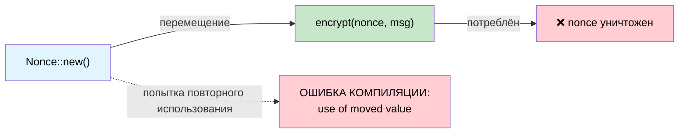

# Одноразовые типы: криптографические гарантии через владение 🟡

> **Что вы узнаете:** как семантика перемещения в Rust работает как система линейных типов, делая невозможными на этапе компиляции повторное использование nonce, двойное согласование ключа и случайное повторное программирование предохранителя.
>
> **Перекрёстные ссылки:** [гл. 01](ch01-the-philosophy-why-types-beat-tests.md) (философия), [гл. 04](ch04-capability-tokens-zero-cost-proof-of-aut.md) (capability-токены), [гл. 05](ch05-protocol-state-machines-type-state-for-r.md) (typestate), [гл. 14](ch14-testing-type-level-guarantees.md) (тестирование compile-fail)

## Катастрофа повторного использования nonce

В аутентифицированном шифровании (AES-GCM, ChaCha20-Poly1305) повторное использование nonce с тем же ключом — **катастрофа**: оно раскрывает XOR двух открытых текстов и часто сам ключ аутентификации. Это не теоретическая проблема:

- **2016**: Forbidden Attack на AES-GCM в TLS — повторное использование nonce позволяло восстановить открытый текст
- **2020**: в нескольких системах обновления прошивок IoT обнаружили повторное использование nonce из-за слабого генератора случайных чисел

В C/C++ nonce — это просто `uint8_t[12]`. Ничто не мешает использовать его дважды.

```c
// C — ничто не мешает повторно использовать nonce
uint8_t nonce[12];
generate_nonce(nonce);
encrypt(key, nonce, msg1, out1);   // ✅ первое использование
encrypt(key, nonce, msg2, out2);   // 🐛 КАТАСТРОФА: тот же nonce
```

## Семантика перемещения как линейные типы

Система владения Rust по сути является **системой линейных типов**: значение можно использовать ровно один раз (переместив его), если только тип не реализует `Copy`. Крейт `ring` использует это:

```rust,ignore
// ring::aead::Nonce:
// - НЕ Clone
// - НЕ Copy
// - потребляется по значению при использовании
pub struct Nonce(/* приватное */);

impl Nonce {
    pub fn try_assume_unique_for_key(value: &[u8]) -> Result<Self, Unspecified> {
        // ...
    }
    // Нет Clone, нет Copy — использовать можно только один раз
}
```

Когда вы передаёте `Nonce` в `seal_in_place()`, он **перемещается**:

```rust,ignore
// Псевдокод, повторяющий форму API ring
fn seal_in_place(
    key: &SealingKey,
    nonce: Nonce,       // ← перемещается, а не заимствуется
    data: &mut Vec<u8>,
) -> Result<(), Error> {
    // ... шифруем данные на месте ...
    // nonce потреблён — использовать его снова нельзя
    Ok(())
}
```

Попытка использовать его повторно:

```rust,ignore
fn bad_encrypt(key: &SealingKey, data1: &mut Vec<u8>, data2: &mut Vec<u8>) {
    let nonce = Nonce::try_assume_unique_for_key(&[0u8; 12]).unwrap();
    seal_in_place(key, nonce, data1).unwrap();  // ✅ nonce перемещён здесь
    // seal_in_place(key, nonce, data2).unwrap();
    //                    ^^^^^ ОШИБКА: использование перемещённого значения ❌
}
```

Компилятор **доказывает**, что каждый nonce используется ровно один раз. Тесты для этого не нужны.

## Разбор: nonce в ring

Крейт `ring` идёт дальше с `NonceSequence` — трейтом, который **генерирует** nonce и тоже не может быть клонирован:

```rust,ignore
/// Последовательность уникальных nonce.
/// Не Clone — после привязки к ключу не может быть продублирована.
pub trait NonceSequence {
    fn advance(&mut self) -> Result<Nonce, Unspecified>;
}

/// SealingKey оборачивает NonceSequence — каждый seal() автоматически продвигает её.
pub struct SealingKey<N: NonceSequence> {
    key: UnboundKey,   // потребляется при создании
    nonce_seq: N,
}

impl<N: NonceSequence> SealingKey<N> {
    pub fn new(key: UnboundKey, nonce_seq: N) -> Self {
        // UnboundKey перемещается — нельзя использовать и для шифрования, и для расшифровки
        SealingKey { key, nonce_seq }
    }

    pub fn seal_in_place_append_tag(
        &mut self,       // &mut — эксклюзивный доступ
        aad: Aad<&[u8]>,
        in_out: &mut Vec<u8>,
    ) -> Result<(), Unspecified> {
        let nonce = self.nonce_seq.advance()?; // автоматически генерируем уникальный nonce
        // ... шифруем с nonce ...
        Ok(())
    }
}
# pub struct UnboundKey;
# pub struct Aad<T>(T);
# pub struct Unspecified;
```

Цепочка владения предотвращает:
1. **Повторное использование nonce** — `Nonce` не `Clone` и потребляется при каждом вызове
2. **Дублирование ключа** — `UnboundKey` перемещается в `SealingKey`, поэтому из него нельзя также создать `OpeningKey`
3. **Дублирование последовательности** — `NonceSequence` не `Clone`, поэтому два ключа не могут делить один счётчик

**Ни одна из этих гарантий не требует проверок во время выполнения.** Компилятор обеспечивает все три.

## Разбор: эфемерное согласование ключей

Эфемерные ключи Диффи — Хеллмана должны использоваться **ровно один раз** (именно это и означает «эфемерный»). `ring` обеспечивает это:

```rust,ignore
/// Эфемерный приватный ключ. Не Clone, не Copy.
/// Потребляется в agree_ephemeral().
pub struct EphemeralPrivateKey { /* ... */ }

/// Вычисляет общий секрет — потребляет приватный ключ.
pub fn agree_ephemeral(
    my_private_key: EphemeralPrivateKey,  // ← перемещается
    peer_public_key: &UnparsedPublicKey,
    error_value: Unspecified,
    kdf: impl FnOnce(&[u8]) -> Result<SharedSecret, Unspecified>,
) -> Result<SharedSecret, Unspecified> {
    // ... вычисление DH ...
    // my_private_key потреблён — переиспользовать его невозможно
    # kdf(&[])
}
# pub struct UnparsedPublicKey;
# pub struct SharedSecret;
# pub struct Unspecified;
```

После вызова `agree_ephemeral()` приватный ключ **больше не существует в памяти** (он уничтожен). Разработчику на C++ пришлось бы не забыть вызвать `memset(key, 0, len)` и надеяться, что компилятор не оптимизирует этот вызов. В Rust ключ просто исчезает.

## Аппаратное применение: однократное программирование предохранителей

Серверные платформы содержат **OTP-предохранители (one-time programmable)** для ключей безопасности, серийных номеров плат и битов функций. Запись в предохранитель необратима: если сделать это дважды с разными данными, плата выходит из строя. Это идеально подходит для семантики перемещения:

```rust,ignore
use std::io;

/// Полезная нагрузка для записи в предохранитель. Не Clone, не Copy.
/// Потребляется при программировании предохранителя.
pub struct FusePayload {
    address: u32,
    data: Vec<u8>,
    // приватный конструктор — создаётся только через проверенный builder
}

/// Доказательство того, что программатор предохранителей находится в корректном состоянии.
pub struct FuseController {
    /* дескриптор аппаратуры */
}

impl FuseController {
    /// Программирует предохранитель — потребляет полезную нагрузку, исключая двойную запись.
    pub fn program(
        &mut self,
        payload: FusePayload,  // ← перемещается — нельзя использовать дважды
    ) -> io::Result<()> {
        // ... запись в OTP-аппаратуру ...
        // payload потреблён — повторное программирование с тем же payload
        // является ошибкой компиляции
        Ok(())
    }
}

/// Builder с валидацией — единственный способ создать FusePayload.
pub struct FusePayloadBuilder {
    address: Option<u32>,
    data: Option<Vec<u8>>,
}

impl FusePayloadBuilder {
    pub fn new() -> Self {
        FusePayloadBuilder { address: None, data: None }
    }

    pub fn address(mut self, addr: u32) -> Self {
        self.address = Some(addr);
        self
    }

    pub fn data(mut self, data: Vec<u8>) -> Self {
        self.data = Some(data);
        self
    }

    pub fn build(self) -> Result<FusePayload, &'static str> {
        let address = self.address.ok_or("требуется адрес")?;
        let data = self.data.ok_or("требуются данные")?;
        if data.len() > 32 { return Err("данные предохранителя слишком длинные"); }
        Ok(FusePayload { address, data })
    }
}

// Использование:
fn program_board_serial(ctrl: &mut FuseController) -> io::Result<()> {
    let payload = FusePayloadBuilder::new()
        .address(0x100)
        .data(b"SN12345678".to_vec())
        .build()
        .map_err(|e| io::Error::new(io::ErrorKind::InvalidInput, e))?;

    ctrl.program(payload)?;      // ✅ payload потреблён

    // ctrl.program(payload);    // ❌ ОШИБКА: использование перемещённого значения
    //              ^^^^^^^ значение используется после перемещения

    Ok(())
}
```

## Аппаратное применение: одноразовый токен калибровки

Некоторые датчики требуют шага калибровки, который должен произойти **ровно один раз** за цикл питания. Токен калибровки обеспечивает это:

```rust,ignore
/// Выдаётся один раз при включении питания. Не Clone, не Copy.
pub struct CalibrationToken {
    _private: (),
}

pub struct SensorController {
    calibrated: bool,
}

impl SensorController {
    /// Вызывается один раз при включении питания — возвращает токен калибровки.
    pub fn power_on() -> (Self, CalibrationToken) {
        (
            SensorController { calibrated: false },
            CalibrationToken { _private: () },
        )
    }

    /// Калибрует датчик — потребляет токен.
    pub fn calibrate(&mut self, _token: CalibrationToken) -> io::Result<()> {
        // ... выполняем последовательность калибровки ...
        self.calibrated = true;
        Ok(())
    }

    /// Читает датчик — имеет смысл только после калибровки.
    ///
    /// **Ограничение:** гарантия семантики перемещения здесь *частичная*. Вызывающий код
    /// может сделать `drop(cal_token)`, не вызывая `calibrate()`: токен будет уничтожен,
    /// но калибровка не выполнится. Аннотация `#[must_use]` (см. ниже) выдаёт предупреждение,
    /// но не жёсткую ошибку.
    ///
    /// Проверка `self.calibrated` во время выполнения — это **страховочная сетка** для
    /// этого пробела. Полностью решить задачу на этапе компиляции позволяет паттерн
    /// typestate из гл. 05, где `send_command()` существует только у `IpmiSession<Active>`.
    pub fn read(&self) -> io::Result<f64> {
        if !self.calibrated {
            return Err(io::Error::new(io::ErrorKind::Other, "датчик не откалиброван"));
        }
        Ok(25.0) // заглушка
    }
}

fn sensor_workflow() -> io::Result<()> {
    let (mut ctrl, cal_token) = SensorController::power_on();

    // Токен нужно где-то использовать: он не Copy, поэтому отбрасывание без потребления
    // даёт предупреждение (или ошибку при #[must_use])
    ctrl.calibrate(cal_token)?;

    // Теперь чтение работает:
    let temp = ctrl.read()?;
    println!("Температура: {temp}°C");

    // Повторно калибровать нельзя — токен потреблён:
    // ctrl.calibrate(cal_token);  // ❌ использование перемещённого значения

    Ok(())
}
```

### Когда использовать одноразовые типы

| Сценарий | Использовать семантику одноразового (перемещаемого) значения? |
|----------|:------:|
| Криптографические nonce | ✅ Всегда: повторное использование nonce катастрофично |
| Эфемерные ключи (DH, ECDH) | ✅ Всегда: повторное использование ослабляет прямую секретность |
| Запись в OTP-предохранители | ✅ Всегда: двойная запись выводит аппаратуру из строя |
| Коды активации лицензий | ✅ Обычно: предотвращает двойную активацию |
| Токены калибровки | ✅ Обычно: обеспечивает однократность за сессию |
| Дескрипторы записи файлов | ⚠️ Иногда: зависит от протокола |
| Дескрипторы транзакций БД | ⚠️ Иногда: commit/rollback выполняются однократно |
| Общие буферы данных | ❌ Их нужно переиспользовать: используйте `&mut [u8]` |

## Поток одноразового владения



## Упражнение: одноразовый токен подписи прошивки

Спроектируйте `SigningToken`, который можно использовать ровно один раз для подписи образа прошивки:
- `SigningToken::issue(key_id: &str) -> SigningToken` (не Clone, не Copy)
- `sign(token: SigningToken, image: &[u8]) -> SignedImage` (потребляет токен)
- Попытка подписать дважды должна приводить к ошибке компиляции.

<details>
<summary>Решение</summary>

```rust,ignore
pub struct SigningToken {
    key_id: String,
    // НЕ Clone, НЕ Copy
}

pub struct SignedImage {
    pub signature: Vec<u8>,
    pub key_id: String,
}

impl SigningToken {
    pub fn issue(key_id: &str) -> Self {
        SigningToken { key_id: key_id.to_string() }
    }
}

pub fn sign(token: SigningToken, _image: &[u8]) -> SignedImage {
    // Токен потреблён перемещением — переиспользовать его нельзя
    SignedImage {
        signature: vec![0xDE, 0xAD],  // заглушка
        key_id: token.key_id,
    }
}

// ✅ Компилируется:
// let tok = SigningToken::issue("release-key");
// let signed = sign(tok, &firmware_bytes);
//
// ❌ Ошибка компиляции:
// let signed2 = sign(tok, &other_bytes);  // ОШИБКА: использование перемещённого значения
```

</details>

## Ключевые выводы

1. **Перемещение = линейное использование** — тип, который не является ни `Clone`, ни `Copy`, можно потребить ровно один раз; это обеспечивает компилятор.
2. **Повторное использование nonce катастрофично** — система владения Rust предотвращает его структурно, а не дисциплиной.
3. **Паттерн выходит за рамки криптографии** — OTP-предохранители, токены калибровки, записи аудита: всё, что должно произойти не более одного раза.
4. **Эфемерные ключи получают прямую секретность бесплатно** — значение ключевого соглашения перемещается в производный секрет и исчезает.
5. **Если сомневаетесь, уберите `Clone`** — его всегда можно добавить позже; удаление из опубликованного API — ломающее изменение.

---
