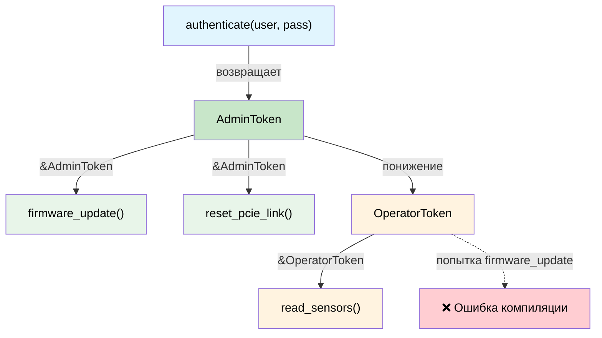

# Capability-токены: доказательство полномочий без накладных расходов 🟡

> **Что вы узнаете:** как типы нулевого размера (ZST) выступают токенами-доказательствами на этапе компиляции и обеспечивают иерархию привилегий, порядок подачи питания и отзываемые полномочия, причём без накладных расходов во время выполнения.
>
> **Перекрёстные ссылки:** [гл. 03](ch03-single-use-types-cryptographic-guarantee.md) (одноразовые типы), [гл. 05](ch05-protocol-state-machines-type-state-for-r.md) (typestate), [гл. 08](ch08-capability-mixins-compile-time-hardware-.md) (миксины), [гл. 10](ch10-putting-it-all-together-a-complete-diagn.md) (интеграция)

## Проблема: кому что разрешено?

В аппаратной диагностике некоторые операции **опасны**:

- Прошивка BMC
- Сброс линков PCIe
- Запись OTP-предохранителей
- Включение тестовых режимов с высоким напряжением

В C/C++ такие операции защищают проверками во время выполнения:

```c
// C — проверка прав во время выполнения
int reset_pcie_link(bmc_handle_t bmc, int slot) {
    if (!bmc->is_admin) {        // проверка во время выполнения
        return -EPERM;
    }
    if (!bmc->link_trained) {    // ещё одна проверка во время выполнения
        return -EINVAL;
    }
    // ... выполняем опасное действие ...
    return 0;
}
```

Каждая функция, которая делает что-то опасное, должна повторять эти проверки. Забудьте одну — и у вас ошибка эскалации привилегий.

## Типы нулевого размера как токены-доказательства

**Capability-токен** — это тип нулевого размера (ZST), который доказывает, что у вызывающего кода есть полномочия на действие. Во время выполнения он не занимает **ни одного байта**: он существует только в системе типов:

```rust,ignore
use std::marker::PhantomData;

/// Доказательство того, что вызывающий обладает правами администратора.
/// Нулевой размер — полностью исчезает при компиляции.
/// Не Clone, не Copy — должен передаваться явно.
pub struct AdminToken {
    _private: (),   // запрещает создание вне этого модуля
}

/// Доказательство того, что линк PCIe обучен и готов.
pub struct LinkTrainedToken {
    _private: (),
}

pub struct BmcController { /* ... */ }

impl BmcController {
    /// Аутентификация как администратор — возвращает capability-токен.
    /// Это ЕДИНСТВЕННЫЙ способ создать AdminToken.
    pub fn authenticate_admin(
        &mut self,
        credentials: &[u8],
    ) -> Result<AdminToken, &'static str> {
        // ... проверяем учётные данные ...
        # let valid = true;
        if valid {
            Ok(AdminToken { _private: () })
        } else {
            Err("аутентификация не пройдена")
        }
    }

    /// Обучает линк PCIe — возвращает доказательство того, что он обучен.
    pub fn train_link(&mut self) -> Result<LinkTrainedToken, &'static str> {
        // ... выполняем обучение линка ...
        Ok(LinkTrainedToken { _private: () })
    }

    /// Сбрасывает линк PCIe — требует ОБА доказательства: администратора и обученного линка.
    /// Никаких проверок во время выполнения не нужно: сами токены и есть доказательство.
    pub fn reset_pcie_link(
        &mut self,
        _admin: &AdminToken,         // zero-cost доказательство полномочий
        _trained: &LinkTrainedToken,  // zero-cost доказательство состояния
        slot: u32,
    ) -> Result<(), &'static str> {
        println!("Сброс линка PCIe в слоте {slot}");
        Ok(())
    }
}
```

Использование: система типов обеспечивает соблюдение порядка действий:

```rust,ignore
fn maintenance_workflow(bmc: &mut BmcController) -> Result<(), &'static str> {
    // Шаг 1: аутентификация — получаем доказательство администратора
    let admin = bmc.authenticate_admin(b"secret")?;

    // Шаг 2: обучение линка — получаем доказательство обучения
    let trained = bmc.train_link()?;

    // Шаг 3: сброс — компилятор требует оба токена
    bmc.reset_pcie_link(&admin, &trained, 0)?;

    Ok(())
}

// Это НЕ скомпилируется:
fn unprivileged_attempt(bmc: &mut BmcController) -> Result<(), &'static str> {
    let trained = bmc.train_link()?;
    // bmc.reset_pcie_link(???, &trained, 0)?;
    //                     ^^^ нет AdminToken — вызвать эту функцию нельзя
    Ok(())
}
```

`AdminToken` и `LinkTrainedToken` занимают **ноль байт** в скомпилированном бинарнике. Они существуют только во время проверки типов. Сигнатура `fn reset_pcie_link(&mut self, _admin: &AdminToken, ...)` — это **обязательство доказательства** («вызвать эту функцию можно, только если вы можете получить `AdminToken`»), а получить его можно только через `authenticate_admin()`.

## Полномочия на управление питанием

Последовательность подачи питания на сервере строго определена: дежурное питание → вспомогательное → основное → CPU. Нарушение порядка может повредить аппаратуру. Capability-токены обеспечивают соблюдение порядка:

```rust,ignore
/// Токены состояния — каждый доказывает, что предыдущий шаг завершён.
pub struct StandbyOn { _p: () }
pub struct AuxiliaryOn { _p: () }
pub struct MainOn { _p: () }
pub struct CpuPowered { _p: () }

pub struct PowerController { /* ... */ }

impl PowerController {
    /// Шаг 1: включить дежурное питание. Предусловий нет.
    pub fn enable_standby(&mut self) -> Result<StandbyOn, &'static str> {
        println!("Дежурное питание ВКЛ");
        Ok(StandbyOn { _p: () })
    }

    /// Шаг 2: включить вспомогательное питание — требует доказательство дежурного.
    pub fn enable_auxiliary(
        &mut self,
        _standby: &StandbyOn,
    ) -> Result<AuxiliaryOn, &'static str> {
        println!("Вспомогательное питание ВКЛ");
        Ok(AuxiliaryOn { _p: () })
    }

    /// Шаг 3: включить основное питание — требует доказательство вспомогательного.
    pub fn enable_main(
        &mut self,
        _aux: &AuxiliaryOn,
    ) -> Result<MainOn, &'static str> {
        println!("Основное питание ВКЛ");
        Ok(MainOn { _p: () })
    }

    /// Шаг 4: подать питание на CPU — требует доказательство основного питания.
    pub fn power_cpu(
        &mut self,
        _main: &MainOn,
    ) -> Result<CpuPowered, &'static str> {
        println!("Питание CPU ВКЛ");
        Ok(CpuPowered { _p: () })
    }
}

fn power_on_sequence(ctrl: &mut PowerController) -> Result<CpuPowered, &'static str> {
    let standby = ctrl.enable_standby()?;
    let aux = ctrl.enable_auxiliary(&standby)?;
    let main = ctrl.enable_main(&aux)?;
    let cpu = ctrl.power_cpu(&main)?;
    Ok(cpu)
}

// Попытка пропустить шаг:
// fn wrong_order(ctrl: &mut PowerController) {
//     ctrl.power_cpu(???);  // ❌ нельзя получить MainOn без enable_main()
// }
```

## Иерархические полномочия

В реальных системах есть **иерархии**: администратор может всё, что может пользователь, и даже больше. Смоделируем это иерархией трейтов:

```rust,ignore
/// Базовое полномочие — любой прошедший аутентификацию.
pub trait Authenticated {
    fn token_id(&self) -> u64;
}

/// Оператор может читать датчики и запускать неразрушающую диагностику.
pub trait Operator: Authenticated {}

/// Администратор может всё, что оператор, плюс разрушающие операции.
pub trait Admin: Operator {}

// Конкретные токены:
pub struct UserToken { id: u64 }
pub struct OperatorToken { id: u64 }
pub struct AdminCapToken { id: u64 }

impl Authenticated for UserToken { fn token_id(&self) -> u64 { self.id } }
impl Authenticated for OperatorToken { fn token_id(&self) -> u64 { self.id } }
impl Operator for OperatorToken {}
impl Authenticated for AdminCapToken { fn token_id(&self) -> u64 { self.id } }
impl Operator for AdminCapToken {}
impl Admin for AdminCapToken {}

pub struct Bmc { /* ... */ }

impl Bmc {
    /// Любой аутентифицированный может читать датчики.
    pub fn read_sensor(&self, _who: &impl Authenticated, id: u32) -> f64 {
        42.0 // заглушка
    }

    /// Запускать диагностику могут только операторы и выше.
    pub fn run_diag(&mut self, _who: &impl Operator, test: &str) -> bool {
        true // заглушка
    }

    /// Прошивать прошивку могут только администраторы.
    pub fn flash_firmware(&mut self, _who: &impl Admin, image: &[u8]) -> Result<(), &'static str> {
        Ok(()) // заглушка
    }
}
```

`AdminCapToken` можно передать в любую функцию: он удовлетворяет `Authenticated`, `Operator` и `Admin`. `UserToken` может вызывать только `read_sensor()`. Компилятор обеспечивает всю модель привилегий **без накладных расходов во время выполнения**.

## Capability-токены, ограниченные временем жизни

Иногда полномочие должно быть **ограниченным по области действия**, то есть действительным только в пределах определённого времени жизни. Borrow checker решает эту задачу естественным образом:

```rust,ignore
/// Ограниченная административная сессия. Токен заимствует сессию,
/// поэтому он не может её пережить.
pub struct AdminSession {
    _active: bool,
}

pub struct ScopedAdminToken<'session> {
    _session: &'session AdminSession,
}

impl AdminSession {
    pub fn begin(credentials: &[u8]) -> Result<Self, &'static str> {
        // ... аутентификация ...
        Ok(AdminSession { _active: true })
    }

    /// Создаёт ограниченный токен — он живёт ровно столько, сколько сессия.
    pub fn token(&self) -> ScopedAdminToken<'_> {
        ScopedAdminToken { _session: self }
    }
}

fn scoped_example() -> Result<(), &'static str> {
    let session = AdminSession::begin(b"credentials")?;
    let token = session.token();

    // Используем токен в этой области видимости...
    // Когда session уничтожается, токен становится недействительным благодаря borrow checker.
    // Проверки истечения срока во время выполнения не нужны.

    // drop(session);
    // ❌ Ошибка компилятора: cannot move out of `session` because it is borrowed
    //    (by `token`, который хранит &session)
    //
    // Даже если пропустить drop() и попытаться использовать `token` после того, как
    // session выйдет из области видимости, — будет та же ошибка: несоответствие времён жизни.

    Ok(())
}
```

### Когда использовать capability-токены

| Сценарий | Паттерн |
|----------|---------|
| Привилегированные операции с аппаратурой | ZST-токен-доказательство (AdminToken) |
| Многошаговая последовательность | Цепочка токенов состояния (StandbyOn → AuxiliaryOn → ...) |
| Управление доступом на основе ролей (RBAC) | Иерархия трейтов (Authenticated → Operator → Admin) |
| Привилегии с ограничением по времени | Токены с ограниченным временем жизни (`ScopedAdminToken<'a>`) |
| Полномочия между модулями | Публичный тип токена, приватный конструктор |

### Сводка по стоимости

| Что | Стоимость во время выполнения |
|-----|:------:|
| ZST-токен в памяти | 0 байт |
| Передача токена как параметра | Оптимизируется LLVM |
| Диспетчеризация по иерархии трейтов | Статическая (мономорфизация) |
| Проверка времени жизни | Только на этапе компиляции |

**Итоговые накладные расходы во время выполнения: ноль.** Модель привилегий существует только в системе типов.

## Иерархия capability-токенов



## Упражнение: многоуровневые диагностические полномочия

Спроектируйте трёхуровневую систему capability: `ViewerToken`, `TechToken`, `EngineerToken`.
- Наблюдатели могут вызывать `read_status()`
- Техники могут также вызывать `run_quick_diag()`
- Инженеры могут также вызывать `flash_firmware()`
- Более высокие уровни могут делать всё, что могут низшие (используйте ограничения трейтов или преобразование токенов).

<details>
<summary>Решение</summary>

```rust,ignore
// Токены — нулевого размера, с приватными конструкторами
pub struct ViewerToken { _private: () }
pub struct TechToken { _private: () }
pub struct EngineerToken { _private: () }

// Трейты capability — иерархические
pub trait CanView {}
pub trait CanDiag: CanView {}
pub trait CanFlash: CanDiag {}

impl CanView for ViewerToken {}
impl CanView for TechToken {}
impl CanView for EngineerToken {}
impl CanDiag for TechToken {}
impl CanDiag for EngineerToken {}
impl CanFlash for EngineerToken {}

pub fn read_status(_tok: &impl CanView) -> String {
    "статус: OK".into()
}

pub fn run_quick_diag(_tok: &impl CanDiag) -> String {
    "диагностика: PASS".into()
}

pub fn flash_firmware(_tok: &impl CanFlash, _image: &[u8]) {
    // Сюда попадают только инженеры
}
```

</details>

## Ключевые выводы

1. **ZST-токены не занимают байтов** — они существуют только в системе типов; LLVM полностью их оптимизирует.
2. **Приватные конструкторы делают токены неподделываемыми** — токен может создать только `authenticate()` вашего модуля.
3. **Иерархии трейтов моделируют уровни разрешений** — `CanFlash: CanDiag: CanView` повторяет реальный RBAC.
4. **Токены с ограниченным временем жизни отзываются автоматически** — `ScopedAdminToken<'session>` не может пережить сессию.
5. **Сочетайте с typestate (гл. 05)** для протоколов, которые требуют одновременно аутентификации и упорядоченных операций.

---
