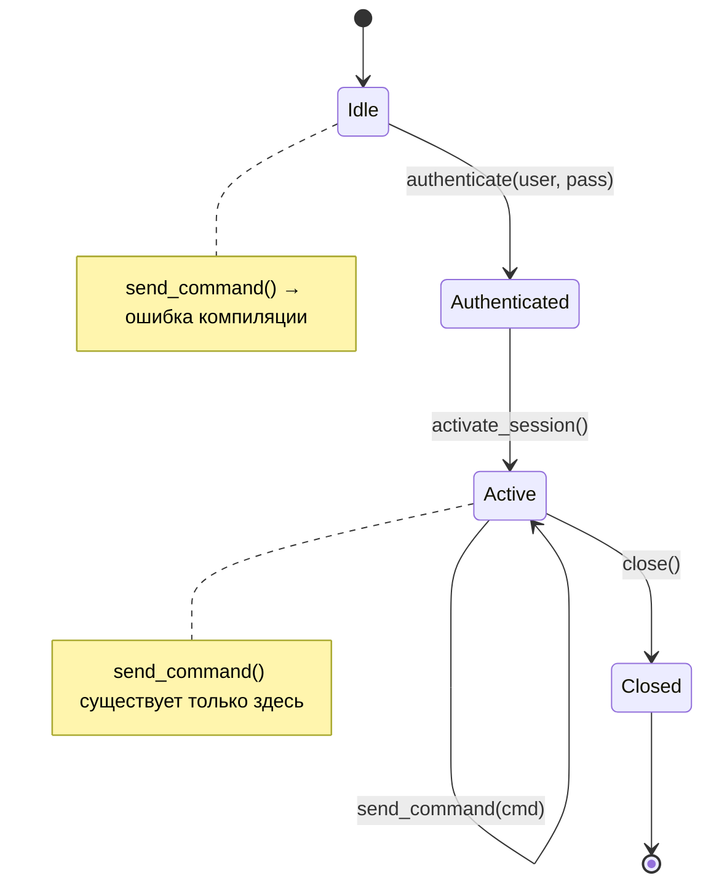
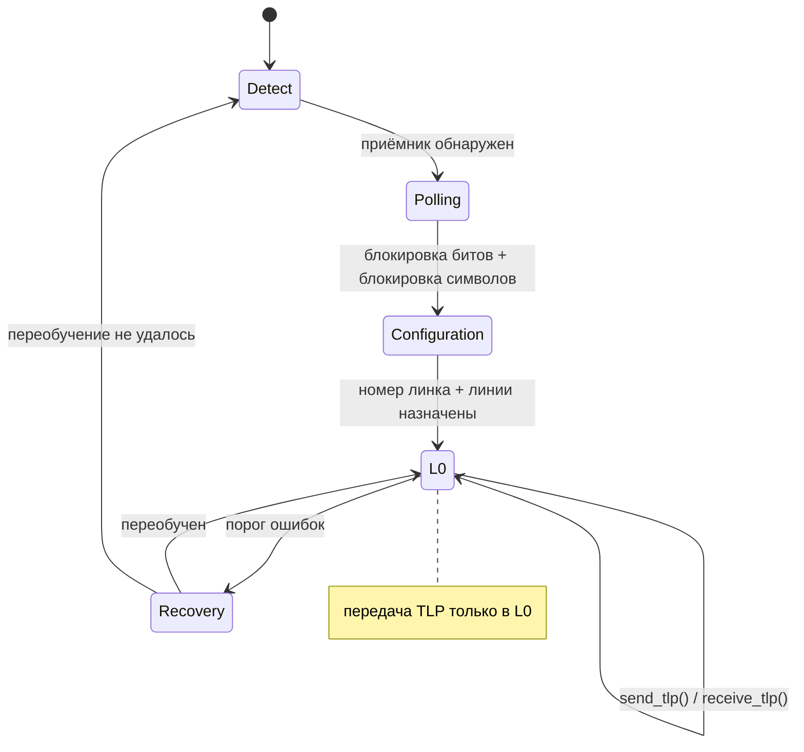
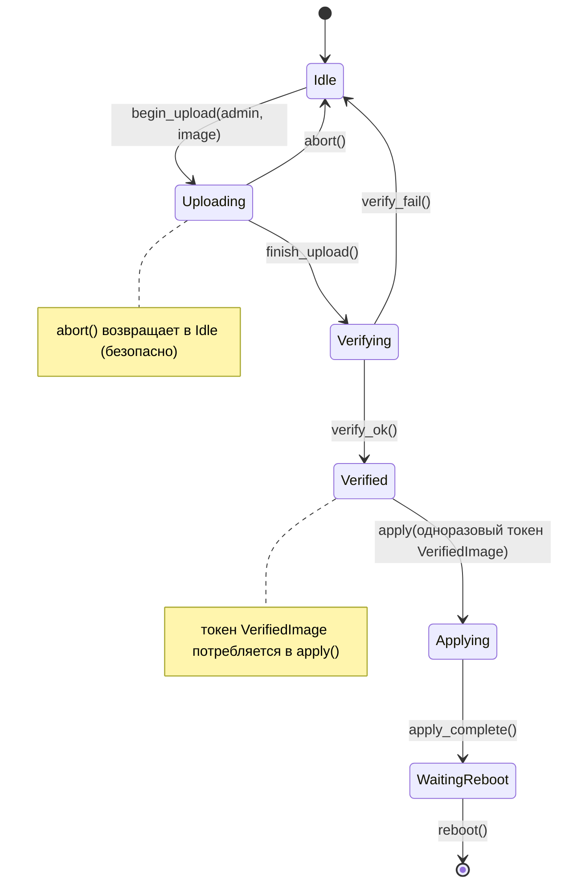

# Автоматы состояний протоколов: typestate для реального оборудования 🔴

> **Что вы узнаете:** как кодирование через typestate превращает нарушения протокола (команды в неверном порядке, использование после закрытия) в ошибки компиляции. Применим к жизненному циклу сессий IPMI и обучению линка PCIe.
>
> **Перекрёстные ссылки:** [гл. 01](ch01-the-philosophy-why-types-beat-tests.md) (уровень 2: корректность состояний), [гл. 04](ch04-capability-tokens-zero-cost-proof-of-aut.md) (токены), [гл. 09](ch09-phantom-types-for-resource-tracking.md) (phantom-типы), [гл. 11](ch11-fourteen-tricks-from-the-trenches.md) (приём 4: typestate-билдер, приём 8: async typestate)

## Проблема: нарушения протокола

У аппаратных протоколов **строгие автоматы состояний**. У сессии IPMI есть состояния: не аутентифицирована (`Idle`) → аутентифицирована (`Authenticated`) → активна (`Active`) → закрыта (`Closed`). Обучение линка PCIe проходит через фазы Detect → Polling → Configuration → L0. Отправка команды в неверном состоянии повреждает сессию или зависает шину.

**Автомат состояний сессии IPMI:**



**Автомат состояний обучения линка PCIe (LTSSM):**



На C/C++ состояние отслеживают с помощью enum и проверок во время выполнения:

```c
typedef enum { IDLE, AUTHENTICATED, ACTIVE, CLOSED } session_state_t;

typedef struct {
    session_state_t state;
    uint32_t session_id;
    // ...
} ipmi_session_t;

int ipmi_send_command(ipmi_session_t *s, uint8_t cmd, uint8_t *data, int len) {
    if (s->state != ACTIVE) {        // проверка во время выполнения — её легко забыть
        return -EINVAL;
    }
    // ... отправляем команду ...
    return 0;
}
```

## Паттерн typestate

С typestate каждое состояние протокола — это **отдельный тип**. Переходы — это методы, которые потребляют одно состояние и возвращают другое. Компилятор не даёт вызывать методы в неверном состоянии, потому что **этих методов у такого типа просто нет**.

## Разбор: жизненный цикл сессии IPMI

```rust,ignore
use std::marker::PhantomData;

// Состояния — маркерные типы нулевого размера
pub struct Idle;
pub struct Authenticated;
pub struct Active;
pub struct Closed;

/// Сессия IPMI, параметризованная текущим состоянием.
/// Состояние существует ТОЛЬКО в системе типов (PhantomData занимает ноль байт).
pub struct IpmiSession<State> {
    transport: String,     // например, "192.168.1.100"
    session_id: Option<u32>,
    _state: PhantomData<State>,
}

// Переход: Idle → Authenticated
impl IpmiSession<Idle> {
    pub fn new(host: &str) -> Self {
        IpmiSession {
            transport: host.to_string(),
            session_id: None,
            _state: PhantomData,
        }
    }

    pub fn authenticate(
        self,              // ← потребляет сессию в состоянии Idle
        user: &str,
        pass: &str,
    ) -> Result<IpmiSession<Authenticated>, String> {
        println!("Аутентификация {user} на {}", self.transport);
        Ok(IpmiSession {
            transport: self.transport,
            session_id: Some(42),
            _state: PhantomData,
        })
    }
}

// Переход: Authenticated → Active
impl IpmiSession<Authenticated> {
    pub fn activate(self) -> Result<IpmiSession<Active>, String> {
        println!("Активация сессии {}", self.session_id.unwrap());
        Ok(IpmiSession {
            transport: self.transport,
            session_id: self.session_id,
            _state: PhantomData,
        })
    }
}

// Операции доступны ТОЛЬКО в состоянии Active
impl IpmiSession<Active> {
    pub fn send_command(&mut self, netfn: u8, cmd: u8, data: &[u8]) -> Vec<u8> {
        println!("Отправка команды 0x{cmd:02X} в сессии {}", self.session_id.unwrap());
        vec![0x00] // заглушка: код завершения OK
    }

    pub fn close(self) -> IpmiSession<Closed> {
        println!("Закрытие сессии {}", self.session_id.unwrap());
        IpmiSession {
            transport: self.transport,
            session_id: None,
            _state: PhantomData,
        }
    }
}

fn ipmi_workflow() -> Result<(), String> {
    let session = IpmiSession::new("192.168.1.100");

    // session.send_command(0x04, 0x2D, &[]);
    //  ^^^^^^ ОШИБКА: у IpmiSession<Idle> нет метода send_command ❌

    let session = session.authenticate("admin", "password")?;

    // session.send_command(0x04, 0x2D, &[]);
    //  ^^^^^^ ОШИБКА: у IpmiSession<Authenticated> нет метода send_command ❌

    let mut session = session.activate()?;

    // ✅ ТЕПЕРЬ send_command доступна:
    let response = session.send_command(0x04, 0x2D, &[1]);

    let _closed = session.close();

    // _closed.send_command(0x04, 0x2D, &[]);
    //  ^^^^^^ ОШИБКА: у IpmiSession<Closed> нет метода send_command ❌

    Ok(())
}
```

**Нет ни одной проверки состояния во время выполнения.** Компилятор обеспечивает:
- аутентификацию перед активацией
- активацию перед отправкой команд
- отсутствие команд после закрытия

## Автомат состояний обучения линка PCIe

Обучение линка PCIe — многофазный протокол, описанный в спецификации PCIe. Typestate не даёт отправить данные до того, как линк готов:

```rust,ignore
use std::marker::PhantomData;

// Состояния LTSSM PCIe (упрощённо)
pub struct Detect;
pub struct Polling;
pub struct Configuration;
pub struct L0;         // полностью работоспособен
pub struct Recovery;

pub struct PcieLink<State> {
    slot: u32,
    width: u8,          // согласованная ширина (x1, x4, x8, x16)
    speed: u8,          // Gen1=1, Gen2=2, Gen3=3, Gen4=4, Gen5=5
    _state: PhantomData<State>,
}

impl PcieLink<Detect> {
    pub fn new(slot: u32) -> Self {
        PcieLink {
            slot, width: 0, speed: 0,
            _state: PhantomData,
        }
    }

    pub fn detect_receiver(self) -> Result<PcieLink<Polling>, String> {
        println!("Слот {}: приёмник обнаружен", self.slot);
        Ok(PcieLink {
            slot: self.slot, width: 0, speed: 0,
            _state: PhantomData,
        })
    }
}

impl PcieLink<Polling> {
    pub fn poll_compliance(self) -> Result<PcieLink<Configuration>, String> {
        println!("Слот {}: опрос завершён, переход к конфигурации", self.slot);
        Ok(PcieLink {
            slot: self.slot, width: 0, speed: 0,
            _state: PhantomData,
        })
    }
}

impl PcieLink<Configuration> {
    pub fn negotiate(self, width: u8, speed: u8) -> Result<PcieLink<L0>, String> {
        println!("Слот {}: согласовано x{width} Gen{speed}", self.slot);
        Ok(PcieLink {
            slot: self.slot, width, speed,
            _state: PhantomData,
        })
    }
}

impl PcieLink<L0> {
    /// Отправить TLP — возможно только тогда, когда линк полностью обучен (L0).
    pub fn send_tlp(&mut self, tlp: &[u8]) -> Vec<u8> {
        println!("Слот {}: отправка TLP из {} байт", self.slot, tlp.len());
        vec![0x00] // заглушка
    }

    /// Войти в восстановление — возврат в состояние Recovery.
    pub fn enter_recovery(self) -> PcieLink<Recovery> {
        PcieLink {
            slot: self.slot, width: self.width, speed: self.speed,
            _state: PhantomData,
        }
    }

    pub fn link_info(&self) -> String {
        format!("x{} Gen{}", self.width, self.speed)
    }
}

impl PcieLink<Recovery> {
    pub fn retrain(self, speed: u8) -> Result<PcieLink<L0>, String> {
        println!("Слот {}: переобучен на Gen{speed}", self.slot);
        Ok(PcieLink {
            slot: self.slot, width: self.width, speed,
            _state: PhantomData,
        })
    }
}

fn pcie_workflow() -> Result<(), String> {
    let link = PcieLink::new(0);

    // link.send_tlp(&[0x01]);  // ❌ нет метода send_tlp у PcieLink<Detect>

    let link = link.detect_receiver()?;
    let link = link.poll_compliance()?;
    let mut link = link.negotiate(16, 5)?; // x16 Gen5

    // ✅ ТЕПЕРЬ можно отправлять TLP:
    let _resp = link.send_tlp(&[0x00, 0x01, 0x02]);
    println!("Линк: {}", link.link_info());

    // Восстановление и переобучение:
    let recovery = link.enter_recovery();
    let mut link = recovery.retrain(4)?;  // понижаем до Gen4
    let _resp = link.send_tlp(&[0x03]);

    Ok(())
}
```

## Комбинирование typestate с capability-токенами

Typestate и capability-токены естественно сочетаются. Пример: диагностика, которой нужны одновременно активная сессия IPMI и права администратора:

```rust,ignore
# use std::marker::PhantomData;
# pub struct Active;
# pub struct AdminToken { _p: () }
# pub struct IpmiSession<S> { _s: PhantomData<S> }
# impl IpmiSession<Active> {
#     pub fn send_command(&mut self, _nf: u8, _cmd: u8, _d: &[u8]) -> Vec<u8> { vec![] }
# }

/// Запускает обновление прошивки — требует:
/// 1. Активную сессию IPMI (typestate)
/// 2. Права администратора (capability-токен)
pub fn firmware_update(
    session: &mut IpmiSession<Active>,   // доказывает, что сессия активна
    _admin: &AdminToken,                 // доказывает, что вызывающий — администратор
    image: &[u8],
) -> Result<(), String> {
    // Никаких проверок во время выполнения не нужно — сама сигнатура и есть проверка
    session.send_command(0x2C, 0x01, image);
    Ok(())
}
```

Вызывающий код должен:
1. Создать сессию (`Idle`)
2. Аутентифицировать её (`Authenticated`)
3. Активировать её (`Active`)
4. Получить `AdminToken`
5. И только затем вызвать `firmware_update()`

Всё это проверяется на этапе компиляции, без накладных расходов во время выполнения.

## Этап 3: обновление прошивки — многофазный FSM с композицией

У жизненного цикла обновления прошивки больше состояний, чем у сессии, и он сочетает одновременно capability-токены и одноразовые типы (гл. 03). Это самый сложный пример typestate в книге: если вы в нём разобрались, паттерн освоен.



```rust,ignore
use std::marker::PhantomData;

// ── Состояния ──
pub struct Idle;
pub struct Uploading;
pub struct Verifying;
pub struct Verified;
pub struct Applying;
pub struct WaitingReboot;

// ── Одноразовое доказательство того, что образ прошёл проверку (гл. 03) ──
pub struct VerifiedImage {
    _private: (),
    pub digest: [u8; 32],
}

// ── Capability-токен: инициировать обновление могут только администраторы (гл. 04) ──
pub struct FirmwareAdminToken { _private: () }

pub struct FwUpdate<S> {
    version: String,
    _state: PhantomData<S>,
}

impl FwUpdate<Idle> {
    pub fn new() -> Self {
        FwUpdate { version: String::new(), _state: PhantomData }
    }

    /// Начать загрузку — требует права администратора.
    pub fn begin_upload(
        self,
        _admin: &FirmwareAdminToken,
        version: &str,
    ) -> FwUpdate<Uploading> {
        println!("Загрузка прошивки v{version}...");
        FwUpdate { version: version.to_string(), _state: PhantomData }
    }
}

impl FwUpdate<Uploading> {
    pub fn finish_upload(self) -> FwUpdate<Verifying> {
        println!("Загрузка завершена, проверяем v{}...", self.version);
        FwUpdate { version: self.version, _state: PhantomData }
    }

    /// Прерывание возвращает в Idle — безопасно в любой момент загрузки.
    pub fn abort(self) -> FwUpdate<Idle> {
        println!("Загрузка прервана.");
        FwUpdate { version: String::new(), _state: PhantomData }
    }
}

impl FwUpdate<Verifying> {
    /// При успехе возвращает одноразовый токен VerifiedImage.
    pub fn verify_ok(self, digest: [u8; 32]) -> (FwUpdate<Verified>, VerifiedImage) {
        println!("Проверка v{} пройдена", self.version);
        (
            FwUpdate { version: self.version, _state: PhantomData },
            VerifiedImage { _private: (), digest },
        )
    }

    pub fn verify_fail(self) -> FwUpdate<Idle> {
        println!("Проверка не пройдена — возврат в состояние ожидания.");
        FwUpdate { version: String::new(), _state: PhantomData }
    }
}

impl FwUpdate<Verified> {
    /// Apply ПОТРЕБЛЯЕТ токен VerifiedImage — применить дважды нельзя.
    pub fn apply(self, proof: VerifiedImage) -> FwUpdate<Applying> {
        println!("Применяем v{} (дайджест: {:02x?})", self.version, &proof.digest[..4]);
        // proof перемещён — переиспользовать его нельзя
        FwUpdate { version: self.version, _state: PhantomData }
    }
}

impl FwUpdate<Applying> {
    pub fn apply_complete(self) -> FwUpdate<WaitingReboot> {
        println!("Применение завершено — ожидаем перезагрузки.");
        FwUpdate { version: self.version, _state: PhantomData }
    }
}

impl FwUpdate<WaitingReboot> {
    pub fn reboot(self) {
        println!("Перезагрузка в v{}...", self.version);
    }
}

// ── Использование ──

fn firmware_workflow() {
    let fw = FwUpdate::new();

    // fw.finish_upload();  // ❌ нет метода finish_upload у FwUpdate<Idle>

    let admin = FirmwareAdminToken { _private: () }; // из системы аутентификации
    let fw = fw.begin_upload(&admin, "2.10.1");
    let fw = fw.finish_upload();

    let digest = [0xAB; 32]; // вычисляется во время проверки
    let (fw, token) = fw.verify_ok(digest);

    let fw = fw.apply(token);
    // fw.apply(token);  // ❌ ошибка компиляции: use of moved value: `token`

    let fw = fw.apply_complete();
    fw.reboot();
}
```

**Что вместе иллюстрируют три этапа:**

| Этап | Протокол | Состояния | Композиция |
|:----:|----------|:---------:|------------|
| 1 | Сессия IPMI | 4 | Чистый typestate |
| 2 | LTSSM PCIe | 5 | Typestate + ветка восстановления |
| 3 | Обновление прошивки | 6 | Typestate + capability-токены (гл. 04) + одноразовое доказательство (гл. 03) |

С каждым этапом добавляется слой сложности. К этапу 3 компилятор обеспечивает порядок состояний, права администратора **и** однократное применение: три класса ошибок устранены в одном автомате состояний.

### Когда использовать typestate

| Протокол | Стоит ли использовать typestate? |
|----------|:------:|
| Жизненный цикл сессии IPMI | ✅ Да: аутентификация → активация → команда → закрытие |
| Обучение линка PCIe | ✅ Да: detect → poll → configure → L0 |
| TLS-рукопожатие | ✅ Да: ClientHello → ServerHello → Finished |
| Перечисление USB | ✅ Да: Attached → Powered → Default → Addressed → Configured |
| Простой запрос/ответ | ⚠️ Скорее нет: всего 2 состояния |
| Сообщения «отправил и забыл» | ❌ Нет: нет состояния, которое нужно отслеживать |

## Упражнение: typestate для перечисления USB-устройства

Смоделируйте USB-устройство, которое должно пройти путь: `Attached` → `Powered` → `Default` → `Addressed` → `Configured`. Каждый переход должен потреблять предыдущее состояние и возвращать следующее. Метод `send_data()` должен быть доступен только в `Configured`.

<details>
<summary>Решение</summary>

```rust,ignore
use std::marker::PhantomData;

pub struct Attached;
pub struct Powered;
pub struct Default;
pub struct Addressed;
pub struct Configured;

pub struct UsbDevice<State> {
    address: u8,
    _state: PhantomData<State>,
}

impl UsbDevice<Attached> {
    pub fn new() -> Self {
        UsbDevice { address: 0, _state: PhantomData }
    }
    pub fn power_on(self) -> UsbDevice<Powered> {
        UsbDevice { address: self.address, _state: PhantomData }
    }
}

impl UsbDevice<Powered> {
    pub fn reset(self) -> UsbDevice<Default> {
        UsbDevice { address: self.address, _state: PhantomData }
    }
}

impl UsbDevice<Default> {
    pub fn set_address(self, addr: u8) -> UsbDevice<Addressed> {
        UsbDevice { address: addr, _state: PhantomData }
    }
}

impl UsbDevice<Addressed> {
    pub fn configure(self) -> UsbDevice<Configured> {
        UsbDevice { address: self.address, _state: PhantomData }
    }
}

impl UsbDevice<Configured> {
    pub fn send_data(&self, _data: &[u8]) {
        // Доступно только в состоянии Configured
    }
}
```

</details>

## Ключевые выводы

1. **Typestate делает вызовы в неверном порядке невозможными** — методы существуют только в тех состояниях, где они допустимы.
2. **Каждый переход потребляет `self`** — нельзя сохранить старое состояние после перехода.
3. **Сочетайте с capability-токенами** — `firmware_update()` требует *и* `Session<Active>`, *и* `AdminToken`.
4. **Три этапа, нарастающая сложность** — IPMI (чистый FSM), LTSSM PCIe (ветки восстановления) и обновление прошивки (FSM + токены + одноразовые доказательства) показывают, что паттерн масштабируется от простого к сложно составленному.
5. **Не переусердствуйте** — протоколы «запрос/ответ» с двумя состояниями проще без typestate.
6. **Паттерн распространяется на полные сценарии Redfish** — гл. 17 применяет typestate к жизненному циклу сессий Redfish, а гл. 18 использует typestate билдера для построения ответов.

---
