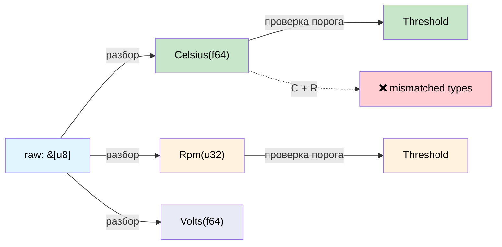

# Анализ размерностей: заставляем компилятор проверять единицы измерения 🟢

> **Что вы узнаете:** как newtype-обёртки и крейт `uom` превращают компилятор в движок проверки единиц измерения и предотвращают класс ошибок, из-за которого был потерян космический аппарат стоимостью 328 млн долларов.
>
> **Перекрёстные ссылки:** [гл. 02](ch02-typed-command-interfaces-request-determi.md) (типизированные команды используют эти типы), [гл. 07](ch07-validated-boundaries-parse-dont-validate.md) (проверенные границы), [гл. 10](ch10-putting-it-all-together-a-complete-diagn.md) (интеграция)

## Mars Climate Orbiter

В 1999 году был потерян марсианский зонд NASA Mars Climate Orbiter: одна команда передавала данные о тяге в **фунт-силах на секунду**, а команда навигации ожидала **ньютон-секунды**. Аппарат вошёл в атмосферу на высоте 57 км вместо 226 км и разрушился. Стоимость: 327,6 млн долларов.

Первопричина: **оба значения были `double`**. Компилятор не мог их различить.

Тот же класс ошибок скрывается в любой аппаратной диагностике, которая работает с физическими величинами:

```c
// C — все double, никакой проверки единиц
double read_temperature(int sensor_id);   // Цельсий? Фаренгейт? Кельвин?
double read_voltage(int channel);          // Вольты? Милливольты?
double read_fan_speed(int fan_id);         // об/мин? радианы в секунду?

// Ошибка: сравнение Цельсия с Фаренгейтом
if (read_temperature(0) > read_temperature(1)) { ... }  // единицы могут различаться!
```

## Newtype для физических величин

Самый простой корректный по построению подход: **обернуть каждую единицу измерения в отдельный тип**.

```rust,ignore
use std::fmt;

/// Температура в градусах Цельсия.
#[derive(Debug, Clone, Copy, PartialEq, PartialOrd)]
pub struct Celsius(pub f64);

/// Температура в градусах Фаренгейта.
#[derive(Debug, Clone, Copy, PartialEq, PartialOrd)]
pub struct Fahrenheit(pub f64);

/// Напряжение в вольтах.
#[derive(Debug, Clone, Copy, PartialEq, PartialOrd)]
pub struct Volts(pub f64);

/// Напряжение в милливольтах.
#[derive(Debug, Clone, Copy, PartialEq, PartialOrd)]
pub struct Millivolts(pub f64);

/// Скорость вентилятора в об/мин.
#[derive(Debug, Clone, Copy, PartialEq, PartialOrd)]
pub struct Rpm(pub f64);

// Преобразования явные:
impl From<Celsius> for Fahrenheit {
    fn from(c: Celsius) -> Self {
        Fahrenheit(c.0 * 9.0 / 5.0 + 32.0)
    }
}

impl From<Fahrenheit> for Celsius {
    fn from(f: Fahrenheit) -> Self {
        Celsius((f.0 - 32.0) * 5.0 / 9.0)
    }
}

impl From<Volts> for Millivolts {
    fn from(v: Volts) -> Self {
        Millivolts(v.0 * 1000.0)
    }
}

impl From<Millivolts> for Volts {
    fn from(mv: Millivolts) -> Self {
        Volts(mv.0 / 1000.0)
    }
}

impl fmt::Display for Celsius {
    fn fmt(&self, f: &mut fmt::Formatter<'_>) -> fmt::Result {
        write!(f, "{:.1}°C", self.0)
    }
}

impl fmt::Display for Rpm {
    fn fmt(&self, f: &mut fmt::Formatter<'_>) -> fmt::Result {
        write!(f, "{:.0} об/мин", self.0)
    }
}
```

Теперь компилятор ловит несоответствия единиц:

```rust,ignore
# #[derive(Debug, Clone, Copy, PartialEq, PartialOrd)]
# pub struct Celsius(pub f64);
# #[derive(Debug, Clone, Copy, PartialEq, PartialOrd)]
# pub struct Volts(pub f64);

fn check_thermal_limit(temp: Celsius, limit: Celsius) -> bool {
    temp > limit  // ✅ одинаковые единицы — компилируется
}

// fn bad_comparison(temp: Celsius, voltage: Volts) -> bool {
//     temp > voltage  // ❌ ОШИБКА: mismatched types — Celsius vs Volts
// }
```

**Нулевые накладные расходы во время выполнения:** newtype компилируются в обычные значения `f64`. Обёртка существует чисто как понятие системы типов.

## Макрос newtype для аппаратных величин

Писать newtype вручную утомительно. Макрос устраняет шаблонный код:

```rust,ignore
/// Генерирует newtype для физической величины.
macro_rules! quantity {
    ($Name:ident, $unit:expr) => {
        #[derive(Debug, Clone, Copy, PartialEq, PartialOrd)]
        pub struct $Name(pub f64);

        impl $Name {
            pub fn new(value: f64) -> Self { $Name(value) }
            pub fn value(self) -> f64 { self.0 }
        }

        impl std::fmt::Display for $Name {
            fn fmt(&self, f: &mut std::fmt::Formatter<'_>) -> std::fmt::Result {
                write!(f, "{:.2} {}", self.0, $unit)
            }
        }

        impl std::ops::Add for $Name {
            type Output = Self;
            fn add(self, rhs: Self) -> Self { $Name(self.0 + rhs.0) }
        }

        impl std::ops::Sub for $Name {
            type Output = Self;
            fn sub(self, rhs: Self) -> Self { $Name(self.0 - rhs.0) }
        }
    };
}

// Использование:
quantity!(Celsius, "°C");
quantity!(Fahrenheit, "°F");
quantity!(Volts, "V");
quantity!(Millivolts, "мВ");
quantity!(Rpm, "об/мин");
quantity!(Watts, "Вт");
quantity!(Amperes, "А");
quantity!(Pascals, "Па");
quantity!(Hertz, "Гц");
quantity!(Bytes, "Б");
```

Каждая строка порождает полноценный тип с Display, Add, Sub и операторами сравнения. **Всё это без накладных расходов во время выполнения.**

> **Физическая оговорка:** макрос генерирует `Add` для *всех* величин, включая `Celsius`. Сложение абсолютных температур (`25°C + 30°C = 55°C`) физически бессмысленно: для разностей температур нужен отдельный тип, например `TemperatureDelta`. Крейт `uom` (см. ниже) обрабатывает это корректно. Для простой диагностики датчиков, где температуры только сравниваются и выводятся, можно убрать `Add`/`Sub` из типов температур и оставить их там, где сложение имеет смысл (ватты, вольты, байты). Если нужна арифметика разностей, определите newtype `CelsiusDelta(f64)` с `impl Add<CelsiusDelta> for Celsius`.

## Прикладной пример: конвейер датчиков

Типичная диагностика считывает сырые значения АЦП, переводит их в физические единицы и сравнивает с порогами. С размерными типами каждый шаг проверяется системой типов:

```rust,ignore
# macro_rules! quantity {
#     ($Name:ident, $unit:expr) => {
#         #[derive(Debug, Clone, Copy, PartialEq, PartialOrd)]
#         pub struct $Name(pub f64);
#         impl $Name {
#             pub fn new(value: f64) -> Self { $Name(value) }
#             pub fn value(self) -> f64 { self.0 }
#         }
#         impl std::fmt::Display for $Name {
#             fn fmt(&self, f: &mut std::fmt::Formatter<'_>) -> std::fmt::Result {
#                 write!(f, "{:.2} {}", self.0, $unit)
#             }
#         }
#     };
# }
# quantity!(Celsius, "°C");
# quantity!(Volts, "V");
# quantity!(Rpm, "об/мин");

/// Сырое показание АЦП — ещё не физическая величина.
#[derive(Debug, Clone, Copy)]
pub struct AdcReading {
    pub channel: u8,
    pub raw: u16,   // 12-битное значение АЦП (0–4095)
}

/// Коэффициенты калибровки для перевода АЦП → физическая единица.
pub struct TemperatureCalibration {
    pub offset: f64,
    pub scale: f64,   // °C на отсчёт АЦП
}

pub struct VoltageCalibration {
    pub reference_mv: f64,
    pub divider_ratio: f64,
}

impl TemperatureCalibration {
    /// Перевод сырого АЦП → Celsius. Тип результата гарантирует, что выход — Celsius.
    pub fn convert(&self, adc: AdcReading) -> Celsius {
        Celsius::new(adc.raw as f64 * self.scale + self.offset)
    }
}

impl VoltageCalibration {
    /// Перевод сырого АЦП → Volts. Тип результата гарантирует, что выход — Volts.
    pub fn convert(&self, adc: AdcReading) -> Volts {
        Volts::new(adc.raw as f64 * self.reference_mv / 4096.0 / self.divider_ratio / 1000.0)
    }
}

/// Проверка порогов — компилируется, только если единицы совпадают.
pub struct Threshold<T: PartialOrd> {
    pub warning: T,
    pub critical: T,
}

#[derive(Debug, PartialEq)]
pub enum ThresholdResult {
    Normal,
    Warning,
    Critical,
}

impl<T: PartialOrd> Threshold<T> {
    pub fn check(&self, value: &T) -> ThresholdResult {
        if *value >= self.critical {
            ThresholdResult::Critical
        } else if *value >= self.warning {
            ThresholdResult::Warning
        } else {
            ThresholdResult::Normal
        }
    }
}

fn sensor_pipeline_example() {
    let temp_cal = TemperatureCalibration { offset: -50.0, scale: 0.0625 };
    let temp_threshold = Threshold {
        warning: Celsius::new(85.0),
        critical: Celsius::new(100.0),
    };

    let adc = AdcReading { channel: 0, raw: 2048 };
    let temp: Celsius = temp_cal.convert(adc);

    let result = temp_threshold.check(&temp);
    println!("Температура: {temp}, статус: {result:?}");

    // Это не скомпилируется: нельзя сравнить показание Celsius с порогом в Volts:
    // let volt_threshold = Threshold {
    //     warning: Volts::new(11.4),
    //     critical: Volts::new(10.8),
    // };
    // volt_threshold.check(&temp);  // ❌ ОШИБКА: expected &Volts, found &Celsius
}
```

**Весь конвейер** статически проверяется на соответствие типов:
- показания АЦП — это сырые отсчёты, а не единицы измерения
- калибровка даёт типизированные величины (Celsius, Volts)
- пороги обобщены по типу величины
- сравнение Celsius с Volts — **ошибка компиляции**

## Крейт uom

Для промышленного использования крейт [`uom`](https://crates.io/crates/uom) предоставляет полноценную систему анализа размерностей: сотни единиц, автоматическое преобразование и нулевые накладные расходы во время выполнения:

```rust,ignore
// Cargo.toml: uom = { version = "0.36", features = ["f64"] }
//
// use uom::si::f64::*;
// use uom::si::thermodynamic_temperature::degree_celsius;
// use uom::si::electric_potential::volt;
// use uom::si::power::watt;
//
// let temp = ThermodynamicTemperature::new::<degree_celsius>(85.0);
// let voltage = ElectricPotential::new::<volt>(12.0);
// let power = Power::new::<watt>(250.0);
//
// // temp + voltage;  // ❌ ошибка компиляции — нельзя сложить температуру и напряжение
// // power > temp;    // ❌ ошибка компиляции — нельзя сравнить мощность с температурой
```

Используйте `uom`, когда нужна автоматическая поддержка производных единиц (например, Ватты = Вольты × Амперы). Используйте самописные newtype, когда нужны только простые величины без арифметики производных единиц.

### Когда использовать размерные типы

| Сценарий | Рекомендация |
|----------|--------------|
| Показания датчиков (температура, напряжение, вентилятор) | ✅ Всегда: предотвращает путаницу единиц |
| Сравнение с порогами | ✅ Всегда: обобщённый `Threshold<T>` |
| Обмен данными между подсистемами | ✅ Всегда: закрепляйте контракты на границах API |
| Внутренние вычисления (одна единица во всём коде) | ⚠️ По желанию: меньше риска ошибок |
| Форматирование строк и вывод | ❌ Используйте реализацию Display у типа величины |

## Поток типов в конвейере датчиков



## Упражнение: калькулятор энергетического бюджета

Создайте newtype `Watts(f64)` и `Amperes(f64)`. Реализуйте:
- `Watts::from_vi(volts: Volts, amps: Amperes) -> Watts` (P = V × I)
- `PowerBudget`, который суммирует ватты и отклоняет добавления, превышающие заданный лимит.
- Попытка `Watts + Celsius` должна приводить к ошибке компиляции.

<details>
<summary>Решение</summary>

```rust,ignore
#[derive(Debug, Clone, Copy, PartialEq, PartialOrd)]
pub struct Watts(pub f64);

#[derive(Debug, Clone, Copy, PartialEq, PartialOrd)]
pub struct Amperes(pub f64);

#[derive(Debug, Clone, Copy, PartialEq, PartialOrd)]
pub struct Volts(pub f64);

#[derive(Debug, Clone, Copy, PartialEq, PartialOrd)]
pub struct Celsius(pub f64);

impl Watts {
    pub fn from_vi(volts: Volts, amps: Amperes) -> Self {
        Watts(volts.0 * amps.0)
    }
}

impl std::ops::Add for Watts {
    type Output = Watts;
    fn add(self, rhs: Watts) -> Watts {
        Watts(self.0 + rhs.0)
    }
}

pub struct PowerBudget {
    total: Watts,
    limit: Watts,
}

impl PowerBudget {
    pub fn new(limit: Watts) -> Self {
        PowerBudget { total: Watts(0.0), limit }
    }
    pub fn add(&mut self, w: Watts) -> Result<(), String> {
        let new_total = Watts(self.total.0 + w.0);
        if new_total > self.limit {
            return Err(format!("бюджет превышен: {:?} > {:?}", new_total, self.limit));
        }
        self.total = new_total;
        Ok(())
    }
}

// ❌ Ошибка компиляции: Watts + Celsius → "mismatched types"
// let bad = Watts(100.0) + Celsius(50.0);
```

</details>

## Ключевые выводы

1. **Newtype предотвращает путаницу единиц без накладных расходов** — `Celsius` и `Rpm` внутри оба `f64`, но компилятор считает их разными типами.
2. **Ошибка Mars Climate Orbiter становится невозможной** — передать фунт-силы там, где ожидаются ньютоны, — ошибка компиляции.
3. **Макрос `quantity!` уменьшает объём шаблонного кода** — он генерирует Display, арифметику и логику порогов для каждой единицы.
4. **Крейт `uom` обрабатывает производные единицы** — используйте его, когда нужно автоматически получать `Watts = Volts × Amperes`.
5. **Threshold обобщён по величине** — `Threshold<Celsius>` нельзя случайно сравнить с `Threshold<Rpm>`.

---
