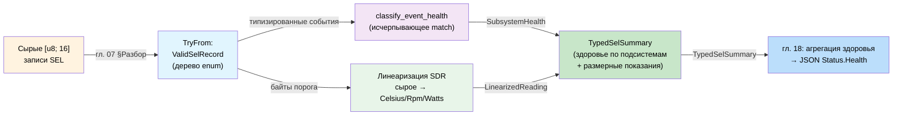
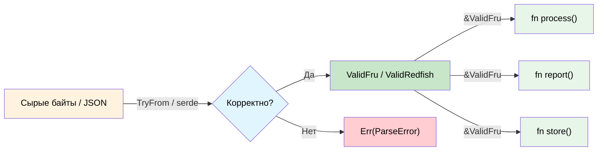

# Проверенные границы: parse, don't validate 🟡

> **Что вы узнаете:** как проверить данные ровно один раз на границе системы, хранить доказательство их корректности в отдельном типе и никогда не проверять повторно. Применяем к записям IPMI FRU (плоские байты), JSON Redfish (структурированные документы) и записям IPMI SEL (полиморфные бинарные данные с вложенной диспетчеризацией) со сквозным пошаговым разбором.
>
> **Перекрёстные ссылки:** [гл. 02](ch02-typed-command-interfaces-request-determi.md) (типизированные команды), [гл. 06](ch06-dimensional-analysis-making-the-compiler.md) (размерные типы), [гл. 11](ch11-fourteen-tricks-from-the-trenches.md) (приём 2: sealed-трейты, приём 3: `#[non_exhaustive]`, приём 5: FromStr), [гл. 14](ch14-testing-type-level-guarantees.md) (proptest)

## Проблема: разбросанная валидация

В типичном коде проверки разбросаны повсюду. Каждая функция, которая получает данные, перепроверяет их «на всякий случай»:

```c
// C — проверки разбросаны по всей кодовой базе
int process_fru_data(uint8_t *data, int len) {
    if (data == NULL) return -1;          // проверка: не NULL
    if (len < 8) return -1;              // проверка: минимальная длина
    if (data[0] != 0x01) return -1;      // проверка: версия формата
    if (checksum(data, len) != 0) return -1; // проверка: контрольная сумма

    // ... ещё 10 функций, которые повторяют те же проверки ...
}
```

Этот паттерн («дробовик» проверок) имеет две проблемы:
1. **Избыточность**: одни и те же проверки встречаются в десятках мест
2. **Неполнота**: забудете одну проверку в одной функции — и получите ошибку

## Parse, Don't Validate: разбирай, а не проверяй

Корректный по построению подход: **проверить один раз на границе, а затем хранить доказательство корректности в типе**.

```rust,ignore
/// Сырые байты из линии — ещё не проверены.
#[derive(Debug)]
pub struct RawFruData(Vec<u8>);
```

### Разбор: данные IPMI FRU

```rust,ignore
# #[derive(Debug)]
# pub struct RawFruData(Vec<u8>);

/// Проверенные данные IPMI FRU. Создать можно только через TryFrom,
/// который обеспечивает все инварианты. Имея ValidFru, вы гарантированно
/// имеете корректные данные.
#[derive(Debug)]
pub struct ValidFru {
    format_version: u8,
    internal_area_offset: u8,
    chassis_area_offset: u8,
    board_area_offset: u8,
    product_area_offset: u8,
    data: Vec<u8>,
}

#[derive(Debug)]
pub enum FruError {
    TooShort { actual: usize, minimum: usize },
    BadFormatVersion(u8),
    ChecksumMismatch { expected: u8, actual: u8 },
    InvalidAreaOffset { area: &'static str, offset: u8 },
}

impl std::fmt::Display for FruError {
    fn fmt(&self, f: &mut std::fmt::Formatter<'_>) -> std::fmt::Result {
        match self {
            Self::TooShort { actual, minimum } =>
                write!(f, "данные FRU слишком короткие: {actual} байт (минимум {minimum})"),
            Self::BadFormatVersion(v) =>
                write!(f, "неподдерживаемая версия формата FRU: {v}"),
            Self::ChecksumMismatch { expected, actual } =>
                write!(f, "контрольная сумма не совпадает: ожидалось 0x{expected:02X}, получено 0x{actual:02X}"),
            Self::InvalidAreaOffset { area, offset } =>
                write!(f, "некорректное смещение области {area}: {offset}"),
        }
    }
}

impl TryFrom<RawFruData> for ValidFru {
    type Error = FruError;

    fn try_from(raw: RawFruData) -> Result<Self, FruError> {
        let data = raw.0;

        // 1. Проверка длины
        if data.len() < 8 {
            return Err(FruError::TooShort {
                actual: data.len(),
                minimum: 8,
            });
        }

        // 2. Версия формата
        if data[0] != 0x01 {
            return Err(FruError::BadFormatVersion(data[0]));
        }

        // 3. Контрольная сумма (заголовок — первые 8 байт, контрольная сумма в байте 7)
        let checksum: u8 = data[..8].iter().fold(0u8, |acc, &b| acc.wrapping_add(b));
        if checksum != 0 {
            return Err(FruError::ChecksumMismatch {
                expected: 0,
                actual: checksum,
            });
        }

        // 4. Смещения областей должны быть в пределах данных
        for (name, idx) in [
            ("internal", 1), ("chassis", 2),
            ("board", 3), ("product", 4),
        ] {
            let offset = data[idx];
            if offset != 0 && (offset as usize * 8) >= data.len() {
                return Err(FruError::InvalidAreaOffset {
                    area: name,
                    offset,
                });
            }
        }

        // Все проверки пройдены — создаём проверенный тип
        Ok(ValidFru {
            format_version: data[0],
            internal_area_offset: data[1],
            chassis_area_offset: data[2],
            board_area_offset: data[3],
            product_area_offset: data[4],
            data,
        })
    }
}

impl ValidFru {
    /// Проверка не нужна: тип гарантирует корректность.
    pub fn board_area(&self) -> Option<&[u8]> {
        if self.board_area_offset == 0 {
            return None;
        }
        let start = self.board_area_offset as usize * 8;
        Some(&self.data[start..])  // безопасно: границы проверены при разборе
    }

    pub fn product_area(&self) -> Option<&[u8]> {
        if self.product_area_offset == 0 {
            return None;
        }
        let start = self.product_area_offset as usize * 8;
        Some(&self.data[start..])
    }

    pub fn format_version(&self) -> u8 {
        self.format_version
    }
}
```

Любая функция, которая принимает `&ValidFru`, **знает**, что данные корректны. Повторных проверок не нужно:

```rust,ignore
# pub struct ValidFru { board_area_offset: u8, data: Vec<u8> }
# impl ValidFru {
#     pub fn board_area(&self) -> Option<&[u8]> { None }
# }

/// Эта функция НЕ должна проверять данные FRU.
/// Сигнатура типа гарантирует, что они уже корректны.
fn extract_board_serial(fru: &ValidFru) -> Option<String> {
    let board = fru.board_area()?;
    // ... разбираем серийный номер из области платы ...
    // Проверки границ не нужны: ValidFru гарантирует, что смещения в пределах
    Some("ABC123".to_string()) // заглушка
}

fn extract_board_manufacturer(fru: &ValidFru) -> Option<String> {
    let board = fru.board_area()?;
    // Проверка здесь тоже не нужна: та же гарантия
    Some("Acme Corp".to_string()) // заглушка
}
```

## Проверенный JSON Redfish

Тот же паттерн применим к ответам API Redfish. Разбираем один раз, а валидность храним в типе:

```rust,ignore
use std::collections::HashMap;

/// Сырая JSON-строка из эндпоинта Redfish.
pub struct RawRedfishResponse(pub String);

/// Проверенный ответ Redfish Thermal.
/// Все обязательные поля гарантированно присутствуют и находятся в допустимом диапазоне.
#[derive(Debug)]
pub struct ValidThermalResponse {
    pub temperatures: Vec<ValidTemperatureReading>,
    pub fans: Vec<ValidFanReading>,
}

#[derive(Debug)]
pub struct ValidTemperatureReading {
    pub name: String,
    pub reading_celsius: f64,     // гарантированно не NaN, в пределах диапазона датчика
    pub upper_critical: f64,
    pub status: HealthStatus,
}

#[derive(Debug)]
pub struct ValidFanReading {
    pub name: String,
    pub reading_rpm: u32,        // гарантированно > 0 для установленных вентиляторов
    pub status: HealthStatus,
}

#[derive(Debug, Clone, Copy, PartialEq)]
pub enum HealthStatus {
    Ok,
    Warning,
    Critical,
}

#[derive(Debug)]
pub enum RedfishValidationError {
    MissingField(&'static str),
    OutOfRange { field: &'static str, value: f64 },
    InvalidStatus(String),
}

impl std::fmt::Display for RedfishValidationError {
    fn fmt(&self, f: &mut std::fmt::Formatter<'_>) -> std::fmt::Result {
        match self {
            Self::MissingField(name) => write!(f, "отсутствует обязательное поле: {name}"),
            Self::OutOfRange { field, value } =>
                write!(f, "поле {field} вне диапазона: {value}"),
            Self::InvalidStatus(s) => write!(f, "некорректный статус здоровья: {s}"),
        }
    }
}

// Имея проверенные данные, нижележащий код никогда не проверяет их повторно:
fn check_thermal_health(thermal: &ValidThermalResponse) -> bool {
    // Не нужно проверять отсутствие полей и значения NaN.
    // ValidThermalResponse гарантирует, что все показания разумны.
    thermal.temperatures.iter().all(|t| {
        t.reading_celsius < t.upper_critical && t.status != HealthStatus::Critical
    }) && thermal.fans.iter().all(|f| {
        f.reading_rpm > 0 && f.status != HealthStatus::Critical
    })
}
```

## Полиморфная валидация: записи SEL IPMI

В первых двух разобранных примерах проверялись **плоские** структуры: фиксированная раскладка байтов (FRU) и известная JSON-схема (Redfish). Реальные данные часто **полиморфны**: смысл последующих байтов зависит от предыдущих. Классический пример — записи журнала системных событий IPMI (System Event Log, SEL).

### Суть проблемы

Каждая запись SEL занимает ровно 16 байт. Но то, что означают эти байты, определяется цепочкой диспетчеризации:

```
Байт 2: Тип записи
  ├─ 0x02 → Системное событие
  │    Байт 10[6:4]: Тип события
  │      ├─ 0x01       → Событие порога (показание + порог в байтах данных 2–3)
  │      ├─ 0x02-0x0C  → Дискретное событие (бит в поле смещения)
  │      └─ 0x6F       → Специфичное для датчика (смысл зависит от типа датчика в байте 7)
  │           Байт 7: Тип датчика
  │             ├─ 0x01 → События температуры
  │             ├─ 0x02 → События напряжения
  │             ├─ 0x04 → События вентилятора
  │             ├─ 0x07 → События процессора
  │             ├─ 0x0C → События памяти
  │             ├─ 0x08 → События блока питания
  │             └─ ...  → (42 типа датчиков в IPMI 2.0, таблица 42-3)
  ├─ 0xC0-0xDF → OEM с меткой времени
  └─ 0xE0-0xFF → OEM без метки времени
```

В C это `switch` внутри `switch` внутри `switch`, и каждый уровень использует один и тот же указатель `uint8_t *data`. Забыли один уровень, неверно прочитали таблицу спецификации или взяли не тот байт — ошибка проходит незамеченной.

```c
// C — проблема полиморфного разбора
void process_sel_entry(uint8_t *data, int len) {
    if (data[2] == 0x02) {  // системное событие
        uint8_t event_type = (data[10] >> 4) & 0x07;
        if (event_type == 0x01) {  // порог
            uint8_t reading = data[11];   // 🐛 или всё-таки data[13]?
            uint8_t threshold = data[12]; // 🐛 в спецификации байт 12 — это триггер, а не порог
            printf("Температура: %d пересекла %d\n", reading, threshold);
        } else if (event_type == 0x6F) {  // специфичное для датчика
            uint8_t sensor_type = data[7];
            if (sensor_type == 0x0C) {  // память
                // 🐛 забыли проверить биты смещения event data 1
                printf("Ошибка ECC памяти\n");
            }
            // 🐛 нет else — молча отбрасываются 30+ других типов датчиков
        }
    }
    // 🐛 записи OEM молча игнорируются
}
```

### Шаг 1 — разбор внешнего уровня

Первый `TryFrom` диспетчеризует по типу записи — самому внешнему слою объединения:

```rust,ignore
/// Сырая 16-байтная запись SEL, прямо из `Get SEL Entry` (команда IPMI 0x43).
pub struct RawSelRecord(pub [u8; 16]);

/// Проверенная запись SEL — тип записи продиспетчеризован, все поля проверены.
pub enum ValidSelRecord {
    SystemEvent(SystemEventRecord),
    OemTimestamped(OemTimestampedRecord),
    OemNonTimestamped(OemNonTimestampedRecord),
}

#[derive(Debug)]
pub struct OemTimestampedRecord {
    pub record_id: u16,
    pub timestamp: u32,
    pub manufacturer_id: [u8; 3],
    pub oem_data: [u8; 6],
}

#[derive(Debug)]
pub struct OemNonTimestampedRecord {
    pub record_id: u16,
    pub oem_data: [u8; 13],
}

#[derive(Debug)]
pub enum SelParseError {
    UnknownRecordType(u8),
    UnknownSensorType(u8),
    UnknownEventType(u8),
    InvalidEventData { reason: &'static str },
}

impl std::fmt::Display for SelParseError {
    fn fmt(&self, f: &mut std::fmt::Formatter<'_>) -> std::fmt::Result {
        match self {
            Self::UnknownRecordType(t) => write!(f, "неизвестный тип записи: 0x{t:02X}"),
            Self::UnknownSensorType(t) => write!(f, "неизвестный тип датчика: 0x{t:02X}"),
            Self::UnknownEventType(t) => write!(f, "неизвестный тип события: 0x{t:02X}"),
            Self::InvalidEventData { reason } => write!(f, "некорректные данные события: {reason}"),
        }
    }
}

impl TryFrom<RawSelRecord> for ValidSelRecord {
    type Error = SelParseError;

    fn try_from(raw: RawSelRecord) -> Result<Self, SelParseError> {
        let d = &raw.0;
        let record_id = u16::from_le_bytes([d[0], d[1]]);

        match d[2] {
            0x02 => {
                let system = parse_system_event(record_id, d)?;
                Ok(ValidSelRecord::SystemEvent(system))
            }
            0xC0..=0xDF => {
                Ok(ValidSelRecord::OemTimestamped(OemTimestampedRecord {
                    record_id,
                    timestamp: u32::from_le_bytes([d[3], d[4], d[5], d[6]]),
                    manufacturer_id: [d[7], d[8], d[9]],
                    oem_data: [d[10], d[11], d[12], d[13], d[14], d[15]],
                }))
            }
            0xE0..=0xFF => {
                Ok(ValidSelRecord::OemNonTimestamped(OemNonTimestampedRecord {
                    record_id,
                    oem_data: [d[3], d[4], d[5], d[6], d[7], d[8], d[9],
                               d[10], d[11], d[12], d[13], d[14], d[15]],
                }))
            }
            other => Err(SelParseError::UnknownRecordType(other)),
        }
    }
}
```

После этой границы каждый потребитель выполняет сопоставление с enum. Компилятор требует обработать все три типа записей: вы не можете «забыть» OEM-записи.

### Шаг 2 — разбор системного события: тип датчика → типизированное событие

Внутренняя диспетчеризация превращает байты данных события в сумму типов, индексированную типом датчика. Вложенный `switch` из C здесь становится вложенным enum:

```rust,ignore
#[derive(Debug)]
pub struct SystemEventRecord {
    pub record_id: u16,
    pub timestamp: u32,
    pub generator: GeneratorId,
    pub sensor_type: SensorType,
    pub sensor_number: u8,
    pub event_direction: EventDirection,
    pub event: TypedEvent,      // ← ключевое: данные события ТИПИЗИРОВАНЫ
}

#[derive(Debug)]
pub enum GeneratorId {
    Software(u8),
    Ipmb { slave_addr: u8, channel: u8, lun: u8 },
}

#[derive(Debug, Clone, Copy, PartialEq)]
pub enum EventDirection { Assertion, Deassertion }

// ──── Иерархия типов датчиков и событий ────

/// Типы датчиков из таблицы 42-3 IPMI. Non-exhaustive, потому что будущие версии IPMI
/// и диапазоны OEM добавят варианты (см. приём 3 в гл. 11).
#[non_exhaustive]
#[derive(Debug, Clone, Copy, PartialEq)]
pub enum SensorType {
    Temperature,    // 0x01
    Voltage,        // 0x02
    Current,        // 0x03
    Fan,            // 0x04
    PhysicalSecurity, // 0x05
    Processor,      // 0x07
    PowerSupply,    // 0x08
    Memory,         // 0x0C
    SystemEvent,    // 0x12
    Watchdog2,      // 0x23
}

/// Полиморфная полезная нагрузка: каждый вариант несёт собственные типизированные данные.
#[derive(Debug)]
pub enum TypedEvent {
    Threshold(ThresholdEvent),
    SensorSpecific(SensorSpecificEvent),
    Discrete { offset: u8, event_data: [u8; 3] },
}

/// События порога несут значение триггера и пороговое значение.
/// Оба — сырые значения датчика (до линеаризации), хранятся как u8.
/// После линеаризации SDR они становятся размерными типами (гл. 06).
#[derive(Debug)]
pub struct ThresholdEvent {
    pub crossing: ThresholdCrossing,
    pub trigger_reading: u8,
    pub threshold_value: u8,
}

#[derive(Debug, Clone, Copy, PartialEq)]
pub enum ThresholdCrossing {
    LowerNonCriticalLow,
    LowerNonCriticalHigh,
    LowerCriticalLow,
    LowerCriticalHigh,
    LowerNonRecoverableLow,
    LowerNonRecoverableHigh,
    UpperNonCriticalLow,
    UpperNonCriticalHigh,
    UpperCriticalLow,
    UpperCriticalHigh,
    UpperNonRecoverableLow,
    UpperNonRecoverableHigh,
}

/// Специфичные для датчика события: каждый тип датчика получает свой вариант
/// с исчерпывающим enum событий этого датчика.
#[derive(Debug)]
pub enum SensorSpecificEvent {
    Temperature(TempEvent),
    Voltage(VoltageEvent),
    Fan(FanEvent),
    Processor(ProcessorEvent),
    PowerSupply(PowerSupplyEvent),
    Memory(MemoryEvent),
    PhysicalSecurity(PhysicalSecurityEvent),
    Watchdog(WatchdogEvent),
}

// ──── Перечисления событий для каждого типа датчика (из таблицы 42-3 IPMI) ────

#[derive(Debug, Clone, Copy, PartialEq)]
pub enum MemoryEvent {
    CorrectableEcc,
    UncorrectableEcc,
    Parity,
    MemoryBoardScrubFailed,
    MemoryDeviceDisabled,
    CorrectableEccLogLimit,
    PresenceDetected,
    ConfigurationError,
    Spare,
    Throttled,
    CriticalOvertemperature,
}

#[derive(Debug, Clone, Copy, PartialEq)]
pub enum PowerSupplyEvent {
    PresenceDetected,
    Failure,
    PredictiveFailure,
    InputLost,
    InputOutOfRange,
    InputLostOrOutOfRange,
    ConfigurationError,
    InactiveStandby,
}

#[derive(Debug, Clone, Copy, PartialEq)]
pub enum TempEvent {
    UpperNonCritical,
    UpperCritical,
    UpperNonRecoverable,
    LowerNonCritical,
    LowerCritical,
    LowerNonRecoverable,
}

#[derive(Debug, Clone, Copy, PartialEq)]
pub enum VoltageEvent {
    UpperNonCritical,
    UpperCritical,
    UpperNonRecoverable,
    LowerNonCritical,
    LowerCritical,
    LowerNonRecoverable,
}

#[derive(Debug, Clone, Copy, PartialEq)]
pub enum FanEvent {
    UpperNonCritical,
    UpperCritical,
    UpperNonRecoverable,
    LowerNonCritical,
    LowerCritical,
    LowerNonRecoverable,
}

#[derive(Debug, Clone, Copy, PartialEq)]
pub enum ProcessorEvent {
    Ierr,
    ThermalTrip,
    Frb1BistFailure,
    Frb2HangInPost,
    Frb3ProcessorStartupFailure,
    ConfigurationError,
    UncorrectableMachineCheck,
    PresenceDetected,
    Disabled,
    TerminatorPresenceDetected,
    Throttled,
}

#[derive(Debug, Clone, Copy, PartialEq)]
pub enum PhysicalSecurityEvent {
    ChassisIntrusion,
    DriveIntrusion,
    IOCardAreaIntrusion,
    ProcessorAreaIntrusion,
    LanLeashedLost,
    UnauthorizedDocking,
    FanAreaIntrusion,
}

#[derive(Debug, Clone, Copy, PartialEq)]
pub enum WatchdogEvent {
    BiosReset,
    OsReset,
    OsShutdown,
    OsPowerDown,
    OsPowerCycle,
    BiosNmi,
    Timer,
}
```

### Шаг 3 — связка парсера

```rust,ignore
fn parse_system_event(record_id: u16, d: &[u8]) -> Result<SystemEventRecord, SelParseError> {
    let timestamp = u32::from_le_bytes([d[3], d[4], d[5], d[6]]);

    let generator = if d[7] & 0x01 == 0 {
        GeneratorId::Ipmb {
            slave_addr: d[7] & 0xFE,
            channel: (d[8] >> 4) & 0x0F,
            lun: d[8] & 0x03,
        }
    } else {
        GeneratorId::Software(d[7])
    };

    let sensor_type = parse_sensor_type(d[10])?;
    let sensor_number = d[11];
    let event_direction = if d[12] & 0x80 != 0 {
        EventDirection::Deassertion
    } else {
        EventDirection::Assertion
    };

    let event_type_code = d[12] & 0x7F;
    let event_data = [d[13], d[14], d[15]];

    let event = match event_type_code {
        0x01 => {
            // Порог — байт 2 данных события это показание триггера, байт 3 — порог
            let offset = event_data[0] & 0x0F;
            TypedEvent::Threshold(ThresholdEvent {
                crossing: parse_threshold_crossing(offset)?,
                trigger_reading: event_data[1],
                threshold_value: event_data[2],
            })
        }
        0x6F => {
            // Специфичное для датчика — диспетчеризация по типу датчика
            let offset = event_data[0] & 0x0F;
            let specific = parse_sensor_specific(&sensor_type, offset)?;
            TypedEvent::SensorSpecific(specific)
        }
        0x02..=0x0C => {
            // Дискретное общего вида
            TypedEvent::Discrete { offset: event_data[0] & 0x0F, event_data }
        }
        other => return Err(SelParseError::UnknownEventType(other)),
    };

    Ok(SystemEventRecord {
        record_id,
        timestamp,
        generator,
        sensor_type,
        sensor_number,
        event_direction,
        event,
    })
}

fn parse_sensor_type(code: u8) -> Result<SensorType, SelParseError> {
    match code {
        0x01 => Ok(SensorType::Temperature),
        0x02 => Ok(SensorType::Voltage),
        0x03 => Ok(SensorType::Current),
        0x04 => Ok(SensorType::Fan),
        0x05 => Ok(SensorType::PhysicalSecurity),
        0x07 => Ok(SensorType::Processor),
        0x08 => Ok(SensorType::PowerSupply),
        0x0C => Ok(SensorType::Memory),
        0x12 => Ok(SensorType::SystemEvent),
        0x23 => Ok(SensorType::Watchdog2),
        other => Err(SelParseError::UnknownSensorType(other)),
    }
}

fn parse_threshold_crossing(offset: u8) -> Result<ThresholdCrossing, SelParseError> {
    match offset {
        0x00 => Ok(ThresholdCrossing::LowerNonCriticalLow),
        0x01 => Ok(ThresholdCrossing::LowerNonCriticalHigh),
        0x02 => Ok(ThresholdCrossing::LowerCriticalLow),
        0x03 => Ok(ThresholdCrossing::LowerCriticalHigh),
        0x04 => Ok(ThresholdCrossing::LowerNonRecoverableLow),
        0x05 => Ok(ThresholdCrossing::LowerNonRecoverableHigh),
        0x06 => Ok(ThresholdCrossing::UpperNonCriticalLow),
        0x07 => Ok(ThresholdCrossing::UpperNonCriticalHigh),
        0x08 => Ok(ThresholdCrossing::UpperCriticalLow),
        0x09 => Ok(ThresholdCrossing::UpperCriticalHigh),
        0x0A => Ok(ThresholdCrossing::UpperNonRecoverableLow),
        0x0B => Ok(ThresholdCrossing::UpperNonRecoverableHigh),
        _ => Err(SelParseError::InvalidEventData {
            reason: "смещение порога вне диапазона",
        }),
    }
}

fn parse_sensor_specific(
    sensor_type: &SensorType,
    offset: u8,
) -> Result<SensorSpecificEvent, SelParseError> {
    match sensor_type {
        SensorType::Memory => {
            let ev = match offset {
                0x00 => MemoryEvent::CorrectableEcc,
                0x01 => MemoryEvent::UncorrectableEcc,
                0x02 => MemoryEvent::Parity,
                0x03 => MemoryEvent::MemoryBoardScrubFailed,
                0x04 => MemoryEvent::MemoryDeviceDisabled,
                0x05 => MemoryEvent::CorrectableEccLogLimit,
                0x06 => MemoryEvent::PresenceDetected,
                0x07 => MemoryEvent::ConfigurationError,
                0x08 => MemoryEvent::Spare,
                0x09 => MemoryEvent::Throttled,
                0x0A => MemoryEvent::CriticalOvertemperature,
                _ => return Err(SelParseError::InvalidEventData {
                    reason: "неизвестное смещение события памяти",
                }),
            };
            Ok(SensorSpecificEvent::Memory(ev))
        }
        SensorType::PowerSupply => {
            let ev = match offset {
                0x00 => PowerSupplyEvent::PresenceDetected,
                0x01 => PowerSupplyEvent::Failure,
                0x02 => PowerSupplyEvent::PredictiveFailure,
                0x03 => PowerSupplyEvent::InputLost,
                0x04 => PowerSupplyEvent::InputOutOfRange,
                0x05 => PowerSupplyEvent::InputLostOrOutOfRange,
                0x06 => PowerSupplyEvent::ConfigurationError,
                0x07 => PowerSupplyEvent::InactiveStandby,
                _ => return Err(SelParseError::InvalidEventData {
                    reason: "неизвестное смещение события блока питания",
                }),
            };
            Ok(SensorSpecificEvent::PowerSupply(ev))
        }
        SensorType::Processor => {
            let ev = match offset {
                0x00 => ProcessorEvent::Ierr,
                0x01 => ProcessorEvent::ThermalTrip,
                0x02 => ProcessorEvent::Frb1BistFailure,
                0x03 => ProcessorEvent::Frb2HangInPost,
                0x04 => ProcessorEvent::Frb3ProcessorStartupFailure,
                0x05 => ProcessorEvent::ConfigurationError,
                0x06 => ProcessorEvent::UncorrectableMachineCheck,
                0x07 => ProcessorEvent::PresenceDetected,
                0x08 => ProcessorEvent::Disabled,
                0x09 => ProcessorEvent::TerminatorPresenceDetected,
                0x0A => ProcessorEvent::Throttled,
                _ => return Err(SelParseError::InvalidEventData {
                    reason: "неизвестное смещение события процессора",
                }),
            };
            Ok(SensorSpecificEvent::Processor(ev))
        }
        // Аналогично для Temperature, Voltage, Fan и других типов.
        // Каждый тип датчика сопоставляет свои смещения с отдельным enum.
        _ => Err(SelParseError::InvalidEventData {
            reason: "диспетчеризация специфичных событий не реализована для этого типа датчика",
        }),
    }
}
```

### Шаг 4 — потребление типизированных записей SEL

После разбора нижележащий код выполняет сопоставление с образцом по вложенным enum. Компилятор требует исчерпывающей обработки: никаких тихих проваливаний и забытых типов датчиков:

```rust,ignore
/// Определяет, должно ли событие SEL вызывать аппаратное оповещение.
/// Компилятор гарантирует, что обрабатывается каждый вариант.
fn should_alert(record: &ValidSelRecord) -> bool {
    match record {
        ValidSelRecord::SystemEvent(sys) => match &sys.event {
            TypedEvent::Threshold(t) => {
                // Любое критическое или невосстанавливаемое пересечение порога → оповещение
                matches!(t.crossing,
                    ThresholdCrossing::UpperCriticalLow
                    | ThresholdCrossing::UpperCriticalHigh
                    | ThresholdCrossing::LowerCriticalLow
                    | ThresholdCrossing::LowerCriticalHigh
                    | ThresholdCrossing::UpperNonRecoverableLow
                    | ThresholdCrossing::UpperNonRecoverableHigh
                    | ThresholdCrossing::LowerNonRecoverableLow
                    | ThresholdCrossing::LowerNonRecoverableHigh
                )
            }
            TypedEvent::SensorSpecific(ss) => match ss {
                SensorSpecificEvent::Memory(m) => matches!(m,
                    MemoryEvent::UncorrectableEcc
                    | MemoryEvent::Parity
                    | MemoryEvent::CriticalOvertemperature
                ),
                SensorSpecificEvent::PowerSupply(p) => matches!(p,
                    PowerSupplyEvent::Failure
                    | PowerSupplyEvent::InputLost
                ),
                SensorSpecificEvent::Processor(p) => matches!(p,
                    ProcessorEvent::Ierr
                    | ProcessorEvent::ThermalTrip
                    | ProcessorEvent::UncorrectableMachineCheck
                ),
                // Без запасной ветки `_`: новый вариант датчика заставит явно решить,
                // вызывает ли он оповещение. Иначе компилятор выдаст ошибку non-exhaustive patterns
                SensorSpecificEvent::Temperature(_)
                | SensorSpecificEvent::Voltage(_)
                | SensorSpecificEvent::Fan(_)
                | SensorSpecificEvent::PhysicalSecurity(_)
                | SensorSpecificEvent::Watchdog(_) => false,
            },
            TypedEvent::Discrete { .. } => false,
        },
        // Записи OEM в этой политике не вызывают оповещений
        ValidSelRecord::OemTimestamped(_) => false,
        ValidSelRecord::OemNonTimestamped(_) => false,
    }
}

/// Формирует понятное человеку описание.
/// Каждая ветка даёт конкретное сообщение — без запасного варианта «неизвестное событие».
fn describe(record: &ValidSelRecord) -> String {
    match record {
        ValidSelRecord::SystemEvent(sys) => {
            let sensor = format!("датчик {:?} #{}", sys.sensor_type, sys.sensor_number);
            let dir = match sys.event_direction {
                EventDirection::Assertion => "установлено",
                EventDirection::Deassertion => "снято",
            };
            match &sys.event {
                TypedEvent::Threshold(t) => {
                    format!("{sensor}: {:?} {dir} (показание: 0x{:02X}, порог: 0x{:02X})",
                        t.crossing, t.trigger_reading, t.threshold_value)
                }
                TypedEvent::SensorSpecific(ss) => {
                    format!("{sensor}: {ss:?} {dir}")
                }
                TypedEvent::Discrete { offset, .. } => {
                    format!("{sensor}: дискретное смещение {offset:#x} {dir}")
                }
            }
        }
        ValidSelRecord::OemTimestamped(oem) =>
            format!("OEM-запись 0x{:04X} (производитель {:02X}{:02X}{:02X})",
                oem.record_id,
                oem.manufacturer_id[0], oem.manufacturer_id[1], oem.manufacturer_id[2]),
        ValidSelRecord::OemNonTimestamped(oem) =>
            format!("OEM-запись без метки времени 0x{:04X}", oem.record_id),
    }
}
```

### Пошаговый разбор: сквозная обработка SEL

Вот полный поток: от сырых байтов по линии до решения о тревоге, с каждой типизированной передачей:

```rust,ignore
/// Обрабатывает все записи SEL от BMC, формируя типизированные тревоги.
fn process_sel_log(raw_entries: &[[u8; 16]]) -> Vec<String> {
    let mut alerts = Vec::new();

    for (i, raw_bytes) in raw_entries.iter().enumerate() {
        // ─── Граница: сырые байты → проверенная запись ───
        let raw = RawSelRecord(*raw_bytes);
        let record = match ValidSelRecord::try_from(raw) {
            Ok(r) => r,
            Err(e) => {
                eprintln!("Запись SEL {i}: ошибка разбора: {e}");
                continue;
            }
        };

        // ─── Отсюда всё типизировано ───

        // 1. Описываем событие (исчерпывающее сопоставление — покрыты все варианты)
        let description = describe(&record);
        println!("SEL[{i}]: {description}");

        // 2. Проверяем политику тревог (исчерпывающее сопоставление — компилятор доказывает полноту)
        if should_alert(&record) {
            alerts.push(description);
        }

        // 3. Извлекаем размерные показания из событий порога
        if let ValidSelRecord::SystemEvent(sys) = &record {
            if let TypedEvent::Threshold(t) = &sys.event {
                // Компилятор знает, что t.trigger_reading — это показание события порога,
                // а не произвольный байт. После линеаризации SDR (гл. 06) это станет:
                //   let temp: Celsius = linearize(t.trigger_reading, &sdr);
                // А затем Celsius нельзя сравнить с Rpm.
                println!(
                    "  → сырое показание: 0x{:02X}, сырой порог: 0x{:02X}",
                    t.trigger_reading, t.threshold_value
                );
            }
        }
    }

    alerts
}

fn main() {
    // Пример: две записи SEL (сфабрикованы для иллюстрации)
    let sel_data: Vec<[u8; 16]> = vec![
        // Запись 1: системное событие, датчик памяти #3, специфичное для датчика,
        //           смещение 0x00 = CorrectableEcc, установка
        [
            0x01, 0x00,       // ID записи: 1
            0x02,             // тип записи: системное событие
            0x00, 0x00, 0x00, 0x00, // метка времени (заглушка)
            0x20,             // генератор: адрес ведомого IPMB 0x20
            0x00,             // канал/LUN
            0x04,             // версия сообщения события
            0x0C,             // тип датчика: Memory (0x0C)
            0x03,             // номер датчика: 3
            0x6F,             // направление: установка, тип события: специфичное для датчика
            0x00,             // данные события 1: смещение 0x00 = CorrectableEcc
            0x00, 0x00,       // данные события 2–3
        ],
        // Запись 2: системное событие, датчик температуры #1, порог,
        //           смещение 0x09 = UpperCriticalHigh, показание=95, порог=90
        [
            0x02, 0x00,       // ID записи: 2
            0x02,             // тип записи: системное событие
            0x00, 0x00, 0x00, 0x00, // метка времени (заглушка)
            0x20,             // генератор
            0x00,             // канал/LUN
            0x04,             // версия сообщения события
            0x01,             // тип датчика: Temperature (0x01)
            0x01,             // номер датчика: 1
            0x01,             // направление: установка, тип события: порог (0x01)
            0x09,             // данные события 1: смещение 0x09 = UpperCriticalHigh
            0x5F,             // данные события 2: значение триггера (95 в сыром виде)
            0x5A,             // данные события 3: пороговое значение (90 в сыром виде)
        ],
    ];

    let alerts = process_sel_log(&sel_data);
    println!("\n=== ТРЕВОГИ ({}) ===", alerts.len());
    for alert in &alerts {
        println!("  🚨 {alert}");
    }
}
```

**Ожидаемый вывод:**

```text
SEL[0]: датчик Memory #3: Memory(CorrectableEcc) установлено
SEL[1]: датчик Temperature #1: UpperCriticalHigh установлено (показание: 0x5F, порог: 0x5A)
  → сырое показание: 0x5F, сырой порог: 0x5A

=== ТРЕВОГИ (1) ===
  🚨 датчик Temperature #1: UpperCriticalHigh установлено (показание: 0x5F, порог: 0x5A)
```

Запись 0 (корректируемая ошибка ECC) регистрируется, но тревоги не вызывает. Запись 1 (верхний критический порог температуры) вызывает тревогу. Оба решения обеспечены исчерпывающим сопоставлением с образцом: компилятор доказывает, что каждый тип датчика и каждое пересечение порога обработаны.

### От разобранных событий к здоровью Redfish: конвейер потребителя

Пошаговый разбор выше заканчивается тревогами, но в реальном BMC разобранные записи SEL попадают в агрегацию состояния здоровья Redfish ([гл. 18](ch18-redfish-server-walkthrough.md)). Текущая передача данных — это `bool`, который теряет информацию:

```rust,ignore
// ❌ С потерями: отбрасываем детали по подсистемам
pub struct SelSummary {
    pub has_critical_events: bool,
    pub total_entries: u32,
}
```

Это теряет всё, что дала система типов: какая подсистема затронута, уровень серьёзности и есть ли в показании размерные данные. Построим полный конвейер.

#### Шаг 1 — линеаризация SDR: сырые байты → размерные типы (гл. 06)

События порога SEL несут сырые показания датчика в байтах данных 2–3. SDR (Sensor Data Record) IPMI задаёт формулу линеаризации. После линеаризации сырой байт становится размерным типом:

```rust,ignore
/// Коэффициенты линеаризации SDR для одного датчика.
/// См. раздел 36.3 спецификации IPMI для полной формулы.
pub struct SdrLinearization {
    pub sensor_type: SensorType,
    pub m: i16,        // множитель
    pub b: i16,        // смещение
    pub r_exp: i8,     // экспонента результата (степень 10)
    pub b_exp: i8,     // экспонента B
}

/// Линеаризованное показание датчика с прикреплённой единицей измерения.
/// Возвращаемый тип зависит от типа датчика: компилятор гарантирует, что датчики
/// температуры возвращают Celsius, а не Rpm.
#[derive(Debug, Clone)]
pub enum LinearizedReading {
    Temperature(Celsius),
    Voltage(Volts),
    Fan(Rpm),
    Current(Amps),
    Power(Watts),
}

#[derive(Debug, Clone, Copy, PartialEq, PartialOrd)]
pub struct Amps(pub f64);

impl SdrLinearization {
    /// Применяет формулу линеаризации IPMI:
    ///   y = (M × raw + B × 10^B_exp) × 10^R_exp
    /// Возвращает размерный тип в зависимости от типа датчика.
    pub fn linearize(&self, raw: u8) -> LinearizedReading {
        let y = (self.m as f64 * raw as f64
                + self.b as f64 * 10_f64.powi(self.b_exp as i32))
                * 10_f64.powi(self.r_exp as i32);

        match self.sensor_type {
            SensorType::Temperature => LinearizedReading::Temperature(Celsius(y)),
            SensorType::Voltage     => LinearizedReading::Voltage(Volts(y)),
            SensorType::Fan         => LinearizedReading::Fan(Rpm(y as u32)),
            SensorType::Current     => LinearizedReading::Current(Amps(y)),
            SensorType::PowerSupply => LinearizedReading::Power(Watts(y)),
            // Остальные типы датчиков — расширить при необходимости
            _ => LinearizedReading::Temperature(Celsius(y)),
        }
    }
}
```

Теперь сырой байт `0x5F` (95 в десятичной системе) из нашего пошагового разбора SEL становится `Celsius(95.0)`, и компилятор не даст сравнить его с `Rpm` или `Watts`.

#### Шаг 2 — классификация здоровья по подсистемам

Вместо свёртывания всего в `has_critical_events: bool` классифицируем каждое разобранное событие SEL по корзине здоровья подсистемы:

```rust,ignore
/// Худшее значение здоровья — Ord даёт нам `.max()` бесплатно.
/// (Полное определение в гл. 18; здесь повторено для конвейера SEL.)
#[derive(Debug, Clone, Copy, PartialEq, Eq, PartialOrd, Ord)]
pub enum HealthValue { OK, Warning, Critical }

/// Вклад одного события SEL в здоровье, классифицированный по подсистемам.
#[derive(Debug, Clone)]
pub enum SubsystemHealth {
    Processor(HealthValue),
    Memory(HealthValue),
    PowerSupply(HealthValue),
    Thermal(HealthValue),
    Fan(HealthValue),
    Storage(HealthValue),
    Security(HealthValue),
}

/// Классифицирует типизированное событие SEL по подсистемам.
/// Исчерпывающее сопоставление гарантирует, что каждый тип датчика вносит вклад.
fn classify_event_health(record: &SystemEventRecord) -> SubsystemHealth {
    match &record.event {
        TypedEvent::Threshold(t) => {
            // Серьёзность порога зависит от уровня пересечения
            let health = match t.crossing {
                // Некритичный → Warning
                ThresholdCrossing::UpperNonCriticalLow
                | ThresholdCrossing::UpperNonCriticalHigh
                | ThresholdCrossing::LowerNonCriticalLow
                | ThresholdCrossing::LowerNonCriticalHigh => HealthValue::Warning,

                // Критический или невосстанавливаемый → Critical
                ThresholdCrossing::UpperCriticalLow
                | ThresholdCrossing::UpperCriticalHigh
                | ThresholdCrossing::LowerCriticalLow
                | ThresholdCrossing::LowerCriticalHigh
                | ThresholdCrossing::UpperNonRecoverableLow
                | ThresholdCrossing::UpperNonRecoverableHigh
                | ThresholdCrossing::LowerNonRecoverableLow
                | ThresholdCrossing::LowerNonRecoverableHigh => HealthValue::Critical,
            };

            // Направляем в нужную подсистему по типу датчика
            match record.sensor_type {
                SensorType::Temperature => SubsystemHealth::Thermal(health),
                SensorType::Voltage     => SubsystemHealth::PowerSupply(health),
                SensorType::Current     => SubsystemHealth::PowerSupply(health),
                SensorType::Fan         => SubsystemHealth::Fan(health),
                SensorType::Processor   => SubsystemHealth::Processor(health),
                SensorType::PowerSupply => SubsystemHealth::PowerSupply(health),
                SensorType::Memory      => SubsystemHealth::Memory(health),
                _                       => SubsystemHealth::Thermal(health),
            }
        }

        TypedEvent::SensorSpecific(ss) => match ss {
            SensorSpecificEvent::Memory(m) => {
                let health = match m {
                    MemoryEvent::UncorrectableEcc
                    | MemoryEvent::Parity
                    | MemoryEvent::CriticalOvertemperature => HealthValue::Critical,

                    MemoryEvent::CorrectableEccLogLimit
                    | MemoryEvent::MemoryBoardScrubFailed
                    | MemoryEvent::Throttled => HealthValue::Warning,

                    MemoryEvent::CorrectableEcc
                    | MemoryEvent::PresenceDetected
                    | MemoryEvent::MemoryDeviceDisabled
                    | MemoryEvent::ConfigurationError
                    | MemoryEvent::Spare => HealthValue::OK,
                };
                SubsystemHealth::Memory(health)
            }

            SensorSpecificEvent::PowerSupply(p) => {
                let health = match p {
                    PowerSupplyEvent::Failure
                    | PowerSupplyEvent::InputLost => HealthValue::Critical,

                    PowerSupplyEvent::PredictiveFailure
                    | PowerSupplyEvent::InputOutOfRange
                    | PowerSupplyEvent::InputLostOrOutOfRange
                    | PowerSupplyEvent::ConfigurationError => HealthValue::Warning,

                    PowerSupplyEvent::PresenceDetected
                    | PowerSupplyEvent::InactiveStandby => HealthValue::OK,
                };
                SubsystemHealth::PowerSupply(health)
            }

            SensorSpecificEvent::Processor(p) => {
                let health = match p {
                    ProcessorEvent::Ierr
                    | ProcessorEvent::ThermalTrip
                    | ProcessorEvent::UncorrectableMachineCheck => HealthValue::Critical,

                    ProcessorEvent::Frb1BistFailure
                    | ProcessorEvent::Frb2HangInPost
                    | ProcessorEvent::Frb3ProcessorStartupFailure
                    | ProcessorEvent::ConfigurationError
                    | ProcessorEvent::Disabled => HealthValue::Warning,

                    ProcessorEvent::PresenceDetected
                    | ProcessorEvent::TerminatorPresenceDetected
                    | ProcessorEvent::Throttled => HealthValue::OK,
                };
                SubsystemHealth::Processor(health)
            }

            SensorSpecificEvent::PhysicalSecurity(_) =>
                SubsystemHealth::Security(HealthValue::Warning),

            SensorSpecificEvent::Watchdog(_) =>
                SubsystemHealth::Processor(HealthValue::Warning),

            // Специфичные для датчиков температуры, напряжения и вентилятора события
            SensorSpecificEvent::Temperature(_) =>
                SubsystemHealth::Thermal(HealthValue::Warning),
            SensorSpecificEvent::Voltage(_) =>
                SubsystemHealth::PowerSupply(HealthValue::Warning),
            SensorSpecificEvent::Fan(_) =>
                SubsystemHealth::Fan(HealthValue::Warning),
        },

        TypedEvent::Discrete { .. } => {
            // Дискретное общего вида: классифицируем по типу датчика с Warning
            match record.sensor_type {
                SensorType::Processor => SubsystemHealth::Processor(HealthValue::Warning),
                SensorType::Memory    => SubsystemHealth::Memory(HealthValue::Warning),
                _                     => SubsystemHealth::Thermal(HealthValue::OK),
            }
        }
    }
}
```

Каждая ветка `match` исчерпывающая: добавьте новый вариант `MemoryEvent`, и компилятор заставит вас определить его серьёзность. Добавьте новый вариант `SensorSpecificEvent`, и каждый потребитель должен будет его классифицировать. Это и есть выигрыш от дерева enum из раздела о разборе.

#### Шаг 3 — агрегация в типизированную сводку SEL

Заменяем `bool`, который теряет информацию, структурированной сводкой, сохраняющей здоровье по подсистемам:

```rust,ignore
use std::collections::HashMap;

/// Расширенная сводка SEL: здоровье по подсистемам, выведенное из типизированных событий.
/// Именно её получает сервер Redfish (гл. 18) для агрегации состояния здоровья.
#[derive(Debug, Clone)]
pub struct TypedSelSummary {
    pub total_entries: u32,
    pub processor_health: HealthValue,
    pub memory_health: HealthValue,
    pub power_health: HealthValue,
    pub thermal_health: HealthValue,
    pub fan_health: HealthValue,
    pub storage_health: HealthValue,
    pub security_health: HealthValue,
    /// Размерные показания из событий порога (после линеаризации).
    pub threshold_readings: Vec<LinearizedThresholdEvent>,
}

/// Событие порога с прикреплёнными линеаризованными показаниями.
#[derive(Debug, Clone)]
pub struct LinearizedThresholdEvent {
    pub sensor_type: SensorType,
    pub sensor_number: u8,
    pub crossing: ThresholdCrossing,
    pub trigger_reading: LinearizedReading,
    pub threshold_value: LinearizedReading,
}

/// Строит TypedSelSummary из разобранных записей SEL.
/// Это конвейер потребителя: разбор (шаг 0 выше) → классификация → агрегация.
pub fn summarize_sel(
    records: &[ValidSelRecord],
    sdr_table: &HashMap<u8, SdrLinearization>,
) -> TypedSelSummary {
    let mut processor = HealthValue::OK;
    let mut memory = HealthValue::OK;
    let mut power = HealthValue::OK;
    let mut thermal = HealthValue::OK;
    let mut fan = HealthValue::OK;
    let mut storage = HealthValue::OK;
    let mut security = HealthValue::OK;
    let mut threshold_readings = Vec::new();
    let mut count = 0u32;

    for record in records {
        count += 1;

        let ValidSelRecord::SystemEvent(sys) = record else {
            continue; // записи OEM не влияют на здоровье
        };

        // ── Классифицируем событие → здоровье по подсистемам ──
        let health = classify_event_health(sys);
        match &health {
            SubsystemHealth::Processor(h) => processor = processor.max(*h),
            SubsystemHealth::Memory(h)    => memory = memory.max(*h),
            SubsystemHealth::PowerSupply(h) => power = power.max(*h),
            SubsystemHealth::Thermal(h)   => thermal = thermal.max(*h),
            SubsystemHealth::Fan(h)       => fan = fan.max(*h),
            SubsystemHealth::Storage(h)   => storage = storage.max(*h),
            SubsystemHealth::Security(h)  => security = security.max(*h),
        }

        // ── Линеаризуем показания порога, если SDR доступен ──
        if let TypedEvent::Threshold(t) = &sys.event {
            if let Some(sdr) = sdr_table.get(&sys.sensor_number) {
                threshold_readings.push(LinearizedThresholdEvent {
                    sensor_type: sys.sensor_type,
                    sensor_number: sys.sensor_number,
                    crossing: t.crossing,
                    trigger_reading: sdr.linearize(t.trigger_reading),
                    threshold_value: sdr.linearize(t.threshold_value),
                });
            }
        }
    }

    TypedSelSummary {
        total_entries: count,
        processor_health: processor,
        memory_health: memory,
        power_health: power,
        thermal_health: thermal,
        fan_health: fan,
        storage_health: storage,
        security_health: security,
        threshold_readings,
    }
}
```

#### Шаг 4 — полный конвейер: сырые байты → здоровье Redfish

Вот полный конвейер потребителя, с каждой типизированной передачей от сырых байтов SEL до значений здоровья, готовых для Redfish:



```rust,ignore
use std::collections::HashMap;

fn full_sel_pipeline() {
    // ── Сырые данные SEL от BMC ──
    let raw_entries: Vec<[u8; 16]> = vec![
        // Корректируемая ошибка ECC памяти на датчике #3
        [0x01,0x00, 0x02, 0x00,0x00,0x00,0x00,
         0x20,0x00, 0x04, 0x0C, 0x03, 0x6F, 0x00, 0x00,0x00],
        // Верхний критический порог температуры на датчике #1, показание=95, порог=90
        [0x02,0x00, 0x02, 0x00,0x00,0x00,0x00,
         0x20,0x00, 0x04, 0x01, 0x01, 0x01, 0x09, 0x5F,0x5A],
        // Отказ блока питания на датчике #5
        [0x03,0x00, 0x02, 0x00,0x00,0x00,0x00,
         0x20,0x00, 0x04, 0x08, 0x05, 0x6F, 0x01, 0x00,0x00],
    ];

    // ── Шаг 0: разбор на границе (TryFrom, гл. 07) ──
    let records: Vec<ValidSelRecord> = raw_entries.iter()
        .filter_map(|raw| ValidSelRecord::try_from(RawSelRecord(*raw)).ok())
        .collect();

    // ── Шаги 1–3: классификация, линеаризация, агрегация ──
    let mut sdr_table = HashMap::new();
    sdr_table.insert(1u8, SdrLinearization {
        sensor_type: SensorType::Temperature,
        m: 1, b: 0, r_exp: 0, b_exp: 0,  // отображение 1:1 для этого примера
    });

    let summary = summarize_sel(&records, &sdr_table);

    // ── Результат: структурированный, типизированный, готовый для Redfish ──
    println!("Сводка SEL:");
    println!("  Всего записей: {}", summary.total_entries);
    println!("  Процессор:    {:?}", summary.processor_health);  // OK
    println!("  Память:       {:?}", summary.memory_health);      // OK (корректируемая → OK)
    println!("  Питание:      {:?}", summary.power_health);       // Critical (отказ БП)
    println!("  Температура:  {:?}", summary.thermal_health);     // Critical (верхний критический)
    println!("  Вентилятор:   {:?}", summary.fan_health);         // OK
    println!("  Безопасность: {:?}", summary.security_health);    // OK

    // Размерные показания, сохранённые из событий порога:
    for r in &summary.threshold_readings {
        println!("  Порог: датчик {:?} #{} — {:?} пересёк {:?}",
            r.sensor_type, r.sensor_number,
            r.trigger_reading, r.crossing);
        // trigger_reading — это LinearizedReading::Temperature(Celsius(95.0)),
        // а не сырой байт и не нетипизированный f64
    }

    // ── Эта сводка напрямую поступает в агрегацию здоровья гл. 18 ──
    // compute_system_health() теперь может использовать значения по подсистемам
    // вместо одного `has_critical_events: bool`
}
```

**Ожидаемый вывод:**

```text
Сводка SEL:
  Всего записей: 3
  Процессор:    OK
  Память:       OK
  Питание:      Critical
  Температура:  Critical
  Вентилятор:   OK
  Безопасность: OK
  Порог: датчик Temperature #1 — Temperature(Celsius(95.0)) пересёк UpperCriticalHigh
```

#### Что доказывает конвейер потребителя

| Этап | Паттерн | Что обеспечивается |
|------|---------|--------------------|
| Разбор | Проверенная граница (гл. 07) | Каждый потребитель работает с типизированными enum, а не с сырыми байтами |
| Классификация | Исчерпывающее сопоставление | Каждый тип датчика и вариант события сопоставлен со значением здоровья: ничего не пропустить |
| Линеаризация | Анализ размерностей (гл. 06) | Сырой байт 0x5F становится `Celsius(95.0)`, а не `f64`: нельзя перепутать с об/мин |
| Агрегация | Типизированная свёртка | Здоровье по подсистемам использует `HealthValue::max()`: `Ord` гарантирует корректность |
| Передача | Структурированная сводка | гл. 18 получает `TypedSelSummary` с 7 значениями здоровья подсистем, а не `bool` |

Сравним с нетипизированным конвейером на C:

| Шаг | C | Rust |
|-----|---|------|
| Разбор типа записи | `switch` с возможным проваливанием | `match` по enum: исчерпывающий |
| Классификация серьёзности | ручная цепочка `if`, забыли БП | исчерпывающий `match`: ошибка компиляции при отсутствующем варианте |
| Линеаризация показания | `double`: без единиц | `Celsius` / `Rpm` / `Watts`: разные типы |
| Агрегация здоровья | `bool has_critical` | 7 типизированных полей подсистем |
| Передача в Redfish | нетипизированный `json_object_set("Health", "OK")` | `TypedSelSummary` → типизированная агрегация здоровья (гл. 18) |

Конвейер на Rust не просто предотвращает больше ошибок: он **даёт более богатый результат**. Конвейер на C теряет информацию на каждом этапе (полиморфное → плоское, размерное → нетипизированное, по подсистемам → один `bool`). Конвейер на Rust сохраняет всё, потому что система типов делает **проще сохранить структуру, чем её выбросить**.

### Что доказывает компилятор

| Ошибка в C | Как Rust её предотвращает |
|------------|---------------------------|
| Забыли проверить тип записи | `match` по `ValidSelRecord`: обязан обработать все три варианта |
| Неверный индекс байта для показания триггера | Разбирается один раз в `ThresholdEvent.trigger_reading`: потребители никогда не трогают сырые байты |
| Пропущен `case` для типа датчика | Сопоставление `SensorSpecificEvent` исчерпывающее: ошибка компиляции при отсутствующем варианте |
| Тихо отброшенные записи OEM | Вариант enum существует: его нужно обработать или явно проигнорировать через `_ =>` |
| Сравнили показание порога (°C) со смещением вентилятора | После линеаризации SDR `Celsius` ≠ `Rpm` (гл. 06) |
| Добавили новый тип датчика и забыли логику тревог | `#[non_exhaustive]` + исчерпывающее сопоставление → ошибка компиляции в зависимых крейтах |
| Событие разбирается по-разному в двух путях кода | Единая граница `parse_system_event()`: один источник истины |

### Трёхэтапный паттерн

Посмотрев на три кейс-стади этой главы, заметьте **постепенную дугу**:

| Кейс-стади | Форма входа | Сложность разбора | Ключевая техника |
|---|---|---|---|
| **FRU** (байты) | Плоская, фиксированная раскладка | Один `TryFrom`, проверка полей | Тип проверенной границы |
| **Redfish** (JSON) | Структурированная, известная схема | Один `TryFrom`, проверка полей и вложенности | Та же техника, другой транспорт |
| **SEL** (полиморфные байты) | Вложенное тегированное объединение | Цепочка диспетчеризации: тип записи → тип события → тип датчика | Дерево enum + исчерпывающее сопоставление |

Принцип одинаков во всех трёх случаях: **проверяйте один раз на границе, храните доказательство в типе, никогда не проверяйте повторно.** Кейс SEL показывает, что этот принцип масштабируется на сколь угодно сложные полиморфные данные: система типов обрабатывает вложенную диспетчеризацию так же естественно, как проверку плоских полей.

## Композиция проверенных типов

Проверенные типы компонуются: структура из проверенных полей сама является проверенной:

```rust,ignore
# #[derive(Debug)]
# pub struct ValidFru { format_version: u8 }
# #[derive(Debug)]
# pub struct ValidThermalResponse { }

/// Полностью проверенный снимок системы.
/// Каждое поле проверено независимо; составной объект тоже корректен.
#[derive(Debug)]
pub struct ValidSystemSnapshot {
    pub fru: ValidFru,
    pub thermal: ValidThermalResponse,
    // Каждое поле несёт собственную гарантию корректности.
    // Не нужна функция «validate_snapshot()».
}

/// Поскольку ValidSystemSnapshot составлен из проверенных частей,
/// любая функция, которая его получает, может доверять ВСЕМ данным.
fn generate_health_report(snapshot: &ValidSystemSnapshot) {
    println!("Версия FRU: {}", snapshot.fru.format_version);
    // Проверка не нужна: тип гарантирует всё
}
```

### Ключевая идея

> **Проверяйте на границе. Храните доказательство в типе. Никогда не проверяйте повторно.**

Это устраняет целый класс ошибок: «забыли проверить в этой одной функции». Если функция принимает `&ValidFru`, данные ЯВЛЯЮТСЯ корректными. Точка.

### Когда использовать типы проверенных границ

| Источник данных | Использовать тип проверенной границы? |
|-----------------|:------:|
| Данные IPMI FRU от BMC | ✅ Всегда: сложный бинарный формат |
| Ответы JSON Redfish | ✅ Всегда: много обязательных полей |
| Пространство конфигурации PCIe | ✅ Всегда: раскладка регистров строгая |
| Таблицы SMBIOS | ✅ Всегда: версионированный формат с контрольными суммами |
| Параметры тестов от пользователя | ✅ Всегда: предотвращает инъекции |
| Внутренние вызовы функций | ❌ Обычно нет: типы уже ограничивают |
| Сообщения журнала | ❌ Нет: best-effort, не критично для безопасности |

## Поток проверки на границе



## Упражнение: проверенная таблица SMBIOS

Спроектируйте тип `ValidSmbiosType17` для записей SMBIOS Type 17 (Memory Device):
- Вход: `&[u8]`; минимальная длина 21 байт, байт 0 должен быть 0x11.
- Поля: `handle: u16`, `size_mb: u16`, `speed_mhz: u16`.
- Используйте `TryFrom<&[u8]>`, чтобы все нижележащие функции принимали `&ValidSmbiosType17`.

<details>
<summary>Решение</summary>

```rust,ignore
#[derive(Debug)]
pub struct ValidSmbiosType17 {
    pub handle: u16,
    pub size_mb: u16,
    pub speed_mhz: u16,
}

impl TryFrom<&[u8]> for ValidSmbiosType17 {
    type Error = String;
    fn try_from(raw: &[u8]) -> Result<Self, Self::Error> {
        if raw.len() < 21 {
            return Err(format!("слишком короткий: {} < 21", raw.len()));
        }
        if raw[0] != 0x11 {
            return Err(format!("неверный тип: 0x{:02X} != 0x11", raw[0]));
        }
        Ok(ValidSmbiosType17 {
            handle: u16::from_le_bytes([raw[1], raw[2]]),
            size_mb: u16::from_le_bytes([raw[12], raw[13]]),
            speed_mhz: u16::from_le_bytes([raw[19], raw[20]]),
        })
    }
}

// Нижележащие функции принимают проверенный тип: повторных проверок нет
pub fn report_dimm(dimm: &ValidSmbiosType17) -> String {
    format!("DIMM, handle 0x{:04X}: {} МБ @ {} МГц",
        dimm.handle, dimm.size_mb, dimm.speed_mhz)
}
```

</details>

## Ключевые выводы

1. **Разбирайте один раз на границе**: `TryFrom` проверяет сырые данные ровно один раз, а весь нижележащий код доверяет типу.
2. **Устраняйте разбросанную валидацию**: если функция принимает `&ValidFru`, данные ЯВЛЯЮТСЯ корректными. Точка.
3. **Паттерн масштабируется от плоского к полиморфному**: FRU (плоские байты), Redfish (структурированный JSON) и SEL (вложенное тегированное объединение) используют одну технику с возрастающей сложностью.
4. **Исчерпывающее сопоставление — это валидация**: для полиморфных данных вроде SEL проверка исчерпываемости enum компилятора предотвращает класс ошибок «забыли тип датчика» без накладных расходов во время выполнения.
5. **Конвейер потребителя сохраняет структуру**: разбор → классификация → линеаризация → агрегация сохраняют здоровье по подсистемам и размерные показания, тогда как C сводит всё к одному `bool`. Система типов делает проще сохранить информацию, чем её выбросить.
6. **`serde` — естественная граница**: `#[derive(Deserialize)]` с `#[serde(try_from)]` проверяет JSON на этапе разбора.
7. **Компонуйте проверенные типы**: `ValidServerHealth` может требовать `ValidFru` + `ValidThermal` + `ValidPower`.
8. **Дополняйте proptest (гл. 14)**: подавайте фаззинг на границу `TryFrom`, чтобы убедиться, что ни один корректный вход не отвергается и ни один некорректный не проходит.
9. **Эти паттерны складываются в полные сценарии Redfish**: гл. 17 применяет проверенные границы на стороне клиента (разбор JSON-ответов в типизированные структуры), а гл. 18 переворачивает паттерн на стороне сервера (typestate билдера гарантирует наличие каждого обязательного поля до сериализации). Конвейер потребителя SEL, построенный здесь, напрямую передаёт `TypedSelSummary` в агрегацию здоровья гл. 18.

---
