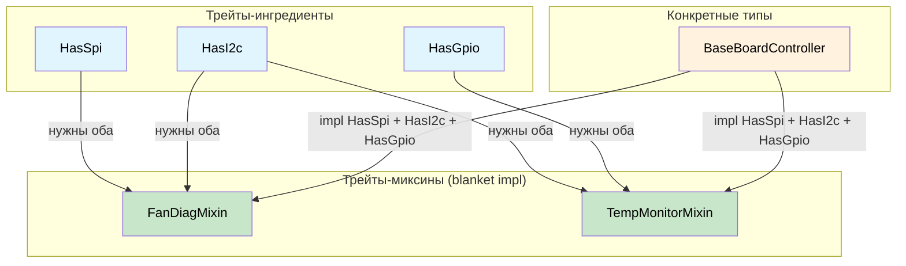

# Capability-миксины: контракты с аппаратурой на этапе компиляции 🟡

> **Что вы узнаете:** как трейты-ингредиенты (возможности шин) в сочетании с трейтами-миксинами и blanket impl устраняют дублирование диагностического кода и гарантируют на этапе компиляции, что каждая аппаратная зависимость выполнена.
>
> **Перекрёстные ссылки:** [гл. 04](ch04-capability-tokens-zero-cost-proof-of-aut.md) (capability-токены), [гл. 09](ch09-phantom-types-for-resource-tracking.md) (phantom-типы), [гл. 10](ch10-putting-it-all-together-a-complete-diagn.md) (интеграция)

## Проблема: дублирование диагностического кода

Серверные платформы используют общие диагностические паттерны в разных подсистемах. Диагностика вентиляторов, мониторинг температуры и последовательность подачи питания следуют похожим сценариям, но работают с разными аппаратными шинами. Без абстракций возникает copy-paste:

```c
// C — дублирующаяся логика в разных подсистемах
int run_fan_diag(spi_bus_t *spi, i2c_bus_t *i2c) {
    // ... 50 строк чтения датчика по SPI ...
    // ... 30 строк проверки регистров I2C ...
    // ... 20 строк сравнения с порогами (как в диагностике CPU) ...
}

int run_cpu_temp_diag(i2c_bus_t *i2c, gpio_t *gpio) {
    // ... 30 строк проверки регистров I2C (как в диагностике вентиляторов) ...
    // ... 15 строк проверки сигнала тревоги GPIO ...
    // ... 20 строк сравнения с порогами (как в диагностике вентиляторов) ...
}
```

Логика сравнения с порогами одинакова, но вынести её нельзя, потому что типы шин различаются. С capability-миксинами каждая аппаратная шина становится **трейтом-ингредиентом**, а диагностические поведения предоставляются автоматически, когда есть нужные ингредиенты.

## Трейты-ингредиенты (аппаратные возможности)

Каждая шина или периферийное устройство — это ассоциированный тип трейта. Диагностический контроллер объявляет, какие шины у него есть:

```rust,ignore
/// Возможность шины SPI.
pub trait HasSpi {
    type Spi: SpiBus;
    fn spi(&self) -> &Self::Spi;
}

/// Возможность шины I2C.
pub trait HasI2c {
    type I2c: I2cBus;
    fn i2c(&self) -> &Self::I2c;
}

/// Возможность доступа к пинам GPIO.
pub trait HasGpio {
    type Gpio: GpioController;
    fn gpio(&self) -> &Self::Gpio;
}

/// Возможность доступа к IPMI.
pub trait HasIpmi {
    type Ipmi: IpmiClient;
    fn ipmi(&self) -> &Self::Ipmi;
}

// Определения трейтов шин:
pub trait SpiBus {
    fn transfer(&self, data: &[u8]) -> Vec<u8>;
}

pub trait I2cBus {
    fn read_register(&self, addr: u8, reg: u8) -> u8;
    fn write_register(&self, addr: u8, reg: u8, value: u8);
}

pub trait GpioController {
    fn read_pin(&self, pin: u32) -> bool;
    fn set_pin(&self, pin: u32, value: bool);
}

pub trait IpmiClient {
    fn send_raw(&self, netfn: u8, cmd: u8, data: &[u8]) -> Vec<u8>;
}
```

## Трейты-миксины (диагностические поведения)

Миксин предоставляет поведение **автоматически** любому типу, у которого есть нужные возможности:

```rust,ignore
# pub trait SpiBus { fn transfer(&self, data: &[u8]) -> Vec<u8>; }
# pub trait I2cBus {
#     fn read_register(&self, addr: u8, reg: u8) -> u8;
#     fn write_register(&self, addr: u8, reg: u8, value: u8);
# }
# pub trait GpioController { fn read_pin(&self, pin: u32) -> bool; }
# pub trait IpmiClient { fn send_raw(&self, netfn: u8, cmd: u8, data: &[u8]) -> Vec<u8>; }
# pub trait HasSpi { type Spi: SpiBus; fn spi(&self) -> &Self::Spi; }
# pub trait HasI2c { type I2c: I2cBus; fn i2c(&self) -> &Self::I2c; }
# pub trait HasGpio { type Gpio: GpioController; fn gpio(&self) -> &Self::Gpio; }
# pub trait HasIpmi { type Ipmi: IpmiClient; fn ipmi(&self) -> &Self::Ipmi; }

/// Миксин диагностики вентиляторов — реализуется автоматически для любого типа с SPI + I2C.
pub trait FanDiagMixin: HasSpi + HasI2c {
    fn read_fan_speed(&self, fan_id: u8) -> u32 {
        // Считываем тахометр через SPI
        let cmd = [0x80 | fan_id, 0x00];
        let response = self.spi().transfer(&cmd);
        u32::from_be_bytes([0, 0, response[0], response[1]])
    }

    fn set_fan_pwm(&self, fan_id: u8, duty_percent: u8) {
        // Устанавливаем PWM через контроллер I2C
        self.i2c().write_register(0x2E, fan_id, duty_percent);
    }

    fn run_fan_diagnostic(&self) -> bool {
        // Полная диагностика: читаем все вентиляторы, проверяем пороги
        for fan_id in 0..6 {
            let speed = self.read_fan_speed(fan_id);
            if speed < 1000 || speed > 20000 {
                println!("Вентилятор {fan_id}: ОШИБКА ({speed} об/мин)");
                return false;
            }
        }
        true
    }
}

// Blanket-реализация — ЛЮБОЙ тип с SPI + I2C получает FanDiagMixin бесплатно
impl<T: HasSpi + HasI2c> FanDiagMixin for T {}

/// Миксин мониторинга температуры — требует I2C + GPIO.
pub trait TempMonitorMixin: HasI2c + HasGpio {
    fn read_temperature(&self, sensor_addr: u8) -> f64 {
        let raw = self.i2c().read_register(sensor_addr, 0x00);
        raw as f64 * 0.5  // 0.5°C на младший разряд (LSB)
    }

    fn check_thermal_alert(&self, alert_pin: u32) -> bool {
        self.gpio().read_pin(alert_pin)
    }

    fn run_thermal_diagnostic(&self) -> bool {
        for addr in [0x48, 0x49, 0x4A] {
            let temp = self.read_temperature(addr);
            if temp > 95.0 {
                println!("Датчик 0x{addr:02X}: КРИТИЧНО ({temp}°C)");
                return false;
            }
            if self.check_thermal_alert(addr as u32) {
                println!("Датчик 0x{addr:02X}: сработал сигнал ALERT");
                return false;
            }
        }
        true
    }
}

impl<T: HasI2c + HasGpio> TempMonitorMixin for T {}

/// Миксин последовательности подачи питания — требует I2C + IPMI.
pub trait PowerSeqMixin: HasI2c + HasIpmi {
    fn read_voltage_rail(&self, rail: u8) -> f64 {
        let raw = self.i2c().read_register(0x40, rail);
        raw as f64 * 0.01  // 10 мВ на младший разряд (LSB)
    }

    fn check_power_good(&self) -> bool {
        let resp = self.ipmi().send_raw(0x04, 0x2D, &[0x01]);
        !resp.is_empty() && resp[0] == 0x00
    }
}

impl<T: HasI2c + HasIpmi> PowerSeqMixin for T {}
```

## Конкретный контроллер: комбинирование

Конкретный диагностический контроллер объявляет свои возможности и **автоматически наследует** все подходящие миксины:

```rust,ignore
# pub trait SpiBus { fn transfer(&self, data: &[u8]) -> Vec<u8>; }
# pub trait I2cBus {
#     fn read_register(&self, addr: u8, reg: u8) -> u8;
#     fn write_register(&self, addr: u8, reg: u8, value: u8);
# }
# pub trait GpioController {
#     fn read_pin(&self, pin: u32) -> bool;
#     fn set_pin(&self, pin: u32, value: bool);
# }
# pub trait IpmiClient { fn send_raw(&self, netfn: u8, cmd: u8, data: &[u8]) -> Vec<u8>; }
# pub trait HasSpi { type Spi: SpiBus; fn spi(&self) -> &Self::Spi; }
# pub trait HasI2c { type I2c: I2cBus; fn i2c(&self) -> &Self::I2c; }
# pub trait HasGpio { type Gpio: GpioController; fn gpio(&self) -> &Self::Gpio; }
# pub trait HasIpmi { type Ipmi: IpmiClient; fn ipmi(&self) -> &Self::Ipmi; }
# pub trait FanDiagMixin: HasSpi + HasI2c {}
# impl<T: HasSpi + HasI2c> FanDiagMixin for T {}
# pub trait TempMonitorMixin: HasI2c + HasGpio {}
# impl<T: HasI2c + HasGpio> TempMonitorMixin for T {}
# pub trait PowerSeqMixin: HasI2c + HasIpmi {}
# impl<T: HasI2c + HasIpmi> PowerSeqMixin for T {}

// Конкретные реализации шин (заглушки для иллюстрации)
pub struct LinuxSpi { bus: u8 }
impl SpiBus for LinuxSpi {
    fn transfer(&self, data: &[u8]) -> Vec<u8> { vec![0; data.len()] }
}

pub struct LinuxI2c { bus: u8 }
impl I2cBus for LinuxI2c {
    fn read_register(&self, _addr: u8, _reg: u8) -> u8 { 42 }
    fn write_register(&self, _addr: u8, _reg: u8, _value: u8) {}
}

pub struct LinuxGpio;
impl GpioController for LinuxGpio {
    fn read_pin(&self, _pin: u32) -> bool { false }
    fn set_pin(&self, _pin: u32, _value: bool) {}
}

pub struct IpmiToolClient;
impl IpmiClient for IpmiToolClient {
    fn send_raw(&self, _netfn: u8, _cmd: u8, _data: &[u8]) -> Vec<u8> { vec![0x00] }
}

/// BaseBoardController имеет ВСЕ шины → получает ВСЕ миксины.
pub struct BaseBoardController {
    spi: LinuxSpi,
    i2c: LinuxI2c,
    gpio: LinuxGpio,
    ipmi: IpmiToolClient,
}

impl HasSpi for BaseBoardController {
    type Spi = LinuxSpi;
    fn spi(&self) -> &LinuxSpi { &self.spi }
}

impl HasI2c for BaseBoardController {
    type I2c = LinuxI2c;
    fn i2c(&self) -> &LinuxI2c { &self.i2c }
}

impl HasGpio for BaseBoardController {
    type Gpio = LinuxGpio;
    fn gpio(&self) -> &LinuxGpio { &self.gpio }
}

impl HasIpmi for BaseBoardController {
    type Ipmi = IpmiToolClient;
    fn ipmi(&self) -> &IpmiToolClient { &self.ipmi }
}

// BaseBoardController теперь автоматически имеет:
// - FanDiagMixin     (потому что у него есть HasSpi + HasI2c)
// - TempMonitorMixin (потому что у него есть HasI2c + HasGpio)
// - PowerSeqMixin    (потому что у него есть HasI2c + HasIpmi)
// Ручная реализация не нужна: blanket impl делает всё сам.
```

## Аспект корректности по построению

Паттерн миксинов корректен по построению, потому что:

1. **Нельзя вызвать `read_fan_speed()` без SPI**: метод существует только у типов, которые реализуют `HasSpi + HasI2c`
2. **Нельзя забыть шину**: если убрать `HasSpi` у `BaseBoardController`, методы `FanDiagMixin` исчезнут на этапе компиляции
3. **Тестирование с моками автоматическое**: замените `LinuxSpi` на `MockSpi`, и вся логика миксинов будет работать с моком
4. **Новые платформы просто объявляют возможности**: дочерняя плата GPU только с I2C получит `TempMonitorMixin` (если есть ещё и GPIO), но не `FanDiagMixin` (нет SPI)

### Когда использовать capability-миксины

| Сценарий | Использовать миксины? |
|----------|:------:|
| Сквозные диагностические поведения | ✅ Да: устраняют copy-paste |
| Контроллеры аппаратуры с несколькими шинами | ✅ Да: объявляете возможности, получаете поведения |
| Специализированные тестовые стенды для платформ | ✅ Да: мокайте возможности для тестов |
| Простые периферийные устройства с одной шиной | ⚠️ Накладные расходы могут не окупиться |
| Чистая бизнес-логика (без аппаратуры) | ❌ Простых паттернов достаточно |

## Архитектура трейтов-миксинов



## Упражнение: сетевые диагностические миксины

Спроектируйте систему миксинов для сетевой диагностики:
- Трейты-ингредиенты: `HasEthernet`, `HasIpmi`
- Миксин: `LinkHealthMixin` (требует `HasEthernet`) с методом `check_link_status(&self)`
- Миксин: `RemoteDiagMixin` (требует `HasEthernet + HasIpmi`) с методом `remote_health_check(&self)`
- Конкретный тип: `NicController`, который реализует оба ингредиента.

<details>
<summary>Решение</summary>

```rust,ignore
pub trait HasEthernet {
    fn eth_link_up(&self) -> bool;
}

pub trait HasIpmi {
    fn ipmi_ping(&self) -> bool;
}

pub trait LinkHealthMixin: HasEthernet {
    fn check_link_status(&self) -> &'static str {
        if self.eth_link_up() { "канал: UP" } else { "канал: DOWN" }
    }
}
impl<T: HasEthernet> LinkHealthMixin for T {}

pub trait RemoteDiagMixin: HasEthernet + HasIpmi {
    fn remote_health_check(&self) -> &'static str {
        if self.eth_link_up() && self.ipmi_ping() {
            "удалённо: HEALTHY"
        } else {
            "удалённо: DEGRADED"
        }
    }
}
impl<T: HasEthernet + HasIpmi> RemoteDiagMixin for T {}

pub struct NicController;
impl HasEthernet for NicController {
    fn eth_link_up(&self) -> bool { true }
}
impl HasIpmi for NicController {
    fn ipmi_ping(&self) -> bool { true }
}
// NicController автоматически получает оба метода миксинов
```

</details>

## Ключевые выводы

1. **Трейты-ингредиенты объявляют аппаратные возможности**: `HasSpi`, `HasI2c`, `HasGpio` — это трейты с ассоциированными типами.
2. **Трейты-миксины предоставляют поведение через blanket impl**: `impl<T: HasSpi + HasI2c> FanDiagMixin for T {}`.
3. **Новая платформа = перечисление её возможностей**: компилятор предоставляет все подходящие методы миксинов.
4. **Удаление шины = ошибки компиляции везде, где она используется**: нельзя забыть обновить нижележащий код.
5. **Тестирование с моками бесплатно**: замените `LinuxSpi` на `MockSpi`, и вся логика миксинов работает без изменений.

---
