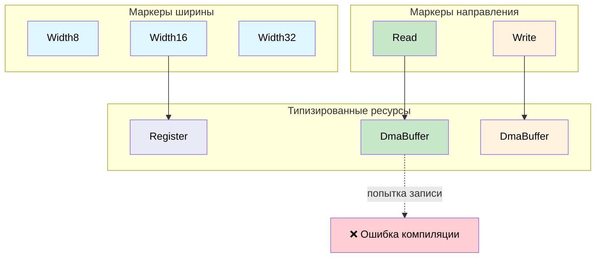

# Phantom-типы для отслеживания ресурсов 🟡

> **Что вы узнаете:** как маркеры `PhantomData` кодируют ширину регистра, направление DMA и состояние файлового дескриптора на уровне типов, предотвращая целый класс ошибок рассогласования ресурсов без накладных расходов во время выполнения.
>
> **Перекрёстные ссылки:** [гл. 05](ch05-protocol-state-machines-type-state-for-r.md) (typestate), [гл. 06](ch06-dimensional-analysis-making-the-compiler.md) (размерные типы), [гл. 08](ch08-capability-mixins-compile-time-hardware-.md) (миксины), [гл. 10](ch10-putting-it-all-together-a-complete-diagn.md) (интеграция)

## Проблема: путаница ресурсов

Аппаратные ресурсы в коде выглядят одинаково, но не взаимозаменяемы:

- 32-битный регистр и 16-битный регистр — оба «регистры»
- Буфер DMA для чтения и буфер DMA для записи оба выглядят как `*mut u8`
- Открытый файловый дескриптор и закрытый — оба `i32`

В C:

```c
// C — все регистры выглядят одинаково
uint32_t read_reg32(volatile void *base, uint32_t offset);
uint16_t read_reg16(volatile void *base, uint32_t offset);

// Ошибка: чтение 16-битного регистра 32-битной функцией
uint32_t status = read_reg32(pcie_bar, LINK_STATUS_REG);  // должен быть reg16!
```

## Параметры phantom-типов

**Phantom-тип** — это параметр типа, который присутствует в определении структуры, но не появляется ни в одном поле. Он существует исключительно для того, чтобы нести информацию на уровне типов:

```rust,ignore
use std::marker::PhantomData;

// Маркеры ширины регистра — нулевого размера
pub struct Width8;
pub struct Width16;
pub struct Width32;
pub struct Width64;

/// Дескриптор регистра, параметризованный его шириной.
/// PhantomData<W> не занимает места: это маркер только для этапа компиляции.
pub struct Register<W> {
    base: usize,
    offset: usize,
    _width: PhantomData<W>,
}

impl Register<Width8> {
    pub fn read(&self) -> u8 {
        // ... читаем 1 байт из base + offset ...
        0 // заглушка
    }
    pub fn write(&self, _value: u8) {
        // ... пишем 1 байт ...
    }
}

impl Register<Width16> {
    pub fn read(&self) -> u16 {
        // ... читаем 2 байта из base + offset ...
        0 // заглушка
    }
    pub fn write(&self, _value: u16) {
        // ... пишем 2 байта ...
    }
}

impl Register<Width32> {
    pub fn read(&self) -> u32 {
        // ... читаем 4 байта из base + offset ...
        0 // заглушка
    }
    pub fn write(&self, _value: u32) {
        // ... пишем 4 байта ...
    }
}

/// Определения регистров конфигурационного пространства PCIe.
pub struct PcieConfig {
    base: usize,
}

impl PcieConfig {
    pub fn vendor_id(&self) -> Register<Width16> {
        Register { base: self.base, offset: 0x00, _width: PhantomData }
    }

    pub fn device_id(&self) -> Register<Width16> {
        Register { base: self.base, offset: 0x02, _width: PhantomData }
    }

    pub fn command(&self) -> Register<Width16> {
        Register { base: self.base, offset: 0x04, _width: PhantomData }
    }

    pub fn status(&self) -> Register<Width16> {
        Register { base: self.base, offset: 0x06, _width: PhantomData }
    }

    pub fn bar0(&self) -> Register<Width32> {
        Register { base: self.base, offset: 0x10, _width: PhantomData }
    }
}

fn pcie_example() {
    let cfg = PcieConfig { base: 0xFE00_0000 };

    let vid: u16 = cfg.vendor_id().read();    // возвращает u16 ✅
    let bar: u32 = cfg.bar0().read();         // возвращает u32 ✅

    // Нельзя перепутать:
    // let bad: u32 = cfg.vendor_id().read(); // ❌ ОШИБКА: expected u16
    // cfg.bar0().write(0u16);                // ❌ ОШИБКА: expected u32
}
```

## Контроль доступа к буферам DMA

У буферов DMA есть направление: одни предназначены для передачи **от устройства к хосту** (чтение), другие — для передачи **от хоста к устройству** (запись). Использование неверного направления портит данные или вызывает ошибки шины:

```rust,ignore
use std::marker::PhantomData;

// Маркеры направления
pub struct ToDevice;     // хост пишет, устройство читает
pub struct FromDevice;   // устройство пишет, хост читает

/// Буфер DMA с контролем направления.
pub struct DmaBuffer<Dir> {
    ptr: *mut u8,
    len: usize,
    dma_addr: u64,  // физический адрес для устройства
    _dir: PhantomData<Dir>,
}

impl DmaBuffer<ToDevice> {
    /// Заполняет буфер данными для отправки устройству.
    pub fn write_data(&mut self, data: &[u8]) {
        assert!(data.len() <= self.len);
        // SAFETY: ptr действителен для self.len байт (выделен при создании),
        // а data.len() <= self.len (проверено assert выше).
        unsafe { std::ptr::copy_nonoverlapping(data.as_ptr(), self.ptr, data.len()) }
    }

    /// Получает адрес DMA, из которого устройство будет читать.
    pub fn device_addr(&self) -> u64 {
        self.dma_addr
    }
}

impl DmaBuffer<FromDevice> {
    /// Читает данные, которые устройство записало в буфер.
    pub fn read_data(&self) -> &[u8] {
        // SAFETY: ptr действителен для self.len байт, а устройство уже закончило
        // запись (вызывающий гарантирует, что DMA-передача завершена).
        unsafe { std::slice::from_raw_parts(self.ptr, self.len) }
    }

    /// Получает адрес DMA, в который устройство будет писать.
    pub fn device_addr(&self) -> u64 {
        self.dma_addr
    }
}

// Нельзя писать в буфер FromDevice:
// fn oops(buf: &mut DmaBuffer<FromDevice>) {
//     buf.write_data(&[1, 2, 3]);  // ❌ нет метода `write_data` у DmaBuffer<FromDevice>
// }

// Нельзя читать из буфера ToDevice:
// fn oops2(buf: &DmaBuffer<ToDevice>) {
//     let data = buf.read_data();  // ❌ нет метода `read_data` у DmaBuffer<ToDevice>
// }
```

## Владение файловым дескриптором

Распространённая ошибка: использование файлового дескриптора после его закрытия. Phantom-типы могут отслеживать состояние «открыт/закрыт»:

```rust,ignore
use std::marker::PhantomData;

pub struct Open;
pub struct Closed;

/// Файловый дескриптор с отслеживанием состояния.
pub struct Fd<State> {
    raw: i32,
    _state: PhantomData<State>,
}

impl Fd<Open> {
    pub fn open(path: &str) -> Result<Self, String> {
        // ... открываем файл ...
        Ok(Fd { raw: 3, _state: PhantomData }) // заглушка
    }

    pub fn read(&self, buf: &mut [u8]) -> Result<usize, String> {
        // ... читаем из fd ...
        Ok(0) // заглушка
    }

    pub fn write(&self, data: &[u8]) -> Result<usize, String> {
        // ... пишем в fd ...
        Ok(data.len()) // заглушка
    }

    /// Закрывает fd — возвращает дескриптор в состоянии Closed.
    /// Дескриптор Open потребляется, что исключает использование после закрытия.
    pub fn close(self) -> Fd<Closed> {
        // ... закрываем fd ...
        Fd { raw: self.raw, _state: PhantomData }
    }
}

impl Fd<Closed> {
    // Нет методов read() и write(): у Fd<Closed> их просто нет.
    // Поэтому использование после закрытия — ошибка компиляции.

    pub fn raw_fd(&self) -> i32 {
        self.raw
    }
}

fn fd_example() -> Result<(), String> {
    let fd = Fd::open("/dev/ipmi0")?;
    let mut buf = [0u8; 256];
    fd.read(&mut buf)?;

    let closed = fd.close();

    // closed.read(&mut buf)?;  // ❌ нет метода `read` у Fd<Closed>
    // closed.write(&[1])?;     // ❌ нет метода `write` у Fd<Closed>

    Ok(())
}
```

## Комбинирование phantom-типов с предыдущими паттернами

Phantom-типы сочетаются со всем, что мы уже видели:

```rust,ignore
# use std::marker::PhantomData;
# pub struct Width32;
# pub struct Width16;
# pub struct Register<W> { _w: PhantomData<W> }
# impl Register<Width16> { pub fn read(&self) -> u16 { 0 } }
# impl Register<Width32> { pub fn read(&self) -> u32 { 0 } }
# #[derive(Debug, Clone, Copy, PartialEq, PartialOrd)]
# pub struct Celsius(pub f64);

/// Комбинирует phantom-типы (ширина регистра) с размерными типами (Celsius).
fn read_temp_sensor(reg: &Register<Width16>) -> Celsius {
    let raw = reg.read();  // тип u16 гарантирован phantom-типом
    Celsius(raw as f64 * 0.0625)  // тип Celsius гарантирован возвращаемым типом
}

// Компилятор обеспечивает:
// 1. Регистр 16-битный (phantom-тип)
// 2. Результат — Celsius (newtype)
// Оба — без накладных расходов во время выполнения.
```

### Когда использовать phantom-типы

| Сценарий | Использовать phantom-параметр? |
|----------|:------:|
| Кодирование ширины регистра | ✅ Всегда: предотвращает несоответствие ширины |
| Направление буфера DMA | ✅ Всегда: предотвращает порчу данных |
| Состояние файлового дескриптора | ✅ Всегда: предотвращает использование после закрытия |
| Права доступа к области памяти (R/W/X) | ✅ Всегда: обеспечивает контроль доступа |
| Обобщённые контейнеры (Vec, HashMap) | ❌ Нет: используйте конкретные параметры типа |
| Атрибуты, меняющиеся во время выполнения | ❌ Нет: phantom-типы существуют только на этапе компиляции |

## Матрица ресурсов с phantom-типами



## Упражнение: права доступа к области памяти

Спроектируйте phantom-типы для областей памяти с правами чтения, записи и выполнения:
- `MemRegion<ReadOnly>` имеет `fn read(&self, offset: usize) -> u8`
- `MemRegion<ReadWrite>` имеет и `read`, и `write`
- `MemRegion<Executable>` имеет `read` и `fn execute(&self)`
- Запись в `ReadOnly` или выполнение `ReadWrite` не должны компилироваться.

<details>
<summary>Решение</summary>

```rust,ignore
use std::marker::PhantomData;

pub struct ReadOnly;
pub struct ReadWrite;
pub struct Executable;

pub struct MemRegion<Perm> {
    base: *mut u8,
    len: usize,
    _perm: PhantomData<Perm>,
}

// Чтение доступно для всех типов прав
impl<P> MemRegion<P> {
    pub fn read(&self, offset: usize) -> u8 {
        assert!(offset < self.len);
        // SAFETY: offset < self.len (проверено assert выше), base действителен для len байт.
        unsafe { *self.base.add(offset) }
    }
}

impl MemRegion<ReadWrite> {
    pub fn write(&mut self, offset: usize, val: u8) {
        assert!(offset < self.len);
        // SAFETY: offset < self.len (проверено assert выше), base действителен для len байт,
        // а &mut self гарантирует эксклюзивный доступ.
        unsafe { *self.base.add(offset) = val; }
    }
}

impl MemRegion<Executable> {
    pub fn execute(&self) {
        // Переход по базовому адресу (концептуально)
    }
}

// ❌ region_ro.write(0, 0xFF);  // Ошибка компиляции: нет метода `write`
// ❌ region_rw.execute();       // Ошибка компиляции: нет метода `execute`
```

</details>

## Ключевые выводы

1. **PhantomData несёт информацию о типе при нулевом размере**: маркер существует только для компилятора.
2. **Несоответствие ширины регистра становится ошибкой компиляции**: `Register<Width16>` возвращает `u16`, а не `u32`.
3. **Направление DMA обеспечивается структурно**: у `DmaBuffer<Read>` нет метода `write()`.
4. **Сочетайте с размерными типами (гл. 06)**: `Register<Width16>` может возвращать `Celsius` через шаг разбора.
5. **Phantom-типы работают только на этапе компиляции**: они не подходят для атрибутов, которые меняются во время выполнения; для них используйте enum.

---
