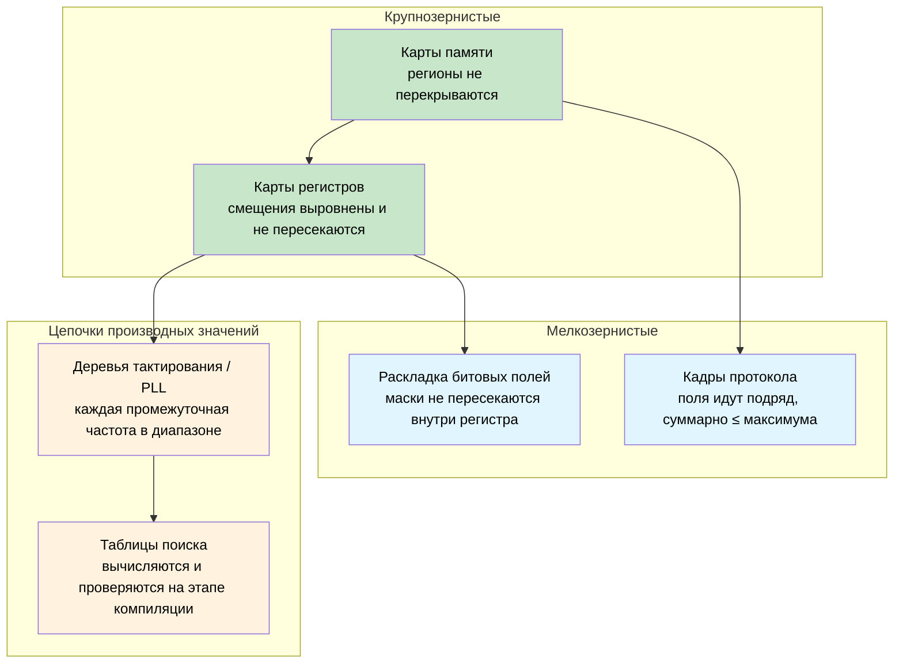
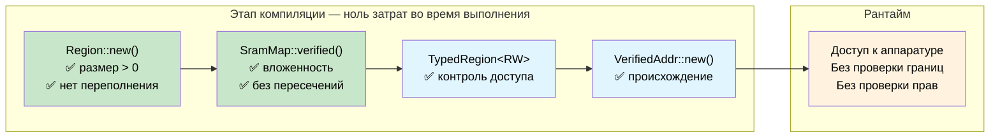

# Const fn: доказательства корректности на этапе компиляции 🟠

> **Что вы узнаете:** как `const fn` и `assert!` превращают компилятор в движок доказательств: проверка карт памяти SRAM, раскладки регистров, кадров протокола, масок битовых полей, деревьев тактирования и таблиц поиска на этапе компиляции, без затрат во время выполнения.
>
> **Перекрёстные ссылки:** [гл. 04](ch04-capability-tokens-zero-cost-proof-of-aut.md) (capability-токены), [гл. 06](ch06-dimensional-analysis-making-the-compiler.md) (анализ размерностей), [гл. 09](ch09-phantom-types-for-resource-tracking.md) (phantom-типы)

## Проблема: карты памяти, которые лгут

Во встраиваемом и системном программировании карты памяти лежат в основе всего: они определяют, где находятся загрузчик, прошивка, секции данных и стеки. Ошибся с границей, и две подсистемы тихо портят друг друга. В C такие карты обычно задаются `#define`-константами без структурной связи:

```c
/* Раскладка SRAM STM32F4: 256 KB по адресу 0x20000000 */
#define SRAM_BASE       0x20000000
#define SRAM_SIZE       (256 * 1024)

#define BOOT_BASE       0x20000000
#define BOOT_SIZE       (16 * 1024)

#define FW_BASE         0x20004000
#define FW_SIZE         (128 * 1024)

#define DATA_BASE       0x20024000
#define DATA_SIZE       (80 * 1024)     /* Кто-то поднял это значение с 64K до 80K */

#define STACK_BASE      0x20038000
#define STACK_SIZE      (48 * 1024)     /* 0x20038000 + 48K = 0x20044000 — за концом SRAM! */
```

Ошибка: `16 + 128 + 80 + 48 = 272 KB`, а SRAM — всего 256 KB. Стек выходит за конец физической памяти на 16 KB. Ни предупреждения компилятора, ни ошибки линкера, ни проверки во время выполнения: только тихое повреждение, когда стек растёт в незанятое адресное пространство.

**Каждый режим отказа обнаруживается только после развёртывания**: возможно, как загадочный сбой, который случается лишь при интенсивном использовании стека, через недели после того, как изменили размер секции данных.

## Const fn: превращаем компилятор в движок доказательств

Функции `const fn` в Rust могут выполняться на этапе компиляции. Если `const fn` паникует во время такого вычисления, panic становится **ошибкой компиляции**. В сочетании с `assert!` это превращает компилятор в доказатель теорем для ваших инвариантов:

```rust
pub const fn checked_add(a: u32, b: u32) -> u32 {
    let sum = a as u64 + b as u64;
    assert!(sum <= u32::MAX as u64, "переполнение");
    sum as u32
}

// ✅ Компилируется: 100 + 200 помещается в u32
const X: u32 = checked_add(100, 200);

// ❌ Ошибка компиляции: "переполнение"
// const Y: u32 = checked_add(u32::MAX, 1);

fn main() {
    println!("{X}");
}
```

> **Ключевая идея:** `const fn` + `assert!` = обязательство доказательства. Каждое утверждение — теорема, которую компилятор должен проверить. Если доказательство не сходится, программа не компилируется. Не нужен набор тестов, и код-ревью не нужно: сам компилятор выступает аудитором.

## Построение проверенной карты памяти SRAM

### Тип Region

`Region` представляет непрерывный блок памяти. Его конструктор — `const fn`, который обеспечивает базовую корректность:

```rust
#[derive(Debug, Clone, Copy)]
pub struct Region {
    pub base: u32,
    pub size: u32,
}

impl Region {
    /// Создаёт регион. Паникует на этапе компиляции, если инварианты нарушены.
    pub const fn new(base: u32, size: u32) -> Self {
        assert!(size > 0, "размер региона должен быть ненулевым");
        assert!(
            base as u64 + size as u64 <= u32::MAX as u64,
            "регион выходит за пределы 32-битного адресного пространства"
        );
        Self { base, size }
    }

    pub const fn end(&self) -> u32 {
        self.base + self.size
    }

    /// Истина, если `inner` целиком помещается внутри `self`.
    pub const fn contains(&self, inner: &Region) -> bool {
        inner.base >= self.base && inner.end() <= self.end()
    }

    /// Истина, если два региона имеют общие адреса.
    pub const fn overlaps(&self, other: &Region) -> bool {
        self.base < other.end() && other.base < self.end()
    }

    /// Истина, если `addr` попадает в этот регион.
    pub const fn contains_addr(&self, addr: u32) -> bool {
        addr >= self.base && addr < self.end()
    }
}

// Регион рождается корректным: некорректный создать нельзя
const R: Region = Region::new(0x2000_0000, 1024);

fn main() {
    println!("Регион: {:#010X}..{:#010X}", R.base, R.end());
}
```

### Проверенная карта памяти

Теперь объединяем регионы в полную карту SRAM. Конструктор доказывает шесть инвариантов непересечения и четыре инварианта вложенности, всё на этапе компиляции:

```rust
# #[derive(Debug, Clone, Copy)]
# pub struct Region { pub base: u32, pub size: u32 }
# impl Region {
#     pub const fn new(base: u32, size: u32) -> Self {
#         assert!(size > 0, "размер региона должен быть ненулевым");
#         assert!(base as u64 + size as u64 <= u32::MAX as u64, "переполнение");
#         Self { base, size }
#     }
#     pub const fn end(&self) -> u32 { self.base + self.size }
#     pub const fn contains(&self, inner: &Region) -> bool {
#         inner.base >= self.base && inner.end() <= self.end()
#     }
#     pub const fn overlaps(&self, other: &Region) -> bool {
#         self.base < other.end() && other.base < self.end()
#     }
# }
pub struct SramMap {
    pub total:      Region,
    pub bootloader: Region,
    pub firmware:   Region,
    pub data:       Region,
    pub stack:      Region,
}

impl SramMap {
    pub const fn verified(
        total: Region,
        bootloader: Region,
        firmware: Region,
        data: Region,
        stack: Region,
    ) -> Self {
        // ── Вложенность: каждый подрегион помещается в общий объём SRAM ──
        assert!(total.contains(&bootloader), "загрузчик выходит за пределы SRAM");
        assert!(total.contains(&firmware),   "прошивка выходит за пределы SRAM");
        assert!(total.contains(&data),       "секция данных выходит за пределы SRAM");
        assert!(total.contains(&stack),      "стек выходит за пределы SRAM");

        // ── Непересечение: никакие два подрегиона не делят адрес ──
        assert!(!bootloader.overlaps(&firmware), "загрузчик/прошивка пересекаются");
        assert!(!bootloader.overlaps(&data),     "загрузчик/данные пересекаются");
        assert!(!bootloader.overlaps(&stack),    "загрузчик/стек пересекаются");
        assert!(!firmware.overlaps(&data),       "прошивка/данные пересекаются");
        assert!(!firmware.overlaps(&stack),      "прошивка/стек пересекаются");
        assert!(!data.overlaps(&stack),          "данные/стек пересекаются");

        Self { total, bootloader, firmware, data, stack }
    }
}

// ✅ Все 10 инвариантов проверены на этапе компиляции — ноль затрат во время выполнения
const SRAM: SramMap = SramMap::verified(
    Region::new(0x2000_0000, 256 * 1024),   // 256 KB всего SRAM
    Region::new(0x2000_0000,  16 * 1024),   // загрузчик: 16 KB
    Region::new(0x2000_4000, 128 * 1024),   // прошивка: 128 KB
    Region::new(0x2002_4000,  64 * 1024),   // данные: 64 KB
    Region::new(0x2003_4000,  48 * 1024),   // стек: 48 KB
);

fn main() {
    println!("SRAM:       {:#010X} — {} KB", SRAM.total.base, SRAM.total.size / 1024);
    println!("Загрузчик:  {:#010X} — {} KB", SRAM.bootloader.base, SRAM.bootloader.size / 1024);
    println!("Прошивка:   {:#010X} — {} KB", SRAM.firmware.base, SRAM.firmware.size / 1024);
    println!("Данные:     {:#010X} — {} KB", SRAM.data.base, SRAM.data.size / 1024);
    println!("Стек:       {:#010X} — {} KB", SRAM.stack.base, SRAM.stack.size / 1024);
}
```

Десять проверок на этапе компиляции, ноль инструкций во время выполнения. Бинарный файл содержит только проверенные константы.

### Нарушаем карту

Допустим, кто-то увеличил секцию данных с 64 KB до 80 KB, ничего больше не меняя:

```rust,ignore
// ❌ Не компилируется
const BAD_SRAM: SramMap = SramMap::verified(
    Region::new(0x2000_0000, 256 * 1024),
    Region::new(0x2000_0000,  16 * 1024),
    Region::new(0x2000_4000, 128 * 1024),
    Region::new(0x2002_4000,  80 * 1024),   // 80 KB: на 16 KB больше, чем нужно
    Region::new(0x2003_8000,  48 * 1024),   // стек сдвинут за конец SRAM
);
```

Компилятор выдаёт:

```text
error[E0080]: evaluation of constant value failed
  --> src/main.rs:38:9
   |
38 |         assert!(total.contains(&stack), "стек выходит за пределы SRAM");
   |         ^^^^^^^^^^^^^^^^^^^^^^^^^^^^^^^^^^^^^^^^^^^^^^^^^^^^^^^^^^^^^^^
   |         the evaluated program panicked at 'стек выходит за пределы SRAM'
```

> **Ошибка, которая стала бы загадочным сбоем в полевых условиях, теперь — ошибка компиляции.** Не нужен модульный тест и код-ревью: компилятор доказывает, что такого не может быть. Сравните с C, где та же ошибка тихо попала бы в продукт и через месяцы проявилась бы как повреждение стека в полевых условиях.

## Контроль доступа с phantom-типами

Объедините проверку `const fn` с phantom-типами прав доступа ([гл. 09](ch09-phantom-types-for-resource-tracking.md)), чтобы обеспечивать ограничения чтения и записи на уровне типов:

```rust
use std::marker::PhantomData;

pub struct ReadOnly;
pub struct ReadWrite;

pub struct TypedRegion<Access> {
    base: u32,
    size: u32,
    _access: PhantomData<Access>,
}

impl<A> TypedRegion<A> {
    pub const fn new(base: u32, size: u32) -> Self {
        assert!(size > 0, "размер региона должен быть ненулевым");
        Self { base, size, _access: PhantomData }
    }
}

// Чтение доступно для любого уровня доступа
fn read_word<A>(region: &TypedRegion<A>, offset: u32) -> u32 {
    assert!(offset + 4 <= region.size, "чтение за пределами");
    // В реальной прошивке: unsafe { core::ptr::read_volatile((region.base + offset) as *const u32) }
    0 // заглушка
}

// Запись требует ReadWrite: сигнатура функции это обеспечивает
fn write_word(region: &TypedRegion<ReadWrite>, offset: u32, value: u32) {
    assert!(offset + 4 <= region.size, "запись за пределами");
    // В реальной прошивке: unsafe { core::ptr::write_volatile(...) }
    let _ = value; // заглушка
}

const BOOTLOADER: TypedRegion<ReadOnly>  = TypedRegion::new(0x2000_0000, 16 * 1024);
const DATA:       TypedRegion<ReadWrite> = TypedRegion::new(0x2002_4000, 64 * 1024);

fn main() {
    read_word(&BOOTLOADER, 0);      // ✅ чтение из региона только для чтения
    read_word(&DATA, 0);            // ✅ чтение из региона чтения-записи
    write_word(&DATA, 0, 42);       // ✅ запись в регион чтения-записи
    // write_word(&BOOTLOADER, 0, 42); // ❌ Ошибка компиляции: ожидается ReadWrite, найден ReadOnly
}
```

Регион загрузчика физически доступен для записи (это SRAM), но система типов предотвращает случайную запись. Именно это различие между **аппаратной возможностью** и **программным разрешением** и означает корректность по построению.

## Происхождение указателя: доказываем, что адреса принадлежат регионам

Двигаясь дальше, можно создавать проверенные адреса: значения, которые статически доказаны как лежащие внутри конкретного региона:

```rust
# #[derive(Debug, Clone, Copy)]
# pub struct Region { pub base: u32, pub size: u32 }
# impl Region {
#     pub const fn new(base: u32, size: u32) -> Self {
#         assert!(size > 0);
#         assert!(base as u64 + size as u64 <= u32::MAX as u64);
#         Self { base, size }
#     }
#     pub const fn end(&self) -> u32 { self.base + self.size }
#     pub const fn contains_addr(&self, addr: u32) -> bool {
#         addr >= self.base && addr < self.end()
#     }
# }
/// Адрес, доказанно лежащий внутри Region на этапе компиляции.
pub struct VerifiedAddr {
    addr: u32, // приватное: создаётся только через проверяющий конструктор
}

impl VerifiedAddr {
    /// Паникует на этапе компиляции, если `addr` вне `region`.
    pub const fn new(region: &Region, addr: u32) -> Self {
        assert!(region.contains_addr(addr), "адрес вне региона");
        Self { addr }
    }

    pub const fn raw(&self) -> u32 {
        self.addr
    }
}

const DATA: Region = Region::new(0x2002_4000, 64 * 1024);

// ✅ Доказано на этапе компиляции, что адрес внутри региона данных
const STATUS_WORD: VerifiedAddr = VerifiedAddr::new(&DATA, 0x2002_4000);
const CONFIG_WORD: VerifiedAddr = VerifiedAddr::new(&DATA, 0x2002_5000);

// ❌ Не скомпилируется: адрес лежит в регионе загрузчика, а не данных
// const BAD_ADDR: VerifiedAddr = VerifiedAddr::new(&DATA, 0x2000_0000);

fn main() {
    println!("Регистр статуса по адресу {:#010X}", STATUS_WORD.raw());
    println!("Регистр конфигурации по адресу {:#010X}", CONFIG_WORD.raw());
}
```

**Происхождение доказано на этапе компиляции**: при доступе к этим адресам не нужна проверка границ во время выполнения. Конструктор приватный, поэтому `VerifiedAddr` может существовать только тогда, когда компилятор доказал его корректность.

## За пределами карт памяти

Паттерн доказательства с `const fn` применим везде, где есть **известные на этапе компиляции значения со структурными инвариантами**. Карта SRAM выше доказала свойства *между регионами* (вложенность, непересечение). Та же техника масштабируется на всё более мелкие области:



Каждый подраздел ниже следует одному шаблону: определяется тип с конструктором `const fn`, который кодирует инварианты, а затем используется `const _: () = { ... }` или `const`-привязка для запуска проверки.

### Карты регистров

Блоки аппаратных регистров имеют фиксированные смещения и ширины. Смещённое или перекрывающееся определение регистра всегда является ошибкой:

```rust
#[derive(Debug, Clone, Copy)]
pub struct Register {
    pub offset: u32,
    pub width: u32,
}

impl Register {
    pub const fn new(offset: u32, width: u32) -> Self {
        assert!(
            width == 1 || width == 2 || width == 4,
            "ширина регистра должна быть 1, 2 или 4 байта"
        );
        assert!(offset % width == 0, "регистр должен быть естественно выровнен");
        Self { offset, width }
    }

    pub const fn end(&self) -> u32 {
        self.offset + self.width
    }
}

const fn disjoint(a: &Register, b: &Register) -> bool {
    a.end() <= b.offset || b.end() <= a.offset
}

// Регистры периферии UART
const DATA:   Register = Register::new(0x00, 4);
const STATUS: Register = Register::new(0x04, 4);
const CTRL:   Register = Register::new(0x08, 4);
const BAUD:   Register = Register::new(0x0C, 4);

// Доказательство на этапе компиляции: ни один регистр не перекрывает другой
const _: () = {
    assert!(disjoint(&DATA,   &STATUS));
    assert!(disjoint(&DATA,   &CTRL));
    assert!(disjoint(&DATA,   &BAUD));
    assert!(disjoint(&STATUS, &CTRL));
    assert!(disjoint(&STATUS, &BAUD));
    assert!(disjoint(&CTRL,   &BAUD));
};

fn main() {
    println!("UART DATA:   offset={:#04X}, width={}", DATA.offset, DATA.width);
    println!("UART STATUS: offset={:#04X}, width={}", STATUS.offset, STATUS.width);
}
```

Обратите внимание на идиому `const _: () = { ... };`: безымянная константа, единственная цель которой — выполнить утверждения на этапе компиляции. Если хотя бы одно утверждение не выполняется, константа не может быть вычислена, и компиляция останавливается.

#### Мини-упражнение: банк регистров SPI

Дан набор регистров SPI-контроллера. Добавьте `const fn`-утверждения, которые доказывают:
1. Каждый регистр естественно выровнен (offset % width == 0)
2. Никакие два регистра не перекрываются
3. Все регистры помещаются в блок регистров размером 64 байта

<details>
<summary>Подсказка</summary>

Используйте повторно `Register` и `disjoint` из примера с UART выше. Определите три-четыре `const Register` (например, `CTRL` со смещением 0x00 и шириной 4, `STATUS` со смещением 0x04 и шириной 4, `TX_DATA` со смещением 0x08 и шириной 1, `RX_DATA` со смещением 0x0C и шириной 1) и проверьте три свойства.

</details>

### Раскладка кадров протокола

Кадры сетевых или шинных протоколов содержат поля по определённым смещениям. Метод `then()` делает непрерывность структурной: промежутки и перекрытия невозможны по построению:

```rust
#[derive(Debug, Clone, Copy)]
pub struct Field {
    pub offset: usize,
    pub size: usize,
}

impl Field {
    pub const fn new(offset: usize, size: usize) -> Self {
        assert!(size > 0, "размер поля должен быть ненулевым");
        Self { offset, size }
    }

    pub const fn end(&self) -> usize {
        self.offset + self.size
    }

    /// Создаёт следующее поле сразу после этого.
    pub const fn then(&self, size: usize) -> Field {
        Field::new(self.end(), size)
    }
}

const MAX_FRAME: usize = 256;

const HEADER:  Field = Field::new(0, 4);
const SEQ_NUM: Field = HEADER.then(2);
const PAYLOAD: Field = SEQ_NUM.then(246);
const CRC:     Field = PAYLOAD.then(4);

// Доказательство на этапе компиляции: кадр помещается в максимальный размер
const _: () = assert!(CRC.end() <= MAX_FRAME, "кадр превышает максимальный размер");

fn main() {
    println!("Заголовок:       [{}..{})", HEADER.offset, HEADER.end());
    println!("Номер:           [{}..{})", SEQ_NUM.offset, SEQ_NUM.end());
    println!("Полезные данные: [{}..{})", PAYLOAD.offset, PAYLOAD.end());
    println!("CRC:             [{}..{})", CRC.offset, CRC.end());
    println!("Итого:           {}/{} байт", CRC.end(), MAX_FRAME);
}
```

Поля идут непрерывно по построению: каждое начинается ровно там, где заканчивается предыдущее. Последнее утверждение доказывает, что кадр помещается в максимальный размер протокола.

### Встроенные const-блоки для проверки обобщений

Начиная с Rust 1.79, блоки `const { ... }` позволяют проверять параметры const-обобщений в месте использования. Это идеально для ограничений размера DMA-буферов и требований к выравниванию:

```rust,ignore
fn dma_transfer<const N: usize>(buf: &[u8; N]) {
    const { assert!(N % 4 == 0, "размер DMA-буфера должен быть кратен 4 байтам") };
    const { assert!(N <= 65536, "DMA-передача превышает максимальный размер") };
    // ... запускаем передачу ...
}

dma_transfer(&[0u8; 1024]);   // ✅ 1024 делится на 4 и ≤ 65536
// dma_transfer(&[0u8; 1023]); // ❌ Ошибка компиляции: не выровнено по 4 байтам
```

Утверждения вычисляются при мономорфизации функции: каждый вызов с другим `N` получает собственную проверку на этапе компиляции.

### Раскладка битовых полей внутри регистра

Карты регистров доказывают, что регистры не *перекрываются друг с другом*. Но что насчёт **битов внутри одного регистра**? Управляющие регистры упаковывают несколько полей в одно слово. Если два поля занимают один и тот же бит, операции чтения и записи тихо портят друг друга. В C это обычно ловят (или не ловят) вручную, проверяя константы масок.

`const fn` может доказать, что пара маска/сдвиг каждого поля не пересекается с парами всех остальных полей того же регистра:

```rust
#[derive(Debug, Clone, Copy)]
pub struct BitField {
    pub mask: u32,
    pub shift: u8,
}

impl BitField {
    pub const fn new(shift: u8, width: u8) -> Self {
        assert!(width > 0, "ширина битового поля должна быть ненулевой");
        assert!(shift as u32 + width as u32 <= 32, "битовое поле выходит за пределы 32-битного регистра");
        // Строим маску: `width` единиц, начиная с бита `shift`
        let mask = ((1u64 << width as u64) - 1) as u32;
        Self { mask: mask << shift as u32, shift }
    }

    pub const fn positioned_mask(&self) -> u32 {
        self.mask
    }

    pub const fn encode(&self, value: u32) -> u32 {
        assert!(value & !( self.mask >> self.shift as u32 ) == 0, "значение превышает ширину поля");
        value << self.shift as u32
    }
}

const fn fields_disjoint(a: &BitField, b: &BitField) -> bool {
    a.positioned_mask() & b.positioned_mask() == 0
}

// Поля управляющего регистра SPI: enable[0], mode[1:2], clock_div[4:7], irq_en[8]
const SPI_EN:     BitField = BitField::new(0, 1);   // бит 0
const SPI_MODE:   BitField = BitField::new(1, 2);   // биты 1–2
const SPI_CLKDIV: BitField = BitField::new(4, 4);   // биты 4–7
const SPI_IRQ:    BitField = BitField::new(8, 1);   // бит 8

// Доказательство на этапе компиляции: ни одно поле не занимает общий бит
const _: () = {
    assert!(fields_disjoint(&SPI_EN,   &SPI_MODE));
    assert!(fields_disjoint(&SPI_EN,   &SPI_CLKDIV));
    assert!(fields_disjoint(&SPI_EN,   &SPI_IRQ));
    assert!(fields_disjoint(&SPI_MODE, &SPI_CLKDIV));
    assert!(fields_disjoint(&SPI_MODE, &SPI_IRQ));
    assert!(fields_disjoint(&SPI_CLKDIV, &SPI_IRQ));
};

fn main() {
    let ctrl = SPI_EN.encode(1)
             | SPI_MODE.encode(0b10)
             | SPI_CLKDIV.encode(0b0110)
             | SPI_IRQ.encode(1);
    println!("SPI_CTRL = {:#010b} ({:#06X})", ctrl, ctrl);
}
```

Это дополняет паттерн карты регистров выше: карты регистров доказывают непересечение *между регистрами*, а раскладка битовых полей доказывает непересечение *внутри регистра*. Вместе они обеспечивают полное покрытие от блока регистров до отдельных битов.

### Конфигурация дерева тактирования / PLL

Микроконтроллеры получают тактовые частоты периферии через цепочки умножителей и делителей. PLL выдаёт `f_vco = f_in × N / M`, и частота VCO должна оставаться в диапазоне, заданном аппаратурой. Ошибка в любом параметре для конкретной платы, и чип выдаёт некорректные тактовые сигналы или не может захватить частоту. Эти ограничения идеально подходят для `const fn`:

```rust
#[derive(Debug, Clone, Copy)]
pub struct PllConfig {
    pub input_khz: u32,     // внешний генератор
    pub m: u32,             // входной делитель
    pub n: u32,             // множитель VCO
    pub p: u32,             // делитель системной частоты
}

impl PllConfig {
    pub const fn verified(input_khz: u32, m: u32, n: u32, p: u32) -> Self {
        // Входной делитель даёт частоту на входе PLL
        let pll_input = input_khz / m;
        assert!(pll_input >= 1_000 && pll_input <= 2_000,
            "вход PLL должен быть 1–2 МГц");

        // Частота VCO должна быть в пределах аппаратных ограничений
        let vco = pll_input as u64 * n as u64;
        assert!(vco >= 192_000 && vco <= 432_000,
            "VCO должен быть в диапазоне 192–432 МГц");

        // Делитель системной частоты должен быть чётным (аппаратное ограничение)
        assert!(p == 2 || p == 4 || p == 6 || p == 8,
            "P должен быть 2, 4, 6 или 8");

        // Итоговая системная частота
        let sysclk = vco / p as u64;
        assert!(sysclk <= 168_000,
            "системная частота превышает максимум 168 МГц");

        Self { input_khz, m, n, p }
    }

    pub const fn vco_khz(&self) -> u32 {
        (self.input_khz / self.m) * self.n
    }

    pub const fn sysclk_khz(&self) -> u32 {
        self.vco_khz() / self.p
    }
}

// STM32F4 с кварцем HSE 8 МГц → системная частота 168 МГц
const PLL: PllConfig = PllConfig::verified(8_000, 8, 336, 2);

// ❌ Не скомпилируется: VCO = 480 МГц превышает предел 432 МГц
// const BAD: PllConfig = PllConfig::verified(8_000, 8, 480, 2);

fn main() {
    println!("VCO:    {} МГц", PLL.vco_khz() / 1_000);
    println!("SYSCLK: {} МГц", PLL.sysclk_khz() / 1_000);
}
```

Раскомментирование константы `BAD` даёт ошибку на этапе компиляции, которая точно указывает на нарушенное ограничение:

```text
error[E0080]: evaluation of constant value failed
  --> src/main.rs:18:9
   |
18 |         assert!(vco >= 192_000 && vco <= 432_000,
   |         ^^^^^^^^^^^^^^^^^^^^^^^^^^^^^^^^^^^^^^^^^
   |         the evaluated program panicked at 'VCO должен быть в диапазоне 192–432 МГц'
```

Компилятор ловит нарушение ограничения в *середине* цепочки вычислений, а не в конце. Если бы вместо этого было нарушено ограничение системной частоты (`sysclk > 168 МГц`), сообщение об ошибке указывало бы на другое утверждение.

> **Цепочки ограничений производных значений превращают один `const fn` в многоступенчатое доказательство.** У каждого промежуточного значения свой диапазон, заданный аппаратурой. Изменение одного параметра (например, переход на кварц 25 МГц) сразу выявляет любое нарушение ниже по цепочке.

**Цепочки ограничений производных значений:** частота VCO зависит от `input / m × n`, а системная частота зависит от `vco / p`. У каждого промежуточного значения свой диапазон, заданный аппаратурой. Один `const fn` проверяет всю цепочку, поэтому изменение одного параметра (например, переход на кварц 25 МГц) сразу выявляет любое нарушение ниже по цепочке.

### Таблицы поиска на этапе компиляции

`const fn` может вычислить целые таблицы поиска на этапе компиляции и поместить их в `.rodata` без затрат на инициализацию при запуске. Это особенно полезно для таблиц CRC, тригонометрии, таблиц кодирования и кодов коррекции ошибок, то есть везде, где обычно использовали бы build-скрипт или генерацию кода:

```rust
const fn crc32_table() -> [u32; 256] {
    let mut table = [0u32; 256];
    let mut i: usize = 0;
    while i < 256 {
        let mut crc = i as u32;
        let mut j = 0;
        while j < 8 {
            if crc & 1 != 0 {
                crc = (crc >> 1) ^ 0xEDB8_8320; // стандартный полином CRC-32
            } else {
                crc >>= 1;
            }
            j += 1;
        }
        table[i] = crc;
        i += 1;
    }
    table
}

/// Полная таблица CRC-32: вычисляется на этапе компиляции и размещается в .rodata
const CRC32_TABLE: [u32; 256] = crc32_table();

/// Вычисляет CRC-32 для среза байтов во время выполнения, используя готовую таблицу.
fn crc32(data: &[u8]) -> u32 {
    let mut crc: u32 = !0;
    for &byte in data {
        let index = ((crc ^ byte as u32) & 0xFF) as usize;
        crc = (crc >> 8) ^ CRC32_TABLE[index];
    }
    !crc
}

// Проверка: известный CRC-32 для «123456789»
const _: () = {
    // Проверяем отдельные элементы таблицы на этапе компиляции
    assert!(CRC32_TABLE[0] == 0x0000_0000);
    assert!(CRC32_TABLE[1] == 0x7707_3096);
};

fn main() {
    let check = crc32(b"123456789");
    // Известный CRC-32 для «123456789» — 0xCBF43926
    assert_eq!(check, 0xCBF4_3926);
    println!("CRC-32 для '123456789' = {:#010X} ✓", check);
    println!("Размер таблицы: {} элементов × 4 байта = {} байт в .rodata",
        CRC32_TABLE.len(), CRC32_TABLE.len() * 4);
}
```

Функция `crc32_table()` выполняется целиком во время компиляции. Полученная таблица размером 1 KB записывается в секцию read-only данных бинарного файла: ни аллокатора, ни кода инициализации, ни затрат на запуск. Сравните с подходом C, где таблицу либо генерирует отдельный инструмент, либо вычисляют при запуске. Версия на Rust доказуемо корректна (утверждения `const _` проверяют известные значения) и доказуемо полна (компилятор отвергнет программу, если функция не сможет построить корректную таблицу).

## Когда использовать доказательства на основе const fn

| Сценарий | Рекомендация |
|----------|:------------:|
| Карты памяти, смещения регистров, таблицы разделов | ✅ Всегда |
| Раскладка кадров протокола с фиксированными полями | ✅ Всегда |
| Битовые маски внутри регистра | ✅ Всегда |
| Дерево тактирования / параметры PLL | ✅ Всегда |
| Таблицы поиска (CRC, тригонометрия, кодирование) | ✅ Всегда: ноль затрат на запуск |
| Константы с перекрёстными инвариантами (непересечение, сумма ≤ границы) | ✅ Всегда |
| Значения конфигурации с ограничениями предметной области | ✅ Когда значения известны на этапе компиляции |
| Значения, вычисленные из пользовательского ввода или файлов | ❌ Используйте проверку во время выполнения |
| Сильно динамические структуры (деревья, графы) | ❌ Используйте property-based тестирование |
| Проверка диапазона одного значения | ⚠️ Лучше newtype + `From` ([гл. 07](ch07-validated-boundaries-parse-dont-validate.md)) |

### Сводка стоимости

| Что | Стоимость во время выполнения |
|-----|:------------------------------:|
| Утверждения `const fn` (`assert!`, `panic!`) | Только время компиляции: 0 инструкций |
| Блоки проверки `const _: () = { ... }` | Только время компиляции: не попадают в бинарник |
| Структуры `Region`, `Register`, `Field` | Обычные данные: та же раскладка, что у голых целых |
| Встроенная проверка обобщений `const { }` | Мономорфизируется на этапе компиляции: 0 затрат |
| Таблицы поиска (`crc32_table()`) | Вычисляются на этапе компиляции: размещаются в `.rodata` |
| Маркеры доступа с phantom-типами (`TypedRegion<RW>`) | Нулевой размер: оптимизируются |

В каждой строке **ноль затрат во время выполнения**: доказательства существуют только во время компиляции. Итоговый бинарный файл содержит только проверенные константы и таблицы поиска, без кода проверки утверждений.

## Упражнение: карта разделов флеш-памяти

Спроектируйте проверенную карту разделов для NOR-флеш-памяти 1 MB, начинающейся с адреса `0x0800_0000`. Требования:

1. Четыре раздела: **загрузчик** (64 KB), **приложение** (640 KB), **конфигурация** (64 KB), **промежуточный буфер OTA** (256 KB)
2. Каждый раздел должен быть **выровнен по 4 KB** (гранулярность стирания флеш-памяти): и базовый адрес, и размер должны быть кратны 4096
3. Ни один раздел не может пересекаться с другим
4. Все разделы должны помещаться во флеш-памяти
5. Добавьте `const fn total_used()`, которая возвращает сумму размеров всех разделов, и утверждение, что она равна 1 MB

<details>
<summary>Пример решения</summary>

```rust
#[derive(Debug, Clone, Copy)]
pub struct FlashRegion {
    pub base: u32,
    pub size: u32,
}

impl FlashRegion {
    pub const fn new(base: u32, size: u32) -> Self {
        assert!(size > 0, "размер раздела должен быть ненулевым");
        assert!(base % 4096 == 0, "базовый адрес раздела должен быть выровнен по 4 KB");
        assert!(size % 4096 == 0, "размер раздела должен быть выровнен по 4 KB");
        assert!(
            base as u64 + size as u64 <= u32::MAX as u64,
            "раздел выходит за пределы адресного пространства"
        );
        Self { base, size }
    }

    pub const fn end(&self) -> u32 { self.base + self.size }

    pub const fn contains(&self, inner: &FlashRegion) -> bool {
        inner.base >= self.base && inner.end() <= self.end()
    }

    pub const fn overlaps(&self, other: &FlashRegion) -> bool {
        self.base < other.end() && other.base < self.end()
    }
}

pub struct FlashMap {
    pub total:  FlashRegion,
    pub boot:   FlashRegion,
    pub app:    FlashRegion,
    pub config: FlashRegion,
    pub ota:    FlashRegion,
}

impl FlashMap {
    pub const fn verified(
        total: FlashRegion,
        boot: FlashRegion,
        app: FlashRegion,
        config: FlashRegion,
        ota: FlashRegion,
    ) -> Self {
        assert!(total.contains(&boot),   "загрузчик выходит за пределы флеш-памяти");
        assert!(total.contains(&app),    "приложение выходит за пределы флеш-памяти");
        assert!(total.contains(&config), "конфигурация выходит за пределы флеш-памяти");
        assert!(total.contains(&ota),    "промежуточный буфер OTA выходит за пределы флеш-памяти");

        assert!(!boot.overlaps(&app),    "загрузчик/приложение пересекаются");
        assert!(!boot.overlaps(&config), "загрузчик/конфигурация пересекаются");
        assert!(!boot.overlaps(&ota),    "загрузчик/OTA пересекаются");
        assert!(!app.overlaps(&config),  "приложение/конфигурация пересекаются");
        assert!(!app.overlaps(&ota),     "приложение/OTA пересекаются");
        assert!(!config.overlaps(&ota),  "конфигурация/OTA пересекаются");

        Self { total, boot, app, config, ota }
    }

    pub const fn total_used(&self) -> u32 {
        self.boot.size + self.app.size + self.config.size + self.ota.size
    }
}

const FLASH: FlashMap = FlashMap::verified(
    FlashRegion::new(0x0800_0000, 1024 * 1024),  // всего 1 MB
    FlashRegion::new(0x0800_0000,   64 * 1024),   // загрузчик: 64 KB
    FlashRegion::new(0x0801_0000,  640 * 1024),   // приложение: 640 KB
    FlashRegion::new(0x080B_0000,   64 * 1024),   // конфигурация: 64 KB
    FlashRegion::new(0x080C_0000,  256 * 1024),   // промежуточный буфер OTA: 256 KB
);

// Каждый байт флеш-памяти учтён
const _: () = assert!(
    FLASH.total_used() == 1024 * 1024,
    "разделы должны точно заполнять флеш-память"
);

fn main() {
    println!("Карта флеш-памяти: {} KB используется / {} KB всего",
        FLASH.total_used() / 1024,
        FLASH.total.size / 1024);
}
```

</details>



## Ключевые выводы

1. **`const fn` + `assert!` = обязательство доказательства на этапе компиляции**: если утверждение не выполняется при вычислении константы, программа не компилируется. Не нужен тест и не нужен код-ревью: компилятор доказывает это сам.

2. **Карты памяти — идеальные кандидаты**: вложенность подрегионов, непересечение, ограничения общего объёма и выравнивания выражаются утверждениями `const fn`. Подход с `#define` в C не даёт ни одной из этих гарантий.

3. **Phantom-типы добавляются сверху**: сочетайте const fn (проверку значений) с phantom-маркерами доступа (проверку прав), чтобы получить защиту в глубину без затрат во время выполнения.

4. **Происхождение можно установить на этапе компиляции**: `VerifiedAddr` доказывает на этапе компиляции, что адрес принадлежит конкретному региону, устраняя проверки границ во время выполнения при каждом обращении.

5. **Паттерн обобщается за пределы памяти**: карты регистров, маски битовых полей, кадры протокола, деревья тактирования, параметры DMA. Всюду, где есть известные на этапе компиляции значения со структурными инвариантами.

6. **Битовые поля и деревья тактирования — идеальные кандидаты**: непересечение битов внутри регистра и цепочки ограничений производных значений (диапазон VCO, пределы делителей) — ровно то, что `const fn` доказывает без усилий.

7. **`const fn` заменяет генераторы кода и build-скрипты для таблиц поиска**: таблицы CRC, тригонометрия, таблицы кодирования вычисляются на этапе компиляции, размещаются в `.rodata` и не требуют затрат на запуск или внешних инструментов.

8. **Встроенные блоки `const { }` проверяют параметры обобщений**: начиная с Rust 1.79, можно накладывать ограничения на const-обобщения прямо в месте вызова и ловить неправильное использование до запуска любого кода.
