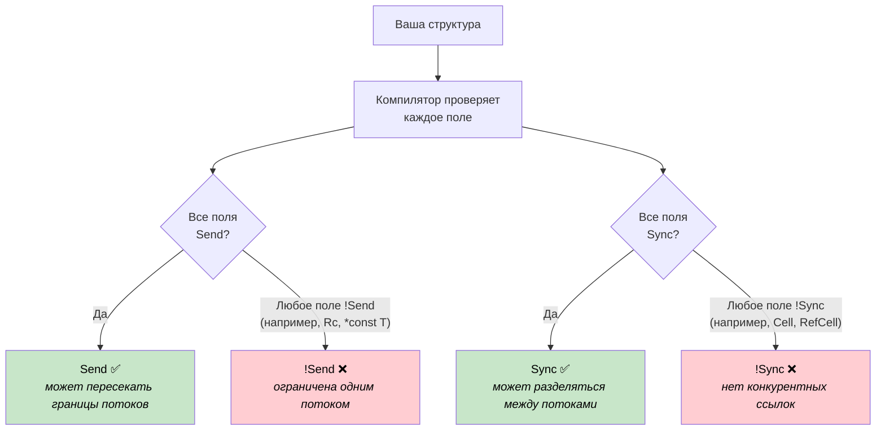
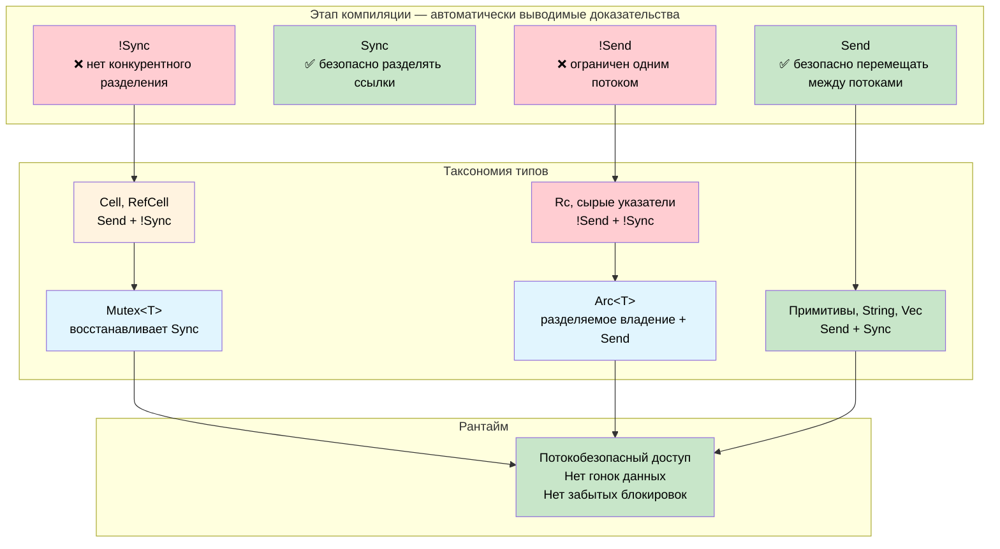

# Send и Sync: доказательства корректности конкурентности на этапе компиляции 🟠

> **Что вы узнаете:** как автоматические трейты `Send` и `Sync` превращают компилятор в аудитора конкурентности: на этапе компиляции доказывается, какие типы могут переходить между потоками и какие можно разделять, без затрат во время выполнения.
>
> **Перекрёстные ссылки:** [гл. 04](ch04-capability-tokens-zero-cost-proof-of-aut.md) (capability-токены), [гл. 09](ch09-phantom-types-for-resource-tracking.md) (phantom-типы), [гл. 15](ch15-const-fn-compile-time-correctness-proofs.md) (доказательства через const fn)

## Проблема: конкурентный доступ без страховочной сетки

В системном программировании периферия, общие буферы и глобальное состояние используются из нескольких контекстов: главного цикла, обработчиков прерываний, колбэков DMA и рабочих потоков. В C компилятор никак этого не контролирует:

```c
/* Общий буфер датчика: доступ из главного цикла и из ISR */
volatile uint32_t sensor_buf[64];
volatile uint32_t buf_index = 0;

void SENSOR_IRQHandler(void) {
    sensor_buf[buf_index++] = read_sensor();  /* Гонка: чтение и запись buf_index */
}

void process_sensors(void) {
    for (uint32_t i = 0; i < buf_index; i++) {  /* buf_index меняется посреди цикла */
        process(sensor_buf[i]);                   /* данные перезаписаны во время чтения */
    }
    buf_index = 0;                                /* ISR срабатывает между этими строками */
}
```

Ключевое слово `volatile` не даёт компилятору оптимизировать чтения, но **ничего не делает** с гонками данных. Два контекста могут одновременно читать и писать `buf_index`, давая рваные значения, потерянные обновления или переполнение буфера. Та же проблема возникает и с `pthread_mutex_t`: компилятор спокойно позволит забыть взять блокировку:

```c
pthread_mutex_t lock;
int shared_counter;

void increment(void) {
    shared_counter++;  /* Упс: забыли pthread_mutex_lock(&lock) */
}
```

**Каждая ошибка конкурентности обнаруживается во время выполнения**, обычно под нагрузкой, в продакшене и с перебоями.

## Что доказывают Send и Sync

Rust определяет два маркерных трейта, которые компилятор выводит автоматически:

| Трейт | Доказывает | Неформальный смысл |
|-------|-----------|--------------------|
| `Send` | Значение типа `T` можно безопасно **переместить** в другой поток | «Это может пересекать границу потока» |
| `Sync` | **Разделяемую ссылку** `&T` можно безопасно использовать из нескольких потоков | «Это можно читать из нескольких потоков» |

Это **авто-трейты**: компилятор выводит их, проверяя каждое поле. Структура является `Send`, если все её поля `Send`. Структура является `Sync`, если все её поля `Sync`. Если хотя бы одно поле отказывается от трейта, отказывается вся структура. Аннотация не нужна, накладных расходов во время выполнения нет: доказательство структурное.



> **Компилятор — это аудитор.** В C аннотации потокобезопасности живут в комментариях и документации к заголовочным файлам: это рекомендации, которые никто не проверяет. В Rust `Send` и `Sync` выводятся из структуры самого типа. Добавление одного поля `Cell<f32>` автоматически делает содержащую структуру `!Sync`. Никаких действий программиста не требуется, и забыть невозможно.

Два трейта связаны ключевым тождеством:

> **`T` является `Sync` тогда и только тогда, когда `&T` является `Send`.**

Это интуитивно понятно: если разделяемую ссылку можно безопасно отправить в другой поток, то лежащий в её основе тип безопасен для конкурентного чтения.

### Типы, которые отказываются от трейтов

Некоторые типы намеренно являются `!Send` или `!Sync`:

| Тип | Send | Sync | Почему |
|-----|:----:|:----:|--------|
| `u32`, `String`, `Vec<T>` | ✅ | ✅ | Нет внутренней изменяемости и сырых указателей |
| `Cell<T>`, `RefCell<T>` | ✅ | ❌ | Внутренняя изменяемость без синхронизации |
| `Rc<T>` | ❌ | ❌ | Счётчик ссылок не атомарный |
| `*const T`, `*mut T` | ❌ | ❌ | У сырых указателей нет гарантий безопасности |
| `Arc<T>` (где `T: Send + Sync`) | ✅ | ✅ | Атомарный счётчик ссылок |
| `Mutex<T>` (где `T: Send`) | ✅ | ✅ | Блокировка сериализует весь доступ |

Каждая ❌ в этой таблице — **инвариант времени компиляции**. Случайно отправить `Rc` в другой поток нельзя: компилятор это отвергнет.

## Дескрипторы периферии, которые не являются Send

Во встраиваемых системах блок регистров периферии находится по фиксированному адресу памяти и должен использоваться только из одного контекста выполнения. Сырые указатели по своей природе `!Send` и `!Sync`, поэтому обёртка над ними автоматически лишает содержащий тип обоих трейтов:

```rust
/// Дескриптор периферийного UART, отображённого в память.
/// Сырой указатель делает его автоматически !Send и !Sync.
pub struct Uart {
    regs: *const u32,
}

impl Uart {
    pub fn new(base: usize) -> Self {
        Self { regs: base as *const u32 }
    }

    pub fn write_byte(&self, byte: u8) {
        // В реальной прошивке: unsafe { write_volatile(self.regs.add(DATA_OFFSET), byte as u32) }
        println!("UART TX: {:#04X}", byte);
    }
}

fn main() {
    let uart = Uart::new(0x4000_1000);
    uart.write_byte(b'A');  // ✅ Использование в потоке, который его создал

    // ❌ Не скомпилируется: Uart — !Send
    // std::thread::spawn(move || {
    //     uart.write_byte(b'B');
    // });
}
```

Закомментированный `thread::spawn` дал бы:

```text
error[E0277]: `*const u32` cannot be sent between threads safely
   |
   |     std::thread::spawn(move || {
   |     ^^^^^^^^^^^^^^^^^^ within `Uart`, the trait `Send` is not
   |                        implemented for `*const u32`
```

**Нет сырого указателя? Используйте `PhantomData`.** Иногда у типа нет сырого указателя, но его всё равно нужно ограничить одним потоком, например индекс файлового дескриптора или дескриптор, полученный из библиотеки на C:

```rust
use std::marker::PhantomData;

/// Непрозрачный дескриптор из библиотеки на C. PhantomData<*const ()> делает его
/// !Send + !Sync, хотя внутренний fd — это просто целое число.
pub struct LibHandle {
    fd: i32,
    _not_send: PhantomData<*const ()>,
}

impl LibHandle {
    pub fn open(path: &str) -> Self {
        let _ = path;
        Self { fd: 42, _not_send: PhantomData }
    }

    pub fn fd(&self) -> i32 { self.fd }
}

fn main() {
    let handle = LibHandle::open("/dev/sensor0");
    println!("fd = {}", handle.fd());

    // ❌ Не скомпилируется: LibHandle — !Send
    // std::thread::spawn(move || { let _ = handle.fd(); });
}
```

Это аналог на этапе компиляции той строки из документации C: «прочитайте, что этот дескриптор не потокобезопасен». В Rust это проверяет компилятор.

## Mutex превращает !Sync в Sync

`Cell<T>` и `RefCell<T>` дают внутреннюю изменяемость без какой-либо синхронизации, поэтому они `!Sync`. Но иногда действительно нужно разделять изменяемое состояние между потоками. `Mutex<T>` добавляет недостающую синхронизацию, и компилятор это учитывает:

> **Если `T: Send`, то `Mutex<T>: Send + Sync`.**

Блокировка сериализует весь доступ, поэтому внутренний `!Sync`-тип становится безопасным для разделения. Компилятор доказывает это структурно: никакой проверки во время выполнения «не забыл ли программист взять блокировку» не нужно:

```rust
use std::sync::{Arc, Mutex};
use std::cell::Cell;

/// Кэш показаний датчика с Cell для внутренней изменяемости.
/// Cell<u32> — !Sync: напрямую разделять между потоками его нельзя.
struct SensorCache {
    last_reading: Cell<u32>,
    reading_count: Cell<u32>,
}

fn main() {
    // Mutex делает SensorCache безопасным для разделения: компилятор это доказывает
    let cache = Arc::new(Mutex::new(SensorCache {
        last_reading: Cell::new(0),
        reading_count: Cell::new(0),
    }));

    let handles: Vec<_> = (0..4).map(|i| {
        let c = Arc::clone(&cache);
        std::thread::spawn(move || {
            let guard = c.lock().unwrap();  // Перед доступом обязательно блокируем
            guard.last_reading.set(i * 10);
            guard.reading_count.set(guard.reading_count.get() + 1);
        })
    }).collect();

    for h in handles { h.join().unwrap(); }

    let guard = cache.lock().unwrap();
    println!("Последнее показание: {}", guard.last_reading.get());
    println!("Всего чтений:        {}", guard.reading_count.get());
}
```

Сравните с версией на C: `pthread_mutex_lock` — это вызов во время выполнения, который программист может забыть. Здесь система типов делает невозможным доступ к `SensorCache` в обход `Mutex`. Доказательство структурное, а единственная затрата во время выполнения — сама блокировка.

> **`Mutex` не просто синхронизирует, а доказывает синхронизацию.** `Mutex::lock()` возвращает `MutexGuard`, который разыменовывается в `&T`. Получить ссылку на внутренние данные в обход блокировки невозможно. API делает «забыл взять блокировку» структурно невыразимым.

## Ограничения функций как теоремы

`std::thread::spawn` имеет такую сигнатуру:

```rust,ignore
pub fn spawn<F, T>(f: F) -> JoinHandle<T>
where
    F: FnOnce() -> T + Send + 'static,
    T: Send + 'static,
```

Ограничение `Send + 'static` — не деталь реализации, а **теорема**:

> «Любое замыкание и возвращаемое значение, переданные в `spawn`, доказано на этапе компиляции безопасными для запуска в другом потоке, без висячих ссылок.»

Тот же паттерн можно применить к собственным API:

```rust
use std::sync::mpsc;

/// Выполняет задачу в фоновом потоке и возвращает её результат.
/// Ограничения доказывают: замыкание и его результат потокобезопасны.
fn run_on_background<F, T>(task: F) -> T
where
    F: FnOnce() -> T + Send + 'static,
    T: Send + 'static,
{
    let (tx, rx) = mpsc::channel();
    std::thread::spawn(move || {
        let _ = tx.send(task());
    });
    rx.recv().expect("фоновая задача завершилась паникой")
}

fn main() {
    // ✅ u32 — Send, замыкание не захватывает ничего не-Send
    let result = run_on_background(|| 6 * 7);
    println!("Результат: {result}");

    // ✅ String — Send
    let greeting = run_on_background(|| String::from("привет из фонового потока"));
    println!("{greeting}");

    // ❌ Не скомпилируется: Rc — !Send
    // use std::rc::Rc;
    // let data = Rc::new(42);
    // run_on_background(move || *data);
}
```

Раскомментирование примера с `Rc` даёт точную диагностику:

```text
error[E0277]: `Rc<i32>` cannot be sent between threads safely
   --> src/main.rs
    |
    |     run_on_background(move || *data);
    |     ^^^^^^^^^^^^^^^^^^ `Rc<i32>` cannot be sent between threads safely
    |
note: required by a bound in `run_on_background`
    |
    |     F: FnOnce() -> T + Send + 'static,
    |                        ^^^^ required by this bound
```

Компилятор возвращает нарушение к точному ограничению и сообщает программисту, *почему* это нарушение. Сравните с `pthread_create` из C:

```c
int pthread_create(pthread_t *thread, const pthread_attr_t *attr,
                   void *(*start_routine)(void *), void *arg);
```

`void *arg` принимает что угодно: потокобезопасное или нет. Компилятор C не может отличить неатомарный счётчик ссылок от обычного целого. Ограничения трейтов в Rust проводят это различие на уровне типов.

## Когда использовать доказательства Send/Sync

| Сценарий | Подход |
|----------|--------|
| Дескриптор периферии с сырым указателем | Автоматически `!Send + !Sync`: ничего делать не нужно |
| Дескриптор из библиотеки на C (целочисленный fd/handle) | Добавить `PhantomData<*const ()>` для `!Send + !Sync` |
| Общая конфигурация за блокировкой | `Arc<Mutex<T>>`: компилятор доказывает безопасность доступа |
| Передача сообщений между потоками | `mpsc::channel`: ограничение `Send` применяется автоматически |
| API планировщика задач или пула потоков | Требовать `F: Send + 'static` в сигнатуре |
| Однопоточный ресурс (например, контекст GPU) | `PhantomData<*const ()>`, чтобы предотвратить разделение |
| Тип должен быть `Send`, но содержит сырой указатель | `unsafe impl Send` с задокументированным обоснованием безопасности |

### Сводка стоимости

| Что | Стоимость во время выполнения |
|-----|:-----------------------------:|
| Автоматический вывод `Send` / `Sync` | Только время компиляции: 0 байт |
| Поле `PhantomData<*const ()>` | Нулевой размер: оптимизируется |
| Проверка `!Send` / `!Sync` | Только время компиляции: без проверок во время выполнения |
| Ограничения функций `F: Send + 'static` | Мономорфизируются: статическая диспетчеризация, без боксинга |
| Блокировка `Mutex<T>` | Блокировка во время выполнения (неизбежна для разделяемых изменений) |
| Подсчёт ссылок `Arc<T>` | Атомарные инкременты и декременты (неизбежны для разделяемого владения) |

Первые четыре строки имеют **нулевую стоимость**: они существуют только в системе типов и исчезают после компиляции. `Mutex` и `Arc` несут неизбежные затраты во время выполнения, но эти затраты — *минимум*, который должна платить любая корректная конкурентная программа. Rust лишь следит за тем, чтобы вы их заплатили.

## Упражнение: защита DMA-передачи

Спроектируйте `DmaTransfer<T>`, который удерживает буфер, пока выполняется DMA-передача. Требования:

1. `DmaTransfer` должен быть `!Send`: контроллер DMA использует физические адреса, привязанные к шине памяти этого ядра
2. `DmaTransfer` должен быть `!Sync`: одновременное чтение во время записи DMA увидит рваные данные
3. Предоставьте метод `wait()`, который **потребляет** защиту и возвращает буфер: владение доказывает, что передача завершена
4. Тип буфера `T` должен реализовывать маркерный трейт `DmaSafe`

<details>
<summary>Пример решения</summary>

```rust
use std::marker::PhantomData;

/// Маркерный трейт для типов, которые можно использовать как DMA-буферы.
/// В реальной прошивке: тип должен быть repr(C) без паддинга.
trait DmaSafe {}

impl DmaSafe for [u8; 64] {}
impl DmaSafe for [u8; 256] {}

/// Защита, представляющая DMA-передачу в процессе выполнения.
/// !Send + !Sync: её нельзя передать в другой поток или разделить.
pub struct DmaTransfer<T: DmaSafe> {
    buffer: T,
    channel: u8,
    _no_send_sync: PhantomData<*const ()>,
}

impl<T: DmaSafe> DmaTransfer<T> {
    /// Запускает DMA-передачу. Буфер потребляется: никто другой до него не дотронется.
    pub fn start(buffer: T, channel: u8) -> Self {
        // В реальной прошивке: настроить канал DMA, задать источник/приёмник, запустить передачу
        println!("Канал DMA {} запущен", channel);
        Self {
            buffer,
            channel,
            _no_send_sync: PhantomData,
        }
    }

    /// Ждёт завершения передачи и возвращает буфер.
    /// Потребляет self: после этого защиты больше не существует.
    pub fn wait(self) -> T {
        // В реальной прошивке: опрашивать регистр статуса DMA до завершения
        println!("Канал DMA {} завершён", self.channel);
        self.buffer
    }
}

fn main() {
    let buf = [0u8; 64];

    // Запуск передачи: buf перемещается в защиту
    let transfer = DmaTransfer::start(buf, 2);

    // ❌ buf больше недоступен: владение не даёт использовать его во время DMA
    // println!("{:?}", buf);

    // ❌ Не скомпилируется: DmaTransfer — !Send
    // std::thread::spawn(move || { transfer.wait(); });

    // ✅ Ждём в исходном потоке и получаем буфер обратно
    let buf = transfer.wait();
    println!("Буфер возвращён: {} байт", buf.len());
}
```

</details>



## Ключевые выводы

1. **`Send` и `Sync` — это доказательства времени компиляции о безопасности конкурентности**: компилятор выводит их структурно, проверяя каждое поле. Ни аннотаций, ни накладных расходов во время выполнения, ни явного согласия не нужно.

2. **Сырые указатели автоматически отказываются от трейтов**: любой тип, содержащий `*const T` или `*mut T`, становится `!Send + !Sync`. Поэтому дескрипторы периферии естественно ограничены одним потоком.

3. **`PhantomData<*const ()>` — явный отказ**: когда у типа нет сырого указателя, но его всё равно нужно ограничить одним потоком (дескрипторы библиотек на C, контексты GPU), задачу решает phantom-поле.

4. **`Mutex<T>` восстанавливает `Sync` с доказательством**: компилятор структурно доказывает, что весь доступ проходит через блокировку. В отличие от `pthread_mutex_t` из C, забыть взять блокировку невозможно.

5. **Ограничения функций — это теоремы**: `F: Send + 'static` в сигнатуре планировщика — обязательство доказательства на этапе компиляции: каждый вызов должен доказать, что его замыкание потокобезопасно. Сравните с `void *arg` в C, который принимает что угодно.

6. **Паттерн дополняет все остальные техники корректности**: typestate доказывает порядок протокола, phantom-типы доказывают права доступа, `const fn` доказывает инварианты значений, а `Send`/`Sync` доказывают безопасность конкурентности. Вместе они покрывают всю поверхность корректности.
