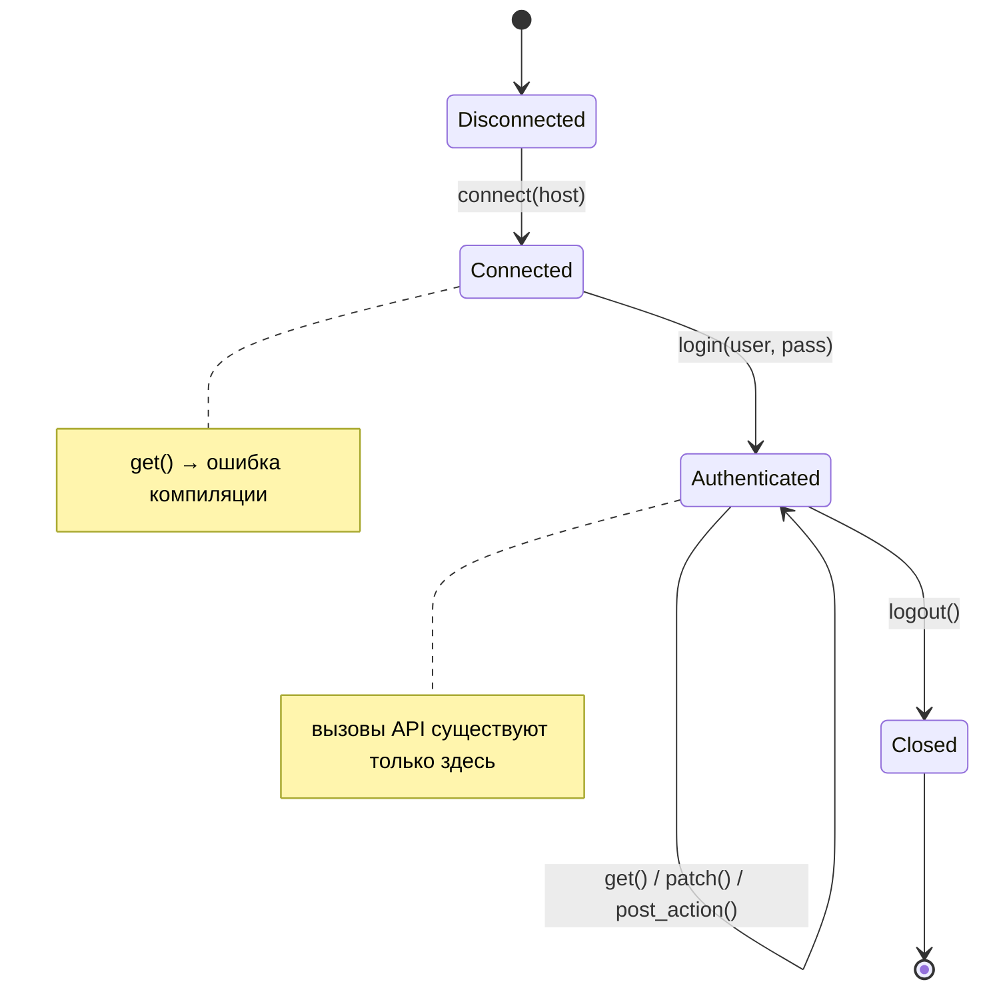
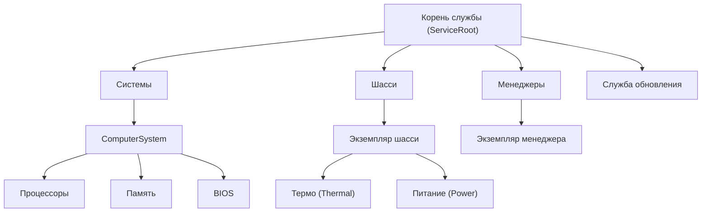
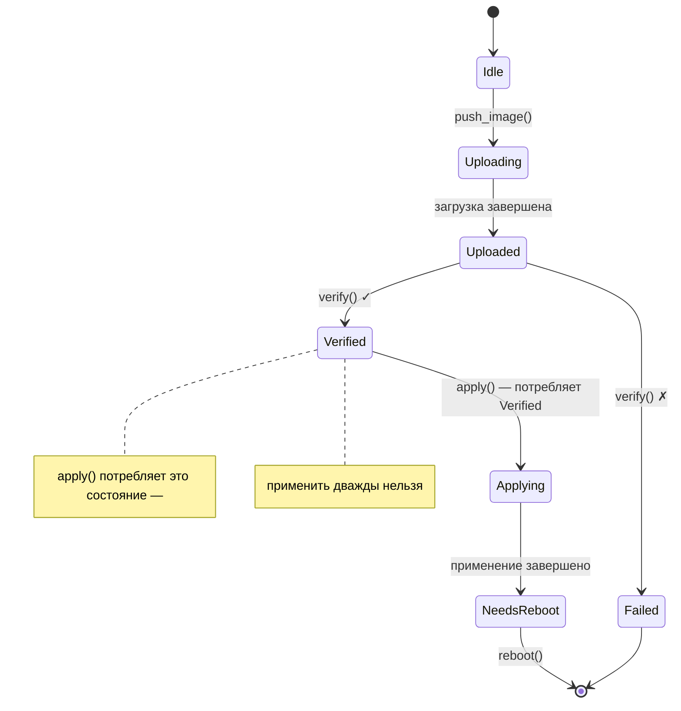

# Пошаговый разбор: типобезопасный клиент Redfish 🟡

> **Что вы узнаете:** как скомпоновать typestate сессий, capability-токены, навигацию по ресурсам с phantom-типами, анализ размерностей, проверенные границы, typestate билдера и одноразовые типы в полноценный клиент Redfish с нулевыми накладными расходами, где каждое нарушение протокола становится ошибкой компиляции.
>
> **Перекрёстные ссылки:** [гл. 02](ch02-typed-command-interfaces-request-determi.md) (типизированные команды), [гл. 03](ch03-single-use-types-cryptographic-guarantee.md) (одноразовые типы), [гл. 04](ch04-capability-tokens-zero-cost-proof-of-aut.md) (capability-токены), [гл. 05](ch05-protocol-state-machines-type-state-for-r.md) (typestate), [гл. 06](ch06-dimensional-analysis-making-the-compiler.md) (размерные типы), [гл. 07](ch07-validated-boundaries-parse-dont-validate.md) (проверенные границы), [гл. 09](ch09-phantom-types-for-resource-tracking.md) (phantom-типы), [гл. 10](ch10-putting-it-all-together-a-complete-diagn.md) (интеграция с IPMI), [гл. 11](ch11-fourteen-tricks-from-the-trenches.md) (приём 4: билдер с typestate)

## Почему Redfish заслуживает отдельной главы

Глава 10 строит основные паттерны вокруг IPMI, протокола на уровне байтов. Но большинство платформ BMC сейчас предоставляют REST API **Redfish** наряду с IPMI (или вместо него), и Redfish приносит собственную категорию опасностей для корректности:

| Опасность | Пример | Последствие |
|-----------|--------|-------------|
| Некорректный URI | `GET /redfish/v1/Chassis/1/Processors` (неверный родитель) | Тихо возвращается 404 или неверные данные |
| Действие в неверном состоянии питания | `Reset(ForceOff)` для уже выключенной системы | BMC возвращает ошибку или, хуже, гонка с другой операцией |
| Отсутствие привилегии | Код уровня оператора вызывает `Manager.ResetToDefaults` | 403 в продакшене, замечание службы безопасности |
| Неполный PATCH | В теле PATCH пропущен обязательный атрибут BIOS | Тихий no-op или частичное повреждение конфигурации |
| Непроверенное применение прошивки | `SimpleUpdate` вызван до проверки целостности образа | Превращённый в кирпич BMC |
| Несоответствие версии схемы | Обращение к `LastResetTime` на BMC v1.5 (добавлено в v1.13) | Поле `null` → паника во время выполнения |
| Путаница единиц в телеметрии | Сравнение температуры на входе (°C) с потреблением мощности (Вт) | Бессмысленные пороговые решения |

В C, Python или нетипизированном Rust каждую из этих опасностей предотвращают только дисциплина и тестирование. Эта глава делает их **ошибками компиляции**.

## Нетипизированный клиент Redfish

Типичный клиент Redfish выглядит так:

```rust,ignore
use std::collections::HashMap;

struct RedfishClient {
    base_url: String,
    token: Option<String>,
}

impl RedfishClient {
    fn get(&self, path: &str) -> Result<serde_json::Value, String> {
        // ... HTTP GET ...
        Ok(serde_json::json!({})) // заглушка
    }

    fn patch(&self, path: &str, body: &serde_json::Value) -> Result<(), String> {
        // ... HTTP PATCH ...
        Ok(()) // заглушка
    }

    fn post_action(&self, path: &str, body: &serde_json::Value) -> Result<(), String> {
        // ... HTTP POST ...
        Ok(()) // заглушка
    }
}

fn check_thermal(client: &RedfishClient) -> Result<(), String> {
    let resp = client.get("/redfish/v1/Chassis/1/Thermal")?;

    // 🐛 Это поле всегда присутствует? Что, если BMC вернёт null?
    let cpu_temp = resp["Temperatures"][0]["ReadingCelsius"]
        .as_f64().unwrap();

    let fan_rpm = resp["Fans"][0]["Reading"]
        .as_f64().unwrap();

    // 🐛 Сравнение °C с об/мин: оба — f64
    if cpu_temp > fan_rpm {
        println!("проблема с температурой");
    }

    // 🐛 Это правильный путь? Проверки на этапе компиляции нет.
    client.post_action(
        "/redfish/v1/Systems/1/Actions/ComputerSystem.Reset",
        &serde_json::json!({"ResetType": "ForceOff"})
    )?;

    Ok(())
}
```

Это «работает», пока не перестаёт работать. Каждый `unwrap()` — потенциальная паника, каждый строковый путь — непроверенное допущение, а путаница единиц не видна.

---

## Раздел 1 — Жизненный цикл сессии (typestate, гл. 05)

У сессии Redfish строгий жизненный цикл: подключение → аутентификация → использование → закрытие. Каждое состояние кодируем отдельным типом.



```rust,ignore
use std::marker::PhantomData;

// ──── Состояния сессии ────

pub struct Disconnected;
pub struct Connected;
pub struct Authenticated;

pub struct RedfishSession<S> {
    base_url: String,
    auth_token: Option<String>,
    _state: PhantomData<S>,
}

impl RedfishSession<Disconnected> {
    pub fn new(host: &str) -> Self {
        RedfishSession {
            base_url: format!("https://{}", host),
            auth_token: None,
            _state: PhantomData,
        }
    }

    /// Переход: Disconnected → Connected.
    /// Проверяет, что корневой сервис доступен.
    pub fn connect(self) -> Result<RedfishSession<Connected>, RedfishError> {
        // GET /redfish/v1 — проверяем корневой сервис
        println!("Подключение к {}/redfish/v1", self.base_url);
        Ok(RedfishSession {
            base_url: self.base_url,
            auth_token: None,
            _state: PhantomData,
        })
    }
}

impl RedfishSession<Connected> {
    /// Переход: Connected → Authenticated.
    /// Создаёт сессию через POST /redfish/v1/SessionService/Sessions.
    pub fn login(
        self,
        user: &str,
        _pass: &str,
    ) -> Result<(RedfishSession<Authenticated>, LoginToken), RedfishError> {
        // POST /redfish/v1/SessionService/Sessions
        println!("Аутентификация как {}", user);
        let token = "X-Auth-Token-abc123".to_string();
        Ok((
            RedfishSession {
                base_url: self.base_url,
                auth_token: Some(token),
                _state: PhantomData,
            },
            LoginToken { _private: () },
        ))
    }
}

impl RedfishSession<Authenticated> {
    /// Доступен только у аутентифицированных сессий.
    fn http_get(&self, path: &str) -> Result<serde_json::Value, RedfishError> {
        let _url = format!("{}{}", self.base_url, path);
        // ... HTTP GET с заголовком auth_token ...
        Ok(serde_json::json!({})) // заглушка
    }

    fn http_patch(
        &self,
        path: &str,
        body: &serde_json::Value,
    ) -> Result<serde_json::Value, RedfishError> {
        let _url = format!("{}{}", self.base_url, path);
        let _ = body;
        Ok(serde_json::json!({})) // заглушка
    }

    fn http_post(
        &self,
        path: &str,
        body: &serde_json::Value,
    ) -> Result<serde_json::Value, RedfishError> {
        let _url = format!("{}{}", self.base_url, path);
        let _ = body;
        Ok(serde_json::json!({})) // заглушка
    }

    /// Переход: Authenticated → Closed (сессия потребляется).
    pub fn logout(self) {
        // DELETE /redfish/v1/SessionService/Sessions/{id}
        println!("Сессия закрыта");
        // self потреблён: после logout сессию использовать нельзя
    }
}

// Попытка вызвать http_get у неаутентифицированной сессии:
//
//   let session = RedfishSession::new("bmc01").connect()?;
//   session.http_get("/redfish/v1/Systems");
//   ❌ ОШИБКА: метод `http_get` не найден для `RedfishSession<Connected>`

#[derive(Debug)]
pub enum RedfishError {
    ConnectionFailed(String),
    AuthenticationFailed(String),
    HttpError { status: u16, message: String },
    ValidationError(String),
}

impl std::fmt::Display for RedfishError {
    fn fmt(&self, f: &mut std::fmt::Formatter<'_>) -> std::fmt::Result {
        match self {
            Self::ConnectionFailed(msg) => write!(f, "ошибка подключения: {msg}"),
            Self::AuthenticationFailed(msg) => write!(f, "ошибка аутентификации: {msg}"),
            Self::HttpError { status, message } =>
                write!(f, "HTTP {status}: {message}"),
            Self::ValidationError(msg) => write!(f, "валидация: {msg}"),
        }
    }
}
```

**Устранённый класс ошибок:** отправка запросов в отключённой или неаутентифицированной сессии. Метод просто не существует, и нечего забыть проверить во время выполнения.

---

## Раздел 2 — Токены привилегий (capability-токены, гл. 04)

Redfish определяет четыре уровня привилегий: `Login`, `ConfigureComponents`, `ConfigureManager`, `ConfigureSelf`. Вместо проверки прав во время выполнения кодируем их как токены-доказательства нулевого размера.

```rust,ignore
// ──── Токены привилегий (нулевого размера) ────

/// Доказательство, что у вызывающего есть привилегия Login.
/// Возвращается при успешном входе: это единственный способ его получить.
pub struct LoginToken { _private: () }

/// Доказательство, что у вызывающего есть привилегия ConfigureComponents.
/// Получить его может только аутентификация на уровне администратора.
pub struct ConfigureComponentsToken { _private: () }

/// Доказательство, что у вызывающего есть привилегия ConfigureManager (обновления прошивки и т. д.).
pub struct ConfigureManagerToken { _private: () }

// Расширяем вход так, чтобы он возвращал токены привилегий в зависимости от роли:

impl RedfishSession<Connected> {
    /// Вход администратора: возвращает все токены привилегий.
    pub fn login_admin(
        self,
        user: &str,
        pass: &str,
    ) -> Result<(
        RedfishSession<Authenticated>,
        LoginToken,
        ConfigureComponentsToken,
        ConfigureManagerToken,
    ), RedfishError> {
        let (session, login_tok) = self.login(user, pass)?;
        Ok((
            session,
            login_tok,
            ConfigureComponentsToken { _private: () },
            ConfigureManagerToken { _private: () },
        ))
    }

    /// Вход оператора: возвращает только Login и ConfigureComponents.
    pub fn login_operator(
        self,
        user: &str,
        pass: &str,
    ) -> Result<(
        RedfishSession<Authenticated>,
        LoginToken,
        ConfigureComponentsToken,
    ), RedfishError> {
        let (session, login_tok) = self.login(user, pass)?;
        Ok((
            session,
            login_tok,
            ConfigureComponentsToken { _private: () },
        ))
    }

    /// Вход только для чтения: возвращает только токен Login.
    pub fn login_readonly(
        self,
        user: &str,
        pass: &str,
    ) -> Result<(RedfishSession<Authenticated>, LoginToken), RedfishError> {
        self.login(user, pass)
    }
}
```

Теперь требования к привилегиям — часть сигнатуры функции:

```rust,ignore
# use std::marker::PhantomData;
# pub struct Authenticated;
# pub struct RedfishSession<S> { base_url: String, auth_token: Option<String>, _state: PhantomData<S> }
# pub struct LoginToken { _private: () }
# pub struct ConfigureComponentsToken { _private: () }
# pub struct ConfigureManagerToken { _private: () }
# #[derive(Debug)] pub enum RedfishError { HttpError { status: u16, message: String } }

/// Любой с Login может читать данные о температуре.
fn get_thermal(
    session: &RedfishSession<Authenticated>,
    _proof: &LoginToken,
) -> Result<serde_json::Value, RedfishError> {
    // GET /redfish/v1/Chassis/1/Thermal
    Ok(serde_json::json!({})) // заглушка
}

/// Изменение порядка загрузки требует ConfigureComponents.
fn set_boot_order(
    session: &RedfishSession<Authenticated>,
    _proof: &ConfigureComponentsToken,
    order: &[&str],
) -> Result<(), RedfishError> {
    let _ = order;
    // PATCH /redfish/v1/Systems/1
    Ok(())
}

/// Сброс к заводским настройкам требует ConfigureManager.
fn reset_to_defaults(
    session: &RedfishSession<Authenticated>,
    _proof: &ConfigureManagerToken,
) -> Result<(), RedfishError> {
    // POST .../Actions/Manager.ResetToDefaults
    Ok(())
}

// Код оператора, вызывающий reset_to_defaults:
//
//   let (session, login, configure) = session.login_operator("op", "pass")?;
//   reset_to_defaults(&session, &???);
//   ❌ ОШИБКА: нет доступного ConfigureManagerToken, оператор не может этого сделать
```

**Устранённый класс ошибок:** эскалация привилегий. Вход на уровне оператора физически не может выдать `ConfigureManagerToken`: компилятор не даст коду на него сослаться. Нулевые накладные расходы: в скомпилированном бинарнике этих токенов не существует.

---

## Раздел 3 — Типизированная навигация по ресурсам (phantom-типы, гл. 09)

Ресурсы Redfish образуют дерево. Кодирование иерархии в типах не даёт построить недопустимые URI:



```rust,ignore
use std::marker::PhantomData;

// ──── Маркеры типов ресурсов ────

pub struct ServiceRoot;
pub struct SystemsCollection;
pub struct ComputerSystem;
pub struct ChassisCollection;
pub struct ChassisInstance;
pub struct ThermalResource;
pub struct PowerResource;
pub struct BiosResource;
pub struct ManagersCollection;
pub struct ManagerInstance;
pub struct UpdateServiceResource;

// ──── Типизированный путь к ресурсу ────

pub struct RedfishPath<R> {
    uri: String,
    _resource: PhantomData<R>,
}

impl RedfishPath<ServiceRoot> {
    pub fn root() -> Self {
        RedfishPath {
            uri: "/redfish/v1".to_string(),
            _resource: PhantomData,
        }
    }

    pub fn systems(&self) -> RedfishPath<SystemsCollection> {
        RedfishPath {
            uri: format!("{}/Systems", self.uri),
            _resource: PhantomData,
        }
    }

    pub fn chassis(&self) -> RedfishPath<ChassisCollection> {
        RedfishPath {
            uri: format!("{}/Chassis", self.uri),
            _resource: PhantomData,
        }
    }

    pub fn managers(&self) -> RedfishPath<ManagersCollection> {
        RedfishPath {
            uri: format!("{}/Managers", self.uri),
            _resource: PhantomData,
        }
    }

    pub fn update_service(&self) -> RedfishPath<UpdateServiceResource> {
        RedfishPath {
            uri: format!("{}/UpdateService", self.uri),
            _resource: PhantomData,
        }
    }
}

impl RedfishPath<SystemsCollection> {
    pub fn system(&self, id: &str) -> RedfishPath<ComputerSystem> {
        RedfishPath {
            uri: format!("{}/{}", self.uri, id),
            _resource: PhantomData,
        }
    }
}

impl RedfishPath<ComputerSystem> {
    pub fn bios(&self) -> RedfishPath<BiosResource> {
        RedfishPath {
            uri: format!("{}/Bios", self.uri),
            _resource: PhantomData,
        }
    }
}

impl RedfishPath<ChassisCollection> {
    pub fn instance(&self, id: &str) -> RedfishPath<ChassisInstance> {
        RedfishPath {
            uri: format!("{}/{}", self.uri, id),
            _resource: PhantomData,
        }
    }
}

impl RedfishPath<ChassisInstance> {
    pub fn thermal(&self) -> RedfishPath<ThermalResource> {
        RedfishPath {
            uri: format!("{}/Thermal", self.uri),
            _resource: PhantomData,
        }
    }

    pub fn power(&self) -> RedfishPath<PowerResource> {
        RedfishPath {
            uri: format!("{}/Power", self.uri),
            _resource: PhantomData,
        }
    }
}

impl RedfishPath<ManagersCollection> {
    pub fn manager(&self, id: &str) -> RedfishPath<ManagerInstance> {
        RedfishPath {
            uri: format!("{}/{}", self.uri, id),
            _resource: PhantomData,
        }
    }
}

impl<R> RedfishPath<R> {
    pub fn uri(&self) -> &str {
        &self.uri
    }
}

// ── Использование ──

fn build_paths() {
    let root = RedfishPath::root();

    // ✅ Корректная навигация
    let thermal = root.chassis().instance("1").thermal();
    assert_eq!(thermal.uri(), "/redfish/v1/Chassis/1/Thermal");

    let bios = root.systems().system("1").bios();
    assert_eq!(bios.uri(), "/redfish/v1/Systems/1/Bios");

    // ❌ Ошибка компиляции: у ServiceRoot нет метода .thermal()
    // root.thermal();

    // ❌ Ошибка компиляции: у SystemsCollection нет метода .bios()
    // root.systems().bios();

    // ❌ Ошибка компиляции: у ChassisInstance нет метода .bios()
    // root.chassis().instance("1").bios();
}
```

**Устранённый класс ошибок:** некорректные URI, переход к дочернему ресурсу, которого нет под данным родителем. Иерархия обеспечивается структурно: до `Thermal` можно добраться только через `Chassis → Instance → Thermal`.

---

## Раздел 4 — Типизированное чтение телеметрии (типизированные команды + анализ размерностей, гл. 02 + гл. 06)

Соединяем типизированные пути к ресурсам с размерными типами возвращаемых значений, чтобы компилятор знал, какую единицу несёт каждое показание:

```rust,ignore
use std::marker::PhantomData;

// ──── Размерные типы (гл. 06) ────

#[derive(Debug, Clone, Copy, PartialEq, PartialOrd)]
pub struct Celsius(pub f64);

#[derive(Debug, Clone, Copy, PartialEq, PartialOrd)]
pub struct Rpm(pub u32);

#[derive(Debug, Clone, Copy, PartialEq, PartialOrd)]
pub struct Watts(pub f64);

#[derive(Debug, Clone, Copy, PartialEq, PartialOrd)]
pub struct Volts(pub f64);

// ──── Типизированный GET Redfish (паттерн гл. 02, применённый к REST) ────

/// Тип ресурса Redfish определяет его разобранный ответ.
pub trait RedfishResource {
    type Response;
    fn parse(json: &serde_json::Value) -> Result<Self::Response, RedfishError>;
}

// ──── Проверенный ответ Thermal (гл. 07) ────

#[derive(Debug)]
pub struct ValidThermalResponse {
    pub temperatures: Vec<TemperatureReading>,
    pub fans: Vec<FanReading>,
}

#[derive(Debug)]
pub struct TemperatureReading {
    pub name: String,
    pub reading: Celsius,           // ← размерный тип, а не f64
    pub upper_critical: Celsius,
    pub status: HealthStatus,
}

#[derive(Debug)]
pub struct FanReading {
    pub name: String,
    pub reading: Rpm,               // ← размерный тип, а не u32
    pub status: HealthStatus,
}

#[derive(Debug, Clone, Copy, PartialEq)]
pub enum HealthStatus { Ok, Warning, Critical }

impl RedfishResource for ThermalResource {
    type Response = ValidThermalResponse;

    fn parse(json: &serde_json::Value) -> Result<ValidThermalResponse, RedfishError> {
        // Разбор и валидация за один проход: валидация на границе (гл. 07)
        let temps = json["Temperatures"]
            .as_array()
            .ok_or_else(|| RedfishError::ValidationError(
                "отсутствует массив Temperatures".into(),
            ))?
            .iter()
            .map(|t| {
                Ok(TemperatureReading {
                    name: t["Name"]
                        .as_str()
                        .ok_or_else(|| RedfishError::ValidationError(
                            "отсутствует Name".into(),
                        ))?
                        .to_string(),
                    reading: Celsius(
                        t["ReadingCelsius"]
                            .as_f64()
                            .ok_or_else(|| RedfishError::ValidationError(
                                "отсутствует ReadingCelsius".into(),
                            ))?,
                    ),
                    upper_critical: Celsius(
                        t["UpperThresholdCritical"]
                            .as_f64()
                            .unwrap_or(105.0), // безопасное значение по умолчанию для отсутствующего порога
                    ),
                    status: parse_health(
                        t["Status"]["Health"]
                            .as_str()
                            .unwrap_or("OK"),
                    ),
                })
            })
            .collect::<Result<Vec<_>, _>>()?;

        let fans = json["Fans"]
            .as_array()
            .ok_or_else(|| RedfishError::ValidationError(
                "отсутствует массив Fans".into(),
            ))?
            .iter()
            .map(|f| {
                Ok(FanReading {
                    name: f["Name"]
                        .as_str()
                        .ok_or_else(|| RedfishError::ValidationError(
                            "отсутствует Name".into(),
                        ))?
                        .to_string(),
                    reading: Rpm(
                        f["Reading"]
                            .as_u64()
                            .ok_or_else(|| RedfishError::ValidationError(
                                "отсутствует Reading".into(),
                            ))? as u32,
                    ),
                    status: parse_health(
                        f["Status"]["Health"]
                            .as_str()
                            .unwrap_or("OK"),
                    ),
                })
            })
            .collect::<Result<Vec<_>, _>>()?;

        Ok(ValidThermalResponse { temperatures: temps, fans })
    }
}

fn parse_health(s: &str) -> HealthStatus {
    match s {
        "OK" => HealthStatus::Ok,
        "Warning" => HealthStatus::Warning,
        _ => HealthStatus::Critical,
    }
}

// ──── Типизированный GET в аутентифицированной сессии ────

impl RedfishSession<Authenticated> {
    pub fn get_resource<R: RedfishResource>(
        &self,
        path: &RedfishPath<R>,
    ) -> Result<R::Response, RedfishError> {
        let json = self.http_get(path.uri())?;
        R::parse(&json)
    }
}

// ── Использование ──

fn read_thermal(
    session: &RedfishSession<Authenticated>,
    _proof: &LoginToken,
) -> Result<(), RedfishError> {
    let path = RedfishPath::root().chassis().instance("1").thermal();

    // Тип ответа выводится: ValidThermalResponse
    let thermal = session.get_resource(&path)?;

    for t in &thermal.temperatures {
        // t.reading — Celsius: сравнивать можно только с Celsius
        if t.reading > t.upper_critical {
            println!("КРИТИЧНО: {} при {:?}", t.name, t.reading);
        }

        // ❌ Ошибка компиляции: нельзя сравнить Celsius с Rpm
        // if t.reading > thermal.fans[0].reading { }

        // ❌ Ошибка компиляции: нельзя сравнить Celsius с Watts
        // if t.reading > Watts(350.0) { }
    }

    Ok(())
}
```

**Устранённые классы ошибок:**
- **Путаница единиц:** `Celsius` ≠ `Rpm` ≠ `Watts`, компилятор отвергает сравнения.
- **Паника из-за отсутствующего поля:** `parse()` валидирует на границе; `ValidThermalResponse` гарантирует наличие всех полей.
- **Неверный тип ответа:** `get_resource(&thermal_path)` возвращает `ValidThermalResponse`, а не сырой JSON. Тип ресурса определяет тип ответа на этапе компиляции.

---

## Раздел 5 — PATCH с билдером typestate (гл. 11, приём 4)

Полезные нагрузки PATCH в Redfish должны содержать определённые поля. Билдер, который открывает `.apply()` только при установке обязательных полей, не даёт отправить неполные или пустые патчи:

```rust,ignore
use std::marker::PhantomData;

// ──── Типовые булевы значения для обязательных полей ────

pub struct FieldUnset;
pub struct FieldSet;

// ──── Билдер PATCH для настроек BIOS ────

pub struct BiosPatchBuilder<BootOrder, TpmState> {
    boot_order: Option<Vec<String>>,
    tpm_enabled: Option<bool>,
    _markers: PhantomData<(BootOrder, TpmState)>,
}

impl BiosPatchBuilder<FieldUnset, FieldUnset> {
    pub fn new() -> Self {
        BiosPatchBuilder {
            boot_order: None,
            tpm_enabled: None,
            _markers: PhantomData,
        }
    }
}

impl<T> BiosPatchBuilder<FieldUnset, T> {
    /// Задаёт порядок загрузки: переводит маркер BootOrder в FieldSet.
    pub fn boot_order(self, order: Vec<String>) -> BiosPatchBuilder<FieldSet, T> {
        BiosPatchBuilder {
            boot_order: Some(order),
            tpm_enabled: self.tpm_enabled,
            _markers: PhantomData,
        }
    }
}

impl<B> BiosPatchBuilder<B, FieldUnset> {
    /// Задаёт состояние TPM: переводит маркер TpmState в FieldSet.
    pub fn tpm_enabled(self, enabled: bool) -> BiosPatchBuilder<B, FieldSet> {
        BiosPatchBuilder {
            boot_order: self.boot_order,
            tpm_enabled: Some(enabled),
            _markers: PhantomData,
        }
    }
}

impl BiosPatchBuilder<FieldSet, FieldSet> {
    /// .apply() существует только тогда, когда ВСЕ обязательные поля заданы.
    pub fn apply(
        self,
        session: &RedfishSession<Authenticated>,
        _proof: &ConfigureComponentsToken,
        system: &RedfishPath<ComputerSystem>,
    ) -> Result<(), RedfishError> {
        let body = serde_json::json!({
            "Boot": {
                "BootOrder": self.boot_order.unwrap(),
            },
            "Oem": {
                "TpmEnabled": self.tpm_enabled.unwrap(),
            }
        });
        session.http_patch(
            &format!("{}/Bios/Settings", system.uri()),
            &body,
        )?;
        Ok(())
    }
}

// ── Использование ──

fn configure_bios(
    session: &RedfishSession<Authenticated>,
    configure: &ConfigureComponentsToken,
) -> Result<(), RedfishError> {
    let system = RedfishPath::root().systems().system("1");

    // ✅ Оба обязательных поля заданы: .apply() доступен
    BiosPatchBuilder::new()
        .boot_order(vec!["Pxe".into(), "Hdd".into()])
        .tpm_enabled(true)
        .apply(session, configure, &system)?;

    // ❌ Ошибка компиляции: .apply() не найден у BiosPatchBuilder<FieldSet, FieldUnset>
    // BiosPatchBuilder::new()
    //     .boot_order(vec!["Pxe".into()])
    //     .apply(session, configure, &system)?;

    // ❌ Ошибка компиляции: .apply() не найден у BiosPatchBuilder<FieldUnset, FieldUnset>
    // BiosPatchBuilder::new()
    //     .apply(session, configure, &system)?;

    Ok(())
}
```

**Устранённые классы ошибок:**
- **Пустой PATCH:** нельзя вызвать `.apply()`, не задав каждое обязательное поле.
- **Отсутствие привилегии:** `.apply()` требует `&ConfigureComponentsToken`.
- **Неверный ресурс:** принимает `&RedfishPath<ComputerSystem>`, а не строку.

---

## Раздел 6 — Жизненный цикл обновления прошивки (одноразовые типы + typestate, гл. 03 + гл. 05)

У `UpdateService` в Redfish строгая последовательность: загрузить образ → проверить → применить → перезагрузить. Каждая фаза должна произойти ровно один раз и в порядке очерёдности.



```rust,ignore
use std::marker::PhantomData;

// ──── Состояния обновления прошивки ────

pub struct FwIdle;
pub struct FwUploaded;
pub struct FwVerified;
pub struct FwApplying;
pub struct FwNeedsReboot;

pub struct FirmwareUpdate<S> {
    task_uri: String,
    image_hash: String,
    _phase: PhantomData<S>,
}

impl FirmwareUpdate<FwIdle> {
    pub fn push_image(
        session: &RedfishSession<Authenticated>,
        _proof: &ConfigureManagerToken,
        image: &[u8],
    ) -> Result<FirmwareUpdate<FwUploaded>, RedfishError> {
        // POST /redfish/v1/UpdateService/Actions/UpdateService.SimpleUpdate
        // или multipart-загрузка в /redfish/v1/UpdateService/upload
        let _ = image;
        println!("Образ загружен ({} байт)", image.len());
        Ok(FirmwareUpdate {
            task_uri: "/redfish/v1/TaskService/Tasks/1".to_string(),
            image_hash: "sha256:abc123".to_string(),
            _phase: PhantomData,
        })
    }
}

impl FirmwareUpdate<FwUploaded> {
    /// Проверяет целостность образа. При успехе возвращает FwVerified.
    pub fn verify(self) -> Result<FirmwareUpdate<FwVerified>, RedfishError> {
        // Опрашиваем задачу до завершения проверки
        println!("Образ проверен: {}", self.image_hash);
        Ok(FirmwareUpdate {
            task_uri: self.task_uri,
            image_hash: self.image_hash,
            _phase: PhantomData,
        })
    }
}

impl FirmwareUpdate<FwVerified> {
    /// Применяет обновление. Потребляет self: применить дважды нельзя.
    /// Это одноразовый паттерн из гл. 03.
    pub fn apply(self) -> Result<FirmwareUpdate<FwNeedsReboot>, RedfishError> {
        // PATCH /redfish/v1/UpdateService: задаём ApplyTime
        println!("Прошивка применена из {}", self.task_uri);
        // self перемещён: повторный вызов apply() — ошибка компиляции
        Ok(FirmwareUpdate {
            task_uri: self.task_uri,
            image_hash: self.image_hash,
            _phase: PhantomData,
        })
    }
}

impl FirmwareUpdate<FwNeedsReboot> {
    /// Перезагрузка, чтобы активировать новую прошивку.
    pub fn reboot(
        self,
        session: &RedfishSession<Authenticated>,
        _proof: &ConfigureManagerToken,
    ) -> Result<(), RedfishError> {
        // POST .../Actions/Manager.Reset {"ResetType": "GracefulRestart"}
        let _ = session;
        println!("BMC перезагружается для активации прошивки");
        Ok(())
    }
}

// ── Использование ──

fn update_bmc_firmware(
    session: &RedfishSession<Authenticated>,
    manager_proof: &ConfigureManagerToken,
    image: &[u8],
) -> Result<(), RedfishError> {
    // Каждый шаг возвращает следующее состояние, предыдущее потребляется
    let uploaded = FirmwareUpdate::push_image(session, manager_proof, image)?;
    let verified = uploaded.verify()?;
    let needs_reboot = verified.apply()?;
    needs_reboot.reboot(session, manager_proof)?;

    // ❌ Ошибка компиляции: использование перемещённого значения `verified`
    // verified.apply()?;

    // ❌ Ошибка компиляции: у FirmwareUpdate<FwUploaded> нет метода .apply()
    // uploaded.apply()?;      // сначала нужно проверить!

    // ❌ Ошибка компиляции: push_image требует &ConfigureManagerToken
    // FirmwareUpdate::push_image(session, &login_token, image)?;

    Ok(())
}
```

**Устранённые классы ошибок:**
- **Применение непроверенной прошивки:** `.apply()` существует только у `FwVerified`.
- **Двойное применение:** `apply()` потребляет `self`, перемещённое значение нельзя использовать повторно.
- **Пропуск перезагрузки:** `FwNeedsReboot` — отдельный тип; нельзя по ошибке продолжить обычную работу, пока прошивка подготовлена.
- **Несанкционированное обновление:** `push_image()` требует `&ConfigureManagerToken`.

---

## Раздел 7 — Собираем всё вместе

Вот полный диагностический сценарий, который объединяет все шесть разделов:

```rust,ignore
fn full_redfish_diagnostic() -> Result<(), RedfishError> {
    // ── 1. Жизненный цикл сессии (раздел 1) ──
    let session = RedfishSession::new("bmc01.lab.local");
    let session = session.connect()?;

    // ── 2. Токены привилегий (раздел 2) ──
    // Вход администратора: получаем все токены возможностей
    let (session, _login, configure, manager) =
        session.login_admin("admin", "p@ssw0rd")?;

    // ── 3. Типизированная навигация (раздел 3) ──
    let thermal_path = RedfishPath::root()
        .chassis()
        .instance("1")
        .thermal();

    // ── 4. Типизированное чтение телеметрии (раздел 4) ──
    let thermal: ValidThermalResponse = session.get_resource(&thermal_path)?;

    for t in &thermal.temperatures {
        // Celsius сравнивается только с Celsius: размерная безопасность
        if t.reading > t.upper_critical {
            println!("🔥 {} в критическом состоянии: {:?}", t.name, t.reading);
        }
    }

    for f in &thermal.fans {
        if f.reading < Rpm(1000) {
            println!("⚠ {} ниже порога: {:?}", f.name, f.reading);
        }
    }

    // ── 5. Типобезопасный PATCH (раздел 5) ──
    let system_path = RedfishPath::root().systems().system("1");

    BiosPatchBuilder::new()
        .boot_order(vec!["Pxe".into(), "Hdd".into()])
        .tpm_enabled(true)
        .apply(&session, &configure, &system_path)?;

    // ── 6. Жизненный цикл обновления прошивки (раздел 6) ──
    let firmware_image = include_bytes!("bmc_firmware.bin");
    let uploaded = FirmwareUpdate::push_image(&session, &manager, firmware_image)?;
    let verified = uploaded.verify()?;
    let needs_reboot = verified.apply()?;

    // ── 7. Чистое завершение ──
    needs_reboot.reboot(&session, &manager)?;
    session.logout();

    Ok(())
}
```

### Что доказывает компилятор

| № | Класс ошибки | Как это предотвращается | Паттерн (раздел) |
|---|--------------|-------------------------|------------------|
| 1 | Запрос в неаутентифицированной сессии | `http_get()` существует только у `Session<Authenticated>` | Typestate (§1) |
| 2 | Эскалация привилегий | `ConfigureManagerToken` не выдаётся при входе оператора | Capability-токены (§2) |
| 3 | Некорректный URI Redfish | Методы навигации обеспечивают иерархию родитель → потомок | Phantom-типы (§3) |
| 4 | Путаница единиц (°C, об/мин, Вт) | `Celsius`, `Rpm`, `Watts` — разные типы | Анализ размерностей (§4) |
| 5 | Отсутствующее поле JSON → паника | `ValidThermalResponse` валидирует на границе разбора | Проверенные границы (§4) |
| 6 | Неверный тип ответа | `RedfishResource::Response` фиксирован для каждого ресурса | Типизированные команды (§4) |
| 7 | Неполная нагрузка PATCH | `.apply()` существует только при `FieldSet` у всех полей | Typestate билдера (§5) |
| 8 | Отсутствие привилегии для PATCH | `.apply()` требует `&ConfigureComponentsToken` | Capability-токены (§5) |
| 9 | Применение непроверенной прошивки | `.apply()` существует только у `FwVerified` | Typestate (§6) |
| 10 | Двойное применение прошивки | `apply()` потребляет `self`: значение перемещается | Одноразовые типы (§6) |
| 11 | Обновление прошивки без полномочий | `push_image()` требует `&ConfigureManagerToken` | Capability-токены (§6) |
| 12 | Использование после выхода | `logout()` потребляет сессию | Владение (§1) |

**Суммарные накладные расходы во время выполнения от ВСЕХ двенадцати гарантий: ноль.**

Скомпилированный бинарник делает те же HTTP-вызовы, что и нетипизированная версия, но нетипизированная версия может содержать 12 классов ошибок. Эта версия не может.

---

## Сравнение: интеграция с IPMI (гл. 10) и с Redfish

| Аспект | гл. 10 (IPMI) | Эта глава (Redfish) |
|--------|---------------|---------------------|
| Транспорт | Сырые байты через KCS/LAN | JSON через HTTPS |
| Навигация | Плоские коды команд (NetFn/Cmd) | Иерархическое дерево URI |
| Привязка ответа | `IpmiCmd::Response` | `RedfishResource::Response` |
| Модель привилегий | Один `AdminToken` | Многотокенная модель на основе ролей |
| Построение полезной нагрузки | Массивы байтов | Билдер с typestate для JSON |
| Жизненный цикл обновления | Не рассматривается | Полная цепочка typestate |
| Задействованные паттерны | 7 | 8 (добавляется typestate билдера) |

Две главы дополняют друг друга: гл. 10 показывает, что паттерны работают на уровне байтов, а эта глава показывает, что они работают одинаково на уровне REST/JSON. Система типов не зависит от транспорта и доказывает корректность в обоих случаях.

## Ключевые выводы

1. **Восемь паттернов складываются в один клиент Redfish**: typestate сессии, capability-токены, URI с phantom-типами, типизированные команды, анализ размерностей, проверенные границы, typestate билдера и одноразовое применение прошивки.
2. **Двенадцать классов ошибок становятся ошибками компиляции**: см. таблицу выше.
3. **Нулевые накладные расходы во время выполнения**: каждый токен-доказательство, phantom-тип и маркер typestate исчезает при компиляции. Бинарный файл идентичен написанному вручную нетипизированному коду.
4. **REST API выигрывают не меньше, чем протоколы на уровне байтов**: паттерны из гл. 02–09 одинаково применимы к JSON-over-HTTPS (Redfish) и байтам-over-KCS (IPMI).
5. **Соблюдение привилегий структурно, а не процедурно**: сигнатура функции объявляет требования, а компилятор их обеспечивает.
6. **Это шаблон проектирования**: адаптируйте маркеры типов ресурсов, capability-токены и билдер под вашу конкретную схему Redfish и иерархию ролей в организации.

---
