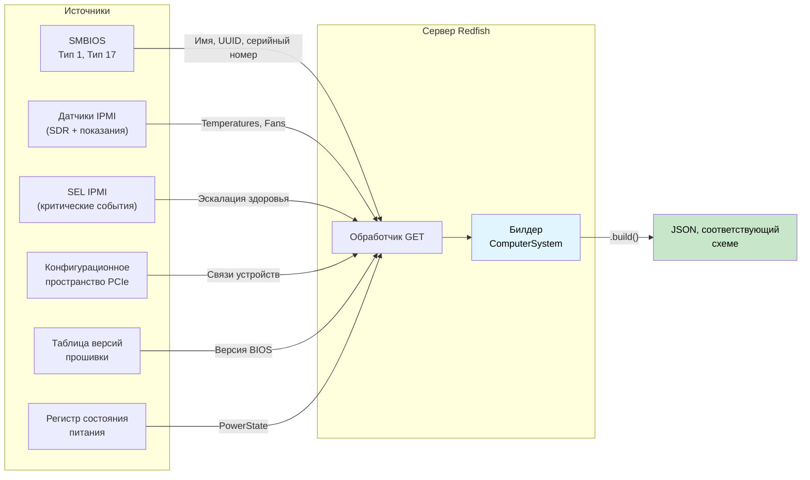

# Пошаговый разбор: типобезопасный сервер Redfish 🟡

> **Что вы узнаете:** как скомпоновать typestate билдера ответа, токены доступности источников, размерную сериализацию, агрегацию здоровья, версионирование схем и типизированную диспетчеризацию действий в сервер Redfish, который **не может выдать ответ, не соответствующий схеме**. Это зеркало пошагового разбора клиента из [гл. 17](ch17-redfish-applied-walkthrough.md).
>
> **Перекрёстные ссылки:** [гл. 02](ch02-typed-command-interfaces-request-determi.md) (типизированные команды, перевёрнутые для диспетчеризации действий), [гл. 04](ch04-capability-tokens-zero-cost-proof-of-aut.md) (capability-токены для доступности источников), [гл. 06](ch06-dimensional-analysis-making-the-compiler.md) (размерные типы, сторона сериализации), [гл. 07](ch07-validated-boundaries-parse-dont-validate.md) (проверенные границы, перевёрнуто: «строй, а не сериализуй»), [гл. 09](ch09-phantom-types-for-resource-tracking.md) (phantom-типы, версионирование схем), [гл. 11](ch11-fourteen-tricks-from-the-trenches.md) (приём 3: `#[non_exhaustive]`, приём 4: билдер с typestate), [гл. 17](ch17-redfish-applied-walkthrough.md) (клиентская часть)

## Проблема зеркала

Глава 17 спрашивает: *«Как правильно потреблять Redfish?»* Эта глава задаёт зеркальный вопрос: *«Как правильно отдавать Redfish?»*

На стороне клиента опасность в том, чтобы **доверять** плохим данным. На стороне сервера опасность в том, чтобы **выдавать** плохие данные, а каждый клиент в парке доверяет тому, что вы отправляете.

Один ответ `GET /redfish/v1/Systems/1` должен объединять данные из многих источников:



В C это обработчик на 500 строк, который обращается к шести подсистемам, вручную строит дерево JSON через `json_object_set()` и надеется, что каждое обязательное поле заполнено. Забыли одно? Ответ нарушает схему Redfish. Перепутали единицу? Каждый клиент получает искажённую телеметрию.

```c
// C — проблема сборки
json_t *get_computer_system(const char *id) {
    json_t *obj = json_object();
    json_object_set_new(obj, "@odata.type",
        json_string("#ComputerSystem.v1_13_0.ComputerSystem"));

    // 🐛 Забыли задать "Name": схема его требует
    // 🐛 Забыли задать "UUID": схема его требует

    smbios_type1_t *t1 = smbios_get_type1();
    if (t1) {
        json_object_set_new(obj, "Manufacturer",
            json_string(t1->manufacturer));
    }

    json_object_set_new(obj, "PowerState",
        json_string(get_power_state()));  // хотя бы это всегда доступно

    // 🐛 Показание в сырых отсчётах АЦП, а не в Цельсиях: нет типа, который это поймает
    double cpu_temp = read_sensor(SENSOR_CPU_TEMP);
    // Это число где-то попадает в ответ Thermal...
    // но ничто не связывает его с «Цельсием» на уровне типов

    // 🐛 Здоровье вычисляется вручную: забыли учесть статус БП
    json_object_set_new(obj, "Status",
        build_status("Enabled", "OK")); // должно быть "Critical": БП выходит из строя

    return obj; // не хватает 2 обязательных полей, неверное здоровье, сырые единицы
}
```

Четыре ошибки в одном обработчике. На стороне клиента каждая ошибка затрагивает **одного** клиента. На стороне сервера каждая ошибка затрагивает **каждого** клиента, который запрашивает этот BMC.

---

## Раздел 1 — Typestate билдера ответа: «строй, а не сериализуй» (гл. 07, перевёрнуто)

Глава 7 учит «parse, don't validate»: проверить входящие данные один раз и хранить доказательство в типе. Зеркальный приём на стороне сервера — **«construct, don't serialize»**: строить исходящий ответ через билдер, который открывает `.build()` только при наличии всех обязательных полей.

```rust,ignore
use std::marker::PhantomData;

// ──── Отслеживание полей на уровне типов ────

pub struct HasField;
pub struct MissingField;

// ──── Билдер ответа ────

/// Билдер ресурса ComputerSystem Redfish.
/// Параметры типа отслеживают, какие ОБЯЗАТЕЛЬНЫЕ поля уже заданы.
/// Необязательные поля не нужно отслеживать на уровне типов.
pub struct ComputerSystemBuilder<Name, Uuid, PowerState, Status> {
    // Обязательные поля — отслеживаются на уровне типов
    name: Option<String>,
    uuid: Option<String>,
    power_state: Option<PowerStateValue>,
    status: Option<ResourceStatus>,
    // Необязательные поля — не отслеживаются (можно задать всегда)
    manufacturer: Option<String>,
    model: Option<String>,
    serial_number: Option<String>,
    bios_version: Option<String>,
    processor_summary: Option<ProcessorSummary>,
    memory_summary: Option<MemorySummary>,
    _markers: PhantomData<(Name, Uuid, PowerState, Status)>,
}

#[derive(Debug, Clone, serde::Serialize)]
pub enum PowerStateValue { On, Off, PoweringOn, PoweringOff }

#[derive(Debug, Clone, serde::Serialize)]
pub struct ResourceStatus {
    #[serde(rename = "State")]
    pub state: StatusState,
    #[serde(rename = "Health")]
    pub health: HealthValue,
    #[serde(rename = "HealthRollup", skip_serializing_if = "Option::is_none")]
    pub health_rollup: Option<HealthValue>,
}

#[derive(Debug, Clone, Copy, serde::Serialize)]
pub enum StatusState { Enabled, Disabled, Absent, StandbyOffline, Starting }

#[derive(Debug, Clone, Copy, PartialEq, Eq, PartialOrd, Ord, serde::Serialize)]
pub enum HealthValue { OK, Warning, Critical }

#[derive(Debug, Clone, serde::Serialize)]
pub struct ProcessorSummary {
    #[serde(rename = "Count")]
    pub count: u32,
    #[serde(rename = "Status")]
    pub status: ResourceStatus,
}

#[derive(Debug, Clone, serde::Serialize)]
pub struct MemorySummary {
    #[serde(rename = "TotalSystemMemoryGiB")]
    pub total_gib: f64,
    #[serde(rename = "Status")]
    pub status: ResourceStatus,
}

// ──── Конструктор: все поля начинаются как MissingField ────

impl ComputerSystemBuilder<MissingField, MissingField, MissingField, MissingField> {
    pub fn new() -> Self {
        ComputerSystemBuilder {
            name: None, uuid: None, power_state: None, status: None,
            manufacturer: None, model: None, serial_number: None,
            bios_version: None, processor_summary: None, memory_summary: None,
            _markers: PhantomData,
        }
    }
}

// ──── Сеттеры обязательных полей — каждый переводит один параметр типа ────

impl<U, P, S> ComputerSystemBuilder<MissingField, U, P, S> {
    pub fn name(self, name: String) -> ComputerSystemBuilder<HasField, U, P, S> {
        ComputerSystemBuilder {
            name: Some(name), uuid: self.uuid,
            power_state: self.power_state, status: self.status,
            manufacturer: self.manufacturer, model: self.model,
            serial_number: self.serial_number, bios_version: self.bios_version,
            processor_summary: self.processor_summary,
            memory_summary: self.memory_summary, _markers: PhantomData,
        }
    }
}

impl<N, P, S> ComputerSystemBuilder<N, MissingField, P, S> {
    pub fn uuid(self, uuid: String) -> ComputerSystemBuilder<N, HasField, P, S> {
        ComputerSystemBuilder {
            name: self.name, uuid: Some(uuid),
            power_state: self.power_state, status: self.status,
            manufacturer: self.manufacturer, model: self.model,
            serial_number: self.serial_number, bios_version: self.bios_version,
            processor_summary: self.processor_summary,
            memory_summary: self.memory_summary, _markers: PhantomData,
        }
    }
}

impl<N, U, S> ComputerSystemBuilder<N, U, MissingField, S> {
    pub fn power_state(self, ps: PowerStateValue)
        -> ComputerSystemBuilder<N, U, HasField, S>
    {
        ComputerSystemBuilder {
            name: self.name, uuid: self.uuid,
            power_state: Some(ps), status: self.status,
            manufacturer: self.manufacturer, model: self.model,
            serial_number: self.serial_number, bios_version: self.bios_version,
            processor_summary: self.processor_summary,
            memory_summary: self.memory_summary, _markers: PhantomData,
        }
    }
}

impl<N, U, P> ComputerSystemBuilder<N, U, P, MissingField> {
    pub fn status(self, status: ResourceStatus)
        -> ComputerSystemBuilder<N, U, P, HasField>
    {
        ComputerSystemBuilder {
            name: self.name, uuid: self.uuid,
            power_state: self.power_state, status: Some(status),
            manufacturer: self.manufacturer, model: self.model,
            serial_number: self.serial_number, bios_version: self.bios_version,
            processor_summary: self.processor_summary,
            memory_summary: self.memory_summary, _markers: PhantomData,
        }
    }
}

// ──── Сеттеры необязательных полей — доступны в любом состоянии ────

impl<N, U, P, S> ComputerSystemBuilder<N, U, P, S> {
    pub fn manufacturer(mut self, m: String) -> Self {
        self.manufacturer = Some(m); self
    }
    pub fn model(mut self, m: String) -> Self {
        self.model = Some(m); self
    }
    pub fn serial_number(mut self, s: String) -> Self {
        self.serial_number = Some(s); self
    }
    pub fn bios_version(mut self, v: String) -> Self {
        self.bios_version = Some(v); self
    }
    pub fn processor_summary(mut self, ps: ProcessorSummary) -> Self {
        self.processor_summary = Some(ps); self
    }
    pub fn memory_summary(mut self, ms: MemorySummary) -> Self {
        self.memory_summary = Some(ms); self
    }
}

// ──── .build() существует ТОЛЬКО когда все обязательные поля — HasField ────

impl ComputerSystemBuilder<HasField, HasField, HasField, HasField> {
    pub fn build(self, id: &str) -> serde_json::Value {
        let mut obj = serde_json::json!({
            "@odata.id": format!("/redfish/v1/Systems/{id}"),
            "@odata.type": "#ComputerSystem.v1_13_0.ComputerSystem",
            "Id": id,
            // Type-state гарантирует, что эти значения Some — .unwrap() здесь безопасен.
            // В продакшене предпочтительнее .expect("guaranteed by type state").
            "Name": self.name.unwrap(),
            "UUID": self.uuid.unwrap(),
            "PowerState": self.power_state.unwrap(),
            "Status": self.status.unwrap(),
        });

        // Необязательные поля — включаются, только если заданы
        if let Some(m) = self.manufacturer {
            obj["Manufacturer"] = serde_json::json!(m);
        }
        if let Some(m) = self.model {
            obj["Model"] = serde_json::json!(m);
        }
        if let Some(s) = self.serial_number {
            obj["SerialNumber"] = serde_json::json!(s);
        }
        if let Some(v) = self.bios_version {
            obj["BiosVersion"] = serde_json::json!(v);
        }
        // ПРИМЕЧАНИЕ: .unwrap() при to_value() используется для краткости.
        // В продакшене ошибки сериализации следует передавать через `?`.
        if let Some(ps) = self.processor_summary {
            obj["ProcessorSummary"] = serde_json::to_value(ps).unwrap();
        }
        if let Some(ms) = self.memory_summary {
            obj["MemorySummary"] = serde_json::to_value(ms).unwrap();
        }

        obj
    }
}

//
// ── Компилятор обеспечивает полноту ──
//
// ✅ Все обязательные поля заданы — .build() доступен:
// ComputerSystemBuilder::new()
//     .name("PowerEdge R750".into())
//     .uuid("4c4c4544-...".into())
//     .power_state(PowerStateValue::On)
//     .status(ResourceStatus { ... })
//     .manufacturer("Dell".into())        // необязательное — можно включать
//     .build("1")
//
// ❌ Нет «Name» — ошибка компиляции:
// ComputerSystemBuilder::new()
//     .uuid("4c4c4544-...".into())
//     .power_state(PowerStateValue::On)
//     .status(ResourceStatus { ... })
//     .build("1")
//   ОШИБКА: метод `build` не найден для
//   `ComputerSystemBuilder<MissingField, HasField, HasField, HasField>`
```

**Устранённый класс ошибок:** ответы, не соответствующие схеме. Обработчик физически не может сериализовать `ComputerSystem`, не задав каждое обязательное поле. Сообщение компилятора даже подсказывает, *какого* поля не хватает: это видно в параметре типа, где стоит `MissingField` на месте `Name`.

---

## Раздел 2 — Токены доступности источников (capability-токены, гл. 04, новый поворот)

В гл. 04 и гл. 17 capability-токены доказывают **авторизацию**: «вызывающему разрешено это делать». На стороне сервера тот же паттерн доказывает **доступность**: «этот источник данных успешно инициализирован».

Каждая подсистема, которую опрашивает BMC, может отказать независимо. Таблицы SMBIOS могут быть повреждены. Подсистема датчиков может ещё инициализироваться. Сканирование шины PCIe может завершиться по тайм-ауту. Кодируем каждую как токен-доказательство:

```rust,ignore
/// Доказательство, что таблицы SMBIOS успешно разобраны.
/// Создаётся только функцией инициализации SMBIOS.
pub struct SmbiosReady {
    _private: (),
}

/// Доказательство, что подсистема датчиков IPMI отвечает.
pub struct SensorsReady {
    _private: (),
}

/// Доказательство, что сканирование шины PCIe завершено.
pub struct PcieReady {
    _private: (),
}

/// Доказательство, что SEL успешно прочитан.
pub struct SelReady {
    _private: (),
}

// ──── Инициализация источников данных ────

pub struct SmbiosTables {
    pub product_name: String,
    pub manufacturer: String,
    pub serial_number: String,
    pub uuid: String,
}

pub struct SensorCache {
    pub cpu_temp: Celsius,
    pub inlet_temp: Celsius,
    pub fan_readings: Vec<(String, Rpm)>,
    pub psu_power: Vec<(String, Watts)>,
}

/// Расширенная сводка SEL — здоровье по подсистемам, выведенное из типизированных событий.
/// Строится конвейером потребителя из раздела SEL гл. 07.
/// Заменяет теряющий информацию `has_critical_events: bool` типизированной детализацией.
pub struct TypedSelSummary {
    pub total_entries: u32,
    pub processor_health: HealthValue,
    pub memory_health: HealthValue,
    pub power_health: HealthValue,
    pub thermal_health: HealthValue,
    pub fan_health: HealthValue,
    pub storage_health: HealthValue,
    pub security_health: HealthValue,
}

pub fn init_smbios() -> Option<(SmbiosReady, SmbiosTables)> {
    // Читаем точку входа SMBIOS, разбираем таблицы...
    // Возвращает None, если таблицы отсутствуют или повреждены
    Some((
        SmbiosReady { _private: () },
        SmbiosTables {
            product_name: "PowerEdge R750".into(),
            manufacturer: "Dell Inc.".into(),
            serial_number: "SVC1234567".into(),
            uuid: "4c4c4544-004d-5610-804c-b2c04f435031".into(),
        },
    ))
}

pub fn init_sensors() -> Option<(SensorsReady, SensorCache)> {
    // Инициализируем репозиторий SDR, читаем все датчики...
    // Возвращает None, если подсистема IPMI не отвечает
    Some((
        SensorsReady { _private: () },
        SensorCache {
            cpu_temp: Celsius(68.0),
            inlet_temp: Celsius(24.0),
            fan_readings: vec![
                ("Fan1".into(), Rpm(8400)),
                ("Fan2".into(), Rpm(8200)),
            ],
            psu_power: vec![
                ("PSU1".into(), Watts(285.0)),
                ("PSU2".into(), Watts(290.0)),
            ],
        },
    ))
}

pub fn init_sel() -> Option<(SelReady, TypedSelSummary)> {
    // В продакшене: читаем записи SEL, разбираем через TryFrom из гл. 07,
    // классифицируем через classify_event_health(), агрегируем через summarize_sel().
    Some((
        SelReady { _private: () },
        TypedSelSummary {
            total_entries: 42,
            processor_health: HealthValue::OK,
            memory_health: HealthValue::OK,
            power_health: HealthValue::OK,
            thermal_health: HealthValue::OK,
            fan_health: HealthValue::OK,
            storage_health: HealthValue::OK,
            security_health: HealthValue::OK,
        },
    ))
}
```

Теперь функции, которые заполняют поля билдера из источника данных, **требуют соответствующий токен-доказательство**:

```rust,ignore
/// Заполняет поля из SMBIOS. Требует доказательство, что SMBIOS доступен.
fn populate_from_smbios<P, S>(
    builder: ComputerSystemBuilder<MissingField, MissingField, P, S>,
    _proof: &SmbiosReady,
    tables: &SmbiosTables,
) -> ComputerSystemBuilder<HasField, HasField, P, S> {
    builder
        .name(tables.product_name.clone())
        .uuid(tables.uuid.clone())
        .manufacturer(tables.manufacturer.clone())
        .serial_number(tables.serial_number.clone())
}

/// Запасной вариант, когда SMBIOS недоступен: обязательные поля заполняются
/// безопасными значениями по умолчанию.
fn populate_smbios_fallback<P, S>(
    builder: ComputerSystemBuilder<MissingField, MissingField, P, S>,
) -> ComputerSystemBuilder<HasField, HasField, P, S> {
    builder
        .name("Неизвестная система".into())
        .uuid("00000000-0000-0000-0000-000000000000".into())
}
```

Обработчик выбирает путь в зависимости от того, какие токены доступны:

```rust,ignore
fn build_computer_system(
    smbios: &Option<(SmbiosReady, SmbiosTables)>,
    power_state: PowerStateValue,
    health: ResourceStatus,
) -> serde_json::Value {
    let builder = ComputerSystemBuilder::new()
        .power_state(power_state)
        .status(health);

    let builder = match smbios {
        Some((proof, tables)) => populate_from_smbios(builder, proof, tables),
        None => populate_smbios_fallback(builder),
    };

    // Оба пути дают HasField для Name и UUID.
    // .build() доступен в любом случае.
    builder.build("1")
}
```

**Устранённый класс ошибок:** обращение к подсистеме, которая не смогла инициализироваться. Если SMBIOS не разобрался, токена `SmbiosReady` у вас нет: компилятор заставляет пройти через запасной путь. Никакой проверки `if (smbios != NULL)` во время выполнения, которую можно забыть.

### Комбинирование токенов источников с capability-миксинами (гл. 08)

Когда нужно обслуживать несколько типов ресурсов Redfish (ComputerSystem, Chassis, Manager, Thermal, Power), логика заполнения из источников повторяется в обработчиках. Паттерн **миксинов** из гл. 08 устраняет это дублирование. Объявляете, какие источники есть у обработчика, и blanket impl сами предоставляют методы заполнения:

```rust,ignore
/// ── Трейты-ингредиенты (гл. 08) для источников данных ──

pub trait HasSmbios {
    fn smbios(&self) -> &(SmbiosReady, SmbiosTables);
}

pub trait HasSensors {
    fn sensors(&self) -> &(SensorsReady, SensorCache);
}

pub trait HasSel {
    fn sel(&self) -> &(SelReady, TypedSelSummary);
}

/// ── Миксин: любой обработчик с SMBIOS и датчиками получает заполнение идентификации ──

pub trait IdentityMixin: HasSmbios {
    fn populate_identity<P, S>(
        &self,
        builder: ComputerSystemBuilder<MissingField, MissingField, P, S>,
    ) -> ComputerSystemBuilder<HasField, HasField, P, S> {
        let (_, tables) = self.smbios();
        builder
            .name(tables.product_name.clone())
            .uuid(tables.uuid.clone())
            .manufacturer(tables.manufacturer.clone())
            .serial_number(tables.serial_number.clone())
    }
}

/// Автоматическая реализация для любого типа с возможностью SMBIOS.
impl<T: HasSmbios> IdentityMixin for T {}

/// ── Миксин: любой обработчик с датчиками и SEL получает агрегацию здоровья ──

pub trait HealthMixin: HasSensors + HasSel {
    fn compute_health(&self) -> ResourceStatus {
        let (_, cache) = self.sensors();
        let (_, sel_summary) = self.sel();
        compute_system_health(
            Some(&(SensorsReady { _private: () }, cache.clone())).as_ref(),
            Some(&(SelReady { _private: () }, sel_summary.clone())).as_ref(),
        )
    }
}

impl<T: HasSensors + HasSel> HealthMixin for T {}

/// ── Конкретный обработчик владеет доступными источниками ──

struct FullPlatformHandler {
    smbios: (SmbiosReady, SmbiosTables),
    sensors: (SensorsReady, SensorCache),
    sel: (SelReady, TypedSelSummary),
}

impl HasSmbios  for FullPlatformHandler {
    fn smbios(&self) -> &(SmbiosReady, SmbiosTables) { &self.smbios }
}
impl HasSensors for FullPlatformHandler {
    fn sensors(&self) -> &(SensorsReady, SensorCache) { &self.sensors }
}
impl HasSel     for FullPlatformHandler {
    fn sel(&self) -> &(SelReady, TypedSelSummary) { &self.sel }
}

// FullPlatformHandler автоматически получает:
//   IdentityMixin::populate_identity()   (через HasSmbios)
//   HealthMixin::compute_health()        (через HasSensors + HasSel)
//
// SensorsOnlyHandler, который реализует HasSensors, но НЕ HasSel,
// получит IdentityMixin (если есть SMBIOS), но НЕ HealthMixin.
// Вызов .compute_health() у него → ошибка компиляции.
```

Это напрямую повторяет паттерн `BaseBoardController` из гл. 08: трейты-ингредиенты объявляют, что у вас есть, трейты-миксины предоставляют поведение через blanket impl, а компилятор открывает каждый миксин только при выполнении его предусловий. Добавление нового источника данных (например, `HasNvme`) и миксина (например, `StorageMixin: HasNvme + HasSel`) даёт агрегацию здоровья для хранилища каждому обработчику, у которого есть оба, автоматически.

---

## Раздел 3 — Размерные типы на границе сериализации (гл. 06)

На стороне клиента (гл. 17, §4) размерные типы не дают **прочитать** °C как об/мин. На стороне сервера они не дают **записать** об/мин в JSON-поле в градусах Цельсия. Это, пожалуй, опаснее: неверное значение на сервере доходит до каждого клиента.

```rust,ignore
use serde::Serialize;

// ──── Размерные типы из гл. 06, с Serialize ────

#[derive(Debug, Clone, Copy, PartialEq, PartialOrd, Serialize)]
pub struct Celsius(pub f64);

#[derive(Debug, Clone, Copy, PartialEq, PartialOrd, Serialize)]
pub struct Rpm(pub u32);

#[derive(Debug, Clone, Copy, PartialEq, PartialOrd, Serialize)]
pub struct Watts(pub f64);

// ──── Элементы ответа Redfish Thermal ────
// Типы полей задают, какая единица относится к какому JSON-свойству.

#[derive(Serialize)]
#[serde(rename_all = "PascalCase")]
pub struct TemperatureMember {
    pub member_id: String,
    pub name: String,
    pub reading_celsius: Celsius,           // ← обязан быть Celsius
    #[serde(skip_serializing_if = "Option::is_none")]
    pub upper_threshold_critical: Option<Celsius>,
    #[serde(skip_serializing_if = "Option::is_none")]
    pub upper_threshold_fatal: Option<Celsius>,
    pub status: ResourceStatus,
}

#[derive(Serialize)]
#[serde(rename_all = "PascalCase")]
pub struct FanMember {
    pub member_id: String,
    pub name: String,
    pub reading: Rpm,                       // ← обязан быть Rpm
    pub reading_units: &'static str,        // всегда "RPM"
    pub status: ResourceStatus,
}

#[derive(Serialize)]
#[serde(rename_all = "PascalCase")]
pub struct PowerControlMember {
    pub member_id: String,
    pub name: String,
    pub power_consumed_watts: Watts,        // ← обязан быть Watts
    #[serde(skip_serializing_if = "Option::is_none")]
    pub power_capacity_watts: Option<Watts>,
    pub status: ResourceStatus,
}

// ──── Построение ответа Thermal из кэша датчиков ────

fn build_thermal_response(
    _proof: &SensorsReady,
    cache: &SensorCache,
) -> serde_json::Value {
    let temps = vec![
        TemperatureMember {
            member_id: "0".into(),
            name: "Температура ЦП".into(),
            reading_celsius: cache.cpu_temp,     // Celsius → Celsius ✅
            upper_threshold_critical: Some(Celsius(95.0)),
            upper_threshold_fatal: Some(Celsius(105.0)),
            status: ResourceStatus {
                state: StatusState::Enabled,
                health: if cache.cpu_temp < Celsius(95.0) {
                    HealthValue::OK
                } else {
                    HealthValue::Critical
                },
                health_rollup: None,
            },
        },
        TemperatureMember {
            member_id: "1".into(),
            name: "Температура на входе".into(),
            reading_celsius: cache.inlet_temp,   // Celsius → Celsius ✅
            upper_threshold_critical: Some(Celsius(42.0)),
            upper_threshold_fatal: None,
            status: ResourceStatus {
                state: StatusState::Enabled,
                health: HealthValue::OK,
                health_rollup: None,
            },
        },

        // ❌ Ошибка компиляции — нельзя положить Rpm в поле Celsius:
        // TemperatureMember {
        //     reading_celsius: cache.fan_readings[0].1,  // Rpm ≠ Celsius
        //     ...
        // }
    ];

    let fans: Vec<FanMember> = cache.fan_readings.iter().enumerate().map(|(i, (name, rpm))| {
        FanMember {
            member_id: i.to_string(),
            name: name.clone(),
            reading: *rpm,                       // Rpm → Rpm ✅
            reading_units: "RPM",
            status: ResourceStatus {
                state: StatusState::Enabled,
                health: if *rpm > Rpm(1000) { HealthValue::OK } else { HealthValue::Critical },
                health_rollup: None,
            },
        }
    }).collect();

    serde_json::json!({
        "@odata.type": "#Thermal.v1_7_0.Thermal",
        "Temperatures": temps,
        "Fans": fans,
    })
}
```

**Устранённый класс ошибок:** путаница единиц при сериализации. Схема Redfish говорит, что `ReadingCelsius` — в °C. Система типов Rust говорит, что `reading_celsius` обязан быть `Celsius`. Если разработчик по ошибке передаст `Rpm(8400)` или `Watts(285.0)`, компилятор поймает это до того, как значение попадёт в JSON.

---

## Раздел 4 — Агрегация здоровья как типизированная свёртка

`Status.Health` в Redfish — это *агрегат*: худшее состояние среди всех подкомпонентов. В C это обычно серия проверок `if`, в которой неизбежно пропускается какой-нибудь источник. С типизированными enum и `Ord` агрегация становится однострочной свёрткой, а компилятор гарантирует, что каждый источник участвует:

```rust,ignore
/// Агрегирует здоровье из нескольких источников.
/// Ord для HealthValue: OK < Warning < Critical.
/// Возвращает худшее (максимальное) значение.
fn rollup(sources: &[HealthValue]) -> HealthValue {
    sources.iter().copied().max().unwrap_or(HealthValue::OK)
}

/// Вычисляет здоровье системы по всем подкомпонентам.
/// Принимает явные ссылки на каждый источник: вызывающий обязан передать ВСЕ.
fn compute_system_health(
    sensors: Option<&(SensorsReady, SensorCache)>,
    sel: Option<&(SelReady, TypedSelSummary)>,
) -> ResourceStatus {
    let mut inputs = Vec::new();

    // ── Текущие показания датчиков ──
    if let Some((_proof, cache)) = sensors {
        // Здоровье по температуре (размерное: сравнение Celsius)
        if cache.cpu_temp > Celsius(95.0) {
            inputs.push(HealthValue::Critical);
        } else if cache.cpu_temp > Celsius(85.0) {
            inputs.push(HealthValue::Warning);
        } else {
            inputs.push(HealthValue::OK);
        }

        // Здоровье вентиляторов (размерное: сравнение Rpm)
        for (_name, rpm) in &cache.fan_readings {
            if *rpm < Rpm(500) {
                inputs.push(HealthValue::Critical);
            } else if *rpm < Rpm(1000) {
                inputs.push(HealthValue::Warning);
            } else {
                inputs.push(HealthValue::OK);
            }
        }

        // Здоровье БП (размерное: сравнение Watts)
        for (_name, watts) in &cache.psu_power {
            if *watts > Watts(800.0) {
                inputs.push(HealthValue::Critical);
            } else {
                inputs.push(HealthValue::OK);
            }
        }
    }

    // ── Здоровье по подсистемам из SEL (из TypedSelSummary гл. 07) ──
    // Здоровье каждой подсистемы выведено исчерпывающим сопоставлением по
    // каждому типу датчика и варианту события. Информация не потеряна.
    if let Some((_proof, sel_summary)) = sel {
        inputs.push(sel_summary.processor_health);
        inputs.push(sel_summary.memory_health);
        inputs.push(sel_summary.power_health);
        inputs.push(sel_summary.thermal_health);
        inputs.push(sel_summary.fan_health);
        inputs.push(sel_summary.storage_health);
        inputs.push(sel_summary.security_health);
    }

    let health = rollup(&inputs);

    ResourceStatus {
        state: StatusState::Enabled,
        health,
        health_rollup: Some(health),
    }
}
```

**Устранённый класс ошибок:** неполная агрегация здоровья. В C забытый учёт статуса БП в расчёте здоровья — тихая ошибка: система сообщает «OK», пока БП выходит из строя. Здесь `compute_system_health` принимает явные ссылки на каждый источник данных. Вклад SEL больше не `bool`, который теряет информацию: это семь полей `HealthValue` по подсистемам, выведенных исчерпывающим сопоставлением в конвейере потребителя из гл. 07. Добавление нового типа датчика SEL вынуждает классификатор его обработать; добавление нового поля подсистемы вынуждает агрегацию его учесть.

---

## Раздел 5 — Версионирование схем с phantom-типами (гл. 09)

Если BMC объявляет `ComputerSystem.v1_13_0`, ответ **обязан** содержать свойства, введённые в этой версии схемы (`LastResetTime`, `BootProgress`). Объявить v1.13 без этих полей — провал Redfish Interop Validator. Phantom-маркеры версий превращают это в контракт на этапе компиляции:

```rust,ignore
use std::marker::PhantomData;

// ──── Маркеры версий схемы ────

pub struct V1_5;
pub struct V1_13;

// ──── Ответ с учётом версии ────

pub struct ComputerSystemResponse<V> {
    pub base: ComputerSystemBase,
    _version: PhantomData<V>,
}

pub struct ComputerSystemBase {
    pub id: String,
    pub name: String,
    pub uuid: String,
    pub power_state: PowerStateValue,
    pub status: ResourceStatus,
    pub manufacturer: Option<String>,
    pub serial_number: Option<String>,
    pub bios_version: Option<String>,
}

// Методы, доступные во ВСЕХ версиях:
impl<V> ComputerSystemResponse<V> {
    pub fn base_json(&self) -> serde_json::Value {
        serde_json::json!({
            "Id": self.base.id,
            "Name": self.base.name,
            "UUID": self.base.uuid,
            "PowerState": self.base.power_state,
            "Status": self.base.status,
        })
    }
}

// ──── Поля, специфичные для v1.13 ────

/// Дата и время последнего сброса системы.
pub struct LastResetTime(pub String);

/// Информация о ходе загрузки.
pub struct BootProgress {
    pub last_state: String,
    pub last_state_time: String,
}

impl ComputerSystemResponse<V1_13> {
    /// LastResetTime — ОБЯЗАТЕЛЕН в v1.13 и выше.
    /// Этот метод есть только у V1_13. Если BMC объявляет v1.13,
    /// а обработчик не вызывает его, поле будет отсутствовать.
    pub fn last_reset_time(&self) -> LastResetTime {
        // Читаем из RTC или регистра метки времени загрузки
        LastResetTime("2026-03-16T08:30:00Z".to_string())
    }

    /// BootProgress — ОБЯЗАТЕЛЕН в v1.13 и выше.
    pub fn boot_progress(&self) -> BootProgress {
        BootProgress {
            last_state: "OSRunning".to_string(),
            last_state_time: "2026-03-16T08:32:00Z".to_string(),
        }
    }

    /// Формирует полный JSON-ответ v1.13, включая поля, специфичные для версии.
    pub fn to_json(&self) -> serde_json::Value {
        let mut obj = self.base_json();
        obj["@odata.type"] =
            serde_json::json!("#ComputerSystem.v1_13_0.ComputerSystem");

        let reset_time = self.last_reset_time();
        obj["LastResetTime"] = serde_json::json!(reset_time.0);

        let boot = self.boot_progress();
        obj["BootProgress"] = serde_json::json!({
            "LastState": boot.last_state,
            "LastStateTime": boot.last_state_time,
        });

        obj
    }
}

impl ComputerSystemResponse<V1_5> {
    /// JSON версии v1.5: без LastResetTime и BootProgress.
    pub fn to_json(&self) -> serde_json::Value {
        let mut obj = self.base_json();
        obj["@odata.type"] =
            serde_json::json!("#ComputerSystem.v1_5_0.ComputerSystem");
        obj
    }

    // last_reset_time() здесь не существует.
    // Вызов → ошибка компиляции:
    //   let resp: ComputerSystemResponse<V1_5> = ...;
    //   resp.last_reset_time();
    //   ❌ ОШИБКА: метод `last_reset_time` не найден для
    //            `ComputerSystemResponse<V1_5>`
}
```

**Устранённый класс ошибок:** несоответствие версии схемы. Если BMC настроен объявлять v1.13, используйте `ComputerSystemResponse<V1_13>`, и компилятор гарантирует, что каждое поле, обязательное для v1.13, будет сформировано. Понижаете до v1.5? Смените параметр типа: методы v1.13 исчезнут, и в ответ не просочатся лишние поля.

---

## Раздел 6 — Типизированная диспетчеризация действий (гл. 02, перевёрнуто)

В гл. 02 паттерн типизированной команды связывает `Request → Response` на стороне **клиента**. На стороне **сервера** тот же паттерн проверяет входящие полезные нагрузки действий и диспетчеризует их безопасно по типам: обратное направление.

```rust,ignore
use serde::Deserialize;

// ──── Трейт действия (зеркало трейта IpmiCmd из гл. 02) ────

/// Действие Redfish: фреймворк десериализует Params из тела POST,
/// затем вызывает execute(). Если JSON не соответствует Params,
/// десериализация завершается ошибкой: execute() никогда не вызывается с некорректными данными.
pub trait RedfishAction {
    /// Ожидаемая структура тела JSON.
    type Params: serde::de::DeserializeOwned;
    /// Результат выполнения действия.
    type Result: serde::Serialize;

    fn execute(&self, params: Self::Params) -> Result<Self::Result, RedfishError>;
}

#[derive(Debug)]
pub enum RedfishError {
    InvalidPayload(String),
    ActionFailed(String),
}

// ──── ComputerSystem.Reset ────

pub struct ComputerSystemReset;

#[derive(Debug, Deserialize)]
pub enum ResetType {
    On,
    ForceOff,
    GracefulShutdown,
    GracefulRestart,
    ForceRestart,
    ForceOn,
    PushPowerButton,
}

#[derive(Debug, Deserialize)]
#[serde(rename_all = "PascalCase")]
pub struct ResetParams {
    pub reset_type: ResetType,
}

impl RedfishAction for ComputerSystemReset {
    type Params = ResetParams;
    type Result = ();

    fn execute(&self, params: ResetParams) -> Result<(), RedfishError> {
        match params.reset_type {
            ResetType::GracefulShutdown => {
                // Отправляем хосту ACPI-команду выключения
                println!("Инициирован ACPI-выключение");
                Ok(())
            }
            ResetType::ForceOff => {
                // Выставляем сигнал отключения питания хоста
                println!("Принудительное выключение питания");
                Ok(())
            }
            ResetType::On | ResetType::ForceOn => {
                println!("Включение питания");
                Ok(())
            }
            ResetType::GracefulRestart => {
                println!("Перезапуск ACPI");
                Ok(())
            }
            ResetType::ForceRestart => {
                println!("Принудительный перезапуск");
                Ok(())
            }
            ResetType::PushPowerButton => {
                println!("Имитация нажатия кнопки питания");
                Ok(())
            }
            // Исчерпывающе — компилятор поймает пропущенные варианты
        }
    }
}

// ──── Manager.ResetToDefaults ────

pub struct ManagerResetToDefaults;

#[derive(Debug, Deserialize)]
pub enum ResetToDefaultsType {
    ResetAll,
    PreserveNetworkAndUsers,
    PreserveNetwork,
}

#[derive(Debug, Deserialize)]
#[serde(rename_all = "PascalCase")]
pub struct ResetToDefaultsParams {
    pub reset_to_defaults_type: ResetToDefaultsType,
}

impl RedfishAction for ManagerResetToDefaults {
    type Params = ResetToDefaultsParams;
    type Result = ();

    fn execute(&self, params: ResetToDefaultsParams) -> Result<(), RedfishError> {
        match params.reset_to_defaults_type {
            ResetToDefaultsType::ResetAll => {
                println!("Полный сброс к заводским настройкам");
                Ok(())
            }
            ResetToDefaultsType::PreserveNetworkAndUsers => {
                println!("Сброс с сохранением сети и пользователей");
                Ok(())
            }
            ResetToDefaultsType::PreserveNetwork => {
                println!("Сброс с сохранением сетевой конфигурации");
                Ok(())
            }
        }
    }
}

// ──── Общий диспетчер действий ────

fn dispatch_action<A: RedfishAction>(
    action: &A,
    raw_body: &str,
) -> Result<A::Result, RedfishError> {
    // Десериализация проверяет структуру полезной нагрузки.
    // Если JSON не соответствует A::Params, это завершается ошибкой,
    // и execute() не вызывается.
    let params: A::Params = serde_json::from_str(raw_body)
        .map_err(|e| RedfishError::InvalidPayload(e.to_string()))?;

    action.execute(params)
}

// ── Использование ──

fn handle_reset_action(body: &str) -> Result<(), RedfishError> {
    // Типобезопасно: ResetParams проверяется serde до вызова execute()
    dispatch_action(&ComputerSystemReset, body)?;
    Ok(())

    // Некорректный JSON: {"ResetType": "Explode"}
    // → ошибка serde: "unknown variant `Explode`"
    // → execute() не вызывается

    // Отсутствует поле: {}
    // → ошибка serde: "missing field `ResetType`"
    // → execute() не вызывается
}
```

**Устранённые классы ошибок:**
- **Некорректная полезная нагрузка действия:** serde отвергает неизвестные варианты enum и отсутствующие поля до вызова `execute()`. Никаких ручных цепочек `if (body["ResetType"] == ...)`.
- **Необработанный вариант:** `match params.reset_type` исчерпывающий: добавление нового `ResetType` вынуждает обновить каждый обработчик действия.
- **Путаница типов:** `ComputerSystemReset` ожидает `ResetParams`, а `ManagerResetToDefaults` ожидает `ResetToDefaultsParams`. Система трейтов не даёт передать параметры одного действия обработчику другого.

---

## Раздел 7 — Собираем всё вместе: обработчик GET

Вот полный обработчик, который соединяет все шесть разделов в один ответ, соответствующий схеме:

```rust,ignore
/// Полный обработчик GET /redfish/v1/Systems/1.
///
/// Каждое обязательное поле обеспечивается typestate билдера.
/// Каждый источник данных открывается токенами доступности.
/// Каждая единица измерения закреплена за своим размерным типом.
/// Каждый входной сигнал здоровья попадает в типизированную агрегацию.
fn handle_get_computer_system(
    smbios: &Option<(SmbiosReady, SmbiosTables)>,
    sensors: &Option<(SensorsReady, SensorCache)>,
    sel: &Option<(SelReady, TypedSelSummary)>,
    power_state: PowerStateValue,
    bios_version: Option<String>,
) -> serde_json::Value {
    // ── 1. Агрегация здоровья (раздел 4) ──
    // Сворачиваем здоровье датчиков и SEL в один типизированный статус
    let health = compute_system_health(
        sensors.as_ref(),
        sel.as_ref(),
    );

    // ── 2. Typestate билдера (раздел 1) ──
    let builder = ComputerSystemBuilder::new()
        .power_state(power_state)
        .status(health);

    // ── 3. Токены доступности источников (раздел 2) ──
    let builder = match smbios {
        Some((proof, tables)) => {
            // SMBIOS доступен — заполняем из аппаратуры
            populate_from_smbios(builder, proof, tables)
        }
        None => {
            // SMBIOS недоступен — безопасные значения по умолчанию
            populate_smbios_fallback(builder)
        }
    };

    // ── 4. Необязательное дополнение из датчиков (раздел 3) ──
    let builder = if let Some((_proof, cache)) = sensors {
        builder
            .processor_summary(ProcessorSummary {
                count: 2,
                status: ResourceStatus {
                    state: StatusState::Enabled,
                    health: if cache.cpu_temp < Celsius(95.0) {
                        HealthValue::OK
                    } else {
                        HealthValue::Critical
                    },
                    health_rollup: None,
                },
            })
    } else {
        builder
    };

    let builder = match bios_version {
        Some(v) => builder.bios_version(v),
        None => builder,
    };

    // ── 5. Сборка (раздел 1) ──
    // .build() доступен, потому что оба пути (SMBIOS есть / нет)
    // дают HasField для Name и UUID. Компилятор это проверил.
    builder.build("1")
}

// ──── Запуск сервера ────

fn main() {
    // Инициализируем все источники данных: каждый возвращает токен доступности
    let smbios = init_smbios();
    let sensors = init_sensors();
    let sel = init_sel();

    // Имитируем вызов обработчика
    let response = handle_get_computer_system(
        &smbios,
        &sensors,
        &sel,
        PowerStateValue::On,
        Some("2.10.1".into()),
    );

    // ПРИМЕЧАНИЕ: .unwrap() используется для краткости — в продакшене обрабатывайте ошибки.
    println!("{}", serde_json::to_string_pretty(&response).unwrap());
}
```

**Ожидаемый вывод:**

```json
{
  "@odata.id": "/redfish/v1/Systems/1",
  "@odata.type": "#ComputerSystem.v1_13_0.ComputerSystem",
  "Id": "1",
  "Name": "PowerEdge R750",
  "UUID": "4c4c4544-004d-5610-804c-b2c04f435031",
  "PowerState": "On",
  "Status": {
    "State": "Enabled",
    "Health": "OK",
    "HealthRollup": "OK"
  },
  "Manufacturer": "Dell Inc.",
  "SerialNumber": "SVC1234567",
  "BiosVersion": "2.10.1",
  "ProcessorSummary": {
    "Count": 2,
    "Status": {
      "State": "Enabled",
      "Health": "OK"
    }
  }
}
```

### Что доказывает компилятор (сторона сервера)

| № | Класс ошибки | Как это предотвращается | Паттерн (раздел) |
|---|--------------|-------------------------|------------------|
| 1 | Отсутствует обязательное поле в ответе | `.build()` требует, чтобы все маркеры типа были `HasField` | Typestate билдера (§1) |
| 2 | Обращение к неисправной подсистеме | Токены доступности источников открывают доступ к данным | Capability-токены (§2) |
| 3 | Нет запасного пути для недоступного источника | Обе ветки `match` (есть / нет) обязаны давать `HasField` | Typestate + исчерпывающее match (§2) |
| 4 | Неверная единица в поле JSON | `reading_celsius: Celsius` ≠ `Rpm` ≠ `Watts` | Размерные типы (§3) |
| 5 | Неполная агрегация здоровья | `compute_system_health` принимает явные ссылки на источники; SEL даёт `HealthValue` по подсистемам через `TypedSelSummary` гл. 07 | Типизированная сигнатура функции + исчерпывающее сопоставление (§4) |
| 6 | Несоответствие версии схемы | `ComputerSystemResponse<V1_13>` имеет `last_reset_time()`, у `V1_5` его нет | Phantom-типы (§5) |
| 7 | Принимается некорректная полезная нагрузка действия | serde отвергает неизвестные и отсутствующие поля до `execute()` | Типизированная диспетчеризация действий (§6) |
| 8 | Отсутствует обработка варианта действия | `match params.reset_type` исчерпывающий | Исчерпываемость enum (§6) |
| 9 | Параметры не того действия переданы обработчику | `RedfishAction::Params` — ассоциированный тип | Типизированные команды, перевёрнутые (§6) |

**Суммарные накладные расходы во время выполнения: ноль.** Маркеры билдера, токены доступности, phantom-типы версий и размерные newtype исчезают при компиляции. Получаемый JSON идентичен версии на C, написанной вручную, за вычетом девяти классов ошибок.

---

## Зеркало: карта паттернов клиента и сервера

| Аспект | Клиент (гл. 17) | Сервер (эта глава) |
|--------|-----------------|--------------------|
| **Направление границы** | Входящая: JSON → типизированные значения | Исходящая: типизированные значения → JSON |
| **Основной принцип** | «Parse, don't validate» | «Construct, don't serialize» |
| **Полнота полей** | `TryFrom` проверяет наличие обязательных полей | Typestate билдера открывает `.build()` при обязательных полях |
| **Безопасность единиц** | `Celsius` ≠ `Rpm` при чтении | `Celsius` ≠ `Rpm` при записи |
| **Привилегии / доступность** | Capability-токены открывают запросы | Токены доступности открывают доступ к источникам данных |
| **Источники данных** | Один источник (BMC) | Несколько источников (SMBIOS, датчики, SEL, PCIe, ...) |
| **Версия схемы** | Phantom-типы не дают обращаться к неподдерживаемым полям | Phantom-типы требуют заполнения полей, обязательных для версии |
| **Действия** | Клиент отправляет типизированный POST действия | Сервер проверяет и диспетчеризует через трейт `RedfishAction` |
| **Здоровье** | Читает и доверяет `Status.Health` | Вычисляет `Status.Health` через типизированную агрегацию |
| **Распространение сбоя** | Один плохой разбор → одна ошибка клиента | Одна плохая сериализация → каждый клиент видит неверные данные |

Две главы образуют полную картину. Гл. 17: *«Каждый ответ, который я потребляю, проверен типами».* Эта глава: *«Каждый ответ, который я отдаю, проверен типами».* Одни и те же паттерны работают в обоих направлениях: система типов не знает и не заботится о том, с какой стороны провода вы находитесь.

## Ключевые выводы

1. **«Construct, don't serialize»** — серверное зеркало «parse, don't validate»: используйте typestate билдера, чтобы `.build()` существовал только тогда, когда заданы все обязательные поля.
2. **Токены доступности источников доказывают инициализацию**: тот же паттерн capability-токена из гл. 04, переиспользованный, чтобы доказать готовность источника данных.
3. **Размерные типы защищают и производителей, и потребителей**: положить `Rpm` в поле `ReadingCelsius` — это ошибка компиляции, а не баг, о котором сообщит заказчик.
4. **Агрегация здоровья — это типизированная свёртка**: `Ord` для `HealthValue` плюс явные ссылки на источники означают, что компилятор поймает «забыли учесть статус БП».
5. **Версионирование схемы на уровне типов**: параметры phantom-типов заставляют поля, специфичные для версии, появляться и исчезать на этапе компиляции.
6. **Диспетчеризация действий — обратная сторона гл. 02**: `serde` десериализует полезную нагрузку в типизированную структуру `Params`, а исчерпывающее сопоставление по вариантам enum означает, что добавление нового `ResetType` вынуждает обновить каждый обработчик.
7. **Ошибки на стороне сервера распространяются на каждого клиента**: поэтому корректность на этапе компиляции со стороны производителя ещё важнее, чем со стороны потребителя.

---
